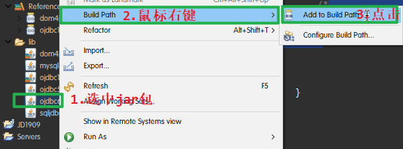
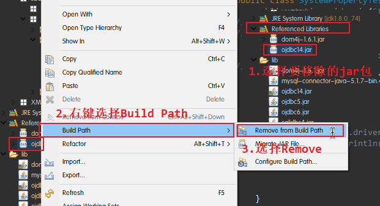
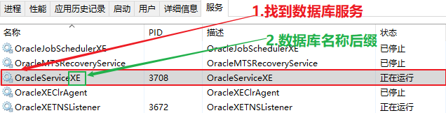

# JDBC
作者:乐乐

## 第一章 `JDBC`的概述
### (一).`JDBC`概念
#### 1.`JDBC API`
Sun公司提供的一套标准的数据访问接口，用来访问关系型数据库。另外，它包含了一部分类和接口，属于Java语言的一部分。
#### 2.`JDBC`可以做什么
(1)连接数据库
(2)发送sql语句到数据库
(3)处理结果集
#### 3.`JDBC API`的内容
Java应用程序开发接口(提供给用户)
Java驱动开发接口(实现公共接口功能，各大数据库厂商做)
### (二).数据库连接的方式
常见有两种: ODBC和JDBC，分属两个不同的阵营。
其中JDBC是java版本的ODBC
#### 1.`ODBC`
ODBC(Open Database Connectivity)开放的数据库连接方式，由微软开发出来。是一套公共的接口(标准)，用来连接数据库。
#### 2.`JDBC`
JDBC是一套标准(接口)，用来连接关系型数据库。各个数据库厂商去实现具体的功能，用户使用时使用相同一套标准即可。但是在使用时得导入不同公司提供的包(里面包含了具体实现)。
### (三).`JDBC`驱动
`JDBC`驱动其实就是一组类和接口的集合，实现了`JDBC`相关的功能。`JDBC`相关的驱动都存放在`java.sql.Driver;`包中
`JDBC`驱动提供了特定厂商对`JDBC API`接口类的实现，驱动必须要提供`java.sql`包下面这些类的实现：`Connection`，`Statement`，`PreparedStatement`，`CallableStatement`，`ResultSet`和`Driver`.
#### 1.`JDBC`驱动的分类
共有四种类型:`JDBC-ODBC`桥、本地`API`驱动、网络协议驱动和本地协议驱动。
#### 2.`JDBC-ODBC`桥
`JDBC-ODBC`桥是`sun`公司提供的，是jdk提供的的标准API.【底层是借助ODBC】实现功能，缺陷是效率较低，还得必须安装ODBC驱动。
(1)这种类型的驱动实际是把所有JDBC的调用传递给ODBC ,再由ODBC调用本地数据库驱动代码.(本地数据库驱动代码是指 由数据库厂商提供的数据库操作二进制代码库,例如在oracle for windows中就是oci dll文件).
(2)只要本地机装有相关的ODBC驱动那么采用JDBC-ODBC桥几乎可以访问所有的数据库,JDBC- ODBC方法对于客户端已经具备ODBC driver的应用还是可行的.
(3)但是,由于JDBC-ODBC先调用 ODBC再由ODBC去调用本地数据库接口访问数据库.所以,执行效率比较低,对于那些大数据量 存取的应用是不适合的.而且,这种方法要求客户端必须安装ODBC 驱动,所以对于基于 internet ,intranet的应用也是不合适的.因为,你不可能要求所有客户都能找到ODBC driver.
#### 3.本地`API`驱动
本地API驱动直接把JDBC调用转变为数据库的标准调用再去访问数据库.效率比`JDBC-ODBC`桥高，但得需要额外的数据库工具。
这种方法需要本地 数据库驱动代码、本地API驱动、厂商DB代码。这种驱动比起JDBC-ODBC桥执行效率大大提高了.但是,它仍然需要在客户端加载数据库厂商 提供的代码库.这样就不适合基于internet的应用.并且,他的执行效率比起其他的JDBC驱动 还是不够高.
#### 4.网络协议驱动
这种驱动实际上是根据我们熟悉的三层结构建立的. JDBC先把对数局库的访问请求传递给网 络上的中间件服务器. 中间件服务器再把请求翻译为符合数据库规范的调用,再把这种调用 传给数据库服务器.如果中间件服务器也是用java开发的,那么在在中间层也可以使用上面说的那俩种驱动类型 JDBC驱动程序作为访问数据库的方法.
网络协议驱动----->中间件服务器----->数据库Server
由于这种驱动是基于server的.所以,它不需要在客户端加载数据库厂商提供的代码库.而且 他在执行效率和可升级性方面是比较好的.因为大部分功能实现都在server端,所以这种驱动 可以设计的很小,可以非常快速的加载到内存中. 但是,这种驱动在中间件层仍然需要有配置 其它数据库驱动程序,并且由于多了一个中间层传递数据,它的执行效率还不是最好.
#### 5.本地协议驱动
(我们现在使用的`JDBC`驱动一般都是这种类型)
这种驱动直接把`JDBC`调用转换为符合相关数据库系统规范的请求.这种驱动写的应用可以直接和数据库服务器通讯.这种类型的驱动完全由java实现,因此实现了平台独立性. 本地协议驱动------>数据库Server
由于这种驱动不需要先把`JDBC`的调用传给`ODBC`或本地数据库接口或者是中间层服务器.所以它的执行效率是非常高的.而且,它根本不需要在客户端或服务器端装载任何的软件或驱动. 这种驱动程序可以动态的被下载.但是对于不同的数据库需要下载不同的驱动程序(驱动实现`jar`包).
## 第二章 `JDBC`相关操作
### (一).`JDBC`数据库相关类和接口
`Driver`驱动接口
`DriverManager`类 驱动管理器
`Connection`数据库连接
`Statement`操作语句`PreparedStatement`、`CallableStatement`
`ResultSet`结果集
`DatabaseMetadata`数据库信息(包含数据库有哪些表，视图，列，类型等信息，由表反向生成类)
`ResultSetMetadata`结果集信息
Types类型【类】(数据库表类型与java代码中类型`String`,`int`,`double`等的对应)
jdbc开发接口，存在于两个包下，其中`java.sql包`下实现了基本功能；剩余部分存在于`javax.sql包`中，实现扩展功能。
### (二).JDBC操作流程
有6个固定的步骤，按照步骤操作即可。
#### 1.注册驱动
驱动：具体功能实现,实现了接口
注册驱动的三种方案
##### (1)使用类加载器
`OracleDriver`类中的`static`静态代码块随着类加载，自动创建一个对象
```java
// 全限定名 包名+类名:oracle.jdbc.driver.OracleDriver
String className = "oracle.jdbc.driver.OracleDriver";
try {
// 通过反射的方式，实现类加载，注册驱动
	Class.forName(className);
} catch (ClassNotFoundException e) {
	e.printStackTrace();
}
```
##### (2)使用`new`关键字，实例化一个驱动对象
`new`一个`OracleDriver`的对象，通过`DriverManager`驱动管理器，调用静态方法`registerDriver`注册驱动
```java
// new 一个OracleDriver对象
Driver driver = new OracleDriver();
try {
	// 驱动管理器注册驱动
	DriverManager.registerDriver(driver);
} catch (SQLException e) {
	e.printStackTrace();
}
```
##### (3)使用`Property()`方法注册
###### <1>`K,V`键值注册
固定格式，通过`k,v`的形式注册
```java
// Oracle数据库固定格式，System.setProperty(K,V)方法注册驱动
System.setProperty("jdbc.drivers", "oracle.jdbc.driver.OracleDriver");
// System.getProperties()方法拿到注册的驱动
System.getProperties().forEach((k, v) -> System.out.println(k + "\t" + v));
```
###### <2>给`JVM`传参
通过给`JVM`传递`K.V`参数，注册驱动
传参格式:`javac -D[K=V]`
`Oracle`数据库传参
`javac -Djdbc.drivers=oracle.jdbc.driver.OracleDriver`
通过`System.getProperty(K)`方法拿到传递的值
`System.out.println(System.getProperty("jdbc.drivers"));`
##### (4)驱动jar包
jar包下载地址
Oracle数据库驱动程序下载地址:https://www.oracle.com/database/technologies/jdbc-drivers-12c-downloads.html
MySQL数据库驱动下载地址:https://dev.mysql.com/downloads/connector/j/
SQLServer数据库驱动下载地址:https://www.microsoft.com/en-us/download/details.aspx?id=55539
`ojdbc5.jar``Oracle11g`配套推出的
`ojdbc6.jar``Oracle11g`配套推出
`ojdbc14.jar``Oracle10g`发布时配套推出的
14、5、6与JDK的版本有关系，14是1.4版本以上，ojdbc5.jar得jdk5,ojdbc6.jar得用jdk6及其以上版本。
导入与移除jar包驱动的步骤
1>项目下新建文件夹`lib`将对应的`jar`包驱动复制到`lib/`下
2>找到要使用的jar包驱动,鼠标右键`Build Path`
3>添加`jar`包，选择`Add to Build Path`

4>移除`jar`包，找到`Referenced Libraries`,选择要移除的jar包，右键`Build Path`,选择`Remove from Build Path`.

#### 2.建立数据库连接
##### (1)`JDBC`连接类型
###### <1>`JDBC OCI`
`oci`是oracle call interface的缩写，此驱动类似于传统的`ODBC`驱动。
它需要Oracle Call Interface and Net8，所以它需要在运行使用此驱动的JAVA程序的机器上安装客户端软件，其实主要是用到`orcale`客户端里以`dll`方式提供的`oci`和服务器配置。
###### <2>`JDBC Thin`
`thin`是`for thin client`的意思，这种驱动一般用在运行在WEB浏览器中的JAVA程序。
它不是通过OCI or Net8，而是通过Java sockets进行通信，是纯java实现的驱动，因此不需要在使用`JDBC Thin`的客户端机器上安装orcale客户端软件，所以有很好的移植性，通常用在web开发中。
一般情况下，我们选择`thin`这种方式进行服务器连接。
##### (2)`JDBC`四要素
###### <1>数据库驱动
声明驱动地址，方便注册驱动
格式
`String var = "jar包Driver类全限定包名";`
例如:
```java
// Oracle 数据库驱动地址
String driver = "oracle.jdbc.driver.OracleDriver";

// SQLServer 数据库驱动地址
String driver = "com.microsoft.sqlserver.jdbc.SQLServerDriver";

// MySQL 数据库驱动地址
String driver = "com.mysql.jdbc.Driver";
```
###### <2>`Url`地址
用来确定具体连接到哪个数据库
格式
`String var = jdbc:oracle:[JDBC连接类型]:@[ip]:[post]:[数据库服务名称后缀];`
数据库服务名称查看
找到对应数据库的服务，查看服务名称后缀。


例如:
```java
// Oracle 数据库url地址
// jdbc:oracle:oci:@<SID>  oci连接方式
// jdbc:oracle:thin:@<SID> thin连接方式
String url = "jdbc:oracle:thin:@127.0.0.1:1521:XE";

// SQLServer 数据库url地址
String url = "jdbc:sqlserver://127.0.0.1:1433; DatabaseName=[数据库名称]";

// MySQL 数据库url地址
String url = "jdbc:mysql://127.0.0.1:3306/test";
```
###### <3>数据库登录用户名
数据库中已经注册的用户名
格式
`String user = "用户名";`

>SQLServer数据库默认用户名为`sa`,即:`String var = "sa";`

例如:`String user = "lele";`
###### <4>数据库登录密码
数据库中已经注册的用户名匹配的密码
格式
`String password = "密码";`

例如:`String password = "lele";`
##### (3)数据库连接方式
###### <1>使用`DriverManager`驱动管理器连接
```java
/*前面省略注册驱动的步骤，几种注册方式都可以*/

// 定义数据库url地址,登录数据库的用户名和密码
String url = "";
String user = "lele";
String password = "lele";

/*使用两参方法*/

// 使用Properties对象，传入用户名和密码
Properties info = new Properties();
info.setProperty("user", user);
info.setProperty("password", password);
// DriverManager调用方法，传入url，用户名和密码，连接数据库
Connection conn = DriverManager.getConnection(url,info);

/*使用三参方法*/
// 三参方法直接传入地址，用户名和密码
Connection conn = DriverManager.getConnection(url, user, password);
```
###### <2>使用`Driver`类连接
这种方法只能使用`new`对象的方式注册驱动
```java
// 创建Driver类的对象
Driver driver = new OracleDriver();
// 1.注册驱动
DriverManager.registerDriver(driver);

// 连接数据库的url，用户名和密码
String url = "";
String user = "";
String password = "";

// 将用户名和密码传给Properties对象
Properties info = new Properties();
info.setProperty("user", user);
info.setProperty("password", password);
// 使用driver对象调用connect()方法，传入url和Properties对象连接数据库
Connection conn = driver.connect(url, info);

// 这里也可以使用DriverManager调用getConnection()方法连接数据库
```
##### (4)数据库连接不成功解决方案
###### <1>检查`JDBC`四要素是否写错
`JDBC`四要素都是字符串，写错了，并不会提示错误，反复检查是否正确
###### <2>查看数据库服务是否已经启动
数据库服务正常启动，是连接数据库的必要条件
###### <3>系统防火墙影响
防火墙可能会影响数据库的连接，尝试关闭防火墙
###### <4>驱动与JDK环境不匹配
尝试换个jar包连接
###### <5>其他注意事项
1>Oracle数据库安装路径不能出现中文
2>安装成功数据库后，不能修改计算机用户名
3>还是无法解决，尝试重装Oracle,或者操作系统
#### 3.创建`Statement`对象
(可以进行`sql`语句执行)


#### 4.执行`SQL`语句
(增删改查)
```java
execute(sql);
	boolean true false
	有没有结果集

executeUpdate(sql);
	DML语句
	返回int,表示影响了多少条数据
	insert 返回1


executeQuery(sql);
	ResultSet 结果集  select
```

#### 5.处理结果集
(如果有结果集的话)

```java
ResultSet
```


#### 6.关闭相应资源
调用close()方法关闭所有资源
包括JDBC连接对象，Statement对象，PrepareStatement对象

