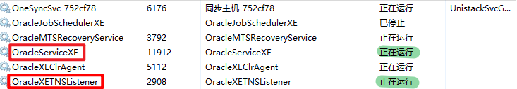
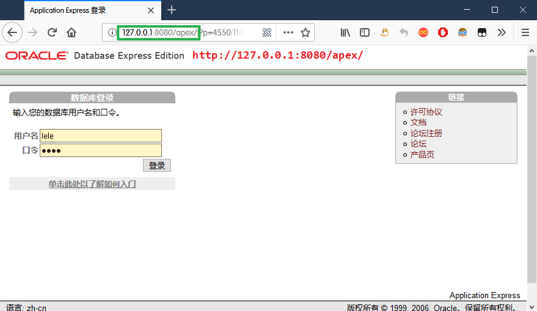
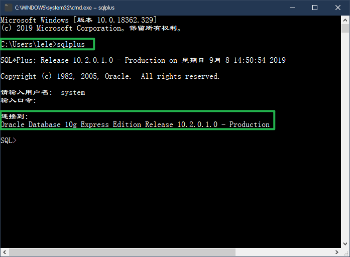
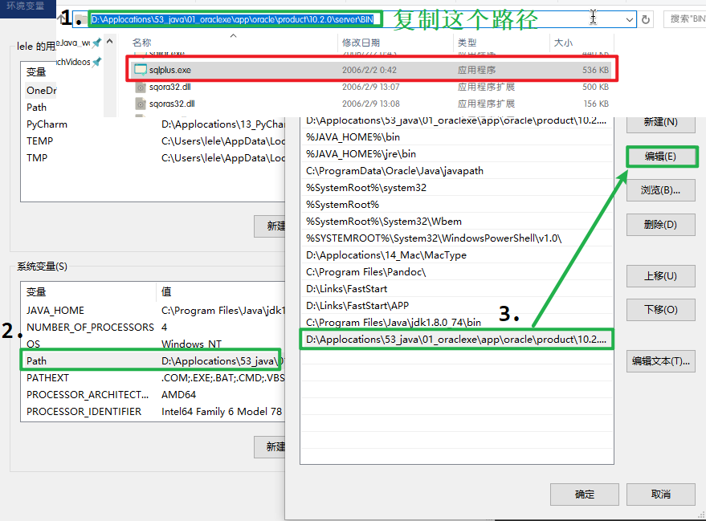
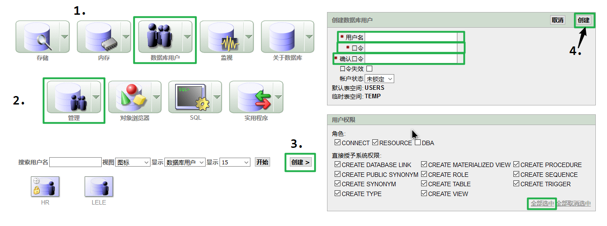
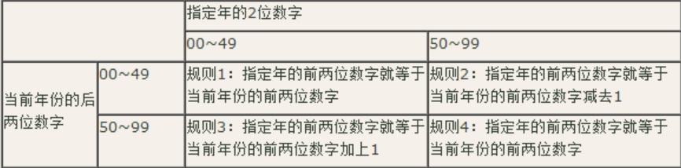

# `Oracle` 数据库

## 前言
### (一)一个认知
认知什么是`oracle`？
`oracle`：商业运用第一的关系型数据库
实质：关系型数据库
了解`oracle`数据库发展历史
### (二).二个概念
数据库：数据存储的仓库
关系型数据库：数据库中保存的对象之间可以存在一定的关联关系，并非完全独立。主要反映到以后学习的主外键.
### (三).三个名词
`sql`:结构化的查询语句，操作`oracle`数据库的语言
`sqlplus`:`oracle`软件自带的可以输入`sql`，且将`sql`执行结果显示的终端
`pl/sql`:程序化的`sql`语句，在`sql`语句的基础上加入一定的逻辑操作，如`if for...`,使之成为一个`sql`块，完成一定的功能
### (四).四种对象
`table`：表格，由行和列组成，列又称字段，每一行内容为表格的一条完整的数据。
`view`:  视图，一张表或者多张表的部分或者完整的映射，好比表格照镜子，镜子里面的虚像就是`view`
除去常见的`table`和`view`两种对象以外，`oracle`数据库还支持如下四种对象
`sequence`：序列
`index`：索引，提高数据的访问效率
`synonym`：同义，方便对象的操作
`program unit`：程序单元，`pl/sql`操作的对象
### (五).五种分类
(`sql`的五大分类:)
#### 1.`DQL`
`Data retrieval`数据查询
如:`select`
#### 2.`DML`
数据操纵语言（行级操作语言）,操作的是表格当中一条一条的数据
如:`insert` `update` `delete`
需要`commit`提交事务;
#### 3.`DDL`
数据定义语言（表级操作语言）：操作的内容为表格（对象）
如:`create` `alter` `drop` `truncate` `rename`
#### 4.`DTL`
`transaction control`：事务控制
如:`commit` `rollback` `savepoint`
#### 5.`DCL`
数据控制语言
如:`grant` `revoke`
## 环境搭建
### (一).安装`oracle`数据库
#### 1.安装数据库
直接点击下一步安装。
#### 2.设置数据库密码
安装过程中有一步让输入一个密码,这个密码是登录数据库的密码，必须熟记

>登录名:`system`，登录密码:安装数据库时设置的密码

#### 3.查看服务是否启动
安装完成之后,打开系统服务,查看服务是否已经正常启动

`OracleServiceXE`服务不启动的话,就无法使用`sqlplus`登录到`oracle`数据库中
`OracleXETNSListener`服务不启动的话,就无法使用`oracle`自带管理系统登录到数据库中,之后也无法使用`JDBC`连接到数据库中.
#### 4.`Oracle`管理系统登录
打开浏览器，输入地址:http://127.0.0.1:8080/apex/


>能打开这个页面必须保证Oracle正确安装，服务已经启动，8080端口号未被占用

#### 5.终端连接数据库
打开`cmd`,输入`sqlplus`,然后回车查看是否能执行该命令


>如果不能执行,说明没有`sqlplus`的环境变量，将`sqlplus`安装目录的`BIN/`配置到环境变量的`path`里面，再次打开`cmd`
>

#### 6.创建`oracle`用户
`system`用户的权利较大,可能会误操作，建议重新创建账户
(1)`Oracle`登录系统创建账户

(2)命令方式创建用户
创建用户:`create user [username] identified by [password];`
给用户授权：`grant connect,resource to [username];`
#### 7.导入数据
##### (1)登录数据库
注意登录数据库的路径，最好是要导入数据的sql文件所在的路径，或者是桌面:Desktop/
`sqlplus`
##### (2)修改会话环境语言
为了导入数据不乱码，不报错，需要将会话环境改成跟sql语句中的语言环境一致，再导入数据，导入完成，再改回来
###### <1>修改语言环境为简体中文
`alter session set nls_language='simplified chinese';`
###### <2>修改语言环境为English
`alter session set nls_language=english;`
##### (3)导入数据
`start *.sql`或者`@*.sql`
`start path/*.sql`
### (二).卸载`oracle`数据库
#### 1.正常卸载数据库
像其他软件一样正常卸载，最好是能彻底清除注册表
#### 2.删除`Oracle`服务
使用管理员权限打开命令提示窗口`cmd`
`sc [要删除服务的名字]`
特别是这个服务:`OracleServiceXE`
### (三).其它操作命令
`sqlplus`  `cmd`命令行登录数据库
`sqlplus user/password`  直接输入账户密码登录
`exit/quit`  退出登录数据库
`sqlplus "/as sysdba"`  以dba身份登录数据库(无需密码)
`show user` 显示当前登录用户
`password [username]`  无需密码，修改某个用户的密码
`$cls`Windows下的数据库清屏
`!clear`Ubuntu下的数据库清屏
`spool *.sql` 录制接下来的sql代码和结果，并保存到本地的`*.sql`文件中
`spool off`   结束录制操作
## 第一章 `select`语句，数据查询操作
`sql`语句采用三段式书写，且不区分大小写
例如:
```sql
select [colname]
from [tab_name]
where [conditions];
```
### (一).`select`查询
语法
```sql
select [col1],[col...]
from tb_name;
```
查看当前用户有哪些表
```sql
select table_name
from user_tables;
```

>`select * from table;`
>表示查询所有列，仅仅作为测试和学习使用，在企业用语中不出现，因为效率低下且可读性差

### (二).`select`运算
语法
```sql
select [col_name的运算]
from tb_name;
```
例如：查看每个员工的员工id，名字和年薪。
```sql
select id,last_name,salary*12
from s_emp;
```
注：`select`语句永远不对原始数据进行修改。
### (三).`select`别名
语法
```sql
select [old_colname] as [new_colname]
from tb_name;
select 原列名 新列名 from 表名;
```
注：不写`as`，默认也是别名，为了歧义，一般写上
例如:查看员工的员工`id`，名字和年薪,年薪列名为`annual`

```sql
select id,last_name,salary*12 as annual
from s_emp;
```
### (四).`||`拼接
`||`可以使得多列的值或者列和特殊的字符串合并到一个列进行显示
语法
```sql
select col_name1||'character'||col_name2
from tb_name;
```
或者
```sql
select col_name1||col_name2
from tab_name;
```
例如：查看员工的员工id，全名
```sql
select id,first_name||last_name
from s_emp;
```
### (五).`nvl()`函数
语法
```sql
select nvl(havenull_col_name,change_value)
from tb_name;
```
`havenull_col_name`,含有空值的列的列名，`change_value`如果有空值，显示的值
解释为:从表中查询数据，如果不是空值，原样输出，如果是空值，输出`change_value`.
例如：查看所有员工的员工id，名字和提成，如果提成为空，显示成0
```sql
select id,last_name,nvl(commission_pct,0) commission_pct
from s_emp;
```
### (六).`distinct`去重
语法
```sql
select distinct haveRepeat_col_name
from tb_name;
```
注：
`distinct`关键词只能放在`select`关键词后面
如果`distinct`关键词后面如果出现多列，表示多列联合去重，即多列的值都相同才会认为该记录重复.
### (七).`sqlplus`命令
`sqlplus`登录之后,可以使用buff(缓存)来存储、执行、修改要执行的`sql`语句
1.`buff`(缓存)的特点
(1).buff中只能存储一条`sql`语句(但是这条`sql`语句可能有很多行)
(2).每次放入新的`sql`语句,会把之前的覆盖掉
(3).每次执行`sql`语句,都会把这个`sql`语句放到`buff`里面
2.`buff`(缓存)常用命令
`l`查看缓存中的`sql`语句
`row_num` 直接输入行号，定位到该行
`a [command]` 在[定位]的那一行后面追加`command`
`i`   在[定位]的那一行下面插入新的一行
`c/需要替换的字符串/替换后的字符串 ` 替换[定位]的那一行中的某些字符串
`del` 删除[定位]的那一行内容
`row_num [command]`重写`row_num`这一行的内容为`command`
`ed` 用默认编辑器打开`buff`文件(文件会先创建在当前路径下)
`/`   执行`buff`(缓存)的`sql`命令
`clear buffer`:清空当前缓存的命令
`save *.sql`  将`buff`中的`sql`语句保存在`*.sql`文件中
`get *.sql`  把`*.sql`中的内容在加载到`buff`中,但是没有运行
`start *.sql`  把`*.sql`中的内容在加载到`buff`中并且执行
`@*.sql` 把`*.sql`中的内容在加载到`buff`中并且执行
`edit file_name`  使用系统默认编辑器去编辑文件
`exit` 退出`sqlplus`
### (八).`col`输出格式
语法
`COLUMN [col_name] FORMAT a[size];`
简写为:
`col [col_name] for a[size];`
`size`以字节为单位
如:`col last_name for a5;`
## 第二章 排序和限制查询
### (一).排序
排序，就是根据某个字段的值按照升序或者降序的情况将记录查询出来
字段顺序
```sql
select
from
where
order by
```
#### 1.语法
```sql
select [colname1],[...]
from tb_name
order by [col_name1],[colname2],[...] 排序关键字;
```
注：排序使用`order by`字句，该子句只对查询记录显示调整，并不改变查询结果，所以执行权最低，即最后执行。
#### 2.排序关键词
`asc`：升序（如果不加排序关键字，默认为升序排序）
`desc`：降序
`desc [tab_name];`查看该表的含义和字段(查看表结构)
#### 3.多子列排序
如果有多个列排序，首先排序的列排完以后，重复的值由下一列排序，以此类推。
### (二).限制查询
即指定查询条件进行查询
#### 1.语法
```sql
select col_name,...
from tb_name
where col_name 比较操作表达式
逻辑操作符
col_name 比较操作表达式
...;
```
注：
1>.限制查询条件，使用`where`子句
2>.条件可以多个，使用逻辑操作符和`()`进行条件的逻辑整合
3>.`where`子句的优先级别最高
4>.比较操作表达式由操作符和值组成
#### 2.表达式
##### (1).逻辑比较操作符
`=`、`>`、`<`、`>=`、`<=`、`!=`
不等于`!=`、`<>`、`^=`
注:不等于一般默认使用`!=`
例如：查看员工工资小于1000的员工id和名字
```sql
select id,last_name,salary
from s_emp
where salary < 1000;
```
##### (2).`sql`比较操作符
###### <1>`between and`
在什么范围之内
例如：查看员工工资在700 到 1500之间的员工id，和名字
```sql
select id,last_name,salary
from s_emp
where salary between 700 and 1500;
```
###### <2>`in()`
在这些值中
例如：查看员工号1,3,5,7,9员工的工资
```sql
select id,last_name,salary
from s_emp
where id in (1,3,5,7,9);
```
###### <3>`like`
模糊查询，即值不是精确的值的时候使用
通配符，即可以代替任何内容的符号
`regexp_like(colname,'[|n|N]')`
`regexp_like(colname,'^M')`
`%`：通配0到多个字符
`_`: 当且仅当通配一个字符
例如：查看员工名字以C字母开头的员工的id，工资。
```sql
select id,last_name,salary
from s_emp
where last_name like 'C%';
```
例如：查看员工名字长度不小于5，且第四个字母为n字母的员工id和工资
```sql
select id,last_name,salary
from s_emp
where last_name like '___n_%';
```
###### <4>转义字符`escape`
语法`... like '%a_%' escape 'a';`
默认为`\`,可以指定,指定的时候用`escape`指明即可,转义字符只能转义后面的一个字符
例如：查看员工名字中包换一个_的员工id和工资
```sql
select id,last_name,salary
from s_emp
where last_name like '%\_%' escape '\';
```
###### <5>`is null`
对`null`值操作操作符，不能使用`=`
例如：查看员工提成为为空的员工的id和名字
```sql
select id,last_name,commission_pct
from s_emp
where commission_pct is null;
```
##### (3).逻辑操作符
当条件有多个的时候使用
`and`：且逻辑
`or`：或逻辑
`not`：非逻辑
注意：`and`逻辑比`or`逻辑要高
例如：查看员工部门id为41且职位名称为Stock Clerk（存库管理员）的员工id和名字
```sql
select id,last_name,dept_id,title
from s_emp
where dept_id = 41
and
title = 'Stock Clerk';
```
## 第三章 单值函数
### (一).函数的分类
#### 1.单值函数
##### (1).字符函数
##### (2).日期函数
##### (3).转换函数
##### (4).数字函数
#### 2.分组函数
### (二).`dual`哑表
`dual`是一个虚拟表，用来构成`select`的语法规则，`oracle`保证`dual`里面永远只有一条记录。
例如:
显示1+1的结果,可以看出,`dual`很多时候是为了构成`select`的标准语法
`select 1+1 from dual;`
### (三).字符函数
#### 1.`lower()`字符转为小写
例如:把'HELLO'转换为小写
```sql
select lower('HELLO')
from dual;
```
#### 2.`upper()`字符转为大写
例如:把'world'转换为大写
```sql
select upper('world')
from dual;
```
查询`s_emp`表中名字为`Ngao`的人信息
```sql
--这样是查不到
select last_name,salary,dept_id
from s_emp
where last_name='NGAO';
--这样就可以查询到了
select last_name,salary,dept_id
from s_emp
where upper(last_name)='NGAO';
```
#### 3.`initcap()`字符串是首字母转大写
例如:把'hELLO'转换为首字母大写,其余字母小写
```sql
select initcap('hELLO')
from dual;
```
#### 4.`concat()`拼接字符串
`concat(args1,args2)`拼接字符串(等同于`||`)
只能有两个参数，可以嵌套
例如:将`last_name`和`first_name`用.拼接起来
```sql
select concat(last_name||'.',first_name)
from s_emp;
```
#### 5.`substr()`截取字符串
`substr(要截取字符串的列名,从哪开始截,截取几个字符长度(可选))`
从1开始，包含当前位置，正数从左往右截取，负数从右往左截取
例如:截取'hello'字符串,从第2个字符开始(包含第二个字符),截取后面连续的3个字符
```sql
select substr('hello',2,3)
from dual;
```
#### 6.`length()`获得字符串长度
`length([要获得长度的内容])`
例如:获得'world'字符串的长度
```sql
select length('world')
from dual;
```
#### 7.`nvl()`替换空值
### (四).数字函数
#### 1.`round()`四舍五入保留位数
`round(arg1,arg2)`
第一个参数表示要进行四舍五入操作的数字
第二个参数表示保留到哪一位
`0`或者不写，保留整数
正数，小数点之后保留，保留几位小数
`-1`，小数点之前，保留到个位
例如:
```sql
-- 保留到小数点后面2位
select round(45.923,2)
from dual;

-- 保留到个位 (个十百千万...)
select round(45.923,0)
from dual;

--保留到十位 (个十百千万...)
select round(45.923,-1)
from dual;
```
#### 2.`trunc()`截取到某一位
`trunc(arg1,arg2)`
和`round()`的用法一样,但是`trunc`只舍去不进位
例如:
```sql

--截取到小数点后面2位
select trunc(45.929,2)
from dual;

--截取到个位 (个十百千万...)
select trunc(45.923,0)
from dual;

--截取到十位 (个十百千万...)
select trunc(45.923,-1)
from dual;
```
#### 3.`mod()`取余
`mod(arg1,arg2)`
第一个参数表示要进行取余操作的数字
第二个参数表示参数1和谁取余
例如:
```sql
--把10和3进行取余 (10除以3然后获取余数)
select mod(10,3)
from dual;
```
### (五).日期函数
`oracle`的日期格式:世纪，年月日时分秒
默认日期格式:`DD-MON-YY`
中文:'06-9月-19'
英文:'06-SEP-19'
#### (1).`sysdate`系统的当前日期
注意:`sysdate`进行加减操作的时候,单位是天
例如:
```sql
-- 显示时间:当前时间
select sysdate from dual;

-- 显示时间:明天的这个时候
select sysdate+1 from dual;

-- 显示时间:昨天的这个时候
select sysdate-1 from dual;

-- 显示时间:1小时之后的这个日期
select sysdate+1/24 from dual;
```
#### (2).`months_between(time1,time2)`相差几个月
`time1`和`time2`相差几个月，单位是月.
例如:
```sql
-- 30天之后和现在相差多少个月
select months_between(sysdate+30,sysdate)
from dual;
```
#### (3).`add_months(time,addtime)`返回往后推几个月的时间
返回一个日期数据,表示一个时间点,`time`往后推`addtime`的时间
正数往后推，负数往前推.
例如:
```sql
-- '01-2月-2019'往后推2个月
select add_months('01-2月-2019',2)
from dual;

-- 当前时间往后推4个月
select add_months(sysdate,4)
from dual;
```
#### (4).`next_day(time,'week')`离这个时间点最近的下一个星期几是哪一天
`week`必须是星期(周一到周日)
返回一个日期数据,表示`time`时间后,最近的`week`是哪一天.
例如:
```sql
-- 离当前时间最近的下一个星期5是哪一个天
select next_day(sysdate,'星期五')
from dual;
```
注:如果要使用英文星期,那么需要把当前会话的语言环境修改为英文
#### (5).`last_day(time)`返回该月的最后一天
返回一个日期数据,表示`time`所在月份的最后一天
例如:
```sql
-- 当前日期所在月份的最后一天(月底)
select last_day(sysdate)
from dual;
```
#### (6).`round(time,'format')`对日期进行四舍五入
对`time`四舍五入(从本月的最中间分开)到`format`,返回操作后的日期数据
例如:
```sql
-- 把当前日期四舍五入到月
select round(sysdate,'MONTH')
from dual;
-- 测试:15号16号分别是舍弃还是进位

-- 把当前日期四舍五入到年
select round(sysdate,'YEAR')
from dual;

-- 这个写法是错误的
-- 数字函数也有一个round
-- 俩个ronnd函数有冲突
-- 所以这里不能使用默认的日期格式
select round('01-2月-2019','MONTH')
from dual;
```
#### (7).`trunc()`截取日期
只舍弃不进位
### (六).类型转换函数
#### (1).日期格式和千年虫
##### <1>日期格式
`yyyy`：四位数的年份
`rrrr`：四位数的年份
`yy`：两位数的年份
`rr`：两位数的年份
`mm`：两位数的月份（数字）
`D`：一周的星期几
`DD`：一月的第几天
`DDD` ：一年的第几天
`YEAR`：英文的年份
`MONTH`：英文全称的月份
`mon`：英文简写的月份
`ddsp`：英文的第几天(一个月的)
`ddspth`：英文序列数的第几天(一个月的)
`DAY`：全英文的星期
`DY`：简写的英文星期
`hh`：小时
`mi`：分钟
`ss`：秒
##### <2>千年虫
>在早期的计算机的程序中规定了的年份仅用两位数来表示。也就是说，假如是1971年，在计算机里就会被表示为71，但是到了2000年的时候这个情况就出现了问题，计算机就会将其年份表示为00。这样的话计算机内部对年份的计算就会出现问题。这个事情当时被称为千年虫

数据库中表示日期中年份的方式有两种: `yy`和`rr`,之前一直使用的是`yy`格式,后来才有的`rr`格式
`yy`表示使用一个两位数表示当前年份，例如:
1990 ---yy数据库格式---> 90
1968 ---yy数据库格式---> 68
1979 ---yy数据库格式---> 79

`rr`格式表示:
如果日期中的年份采用的格式为`rr`，并且只提供了最后2位年份，那么年份中的前两位数字就由两部分共同确定：提供年份的两位数字(指定年)，数据库服务器上当前日期中年份的后2位数字(当年)。确定指定年所在世纪的规则如下：
规则1 如果指定年在00~49之间，并且当前年份在00~49之间，那么指定年的世纪就与当前年份的世纪相同。因此，指定年的前两位数字就等于当前年份的前两位数字。例如，如果指定年为15，而当前年份为2007，那么指定年就是2015。

规则2 如果指定年在50~99之间，并且当前年份在00~49之间，那么指定年的世纪就等于当前年份的世纪减去1。因此，指定年的前两位数字等于当前年份的前两位数字减去1。例如，如果指定年为75，而当前年份为2007，那么指定年就是1975。

规则3 如果指定年在00~49之间，并且当前年份在50~99之间，那么指定年的世纪就等于当前年份的世纪加上1。因此，指定年的前两位数字等于当前年份的前两位数字加上1。例如，如果指定年为15，而当前年份为2075，那么指定年就是2115。

规则4 如果指定年在50~99之间，并且当前年份在50~99之间，那么指定年的世纪就与当前年份的世纪相同。因此，指定年的前两位数字就等于当前年份的前两位数字。例如，如果指定年为55，而当前年份为2075，那么指定年就是2055。

注意:`rr`格式并没有完全的解决两位数年份保存的问题,只能保证不跨世纪的年份保存不出问题

##### <3>`oracle`数据库中表示日期数据的方式
1>使用`sysdate`
2>使用`oracle`默认的日期格式 例如:`25-MAY-95`,注意要看当前的语言环境
3>使用日期函数`ADD_MONTHS/NEXT_DAY/LAST_DAY/ROUND/TRUNC`
#### (2).`to_char(date,'format')`把日期或者数字转换为字符串
例如:
```sql
-- 每个格式的输出
select to_char(sysdate,'yyyy yy MM D DD DDD YEAR MONTH mon ddsp ddspth DAY DY')
from dual;
-- answer:2019 19 09 6 06 249 TWENTY NINETEEN 9月  9月  six sixth 星期五 星期五

-- 把当前日期按照指定格式转换为字符串
select to_char(sysdate,'yyyy')
from dual;

-- 12小时显示时分秒
select to_char(sysdate,'hh mi ss')
from dual;

-- 24小时显示时分秒
select to_char(sysdate,'hh24 mi ss')
from dual;

-- 24小时显示时分秒
select to_char(sysdate,'hh24:mi:ss')
from dual;
16:16:00

fm表示去除结果显示中的开始的空格
L表示系统本地的货币符号

-- 靠左对齐美元
select to_char(salary,'fm$999,999.00')
from  s_emp;

-- 本地货币靠左对齐
select to_char(salary,'fmL999,999.00')
from  s_emp;
```
#### (3).`to_number`把字符串数字转换为数字
例如
```sql
-- 把字符1000转换为数字1000
select to_number('1000')
from dual;
```
#### (4).`to_date`把字符转换为日期
此处务必要注意日期格式是不是正确，格式个当前会话环境是不是匹配
例如
```sql
select to_date('10-12-2019','dd-mm-yyyy')
from dual;
-- 结果:10-12月-19

select to_date('25-5月-95','dd-month-yy')
from dual;
-- 结果:25-5月 -95

select to_date('95/5月/25','yy/month/dd')
from dual;
-- 结果:25-5月 -95

-- 遇到格式和会话环境不匹配，可以先改会话环境，执行后，再改回来。支持多条sql语句一起执行
-- 修改会话环境为英文
alter session set nls_language=english;
-- 插入数据
select to_date('25-MAY-95','dd-MONTH-yy')
from dual;
-- 会话环境改成中文
alter session set nls_language='simplified chinese';
-- 25-MAY-95
-- 会话已更改。
```
## 第四章 多表查询
多表查询，又称表联合查询，即一条sql语句涉及到的表有多张，数据通过特定的连接进行联合显示.
### (一).笛卡尔积
在数学中，两个集合`X`和`Y`的笛卡尓积(Cartesian product),又称直积，表示为`X × Y`.
假设集合`A={a, b}`，集合`B={0, 1, 2}`，则两个集合的笛卡尔积为`{(a, 0), (a, 1), (a, 2), (b, 0), (b, 1), (b, 2)}`。
在数据库中,如果直接查询俩张表,那么其查询结果就会产生笛卡尔积
例如
```sql
-- 联合查询两张表的所有字段，不做任何关联处理
select *
from s_emp,s_dept;
```
### (二).连接查询
为了避免在多表查询中笛卡尔积的产生，我们可以使用连接查询来解决这个问题
#### 1.等值连接
利用一张表中某列的值和另一张表中某列的值相等的关系,把两张表连接起来。
```sql
-- 指定是哪张表的哪个列
select se.last_name,se.dept_id,sd.id,sd.name
-- 为了不产生歧义，需要给两张表起别名
from s_emp se,s_dept sd
-- 把s_emp的dept_id列和s_dept表中的id列做等值连接
where se.dept_id=sd.id;
```
#### 2.不等值连接
查询的某个数据在指定的范围内
例如:
```sql
-- 查询出员工的名字、职位、工资、工资等级名称
SELECT  e.last_name, e.title, e.salray, s.gradeName
FROM    s_emp e, salgrade s
-- salray在losal和hisal之间的数据
WHERE   e.salray BETWEEN s.losal AND s.hisal
```
#### 3.外连接
两张表中各有一部分数据没法相互关联，使用等值连接无法查询出全部符合条件的数据，这时候就要用到外连接，例如：新员工tom不在任何部门,新增部门st下面没有任何员工
##### (1).左外连接
`from`关键字后面左边的表数据多，就是左外连接
例如
```sql
-- 查询所有员工 以及对应的部门的名字,没有部门的员工也要显示出来
-- 有一位员工没有部门，s_emp表中比s_dept表中数据多，所以要在s_dept表中模拟出一部分数据，与s_emp表中的数据对应
select last_name,dept_id,name
from s_emp left outer join s_dept
on s_emp.dept_id=s_dept.id;

注:outer可以省去不写

-- 简写方式
-- 哪边表的数据少，就在哪边表的等值条件后面写上(+),意思上加上模拟的数据，与左边的表对应

select last_name,dept_id,name
from s_emp,s_dept
where s_emp.dept_id=s_dept.id(+);
```
##### (2).右外连接
`from`关键字后面右边的表数据多，就是左外连接
例如
```sql
-- 查询所有员工 以及对应的部门的名字,没有任何员工的部门也要显示出来
select last_name,dept_id,name
from s_emp right outer join s_dept
on s_emp.dept_id=s_dept.id;

注:outer可以省去不写

--简写方式
-- 员工表中没有数据与部门表对应，员工表中的数据少，就在员工表后面加(+)
select last_name,dept_id,name
from s_emp,s_dept
where s_emp.dept_id(+)=s_dept.id;
```
##### (3).全连接
两张表都有数据，互相没有关联，要把所有的数据都显示出来，就要使用全连接
例如
```sql
-- 查询所有员工 以及对应的部门的名字,没有任何员工的部门也要显示出来,没有部门的员工也要显示出来
select last_name,dept_id,name
from s_emp full outer join s_dept
on s_emp.dept_id=s_dept.id;

注:outer可以省去不写
```
#### 4.自连接
同一张表中，筛选出本表中的数据
例如
```sql
-- 查询每个员工的名字以及员工对应的管理者的名字
select s1.last_name,s2.last_name manager_name
from s_emp s1,s_emp s2
where s1.manager_id = s2.id;
```
#### 5.对查询结果集的操作
如果有多条sql语句,每一条sql都可以查询出一个结果,这个被称之为结果集。那么我们可以使用下面的关键字对俩个结果集进行操作，注意:两个结果集查询出来的列要完全一致
##### (1)`union`并集
对结果集求并集
```sql
select [col_name]...
from [tab_name]...
where [rule]
union
select [col_name]...
from [tab_name]
where [rule]
```
例如
```sql
select last_name,dept_id,name
from s_emp,s_dept
where s_emp.dept_id=s_dept.id(+)
union
select last_name,dept_id,name
from s_emp,s_dept
where s_emp.dept_id(+)=s_dept.id;
```
##### (2)`union all`合在一起显示
例如
```sql
select last_name,dept_id,name
from s_emp,s_dept
where s_emp.dept_id=s_dept.id(+)
union all
select last_name,dept_id,name
from s_emp,s_dept
where s_emp.dept_id(+)=s_dept.id;
```
##### (3)`minus`除去与第二个结果集相同的部分
例如
```sql
select last_name,dept_id,name
from s_emp,s_dept
where s_emp.dept_id=s_dept.id(+)
minus
select last_name,dept_id,name
from s_emp,s_dept
where s_emp.dept_id(+)=s_dept.id;
```
##### (4)`intersect`交集
```sql
select last_name,dept_id,name
from s_emp,s_dept
where s_emp.dept_id=s_dept.id(+)
intersect
select last_name,dept_id,name
from s_emp,s_dept
where s_emp.dept_id(+)=s_dept.id;
```
##### (5)伪列`rownum`
伪列`rownum`，就像表中的列一样，但是在表中并不存储。伪列只能查询，不能进行增删改操作。它会根据返回的结果为每一条数据生成一个序列化的数字.`rownum`是`oracle`才有的伪列
##### <1>`rownum = 1`
`rownum`只能等于`1`,等于其他数，查不出数据
例如
```sql
select last_name
from s_emp
where rownum = 1
```
##### <2>`rownum > 0`
只能大于`0`,大于其他数，查不到数据
例如
```sql
select last_name
from s_emp
where rownum > 0
```
##### <3>`rownum < 任何数`
例如
```sql
select last_name
from s_emp
where rownum < 7
```
## 第五章 组函数
### (一).组函数
组函数:也叫分组函数,是指将数据按照某列的值进行分组后，使用组函数分别对每个分好的小组中的数据进行处理。所以组函数一般要结合着分组关键字`group by`来使用
#### 1.组函数
|    组函数    |       用途       |
| :----------: | :--------------: |
|   `avg()`    |     求平均值     |
|  `count(*)`  | 计算有多少条数据 |
|   `max()`    |      最大值      |
|   `min()`    |      最小值      |
|   `sum()`    |       求和       |
|  `stddev()`  |      标准差      |
| `variance()` |       方差       |
#### 2.`sql`语句各部分构成
```sql
select ...
from ...
where ...
group by ...
having ...
order by ...
```
注:除了`select`和`from`之外其他的都不是必须的。
`sql`语句执行顺序为
`from`-->`where`-->`group by`-->执行组函数-->`having`筛选->`order by`
#### 3.组函数出现的位置
(1)`select`后面
(2)`having`后面
(3)`order by`后面
(4)`where`后面一定`不能`出现组函数
#### 4.`where`和`having`对比
(1).`where`和`having`都是做条件筛选的
(2).`where`执行的时间比`having`要早
(3).`where`后面不能出现组函数
(4).`having`后面可以出现组函数
(5).`where`语句要紧跟`from`后面
(6).`having`语句要紧跟`group by`后面
### (二).`group by`分组
在查询表中数据的时候进行分组的关键字
如果`select`语句中出现了没有被组函数修饰的列，没有被修饰的列也要放在`group by`后面
语法
```sql
-- 单独使用group by
select [colname1],组函数([colname2])
from tab_name
group by [colname1];
```
### (三).`having`筛选
分组之后进行进一步数据筛选的关键字
注:`having`和`where`的功能类似,但是`where`比`having`的效率要高
如果出现了`having`语句，`having`语句前面一定要写`group by`语句
特别注意:有`having`语句，必须要写`group by`语句，但是一般书写顺序是`having`语句写在`group by`语句的后面，这是规范，并不代表`having`语句必须写在`group by`语句的后面，顺序是可以交换的，也是可以正常执行的。
语法
```sql
/*只出现having语句*/
select [col_name1],组函数([col_name2])
from tab_name
group by [col_name1]
having 组函数([col_name2])限制条件;

/*跟where连用，多表查询*/
-- 根据两张表筛选查询不同的字段
select a.[foreignKey_col],组函数([a.col_name]),[b.col_name1],[b.col_name2]
-- 为防止产生歧义，给两张表起别名
from tab_name1 a,tab_name2 b;
-- 将两张表做等值连接
where a.[foreignKey_col] = b.id
-- select语句中不被组函数修饰的列，放到group by后面
group by a.[foreignKey_col],[b.col_name1],[b.col_name2]
-- having对组函数做条件限制
having 组函数([a.col_name])限制条件
```
## 第六章 子查询(嵌套查询)
子查询，即一个`select`语句中嵌套了另外的一个或者多个`select`语句
基本格式
```sql
-- 嵌套是没有层数的
select [查询的信息]
from [tab_name]
where [查询条件](
	select [条件的结果]
	from [tab_name]
	where [条件](
		[题目给出的条件]
	)
)
```
子查询也可以使用连接查询搞定！子查询的结果是可以当做一张表来使用的
例如
```sql
/*查询工资比Simth工资高的员工信息*/

-- 第一步:查询Smith的工资数
select salary
from s_emp
where last_name='Smith';
/*结果:
	SALARY
----------
	   940
*/
-- 第二步:查询工资比940高的员工信息
select last_name,salary
from s_emp
where salary>940;

-- 第三步:把第二步中的数字940替换成第一步中的sql语句即可(注意格式)
select last_name,salary
from s_emp
where salary>(
	select salary
	from s_emp
	where last_name='Smith'
);
```
## 第七章 数据建模和数据库设计
### (一).软件开发的步骤
1.需求分析
2.系统设计
3.编码实现
4.系统测试
5.运行维护
系统设计中一个重要的环节就是数据库设计
数据库设计的时候需要先进行数据建模(实体关系图 E-R图)
数据建模的依据就是前期所做的需求分析
### (二).实体-关系图
`实体-关系`图(Entity Relationship Diagram),也称为`E-R`图,提供了表示实体、属性和关系的方法，用来描述现实世界的概念模型。
#### 1.E-R图
构成`E-R`图的基本要素是实体、属性和关系
`实体(Entity)`：实体用来表示具有相同特征和性质的事物(类似于java的类)，实体由实体名和实体属性来表示。
`属性(Attribute)`：实体所具有的某一特性，一个实体可以有若干个属性
`关系(Relationship)`：实体彼此之间相互连接的方式称为关系。
#### 2.实体间的关系
##### (1).3 种关系类型
一对一关系 (1 ∶ 1)
一对多关系 (1 ∶ N)
多对多关系 (M ∶ N)
##### `may-be` 和`must-be`
在实体与实体之间的关系中,都会存在着`may-be`和`must-be`这两种情况
例如:
系统中有顾客和订单俩个实体(1:N关系),一个顾客对应多个订单,一个订单对应一个顾客,而且一个顾客可以(may be)没有订单和他对应,一个订单一定(must be)会有顾客和它对应.
### (三).数据库设计
#### 1.`E-R`图与数据库中表的转换
数据建模完成之后,可以把E-R图转换成数据中的表
(1).实体的名字转换为表的名字
(2).实体的属性转换为表中的列
(3).具有唯一特点的属性设置为表中的主键
(4).根据实体之间的关系设置表中某些列为外键列(主外键关联)
注:第四步主要是实体关系转换成表关系
#### 2.`E-R`图中符号的含义
(1)`#`:唯一,以后可能表示为主键
(2)`*`:非空
(3)`o`:可有可无
(4)`虚线`: may be顾客这边虚线，顾客可能没有订单
(5) `实线`:must be订单这边实线，订单一定是属于某个客户。
(6) `竖杠(|)`: 代表要强制在(|)一方建立一个联合主键，将对方ID拿过来做联合主键
(7) `伞状图标`:代表多的一方,不是伞状图标则代表一的一方
#### 3.六种范式
设计关系数据库时，遵从不同的规范要求，才能设计出合理的关系型数据库，这些不同的规范要求被称为不同的范式，各种范式呈递次规范，越高的范式数据库冗余越小。
##### (1).关系数据库的六种范式
第一范式(1NF)
第二范式(2NF)
第三范式(3NF)
巴斯-科德范式(BCNF)
第四范式(4NF)
第五范式(5NF，又称完美范式)
注:满足最低要求的范式是第一范式(1NF)。在第一范式的基础上进一步满足更多规范要求的称为第二范式(2NF)，其余范式以次类推。一般说来，数据库只需满足第三范式(3NF)就行了
##### (2).第一范式
一个表中,每个列里面的值是不能再分割的.
例如:
这样设计一张表,表中有一个列是:爱好,这个列的值可能会是:足球、篮球、乒乓球，但是这值是可以再分割的:足球、篮球、乒乓球，所以这种设计是不满足第一范式
##### (3).第二范式
第二范式是在满足第一范式的基础上,表中的非主键列都必须依赖于主键列
例如:这样设计一张表,订单表: 订单编号 是主键,订单编号、订单名称、订单日期、订单中产品的生产地，这几个非主键列中,产品生产地是不依赖于订单编号的,所以这种设计是不满足第二范式
##### (4).第三范式
第三范式是在满足第二范式的基础上,表中的非主键列都必须直接依赖于主键列,而不能间接的依赖.(不能产生依赖传递)
例如:
这样设计一张表,订单表:订单编号是主键、订单编号、订单名称、顾客编号、顾客姓名，顾客编号依赖于订单编号,顾客姓名依赖于顾客编号,从而顾客姓名间接的依赖于订单编号,那么这里产生了依赖传递,所以这个设计是不满足第三范式的
#### 4.主键和外键
##### (1).主键
<1>.能做主键的列必要满足非空唯一的特点
<2>.只要满足非空唯一的任何列都可以做主键
<3>.可以让表中一个有意义的列做主键,比如说学号,它既表示学生学号又作为表中的主键,因为这个列满足非空唯一的条件
<4>.也可以找一个没有意义的列做主键,就是用来唯一标识一行记录的，例如ID
<5>.我们可以让多个列联合在一起做表中的主键,那么它就是联合主键,要求这几个列的值联合在一起是非空唯一的
##### (2).外键:
<1>.表中的某一个列声明为外键列,一般这个外键列的值都会引用于另外一张表的主键列的值(有唯一约束的列就可以,不一定非要引用主键列)
<2>.另外一张表的主键列中出现过的值都可以在外键列中使用,没有出现过的值,都不能使用
<3>.外键列值也可以为空的,提前是这个外键列在表中不做主键,因为我们也可以把表中的外键列当做主键来使用(只有满足非空唯一的要求就可以)
<4>.如果把B表中的联合主键的值引用到A表中做外键,因为是俩个列在B表中做联合主键,那么A表引用过来的时候也要把俩个列的值都引用过来,那么它们在A表中就会作为一个联合外键出现
## 第八章 `Oracle`数据库创建表
### (一).语法
```sql
-- 建表方式一)
-- 创建一个表名是tab_name的表
create table tab_name(
    -- 列名--数据类型--列级约束
    col_name1 dataType col_constraint,
    col_name2 dataType col_constraint,
    col_name3 dataType col_constraint,
    -- 最后一列的末尾是没有,的
    col_name4 dataType col_constraint,
    -- 表级约束
    tab_constraint,
    tab_constraint,
);

create table tab_name(
	列名 数据类型 (列级约束),
	列名 数据类型 (列级约束),
	(表级约束)
);
-- 列级约束和表级约束都是可选的
```
列级约束也称为行级约束，列级约束跟在列的声明后面，表级约束跟在所有列声明结束后面，都是可选可不选的
### (二).表名的要求
1.必须是字母开头
2.必须是1-30个字符之间的长度
3.表名中只能出现`A–Z`,`a–z`,`0–9`,`_`,`$`,`#`
4.不能和数据库中已有对象的名字重复
5.不能是数据库中的关键字
### (三).列的常用数据类型
#### 1.数据类型
##### (1).`char`长度固定的字符型，效率更高
##### (2).`varchar`数据库标准字符类型
##### (3).`varchar2`oracle独有的数据类型，可以存储`NULL`值,长度可变，Oracle建议使用`varchar2`存储
##### (4).`number`数字型
##### (5).`date`日期型数据，没有长度
##### (6)`BLOB`二进制存储的大字段类型
##### (7)`CLOB`直接存储文字的大字段类型
### (四).列级约束
列的约束就是对这个列中的值的要求
#### 1.主键约束
`PRIMARY KEY  primary key`
#### 2.外键约束
`FOREIGN KEY  foreign key`
#### 3.唯一约束
`UNIQUE       unique`
#### 4.非空约束
`NOT NULL     not null`
5.check约束
`CHECK	     check`
### (三).列的常用数据类型
### (三).列的常用数据类型
## 第九章 DML语句
## 第十章 `alter`语句,修改表和约束
```sql
alter table 语法
add col_name dataType
drop type_name [value]
modify (col_name dataType)
disable constraint name cascade
enable constraint name


-- 新增表中的列
alter table t_user add birthday date;

-- 删除表中的列
alter table t_user drop column birthday;

-- 添加约束
alter table t_user add constraint user_name_nn unique(name);
-- 删除约束
alter table t_user drop constraint user_name_nn;

-- 重命名表
rename [old_tab_name] to [new_tab_name];

-- 更改列数据类型
alter table t_user modify (name varchar2(10));

-- 让约束失效
alter table t_user disable constraint user_id_pk cascade; --级联

-- 让约束生效
alter table t_user enable constraint user_id_pk;

--------------------------------------
-- 截取表中的数据(删除)，自动提交数据
truncate table t_user;

-- 给表加注释
comment on table t_user is '这是个table';

-- 给列加注释
comment on column t_user.name is '这是name列';

-- 查看表的注释
select * from user_tab_comments where table_name=upper('t_user');

-- 查看列的注释
select * from user_col_comments where comments is not null and table_name=upper('t_user');

```
## 第十一章 序列
oracle独有的，例如MySQL没有序列
帮我们生成主键列的值(保证非空唯一)
```sql
-- 创建一个序列
create sequence seq_test;

-- 获取序列的下一个值
select seq_test.nextval from dual;

-- 获取序列的当前值
select seq_test.currval from dual;

-- 创建序列，从一开始
create sequence t_user_seq;

select t_user_seq.nextval from dual;

-- 向表中插入序列
insert into t_user(id,name,salary) values(t_user_seq.nextval,'tom',2000);

-- 查看所有的序列
select sequence_name from user_sequences;

-- 删除序列
drop sequence t_user_seq;
```
## 第十二章 视图view
视图不是表，对视图操作可能会影响到原来的表
实质是一段sql语句，但是可以当做一张表来用，起了个别名，结果是实时更新
分类：
简单视图
复杂视图

## 第十二章 索引
### (一).索引概述
#### 1.索引的概念
1>.类似书的目录结构
2>.Oracle 的**索引**是一种对象，是与表关联的可选对象，能提高SQL查询语句的速度
3>.索引直接指向包含所查询值的行的位置，减少磁盘I/O
4>. 索引和表是相互独立的物理结构
5>. Oracle自动使用并维护索引，插入、删除、更新表后，自动更新索引
#### 2.索引的原理
例如：一个表中有name字段，假设要查找name='tom'的这条数据

若没有索引，查找这个记录时，需要搜索表中所有的记录，因为不能保证只有一个tom，那么就必须将表中数据全部搜索一遍

若在name上建立索引，oracle会对全表进行一次搜索，将每条记录的name值在什么位置按照一定的规则进行排列，然后构建索引条目，存储到索引段中，查询name为tom时，可以直接查找该数据所在的对应地方。

创建了索引并不一定就会使用，因为oracle在自动统计表的信息后，会决定是否使用索引，表中数据很少时，使用全表扫描速度已经很快了，那么就没有必要使用索引了。
### (二).创建索引
### (二).索引的种类和结构


```sql
-- mysql给新用户授权访问数据库
mysql> GRANT all PRIVILEGES on runningcommunity.*TO lele@"%" identified by "lele";
```