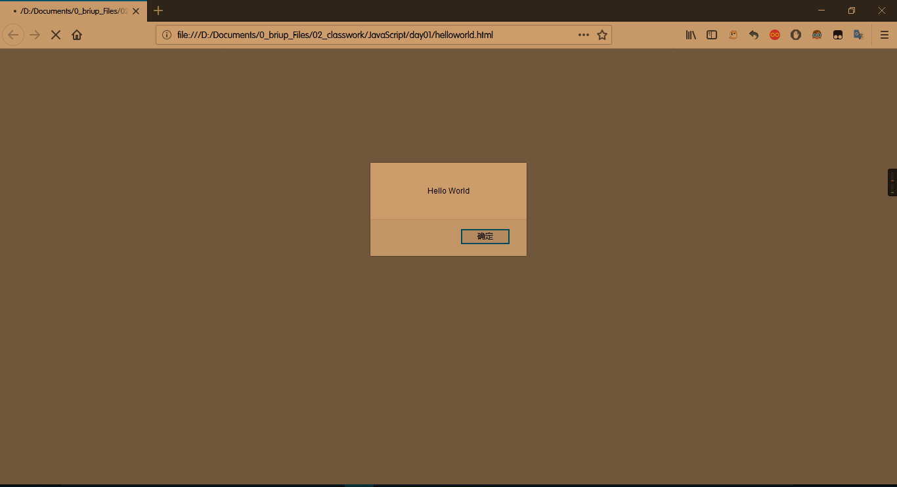
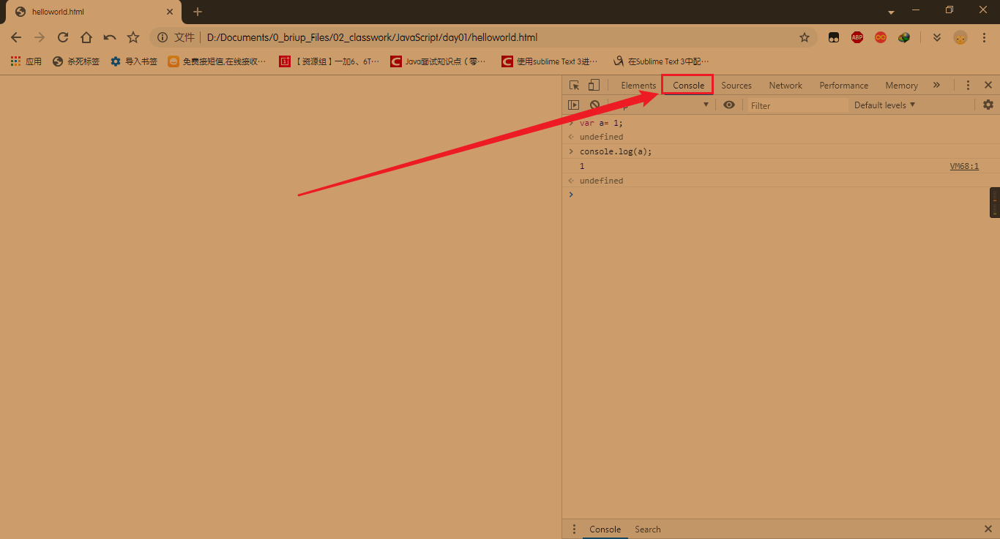
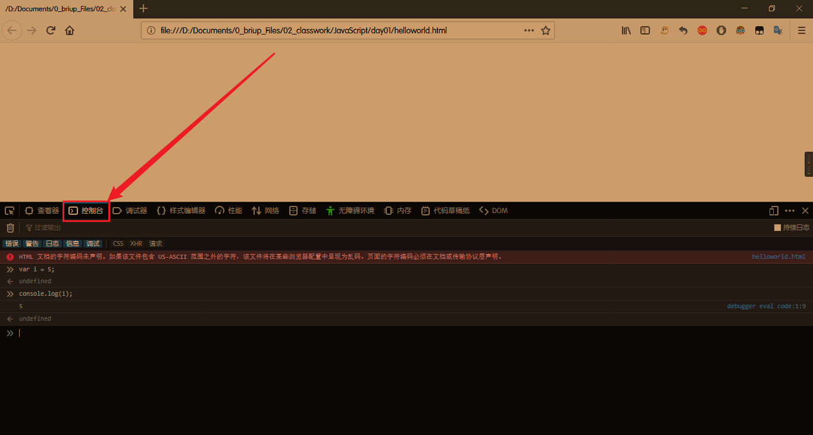

# JavaScript从入门到放弃
------
作者:乐乐

## 第一章 `JavaScript`概述
## 第二章 `JavaScript`快速入门
### (一).快速入门
#### 1.`JavaScript`代码的位置
##### (1).内嵌式
由`<script>...</script>`包含的代码就是`JavaScript`代码，它将直接被浏览器执行。
```html
<!DOCTYPE html>
<html>
<head>
	<title></title>
	<script type="text/javascript">
		alert('Hello World!');
	</script>
</head>
<body>

</body>
</html>
```
##### (1).外链式
* `JavaScript`代码可以放入一个单独的`*.js`的文件中，更利于维护代码，并且多个页面可以各自引用同一份`js`文件。
也可以在同一个页面中引入多个`js`文件，还可以在页面中多次编写`<script> [jscode] </script>`，浏览器按照顺序依次执行。
* `HTML`引入外部的`js`文件
```html
<!DOCTYPE html>
<html>
<head>
	<title></title>
	<script src="  [js文件路径]  "></script>
</head>
<body>

</body>
</html>
```

### (二).编写、运行、调试`JavaScript`代码
#### 1.编写`JavaScript`代码
可以用任何文本编辑器来编写`JavaScript`代码,例如notepad ++,Sublime text等.
#### 2.运行`JavaScript`代码
要让浏览器运行`JavaScript`，必须先有一个HTML页面，在HTML页面中引入`JavaScript`，然后，让浏览器加载该HTML页面，就可以执行`JavaScript`代码。

#### 3.调试`JavaScript`代码
* 在浏览器中摁`F12`可以打开开发者工具，然后点击控制台(Console),可以直接输入`JavaScript`代码，回车执行，推荐使用谷歌或者火狐浏览器.
  谷歌浏览器
   火狐浏览器  

* `JavaScript`控制台输出语句`Console.log();`

### (二).基本语法

## 第二章 `JavaScript`函数
## 第二章 `JavaScript`标准对象
## 第二章 `JavaScript`面向对象编程
## 第二章 `JavaScript`浏览器

原始数据类型
	* `number`数字类型
		整数、小数、NaN
	* `string`字符串
		"abc"、'abc'
	* `boolean` `true`、`false`
	* `null`对象为空的占位符
	* `undefined`未定义
引用类型


var类型表示任意类型变量
