# Spring 框架
------------------
作者:乐乐

# 一、Spring 框架概述
Spring 是一种非侵入式的框架
* 侵入式:对于EJB、Struts2等一些传统的框架，通常是要实现特定的接口，继承特定的类才能增强功能,改变了java类的结构
* 非侵入式:对于Hibernate、Spring等框架，对现有的类结构没有影响，就能够增强JavaBean的功能

## (一).软件应用分层架构
### 1.标准三层架构
#### (1).数据访问层
主要是对原始数据(数据库或者文本文件等存放数据的形式)的操作层,也就是对数据的操作,而不是数据库,具体是为业务逻辑层或表示层提供数据服务．
#### (2).业务逻辑层
主要是针对具体问题的操作,也可以理解成对数据层的操作、对数据业务逻辑处理,如果说数据层是积木,那逻辑层就是对这些积木的搭建具体的讲是主要负责对数据层的操作也就是说把一些数据层的操作进行组合
#### (3).表示层
主要表示WEB方式,如果逻辑层相当强大和完善,无论表现层如何定义和更改,逻辑层都能完善地提供服务，主要对用户的请求接受,以及数据的返回,为客户端提供应用程序的访问
### 2.标准三层架构的优缺点
#### (1).优点
##### 1).开发人员可以只关注整个结构中的其中某一层；
##### 2).可以很容易的用新的实现来替换原有层次的实现；
##### 3).可以降低层与层之间的依赖；
##### 4).有利于标准化；
##### 5).利于各层逻辑的复用
##### 6).结构更加的明确
##### 7).在后期维护的时候,极大地降低了维护成本和维护时间
#### (2).缺点
##### 1).降低了系统的性能,如果不采用分层式结构,很多业务可以直接造访数据库,以此获取相应的数据,如今却必须通过中间层来完成
##### 2).有时会导致级联的修改这种修改尤其体现在自上而下的方向如果在表示层中需要增加一个功能,为保证其设计符合分层式结构,可能需要在相应的业务逻辑层和数据访问层中都增加相应的代码
##### 3).增加了开发成本
## (二).Spring 框架
### 1.Spring 框架的概念
轻量级的(面向切面AOP)、(IOC控制反转)容器框架。
* 轻量级:Spring 是一种轻量级框架,Spring给用户提供的功能完全由用户自己决定,用户想用什么功能只需要自己去选择并使用(Spring是一种模块化的框架)但是一般的重量级的框架都是只要你用,就把所有的功能都给你,用户不能自己定制
* 容器:Spring 框架中的容器可以管理项目中各种对象的生命周期(对象的创建、初始化、使用、销毁),前提是项目中要使用Spring框架,并且把这些需要管理的对象配置给spring的容器

### 2.Spring 框架的优点
#### (1).降低组件之间的耦合性
通过Spring提供的容器,我们可以将对象之间的依赖关系交由Spring进行控制,避免硬编码所造成的过度程序耦合
#### (2).专注于自己业务逻辑，统一的行为（日志、安全等）抽象出来统一处理
#### (3).易于单元测试
spring框架也提供了测试模块,可以和很多主流的测试框架相结合
#### (4).方便事物处理
在Spring中,我们可以从单调烦闷的事务管理代码中解脱出来,通过声明式方式灵活地进行事务的管理,提高开发效率和质量
#### (5).Spring 并不强制应用完全依赖于Spring，开发者可自由选用Spring框架的部分或全部
#### (6).Spring 对于主流的应用框架提供了集成支持
Spring不排斥各种优秀的开源框架,相反,Spring可以降低各种框架的使用难度,Spring提供了对各种优秀框架（如Struts,Hibernate、Hessian、Quartz）等的直接支持
#### (7).Spring 属于低侵入式设计，代码的污染极低
#### (8).提供了单例模式支持。

### 3.Spring框架的七个功能模块
#### (1).Spring context (Spring 上下文)
Spring上下文向Spring框架提供上下文信息，Spring上下文包括各种信息和功能服务,如JNDI、EJB、电子邮件、国际化、校验和调度功能
#### (2).Spring AOP (面向切面编程)
Spring AOP模块将面向切面编程的功能集成到了 Spring框架中所以,可以很容易的让Spring框架管理的对象都能支持AOP功能
#### (3).Spring DAO
一般三层架构中的DAO,主要目的是将持久层相关问题与一般的业务规则隔离开，Spring中的DAO模块提供了一致的方式访问数据库,不管采用何种持久化技术,Spring都提供一致的编程模型
#### (4).Spring ORM
Spring 与所有的主要的ORM映射框架都集成的很好,包括Hibernate、MyBatis等Spring为所有的这些框架提供了类似于模板的辅助类,达成一致的编程风格
#### (5).Spring Web
Web上下文模块建立在应用程序上下文模块之上,为基于Web的应用程序提供了上下文Web层中使用的web框架可以是Spring自己的MVC框架,或者是其他的Web框架,如Struts、Webwork等
#### (6).Spring MVC (Spring WebMVC)
MVC框架是一个全功能的构建Web应用程序的MVC实现通过策略接口,MVC框架变成为高度可配置的Spring的MVC框架提供清晰的角色划分:控制器、验证器、命令对象、表单对象和模型对象、分发器、处理器映射和视图解析器
#### (7).Spring Core (Spring 核心容器)
核心容器提供Spring框架的基本功能,Spring以bean的方式组织和管理Java应用中的各个组件及其关系,Spring使用BeanFactory来产生和管理Bean,它是工厂模式的实现,BeanFactory使用控制反转(IOC)模式将应用的配置和依赖性规范与实际的应用程序代码分开,BeanFactory使用依赖注入的方式提供给组件依赖


# 二、Spring 环境搭建
Spring环境需要的jar包
公共的日志jar包:commons-logging-1.1.1.jar
bean对象:spring-beans-4.3.7.RELEASE.jar
上下文:spring-context-4.3.7.RELEASE.jar
spring-context-support-4.3.7.RELEASE.jar
核心jar包:spring-core-4.3.7.RELEASE.jar
spring-expression-4.3.7.RELEASE.jar

# 三、Spring IOC(控制反转)
* IOC:Inversion of Control 控制反转
	* 控制反转:对象的创建交给外部容器完成。
		* Spring使用控制反转来实现对象不用在程序中写死
		* 控制反转解决对象处理问题**把对象交给别人创建**
* DI:Dependency Injection 依赖注入
	* 依赖注入:解决对象与对象之间的依赖关系
		* Spring使用依赖注入来实现对象之间的依赖关系
		* 在创建完对象之后，对象的关系处理就是依赖注入

* 控制反转是通过外部容器完成的，Spring为我们提供了这么一个容器，我们一般将这个容器叫做：IOC容器.

> 无论是创建对象、处理对象之间的依赖关系、对象创建的时间还是对象的数量，我们都是在Spring为我们提供的IOC容器上配置对象的信息就好了。

* 使用IOC控制反转这一思想的作用
	* 不用自己组装，拿来就用。
	* 享受单例的好处，效率高，不浪费空间。
	* 便于单元测试，方便切换mock组件。
	* 便于进行AOP操作，对于使用者是透明的。
	* 统一配置，便于修改

## (一).IOC容器装配Bean的方式

### 1.XML文件中显示配置
* 一个简单的XML配置文件内容
	```xml
	<?xml version="1.0" encoding="UTF-8"?>
	<beans xmlns="http://www.springframework.org/schema/beans"
		xmlns:xsi="http://www.w3.org/2001/XMLSchema-instance"
		xmlns:context="http://www.springframework.org/schema/context"
		xsi:schemaLocation="http://www.springframework.org/schema/beans
	           http://www.springframework.org/schema/beans/spring-beans-4.3.xsd
	           http://www.springframework.org/schema/context
	           http://www.springframework.org/schema/context/spring-context-4.3.xsd">

	   <!-- Your code is here. -->

	</beans>
	```
* 配置自动XML代码自动提示
	* 下载好对应的`*.xsd`schema约束文件
	* 依次打开Window->preferences->搜索XMl->XMl Catalog->Add
	 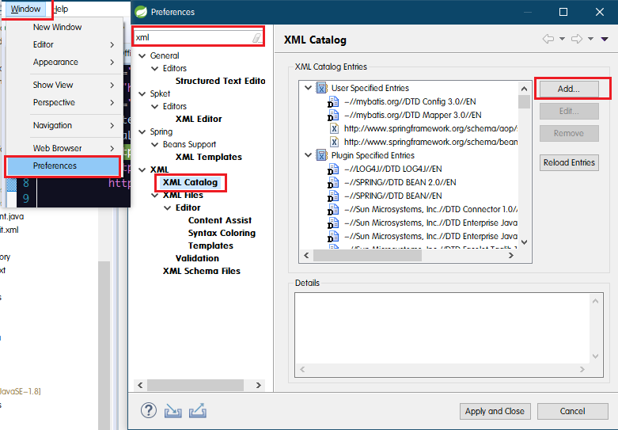
* 将Schema约束文件的地址粘贴到Key的位置，选择对应版本的Schema约束文件的存放路径，Key Type选择Schema location，确定，其余都一样

	* 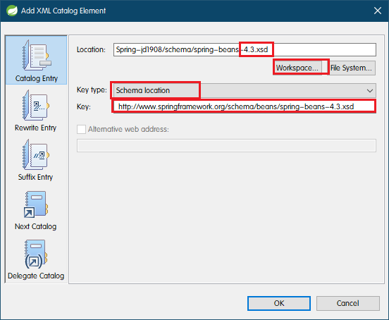

#### (1).依赖注入的方式
* 不管是哪种注入方式，都可以设置当前bean对象的`scope`属性值
	```xml
	<bean id="唯一标识" class="类的全限定名" scope=""/>
	```
	* `prototype`:Spring将Bean返回给调用者，调用者负责Bean后续生命的管理，Spring不再管理这些Bean的生命周期。 每次对这个bean的实例请求都会导致一个新的实例的创建。当用户需要不受其他用户对象影响的对象或有类似的需求时，这是一个较理想的解决办法。 即每次拿到的对象都是引用的不同地址的对象。相当于一个new的操作。清除prototype作用域的对象并释放任何prototype bean所持有的昂贵资源，都是客户端代码的职责
	* `request`:‍request 表示该针对每一次HTTP请求都会产生一个新的bean，同时该bean仅在当前HTTP request内有效，配置实例:request、session、global session 使用的时候首先要在初始化web的web.xml中做配置：如果你使用的是Servlet 2.4及以上的web容器，那么你仅需要在web应用的XML声明文件web.xml中增加下述ContextListener即可:
		```xml
		<listener>
			<listener-class>org.springframework.web.context.request.RequestContextListener</listener-class>
		</listener>
		```
	* `session`:表示该针对每一次HTTP请求都会产生一个新的bean，同时该bean仅在当前HTTP session内有效
	* `singleton`:默认值，设置该值后，Spring将Bean放入Spring IOC容器的缓存池中，并将Bean引用返回给调用者，spring IOC继续对这些Bean进行后续的生命管理。BeanFactory只管理一个共享的实例。所有对这个特定bean的实例请求，都返回这个唯一 bean实例的引用。 即每次拿到的对象都是引用的同一个地址的对象。当一个bean被标识为singleton时候，spring的IOC容器中只会存在一个该bean。

##### 1).set方式注入
* 注入的Bean对象的实体类，必须要有set方法，也必须要有无参构造器(否则无法创建对象)，`property`属性查找的是对应set方法后面属性名称的第一个字母小写的值，例如`SetAge()`,则`property = "age";`

###### <1>语法
```xml

<bean id="唯一标识" class="类的全限定名">
	<property name="set方法属性名" value="属性值" />
	<property name="set方法属性名" ref="自定义类类型的唯一标识" />
</bean>
```
###### <2>基本数据类型的注入
```xml
<!-- set注入 -->
<!-- id也可以换成name -->
<bean id="stu1" class="com.lele.note.ioc.set.Student">
	<property name="id" value="1" />
	<property name="name" value="张三" />
	<property name="age" value="18" />
</bean>
```
* id和name的区别:
	* id,唯一标识，不可重复，如果名字间有空格，`""`中间的所有内容全部是唯一标识的一部分，id会帮助检查对象名称是否符合规范
	* name,唯一标识，不可重复，如果名字中间有空格,空格隔开的为多个标识，每一个标识都可以定位这个对象

###### <3>自定义类类型的注入
```xml
<bean id="tea1" class="com.lele.note.ioc.set.Teacher">
	<property name="id" value="2" />
	<property name="name" value="Mrs.Wang" />
	<!-- 使用ref属性标识依赖的类类型 -->
	<property name="student" ref="stu1" />
</bean>
```
* 依赖的对象唯一标识处理
	* 用法
	```xml
	<property name="student" >
		<!-- bean对象在本xml文件中 -->
		<ref bean="本xml文件中的唯一标识"/>
		<!-- bean对象在其他xml文件中 -->
		<ref local="其他文件中的bean对象唯一标识"/>
	</property>
	```
	* `<ref local="">`在同一个文件中
	* `<ref bean="">`不在同一个文件中

###### <4>数组的注入
```xml
<!-- 数组的注入 -->
<bean id="stu2" class="com.lele.note.ioc.set.Student">
	<property name="id" value="2" />
	<property name="name" value="李四" />
	<property name="age" value="20" />
	<!-- 数组的set方法名 -->
	<property name="time">
		<!-- 数组值 -->
		<array>
			<value>Sunday</value>
			<value>Tuesday</value>
			<value>Friday</value>
		</array>
	</property>
</bean>
```
###### <5>集合的注入
①List集合的注入
```xml
<!-- List集合的注入 -->
<bean id="stu3" class="com.lele.note.ioc.set.Student">
	<property name="id" value="3" />
	<!-- 集合的set方法属性名 -->
	<property name="list">
		<list>
			<value>一班</value>
			<value>二班</value>
			<value>三班</value>
			<value>四班</value>
		</list>
	</property>
</bean>
```
②Set集合的注入
```xml
<!-- Set集合的注入 -->
<bean id="stu4" class="com.lele.note.ioc.set.Student">
	<property name="id" value="4" />
	<property name="set">
		<set>
			<value>大一</value>
			<value>大二</value>
			<value>大三</value>
		</set>
	</property>
</bean>
```
③Map集合的注入
```xml
<!-- Map集合的注入 -->
<bean id="stu5" class="com.lele.note.ioc.set.Student">
	<property name="id" value="5" />
	<property name="map">
		<map>
			<entry key="1" value="张宝宝"></entry>
			<entry key="2">
				<value>李</value>
			</entry>
			<entry key="3">
				<value>张</value>
			</entry>
		</map>
	</property>
</bean>
```
* 赋值的方式有两种
```xml
<entry key="1" value=""></entry>

<entry key="3">
	<value>张</value>
</entry>`
```
④props的注入
```xml
<!-- Props集合的注入 -->
<bean id="stu6" class="com.lele.note.ioc.set.Student">
	<property name="props">
		<props>
			<prop key="1">周</prop>
			<prop key="2">武</prop>
			<prop key="3">郑</prop>
			<prop key="4">王</prop>
		</props>
	</property>
</bean>
```

##### 2).构造器注入
* 构造器注入，可以没有set方法，但是必须得有对应的构造器
* 属性值可以写成单独的标签，也可以写成标签属性值形式
* 两种注入方法，如果有冲突，可以使用`name`属性指定对应set方法的属性名字

###### <1>根据属性类型注入
```xml
<!-- 根据构造器参数类型注入 -->
<bean id="stu7" class="com.lele.note.ioc.set.Student">
	<constructor-arg type="java.lang.Integer" value="1" />
	<constructor-arg type="java.lang.String">
		<value>王五</value>
	</constructor-arg>
	<constructor-arg type="String" value="三班"/>
	<constructor-arg type="java.lang.Integer" value="19" />
</bean>

<!-- 避免歧义，同时指定name属性
<constructor-arg type="java.lang.String" name="name">
	<value>王五</value>
</constructor-arg>
-->

```
* `type`属性的值可以是全限定包名也可以是数据类型名，根据类型查找，如果同类型，按照顺序查找

###### <2>根据属性下标注入
```xml
<!-- 根据构造器下标注入 -->
<bean id="stu8" class="com.lele.note.ioc.set.Student">
	<constructor-arg index="0" value="2" />
	<constructor-arg index="1" >
		<value>赵六</value>
	</constructor-arg>
	<constructor-arg index="2" value="十三班" />
	<constructor-arg index="3" value="22" />
</bean>

<!-- 表达明确，同时指定name属性
<constructor-arg index="1" name="name">
	<value>赵六</value>
</constructor-arg>
-->
```
* 下标`index`的属性值是从`0`开始的，对应的是构造器参数的顺序

##### 3).自动注入
###### <1>根元素设置默认注入方式
* 根标签bean的属性`default-autowire="default"`,默认是`default`
	* `byName` 通过默认的set方法对应的属性名自动查找
	* `byType` 通过属性类型自动查找(类类型)
	* `constructor` 通过构造器自动查找
	* `no` 不自动注入
* 如果设置了全局默认配置，文件中的所有自定义类型都会根据配置方式自动注入，如果文件中某一个局部的bean标签不需要根据全局的方式配置，在bean标签中声明即可！当然也不可以不配置，声明为`no`.
```xml
<?xml version="1.0" encoding="UTF-8"?>
<beans xmlns="http://www.springframework.org/schema/beans"
	xmlns:xsi="http://www.w3.org/2001/XMLSchema-instance"
	xmlns:context="http://www.springframework.org/schema/context"
	xsi:schemaLocation="http://www.springframework.org/schema/beans
           http://www.springframework.org/schema/beans/spring-beans-4.3.xsd
           http://www.springframework.org/schema/context
           http://www.springframework.org/schema/context/spring-context-4.3.xsd"

	default-autowire="byName"
>

	<!-- 全局根标签，配置默认自动注入 -->

	<!-- 需要自动注入的自定义类型 -->
	<bean id="info" class="com.lele.note.ioc.auto.StudentInfo">
		<property name="address" value="北京市"/>
		<property name="homePeopleNum" value="5"/>
		<property name="carType" value="红旗"/>
		<property name="height" value="190"/>
	</bean>

	<!-- 对应要生成的bean对象 -->
	<bean id="stu1" class="com.lele.note.ioc.set.Student">
		<property name="id" value="1" />
		<property name="name" value="张三"/>
		<property name="age" value="18"/>
	</bean>

</beans>
```

###### <2>`bean`标签局部配置
①`byName`方式
* 如果使用byName方式，xml配置文件中是不能存在两个跟属性值一样的bean对象的，此时无法自动注入，会报错！
```xml
<!-- 局部bean标签自动注入配置 -->
<!-- 通过byName方式 -->

<!-- 要被注入的bean对象的某一个属性值 -->
<bean id="info" class="com.lele.note.ioc.auto.StudentInfo">
	<property name="address" value="苏州市"/>
	<property name="homePeopleNum" value="4"/>
	<property name="carType" value="宝马"/>
	<property name="height" value="175"/>
</bean>

<!-- 需要通过byName方式自动注入的bean对象 -->
<bean id="stu2" class="com.lele.note.ioc.set.Student" autowire="byName">
	<property name="id" value="2" />
	<property name="name" value="小仙女"/>
	<property name="age" value="22"/>
</bean>
```
②`byType`方式
* 如果使用`byType`得到方式自动注入，同一个配置文件中，类型相同的bean对象只能存在一个
```xml
<!-- 通过byType方式 -->

<!-- 要被注入的bean对象的某一个属性值 -->
<bean id="studentinfo" class="com.lele.note.ioc.auto.StudentInfo">
	<property name="address" value="上海市"/>
	<property name="homePeopleNum" value="4"/>
	<property name="carType" value="自行车"/>
	<property name="height" value="160"/>
</bean>

<!-- 需要通过byType方式自动注入的bean对象 -->
<bean id="stu3" class="com.lele.note.ioc.set.Student" autowire="byType">
	<property name="id" value="3" />
	<property name="name" value="狐狸精"/>
	<property name="age" value="26"/>
</bean>
```
③`constructor`方式自动注入，根据构造器的参数类型

##### 4).继承
###### <1>语法
```xml
<!-- 需要被继承的抽象bean对象 -->
<bean id="唯一标识" class="全限定类名" abstract="true">
	<!-- 将要被继承的属性值设置 -->
</bean>

<!-- 继承其他bean的bean对象 -->
<bean id="唯一标识(用来获取bean对象)" parent="要继承的抽象bean的唯一标识" />
```
* 被继承的bean对象得是抽象的，同时要有属性`abstract="true"`,要注入需要被继承的属性值
* 继承其他bean的bean对象不需要注入属性值(如果子配置里注入属性值，会覆盖父配置的属性值)，此时属性值是继承过来的，需要添加属性·parent="要继承的抽象bean的唯一标识".

###### <2>示例
```xml
<!-- 继承 -->
<!-- 抽象bean对象，只能用来被继承 被继承的bean对象-->
<bean id="student" class="com.lele.note.ioc.set.Student" abstract="true">
	<property name="id" value="1" />
	<property name="name" value="张三"/>
	<property name="age" value="18"/>
</bean>

<!-- 需要继承的bean对象 -->
<bean id="stu" parent="student" />
```
##### 4).XMl间导入
* `resource`属性写的是相对于当前导入文件的相对路径
```xml
<!-- 导入其他的xml配置文件 -->
<import resource="../set/set.xml"/>

<import resource="../extend/extend.xml"/>
```

##### 5).bean对象的别名
```xml
<alias name="需要起别名的唯一标识" alias="别名"/>
```
* 别名是一个单独的标签
* 别名可以覆盖，可以给别名再起别名,起了别名之后，原来的名称和别名都可以使用


### 2.在java中进行显示配置
### 3.隐式的bean扫描发现机制和自动装配

## (二).Bean对象的在IOC容器中的生命周期
1、容器创建该`Bean`的对象
2、容器给这个`Bean`对象注入依赖
3、如果这个`Bean`已经实现了`BeanNameAware`接口,容器会调用它实现的`setBeanName(String)`方法,此处传递的就是Spring配置文件中`Bean`的id值
4、如果这个`Bean`已经实现了`BeanFactoryAware`接口,容器会调用它实现的`setBeanFactory()`方法
该方法接收的参数就是容器本身(可以用这个方式来获取其它Bean)
5、如果这个`Bean`已经实现了`ApplicationContextAware`接口,容器会调用`setApplicationContext`方法,该步和第四步类似,`ApplicationContext`是`BeanFactory`的子接口,有更多的实现方法
6、如果spring容器中配置了`BeanPostProcessor`接口的实现类,容器将会调用该实现类中的`postProcessBeforeInitialization`方法,表示可以在`Bean`对象执行 初始化方法之前做点事情
7、如果`Bean`在Spring配置文件中配置了`init-method`属性则会自动调用其配置的初始化方法
8、如果spring容器中配置了`BeanPostProcessor`接口的实现类,容器将会调用该实现类中的`postProcessAfterInitialization`方法,表示可以在Bean对象执行 初始化方法之后 做点事情
注:以上工作完成以后就可以使用这个`Bean`对象了
9、当`Bean`不再需要时,会经过清理阶段,如果`Bean`实现了`DisposableBean`这个接口,会调用那个其实现的`destroy()`方法；
10、最后,如果这个`Bean`的Spring配置中配置了`destroy-method`属性,会自动调用其配置的销毁方法

* Bean对象生命周期图解
	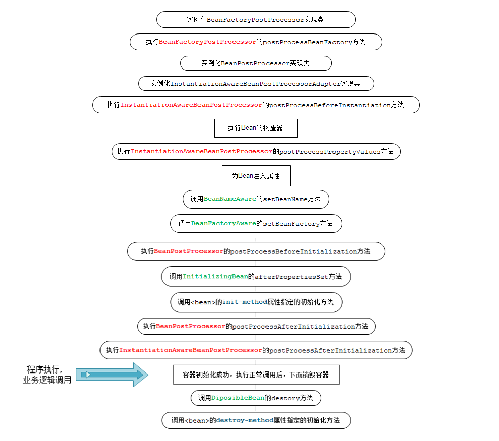

* 单例管理的对象:
	1.默认情况下,spring在读取xml文件的时候,就会创建对象
	2.依赖注入,如果有依赖的话
	3.调用`init-method=".."`属性值中所指定的方法,如果有该配置的话
	4.Bean对象可以被正常使用
	5.对象在被销毁的时候,会调用destroy-method="..."属性值中所指定的方法,如果有该配置的话
注意1:调用`container.destroy()`方法会销毁单例对象
注意2:`lazy-init="true"`,可以让这个Bean对象在第一次被访问的时候创建,而不是读取xml文件就被创建
注意3:因为是单例,所以该对象只会被创建一次

* 非单例管理的对象:
	1.使用这个对象的时候,spring容器会创建这个对象
	2.进行依赖注入,如果有依赖的话
	3.会去调用init-method=".."属性值中所指定的方法,如果有该配置的话
	4.Bean对象可以被正常使用
	注意1:spring容器不会销毁非单例对象
	注意2:因为是非单例,所以每次使用都会创建一个新的Bean对象

## (三).Spring创建bean对象的方式
### 1.加载xml文件得到bean对象
#### (1).BeanFactory接口
`BeanFactory`是Spring中IOC容器的核心接口,主要用于处理Bean的初始化和配置,建立对象间的依赖关系
##### 1).`Object getBean(String name) throws BeansException;`根据xml文件的id和name的值传入对象唯一标识，返回一个bean对象
##### 2).`boolean isPrototype(String name) throws NoSuchBeanDefinitionException;`判断名称是name的对象是不是一个独立的实例
##### 3).`boolean isSingleton(String name) throws NoSuchBeanDefinitionException;`判断名字为name的对象是不是单例
##### 4).`boolean containsBean(String name);`判断容器中是否包含名为name的实例
##### 5).`String[] getAliases(String name);`返回名称是name的bean对象的所有别名数组(如果别名又起了别名，返回的只有最终的别名)
#### (2).ApplicationContext接口
该接口继承于BeanFactory,增强了BeanFactory,增加了事务处理AOP,国际化,事件传递等功能
* 从配置文件得到bean对象的方法
```java
//数组中可以传多个xml文件路径，从src/下开始
String[] path = {"com/lele/note/ioc/auto/auto.xml"};

//加载xml文件得到一个容器
ApplicationContext container = new ClassPathXmlApplicationContext(path);

//获得bean对象的实例
bean类型 id = (bean类型) container.getBean("id");
bean类型 name = (bean类型) container.getBean("name");
```

### 2.spring容器创建bean对象的方式
#### (1).简单bean对象配置
* 简单依赖注入方式，要求bean对应的Java实体类中必须要有无参构造器
* Spring 此时通过反射调用无参构造器来创建对象

#### (2).通过工厂类获得实例对象
##### 1).实现`FactoryBean`的接口
* 重写得到Bean对象的方法
* 该类中的属性必须要有set方法，因为配置文件中需要注入属性值
```java
package com.lele.note.ioc.createbean;

import java.sql.Connection;
import java.sql.DriverManager;

import org.springframework.beans.factory.FactoryBean;

public class CreateBeanFromFactoryBean implements FactoryBean<Connection> {

	// JDBC数据库连接四要素
	private String driver;

	private String url;

	private String username;

	private String password;

	public String getDriver() {
		return driver;
	}

	public void setDriver(String driver) {
		this.driver = driver;
	}

	public String getUrl() {
		return url;
	}

	public void setUrl(String url) {
		this.url = url;
	}

	public String getUsername() {
		return username;
	}

	public void setUsername(String username) {
		this.username = username;
	}

	public String getPassword() {
		return password;
	}

	public void setPassword(String password) {
		this.password = password;
	}

	@Override
	public Connection getObject() throws Exception {

		// 注册驱动
		Class.forName(driver);

		// 获得数据库连接对象
		Connection conn = DriverManager.getConnection(url, username, password);

		return conn;
	}

	@Override
	public Class<Connection> getObjectType() {
		return Connection.class;
	}

	@Override
	public boolean isSingleton() {
		return false;
	}

}
```

##### 2).XML配置文件
###### <1>.加载外部Properties文件的方法
* 使用类`PropertyPlaceholderConfigurer`加载，通过`location`注入
* `classpath`表示文件路径是从classpath下开始查找的
* `value`可以通过属性或者标签的形式注入
* 加载完成后通过key取值，`${key}`
```xml
<?xml version="1.0" encoding="UTF-8"?>
<beans xmlns="http://www.springframework.org/schema/beans"
	xmlns:xsi="http://www.w3.org/2001/XMLSchema-instance"
	xmlns:context="http://www.springframework.org/schema/context"
	xsi:schemaLocation="http://www.springframework.org/schema/beans
		http://www.springframework.org/schema/beans/spring-beans-4.3.xsd
		http://www.springframework.org/schema/context
		http://www.springframework.org/schema/context/spring-context-4.3.xsd">

	<!-- 读取外部properties文件 -->
	<bean class="org.springframework.beans.factory.config.PropertyPlaceholderConfigurer">
		<property name="location">
			<value>classpath:com/lele/note/ioc/createbean/oracle.properties</value>
		</property>
	<!--
		<property name="location" value="classpath:com/lele/note/ioc/createbean/oracle.properties" />
	-->
	</bean>

	<!-- 将配置文件中的值用set注入到属性中 -->
	<bean id="connection" class="com.lele.note.ioc.createbean.CreateBeanFromFactoryBean">
		<property name="driver" value="${driver}" />
		<!--
			<property name="driver" >
				<value>${driver}</value>
			</property>
		-->
		<property name="url" value="${url}"/>
		<property name="username" value="${username}"/>
		<property name="password" value="${password}"/>
	</bean>

</beans>
```

###### <2>.注入bean对象的属性
```xml
<!-- 将配置文件中的值用set注入到属性中 -->
<bean id="connection" class="com.lele.note.ioc.createbean.CreateBeanFromFactoryBean">
	<property name="driver" value="${driver}" />
	<!--
		<property name="driver" >
			<value>${driver}</value>
		</property>
	-->
	<property name="url" value="${url}"/>
	<property name="username" value="${username}"/>
	<property name="password" value="${password}"/>
</bean>
```
##### 3).测试
* 从容器中拿到的bean类型是重写方法中`getObject()`方法的返回类型
```java
String[] path = {"com/lele/note/ioc/createbean/jdbc.xml"};

ApplicationContext container = new ClassPathXmlApplicationContext(path);

Connection connection = (Connection) container.getBean("connection");

System.out.println(connection);
```

#### (3).通过实例工厂获得bean对象
不需要实现或者继承任何接口或者父类,就是一个普通的工厂实例`instanceFactory`


#### (4).通过静态工厂获得实例

## (四).自定义属性编辑器
## (五).自定义事件
## (六).Spring IOC中的注解


#### 自动注入
autowire="byType"类类型匹配
autowire="byName"set方法形参名字匹配
根标签default-autowire="byName"
局部配置优于全局配置

继承


# 四、Spring AOP(面向切面编程)
## (一)、Spring AOP概述
## (二)、Spring AOP的实现
### 1.JDK动态代理
### 1.CGLIB代理


before
after
around
exception


AOP  		面向切面编程

aspect		切面/切面类----->代理类，额外添加自动生成的类

wave		织入--------->额外添加方法的过程或者步骤

advice		通知/拦截器
	用来控制切面类将来到底是织入到切入点的前面、后面或者是抛异常的时候。
	代码织入的位置(之前，之后，还是出现异常后)

joinPoint	连接点
	在spring的aop中只有 类中的方法 可以做连接点,每一个方法都可以是一个连接点.
	将来需要被代理的方法(一个方法是一个连接点)

pointCut	切入点
	一组连接点的集合

adivsor		增强器
	用来筛选类中的哪些方法是我们的连接点(哪些方法需要被拦截).

target		目标对象

proxy		代理对象


Spring 与Databases的结合
Spring与JDBC的结合


Spring与Mybatis的结合


# 五、Spring与JDBC结合
# 六、Spring与Mybatis结合
# 七、Spring MVC
## (一).Web、MVC、WebMVC概述
### 1.完成一次Web请求的过程
①Web浏览器发起请求
②Web服务器接收请求并处理请求,最后产生响应(一般为html)。
③web服务器处理完成后,返回内容给web客户端,客户端对接收的内容进行处理并显示出来。
在web中,都是Web客户端发起请求,Web服务器接收处理请求并产生响应。
一般Web服务器是不能主动通知Web客户端更新内容。有些技术可以帮我们实现这样的效果,如服务器推技术（Comet）、还有HTML5中的websocket等。
### 2.MVC模型
* MVC:Model-View-Controller
	是一种架构型的模式,本身不引入新功能,只是帮助我们将开发的代码结构,组织的更加合理。
	* Model(模型)
	数据模型,提供要展示的数据,因此包含数据和行为,行为是用来处理这些数据的。不过现在一般都分离开来:Value Object（数据） 和 服务层（行为）。也就是数据由实体类或者javabean来提供,行为由service层来提供.
	* View(视图)
	负责进行模型的展示,一般就是我们见到的用户界面,客户想看到的东西。
	* Controller(控制器)
	接收用户请求,委托给模型进行处理,处理完毕后把返回的模型数据交给视图。也就是说控制器在中间起到一个调度的作用。

* 在标准的MVC中,模型能主动推数据给视图进行更新(可以采用观察者设计模式实现,在模型上注册视图,当模型更新时自动更新视图),但在Web开发中模型是无法主动推给视图,即无法主动更新用户界面,因为在Web的访问是请求-响应的模式。必须由客户端主动发出请求后,服务器才能把数据返回。

### 3.WebMVC
* Web中MVC里面的模型-视图-控制器的概念和标准MVC概念一样,但是在Web MVC模式下,模型无法**主动**推数据给视图,如果用户想要视图更新,需要再发送一次请求(即请求-响应模型)。
* 在三层架构中，其实就是把Servlet作为Controller(控制器),把jsp作为View(视图),把javabean作为Model(模型)中的数据,service层作为Model(模型)中的行为.

### 4.Spring Web MVC
#### (1).Spring MVC概述
简称:Spring MVC
* Spring MVC就是Spring框架提供的一个模块,通过实现MVC模式来很好地将数据、业务与展现进行分离,SpringMVC框架的目的是要简化我们日常的Web开发。
* Spring MVC框架跟其他的WebMVC框架一样,都是**请求驱动**,并且设计围绕一个能够分发请求到控制器以及提供其他加快web应用开发功能的核心Servlet(叫做`DispatcherServlet`,即前端控制器)。`Spring的DispatcherServlet`实现比其他框架中还要多的功能。它和spring的ioc容器完全整合,并且允许使用spring中其他的所有功能。
* Spring MVC框架设计的一个核心的原则就是"开闭原则",对扩展开放,对修改关闭.所以Spring MVC框架中很多方法都是`final`修饰的,不允许用户随意覆盖,但是却提供给用户很多可扩展的机制(spring mvc提供了很多接口)。Spring MVC目前已经成为非常流行的web应用的框架。

#### (2).Spring MVC框架的核心组件
1).`DispatcherServlet`:前端控制器,用来过滤客户端发送过来,想要进行逻辑处理的请求。
2).`Controller/Headler`:控制器/处理器。开发人员自定义,用来处理用户请求的,并且处理完成之后返回给用户指定视图的对象。
3).`HandlerMapping`:处理器映射器。DispatcherServlet接收到客户端请求的URL之后,根据一定的匹配规则,再把请求转发给对应的Handler,这个匹配规则由HandlerMapping决定。
4).`HandlerAdaptor`:处理器适配器。处理器适配器用来适配每一个要执行的Handler对象。通过HandlerAdapter可以支持任意的类作为处理器
5).`ViewResolver`:视图解析器。Handler返回的是逻辑视图名,需要有一个解析器能够将逻辑视图名转换成实际的物理视图。而且Spring的可扩展性决定了视图可以由很多种,所以需要不同的视图解析器,解析不同的视图。但是一般由jsp充当视图的情况居多

* Spring MVC框架提供一个核心的Servlet对象(`DispatcherServlet`,前端控制器)来对服务器接收到的请求进行解析,当这个请求被`DispatcherServlet`获取到之后,`DispatherServlet`需要根据`HandlerMapping`对象的映射关系,将这个请求转交给真正能够处理客户端请求的`Controller`控制器(我们要写的就是这个东西,相当于之前的servlet)来处理。`Controller`处理完成后返回`ModelAndView`对象,也就是模型和视图的结合体。`ViewResolver`视图解析器根据`ModelAndView`中的逻辑视图名找到真正的物理视图,同时使用`ModelAndView`中模型里面的数据对视图进行渲染。最后把准备好的视图展现给用户

## (二).Spring MVC框架搭建
### 1.构建动态web项目
在Eclipse中创建一个动态web项目(DynamicWebProject),注意JDK版本和项目版本的选择,生成web.xml文件、部署到服务器等
### 2.导入Spring MVC等相关的jar包
在lib目录下放入下面的jar包
* Spring MVC相关jar包
	commons-logging-1.2.jar
	spring-beans-4.3.7.RELEASE.jar
	spring-context-4.3.7.RELEASE.jar
	spring-core-4.3.7.RELEASE.jar
	spring-expression-4.3.7.RELEASE.jar
	spring-web-4.3.7.RELEASE.jar
	spring-webmvc-4.3.7.RELEASE.jar
	jstl.jar
	...
* JDBC等其他jar包等

### 3.配置前端控制器(DispatcherServlet)
* Spring MVC的前端控制器就是一个Servlet对象,继承自`HttpServlet`,所以需要在**web.xml**文件中配置。
* Spring MVC是Spring提供的一个模块,Spring所有的模块都是基于Spring IOC功能的。所以Spring MVC的`DispatcherServlet`对象在初始化之前也会去实例化Spring的容器对象(ApplicationContext),那么就需要读取Spring的配置文件。默认Spring MVC会在你web应用的**WEB-INF目录下查找一个名字为`[(servlet-name)标签名]-servlet.xml`**文件,并且查找创建在这个文件中定义的bean对象。如果你提供的spring配置文件的名字或者位置和默认的不同,那么需要在配置servlet时同时指定配置文件的位置。
```xml
<!--
		默认配置
	如果是此配置，框架会自动去当前项目的WEB-INF目录下查找名字为SpringMVC-servlet-servlet.xml的配置文件
 -->

<servlet>
	<servlet-name>SpringMVC</servlet-name>
	<servlet-class>org.springframework.web.servlet.DispatcherServlet</servlet-class>
	<load-on-startup>1</load-on-startup>
</servlet>
<servlet-mapping>
	<servlet-name>SpringMVC</servlet-name>
	<url-pattern>*.action</url-pattern>
</servlet-mapping>

<!--
		自定义配置
	此配置查找的是classpath下(即src目录下)的spring-web-mvc.xml配置文件
 -->
<servlet>
	<servlet-name>SpringMVC</servlet-name>
	<servlet-class>org.springframework.web.servlet.DispatcherServlet</servlet-class>
	<init-param>
		<param-name>contextConfigLocation</param-name>
		<!-- 配置文件在src/ -->
		<param-value>classpath:spring-web-mvc.xml</param-value>
	</init-param>
	<load-on-startup>1</load-on-startup>
</servlet>
<servlet-mapping>
	<servlet-name>SpringMVC</servlet-name>
	<!-- 拦截所有后缀是.action 的访问 -->
	<url-pattern>*.action</url-pattern>
</servlet-mapping>
```

* 配置文件路径设置
	* 配置文件在`WEB-INF/`,使用配置
	`<param-value>/WEB-INF/文件名.xml</param-value>`

	* 配置文件在`classpath/`,即`src/`，使用配置
	`<param-value>classpath:文件名.xml</param-value>`

* 自定义请求拦截
	* 拦截后缀是`.action`的所有请求
	`<url-pattern>*.action</url-pattern>`
	这种方式配置简单，例如拦截`*.do`,`*.html`，这种传统方式，简单便捷，不会导致静态文件(css,js,jpg等)被拦截，`Controller`后缀只能固定为某一个，不便于实现REST风格的访问

	* 拦截所有请求
	`<url-pattern>/</url-pattern>`
	拦截所有请求是`/`,不是`/*`,如果使用`/*`,那么请求时可以通过`DispatcherServlet`转发到相应的`Controller`中,但是`Controller`返回的时候,返回的jsp还会再次被拦截,这样导致`404`错误,即访问不到jsp页面。
	这种拦截所有的配置，会导致所有静态资源(jpg,css,js等)也被拦截

* 页面直接访问配置
	某些页面不需要通过前端控制器，也不需要做任何的拦截操作，但是页面在`WEB-INF`文件夹下，想让前台直接可以访问，需要做以下的配置，必须保证有视图解析器的前提下，让前台访问此页面的时候，直接将这个页面资源返回
	```xml
	<!-- 配置视图解析器
			如果不写，有默认配置，前缀，后缀都是""
		-->
		<bean class="org.springframework.web.servlet.view.InternalResourceViewResolver">
			<property name="viewClass" value="org.springframework.web.servlet.view.JstlView"/>
			<property name="prefix" value="/WEB-INF/pages/exercises/"/>
			<property name="suffix" value=".jsp"/>
		</bean>

		<!-- 指定一个请求路径，直接去找对应的jsp文件，不被前端控制器，处理器等拦截 -->
		<mvc:view-controller path="/register" view-name="register"/>
	```


### 4.配置`Controller`控制器(也称为`Handler`处理器)
* MVC中完整的`C`(包含控制逻辑+功能处理)由(`DispatcherServlet` 和 `Controller`)组成。
	* `Controller`控制器,是MVC中的部分`C`,因为此处的控制器主要负责功能处理部分
		* 收集、验证请求参数并封装到对象上；
		* 将对象交给业务层(service),由业务对象处理并返回模型数据；
		* 返回ModelAndView(Model部分是业务层返回的模型数据,视图部分为逻辑视图名)。
	* 前端控制器(DispatcherServlet),主要负责整体的控制流程的调度部分
		* 负责将请求委托给控制器进行处理；
		* 根据控制器返回的逻辑视图名选择具体的视图进行渲染(并把模型数据传入)。
* `Controller`接口中只有一个需要实现的方法就是`handleRequest()`,方法中接收两个参数,分别对应`Servlet`对象中的`request`,`response`对象。可以从`request`中获取客户端提交过来的请求参数。
返回值`ModelAndView`,既包含要返回给客户端浏览器的逻辑视图又包含要对视图进行渲染的数据模型。
例如
```java
package com.lele.web;

import javax.servlet.http.HttpServletRequest;
import javax.servlet.http.HttpServletResponse;

import org.springframework.web.servlet.ModelAndView;
import org.springframework.web.servlet.mvc.Controller;

import com.lele.services.UserServer;

public class CustomerController implements Controller {

	@Override
	public ModelAndView handleRequest(HttpServletRequest request, HttpServletResponse response) throws Exception {
		// ModelAndView对象中包括了要返回的逻辑视图，以及数据模型
		ModelAndView mv = new ModelAndView();

		// 获取请求中传过来的参数
		String username = request.getParameter("username");
		String password = request.getParameter("password");
		// 保存页面状态消息
		String msg = "";

		// 其他页面逻辑处理代码等
		try {
			User user = UserServer.loginServer(username, password);

			// 登陆成功的逻辑处理
			msg = "登录成功！";

			// 设置逻辑视图名称
			mv.setViewName("index");

			// 设置数据模型
			mv.addObject("user", user);

		} catch (Exception e) {
			// 登录失败的处理
			mv.setViewName("login");
			msg = "登录失败  " + e.getMessage();
		}

		// 消息处理
		mv.addObject("msg", msg);

		// 返回的逻辑视图
		return mv;
	}

}
```

### 5.配置处理器映射器(可省去,有默认配置)
Spring容器需要根据映射器来将用户提交的请求`url`和后台`Controller/Handler`进行绑定。
```xml
<!-- 配置映射器
	将URL映射到对应的Controller处理器
-->
<bean class="org.springframework.web.servlet.handler.BeanNameUrlHandlerMapping" />
```
* `BeanNameUrlHandlerMapping`类，表示将请求的`URL`和`Bean`名字映射,如`URL`为 "/hello",则Spring配置文件必须有一个名字为"/hello"的Bean.
	注:bean对象里的`/`代表的含义是url中项目名后面的`/`

### 6.配置处理器适配器(可省去,有默认配置)
想要正确运行自定义处理器,需要配置处理器适配器,在spring的配置文件中(就是本例中的SpringMVC-servlet.xml),进行配置
```xml
<!-- 配置适配器 -->
<bean class="org.springframework.web.servlet.mvc.SimpleControllerHandlerAdapter" />
```
`SimpleControllerHandlerAdapter`:表示所有实现了`org.springframework.web.servlet.mvc.Controller`接口的`Bean`可以作为Spring MVC中的处理器。如果需要其他类型的处理器可以通过实现`HadlerAdapter`来解决。

### 7.配置视图解析器
* 可不写,有默认配置,但是前缀和后缀都为`""`
当处理器执行完成后,返回给spring容器一个`ModelAndView`对象,这个对象需要能够被解析成与之相对应的视图,并且使用返回的`Model`数据对视图进行渲染。
```xml
<!-- 配置视图解析器 -->
<bean class="org.springframework.web.servlet.view.InternalResourceViewResolver">
	<!-- 引入JSTL标签库 -->
	<property name="viewClass" value="org.springframework.web.servlet.view.JstlView"/>
	<!-- 添加前缀 -->
	<property name="prefix" value="/WEB-INF/pages/"/>
	<!-- 添加后缀 -->
	<property name="suffix" value=".jsp"/>
</bean>
```
* 各部分属性含义:
	* `InternalResourceViewResolver`:用于支持Servlet、JSP视图解析;
	* `viewClass`:`JstlView`表示JSP模板页面需要使用`JSTL`标签库,`classpath`中必须包含jstl的相关jar包；
	* `prefix`和`suffix`:视图页面的前缀和后缀(前缀+逻辑视图名+后缀),比如传进来的逻辑视图名为`hello`,则该该jsp视图页面应该存放在`WEB-INF/jsp/hello.jsp`
* 如果配置了这一项，自定义的`Handler`中返回的逻辑视图的名字不能有后缀`.jsp`,并且具体页面一定放在`WEB-INF/`目录。
* 放在`WEB-INF/`的页面,只能通过内部跳转的方式访问到,因为客户端访问不到`WEB-INF/`目录,服务器端可以访问到WEB-INF目录
* 基准路径设置，跟Servlet完全一样
```jsp
<%-- 基准路径的定义--%>
<%
	String basePath = request.getScheme()+"://"+request.getServerName()+":"+request.getServerPort()+request.getContextPath()+"/";
%>
<!-- 基准路径的设置 -->
<base href="<%=basePath%>" />
```

### 8.配置控制器/处理器
把编写好的`handler/controller`在spring中进配置,让其接受Spring IOC容器管理
```xml
<!-- 配置Controller处理器 -->
<bean id="/login.action" class="com.lele.web.LoginController" />
```
* 对于Spring配置文件中的处理器适配器,处理器映射器,都可以省去不写,spring MVC框架中会有默认配置的,视图解析器也可以不配置,因为在`org.springframework.web.servlet.DispatcherServlet`这个类的同包下,有一个`DispatcherServlet.properties`文件,里面就是Spring MVC默认的配置,是当用户的Spring配置文件中没有指定配置时使用的默认策略(你不配置那么用默认的,你配置了,那么就使用你的配置)
* 从默认的配置中可以看出`DispatcherServlet`在启动时会自动注册这些特殊的Bean,无需我们注册,如果我们注册了,默认的将不会注册。
* 因此之前的`BeanNameUrlHandlerMapping`、`SimpleControllerHandlerAdapter`是不需要注册的,`DispatcherServlet`默认会注册这两个Bean。

## (三).Spring MVC访问流程
###### 1)、用户发送请求至前端控制器`DispatcherServlet`。
###### 2)、`DispatcherServlet`收到请求调用`HandlerMapping`处理器映射器。
###### 3)、处理器映射器找到具体的处理器，生成处理器对象及处理器拦截器(如果有则生成)一并返回给`DispatcherServlet`。
###### 4)、`DispatcherServlet`调用`HandlerAdapter`处理器适配器。
###### 5)、`HandlerAdapter`经过适配调用具体的处理器(`Controller`,也叫后端控制器)方法。
###### 6)、处理器执行完成返回`ModelAndView`给`HandlerAdapter`。
###### 7)、`HandlerAdapter`将处理器执行结果`ModelAndView`返回给`DispatcherServlet`。
###### 8)、`DispatcherServlet`将`ModelAndView`传给`ViewReslover`视图解析器。
###### 9)、`ViewReslover`解析后返回具体View给`DispatcherServlet`。
###### 10)、`DispatcherServlet`调用视图解析器根据View进行渲染视图(即将模型数据填充至视图中)。
###### 11)、将渲染后的页面返回到前端控制器`DispatcherServlet`。
###### 12)、`DispatcherServlet`将渲染后的页面响应到客户端。
访问流程图解
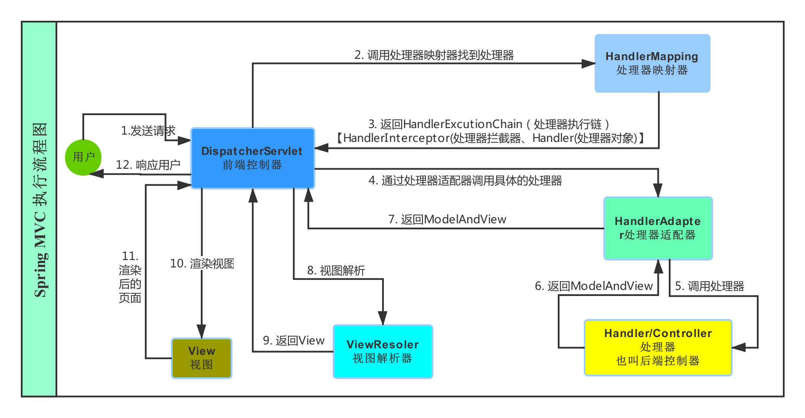

## (四).静态资源的访问
静态资源包括:图片，音视频，css，js等
如果配置了全部拦截，会导致静态资源也被拦截，下面提供解决方案
### 1.利用Tomcat服务器的`defaultServlet`处理静态文件
在web.xml中做如下配置
```xml
<!-- 设置遇到图片默认处理 -->
<servlet-mapping>
	<servlet-name>default</servlet-name>
	<url-pattern>*.jpg</url-pattern>
</servlet-mapping>

<!-- 设置遇到js文件默认处理 -->
<servlet-mapping>
	<servlet-name>default</servlet-name>
	<url-pattern>*.js</url-pattern>
</servlet-mapping>

<!-- 设置遇到css文件默认处理 -->
<servlet-mapping>
	<servlet-name>default</servlet-name>
	<url-pattern>*.css</url-pattern>
</servlet-mapping>

<!-- 上面的代码，可以直接简写 -->

<servlet-mapping>
	<servlet-name>default</servlet-name>
	<url-pattern>*.css</url-pattern>
	<url-pattern>*.js</url-pattern>
	<url-pattern>*.png</url-pattern>
</servlet-mapping>
```
* 这种配置方式有如下的特点
	* 每一种文件就得配置一个，所有的静态资源后缀都得配置
	* 要写在前端控制器(DispatcherServlet)配置的前面,先拦截请求
	* 这种配置方式性能很高

### 2.在Spring的配置文件中配置<mvc:resources>标签
在Spring的xml配置文件中做如下配置
```xml
<!-- 配置静态资源访问的处理方式 -->
<mvc:resources mapping="/images/**" location="/images/"/>
<mvc:resources mapping="/js/**" location="/js/"/>
<mvc:resources mapping="/css/**" location="/css/"/>
```
* mapping:映射
两个`*`,表示映射指定路径下所有的URL,包括子路径
* location:本地资源路径
这样如果有访问`/images`或者`/js`或者`/css`路径下面的资源的时候,spring就不会拦截了

### 3.在Spring的配置文件中配置<mvc:default-servlet-handler/>标签
在Spring的配置文件中直接加入下面的配置即可
```xml
<mvc:default-servlet-handler/>
```

## (五).Spring提供的编码过滤器
跟在Servlet时一样，使用过滤器拦截所有请求，设置编码为UTF-8，在web.xml中，做如下的配置
```xml
<!--
	过滤器拦截所有请求
	设置编码为UTF-8
 -->
<filter>
	<filter-name>CharacterEncodingFilter</filter-name>
	<filter-class>org.springframework.web.filter.CharacterEncodingFilter</filter-class>
	<init-param>
		<param-name>encoding</param-name>
		<param-value>UTF-8</param-value>
	</init-param>
	<init-param>
		<param-name>forceEncoding</param-name>
		<param-value>true</param-value>
	</init-param>
</filter>
<filter-mapping>
	<filter-name>CharacterEncodingFilter</filter-name>
	<url-pattern>/*</url-pattern>
</filter-mapping>
```
## (六).Controller接口及其实现类
* `Controller`是控制器/处理器的顶级接口,只有下面这一个方法:`ModelAndView handleRequest(HttpServletRequest request, HttpServletResponse response) throws Exception;`
此方法用于进行请求的功能处理(功能处理方法),处理完请求后返回`ModelAndView`对象(`Model`模型数据部分和`View`视图部分)。
* Spring默认提供了一些Controller接口的实现类方便我们使用,每个实现类都有自己特殊的功能,例如`AbstractController`类,我们可以继承`AbstractController`,重写里面的`handleRequestInternal()`方法

### 1.返回逻辑视图保证线程安全
```java
package com.lele.controller;

import javax.servlet.http.HttpServletRequest;
import javax.servlet.http.HttpServletResponse;

import org.springframework.web.servlet.ModelAndView;
import org.springframework.web.servlet.mvc.AbstractController;

//研究controller的实现类abstractController
public class TestController extends AbstractController {

	@Override
	protected ModelAndView handleRequestInternal(HttpServletRequest request, HttpServletResponse response)
			throws Exception {

		// 创建逻辑视图，并制定逻辑视图的名称
		ModelAndView mv = new ModelAndView("test");

		// 设置数据模型
		mv.addObject("name", "张三");

		// 返回视图模型的对象
		return mv;
	}
}
```
### 2.通过响应写回数据
* 如果想直接在处理器/控制器(Controller)里使用`response`向客户端写回数据,需要`return null;`来告诉`DispatcherServlet`我们已经写出响应了,不需要再进行视图解析.
```java
public class TestController extends AbstractController {

	@Override
	protected ModelAndView handleRequestInternal(HttpServletRequest request, HttpServletResponse response)
			throws Exception {

		//响应流对象
		PrintWriter writer = response.getWriter();

		//直接给响应用流写回数据
		writer.write("Hello AbstractController!");
		//刷新状态
		writer.flush();

		//使用response写回
		return null;
	}
}
```

### 3.`AbstractController`拓展设置
#### (1).解决线程不安全的问题
`AbstractController`类提供了**可选**的会话(session)串行化访问问题,即，同一会话中，保持线程同步，需要在Spring的配置文件中指定`Controller`时，设置`synchronizeOnSession`属性值为`true`,保证线程同步
```xml
<!-- 继承AbstractController之后的功能 -->
<bean id="/test" class="com.lele.controller.TestController" >
	<!-- 避免多人同时访问 ，保证线程安全-->
	<property name="synchronizeOnSession" value="true" />
</bean>
```
#### (2).服务器端强制设置请求方式
* 服务器端可以强制设置浏览器端请求页面的方式，需要在Spring配置文件中配置`Controller`时，设置`supportedMethods`的属性值
	`supportedMethods`属性值可以是`POST`,`GET`或者`POST,GET`,只支持设置这两种请求方式
```xml
<!-- 继承AbstractController之后的功能 -->
<bean id="/test" class="com.lele.controller.TestController" >
	<!-- 从服务器端设置请求方式 -->
	<property name="supportedMethods" value="GET,POST" />
</bean>
```

#### (3).强制使用`session`访问
* 可以设置当前请求的`session`前置条件检查设置,如果当前请求无`session`将抛出`HttpSessionRequiredException`异常，在Spring的配置文件中配置`Controller`时，设置`requireSession`的值为`true`,表示请求通过该控制器，一定要携带`session`,不管是第几次访问，否则抛出异常
```xml
<!-- 继承AbstractController之后的功能 -->
<bean id="/test" class="com.lele.controller.TestController" >
	<!-- 设置请求是否一定要携带session -->
	<property name="requireSession" value="false" />
</bean>
```

## (七).自定义适配器
`SimpleControllerHandlerAdapter`类是我们常用的适配器，也是Spring MVC的默认适配器,该适配器中的核心代码如下:
```java
// Spring MVC默认适配的核心源代码
package org.springframework.web.servlet.mvc;

import javax.servlet.http.HttpServletRequest;
import javax.servlet.http.HttpServletResponse;

import org.springframework.web.servlet.HandlerAdapter;
import org.springframework.web.servlet.ModelAndView;

public class SimpleControllerHandlerAdapter implements HandlerAdapter {

	@Override
	public boolean supports(Object handler) {
		return (handler instanceof Controller);
	}

	@Override
	public ModelAndView handle(HttpServletRequest request, HttpServletResponse response, Object handler)
			throws Exception {

		return ((Controller) handler).handleRequest(request, response);
	}

	@Override
	public long getLastModified(HttpServletRequest request, Object handler) {
		if (handler instanceof LastModified) {
			return ((LastModified) handler).getLastModified(request);
		}
		return -1L;
	}

}
```
* 分析源代码就可以看出，请求时，判断`handler`这个对象是不是实现了`Controller`这个接口，如果实现了，就调用`Controller`接口中的`handleRequest()`方法

* 按照源码的方式，我们也可以定义自己的一个适配器，就可以让任意类成为Spring MVC中的`handler`了，不管我们的类是不是实现了`Controller`接口

### 1.自定义适配器处理自定义`Controller`
#### (1).定义`Controller`接口
只要其他类实现了这个接口，重写了接口中的方法，就能通过我自定义的适配器访问页面了
```java
package com.lele.Adapter;

import org.springframework.web.servlet.ModelAndView;

/**
 * 自定义一个映射器，只要有类实现了这个接口，重写了里面的方法，
 * 将来自定义的适配器就能调用重写后的这个方法，返回一个ModelAndView对象
 * @author lele
 *
 */
public interface CustomerController {

	/**
	 * 一个抽象方法，等着实现并重写
	 * @return ModelAndView对象
	 */
	public ModelAndView method();

}
```
#### (2).自定义适配器
来处理实现了我自定义`Controller`接口的映射器
```java
package com.lele.Adapter;

import javax.servlet.http.HttpServletRequest;
import javax.servlet.http.HttpServletResponse;

import org.springframework.web.servlet.HandlerAdapter;
import org.springframework.web.servlet.ModelAndView;

/**
 * 适配器用来处理页面请求时，如果实现了我自定义的Controller，
 * 就返回给他ModelAndView对象，这个ModelAndView对象来自
 * 实现了自定义的Controller，重写了里面的方法的返回值
 * @author lele
 *
 */
public class CustomerAdapter implements HandlerAdapter {

	@Override
	public boolean supports(Object handler) {

		//判断传入的对象是不是自定义映射器的这个类型
		return (handler instanceof CustomerController);
	}

	/**
	 * 上面判断到如果是这个类型，就会调用下面的方法处理
	 * 如果不是这个类型，就不处理
	 */


	@Override
	public ModelAndView handle(HttpServletRequest request, HttpServletResponse response, Object handler)
			throws Exception {

		//将传入的映射器强转，调用实现重写后的方法，返回一个ModelAndView对象
		return ((CustomerController)handler).method();
	}

	@Override
	public long getLastModified(HttpServletRequest request, Object handler) {
		return 0;
	}

}
```
#### (3).测试一下前面自定义的适配器
①实现自定义的接口，写一个`Controller`映射器
```java
package com.lele.Adapter.impl;

import org.springframework.web.servlet.ModelAndView;

import com.lele.Adapter.CustomerController;

/**
 * 实现自定义映射器的接口，重写接口中的方法
 * @author lele
 *
 */
public class CustomerControllerImpl implements CustomerController {

	/**
	 * 重写自定义映射器接口中的方法
	 */
	@Override
	public ModelAndView method() {

		//创建一个ModelAndView对象，并且传入逻辑视图的名称
		ModelAndView mv = new ModelAndView("exercises");

		//传入我要解析显示在页面的数据
		mv.addObject("msg", "This is a CustomerController for Method_One!");

		//返回ModelAndView对象
		return mv;

	}

}
```
②在Spring中配置
```xml
<!-- 自定义适配器 -->
<bean class="com.lele.Adapter.CustomerAdapter" />

<!-- 处理静态资源 -->
<mvc:default-servlet-handler/>

<!-- 配置视图解析器 -->
<bean class="org.springframework.web.servlet.view.InternalResourceViewResolver">
	<property name="viewClass" value="org.springframework.web.servlet.view.JstlView"/>
	<property name="prefix" value="/WEB-INF/pages/exercises/"/>
	<property name="suffix" value=".jsp"/>
</bean>


<!-- 自定义映射器 -->
<bean id="/controller" class="com.lele.Adapter.impl.CustomerControllerImpl" />

```
③在浏览器中访问`/controller`页面是可以访问到的.

### 2.自定义适配器处理自定义注解
#### (1).定义一个注解
只要其他类的其他方法加了我这个注解，那这个类就是一个映射器，加了这个注解的方法就可以处理页面的请求
```java
package com.lele.customerannotation;

import java.lang.annotation.ElementType;
import java.lang.annotation.Retention;
import java.lang.annotation.RetentionPolicy;
import java.lang.annotation.Target;

//设置注解的位置是作用在方法上
@Target(ElementType.METHOD)
//设置运行期间有效
@Retention(RetentionPolicy.RUNTIME)
public @interface CustomerAnnotation {

	//设置默认值
	String value() default "";

}
```
#### (2).定义一个适配器
这个适配器专门用来处理加了这个注解的方法的类，调用加了注解的方法，完成相应的请求
```java
package com.lele.customerannotation;

import java.lang.reflect.Method;

import javax.servlet.http.HttpServletRequest;
import javax.servlet.http.HttpServletResponse;

import org.springframework.web.servlet.HandlerAdapter;
import org.springframework.web.servlet.ModelAndView;


/**
 * 自定义识别自定义注解的适配器
 * @author lele
 * 这个适配器可以处理我们自定义的注解，实现加了注解之后的功能
 * 用到的全部都是通过方法来拿到加了注解的类和方法的信息，以及注解的参数等
 */

public class CustomeAnnotationAdapter implements HandlerAdapter {

	// 将局部变量赋值为全局变量
	private Method method;

	@Override
	public boolean supports(Object handler) {

		/*
		 * 用反射拿到页面访问的映射器的这个类的类类型，
		 * 这个类实际上就是加了注解的方法所在的类，其实就是映射器
		 */
		Class<?> controller = handler.getClass();
		// 用反射拿到这个这个映射器里的所有方法
		Method[] methods = controller.getMethods();

		//遍历拿到的这个类中的所有方法
		for (Method method : methods) {
			// 查看方每个方法上面有没有注解，并且这个注解是不是我们定义的注解类型
			if (method.isAnnotationPresent(CustomerAnnotation.class)) {
				//如果这个方法上面有我们定义的注解
				//拿到这个方法名
				this.method = method;

				//拿到方法上注解里面的值
				String annotationValue = method.getAnnotation(CustomerAnnotation.class).value();

				//验证注解上的值是不是某一个身份
				if("admin".equals(annotationValue)) {
					//admin用户的逻辑处理
				}else {
					//普通用户的逻辑处理
				}

				//返回true，让下面的方法区执行映射器中的方法
				return true;
			}
		}

		// 方法上没有注解
		return false;
	}

	/**
	 * 上面确认方法上面的注解是我们自定义的注解之后，就可以调用这个方法来执行加了注解的方法
	 */
	@Override
	public ModelAndView handle(HttpServletRequest request, HttpServletResponse response, Object handler)
			throws Exception {

		// 执行带注解的这个方法，接收到方法执行完后的返回值
		String name = (String) method.invoke(handler);

		// 返回一个ModelAndView对象，传入方法执行结束后的逻辑视图名
		return new ModelAndView(name);
	}

	@Override
	public long getLastModified(HttpServletRequest request, Object handler) {

		return 0;
	}

}
```
#### (3).测试
①定义一个类，类中有一个返回字符串的方法，然后加上这个注解
```java
package com.lele.customerannotation	;

public class CustomerAnnotationController {

	@CustomerAnnotation("admin")
	public String method() throws Exception {
		return "exercises";
	}
}
```
②Spring配置文件中配置
```xml
<!-- 能够处理自定义注解的适配器 -->
<bean class="com.lele.customerannotation.CustomeAnnotationAdapter" />

<!-- 处理静态资源 -->
<mvc:default-servlet-handler/>

<!-- 配置视图解析器 -->
<bean class="org.springframework.web.servlet.view.InternalResourceViewResolver">
	<property name="viewClass" value="org.springframework.web.servlet.view.JstlView"/>
	<property name="prefix" value="/WEB-INF/pages/exercises/"/>
	<property name="suffix" value=".jsp"/>
</bean>


<!-- 加了注解的类的映射 -->
<bean id="/customerAnnotation" class="com.lele.customerannotation.CustomerAnnotationController" />
```
③测试之后，这个注解是可以使用的

## (八).处理器拦截器/控制器拦截器(拦截器)
* 推荐能使用servlet规范中的过滤器Filter实现的功能就用Filter实现,因为`HandlerInteceptor`只有在Spring WebMVC环境下才能使用,因此`Filter`是最通用的、最先应该使用的。(使用`request`或者`response`完成相应的功能)

### 1.顶级接口`HandlerInterceptor`
* 三个方法
	* `boolean preHandle(HttpServletRequest request, HttpServletResponse response, Object handler) throws Exception;`
		* 预处理回调方法,实现处理器的预处理,第三个参数为请求的处理器(本次请求要访问的那个`Controller`)
		* 返回值:
			* `true`表示继续流程(如调有下一个拦截器或处理器)
			* `false`表示流程中断(如登录检查失败),不会继续调用其他的拦截器或处理器,此时我们需要通过`response`来产生响应
	* `void postHandle(HttpServletRequest request, HttpServletResponse response, Object handler, ModelAndView modelAndView) throws Exception;`
		* 后处理回调方法,实现处理器的后处理(但在渲染视图之前),此时我们可以通过`modelAndView`对模型数据进行处理或对视图进行处理,`modelAndView`也可能为`null`。
	* `void afterCompletion(HttpServletRequest request, HttpServletResponse response, Object handler, Exception ex) throws Exception;`
		* 整个请求处理完毕回调方法,即在视图渲染完毕时回调
* 使用这个拦截器就要实现接口，重写里面的三个方法，不管你用到几个，三个都要重写

### 2.拦截适配器`HandlerInterceptorAdapter`
Spring提供了一个拦截适配器`HandlerInterceptorAdapter`，是一个抽象方法，实现`HandlerInterceptor`接口要重写三个方法，继承`HandlerInterceptorAdapter`可以只重写我们需要的方法，其余的方法，Spring在`HandlerInterceptorAdapter`中做了空实现
### 3.拦截器的配置
Spring配置文件中配置拦截器，需要配置在最上面
#### (1).Spring提供的配置
```xml
<!-- 配置拦截器 -->
<bean name="handlerInterceptor1" class="com.lele.interceptor.PageInterceptor"/>

<!-- 配置处理映射器 -->
<bean class="org.springframework.web.servlet.handler.BeanNameUrlHandlerMapping">
	<!-- 配置拦截器的个数 -->
	<property name="interceptors">
		<list>
			<ref bean="handlerInterceptor1"/>
			<ref bean="handlerInterceptor2"/>
		</list>
	</property>
</bean>
```
#### (2).Spring MVC提供的拦截器配置
* 一个拦截器对应一个配置标签
* `/*`表示拦截一层目录的所有请求，`/**`表示拦截多层目录的所有请求
* `<mvc:mapping path="/*"/>`哪些路径做拦截
* `<mvc:exclude-mapping path="/test/"/>`拦截的路径中，排除这个路径不拦截

```xml
<!-- 配置拦截器 -->
<bean id="pageInterceptor" class="com.lele.interceptor.PageInterceptor" />
<!-- Spring MVC 提供的拦截器配置方式 -->
<mvc:interceptors>
	<mvc:interceptor>
	<!--
		哪些请求做拦截
		/* 一层子目录
		/** 拦截多层路径
	-->
	<mvc:mapping path="/*"/>
	<!-- 排除某个路径不拦截 -->
	<mvc:exclude-mapping path="/test/"/>
	<!-- 拦截器的位置 -->
	<ref bean="pageInterceptor" />
	</mvc:interceptor>
	//...
</mvc:interceptors>
```

### 4.多个拦截器的执行顺序
当有多个拦截器时，如果每个拦截器的`preHandle()`都返回`true`,并且配置文件中按照1到2的顺序配置,执行顺序如下:
Interceptor1 preHandle
Interceptor2 preHandle
TestController执行
Interceptor2 postHandle
Interceptor1 postHandle
Interceptor2 afterCompletion
Interceptor1 afterCompletion
顺序如图，以此类推
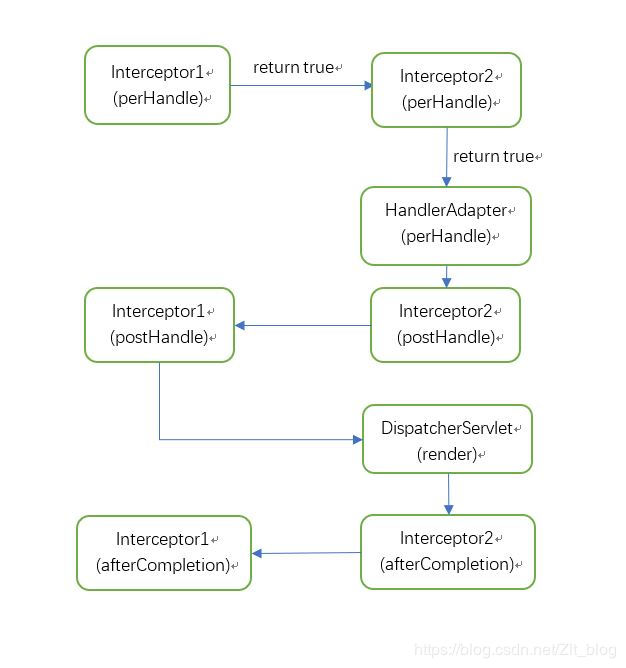

### 5.拦截器的线程安全问题
由于拦截器是单例,因此不管多少用户请求多少次都只有一个拦截器实现,即线程不安全。
所以在必要时可以在拦截器中使用`ThreadLocal`,它是和线程绑定,一个线程一个`ThreadLocal`,A 线程的`ThreadLocal`只能看到A线程的`ThreadLocal`,不能看到B线程的`ThreadLocal`。
* 记录执行`Controller`所用的时间
```java
package com.lele.interceptor;

import javax.servlet.http.HttpServletRequest;
import javax.servlet.http.HttpServletResponse;

import org.springframework.web.servlet.handler.HandlerInterceptorAdapter;

public class TimeInterceptor extends HandlerInterceptorAdapter {

	// 每一个线程对象自己的ThreadLocal
	private ThreadLocal<Long> threadLocal = new ThreadLocal<>();

	@Override
	public boolean preHandle(HttpServletRequest request, HttpServletResponse response, Object handler)
			throws Exception {

		// 记录开始请求的时间
		long startTime = System.currentTimeMillis();

		// 保证开始时间属于同一个线程，保证数据安全，存放进ThreadLocal中
		threadLocal.set(startTime);

		return true;
	}

	@Override
	public void afterCompletion(HttpServletRequest request, HttpServletResponse response, Object handler, Exception ex)
			throws Exception {
		// 记录结束的时间
		long endTime = System.currentTimeMillis();

		//从ThreadLocal中拿到存进去的开始时间
		Long startTime = threadLocal.get();

		System.out.println("共耗时 " + (endTime - startTime) + "s");
	}

}
```
Spring 配置文件中配置拦截器
```xml
<!-- 配置拦截器 -->
<bean id="timeInterceptor" class="com.lele.interceptor.TimeInterceptor" />

<!-- Spring MVC 提供的拦截器配置方式 -->
<mvc:interceptors>
	<mvc:interceptor>
	<!--
		哪些请求做拦截
		/* 一层子目录
		/** 拦截多层路径
	-->
	<mvc:mapping path="/*"/>
	<!-- 拦截器的位置 -->
	<ref bean="timeInterceptor" />
	</mvc:interceptor>
</mvc:interceptors>
```

## (九).Spring MVC的注解
* 使用注解需要有aop的jar包

### 1.支持注解生效的配置
使用注解可以可以省略很多的操作，但是如果写了注解的配置，需要在Spring的配置文件中配置MVC的注解驱动，让MVC去加载注册驱动，来识别注解
在Spring的配置文件中加入下面的代码，即可完成配置
```xml
<!-- 注解驱动，让MVC识别MVC的注解 -->
<mvc:annotation-driven />
```
### 2.基于`Controller`的注解
* 使用注解后，就不需要再实现特定的接口,任意一个JavaBean对象都可以当做处理器对象，对象中的任意一个方法都可以作为处理器的方法，但是使用注解前，需要在Spring配置文件中指定扫描哪些包中类的MVC注解，在Spring的配置文件中配置
```xml
<!-- 设置扫描哪些注解,包及其子包 -->
<context:component-scan base-package="com.lele.annotation" />
```

#### (1).处理器的注解`@Controller`
表示当前类是一个处理器，里面的方法，只要加了`@RequestMapping`注解，就是可以处理页面请求的方法
#### (2).处理器方法的注解`@RequestMapping`
* 使用`@RequestMapping`注解，需要在Spring配置文件中配置视图解析器，静态资源的处理方式等
```xml
<!-- 静态资源处理 -->
<mvc:default-servlet-handler/>

<!--
	配置视图解析器
	如果不写，有默认配置，前缀，后缀都是""
-->
<bean class="org.springframework.web.servlet.view.InternalResourceViewResolver">
	<property name="viewClass" value="org.springframework.web.servlet.view.JstlView"/>
	<property name="prefix" value="/WEB-INF/pages/exercises/"/>
	<property name="suffix" value=".jsp"/>
</bean>
```
* `@RequestMapping`注解可以设置以下的内容
```java
@RequestMapping(
		//设置请求地址
		value = {"",""},
		//设置请求方式
		method = {RequestMethod.GET,RequestMethod.POST},
		//设置请求头
		headers = {"",""},
		//请求数据中有指定的参数名
		params = {"",""},
		//处理请求的提交内容类型
		consumes = {"",""},
		//返回的内容类型
		produces = {"",""}
)
```

##### 1).映射请求地址路径`value`值(默认)
`String[] value() default {};`默认是请求路径，类型是`String[]`
* `@RequestMapping()`可以同时写在类和方法上，此时访问路径是`/类/方法`
有如下写法
```java
@RequestMapping("/path")
@RequestMapping({"/path"})
@RequestMapping({"/path","/path1"})
@RequestMapping(value = "/path")
@RequestMapping(value = { "/path" })
@RequestMapping(value = { "/path" , "/path1"})
```

###### <1>普通URL路径映射
`@RequestMapping()`简单写一个路径，只有这一个参数，可以省略参数名`value`不写
多个URL是可以映射到同一个处理器的
```java
@RequestMapping("/user")
public String user() {
	return "exercises";
}
```
###### <2>URI模板模式映射(REST风格)
* 路径占位符`{value}`,在形参里可以使用`@PathVariable`获取请求的参数值，也可以在形参里不加这个注解，使用`?`拼接URL(?参数名=参数值),也可以获取到参数值
* 例1
```java
/**
 * URL模板模式映射
 *
 */
@RequestMapping("/user/{name}")
public String user(@PathVariable String name) {
	System.out.println("name = "+name);
	return "exercises";
}

/**
 * 访问URL为
 *http://www.leleplus.com/SpringMVC-exercises/user/Jerry
 *http://www.leleplus.com/SpringMVC-exercises/user/12345
 */

```
* 例2
```java
// 模拟根据ID和产品数量，创建订单
@RequestMapping("/product/{productId}/create/number/{number}")
public String product(@PathVariable Integer productId,@PathVariable Integer number) {
	System.out.println(productId+"-"+number);
	return "exercises";
}
/**
 * 请求URL地址为
 * http://www.leleplus.com/SpringMVC-exercises/product/107/create/number/500
 */
```

###### <3>Ant风格URL路径映射
* `/**`代表所有的子路径
```java
/**
 * 可以访问的URL路径，name=  可以接收参数值
 * http://www.leleplus.com/SpringMVC-exercises/ant
 * http://www.leleplus.com/SpringMVC-exercises/ant?name=Jerry
 * http://www.leleplus.com/SpringMVC-exercises/ant/aaa
 * http://www.leleplus.com/SpringMVC-exercises/ant/aaa?name=Jerry
 * http://www.leleplus.com/SpringMVC-exercises/ant/aaa/bbb/ccc
 * http://www.leleplus.com/SpringMVC-exercises/ant/aaa/bbb/ccc?name=Jerry
 * http://www.leleplus.com/SpringMVC-exercises/ant/123
 */
@RequestMapping("/ant/**")
public String ant(String name) {
	System.out.println("name = "+name);
	return "exercises";
}
/*******************************************/
/**
*
* 可以访问的URL路径
* http://www.leleplus.com/SpringMVC-exercises/ant/abc
* http://www.leleplus.com/SpringMVC-exercises/ant/abc?name=jerry
* http://www.leleplus.com/SpringMVC-exercises/ant/abc/def?name=jerry
*/
@RequestMapping("/ant/**/{name}")
public String ant(String name) {
	System.out.println("name = "+name);
	return "exercises";
}
```
* `?` 有且只有一个字符
```java
/**
* 可以访问的URL路径
* http://www.leleplus.com/SpringMVC-exercises/ant/a
* http://www.leleplus.com/SpringMVC-exercises/ant/1
* http://www.leleplus.com/SpringMVC-exercises/ant/1?name=jerry
*/
@RequestMapping("/ant/?")
public String ant(String name) {
	System.out.println("name = "+name);
	return "exercises";
}

```
* `*` `0~n`个字符
```java
/**
* 可以访问的URL路径
* http://www.leleplus.com/SpringMVC-exercises/ant
* http://www.leleplus.com/SpringMVC-exercises/ant?name=Jerry
* http://www.leleplus.com/SpringMVC-exercises/antadxasx
* http://www.leleplus.com/SpringMVC-exercises/antadxasx?name=jerry
*/
@RequestMapping("/ant*")
public String ant(String name) {
	System.out.println("name = "+name);
	return "exercises";
}

```

* `/*` 匹配一级目录
```java
/**
* 可以访问的URL路径
* http://www.leleplus.com/SpringMVC-exercises/ant/abc
* http://www.leleplus.com/SpringMVC-exercises/ant/abc?name=jerry
*/
@RequestMapping("/ant/*")
public String ant(String name) {
	System.out.println("name = "+name);
	return "exercises";
}
```

###### <4>正则表达式风格的URL路径映射
* 正则表达式的URL路径语法`{变量名:正则表达式}`
* 使用注解`@PathVariable`可以提取正则表达式里的值
①正则表达式语法
* 中括号`[]`匹配
	`[abc]`  查找方括号之间的任何字符。
	`[^abc]` 查找任何不在方括号之间的字符。
	`[0-9]`  查找任何从 0 至 9 的数字。
	`[a-z]`  查找任何从小写 a 到小写 z 的字符。
	`[A-Z]`  查找任何从大写 A 到大写 Z 的字符。
	`[A-z]`  查找任何从大写 A 到小写 z 的字符。
	`(red|blue|green)` 	查找任何指定的选项。(OR)

* 元字符
	`.`	  查找单个任意字符,除了换行和行结束符.如果要表示.这个字符,需要转义
	`\w` 	查找单词字符。 `字母`、`数字`、`_`
	`\W` 	查找非单词字符。非`字母`、`数字`、`_`
	`\d` 	查找数字。
	`\D` 	查找非数字字符。
	`\s` 	查找空白字符。
	`\S` 	查找非空白字符。
	`\b` 	匹配单词边界。
	`\B` 	匹配非单词边界。
	`\0` 	查找 NUL 字符。
	`\n` 	查找换行符。
	`\f` 	查找换页符。
	`\r` 	查找回车符。
	`\t` 	查找制表符。
	`\v` 	查找垂直制表符。

* 量词
	`n+` 	匹配任何包含至少一个 `n` 的字符串。   1~多 个
	`n*` 	匹配任何包含零个或多个 `n` 的字符串。 0~多 个
	`n?` 	匹配任何包含零个或一个 `n` 的字符串。 0/1
	`n{X}` 	匹配包含 `X` 个 `n` 的序列的字符串。
	`n{X,Y}`匹配包含 `X` 到 `Y` 个 `n` 的序列的字符串。
	`n{X,}` 匹配包含至少 `X` 个 `n` 的序列的字符串。(多余不限)
	`n$` 	匹配任何结尾为 `n` 的字符串。
	`^n` 	匹配任何开头为 `n` 的字符串。
	`?=n` 	匹配任何其后紧接指定字符串 `n` 的字符串。
	`?!n` 	匹配任何其后没有紧接指定字符串 `n` 的字符串。
②正则表达式的URL路径映射
正则表达式风格的URL路径映射是一种特殊的URI模板模式映射
URI模板模式映射不能指定模板变量的数据类型,如是数字还是字符串；
正则表达式风格的URL路径映射,可以指定模板变量的数据类型,可以将规则写的相当复杂。

##### 2).设置请求方式`method`值
一般获取数据为`GET`请求方法,提交表单一般为`POST`请求方法。
```java
// 设置请求方式是POST或者GET
@RequestMapping(value="/method", method={RequestMethod.POST,RequestMethod.GET})
```
* 注:
	* 一般浏览器只支持`GET`、`POST`请求方法,如想浏览器支持`PUT`、`DELETE`等请求方法只能模拟。(jquery中的ajax函数可以发送这些方式的请求)
	* 除了`GET`、`POST`,还有`HEAD`、`OPTIONS`、`PUT`、`DELETE`、`TRACE`(观察servlet源码也可获知)
	* `DispatcherServlet`默认开启对`GET`、`POST`、`PUT`、`DELETE`、`HEAD`的支持；
	* 如果需要支持`OPTIONS`、`TRACE`,请添加`DispatcherServlet`在web.xml 的初始化参数:`dispatchOptionsRequest`和
	`dispatchTraceRequest`为`true`。(查看源码,在`DispatcherServlet`的父类中可以找到这个俩个属性)

##### 3).设置请求头`headers`值
###### <1>请求头数据中有指定参数名
```java
// 表示请求的URL必须为"/header/test1"且请求头中必须有Accept参数才能匹配。
@RequestMapping(value="/header/test1", headers="Accept")

// 表示请求的URL必须为"/header/test1"且请求头中必须有my_test参数才能匹配
@RequestMapping(value="/header/test1", headers="my_test")
```
###### <2>请求头数据中不能包含指定参数名
```java
// 表示请求的URL必须为"/header/test2"且请求头中必须没有abc参数才能匹配
@RequestMapping(value="/header/test2", headers="!abc")
```
###### <3>请求头数据中指定参数名和值
```java
// 表示请求的URL必须为"/header/test3"且请求头中必须有"Content-Type=application/json"参数即可匹配。
@RequestMapping(value="/header/test3", headers="Content-Type=application/json")
```
###### <4>请求头数据中指定某个参数不能是某个值
```java
// 表示请求的URL必须为"/header/test4"且请求头中必须有Accept参数,但是值不等于text/html即可
@RequestMapping(value="/header/test4", headers="Accept!=text/html")

// 表示请求头信息中要么不出现Content-Type属性,如果出现了那么它的值一定不能等于application/json
@RequestMapping(value="/test1",headers="Content-Type!=application/json")
```

###### <5>组合使用
**且**的关系
```java
// 表示请求的URL必须为"/header/test5"且请求头中必须有"Accept"参数但值不等于"text/html"且请求中必须有参数"abc"并且值是123，才可匹配。
@RequestMapping(value="/header/test5", headers={"Accept!=text/html", "abc=123"}):
```
##### 4).请求数据中指定参数名`params`
###### <1>请求数据中指定参数名
```java
//请求地址的父路径
@RequestMapping("/param")
@Controller
public class HomeController {
	// 设置请求方式是get，并且指定请求参数是create
	@RequestMapping(params="create",method=RequestMethod.GET)
	public ModelAndView test1(){

		return null;
	}
	// 设置请求方式是Post，并且指定请求参数是create
	@RequestMapping(params="create",method=RequestMethod.POST)
	public ModelAndView test2(){

		return null;
	}
}
```
匹配到的路径为`/param?create`
如果是get 方式的请求则访问test1()
如果是post方式的请求则访问test2()
###### <2>请求数据中不能包含指定参数名
```java
// 请求方式是GET请求，请求参数不能包含create
@RequestMapping(params="!create", method=RequestMethod.GET)
```
###### <3>请求数据中指定参数名和值
```java
@RequestMapping(params="username=tom")
```
###### <4>请求数据中指定参数名不能为某个值
`username`参数名可以不出现,但是如果出现了,那么参数值一定不能等于tom
```java
@RequestMapping(params="username!=tom")
```
###### <5>请求数据中指定参数组合使用
组合使用是**且**的关系
```java
@RequestMapping(params={"create","username=tom"})
```
##### 5).设置请求的提交内容类型`consumes`(消费)
```java
// 方法仅处理请求中,Content-Type为"application/json"的情况
@RequestMapping(value="/test",consumes="application/json")
```
##### 6).设置返回的内容类型`produces`值(生产)
```java
// 表示该功能处理方法将产生json格式的数据,此时根据请求头中的Accept进行匹配,如请求头"Accept=application/json"时即可匹配;
@RequestMapping(value= "/test", produces="application/json")
```
#### (3).基于注解后,`Controller`的返回值
##### 1).返回`ModelAndView`逻辑视图
```java
package com.lele.annotation;

import org.springframework.stereotype.Controller;
import org.springframework.web.bind.annotation.RequestMapping;
import org.springframework.web.servlet.ModelAndView;

/**
 * 基于MVC注解的处理器配置
 * @author lele
 *
 */
@Controller
public class AnnotationController {

	//返回ModelAndView
	@RequestMapping("/method1")
	public ModelAndView method_One() {
		ModelAndView mv = new ModelAndView("exercises");
		mv.addObject("msg", "This is a Annotation Controller for Method_One!");
		return mv;
	}

}
```
##### 2).返回`String`类型字符串
表示跳转的逻辑视图的名字，Model模型可以从参数传过来
```java
//返回String,参数传Model
@RequestMapping("/method2")
public String method_Two(Model model) {
	model.addAttribute("msg", "This is a Annotation Controller for Method_Two!");
	return "exercises";
}
```
##### 3).返回类型是`void`
返回类型是`void`时，可以通过参数`HttpServletRequest`,`HttpServletResponse`来使用原来Servlet的相关功能，包括重定向和内部跳转
```java
//不返回,参数传Model
@RequestMapping("/method3")
public void method_Three(HttpServletRequest request,HttpServletResponse response) throws IOException {

	String username = request.getParameter("username");

	request.setAttribute("username", username);

	PrintWriter pw = response.getWriter();
	pw.write("This is a Controller for method_Three!");
	pw.flush();

	//以前的Servlet的所有方法都可以使用/重定向等
}
```
### 3.数据绑定
#### (1).请求和响应对象
`HttpServletRequest,HttpServletResponse,ServletRequest,ServletResponse`Spring MVC会自动把Servlet请求作为参数传递
实例:
```java
package com.lele.databinging;

import java.io.IOException;
import java.io.PrintWriter;

import javax.servlet.ServletRequest;
import javax.servlet.ServletResponse;
import javax.servlet.http.HttpServletRequest;
import javax.servlet.http.HttpServletResponse;

import org.springframework.stereotype.Controller;
import org.springframework.web.bind.annotation.RequestMapping;

@Controller
@RequestMapping("/databing")
public class TenMethodDataBindingController {
	/**
	 * Spring MVC传入的请求响应对象
	 * @param  request     HttpServletRequest对象
	 * @param  response    HttpServletResponse对象
	 * @param  req         ServletRequest对象
	 * @param  resp        ServletResponse对象
	 * @throws IOException 用流写一个页面给响应，可能会抛出异常
	 */

	@RequestMapping("/method1")
	public void method_One(HttpServletRequest request, HttpServletResponse response,
			ServletRequest req,ServletResponse resp) throws IOException {

		System.out.println(request.getClass());
		System.out.println(response.getClass());
		System.out.println(req.getClass());
		System.out.println(resp.getClass());

		PrintWriter pw = response.getWriter();

		PrintWriter writer = resp.getWriter();

		pw.write("<h1>response_method_One</h1>");
		writer.write("<h1>resp_method_One</h1>");

	/**打印结果:
	 * class org.apache.catalina.connector.RequestFacade
	 * class org.apache.catalina.connector.ResponseFacade
	 * class org.apache.catalina.connector.RequestFacade
	 * class org.apache.catalina.connector.ResponseFacade
	 *
	 */
	}

}
```
#### (2).字节、字符输入输出流
* 字节输入输出流:`InputStream`和`OutputStream`
* 字符输入输出流:`Reader`和`Writer`
* 字节和字符流是不能一起使用的，只能使用其中的一组
* 使用输出流就不能再返回视图了，使用输出流就是使用了`Response`，要用`Response`向浏览器返回内容，就不能让`Controller`来完成了，如果还要返回视图，会报500的错误
* 实例:
```java
package com.lele.databinging;

import java.io.InputStream;
import java.io.OutputStream;

import org.springframework.stereotype.Controller;
import org.springframework.web.bind.annotation.RequestMapping;

@Controller
@RequestMapping("/databing")
public class TenMethodDataBindingController {

	/**
	 * 字节输入输出流的实例方法
	 * @param in  字节输入流
	 * @param out 字节输出流
	 */
	@RequestMapping("/method2")
	public void method_TwoWiteByte(InputStream in,OutputStream out) {

		System.out.println(in.getClass());
		System.out.println(out.getClass());

		/**
		 * 打印结果:
		 * class org.apache.catalina.connector.CoyoteInputStream
		 * class org.apache.catalina.connector.CoyoteOutputStream
		 */
	}

	/**
	 * 字符输入输出流的实例方法
	 * @param read  字符输入流
	 * @param write 字符输出流
	 */
	@RequestMapping("/method22")
	public void method_TwoWiteChar(Reader read,Writer write) {

		System.out.println(read.getClass());
		System.out.println(write.getClass());
		/**
		 * 打印结果:
		 * class org.apache.catalina.connector.CoyoteReader
		 * class org.apache.catalina.connector.CoyoteWriter
		 */
	}

}
```

#### (3).`WebRequest`和`NativeWebRequest`对象
* `WebRequest`是Spring MVC提供的统一请求访问接口,可以访问请求相关数据(如参数区数据、请求头数据,但不能访问Cookie区数据),还可以访问会话和上下文中的数据；
* `NativeWebRequest`继承了`WebRequest`,并提供访问本地Servlet API的方法。
```java
package com.lele.databinging;

import javax.servlet.http.HttpServletRequest;

import org.springframework.stereotype.Controller;
import org.springframework.web.bind.annotation.RequestMapping;
import org.springframework.web.context.request.NativeWebRequest;
import org.springframework.web.context.request.WebRequest;

@Controller
@RequestMapping("/databing")
public class TenMethodDataBindingController {

	/**
	 * 获得WebRequest和NativeWebRequest的实例方法
	 * @param  wRe  Spring MVC 传给的WebRequest对象
	 * @param  nWRe Spring MVC传给的NativeWebRequest对象
	 * @return      视图页面
	 */
	@RequestMapping("/method3")
	public String method_Three(WebRequest wRe,NativeWebRequest nWRe) {

		System.out.println(wRe.getClass());
		System.out.println(nWRe.getClass());
		/**
		 * 打印请求:
		 * class org.springframework.web.context.request.ServletWebRequest
		 * class org.springframework.web.context.request.ServletWebRequest
		 */
		//WebRequest的部分方法
		//访问请求参数区的数据
		String parameter = wRe.getParameter("");
		/**
		 * 取指定范围内的数据
		 * SCOPE_REQUEST :代表请求作用范围；
		 * SCOPE_SESSION :代表会话作用范围；
		 * SCOPE_GLOBAL_SESSION :代表全局会话作用范围,即ServletContext上下文作用范围。
		 */
		Object attribute = wRe.getAttribute("", WebRequest.SCOPE_REQUEST);
		Object attribute2 = wRe.getAttribute("", 1);


		String contextPath = wRe.getContextPath();
		String sessionId = wRe.getSessionId();
		//访问请求头数据
		String header = wRe.getHeader("");

		//NativeWebRequest的部分方法
		//拿到本地的Servlet API
		HttpServletRequest httpServletRequest = nWRe.getNativeResponse(HttpServletRequest.class);
		Object nativeRequest = nWRe.getNativeRequest();

		return "exercises";
	}

}
```

#### (4).`HttpSession`对象
* `session`访问不是线程安全的,如果需要线程安全,需要自己手动的设置`AnnotationMethodHandlerAdapter`或`RequestMappingHandlerAdapter`的`synchronizeOnSession`属性为`true`,即可线程安全的访问session。
* 在spring2.5中是`AnnotationMethodHandlerAdapter`
* 在spring3中是`RequestMappingHandlerAdapter`.

实例:
```java
package com.lele.databinging;


import javax.servlet.http.HttpSession;

import org.springframework.stereotype.Controller;
import org.springframework.web.bind.annotation.RequestMapping;

@Controller
@RequestMapping("/databing")
public class TenMethodDataBindingController {

	/**
	 * 获取Spring MVC传给的HttpSession对象的方法
	 * @param  session 传入的HttpSession对象
	 * @return         逻辑视图
	 */

	@RequestMapping("/method4")
	public String method_four(HttpSession session) {

		System.out.println(session.getClass());

		//session存值
		session.setAttribute("", "");
		//获取session的id值
		String id = session.getId();
		System.out.println(id);
		//session取值
		Object attribute = session.getAttribute("");
		//从session中移除某个值
		session.removeAttribute("");
		return "exercises";

		/**
		 * 打印结果:
		 * class org.apache.catalina.session.StandardSessionFacade
		 * 00EF1E161CF455E249CBA30C59913EAA
		 */
	}

}
```
#### (5).命令表单对象(自定义对象)
Spring MVC能够自动将请求参数绑定到功能处理方法的命令或者表单对象上。
(将前台页面传递的参数，自动封装为对象)
自动封装对象必须保证前台页面各个输入标签的`name`属性名称与类中的属性名称对应,这个实体bean对象可以不在Spring的配置文件中做注入配置，不配置的bean对象没有默认值，是空对象，如果需要有默认值，在Spring的配置文件中注入该对象即可
例如:
从注册页面传递的用户信息，直接封装为一个`User`对象
```java
package com.lele.databinging;

import javax.servlet.http.HttpServletRequest;

import org.springframework.stereotype.Controller;
import org.springframework.web.bind.annotation.RequestMapping;

import com.lele.bean.User;

@Controller
@SuppressWarnings("all")
@RequestMapping("/databing")
public class TenMethodDataBindingController {

	/**
	 * Spring MVC将前台页面的数据自动封装为对象的实例
	 * @param  request Spring MVC提供的HttpServletRequest对象
	 * @param  user    前台页面需要自动封装好的实体类bean对象
	 * @return         页面数据封装好需要跳转的页面
	 */
	@RequestMapping("/method5")
	public String method_Five(HttpServletRequest request,User user) {

		System.out.println(user);

		request.setAttribute("msg", "注册成功！");

		return "exercises";
	}

}
```
#### (6).内置模型数据处理对象`Model`、`Map`和`ModelMap`
这三个对象虽然类型不同，但是都是同一个对象`org.springframework.validation.support.BindingAwareModelMap`，是Spring MVC内置提供的,完全相同的三个对象
```java
package com.lele.databinging;

import java.util.Map;

import org.springframework.stereotype.Controller;
import org.springframework.ui.Model;
import org.springframework.ui.ModelMap;
import org.springframework.web.bind.annotation.RequestMapping;

@Controller
@SuppressWarnings("all")
@RequestMapping("/databing")
public class TenMethodDataBindingController {

	/**
	 * Spring MVC提供的三个内置Map集合对象实例
	 * @param  model    Model对象
	 * @param  map      Map对象
	 * @param  modelMap ModelMap对象
	 * @return          页面访问的视图
	 */

	@RequestMapping("/method6")
	public String method_six(Model model,Map<String, Object> map,ModelMap modelMap) {

		//查看三个对象的全限定类名
		System.out.println(model.getClass());
		System.out.println(map.getClass());
		System.out.println(modelMap.getClass());

		//查看三个对象是不是同一个对象
		System.out.println(model == map);
		System.out.println(map== modelMap);

		//三个map对象里存值
		model.addAttribute("msg", "Spring MVC提供的内置Map对象");
		map.put("msg", "Spring MVC提供的内置Map对象");
		modelMap.put("msg", "Spring MVC提供的内置Map对象");

		return "exercises";
		/**
		 * 打印输出结果
		 * class org.springframework.validation.support.BindingAwareModelMap
		 * class org.springframework.validation.support.BindingAwareModelMap
		 * class org.springframework.validation.support.BindingAwareModelMap
		 * true
		 * true
		 *
		 */
	}

}
```
#### (7).`HttpEntiity`对象和`ResponseEntity`对象
`HttpEntiity`对象可以得到请求的相关内容
`ResponseEntity`自定义响应的相关内容
```java
package com.lele.databinging;

import java.nio.charset.Charset;
import java.util.List;
import java.util.Map.Entry;
import java.util.Set;

import org.springframework.http.HttpEntity;
import org.springframework.http.HttpHeaders;
import org.springframework.http.HttpStatus;
import org.springframework.http.MediaType;
import org.springframework.http.ResponseEntity;
import org.springframework.stereotype.Controller;
import org.springframework.web.bind.annotation.RequestMapping;

@Controller
@SuppressWarnings("all")
@RequestMapping("/databing")
public class TenMethodDataBindingController {

	/**
	 * HttpEntity对象和ResponseEntity对象的使用实例
	 * @param  httpEntity Spring MVC提供的HttpEntiry对象
	 * @return            返回ResponseEntity对象
	 */

	@RequestMapping("method7")
	public ResponseEntity<String> method_Seven(HttpEntity<String> httpEntity) {

		//获得请求头
		HttpHeaders headers = httpEntity.getHeaders();

		//获得请求体中的所有body部分
		String body = httpEntity.getBody();
		//拿到请求头信息的集合
		Set<Entry<String, List<String>>> Set = headers.entrySet();
		//遍历请求头里的内容
		/**
		 * 注意这个Set集合
		 * Set集合里放的是Entry,Entry里是String类型的key和List类型的V
		 * List里放的是String类型的值，里面才是key对应的内容
		 * 所以下面的一行代码相当于
		 * for(Entry<String,List<String>> entry : Set){
		 * 		List<String> list = entry.getValue();
		 * 		for(String value:list){
		 * 			System.out.println(entry.getKey()+" : "+value);
		 * 		}
		 * }
		 *
		 */
		Set.forEach(s->s.getValue().forEach(l->System.out.println(s.getKey()+" : "+l)));
		System.out.println("--------------------------------");
		//输出请求体中的body
		System.out.println("body : "+body);

		//创建响应头(上面是得到请求头，下面用的是响应头，不是同一个对象，需要重新创建)
		headers = new HttpHeaders();
		//使用MediaType对象设置ContentType，放到响应头中
		headers.setContentType(new MediaType("text","html",Charset.forName("UTF-8")));

		//响应体
		String content = "This is method_Seven!";
		//使用响应内容，响应头，状态码，创建响应对象
		ResponseEntity<String> responseEntity = new ResponseEntity<String>(content,headers,HttpStatus.OK);
		//返回ResponseEntity对象
		return responseEntity;
	}
	//	打印输出结果:
	//	host : www.leleplus.com
	//	user-agent : Mozilla/5.0 (Windows NT 10.0; Win64; x64; rv:70.0) Gecko/20100101 Firefox/70.0
	//	accept : text/html,application/xhtml+xml,application/xml;q=0.9,*/*;q=0.8
	//	accept-language : zh-CN,zh;q=0.8,zh-TW;q=0.7,zh-HK;q=0.5,en-US;q=0.3,en;q=0.2
	//	accept-encoding : gzip, deflate
	//	connection : keep-alive
	//	cookie : JSESSIONID=ADDEA8803532AF9E1CD8D93D2534C231; hibext_instdsigdipv2=1
	//	upgrade-insecure-requests : 1
	//	pragma : no-cache
	//	cache-control : no-cache
	//	--------------------------------
	//	body : null

}
```
#### (8).`SessionStatus`对象
该对象用来清除使用`@SessionAttributes()`注解之后，存放到session里的数据，后面部分有实例
```java
package com.lele.databinging;

import org.springframework.stereotype.Controller;
import org.springframework.web.bind.annotation.RequestMapping;
import org.springframework.web.bind.support.SessionStatus;

@Controller
@SuppressWarnings("all")
@RequestMapping("/databing")
public class TenMethodDataBindingController {

	/**
	 * SessionStatus对象的实例
	 * @param  sessionStatus SessionStatus对象
	 * @return               响应的视图
	 */

	@RequestMapping("/method8")
	public String method_right(SessionStatus sessionStatus) {

		System.out.println(sessionStatus.getClass());
		return "exercises";
	}
	/**
	 * 打印输出结果
	 * class org.springframework.web.bind.support.SimpleSessionStatus
	 */

}
```
#### (9).`RedirectAttributes`重定向闪存数据对象
* `RedirectAttributes`对象可以用来把数据存储起来，在满足重定向页面的同时，还能把数据放到`request`请求中
* `RedirectAttributes`对象中的数据只能使用一次，属于闪存(flash)，刷新页面之后数据就不见了
* `RedirectAttributes addFlashAttribute(String attributeName, Object attributeValue);`该方法可以把数据闪存到`request`请求中，在客户端同样可以使用EL表达式`${msg}`取出数据，不用接受该对象的返回值

##### 1).使用此对象的原因
###### <1>服务器内部跳转
当前一个表单提交(post方式)给`Controller`之后,`Controller`处理完带着数据(msg="添加成功")进行服务器内部跳转到一个页面,页面里使用EL表达式拿出`msg`中的值并显示出来,这个时候用户按F5刷新,那么表单数据会再被提交一次。这个时候如果用户多刷新了几次页面，后台就拿到好多次数据，数据库中的数据就会被重复的插入，此时会造成错误！
```java
//服务器内部跳转,页面表单提交的映射方法
@RequestMapping("/method9")
public String method_five(User user,HttpServletRequest request) throws IOException {
	System.out.println(user);
	request.setAttribute("msg", "注册成功！");
	return "exercises";
}
```
页面刷新N次,就会提交N次数据


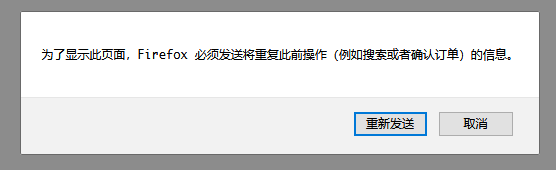

同样的，后台收到N次数据

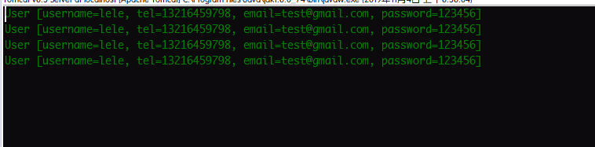

###### <2>使用客户端重定向
客户端重定向解决后台数据重复接收的问题
由于上面的代码采用了服务器内部跳转，跳转之后，浏览器地址栏的路径并没有发生改变，用户刷新页面会导致同一个数据重复提交，产生后台数据问题，这次采用客户端重定向，解决向后台多次发送数据的问题
```java
/**
 * 表单提交之后的映射处理方法
 * 获取到表单数据对象，将信息传递到页面请求中
 * 重定向到另一个映射处理方法
 */
@RequestMapping("/method9")
public String method_five(User user,HttpServletRequest request) throws IOException {
	System.out.println(user);
	request.setAttribute("msg", "注册成功！");
	/**
	 * 客户端要重定向的页面，这里调用了另一个映射方法
	 */
	return "redirect:repage";
}
/**
 * 重定向之后跳转的页面
 */
@RequestMapping("/repage")
public String redirectPage() {
	return "exercises";
}
```
重定向之后页面的地址路径改变，多次刷新，刷新的是重定向之后的页面，不再重复提交表单

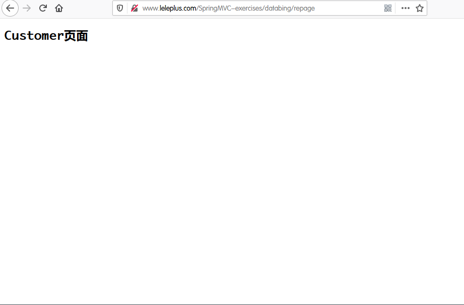

后台也只会收到第一次提交的数据

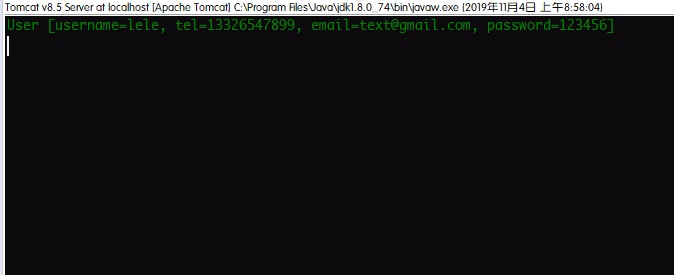

出现了新的问题，页面传递过来的数据不见了,数据放在了`request`里面，重定向之后，已经不是同一个`request`对象了，数据已经不在了。

##### 2).`RedirectAttributes`对象的实例
使用`RedirectAttributes`对象，将重定向之后的数据存到`request`中
```java
package com.lele.databinging;

import java.io.IOException;

import org.springframework.stereotype.Controller;
import org.springframework.web.bind.annotation.RequestMapping;
import org.springframework.web.servlet.mvc.support.RedirectAttributes;

import com.lele.bean.User;

@Controller
@SuppressWarnings("all")
@RequestMapping("/databing")
public class TenMethodDataBindingController {

	/**
	 * 使用RedirectAttributes对象闪存数据到Request的实例
	 * @param  user               前台表单提交的数据，封装后传递过来的对象
	 * @param  redirectAttributes 闪存数据的RedirectAttributes对象
	 * @return                    要重定向的映射处理方法
	 *
	 */
	@RequestMapping("/method9")
	public String method_five(User user,RedirectAttributes redirectAttributes) {

		System.out.println(user);
		//这里不能再使用request.setAttribute来存储数据，重定向之后，数据就拿不到了
//		request.setAttribute("msg", "注册成功！");
		// 闪存数据到RedirectAttributes对象中
		redirectAttributes.addFlashAttribute("msg", "注册成功！");
		// 数据存储完成之后再重定向
		return "redirect:repage";
	}

	/**
	 * 重定向到这个方法之后，要返回的页面
	 * @return 逻辑视图的页面，交给视图解析器处理
	 */

	@RequestMapping("/repage")
	public String redirectPage() {
		return "exercises";
	}

}
```
此时再次访问页面，是可以拿到数据的，多次刷新页面，也只会提交一次表单

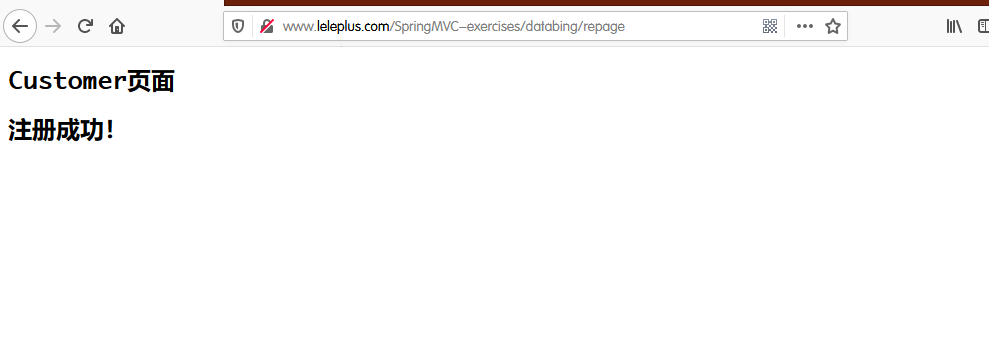

后台只是接收到了第一次提交表单的数据，多次刷新，不会再拿到数据

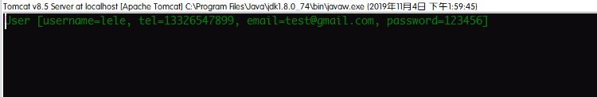

由于是闪存，只能使用一次，刷新页面之后，数据就消失了

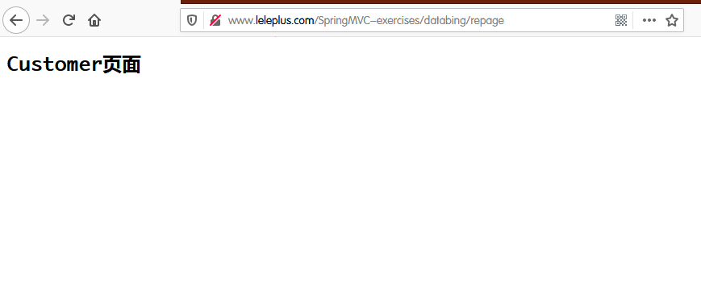

#### (10).`BindingResult`对象
该对象里可以保存Spring MVC数据校验中的错误信息，需要结合数据校验功能来使用

### 4.十二种注解
#### (1).`@Controller`注解和`@RequestMapping`注解
#### (2).`@RequestParam`映射单个请求参数值
* 单纯的一个注解，没有任何的值，跟不写时一样，表示如果传参的数据中，有跟形参同名的参数，就把值传递过来，没有就是`null`
* `value`,当前台参数名和后台形参名不一致时，指定前台要传递的参数名，只写这一个值时，`value`可省略，一旦指定了`value`值,前台参数名必须跟`value`值一样才会传值，即使和形参名一样也不会传值
* `required`设置这个参数值是不是必须要存在，默认是`true`,一旦设置这个值为`true`,就必须要传递这个参数，否则报错
* `defaultValue`设置默认值，当前台没传参数时，使用该值;默认值还可以是Spring中的SpEL表达式
* 注:当`required`设置为`true`，当前台没传值时,或者传的值和`value`名不一致时，会使用默认值(也不会报错)，传值正确，使用正确值；当`required`设置为`false`，当前台没传值时，会使用默认值，传值正确，使用正确值;一般不建议当`required`设置为`true`时，还要使用`defaultValue`，这样意义不大
实例:
```java
package com.lele.databinging;

import org.springframework.stereotype.Controller;
import org.springframework.web.bind.annotation.RequestMapping;
import org.springframework.web.bind.annotation.RequestParam;

@Controller
@RequestMapping("/twelveanno")
public class TwelveAnnotationController {

	/**
	 * 自动映射参数值
	 * @param username
	 * @return
	 * 访问地址http://www.leleplus.com/SpringMVC-exercises/twelveanno/method1?username=Jack
	 * 此时@RequestParam的注解可有可无，只要前台的参数名和形参名匹配，就能传过来
	 */
	@RequestMapping("/method1")
	public String method_One(String username) {
		System.out.println("username = "+username);
		return "exercises";

		/**
		 * 打印结果:
		 * username = Jack
		 */
	}

	/**
	 * 解决前台传入参数名和后台不一致的情况
	 * 参数注解@RequestParam("name")表示把前台参数为name的值传给形参username
	 * @param username
	 * @return
	 * 访问地址http://www.leleplus.com/SpringMVC-exercises/twelveanno/method1-1?name=Jack
	 * 访问地址http://www.leleplus.com/SpringMVC-exercises/twelveanno/method1-1?username=Jack
	 * @RequestParam(
	 *		value = "name",			将前台名为name的参数传给形参
	 *		required = false,		设置这个参数是不是必须的
	 *		defaultValue = "tom"	设置默认值
	 *	)
	 *
	 */
	@RequestMapping("/method1-1")
	public String method_One1(@RequestParam(
								value = "name",
								required = false,
								defaultValue = "tom"
		) String username) {

		System.out.println("username = "+username);

		return "exercises";

		/**
		 * 打印结果:
		 * username = Jack
		 */
	}

}
```

#### (3).`@PathVariable`URL中的变量映射到参数上
* 能将请求中的URL中的模板变量映射到功能处理方法的参数上
* 注解`@PathVariable`不可省略，省略了拿不到值
* `@PathVariable`空注解，路径里`{}`的值要跟方法形参名一致，否则报错
* `value`值，表示要将URL地址中的那个参数传过来，对应`@RequestMapping("/path/{}")`中的`{}`值，要保持一致，否则报错
* `required`属性值表示这个参数是不是必须要传，默认为`true`;当设置为`false`时，因为`/path/{param}`和`/path`是完全不同的两个请求URI，需要设置不带参数的URI的处理方法，否则`required = false`不生效，同样是404错误
* 还可以将数据放到模型中，在视图渲染的时候使用，放到模型中的数据key为`value`值(`value`为空时，为URL的`{}`中的值)
实例
```java
package com.lele.databinging;

import org.springframework.stereotype.Controller;
import org.springframework.web.bind.annotation.PathVariable;
import org.springframework.web.bind.annotation.RequestMapping;

@Controller
@RequestMapping("/twelveanno")
public class TwelveAnnotationController {


	/**
	 * 将URL中的模板变量映射到方法参数上
	 * @param name 从URI路径中传递值，必须跟路径中{}的值保持一致
	 * @return
	 * 访问地址http://www.leleplus.com/SpringMVC-exercises/twelveanno/method2/Jack
	 * @PathVariable注解必须存在，否则接收到的参数为空
	 */
	@RequestMapping("/method2/{name}")
	public String method_Two(@PathVariable String name) {

		System.out.println("name = "+name);

		return "exercises";

	/**
	 * 打印输出结果:
	 * name = Jack
	 */
	}

	/**
	 * 将URL中的模板变量映射到方法参数上
	 * @param username
	 * @return
	 * 访问地址http://www.leleplus.com/SpringMVC-exercises/twelveanno/method2-2
	 * 访问地址http://www.leleplus.com/SpringMVC-exercises/twelveanno/method2-2/Jack
	 * @RequestMapping({"/method2-2/{name}","/method2-2"}) 两个地址对应同一个映射处理方法
	 * @PathVariable(
	 * 		value = "name",		对应映射地址中的name参数，传给username形参名
	 * 		required = false 	这个参数可以不传，由于不传是另一个地址，所以设置两个地址，这个值才能生效
	 * 	)
	 */
	@RequestMapping({"/method2-2/{name}","/method2-2"})
	public String method_Two2(@PathVariable(value = "name",required = false) String username) {

		System.out.println("username = "+username);

		return "exercises";

		/**
		 * 打印输出结果:
		 * username = null
		 * username = Jack
		 *
		 */

	}
}
```

#### (4).`@CookieValue`绑定`Cookie`数据值
该注解用于将请求的`Cookie`数据映射到功能处理方法的参数上
* `@CookieValue`空注解，里面不写任何值，表示将`Cookie`数据里一个key为方法形参名的数据值传过来，而且是必须要有，否则400
* `value`将`Cookie`数据里key值为`value`的数据传递给形参，单独使用时，必须要传递，否则400
* `defaultValue`默认值，前台访问时，如果没有对应key的`Cookie`值，将默认值传递，如果有，就把正确值传过来
* `required`每次访问时，是否必须要有这个`Cookie`值,默认为`true`
实例
```java
package com.lele.databinging;

import org.springframework.stereotype.Controller;
import org.springframework.web.bind.annotation.CookieValue;
import org.springframework.web.bind.annotation.RequestMapping;

@Controller
@RequestMapping("/twelveanno")
public class TwelveAnnotationController {

	/**
	 * 绑定请求的Cookie数据的处理方法
	 * @param  sessionId 将传过来的数据绑定在这个参数上
	 * @return           视图
	 * 由于有默认值，不管是第几次访问，都是正常访问
	 */

	@RequestMapping("/method3")
	public String method_Three(@CookieValue(value = "JSESSIONID",defaultValue = "") String sessionId) {

		System.out.println("JSESSIONID = "+sessionId);

		return "exercises";

		/**
		 * 打印输出结果:
		 * 第一次访问:JSESSIONID =
		 * 之后访问:JSESSIONID = C12E67CC154239E302CB0AA9DF14B344
		 */
	}

	/**
	 * 将请求的Cookie数据值绑定到方法形参上，空注解
	 * @param  JSESSIONID 对应Cookie数据里的某一个key
	 * @return            视图
	 * 如果是空注解，形参名一定要跟Cookie数据里面的某一个key值对应，否则报404，由于是必须要有这个值，所以第一次访问是400，先访问其他前端控制器处理过得这个页面，再来访问，就会有值
	 *
	 */
	@RequestMapping("/method3-1")
	public String method_Three1(@CookieValue String JSESSIONID) {

		System.out.println("JSESSIONID = "+JSESSIONID);

		return "exercises";

		/**
		 * 打印输出结果:
		 * 第一次访问:400错误
		 * 先访问上面的方法，再来访问:JSESSIONID = D7421213DC19C5EE19A207D1D8743C9A
		 */
	}

	/**
	 * Cookie数据绑定
	 * @param  sessionId 将值绑定到这个形参上
	 * @return           视图
	 * 由于不是必须要传这个值，第一次访问为null，后面就有值
	 */

	@RequestMapping("/method3-2")
	public String method_Three2(@CookieValue(value = "JSESSIONID",required = false) String sessionId) {

		System.out.println("JSESSIONID = "+sessionId);

		return "exercises";

		/**
		 * 打印输出结果:
		 * 第一次访问:JSESSIONID = null
		 * 后续访问:JSESSIONID = D7421213DC19C5EE19A207D1D8743C9A
		 */
	}
}
```

#### (5).`@RequestHeader`绑定请求头数据
* `value`需要绑定的请求头的key值
* `defaultValue`如果主要绑定的值没有，给一个默认值
* `required`是不是必须要有这个值
* 请求头的所有key
	* `Host`
	* `User-Agent`
	* `Accept-Language`
	* `Accept-Encoding`
	* `Connection`
	* `Cookie`
	* `Upgrade-Insecure-Requests`
	* `Cache-Control`
实例
```java
package com.lele.databinging;

import org.springframework.stereotype.Controller;
import org.springframework.web.bind.annotation.RequestHeader;
import org.springframework.web.bind.annotation.RequestMapping;

@Controller
@RequestMapping("/twelveanno")
public class TwelveAnnotationController {

	/**
	 * 绑定请求头数据的实例方法
	 * @param  userAgent 绑定请求头的User-Agent值
	 * @param  cookie    绑定请求头的Cookie值
	 * @return           视图
	 */

	@RequestMapping("/method4")
	public String method_four(
			@RequestHeader("User-Agent") String userAgent,
			@RequestHeader(
					value = "Cookie",
					defaultValue = "",
					required = true
			) String cookie) {

		System.out.println("User-Agent : "+userAgent);
		System.out.println("Cookie : "+cookie);

		return "exercises";

		/**
		 * 打印输出结果:
		 * 第一次访问:
		 * User-Agent : Mozilla/5.0 (Windows NT 10.0; Win64; x64; rv:70.0) Gecko/20100101 Firefox/70.0
		 * Cookie : hibext_instdsigdipv2=1
		 * 后续访问:
		 * User-Agent : Mozilla/5.0 (Windows NT 10.0; Win64; x64; rv:70.0) Gecko/20100101 Firefox/70.0
		 * Cookie : JSESSIONID=188EDA61765907048CA7031891E323C3; hibext_instdsigdipv2=1
		 */

	}
}
```

#### (6).`@ModelAttribute`处理视图中的对象
* `value`指定存取对象的key值，如果没有指定，key值是对象类名首字母小写(User类的默认key为user)
* `binding`是不是要和视图数据绑定，默认为`true`，一般不做更改
* 查看JSP页面中的request中都有哪些值
```jsp
<%

	/***查看请求中的所有参数名****/
	Enumeration<String> enume = request.getAttributeNames();
	/*** 遍历请求中所有的参数 ***/
	while(enume.hasMoreElements()){
		/*** 拿到key和value的值 ***/
		String attrName = enume.nextElement();
		Object attrValue = request.getAttribute(attrName);

		/*** 把参数的key和value分颜色写到页面上 ***/
		out.write("<span style='color:red'>"+attrName+" : </span>");
		out.write("<span style='color:green'>"+attrValue+"</span><br>");
		//out.write(attrName+" : "+attrValue+"<br>");

		out.flush();
	}
%>
```

##### 1).作为方法参数
绑定请求参数到形参对象，同时将对象存放到模型中
* 如果是空注解或者没有写注解，放到模型中的对象key值是bean对象类名首字母小写的值;注解有`value`值，放到模型中的对象的key值是`value`值
* 在JSP页面可以采用`${value.属性名}`，也可能是`${类名首字母小写.属性名}`拿到这个值
```java
package com.lele.databinging;

import org.springframework.stereotype.Controller;
import org.springframework.web.bind.annotation.ModelAttribute;
import org.springframework.web.bind.annotation.RequestMapping;

import com.lele.bean.User;

@Controller
@RequestMapping("/twelveanno")
public class TwelveAnnotationController {

	/**
	 * 页面表单提交后调用的方法
	 * @param  user 提交后自动封装的对象
	 * @return      表单提交成功后的页面
	 * @ModelAttribute 将表单数据自动封装对象的注解
	 */
	@RequestMapping("/method5-1")
	public String method_Five1(@ModelAttribute("userInfo") User user) {

		System.out.println(user);

		return "exercises";

		/**
		 * 打印输出结果:
		 * User [username=lele, tel=13216459798, email=exp@gmail.com, password=123456]
		 */
	}

	/**
	 * 不推荐的做法
	 * @param  user  提交表单后自动封装的对象
	 * @param  model Model视图
	 * @return       表单提交成功后的页面
	 *
	 */

	@RequestMapping("/exp")
	public String exp(User user,Model model) {

		System.out.println(user);

		// 这里获得封装好的对象的同时，已经自动把bean对象存放到了模型中
		// 这里是完全多余的一步操作，此时请求中已经存在了两个相同的对象，一个是user，一个是手动添加的u
		model.addAttribute("u",user);

		return "exercises";
	}
}
```

##### 2).添加在方法上
向模型中添加数据,优先访问方法上有`@ModelAttribute()`注解的方法,将对应的返回值放到模型中
```java
package com.lele.databinging;

import java.util.Arrays;
import java.util.List;

import org.springframework.stereotype.Controller;
import org.springframework.web.bind.annotation.ModelAttribute;
import org.springframework.web.bind.annotation.RequestMapping;

@Controller
@RequestMapping("/twelveanno")
public class TwelveAnnotationController {

	/**
	 * 先调用这个方法，将返回值放到模型中
	 * @return 放到模型中的对象
	 *
	 * 对于集合类型，默认放到模型中的key为泛型首字母小写加集合类型
	 * 例如List<User>,对应的Key为userList
	 *
	 */

	@ModelAttribute()
	public List<String> setList(){

		List<String> list = Arrays.asList("北京","苏州","昆山","杭州");

		return list;
	}

	/**
	 * 上面的方法把对象放到模型中去，这里才能拿到这个数据，否则报错
	 * @param  list 模型中传过来的数据对象
	 * @return
	 */

	@RequestMapping("/method5-2")
	public String method_Five2(@ModelAttribute List<String> list) {

		// 遍历这个list集合
		list.forEach(l->System.out.println(l));

		return "exercises";

		/**
		 * 打印结果:
		 * 北京
		 * 苏州
		 * 昆山
		 * 杭州
		 */
	}

}
```

##### 3).作为方法返回值
在处理方法调用之前，先调用`@ModelAttribute`作为返回值的方法，将对象放到模型中
* 对于集合类型(Collection接口的实现类),生成的模型对象，如果不指定放到模型中的key值，默认的key值是泛型类名首字母小写+集合类型
```java
package com.lele.databinging;

import org.springframework.stereotype.Controller;
import org.springframework.web.bind.annotation.ModelAttribute;
import org.springframework.web.bind.annotation.RequestMapping;

import com.lele.bean.User;

@Controller
@RequestMapping("/twelveanno")
public class TwelveAnnotationController {


	/**
	 * 事先处理的方法，先调用此方法，将对象放到模型中
	 * @return
	 */

	public @ModelAttribute User setUser() {

		User user = new User("Jerry", "110-120-119", "Jerry@gmail.com", "Jerry.110");

		return user;
	}

	/**
	 * 获取上面的方法返回值放到模型中的对象
	 * @param  user 从模型中拿到的对象
	 * @return
	 */

	@RequestMapping("/method5-3")
	public String method_Five3(@ModelAttribute User user) {

		System.out.println(user);

		return "exercises";

		/**
		 * 打印输出结果:
		 * User [username=Jerry, tel=110-120-119, email=Jerry@gmail.com, password=Jerry.110]
		 *
		 */
	}

}
```

#### (7).`@SessionAttributes`把对象绑定到session中
* `@SessionAttributes`注解只能放在处理器类上,表示将模型数据中的某个对象存储在会话中
* `String[] value`表示名字是某个值的对象
* `Class<?>[] types`表示某个类型的对象
* 如果两个值都指定，只有名字和类型都匹配，才会放到会话中
* 加了该注解之后，如果模型中有某个对象,就会把这个对象放到session中;如果没有这个对象，就会把对象从session中取出来放到模型中;此时必须在模型或者session中至少一处有这个对象，否则会报错500
实例
```java
package com.lele.databinging;

import org.springframework.stereotype.Controller;
import org.springframework.web.bind.annotation.ModelAttribute;
import org.springframework.web.bind.annotation.RequestMapping;
import org.springframework.web.bind.annotation.SessionAttributes;
import org.springframework.web.bind.support.SessionStatus;

import com.lele.bean.User;

@Controller
@RequestMapping("/twelveanno")
/**
 * 将模型中的user对象存放到模型或者session中
 */
@SessionAttributes("user")
public class TwelveAnnotationController {

	/**
	 * 访问之前先调用这个方法，将对象放到模型中
	 * @return 对象同时存到模型中
	 */

	public @ModelAttribute User setUser() {

		User user = new User("Jerry", "110-120-119", "Jerry@gmail.com", "Jerry.110");

		return user;
	}

	/**
	 * 从模型中绑定key为user的对象数据
	 * @param  user   绑定的对象
	 * @param  status session状态对象
	 * @return        逻辑视图
	 */

	@RequestMapping("/method6")
	public String methdo_Six(@ModelAttribute("user") User user,SessionStatus status) {

		//当前会话是否标记为已完成
		System.out.println(status.isComplete());

		System.out.println(user);

		//标记session中的这个数据为完成，方便后面清理
		status.setComplete();

		//当前会话是否标记为已完成
		System.out.println(status.isComplete());

		return "exercises";
	}

}
```

#### (8).`@Value()`将表达式的值绑定到方法参数上
##### 1).可绑定的值
###### <1>普通值
`@Value("hello")`绑定一个值

###### <2>SpEL表达式
SpEL表达式`#{}`可以是Bean的Property，也可以是bean某个方法的引用，也可以是系统的Properties,如果调用的是外部类，不是Spring定义的Bean，使用`#{T(外部类)}`
`@Value("#{user.username}")`绑定Bean的Property
`@Value("#{systemProperties['java.vm.version']}")`绑定系统的参数值
`@Value("#{systemProperties['os.name']}")`查看操作系统的值

##### 2).实例


#### (9).自定义类型转换的方法
##### 1).转换方法上使用`@InitBinder`注解


##### 2).实现`Converter<S, T>`的接口
##### 3).转换的属性上使用`@DateTimeFormat`注解
```java
//日期转换的方法
@DateTimeFormat(pattern = "yyyy-MM-dd")
private Date date;
```

#### (10).`@Scope`注解
* 设置该对象是不是单例模式
* 加在类上面的注解
```java
// 表示该对象为非单例模式
@Scope("prototype")
```

#### (11).`@RequestBody`注解


#### (12).`@ResponseBody`注解

### 5.Controller接收前台的参数
### 6.Spring MVC中的跳转
### 7.Spring MVC中的数据验证
### 8.Spring MVC中的上传


### 9.Spring MVC中的下载

# 八、Spring Boot
## (一).Spring Boot概述
### 1.简介
[Spring 官网](https://spring.io/)
Spring Boot是由Pivotal团队提供的全新框架，其设计目的是用来简化新Spring应用的初始搭建以及开发过程。该框架使用了特定的方式来进行配置，从而使开发人员不再需要定义样板化的配置。
### 2.特点
(1). 创建独立的Spring应用程序
(2). 嵌入的Tomcat，无需部署WAR文件
(3). 简化Maven配置
(4). 自动配置Spring
(5). 提供生产就绪型功能，如指标，健康检查和外部配置
(6). 没有代码生成和对XML没有要求配置
(7). **约定优于配置**
### 3.优点
(1). spring boot 可以快速的开发出 restful 风格的系统架构。
(2). 方便的自动化，非常适合做微服务架构的搭建
(3). 单一jar 包运行的方式让部署和管理也非常方便。
(4).  除了精简配置这方面,  另外还可以让spring生态圈和其他工具链进行方便快速的整合(比如redis, email, hibernate,mybatis,amqp等)
## (二).环境搭建
### 1.运行环境
* IDE集成开发环境
	* Spring Tool Suite(STS)[Spring Tool Suite下载地址](https://spring.io/tools3/sts/all)
		STS已经集成了对Spring Boot的支持，相当于是Eclipse和Spring插件的结合，当然也可以使用Eclipse自己手动安装插件
		[Eclipse的Spring插件下载地址](http://download.springsource.com/release/TOOLS/update/3.9.0.RELEASE/e4.7/springsource-tool-suite-3.9.0.RELEASE-e4.7.0-updatesite.zip) ,手动修改地址的版本数字，获得不同版本的插件

	* IDEA
* JDK1.8以上
* Maven 3.0以上

### 2.相关网址
手动修改地址栏版本号，获得不同版本的说明文档
* [Spring Boot说明文档地址-网页版](https://docs.spring.io/spring-boot/docs/2.1.9.RELEASE/reference/htmlsingle/)
* [Spring Boot说明文档-pdf版下载链接](https://docs.spring.io/spring-boot/docs/2.1.9.RELEASE/reference/pdf/spring-boot-reference.pdf)
* [API说明文档-网页版](https://docs.spring.io/spring-boot/docs/2.1.9.RELEASE/api/)
* [当前最新版本的Spring boot页面介绍](https://spring.io/projects/spring-boot#learn)

## (三).构建Spring Boot项目
我们可以从一个普通的maven项目，手动构建出一个Spring Boot项目,官方提供了更加快速的项目构建方法
### 1.在线构建
Spring提供了在线构建的方式，只需要填写相关的信息，选择需要的模块，就可以下载到项目的压缩包，导入到集成开发工具中使用
[Spring Boot项目在线构建地址](https://start.spring.io/)
### 2.SpringBoot CLI构建
SpringBoot CLI是一个命令行工具，用于使用Spring进行快速原型搭建。它允许你运行Groovy脚本，这意味着你可以使用类Java的语法，并且没有那么多的模板代码。
[Spring CLI构建说明网址](https://docs.spring.io/spring-boot/docs/2.1.9.RELEASE/reference/htmlsingle/#getting-started-installing-the-cli),修改链接里的版本号，获得不同版本的构建地址
**SpringBoot CLI构建方法**
①下载Spring Boot CLI工具


②配置环境变量
解压缩下载的文件

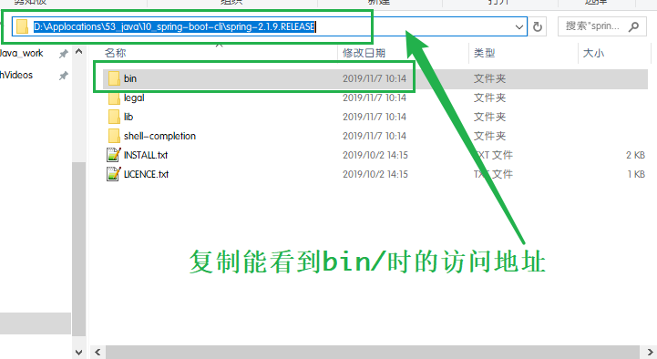

依次找到,此电脑->右键->属性->高级系统设置->环境变量

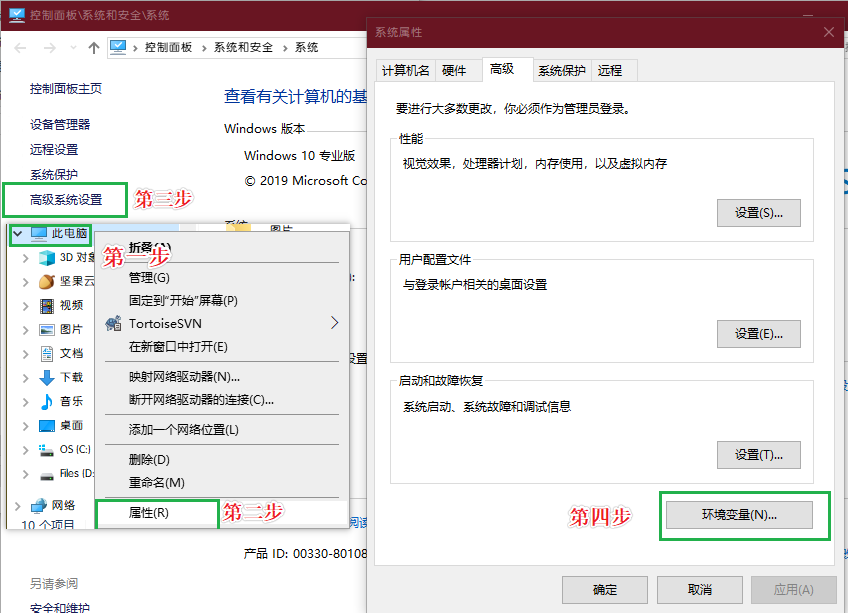

系统变量下，新建->SPRINGBOOT_CLI->粘贴复制的地址路径->确定

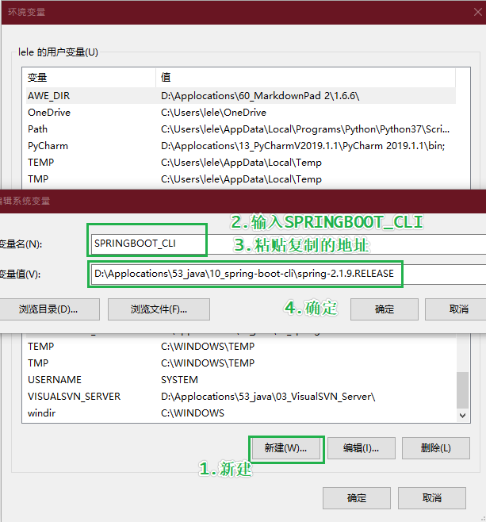

在系统变量下找到`path`->编辑->新建->输入`%SPRINGBOOT_CLI%\bin`->一路确定

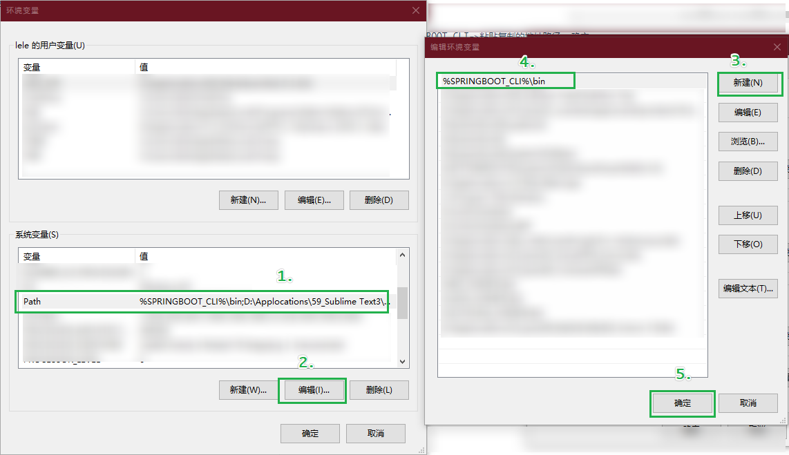

Windows和R键->打开运行->输入cmd->输入`spring --version`->spring CLI版本号->环境变量配置成功

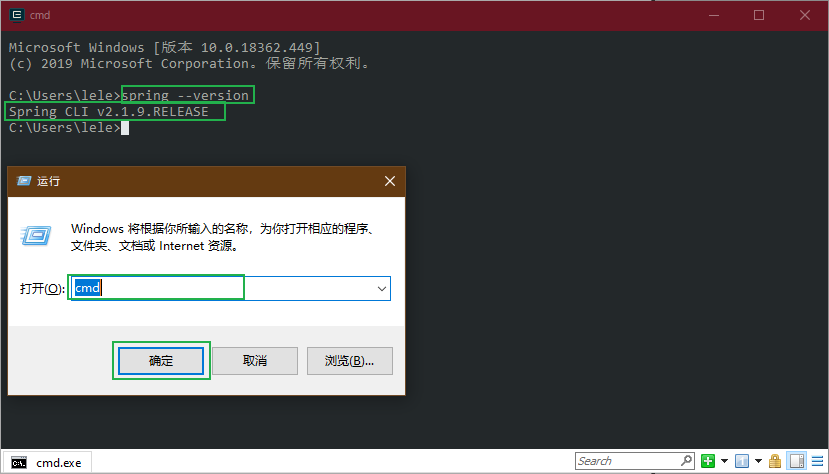

③新建一个文本文件，输入以下代码
```java
@RestController
public class HelloController{

	@RequestMapping("/")
	public String hello(){

		return "Hello My First Spring Boot For Spring Boot CLI !!!";

	}

}
```

④保存为`*.groovy`文件，例如`hello.groovy`文件

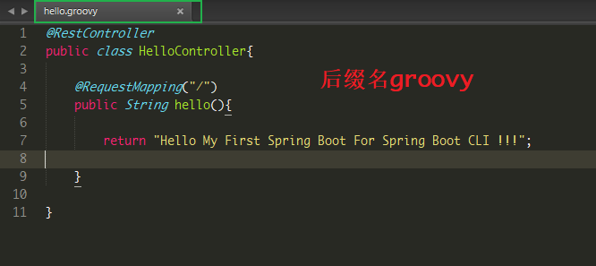

⑤执行文件
先跳转到`hello.groovy`文件所在的目录，再输入命令`spring run hello.groovy`执行
我的端口号8080已经被占用，修改端口号，运行命令`spring run hello.groovy -- --server.port=80`

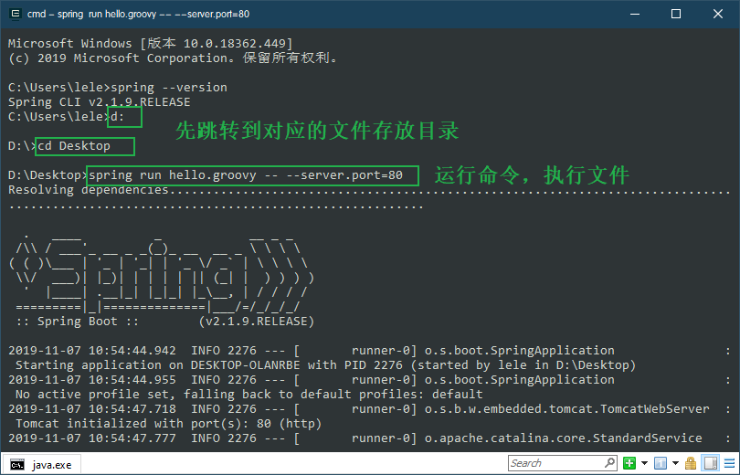

第一次执行，需要下载文件和初始化，比较慢，看到启动图标执行成功

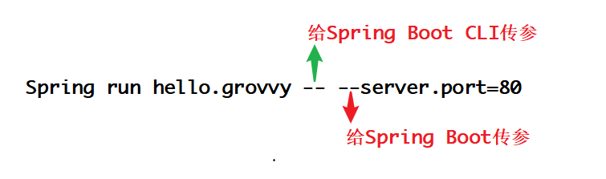

⑥浏览器访问

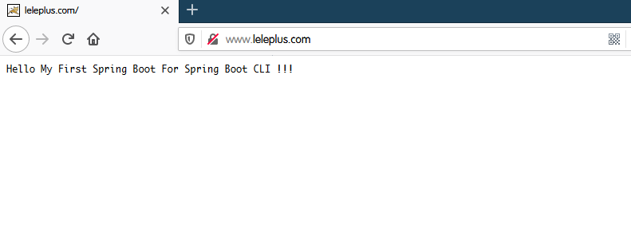

⑦暂停访问
两次Ctrl和C键
`Spring init`命令可以帮助我们快速构建一个Spring Boot项目的骨架

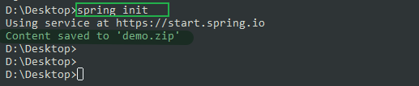


### 3.STS构建
①新建项目
新建Spring Starter Project项目


②填写相关信息

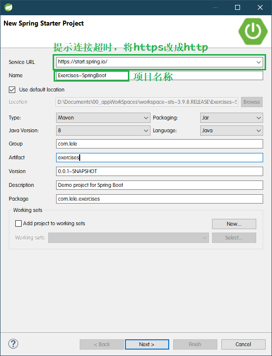

③选择版本和Starter
选择GA稳定版和项目用到的Starter，后期可以修改

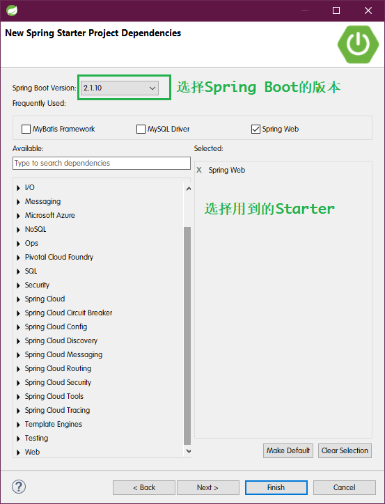

④finish完成
## (四).Spring Boot项目构成
Spring Booot项目的核心配置是maven工程的pom.xml文件，通过maven可以很方便的构建一个Spring Boot项目
### 1.Spring Boot项目的组成
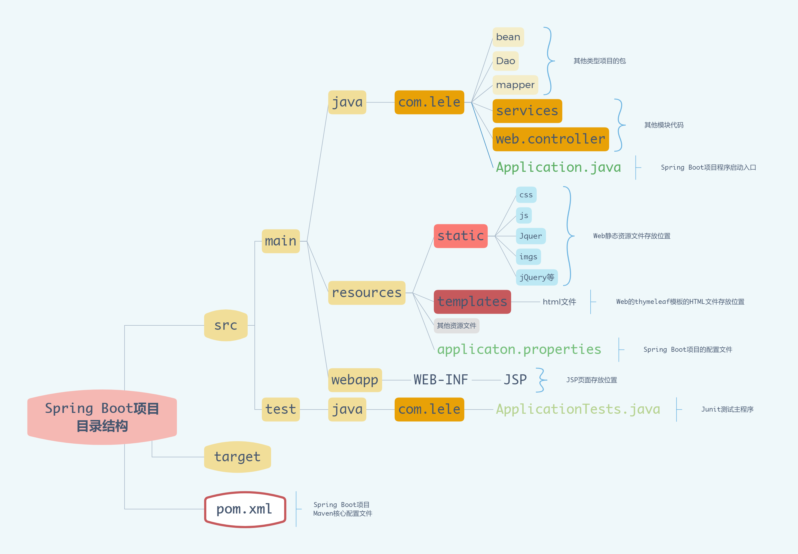

### 2.pom.xml文件
按照Spring Boot的官方的要求，pom文件中需要添加的地方
* 继承Spring Boot提供的父项目
* 配置需要的starter启动器
* 配置Spring Boot的maven插件

#### (1).继承Spring Boot的依赖配置
```xml
<!-- 继承Spring Boot提供的父项目 -->
<parent>
	<groupId>org.springframework.boot</groupId>
	<artifactId>spring-boot-starter-parent</artifactId>
	<!-- Spring Boot的版本 -->
	<version>2.1.9.RELEASE</version>
	<relativePath/> lookup parent from repository
</parent>
```
如果需要修改某些配置，直接覆盖即可
```xml
<!-- 自己的配置，可以覆盖Spring Boot的默认值 -->
<properties>
	<project.build.sourceEncoding>UTF-8</project.build.sourceEncoding>
	<project.reporting.outputEncoding>UTF-8</project.reporting.outputEncoding>
	<java.version>1.8</java.version>
	<skipTests>true</skipTests>
	<!-- 解决Eclipse Spring Boot项目新建后pom文件报错 -->
	<maven-jar-plugin.version>3.1.1</maven-jar-plugin.version>
</properties>
```
#### (2).Starter启动器
* 一个Starter启动器，就是一个功能模块，里面已经包含了该模块所有的jar包和依赖
例如，web相关的功能和框架，只需要引入web的Starter的即可
```xml
<dependency>
    <groupId>org.springframework.boot</groupId>
    <artifactId>spring-boot-starter-web</artifactId>
</dependency>
```
如果需要更换默认的依赖，比如web内嵌的tomcat服务器可以jetty服务器
```xml
<!-- 配置web框架的starter -->
<dependency>
    <groupId>org.springframework.boot</groupId>
    <artifactId>spring-boot-starter-web</artifactId>
    <!--剔除原来的tomcat服务器-->
    <exclusions>
        <exclusion>
            <groupId>org.springframework.boot</groupId>
            <artifactId>spring-boot-starter-tomcat</artifactId>
        </exclusion>
    </exclusions>
</dependency>

<!-- 把内嵌的tomcat服务器更换为jetty服务器 -->
<dependency>
    <groupId>org.springframework.boot</groupId>
    <artifactId>spring-boot-starter-jetty</artifactId>
</dependency>
```
也可以替换Starter中某一个依赖的版本
* Spring Boot的官方文档中提供了很多的启动器
[Spring Boot关于Starter介绍的官方文档](https://docs.spring.io/spring-boot/docs/2.1.10.RELEASE/reference/htmlsingle/#appendix-dependency-versions),修改地址里的版本号，可以获得不同版本的文档介绍
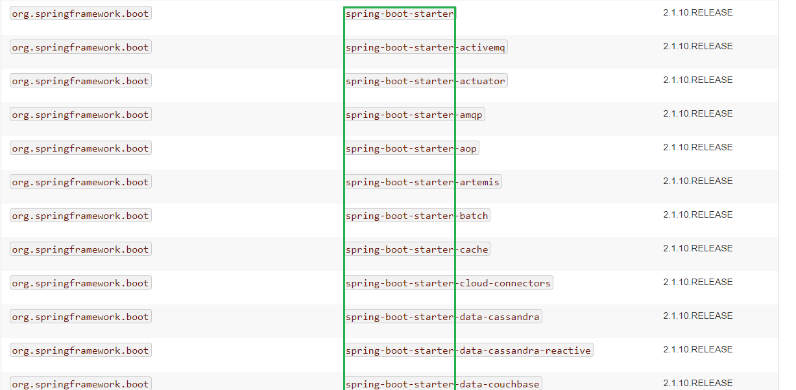
* 常用的Starter的
	* `spring-boot-starter`Spring Boot的核心启动器，包含了自动配置、日志和YAML
	* `spring-boot-starter-amqp`通过spring-rabbit来支持AMQP协议功能
	* `spring-boot-starter-aop`面向切面的编程
	* `spring-boot-starter-cache`支持Spring的Cache功能
	* `spring-boot-starter-data-jpa`支持JPA(Java Persistence API)，包括spring-data、Hibernate等功能
	* `spring-boot-starter-web`支持Web开发，包括Tomcat和spring-web mvc等
默认情况下Spring Boot项目有两个Starter
```xml
<dependencies>
	<!-- 核心启动器 -->
    <dependency>
        <groupId>org.springframework.boot</groupId>
        <artifactId>spring-boot-starter</artifactId>
    </dependency>
    <!-- Spring Boot 的测试框架 -->
    <dependency>
        <groupId>org.springframework.boot</groupId>
        <artifactId>spring-boot-starter-test</artifactId>
        <scope>test</scope>
    </dependency>
</dependencies>
```

#### (3).关于Spring Boot的Maven插件
```xml
<!-- Spring Boot的maven插件 -->
<build>
    <plugins>
        <plugin>
            <groupId>org.springframework.boot</groupId>
            <artifactId>spring-boot-maven-plugin</artifactId>
        </plugin>
    </plugins>
</build>
```
Spring Boot的Maven插件(Spring Boot Maven plugin)能够以Maven的方式为应用提供Spring  Boot的支持，即为Spring Boot应用提供了执行Maven操作的可能。该插件能够将Spring Boot应用打包为可执行的jar或war文件，然后以普通的jar包方式运行Spring Boot应用。
* Spring Boot Maven Plugin的5个Goals:
`spring-boot:repackage`默认Goal,在`mvn package`之后,再次打包可执行的jar/war,同时保留`mvn package`之后生成的jar/war为`*.origin`文件
`spring-boot:run`比较常用,是运行Spring Boot项目的方式之一，运行Spring Boot项目
`spring-boot:start`
`spring-boot:stop`
`spring-boot:build-info`生成Actuator使用的构建信息文件build-info.properties


对于默认的Goals,`spring-boot:repackage`，在运行maven命令`mvn package`后会自动执行，如果是java项目(非web项目),在pom.xml文件中指定程序入口后(`<start-class></User>start-class>`)，可以直接打包成可执行jar包，自动执行我们指定的程序入口:
```xml
<properties>
    <project.build.sourceEncoding>UTF-8</project.build.sourceEncoding>
    <project.reporting.outputEncoding>UTF-8</project.reporting.outputEncoding>
    <java.version>1.8</java.version>
    <!-- Maven 命令打包时跳过测试 -->
    <skipTests>true</skipTests>
    <!-- 指定打包后的程序入口 -->
    <start-class>com.lele.HelloTest</start-class>
</properties>
```
### 3.Spring Boot项目的程序入口
程序入口位于`src/main/java/包名/Application.java`
```java
package com.lele;

import org.springframework.boot.SpringApplication;
import org.springframework.boot.autoconfigure.SpringBootApplication;

// Spring Boot项目的程序入口
@SpringBootApplication
public class Application {

    public static void main(String[] args) {
        SpringApplication.run(Application.class, args);
    }
}
```
* `@SpringBootApplication`让当前类成为一个配置类，自动扫描用户的包，开启Spring Boot的自动配置功能
注解的源码
```Java
package org.springframework.boot.autoconfigure;

import java.lang.annotation.Documented;
//...

@Target(ElementType.TYPE)
@Retention(RetentionPolicy.RUNTIME)
@Documented
@Inherited
@SpringBootConfiguration
@EnableAutoConfiguration
@ComponentScan(excludeFilters = { @Filter(type = FilterType.CUSTOM, classes = TypeExcludeFilter.class),
		@Filter(type = FilterType.CUSTOM, classes = AutoConfigurationExcludeFilter.class) })
public @interface SpringBootApplication {
	//...
}
```
* `SpringApplication.run(Application.class, args);`这句代码执行后就可以读取到类上的注解，开启Spring Boot项目,启动效果

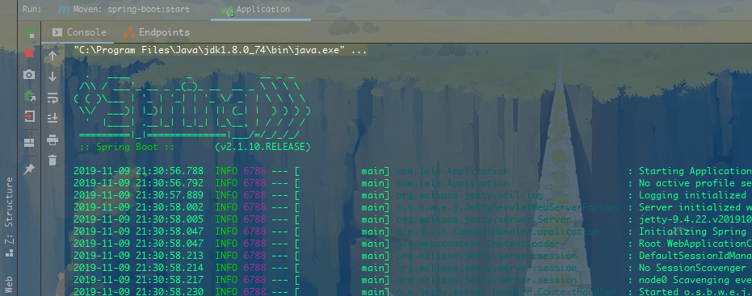

这个启动logo是可以修改的，将需要修改的内容新建一个**banner.txt**文件放进去，把文件复制到`src/main/sources/`下，就可以了


### 4.Spring Boot 项目的测试框架
测试模块位于`src/test/java/包名/ApplicationTests.java`
Spring Boot项目中的测试类，默认使用了spring-test以及结合了junit测试框架
```java
package com.lele;

import org.junit.Test;
import org.junit.runner.RunWith;
import org.springframework.boot.test.context.SpringBootTest;
import org.springframework.test.context.junit4.SpringRunner;

@RunWith(SpringRunner.class)
@SpringBootTest(classes = {Application.class})
public class ApplicationTests {

    @Test
    public void contextLoads() {

    }

}
```
运行测试类会自动先运行入口类(入口类也是一个配置类),配置类是可以存在多个的，也可以一次指定多个配置类,一个配置类就相当于之前Spring的一个配置文件
```java

@SpringBootTest(classes = {A.class,B.class,C.class,D.calss...})
```
### 5.Spring Boot 项目的配置文件
* 配置文件位于`src/main/resources/`下
* Spring Boot默认支持两种形式的配置文件
	* `application.properties`
	* `application.yml`
	yml文件语法格式(每一个层次都要换行)
	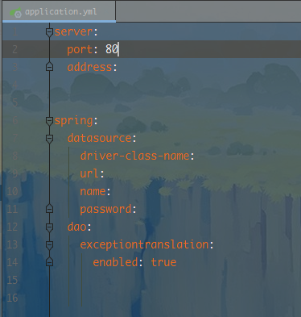

* 两种配置文件内容一模一样，只是格式不同，一般情况下都是用`application.properties`作为配置文件的
* [Spring Boot对于properties配置文件的说明](https://docs.spring.io/spring-boot/docs/2.1.10.RELEASE/reference/htmlsingle/#common-application-properties) 修改地址栏的版本号，可以获得不同版本的文档说明

## (五).Spring Boot自动配置
### 1.JavaConfig配置
#### (1).Spring Boot的Bean对象的配置方式
* XML文件配置
* 注解配置
* JavaConfig配置

#### (2).JavaConfig配置方式的使用
Spring Boot推荐使用JavaConfig的配置方式(约定优于配置，可以自动扫描同包或子包下的配置类)
* JavaConfig配置方式的步骤
	1)创建bean类(主程序同级的子包下)，需要自动注入的bean依赖，使用`@Autowired`注解
	`@Autowired`注解表示当前类中的这个自定义的类类型属性值需要使用自动注入的方式

	2)创建配置类(主程序同级的子包下)，配置类需要加`@Configuration`注解
	`@Configuration`指明这是一个配置类
	3)创建返回bean对象的方法,并加上`@Bean`注解
	`@Bean`指明当前方法返回的对象放到Spring容器中，默认情况下，方法名就是该对象在容器中的key值
	4)Junit测试

#### (3).JavaConfig使用实例
##### 1)创建Bean类
在主程序入口的同级目录下建包`bean`,包下创建类`Student`和`Teacher`，`Teacher`类依赖`Student`类，实现序列化接口，提供get和set方法，构造器等
`Student`类
```java
package com.lele.bean;

import java.io.Serializable;

public class Student implements Serializable {

    private static final long serialVersionUID = 5321639508688933860L;

    private Long id;
    private String name;
    private int age;
    private String gender;

    public Student() {
    }

    public Student(Long id, String name, int age, String gender) {
        this.id = id;
        this.name = name;
        this.age = age;
        this.gender = gender;
    }

    //省略get/set、toString()方法
}
```
`Teacher`类
```java
package com.lele.bean;

import org.springframework.beans.factory.annotation.Autowired;

import java.io.Serializable;

public class Teacher implements  Serializable {

    private static final long serialVersionUID = -152176413808730852L;

    private Long id;
    private String name;
    private int age;
    private String gender;

    //一个老师对应一个学生
    //自动注入该对象
    @Autowired
    private Student student;

    public Teacher() {
    }

    public Teacher(Long id, String name, int age, String gender) {
        this.id = id;
        this.name = name;
        this.age = age;
        this.gender = gender;
    }

   //省略get/set、toString()方法

}
```
##### 2)创建配置类
bean类要配置到spring容器中
	* XML配置方式，在xml中配置bean标签
	* 注解配置方式，在类上面加`@Component`注解
JavaConfig方式需要创建一个配置类
在程序入口下创建包`config`,包下创建类`ApplicationConfig`
```java
package com.lele.config;

import com.lele.bean.Student;
import com.lele.bean.Teacher;
import org.springframework.context.annotation.Bean;
import org.springframework.context.annotation.Configuration;

//指明这是一个配置类
@Configuration
public class ApplicationConfig {

	/**
	 * 方法返回注入的对象
	 * @Bean 将方法返回值的对象放到Spring容器中
	 */


    @Bean
    public Student student(){
        return new Student(1L,"Jerry",23,"女");
    }

    @Bean
    public Teacher teacher(){

        return new Teacher(209L,"Tom",29,"男");
    }

}
```
##### 3)测试
```java
package com.lele;

import com.lele.bean.Teacher;
import org.junit.Test;
import org.junit.runner.RunWith;
import org.springframework.beans.factory.annotation.Autowired;
import org.springframework.boot.test.context.SpringBootTest;
import org.springframework.test.context.junit4.SpringRunner;

@RunWith(SpringRunner.class)
@SpringBootTest(classes = {Application.class})
public class ApplicationTests {

	//自动注入该对象
    @Autowired
    private Teacher teacher;

    @Test
    public void contextLoads() {
    	//打印自动注入的对象
        System.out.println(teacher);
        System.out.println(teacher.getStudent());

    }

}
```
### 2.Spring Boot的自动配置
Spring Boot可以引入很多的框架，但是每一个框架都不需要我们去做配置，就可以直接使用，Spring Boot已经自动配置好了这些默认设置
#### (1)自动配置的原理
* 程序入口上使用`@SpringBootApplication`注解
* `@SpringBootApplication`注解包含了`@EnableAutoConfiguration`注解
* `@EnableAutoConfiguration`注解又使用了`@Import(AutoConfigurationImportSelector.class)`注解，导入了`AutoConfigurationImportSelector`类
	在以前的版本中,显式导入子类，然后是父类的方法
	* `@EnableAutoConfiguration`注解又使用了`@Import(EnableAutoConfigurationImportSelector.class)`注解，导入了`EnableAutoConfigurationImportSelector`类
	* `EnableAutoConfigurationImportSelector`类继承了父类`AutoConfigurationImportSelector`
* `AutoConfigurationImportSelector`类有一个方法`getCandidateConfigurations()`
* 方法`getCandidateConfigurations()`可以扫描对应版本的`spring-boot-autoconfigure-2.1.10.RELEASE.jar/META-INF/spring.factories`文件
* `spring.factories`文件中声明了很多的Java配置类，每个配置类在满足执行条件后，就会执行
* 随便打开一个配置类，例如`SpringApplicationAdminJmxAutoConfiguration`类
	* 类中使用了`@ConditionalOnProperty`注解，表明当前类的配置文件中，如果配置了`spring.application.admin.enabled = true`就启动配置类中的配置
* 其他类也类似，如果检测到了核心类型的存在，说明要使用该框架，就自动启用该框架的自动配置

#### (2)自定义自动配置的实例
利用Spring Boot中`@EnableAutoConfiguration`注解的自动配置功能，完成一个自定义自动配置的例子
##### 1)创建`Service`类
在程序主入口同包下新建包`service`
新建接口`CustomeService`
```java
package com.lele.service;

public interface CustomeService {

    public void fashion();

}
```
新建实现类`CustomeServiceImpl`实现`CustomeService`接口
```java
package com.lele.service.impl;

import com.lele.service.CustomeService;

public class CustomeServiceImpl implements CustomeService {

    @Override
    public void fashion() {

        System.out.println("hello My Custume Service!");
    }
}
```
##### 2)创建`config`类
在程序主入口的同包下新建包`config`
编写配置类`AutoConfig`
	* 添加`@Configuration`注解，表明这是一个配置类
	* 添加`@ConditionalOnClass()`注解，配置条件类
	* 添加`@ConditionalOnProperty(prefix = "",value = "",havingValue = "")`注解，表明启用配置的条件
		当`prefix`的`value`满足`havingValue`的条件时，启用自动配置

```java
package com.lele.config;

import com.lele.service.CustomeService;
import com.lele.service.impl.CustomeServiceImpl;
import org.springframework.boot.autoconfigure.condition.ConditionalOnClass;
import org.springframework.boot.autoconfigure.condition.ConditionalOnProperty;
import org.springframework.context.annotation.Bean;
import org.springframework.context.annotation.Configuration;

@Configuration
@ConditionalOnClass(CustomeService.class)
@ConditionalOnProperty(prefix = "myautoconfig.service",value = "enable",havingValue = "true")
public class AutoConfig {

    @Bean
    public CustomeService customeService() {
        return new CustomeServiceImpl();
    }
}
```
##### 3)创建配置文件
在`src/main/resources/`下新建文件夹`META-INF`，再在`META-INF/`下新建文件`spring.factories`
文件中写上`org.springframework.boot.autoconfigure.EnableAutoConfiguration=配置类的全限定名`
例如`org.springframework.boot.autoconfigure.EnableAutoConfiguration=com.lele.config.AutoConfig`

##### 4)测试
* 使用`@Autowired`注解，需要设置属性`required = false`,否则如果在配置文件中不配置该自动配置，会报错
* 测试时，配置文件中如果没有配置会报空指针异常
* 如果在`application.properties`配置文件中配置了`myautoconfig.service.enable=true`,则会输出结果，说明运行了自动配置类
	如果没有配置，或者配置为了`false`，就会输出`null`
```java
package com.lele;

import com.lele.bean.Teacher;
import com.lele.service.CustomeService;
import org.junit.Test;
import org.junit.runner.RunWith;
import org.springframework.beans.factory.annotation.Autowired;
import org.springframework.boot.test.context.SpringBootTest;
import org.springframework.test.context.junit4.SpringRunner;

@RunWith(SpringRunner.class)
@SpringBootTest(classes = {Application.class})
public class ApplicationTests {

    @Autowired(required = false)
    private CustomeService customeService;

    @Test
    public void autoConfigTest(){

    	// 没有配置会报出空指针异常
    	// customeService.fashion();
		System.out.println(customeService);

    }

}
```

## (六).Spring Boot对WEB的支持
* 静态资源的访问
	Spring Boot的web功能模块中，默认会映射静态资源的访问到`/static`、`/public`、`resources/`、`META-INF/resources`中的任意一个路径，当前台访问静态文件的时候，会自动被映射到`/static`等路径下
* `templates`目录
	Spring Boot项目推荐`Thymeleaf`模板来做动态页面的显示，用来显示数据的模板就默认存放在`templates`目录

### 1.对RESTful风格的支持
前后端分离的web项目，前台和后台可以选择使用json进行数据的交互，所以在Controller中只需要返回json数据即可
#### (1).引入web模块的Starter
在pom文件中添加依赖
```xml
<!-- 引入web模块的Starter -->
<dependency>
    <groupId>org.springframework.boot</groupId>
    <artifactId>spring-boot-starter-web</artifactId>
</dependency>
```
#### (2).编写Controller
在程序主入口同包及其子包下新建包`controller`
* `@RestController`是`@Controller`和`@ResponseBody`结合起来的注解，表名类中方法的返回值转为json数据返回给对应的请求
```java
package com.lele.web.controller;

import org.springframework.web.bind.annotation.RequestMapping;
import org.springframework.web.bind.annotation.RestController;

@RestController
public class RESTfulController {

    @RequestMapping("/")
    public String rESTful(){
        return "Hello RESTful web!!!";
    }

}
```

#### (3).修改server配置
[修改Properties配置文件的官方文档](https://docs.spring.io/spring-boot/docs/2.1.10.RELEASE/reference/htmlsingle/#common-application-properties)
默认的端口号为`8080`,默认的项目名为`/`
可以直接覆盖设置
```properties
# Server Configration
# setting port
server.port=80
# Setting contextPath
# 之前的版本设置contextPath是 server.context-path
server.servlet.context-path=/test
```
#### (4).测试
启动程序后，浏览器地址栏访问`127.0.0.1/test`即可访问

### 2.对thymeleaf模板的支持
Spring Boot推荐使用thymeleaf模板作为视图进行数据的展现
#### (1).引入web模块和thymeleaf的Starter
在pom文件中添加下面的依赖
```xml
<!-- 引入web模块的Starter -->
<dependency>
    <groupId>org.springframework.boot</groupId>
    <artifactId>spring-boot-starter-web</artifactId>
</dependency>

<!-- 引入thymeleaf的Starter -->
<dependency>
    <groupId>org.springframework.boot</groupId>
    <artifactId>spring-boot-starter-thymeleaf</artifactId>
</dependency>
```
#### (2).编写Controller
在`web/controller/`下新建`controller`类
* 这里使用的是`@Controller`注解，表示类中方法返回值返回的是逻辑视图名
```java
package com.lele.web.controller;

import org.springframework.stereotype.Controller;
import org.springframework.web.bind.annotation.RequestMapping;

import java.util.Map;

@Controller
public class ThymeleafController {

    @RequestMapping("/")
    public String thymeleaf1(Map<String,Object> map){
        map.put("msg","Hello my first thymeleaf !!!");
        return "thymeleaf1";
    }

}
```

#### (3).编写thymeleaf模板和静态资源
在`templates/`下编写`thymeleaf`模板，`static/`目录下编写静态资源
thymeleaf1.html
```html
<!DOCTYPE html>
<html lang="en" xmlns:th="http://www.thymeleaf.org">
<head>
    <meta charset="UTF-8">
    <title>thymeleaf1</title>
    <link rel="stylesheet" th:href="@{/css/base.css}">
    <link rel="stylesheet" type="text/css" href="/css/base.css">
</head>
<body>
    <p th:text="'This is a msg text : ' + ${msg} + ' !!!'">未渲染数据的文本</p>
</body>
</html>
```
base.css
```css
*{
    margin: 0;
    padding: 0;
}
.p{
    text-align: center;
    color: red;
}
```
#### (4).运行项目


### 3.对jsp的支持


## (七).Spring Boot对JDBC的支持
## (八).Spring Boot对MyBatis的支持


eclipse安装插件，或者直接使用STS
设置编码UTF-8；
统一JDK版本
统一maven仓库
构建项目

<!-- 设置端口号 -->
server.port=80
<!-- 设置前缀和后面 -->
spring.mvc.view.prefix=/WEB-INF/jsp/
spring.mvc.view.suffix=.jsp

<!-- maven打包 -->
Spring-boot:run


# 九、Spring Date

1.映射关系(实体-关系)
在实体类中
@Entity  //跟数据库中的表一对一对应
@Table(name="t_user")//跟数据库中的这张表一对一对应
默认关联类名小写，否则指定
@Id 主键列
@GeneratedValue//自动增长（oracle数据库设置自增长特殊）
currval nextval
@Column属性关联列
@ManyToOne //多对一
@JoinColumn(name="user_id")//外键字段

2.编写接口，实现JpaRepository

3.接口会被存放到容器中


# 十、Spring Cloud

