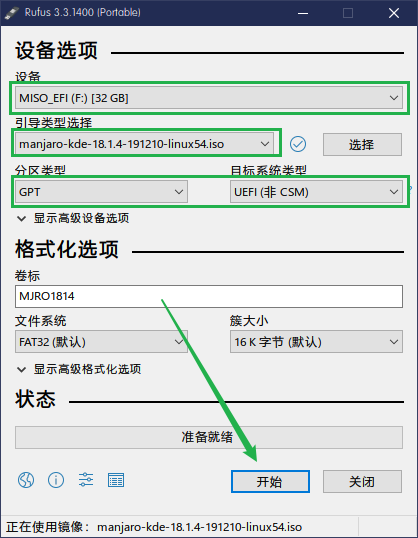
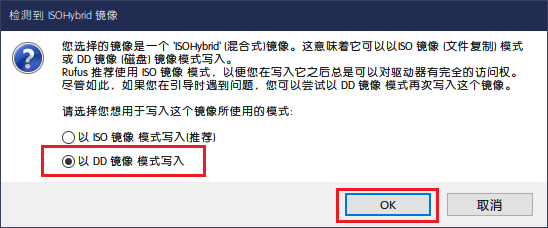
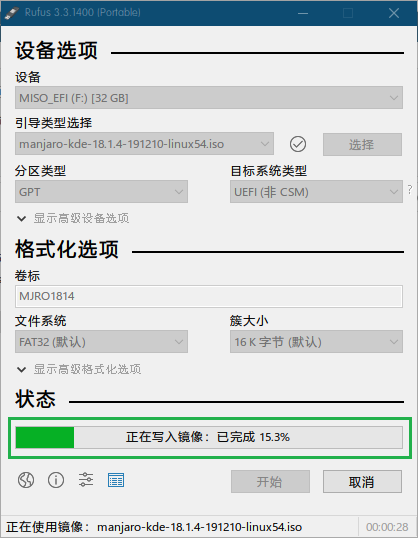
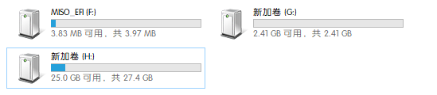

ManJaro操作系统使用

[manjaro官网](https://manjaro.org/)

[manjaro-gnome下载](https://manjaro.org/download/official/gnome/)

制作USB启动盘
下载[rufus工具](https://rufus.ie/)

* 打开rufus工具

一般情况下，refus会创建三个分区，引导分区，镜像存放分区，还有一个是其他分区，可能未初始化  需要自己手动初始化，并将镜像复制到USB盘中

然后重新启动电脑，插入U盘，从USB启动电脑
