## 服务器使用与项目部署

乐乐


## 一、阿里云服务器搭建
### (一)、购买阿里云服务器
> 部署前后端程序在公网上，就得需要一个公网ip，但是IPV4早就已经分完了，最好的方式就是购买一个云服务器，通过服务提供商的ip帮我们映射到云服务器上，不管是阿里云、华为云、腾讯云，其实差不多都是一样的操作流程，这里以阿里云服务器来介绍一下环境搭建与项目部署的问题

阿里的云服务器，一般走学生价格不会很贵，一个月9.5左右，一年114，自己玩一下也不是很贵，这里介绍一下怎么购买
[学生优惠网址，每月9.5元，点击购买](https://promotion.aliyun.com/ntms/act/campus2018.html?accounttraceid=ba58917e7b794a049aeec4fab23ffa04hman)
打开上面的网址之后，就可以看到学生优惠的价格，登录账户，认证之后，就可以购买了，这里介绍一下选择
推荐使用linux系统，当然选择了其他的也不要紧，之后还是可以重装的，然后选择轻量级的，轻量级的好处是，购买之后就可以直接使用了


付款成功之后，会有一个服务器准备的过程，时间不是很久，就几分钟左右，服务器准备好之后，就可以打开像下面的这样一个页面
这里要做的就是熟记公网ip，首次使用，因为我们不知道密码，所以要**重置密码**，点击**重置密码**之后，会弹出一个框，根据提示设置好密码，这个密码务必要熟记，且不能告诉任何人
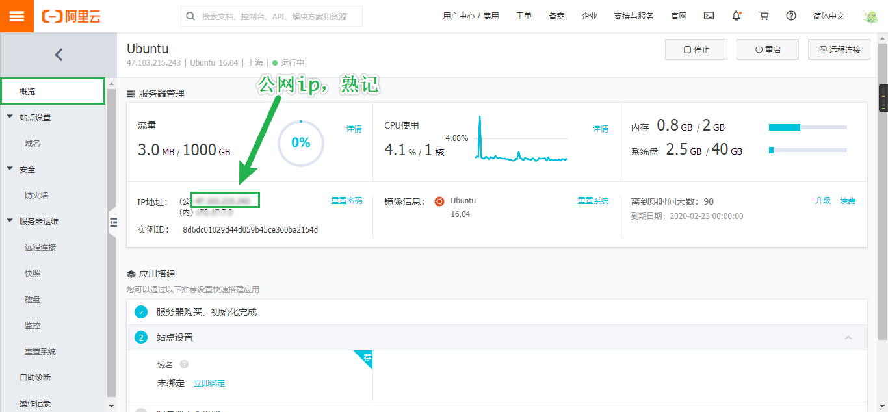

### (二)、登录远程服务器
远程连接阿里云服务器，采用的是ssh连接，如果你的电脑没有开启ssh，就需要安装软件，这里呢，我不推荐安装OpenSSH，推荐Windows用户使用Cmder终端，或者Xshell软件来连接
> 这两款软件的安装使用，丝毫没有难度，直接去搜索安装即可，我这里使用的是cmder终端，如果你的电脑已经安装了OpenSSH，接着操作就可以了

1.打开cmd或者cmder终端
`Windows`徽标键+`R`打开运行，输入cmd或者cmder打开终端
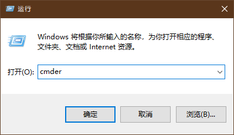

2.查看`ssh`是否可用
在终端中输入`ssh`，如果提示我这样的，就是可以使用，提示**不是内部或外部命令...**，需要你安装软件
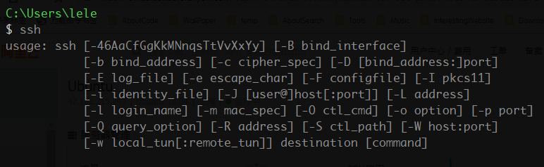

3.连接服务器
```sh
$ ssh root@公网ip # 表示通过[ssh]协议以[root]身份登录[公网ip]对应的服务器
# eg: $ ssh root@192.168.1.130
```
输完命令之后回车，第一次登录会出现图中(网图)的情况，根据提示输入密码就可以了


第一次登录过之后，以后登录就是这样的了，输入密码之后直接登录成功
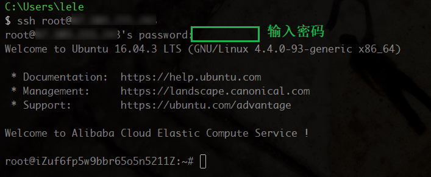

### (三)、新建服务器用户
第一次登录服务器，使用的是`root`用户，但是`root`用户权限太高，太危险，不安全，一般需要重新创建一个普通用户
1.新建账户
登录到服务器之后，在终端输入命令，然后输入密码，一路回车，就创建了一个用户，然后使用命令`ls /home/`查看一下`home`目录下所有的用户，就能看到刚刚创建的用户
```sh
$ adduser 用户名 # 创建一个用户
$ ls /home/      # 查看home/目录下的所有用户
```

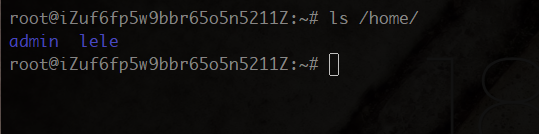

2.给普通用户授权
刚刚创建的用户还没有任何的权限，需要授权，使用vi编辑器打开`/etc/sudoers文件`
```sh
$ vi /etc/sudoers # 使用vi编辑器打开/etc/sudoers文件
```

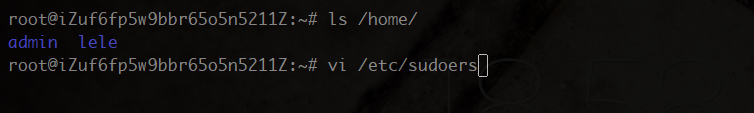

如图所示，找到这一行内容，复制粘贴后，将`root`修改为`你添加的用户名`
> 两次y键复制
> p键粘贴
> x键删除
> i键插入
> 输入完ESC键，输入`:wq!`强制保存并退出

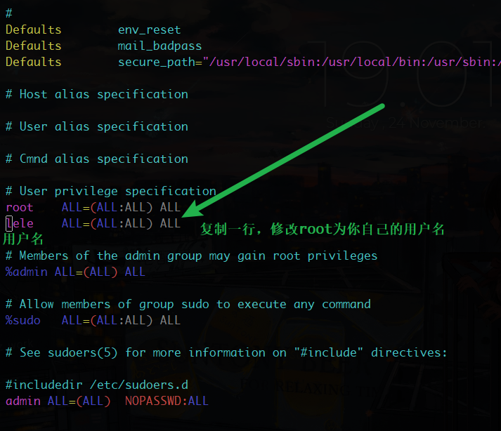

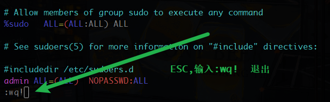

3.切换到新用户
```sh
$ su - 用户名 # 从已经登录的用户切换到某一个用户
```
下次登录服务器可以直接使用`ssh 普通用户名@ip`输入密码，可以直接使用普通用户身份登录到阿里云服务器

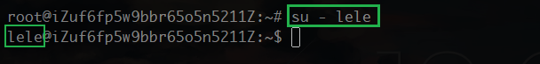

## 二、安装软件
### (一)、远程服务器安装JDK

[JDK8下载页面](https://www.oracle.com/technetwork/java/javase/downloads/jdk8-downloads-2133151.html)

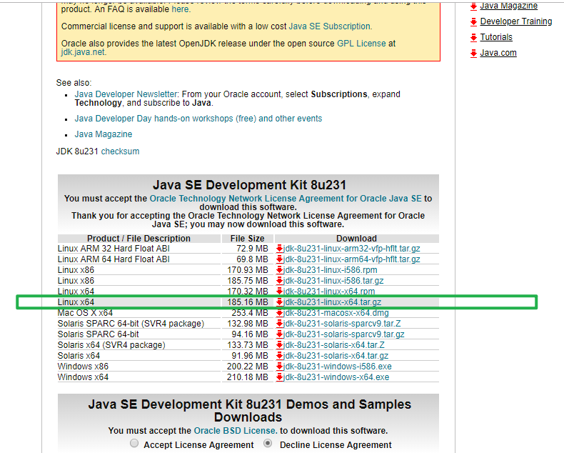


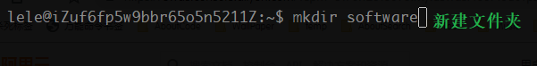


```sh
$ scp ./文件名 用户名@阿里云服务器ip:要上传到的目录
```

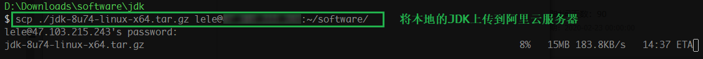

查看是否上传成功
```sh
$ ls dir
```

```sh
$ sudo tar -xvf jdk文件 -C 解压缩的文件
$ tar -xvf jdk文件
```


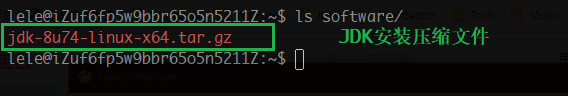

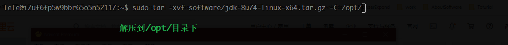

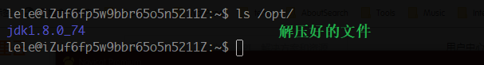


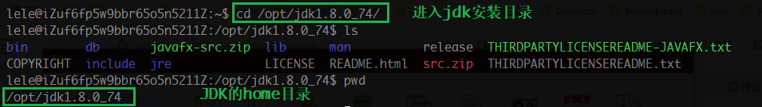


配置JDK环境变量
* 配置到系统下(所有用户生效)
```sh
$ sudo vi /etc/profile
```
```
export JAVA_HOME=/opt/jdk1.8.0_74
export CLASSPATH=.
export PATH=$PATH:$JAVA_HOME/bin
```
```sh
$ source /etc/profile
```
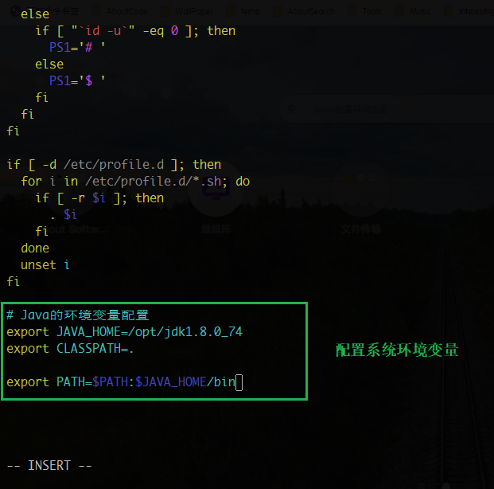

* 配置到当前用户下(当前用户生效)
```sh
$ vi ~/.bashrc
```
```
export JAVA_HOME=/opt/jdk1.8.0_74
export CLASSPATH=.
export PATH=$PATH:$JAVA_HOME/bin
```
```sh
$ source ~/.bashrc
```

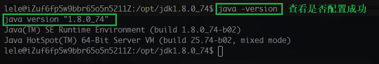


安装MySQL

```sh
$ sudo apt-get update
```


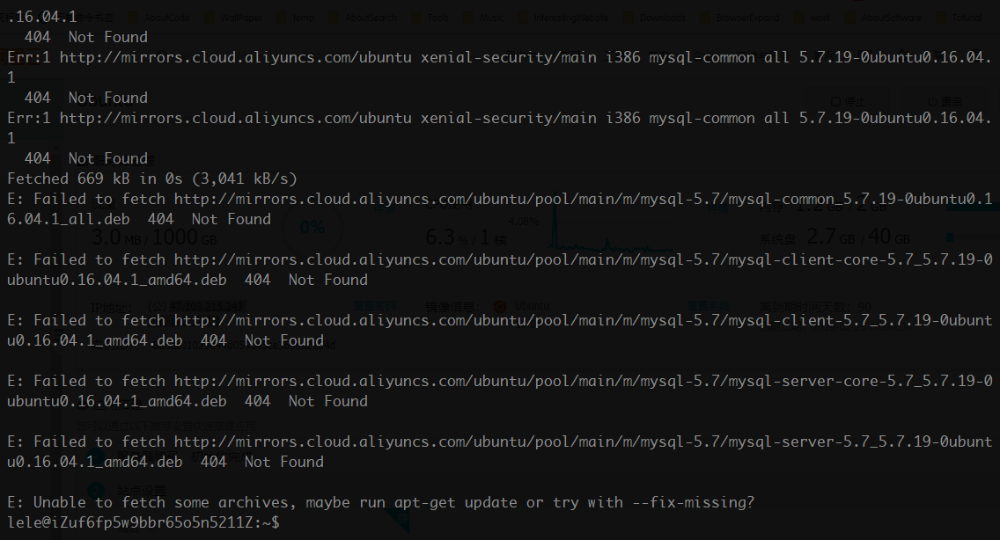


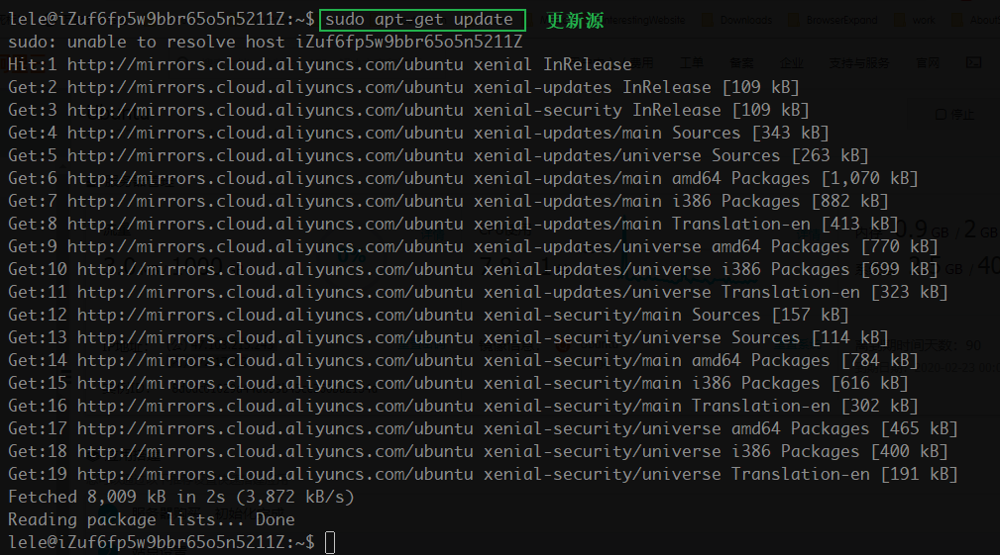


```sh
$ sudo apt-get install mysql-server-5.7
```

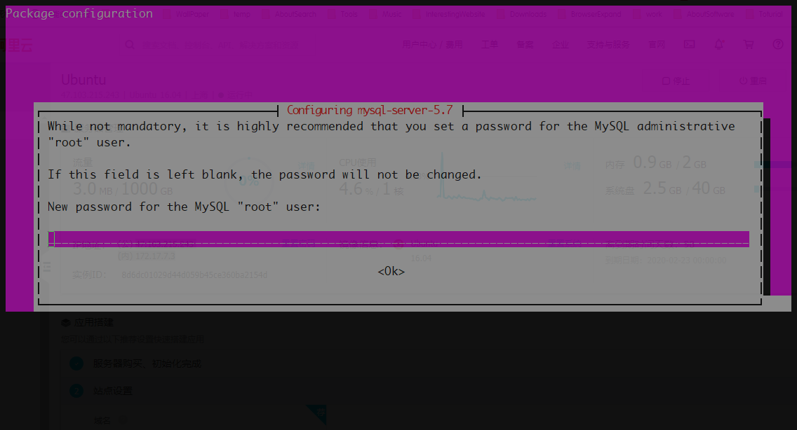

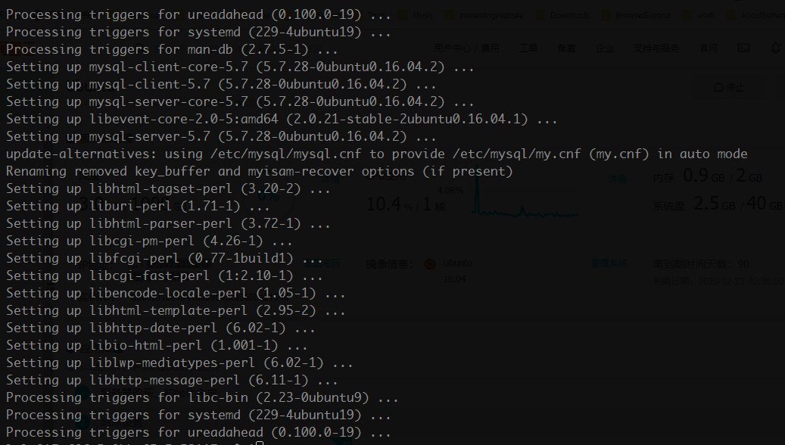


查看MySQL服务的状态
```sh
$ service mysql status
```

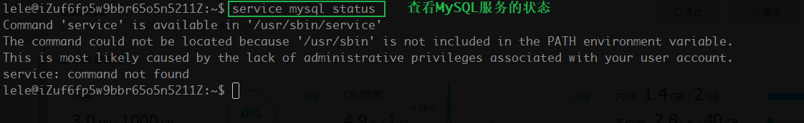


修改环境变量
```sh
$ vi .bashrc
```

`export PATH=$PATH:/usr/sbin`

让环境变量生效
```sh
$ source .bashrc
```

```sh
$ service mysql status
```

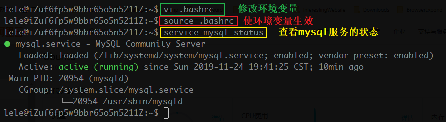


连接mysql
```sh
$ mysql -uroot -p
```
注:mysql默认情况下只允许本地主机连接
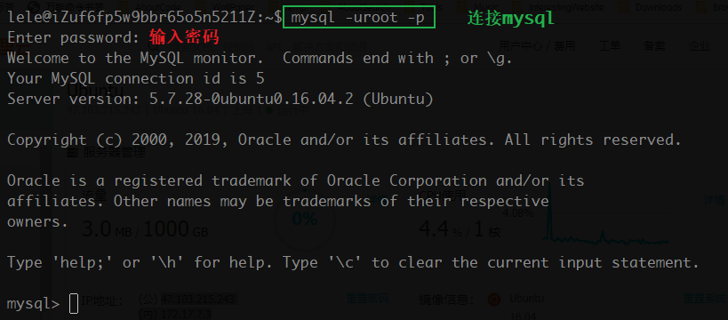


打开mysql的防火墙

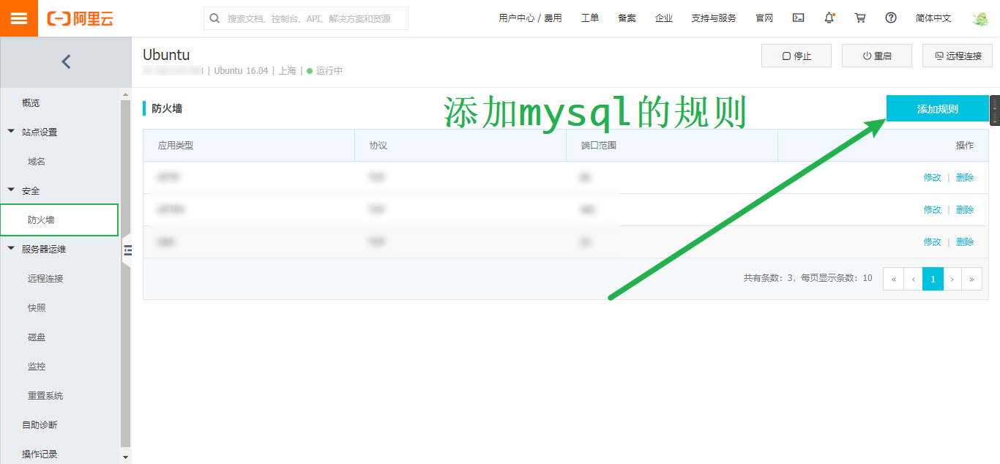

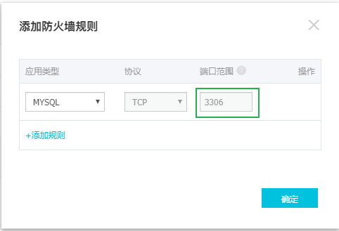


```sh
$ mysql -h阿里云公网ip -uroot -p
```
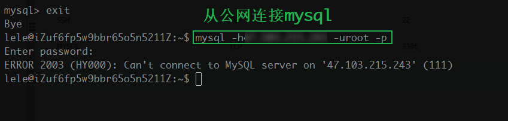


改配置
```sh
$ mysql -uroot -p
```

```sql
mysql> show databases;
mysql> use mysql;
mysql> show tables;
```


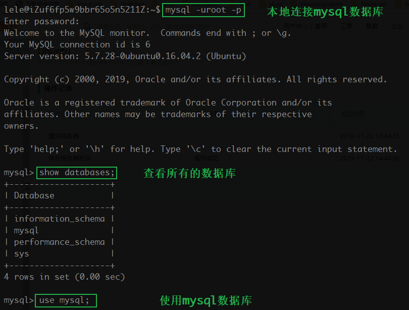

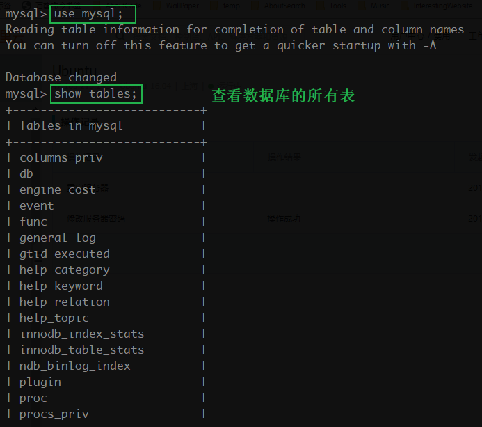

查看表结构

```sql
mysql> desc user;
+------------------------+-----------------------------------+------+-----+-----------------------+-------+
| Field                  | Type                              | Null | Key | Default               | Extra |
+------------------------+-----------------------------------+------+-----+-----------------------+-------+
| Host                   | char(60)                          | NO   | PRI |                       |       |
| User                   | char(32)                          | NO   | PRI |                       |       |
| Select_priv            | enum('N','Y')                     | NO   |     | N                     |       |
| Insert_priv            | enum('N','Y')                     | NO   |     | N                     |       |
| Update_priv            | enum('N','Y')                     | NO   |     | N                     |       |
| Delete_priv            | enum('N','Y')                     | NO   |     | N                     |       |
| Create_priv            | enum('N','Y')                     | NO   |     | N                     |       |
| Drop_priv              | enum('N','Y')                     | NO   |     | N                     |       |
| Reload_priv            | enum('N','Y')                     | NO   |     | N                     |       |
| Shutdown_priv          | enum('N','Y')                     | NO   |     | N                     |       |
| Process_priv           | enum('N','Y')                     | NO   |     | N                     |       |
| File_priv              | enum('N','Y')                     | NO   |     | N                     |       |
| Grant_priv             | enum('N','Y')                     | NO   |     | N                     |       |
| References_priv        | enum('N','Y')                     | NO   |     | N                     |       |
| Index_priv             | enum('N','Y')                     | NO   |     | N                     |       |
| Alter_priv             | enum('N','Y')                     | NO   |     | N                     |       |
| Show_db_priv           | enum('N','Y')                     | NO   |     | N                     |       |
| Super_priv             | enum('N','Y')                     | NO   |     | N                     |       |
| Create_tmp_table_priv  | enum('N','Y')                     | NO   |     | N                     |       |
| Lock_tables_priv       | enum('N','Y')                     | NO   |     | N                     |       |
| Execute_priv           | enum('N','Y')                     | NO   |     | N                     |       |
| Repl_slave_priv        | enum('N','Y')                     | NO   |     | N                     |       |
| Repl_client_priv       | enum('N','Y')                     | NO   |     | N                     |       |
| Create_view_priv       | enum('N','Y')                     | NO   |     | N                     |       |
| Show_view_priv         | enum('N','Y')                     | NO   |     | N                     |       |
| Create_routine_priv    | enum('N','Y')                     | NO   |     | N                     |       |
| Alter_routine_priv     | enum('N','Y')                     | NO   |     | N                     |       |
| Create_user_priv       | enum('N','Y')                     | NO   |     | N                     |       |
| Event_priv             | enum('N','Y')                     | NO   |     | N                     |       |
| Trigger_priv           | enum('N','Y')                     | NO   |     | N                     |       |
| Create_tablespace_priv | enum('N','Y')                     | NO   |     | N                     |       |
| ssl_type               | enum('','ANY','X509','SPECIFIED') | NO   |     |                       |       |
| ssl_cipher             | blob                              | NO   |     | NULL                  |       |
| x509_issuer            | blob                              | NO   |     | NULL                  |       |
| x509_subject           | blob                              | NO   |     | NULL                  |       |
| max_questions          | int(11) unsigned                  | NO   |     | 0                     |       |
| max_updates            | int(11) unsigned                  | NO   |     | 0                     |       |
| max_connections        | int(11) unsigned                  | NO   |     | 0                     |       |
| max_user_connections   | int(11) unsigned                  | NO   |     | 0                     |       |
| plugin                 | char(64)                          | NO   |     | mysql_native_password |       |
| authentication_string  | text                              | YES  |     | NULL                  |       |
| password_expired       | enum('N','Y')                     | NO   |     | N                     |       |
| password_last_changed  | timestamp                         | YES  |     | NULL                  |       |
| password_lifetime      | smallint(5) unsigned              | YES  |     | NULL                  |       |
| account_locked         | enum('N','Y')                     | NO   |     | N                     |       |
+------------------------+-----------------------------------+------+-----+-----------------------+-------+
45 rows in set (0.00 sec)
```

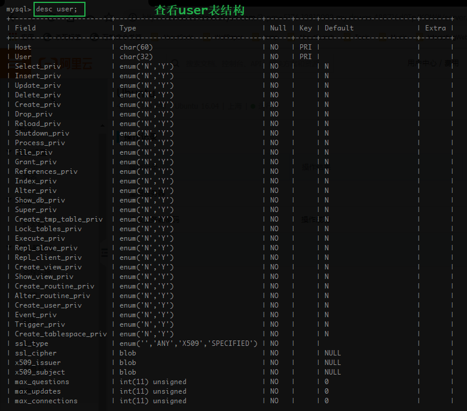

```sql
select user, host from user;
```

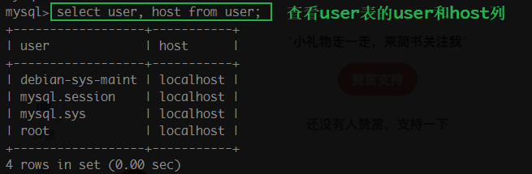

```sql
update user set host='%' where user = 'root';
```

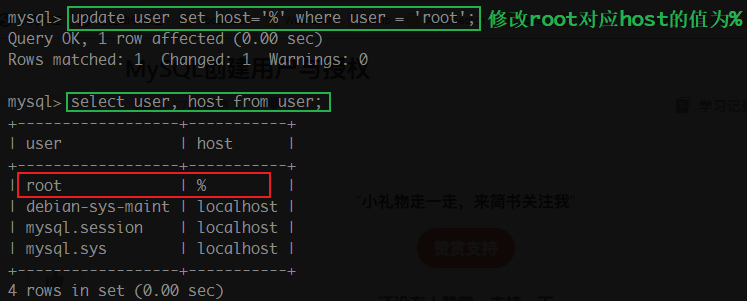


修改mysql的配置文件
```sh
$ sudo vi /etc/mysql/my.cnf
```


```cnf
[client]
default-character-set=utf8
[mysqld]
character-set-server=utf8
max_connections=1000

bind-address=0.0.0.0
```

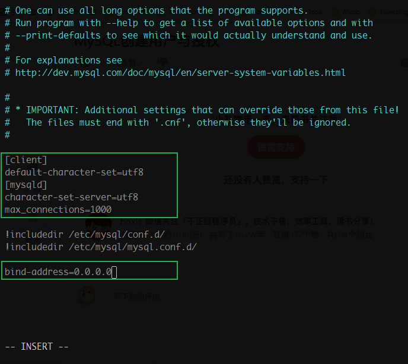

重启mysql
```sh
$ sudo service mysql restart
$ service mysql status
```

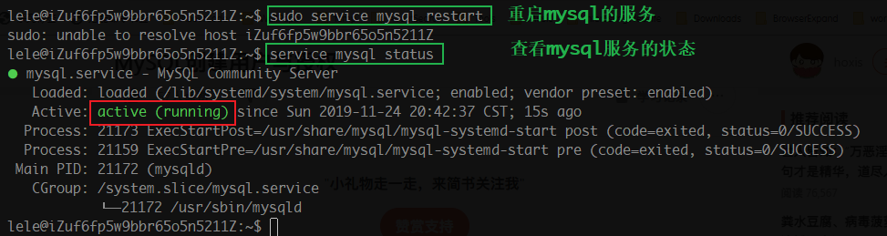

外网连接mysql数据库
```sh
$ mysql -h阿里云公网ip -uroot -p
```

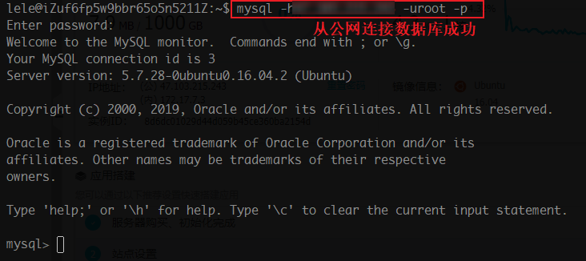


创建数据库用户
```sql
create user '用户'@'%' identified by '密码';
grant all on *.* to '用户'@'%';
```
```sh
$ mysql -h阿里云公网ip -u用户名 -p
```

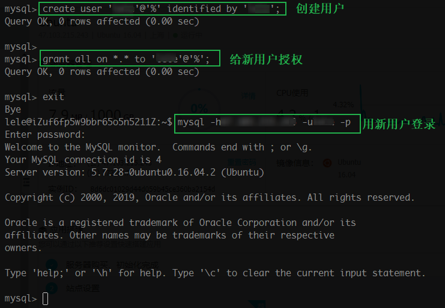


本地使用Navicat连接到阿里云数据库


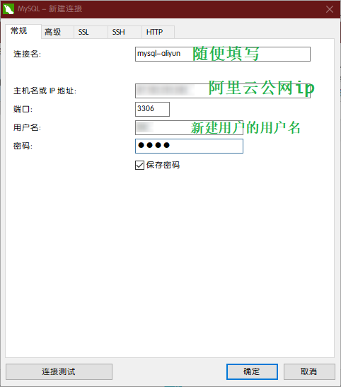

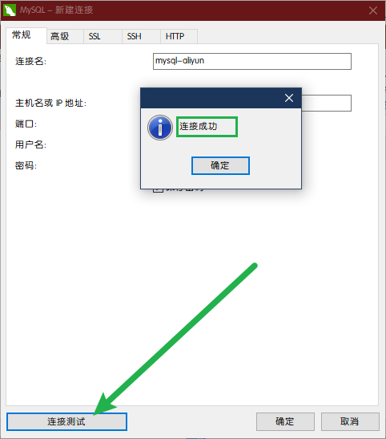


安装tomcat


[Tomcat官网](https://tomcat.apache.org/)

```sh
$ scp apache-tomcat-8.5.49.tar.gz 用户名@ip:要上传到的目录
$ wget http://mirrors.tuna.tsinghua.edu.cn/apache/tomcat/tomcat-8/v8.5.49/bin/apache-tomcat-8.5.49.tar.gz
```

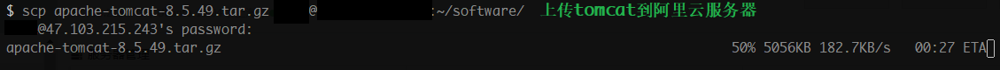


```sh
$ tar -xvf apache-tomcat-8.5.49.tar.gz
```


添加防火墙

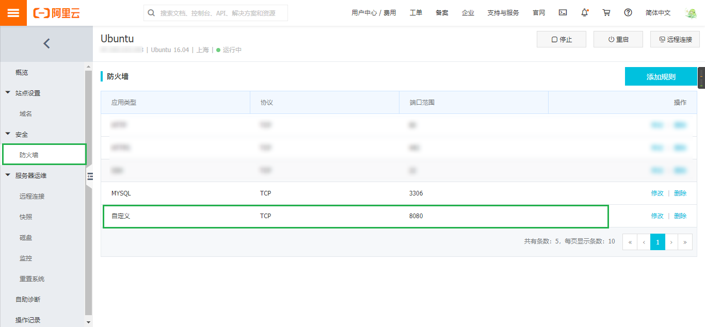

启动tomcat
```sh
$  ./apache-tomcat-8.5.49/bin/startup.sh
```
启动后在本机的地址栏输入阿里云服务器ip:8080访问

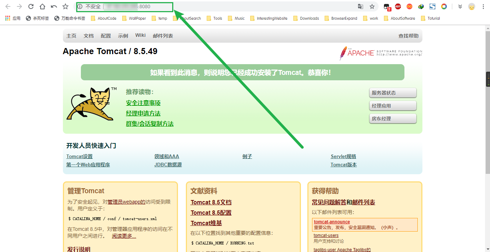
Execution default-cli of goal org.springframework.boot:spring-boot-maven-plugin:2.2.1.RELEASE:run failed: Unable to find a single main class from the follo


npm run build:prod

vue.config.js

dist--->./

main.js---->30-33

nohup [command]  & 把程序抛到后台


