# mysql 5.7.X 免安装版使用记录

-------
author:witt


> 平台:Windows
> 适用版本:mysql5.7.x
> 演示版本:mysql 5.7.29


## 一、下载mysql压缩安装文件
在mysql的官网找到mysql5.7版本的下载页面，下载mysql5.7的Windows版压缩文件
[下载地址](https://dev.mysql.com/downloads/mysql/5.7.html)

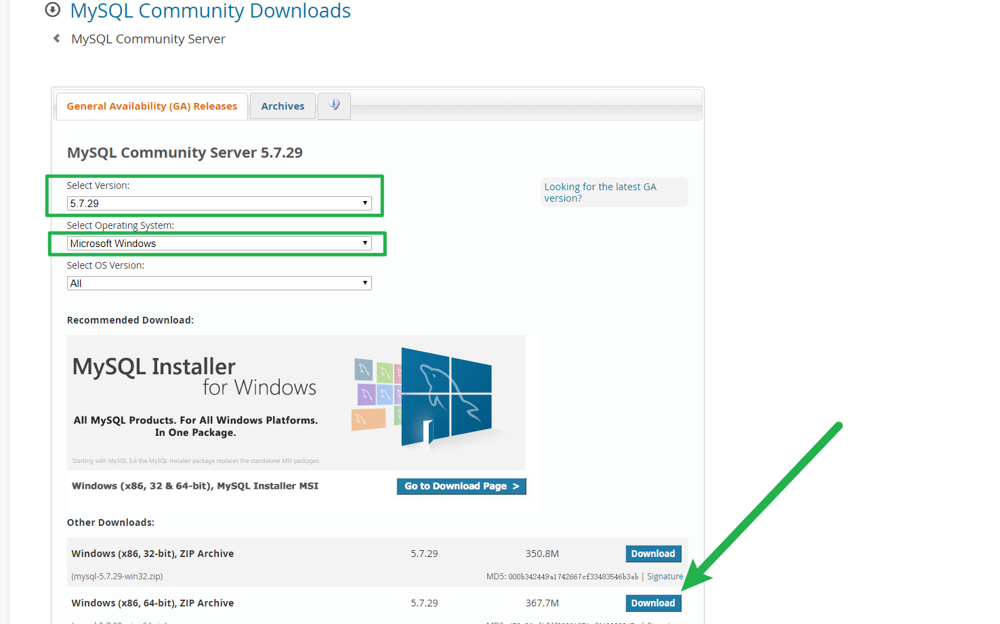

mysql开源免费，可以不注册登录直接下载，下载完成后，存放在电脑的指定位置

## 二、安装mysql
### 1.将mysql压缩文件解压缩

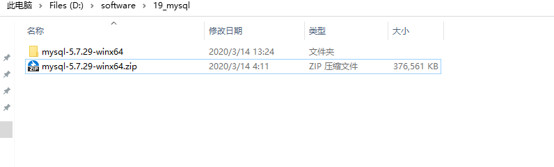

为了方便，我将文件夹改名为`mysql5.7.29`

### 2.配置mysql
进入mysql文件夹，在可以看到`bin`文件夹的目录下

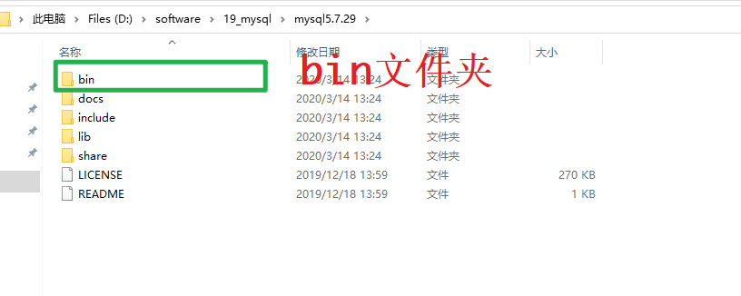

* 新建空文件夹`data`
* 新建文本文件，改名为`my.ini`

	> 注意Windows默认不显示拓展名对文件改拓展名的影响

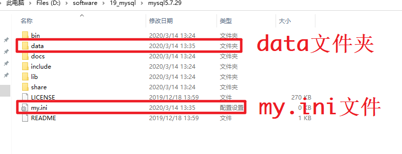


使用文本编辑器，例如`notepad++`或者`sublime text`编辑`my.ini`文件,将以下内容粘贴进去，并修改为自己的内容
```ini
[mysqld]
explicit_defaults_for_timestamp = ON
# 设置服务端使用的字符集为utf-8
character-set-server=utf8
# 绑定IPv4地址
bind-address = 0.0.0.0
# 设置mysql的端口号
port = 3306
# 设置mysql的安装目录(能看到bin即可)
basedir=D:\software\19_mysql\mysql5.7.29
# 设置mysql数据库的数据的存放目录(即data文件夹，其他的也可以，必须是空文件夹)
datadir=D:\software\19_mysql\mysql5.7.29\data
# 允许最大连接数
max_connections=2000
# 创建新表时将使用的默认存储引擎
default-storage-engine=INNODB
# 设置mysql以及数据库的默认编码

collation_server=utf8_unicode_ci
max_allowed_packet = 2048M

sql_mode=STRICT_TRANS_TABLES,NO_ZERO_IN_DATE,NO_ZERO_DATE,ERROR_FOR_DIVISION_BY_ZERO,NO_AUTO_CREATE_USER,NO_ENGINE_SUBSTITUTION

query_cache_size = 20M
query_cache_type = ON
[mysql]
default-character-set=utf8
[mysql.server]
default-character-set=utf8
# 设置客户端默认字符集
[client]
default-character-set=utf8
```

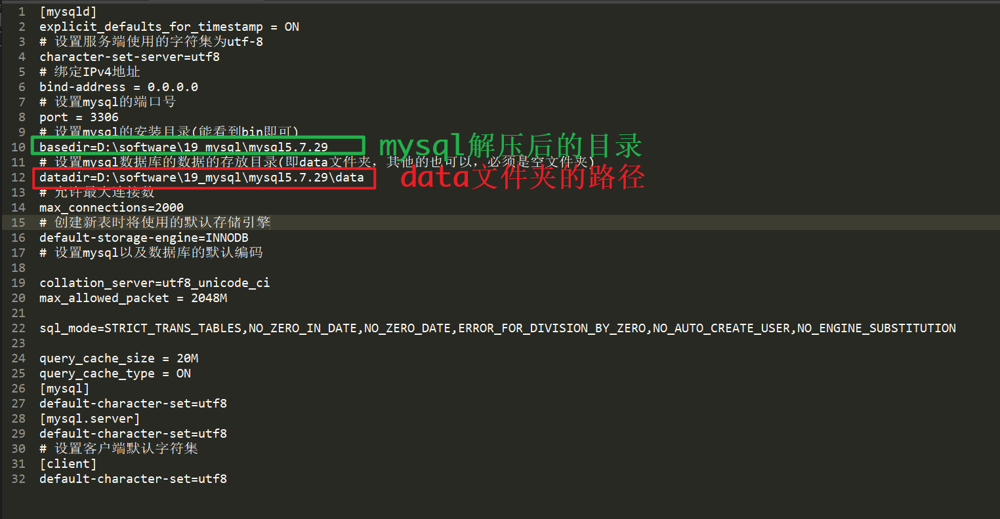

## 三、配置mysql环境变量
### 1.配置mysql家目录
使用快捷键`Windows徽标键`+`R`(或者鼠标右键点击开始菜单，选择`运行`),打开运行对话框，输入`sysdm.cpl`,回车

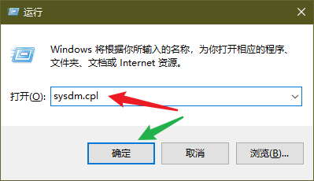

依次选择`高级`->`环境变量`

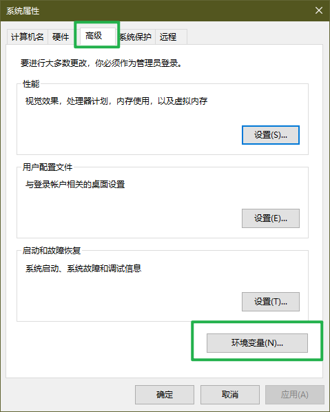

在系统变量下点击`新建`
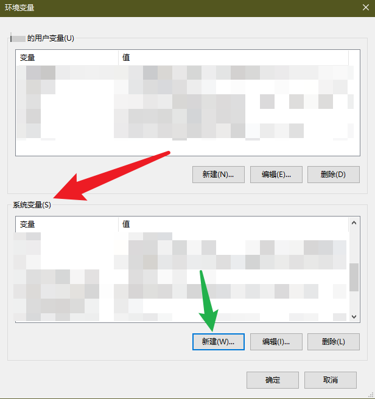

输入下面的内容
```
变量名:MYSQL_HOME
变量值:D:\software\19_mysql\mysql5.7.29(能看到bin目录的mysql解压路径)
```
> 变量值一定要是可以看到`bin`文件夹的目录,之后点击`确定`

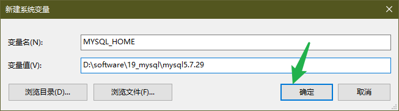

### 2.`PATH`变量配置bin
在系统变量下找到`Path`变量,选中点击`编辑`

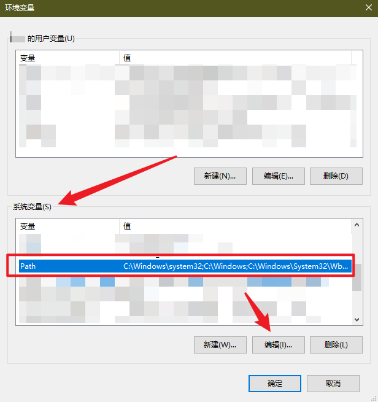

`新建`变量如下
`%MYSQL_HOME%\bin`


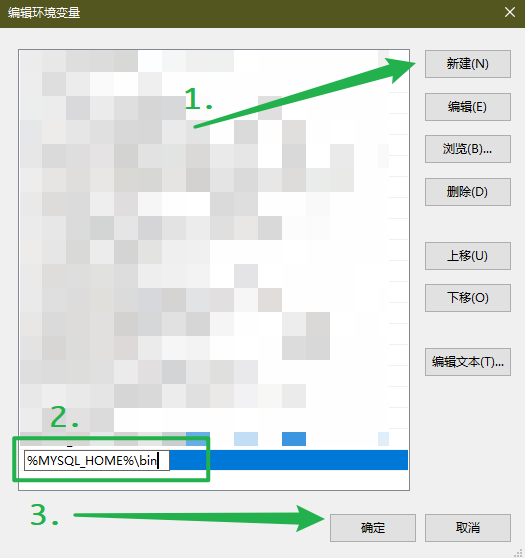

如果你点击`编辑`之后，出来的跟我对话框不一样，可能是一个长条，里面有很多变量值，不要动原来的变量，在最后面追加下面的内容
`;%MYSQL_HOME%\bin`

之后一路点击`确定`(三个确定点完)


## 四、安装mysql
### 1.安装mysql
同样操作，使用`Windows徽标键`+`R`,打开`运行`,输入`cmd`,点击`确定`(或者鼠标右键点击开始菜单，选择`命令提示符`或`Windows PowerShell`),会打开一个命令行交互窗口，我的电脑修改了`cmd`终端，大致类似于这个界面


输入命令，执行操作
* 安装mysql
`mysqld --install`
* 卸载mysql
`mysqld --remove`
正确安装后，提示

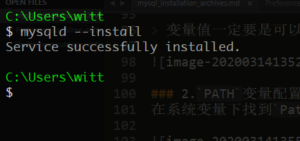

> 如果提示你**`'mysqld'不是内部或外部命令，也不是可运行的程序或批处理文件。`**,说明你的环境变量配置不正确，返回去检查，重新配置即可。

### 2.初始化mysql
上一步正确之后，继续执行下面的命令
`mysqld --initialize --user=root --console`
这是初始化mysql的命令，初始化意味着你可以初始化很多次，但是每次必须保证mysql目录下的`data`文件夹是空的。

成功执行之后是这样的，最后的是随机分配的密码，不要丢了


> 错误解决:
> 如果你执行了上面的命令，报错是这样的
> 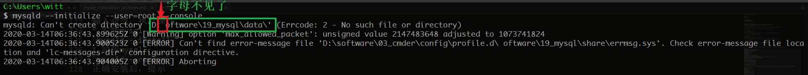
> 你确认了好几遍`my.ini`里的这两项路径没有问题，但还是报错！
> 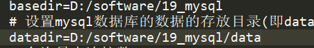
> 那你就遇到了这个安装几百遍只出现一两次的bug(我目前只遇到这一次),mysql将windows的路径分隔符`\`解析错了，你需要修改`my.ini`里的配置
> 将路径里的`\`改成`/`
> 

### 3.启动mysql服务
继续在终端执行
* 启动mysql服务
`net start mysql`
* 停止mysql服务
`net stop mysql`

启动成功后，就可以登录mysql了
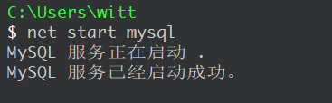

## 五、登录mysql
初始化mysql之后，会有一个给`root`用户在`localhost`下使用的随机密码，使用这个随机密码，登录mysql
登录mysql
```bash
mysql -uroot -p   # 回车之后输入密码
mysql -uroot -p密码  # 直接输入密码，这种方式不安全
```

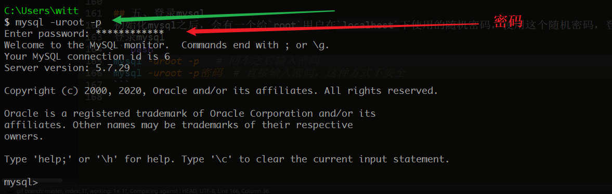

## 六、修改登录密码
随机的密码实在太安全了，安全的我们都记不住，当然是可以直接使用的，我这里提供改密码的方法
* 修改密码
`set password = password('你要设置的密码放在这个引号里');`

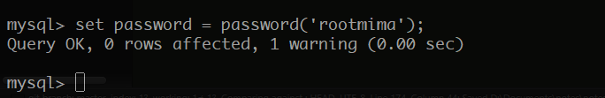

使用`exit`退出之后，就可以使用新密码登录了
