# 多版本Nodejs共存
----
作者:乐乐

> 多版本共存node,实际上就是使用NVM管理node


# 一、下载和安装nvm

## (一)、下载nvm

nvm是NodeJs的版本管理工具

[nvm下载页面](https://github.com/coreybutler/nvm-windows/releases)，选择第一个`nvm-noinstall.zip`下载即可

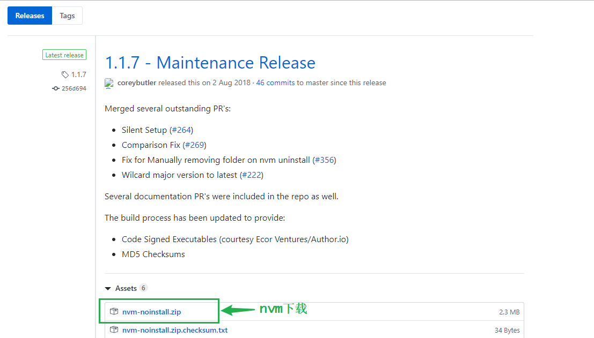

## (二)、安装nvm

### 1.解压nvm安装文件

将nvm的安装文件解压在不带中文的路径下，并且不能含有空格

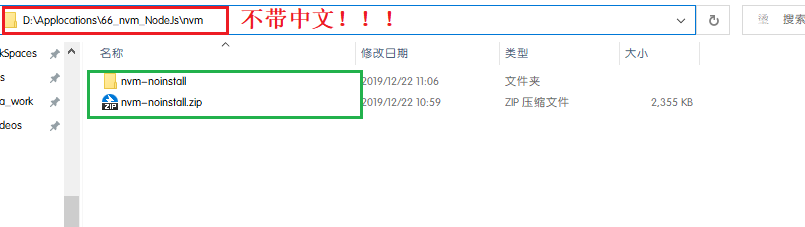

### 2.安装nvm

(1).进入解压后的nvm目录下，双击`install.cmd`,弹出终端界面，点击回车键

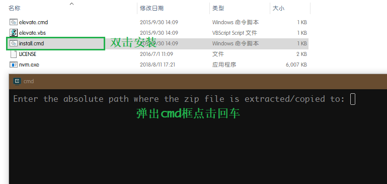

(2).此时终端会提示`拒绝访问注册表路径`,并且自动打开`settings.txt`文件

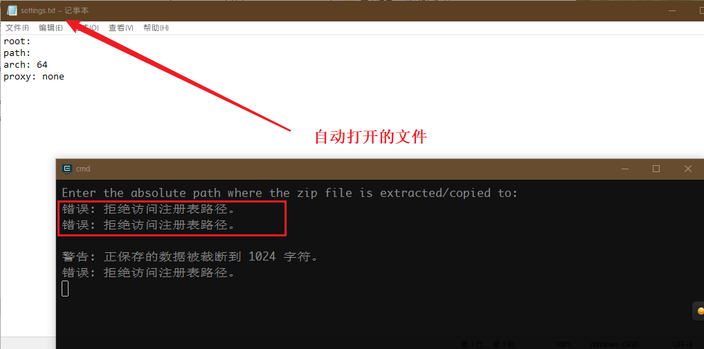

(3).按照下面的内容修改`setting.txt`文件，或者直接复制进去再修改

```txt
root: D:\Applocations\66_nvm_NodeJs\nvm\nvm-noinstall
path: D:\Applocations\66_nvm_NodeJs\nodejs
arch: 64
proxy: none
node_mirror: http://npm.taobao.org/mirrors/node/
npm_mirror: https://npm.taobao.org/mirrors/npm/
```

> `root`nvm的存放路径
>
> `path`存放指向node版本的快捷方式，快捷方式会自动生成，建议此路径和nvm路径同级
>
> `arch`要安装的nodejs的版本是32还是64位
>
> `proxy`代理设置，建议为none
>
> `node_mirror`node的下载淘宝镜像
>
> `npm_mirror`npm下载的淘宝镜像

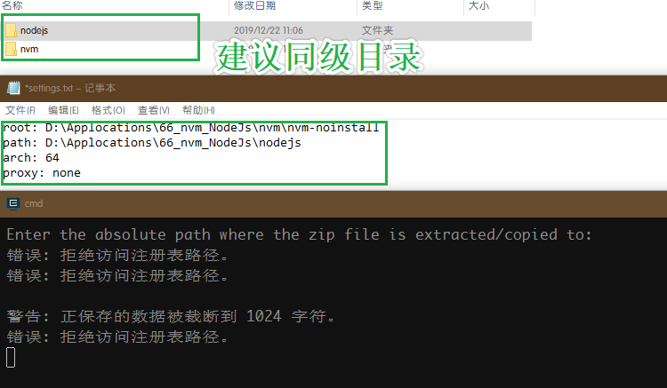

(4).修改完成后，直接把`settings.txt`文件保存在nvm的安装目录下

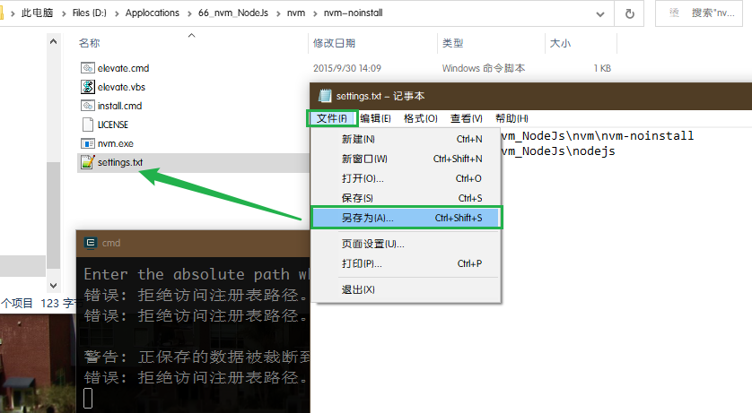

### 3.配置环境变量

(1).依次打开'此电脑'-->右键'属性'-->'高级系统设置'-->'环境变量'

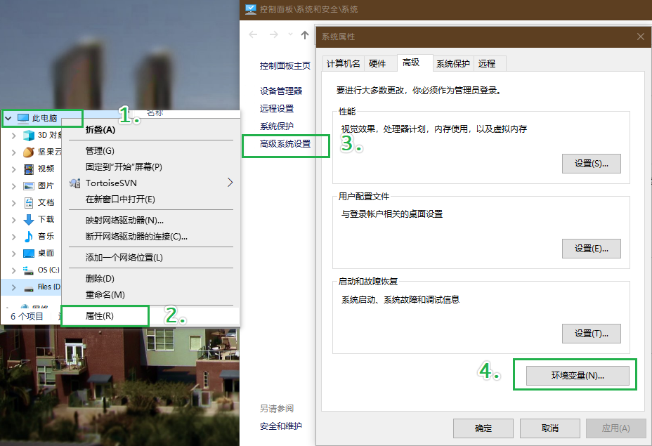

(2).在系统变量下查看是否已存在`NVM_HOME`和`NVM_SYMLINK`环境变量，如果存在，查看变量值是不是下面的内容；如果不存在，新建这两个环境变量，并添加为下面的值
```
NVM_HOME:D:\Applocations\66_nvm_NodeJs\nvm\nvm-noinstall
NVM_SYMLINK:D:\Applocations\66_nvm_NodeJs\nodejs
```

> `NVM_HOME`是指nvm的安装目录，就是上一步`root`的路径
>
> `NVM_SYMLINK`是指nodejs的安装目录，就是上一步`path`的路径

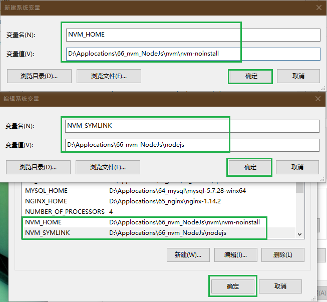

(3).在`path`变量下查看是否已经将`nvm`和`nodeJs`的路径配置，如果配置了删除再添加下面的内容，没有就直接添加

`path`环境变量

```
%NVM_HOME%
%NVM_SYMLINK%
```

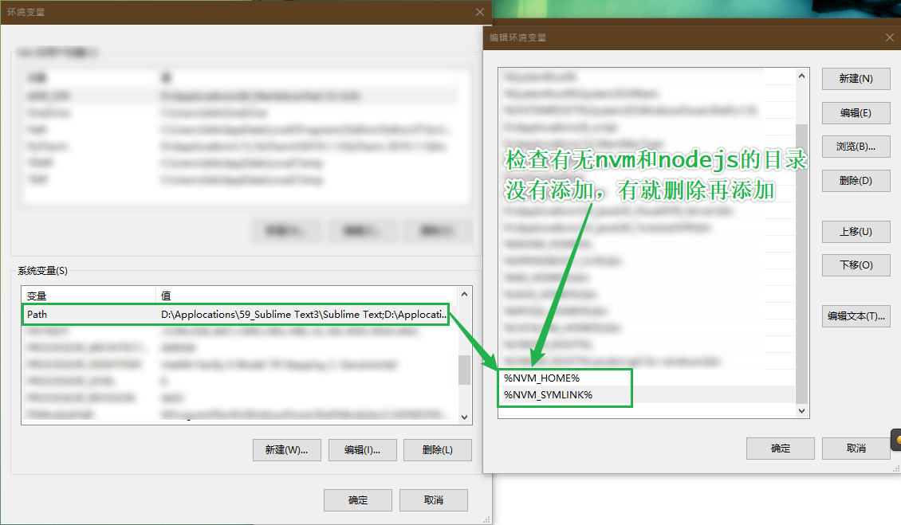

### 4.检测nvm是否安装成功

`Windows`徽标键+`R`键打开运行，输入`cmd`，打开终端，输入`nvm -v`，查看到版本信息，说明nvm安装成功

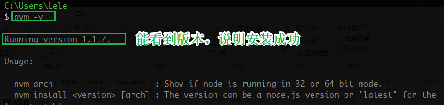

如果没看到版本，检查环境变量

```bash
# 查看环境变量
set [环境变量名]
```

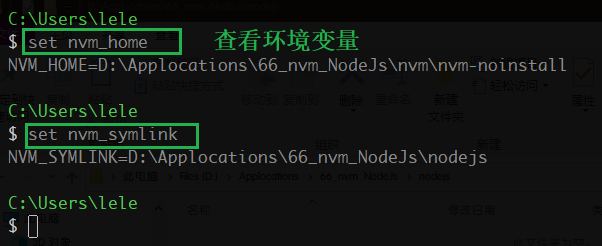

出现问题，按照上面的步骤再来一次就好了

# 二、安装node
## (一)、查看已经安装的node
```bash
nvm list
nvm ls
```

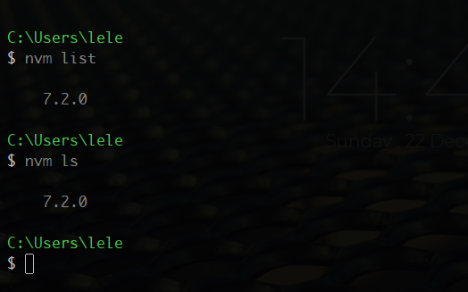

## (二)、查看所有可以安装的node版本
```bash
nvm list available
```

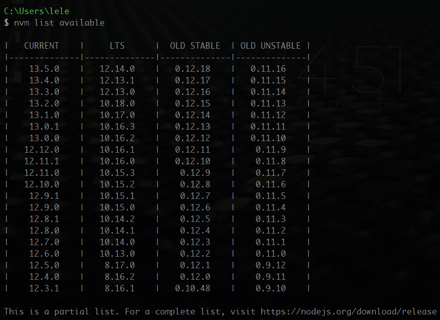

## (三)、安装指定版本的node
```bash
# 默认64位
nvm install [版本号]
nvm install 7.2.0 64-bit
nvm install 7.2.0 32-bit
```

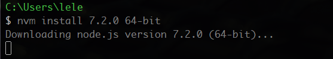

安装时，下载会特别慢，这里推荐使用淘宝镜像下载(前面的`settings.txt`已经包含了这个配置，已经配置，不用重复配置)

```bash
# 设置node和npm的下载位置是淘宝镜像
nvm node_mirror https://npm.taobao.org/mirrors/node/
nvm npm_mirror https://npm.taobao.org/mirrors/npm/
```

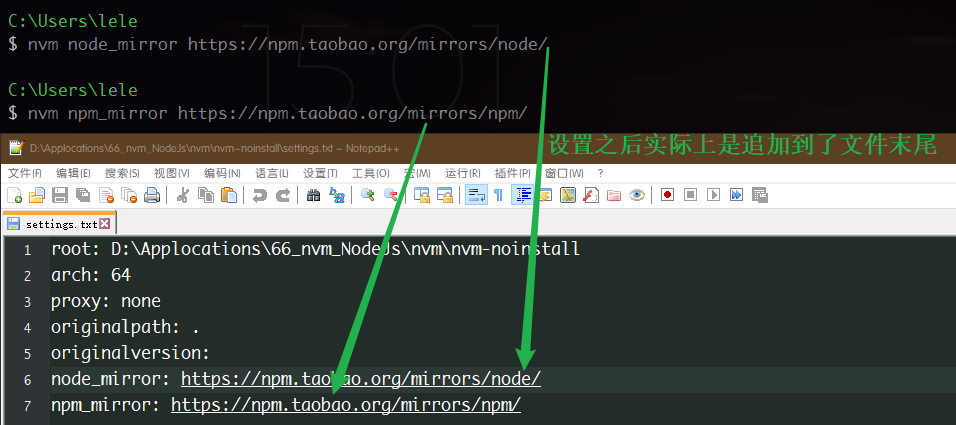

## (四)、使用指定版本的node

```bash
# 查看当前使用的node版本
nvm current
node -v
nvm list
# 使用指定版本的node
nvm use [版本号]
```

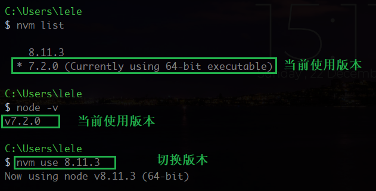

## (五)、卸载指定版本的node

```bash
nvm uninstall [版本号]
```

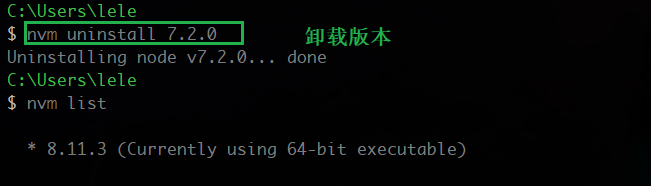

## (六)、安装最新版本的node

```bash
nvm install latest
```

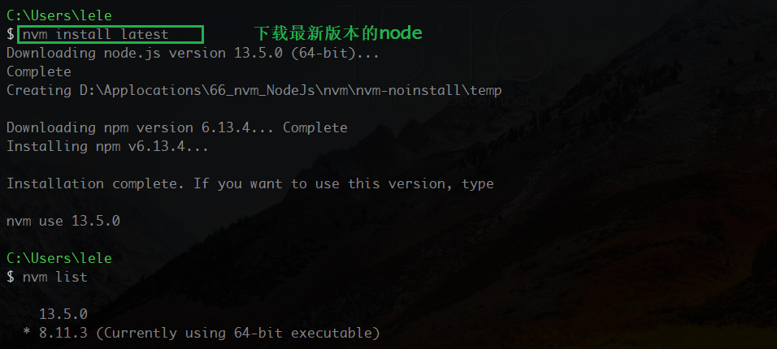

## (七)、安装cnpm

```
npm install -g cnpm --registry=https://registry.npm.taobao.org
```


## 设置npm安装包和缓存的位置

```
npm config set cache "D:\nodejs\node_cache"
npm config set prefix "D:\nodejs\node_global"
```


设置npm淘宝镜像
`npm config set registry https://registry.npm.taobao.org`

