# Java 学习之路
------
作者：乐乐

# 一、`Unix`、`Linux`操作系统
## (一).`Linux`概述
### 1.`Linux`和`Unix`
`Linux`由`Unix`发展而来
`Unix`:稳定、收费、不开源
`Linux`:免费、开源
常见的`Linux`发行版(有优势的版本)：`Ubuntu`、 `Deepin`、`CentOS`
优势:多任务，多用户，多线程、适合在服务器运行
劣势 : 命令众多、软件生态不好
### 2.`Linux`环境搭建
下载`linux`系统：https://www.linuxidc.com/
#### (1)安装`Ubuntu`操作系统
1>准备空白U盘
2>下载系统的镜像文件
后缀格式是`*.iso`
3>做成`Linux`启动盘
4>设置bios从U盘启动
5>安装`Linux`系统
6>设置`Linux`系统
#### (2)安装`Ubuntu`虚拟机
1>安装VM虚拟机
2>加载镜像文件安装，或者直接打开制作好的虚拟机文件
#### (3)登录`Linux`服务器
`telnet [ip]`

## (二).`Linux`文件系统
### 1.`Linux OS`的组成
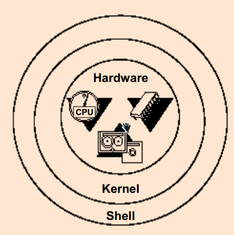

理解记忆洋葱图
硬件设备`Hardware`
`kernel`: 内核是一个操作系统的核心，是操作系统最基本的部分。它负责管理系统的进程、内存、设备驱动程序、文件和网络系统等，决定着系统的性能和稳定性。它是为众多应用程序提供对计算机硬件的安全访问的一部分软件，这种访问是有限的，并且内核决定一个程序在什么时候对某部分硬件操作多长时间
内核就是用来管理计算机的进程，调度，创建，执行，销毁，这一系列都是由内核来管理

`shell`:`shell`是一门语言，可以使用代码对内核进行操作。
`shell`编程，对外提供命令。命令最终会转换为操作内核的指令0101
`*.sh` `shell`脚本

>环境变量可以查看系统中默认的`shell`是什么？
方法：
`Linux`中：`echo  $SHEll`
`Windows`中：`echo %path%`

`file System`文件系统
文件系统，计算机上所有的内容都以文件的形式进行存放，
在文件系统中，要明确当前文件的位置在哪。
文件系统中的文件，可以用相对路径和绝对路径表示或者查找。
### 2.`Linux`文件系统
#### (1)`Linux`根文件目录
`/`:`unix`       系统的根路径
**根**路径文件夹存放内容,下面属于一级目录.
`/opt`           第三方软件
`/etc`           系统配置
`/dev`           计算机设备文件(用一些计算机编程语言打开文件，就可以对外围设备进行操作)
`/usr`           操作系统中自带的对所有用户都用的软件
`/kernel(boot)`  内核程序
`/var`           针对管理员使用的东西
`/export(home)`  用户专有的东西,可以用`~`表示
#### (2)绝对路径和相对路径
`Absolute`（绝对） `Relative`（相对）
绝对路径:从根目录出发，一定是以`/`开头的，完整文件路径
相对路径:从当前路径出发，以当前位置做为参照的文件路径
#### (3)目录
`.`   代表目录本身
`..`  代表上一级目录
`~`   家目录
`/`   根目录

## (三).`Linux`的基础命令
### 1.终端
`Ctrl+Alt+T`   打开终端
`Ctrl+Shift+T` 以标签形式打开多个终端
### 2.远程登录
`Linux`  端:`telnet [ip:port]`
`Windows`端:`telnet [ip] [port]`
### 3.用户间切换
`su`              切换用户
`sudo`            临时使用`root`账户权限
`sudo passwd root`更改root账户密码
`passwd 用户名`   修改某个用户的密码
普通用户的标识`$`
超级用户的标识`#`
### 4.清屏
`Linux`下的清屏:`clear`
`Windows`下清屏：`cls`,cmd连接数据库，清屏`$cls`
### 5.打印工作目录
`pwd`打印当前的工作目录，当前所处位置的绝对路径
### 6.切换目录
`cd`           改变路径
`cd /opt`      跳转到`/opt`目录下
`cd`或者`cd ~` 跳转到家目录
`cd ..`        跳转到上一层目录
### 7.查看当前列表的文件
`ls`      查看当前目录下的文件和目录
`ls -a`   all，显示所有文件，包括隐藏文件
`ls -R`   递归显示所有文件
`ls -t`   根据时间排序文件
`-ls T`   按最后修改时间排序文件
`ls -l`   显示文件和目录的详细信息
`ls -F`   显示文件类型

> 文件（none）  软连接@    目录/    可执行文件*

### 8.文件类型
`-`      普通常规文件
`d`      目录文件
`l`      链接文件(`soft`)(类似`windows`中的快捷方式)
`c`      字符设备文件(对应一个外围设备)
`b`      块设备文件(网络设备(不对应到文件))
`p`      (pipe) 管道文件 (一般见不到)
`s`      (socket)套接字文件
`p`、`s` 两种文件是为了解决进程间进行通信的文件

> 软链接  `ls -s  [filename] [linkname]`  相当于快捷方式
> 硬链接 `ln [filename] [linkname]`

### 9.文件权限
#### (1)文件的权限
`r`:读  `w`: 写 `x`:操作
文件的拥有者(权限)：凡是和这个文件的拥有者有相同的UID的用户，都是该文件的拥有者
文件必须有`x`权限，才可以进行搜索
| `rw-` | `rw-`  | `r--`  |
| :---: | :----: | :----: |
| 自己  | 同组人 | 其他人 |
|  `u`  |  `g`   |  `o`   |
拥有者-生成文件时登录的人,权限最高,`u`表示
同组人-系统管理员分配的同组的一个或几个人`g`表示
其它人-除拥有者,同组人外的人,`o`表示
所有人-包括拥有者、同组人及其它人,`a`表示
#### (2)文件权限修改
`chmod u+x,g-r,o=w [filename]`使用权限模式修改权限
`chmod 777`    `rwx rwx rwx`  使用权限值模式修改权限
`chmod 644`    `rw- r-- r--`
| 权限值 | 权限  |
| :----: | :---: |
|   7    | `rwx` |
|   6    | `rw-` |
|   5    | `r-x` |
|   4    | `r--` |
|   3    | `-wx` |
|   2    | `-w-` |
|   1    | `--x` |
|   0    | `---` |
### 10.创建文件
如果文件存在，就是修改文件的时间(修改文件的时间为系统的当前时间)，如果文件不存在，就是新建一个文件
`touch [filename]`新建一个文件
`touch [filename1] [filename2] [...]`  同时创建多个文件
### 11.创建文件夹
`mkdir [dirname]`                   创建目录
`mkdir [dirname1] [dirname2] [...]` 创建多个目录
`mkdir -p dir1/dir2/dir3...`        创建多级目录
### 12.复制
`cp [dir1]/[file1] [dir2]/`    把`dir1`下的`file1`复制到`dir2`下
`cp -i [dir1]/[file1] [dir2]/` 复制时，提示是否覆盖
`cp -r [dir1] [dir]/[dir2]`    复制文件夹
如果目标目录存在,直接放到目标目录中,目标文件夹不存在，就是复制。
### 13.移动(剪切)和重命名
`mv file/dir  dir/file`   移动或者重命名
`mv -i file/dir dir/file` 如果存在覆盖情况，询问是否覆盖
源头是文件，目标是目录，如果不存在，就是移动，如果存在会覆盖
源头是文件，目标还在本目录，就是重命名
可以移动并重命名`mv a.txt dir/b.txt`把a.txt移动到dir下，重命名为b.txt
### 14.删除文件、目录
`rm [filename]`             删除文件
`rm [file1] [file2] [...]`  同时删除多个文件
`rm -r dir`                 删除文件夹
`rm -i [-r] [file]/[dir]`   删除前询问用户，是否确认删除
`rmdir [dir]`               删除空文件夹，非空文件夹不能删除！

>`rm -r  *`删除所有内容，属于危险操作，`*`通配符

### 15.查看命令手册
`man [command]`
回车翻一行，空格翻一页，`q`退出，`b`往上翻，`f`往下翻。
`/关键词`   检索，`n`检索下一条记录。
### 16.查看网络配置
`ifconfig`   linux下查看网络配置信息
`ipconfig`   Windows下查看网络配置信息
`ping [ip]`  查看与该`ip`的连接状态
### 17.特殊元字符
`*`                        通配符，代表任意多个字符
`?`                        任意单个字符
`;`                        多个命令分隔，一个命令行输入多个命令
`date`                     日期
`cal`                      日历
`> [address]`              输出流，将内容转到另一个目的地，每次都会覆盖
`<`                        输入流
`>> [address]`             输出流追加
`[command] | [command]`    管道符号，一个命令的输出作为另一个命令的输入
`lp`                       操作打印机
`[ [character] ]`          匹配`[]`中的任意字符
### 18.筛选过滤
`ps -ef | grep java`              查看java的进程
`cat /etc/passwd | grep -i "abc"` 在passwd文件中查找ABC字符串，不区分大小写
`-i`                              忽略大小写
`-v`                              查找不匹配的行
### 19.查看文件内容
`cat`                             显示文件中的内容到终端，一次性显示完
`cat [file1] [file2] >> [file]`   合并文件的内容追加到另一个文件中
`cat /dev/null  >  [filename]`    清空某个文件的内容
`cat -n [file]`                   显示行号，包括空行
`cat -b [file]`                   显示行号，不包括空行
`more`                            把文件的内容分屏显示在终端，回车和空格可控制
`head [n] [file]`                 显示文件前n行，默认前十行
`tail [n] [file]`                 显示文件后n行，默认后十行
### 20.查看进程
`ps`            打印进程列表
`ps -e`         查看正在运行的进程(运行过程中、就绪状态下的)
`ps -f`         查看进程详细信息
`ps -ef`        打印所有运行的进程，主要是进程号pid
`ps -auwx`      查看非常详细的进程信息
`kill [pid] `   杀死进程
`kill -9 [pid]` 强制杀死进程
`sleep`         让进程进入休眠状态
`pkill 进程名`  通过进程名杀死进程
### 21.`vi`编辑器
`vim`           是加强版的`vi`
`vi [file]`     打开文件，没有则创建
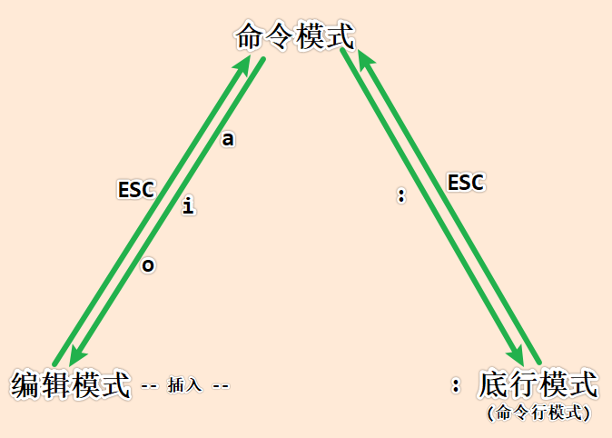

**编辑**
`i`             光标当前位置插入
`a`             光标后插入
`o`             光标下一行插入空行
**删除**
`x`             删除一个字符
`u`             撤销删除
`dw`            删除当前词
`3dw`           删除三个词
`dd`            删除当前行
`5dd`           删除五行
`:5,10d`        删除5到10行
**修改**
`r`             替换一个字符
`cw`            替换一个单词
`cc`            替换一行
`C`             替换从光标至行尾
`~`             大小写切换
`J`             把当前行和下一行连起来
`:r file2`      在光标所在位置插入另一个文件
`:1,行号(“&最后一行”)s/旧串/新串/g`  替换全文(或` :%s/旧串/新串/g`)
**定位**
`e`             单词末尾间跳转（end）
`w`             单词首字母间跳转（Word）
`home`、`end`   首末间跳转
`hjkl`          左下上右
`:21`           光标停在指定行
`21G`           光标停在指定行
`G`             到文件尾
`1G`            到文件头
`/串`           从当前行往下查找
`?串`           从当前行往上查找
`n`             查找继续
**复制和移动**
`yw`            拷贝词
`yy`            拷贝行(或Y)
`p`             当前行下粘贴
`:1,2co9`       拷贝行1，行2在行9之后
`:4,5m10`       移动行4，行5在行10之后
**保存和退出**
`:wq!`          强制保存并退出
`w`             保存
`q`             退出
`q!`            强制退出不保存
**设置**
`set nu`        设置行号
`set nonu`      取消设置行号
### 22.环境变量
`whereis [command]`   查看某个命令在哪个路径(在path下搜索，搜索到继续搜索，直到找到所有改名了)
`which [command]`     查看某个命令在哪个路径(在path下搜索，搜索到就停止)
`echo $PATH`          查看环境变量
`PATH=$PATH:[value]`  临时设置环境变量

`System-wide`         系统环境变量
`User-specific`       用户环境变量

系统环境变量的位置`/etc/profile`
用户环境变量的位置`$HOME/.bashrc`
### 23.归档和压缩
`tar -cvf [filename.tar] [files]`     归档,归档为一个文件
`tar -xvf [filename.tar] -C [dir]`    解压

`tar -cvzf [filename.tar.gz] [files]` 压缩,将大文件使用算法压缩大小
`tar -xvzf [filename.tar.gz] -C [dir]`解压缩
### 24.用户和组操作
`id [user]`                                        查看用户信息
`id -a [user]`                                     查看用户全部信息
`adduser [user]`                                   添加用户
`usermod -g [group] [user]`                        把user移动到group组中
`gpasswd -a [user] [group]`                        把user追加到group组
`gpasswd -d [user] [group]`                        从group组删除user
`deluser -remove-home [user]`或`userdel -r [user]` 把user用户删除包括user用户家目录
`users`                                            显示当前登入的账户
`who`                                              用来查询目前有哪些人在线上。
`w`                                                用来查询目前有哪些人在线上，同时显示出那些人目前的工作。
`who am i`                                         显示登入系统时候的账户
`whoami`                                           显示当前使用的用户
### 25.查找文件
`find`                                             根据指定的条件从文件系统中搜寻指定的文件或目录，然后做处理
`find [path] -name "[fileName]"`                   在path下查找filename文件
`find [path] -mtime [n]`                           在path下查找n小时前修改的文件

>`n`       是正数，n小时之外，n是负数，n小时之内
>`-mtime`  文件内容修改时间`-atime`:访问时间`-ctime`:文件状态改变的时间

`find [path] -user [user]`                         在path路径下查找用户是user的文件
`find [path] -size 30c`                            在path路径下查找大小是30字节的文件
`find [path] -perm [权限/权限值]`                  在path路径下查找该权限的文件
`find [path] -tpye [filetype]`                     在path路径下，查找filetype的文件

>普通文件`-`用`f`代替

### 26.统计文件
`wc`  统计文件的行数、字符个数、单词个数
使用格式`wc [options] [filename]`
`-l`  行数
`-w`  字数
`-c`  字符数
### 27.`ftp`
`ftp`(File Transfer Protocol)允许用户对远地主机复制文件，用户毋须考虑操作系统类型，即能向或从任何具有 TCP/IP 的系统复制文件。 ftp命令允许复制目录中的一个文件或所有文件，但不能复制多层 次目录。使用ftp时， 必需在远地主机上设有帐户。 当 ftp 注册到远地系统时，并未得到shell ，而是通过 ftp 命令解释程序同远地主机进行通讯。
`bin` 字节上传
`asc` 字符上传
`put` 上传文件
`get` 下载文件
注:只能下载和上传 文件，不能下文件夹,也不能传文件夹
`prompt` 不出现确认的提示信息
`bye`    退出`ftp`远程服务器
### 28.`History`
`set HISTORY=n` 设置最多允许保存前n个已执行命令的记录
`history`       显示历史记录信息
`history n`     显示第n条历史记录信息
`!n`            重复执行第n条历史命令
`!!`            重复执行上一条历史命令
### 29.别名
针对于系统中已经存在的命令，给它取个别名
`bash:alias 别名=原始命令`修改已有命令为别名
`alias home=’cd;ls’`
`alias`                   显示所有设置的别名
`unalias copy`            取消所设置的别名


# 二、java基础入门
## (一).`java`入门
### 1.`JDK`环境搭建
①复制`jdk_1.8.0_74-linux-.tar.gz`到虚拟机
②`mkdir /opt/software/`
③`tar -zxvf jdk_1.8.0_74-linux-.tar.gz`
④`mv jdk_1.8.0_74 /opt/software/`
⑤`cd;vi .bashrc`
⑥配置java环境变量
Windows:
`JAVA_HOME=C:\Program Files\Java\jdk1.8.0_74`  JDk安装目录

> 作用：根据此变量找到JDK的安装目录，得到JDK的支持。
> `eg：tomcat java`

`PATH=%JAVA_HOME%\bin;%PATH%`	JDK安装目录里面的命令目录

> 作用：在系统任何路径下执行java命令都可以找得到java命令

`CLASSPATH = .`  类加载时候查找的字节码路径

> `*.java` ------> `*.class`
> 作用：指定要运行的class文件在什么位置，默认是.(表示当前路径)   运行期间临时指定

Linux:
在环境变量文件最后面粘贴
```sh
export JAVA_HOME=/opt/software/jdk
export PATH=$JAVA_HOME/bin:$PATH
export CLASSPATH=.
```
`cd;source .bashrc `   使配置文件生效
⑦查看java环境变量是否配置正确
`java -version`
`javac`
### 2.`JDK`的目录结构
`bin/`         java的相关命令
`java          javac  jar  javadoc javap  javah`
`db/`          java提供的数据库
`demo/sample/` java代码的一些示例
`include/`     C语言的头文件等内容
`jre/`         java的运行环境
`lib/`         java所用的基本的`jar`包
### 3.`JVM`、`JDK`和`Jre`
#### (1)java虚拟机JVM
`JVM`（Java Virtual Machine ）：Java虚拟机，简称`JVM`，是运行所有Java程序的假想计算机，是Java程序的运行环境，是Java 最具吸引力的特性之一。我们编写的Java代码，都运行在JVM 之上。
跨平台：任何软件的运行，都必须要运行在操作系统之上，而我们用Java编写的软件可以运行在任何的操作系统上，这个特性称为Java语言的跨平台特性。该特性是由JVM实现的，我们编写的程序运行在JVM上，而JVM运行在操作系统上。每个操作系统都有不同的虚拟机
#### (2)`JDK`和`Jre`
`JRE`(Java Runtime Environment) 是Java程序的运行时环境，包含`JVM`和运行时所需要的核心类库。
`JDK`(Java Development Kit)     是Java程序开发工具包，包含`JRE`和开发人员使用的工具。
例如：
我们想要运行一个已有的Java程序，那么只需安装JRE即可。
我们想要开发一个全新的Java程序，那么必须安装JDK 。
#### (3)`API`
`API application program interface` 应用程序编程接口
#### (4)java级别
J2SE   桌面应用的开发  JAVA SE corejava
J2EE   企业级开发      JAVAEE
J2ME   手机应用开发    JAVAME
### 4.java的特点
java由C++发展而来。
简单性:(相对应C和C++来讲)java不需要程序员操作内存
跨平台:(字节码文件)一次编译,到处运行(JVM) (write one everywhere run)
多线程:其他语言的多线程一般是系统级别的,java的多线程是语言级别的
自动回收内存(gc)守护线程/精灵线程
开源免费
类加载机制:双亲委托机制
> 字节码校验
> 1.是否符合jvm规范
> 2.是否有堆栈溢出
> 3.参数类型是否正确
> 4.类型转换是否正确
> 5.代码不能破坏系统完整性
> 6.代码不能破坏计算机硬件
### 5.垃圾回收机制
垃圾回收器:gc,java中有一个线程,专门负责JVM中垃圾内存的释放
垃圾回收器是一段守护在后台线程的代码。
垃圾:没有引用的内存节点
垃圾回收的算法
注意:垃圾回收有自己的算法,我们是不能控制垃圾回收机制的,虽然有和垃圾回收相关的方法:`java.lang.System.gc()`,`java.lang.Runtime.gc()`,但是还是无法控制垃圾回收机制(只是建议gc回收，但是gc回不回收由算法决定)
gc不能回收物理资源，例如`IO`流。
### 6.第一个java程序`Hello World`
创建一个文件HelloWorld.java
文件内容如下:
```java
public class HelloWorld{

	public static void main(String[] args){
		System.out.println("hello world!");
	}
}
```
写完后保存,然后到终端里面编译`HelloWorld.java`
注意路径:自己的当前位置和HelloWorld.java文件所在的位置是不是一致
编译命令:`javac HelloWorld.java`
编译完了之后,会在当前目录下,生成一个文件叫`HelloWorld.class`
最后我们运行的文件就是这个`HelloWorld.class`
运行HelloWorld.class文件:`java HelloWorld` 注意:运行的时候一定不要加后缀名 .class
这样运行的前提是java文件中没有写包(package)名
编译java文件的方法:
```sh
#例如Aaaa.java
javac Aaaa.java  #注意当前路径和java文件路径
#编译完后会生成一个Aaaa.class(字节码文件)
#运行java代码
java Aaaa    #后面不加.class
#可以把字节码文件打成jar包
jar -cvf [jarname].jar  [classfilesname].class
```
### 7.类加载
#### (1)双亲委托机制
##### <1>类加载器
每一个类加载器实际上都有一个父类加载器
启动类加载
(底层不是java语言实现的)
`$JAVA_HOME/jre/lib`
扩展类加载
`$JAVA_HOME/jre/lib/ext`
本地类加载
`classpath   Hello.class`
java虚拟机:JVM
类加载-->字节码验证-->JIT运行
##### <2>获取类加载器的方法
在java代码中，可以获取当前的类对象，调用方法，获取到当前类加载的类加载器
这里已经涉及到了反射的相关内容
```java
Class c = [classname].class;  //classname是指当前类的对象,也就是当前类的类名
ClassLoader loader = c.getClassLoader;  //对象调用getClassLoader方法
System.out.println(loader);
```
#### (2)类名和文件名的关系
一个java源文件(`.java`)中,可以有好多个类(class),但是,最多只能有一个类(class)被`public`修饰
如果有一个类被`public`修饰,那么这个源文件(`.java`)的名字就必须和这个被`public`修饰的类的名字一致。
注意，类名首字母大写是编程规范，不是强制要求。
### 8.三大顶级元素
`package`  避免命名冲突
`import`   导包
`class`    类的关键字
#### (1)`package`
1>最终会是以文件夹的形式体现出来(有什么包,就必须有什么文件夹,运行的时候`.class`文件必须在这个文件夹里面)
2>`*.java`文件中有多个`package`的时候,用`.`分割并且结尾用`;`号结束,包名一般用小写字母，例如:`com.lele.projects.day01;`
3>包也是java中类的标识的一部分,确定某一个类是通过包名加类名来唯一确定的,比如运行java类的时候:
`java [packagename].[classname]` eg:`java com.lele.projects.HelloWorld`
#### (2)`import`
1>导包用的关键字
2>如果你想在当前这个类使用其他的类,那么就必须通过这个关键字,把那个类导入进来
3>`java.lang`包下面的类可以直接使用,不用导入.
4>和当前这个类位于同一个包下面的类,也不需要导入,可以直接使用
```java
package com.lele.test;  //包名

//导包
import java.util.Arrays;

//创建的类
public class Test{
	...
}
```
#### (3)`class`
java中标识一个类的关键字
java类中可以没有`package`,也可以没有`import`,但是一定会`class`
### 9.编译含包名的java程序
#### (1)编译java代码文件
在Windows环境下，路径和路径之间分隔用`\`,Linux下用`/`,但是在Windows下写成`/`也是可以执行的，在Windows下包名无法用tab键补全，Linux是可以补全的
编译过程:
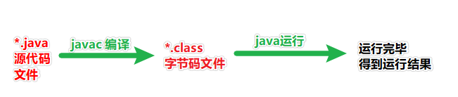

例如HelloWorld.java
```java
package com.lele.projects;

public class HelloWorld{

	public static void main(String[] args){
		System.out.println("hello world");
		System.out.println("hello world");
		System.out.print("hello world");
	}
}
```
**有包名，但是没有src和bin目录下的java代码的编译和运行**
```sh
# 通用格式
# 编译方法
javac -d [dir]/ 类名.java   # dir是要存放编译好class文件的路径
# 运行方法
java -cp [dir]/ 包名.类名   # 多级包名，用.分隔
# ------------------------------------------------

# 举例
# 编译方法
javac -d . HelloWorld.java    # .表示当前路径
# 运行方法
java com.lele.projects.HelloWorld
# 默认在当前路径，所以不用-cp 也不用写.   当初配置环境变量时，CLASSPATH的路径默认就是.  -cp指的就是CLASSPATH的路径
```
一般情况下，比如Eclipse里面默认所有的源代码都在src目录下，编译后的class文件在bin目录下，这个时候编译方法不同，对HelloWorld.java编译
`javac`编译代码的时候，是要启动JVM的。
**有包名，且源码放在src，编译的class文件要放在bin目录下，编译运行方法**
```sh
# 通用格式
# 编译方法
javac -d bin/ src/类名.java
# 运行方法
java -cp bin/ 包名.类名
# ------------------------------------

# 举例
#编译方法
#此时编译，当前的路径必须跟src和bin目录同级
javac -d bin/ src/HelloWorld.java
#运行方法
java -cp bin/ com.lele.projects.HelloWorld
```
`-d` 表示编译的同时生产和这个.java文件中定义的包名相一致的是文件夹结构,
`.`  表示在当前目录下生产这个文件夹(bin/ 表示在bin目录下依次产生这些文件夹)
最后编译完成后的.class文件也会自动的放进生成的文件夹里面

**多个文件一个一个的编译**
```sh
#一个一个的编译
javac -d bin/ src/Student.java
javac -d bin/ -cp bin/ src/StudentTest.java
#运行
java -cp bin com.test.StudentTest
```
注意:没有`main`方法的类是不能直接运行的
`main`的形式是固定的(大体是固定,之后会看到改动一些指定地方也是可以的)
```java
public static void main(String[] args){
	......
}
```
因为`main`方法是程序的入口,如果直接运行那个类,类加载之后,JVM没有在这个类中找到main方法,就会报错

JVM只会运行java命令后面指定的类中的main方法(如果没有这个方法就报错)
java 代码中可以运行的是类，class文件只是类的一个载体

不是每一个类都有main方法的,没有main方法类，是用来被别的类进行调用的，有mian方法类就可以直接使用java命令来执行，因为main方法是程序执行的入口
#### (2)编译`jar`包
有时，需要编译其余人员编译好的class文件，以jar包形式发给我们
`*.jar` `jar`包，其实就是一种压缩包，一般里面存放的是编译好的class文件
例如:`src.zip` 编译打包成`rt.jar`,JDK中API的字节码 `*.class`  `rt:runtime`
**指定jar包运行**
Linux： `java -cp [* .jar1]:[* .jar2]:[*.jar]:[...] [classname]`
Windows:`java -cp [* .jar1];[* .jar2];[*.jar...] [classname]`
如果希望在自己的代码中使用其他的jar包中的代码
jar所在路径配置到`CLASSPATH`中，路径中要带上jar包的名字
**元信息修改**
`Main-Class`: Hello
**Linux下生成jar包和运行jar包**
`jar -cvf [name].jar dir/*.class`
`java -jar *.jar`

全限定名指`[packagename].[classname]`
### 10.注释
#### (1)作用
使部分内容只为程序员可见，不为编译器所编译、虚拟机所执行
#### (2)位置
类声明前后、方法声明前后、属性声明前后、方法体中。几乎可以在一个源文件任意位置，但不能在一个关键字字符中插入注释
代码中的注释，在编译后就自动去掉，只有在源代码中才能看到注释
#### (3)类型
##### <1>单行注释
`//`
```java
//text    -----从 // 到本行结束的所有字符均作为注释而被编译器忽略
```
##### <2>多行注释
`/* */`
```java
/*text*/   -----从 /* 到 */ 间的所有字符会被编译器忽略
```
##### <3>文档注释
`/**  */`
```java
/**test*/   -----从/**到*/间的所有字符会被编译器忽略。
```
当这类注释出现在任何声明(如类的声明、类的成员变量的声明或者类的成员方法的声明)之前时，会作为JavaDoc文档的内容；具体使用方法如下：
`@author`		类的作者
`@version`   	类的版本
`@since`		从什么时候开始使用的
`@see`	    	另外参照...
`@param`	    方法的参数
`@return`		方法的返回类型
`@exception`	方法抛出的异常

例如:
```java
package com.lele.test;

/**
 * this is my CommentTest Class
 *@author lele
 *@version 1.0
 *@since JDK1.8
 * */
public class CommentTest{
		//表示这个人的名字
		private String name;

		/**
		 *this is a age of person
		 *
		 * */
		private int age;

		/**
		 *@param name :a name of person
		 *@exception null
		 * */
		public void setName(String name){
			this.name = name;

		}
		/**
		 *@return 没有返回类型
		 * */
		public String getName(){
			return this.name;

		}
		public static void main(String[] args){
		/*
			CommentTest ct = new CommentTest();
			ct.setName("tom");
			String temp = ct.getName();
			System.out.println(temp);
		*/
		}

}
```
文档注释可以直接生成HTML格式的API文档说明书，使用`javadoc`进行编译：
`javadoc -d doc src/*.java`

如果想显示出`author`和`version`,使用命令
`javadoc -d doc -author -version src/*.java`
## (二).关键字和标识符
### 1.关键字
在java编程中，java底层已经定义好的单词，具有特殊的含义，例如:`public,static class,void int`等
#### (1)关键字
##### <1>类和接口的声明
`class, extends, implements, interface`
##### <2>包引入和包声明
`import, package`
##### <3>数据类型
`boolean, byte, char, double, float, int, long, short`
##### <4>某些数据类型的可选值
`false, true, null`
##### <5>流程控制
`break, case, continue, default, do, else, for, if, return, switch, while`
##### <6>异常处理
`catch, finally, throw, throws, try`
##### <7>修饰符
`abstract, final, native, private, protected, public, static, synchronized, transient, volatile`
##### <8>操作符
`instanceof`
##### <9>创建对象
`new`
##### <10>引用
`this, super`
##### <11>方法返回类型
 `void`
#### (2)保留字
预留的关键字，它们虽然现在没有作为关键字，但在以后的升级版本中有可能作为关键字
`goto, const`
注：所有关键字都是小写,并且程序中标识符不能以关键字命名；
### 2.标识符
在我们自己编写的java程序中，所有自定义的名字，例如:类名，方法名，属性名，变量名等。
#### (1)命名规则
<1>大小写敏感
<2>可以包含数字，下划线`_`，字母，`$`符号等
<3>不可以用数字开头
<4>不能使用关键字或者保留字
注:java中标识符是可以使用中文的,但是一般不推荐这样做

举例:
| 合法标识符 | 非法标识符  |
| :--------: | :---------: |
|   `try1`   |   `try#`    |
| `GrOUP_7`  |  `7GROUP`   |
| `openDoor` | `open-door` |
| `boolean1` |  `boolean`  |
|   `_int`   |    `int`    |
|   `$int`   |    `int`    |
#### (2)标识符命名规范
<1>类名以大写字母开头,多个单词，每个单词首字母大写(驼峰命名法)
`Hello` `Person` `Teacher`  `TypeTest`
<2>接口名以大写字母开头
`Eat` `Fly`
<3>方法名以小写字母开头,多个单词组成，除第一个单词小写，后续单词首字母大写(小驼峰命名法)
`say`  `go` `doSomething`
<4>变量名以小写字母开头,跟方法名一样，使用小驼峰命名法
`name` `age` `myName` `myAge`
<5>常量名全部大写，多个单词以`_`连接;
`FILE_TYPE`  `PERSON_TITLE`
命名规则是硬性要求，命名规范是为了好看！
### 3.代码语法注意格式
#### (1)每个语句短语以分号`;`结束
#### (2)类的声明最后不需要加`;`,以`}`结束
`public class Hello{ .... }`
#### (3)方法的声明最后不需要加`;`,以`}`结束
```java
public class Hello{
	public void go(){....}
}
```
#### (4)属性的声明最后一定要加`;`
```java
public class Hello{
	int id;
	private String name;
	public int age;

	public void go(){....}
}
```
#### (5)代码片段用`{}`括起来
常见的有：
类的声明后加`{}`
方法的声明后加`{}`
注意:代码的`{}`后面都不需要加`;`
#### (6)空白处
空格、tab键、新行和回车等是无关紧要不影响代码执行的。注意代码的缩进，以及层次结构
## (三).常量、数据类型和变量
### 1.常量
数据固定不变的量
#### (1)分类

#### (2)常量使用举例
```java
package com.lele.test;

public class Test {
	public static void main(String[] args) {

		// 输出整数常量
		System.out.println(123);
		// 输出小数常量
		System.out.println(0.125);
		// 输出字符常量
		System.out.println('A');
		// 输出布尔常量
		System.out.println(true);
		// 输出字符串常量
		System.out.println("你好Java");
	}
}
```
### 2.数据类型
Java语言中的数据类型分为`基本类型`和`引用类型`;
基本数据类型和引用数据类型最大的区别是:`引用数据类型`可以指向对象。
数据类型本身是描述程序中数据所具备的特点的,同时数据类型也可以用来定义变量,而变量又是用来接收和存储数据的。
所以java中的变量也只有两大种类:基本类型变量和引用类型变量
在计算机中:1字节=8位 0000 0001
注意:java中采用`unicode`编码,用两个字节表示一个字符,但是在其他字符编码中可能不是使用俩个字节表示一个字符
#### (1)基本数据类型
整  数:`byte short int long`   默认值0
浮点数:`float double`          默认值0.0
布  尔:`boolean`               默认值`false`
字  符:`char`                  默认值`\u0000`
##### <1>整型
###### 1>整型范围
默认类型`int`
| 数据类型 | 位数 | 字节数 |           范围           |
| :------: | :--: | :----: | :----------------------: |
|  `byte`  |  8   |   1    | -128~127(`-2^7 ~ 2^7-1`) |
| `short`  |  16  |   2    |     `-2^15 ~ 2^15-1`     |
|  `int`   |  32  |   4    |     `-2^31 ~ 2^31-1`     |
|  `long`  |  64  |   8    |     `-2^63 ~ 2^63-1`     |
###### 2>变量的声明
```java
int ia = 0x55;     //hex
int ib = 011;       //oct
byte bb = 0x771;
byte ba = (byte)0x771;
long la = 1234567L;   //dec

byte  a1 = 1;
short a2 = 1;
int   a3 = 1;
long  a4 = 1L;
//使用long类型数据的时候后面要加大写L或者小写l,建议加上大写的L,因为小写的l和数字1很相似。
```
`byte` 和`short`类型的数据，编译器可以直接做判断,这是**常量优化机制**
`byte`, `short`, `int`和`long`都是整数类型，并且都是有符号整数(正负)

> **有符号整数和无符号整数的区别**
> 在于把二进制数转换为十进制整数的方式不一样。
> 有符号整数把二进制数的首位作为符号数，当首位是0时，对应十进制的正整数，当首位是1时，对应十进制的负整数。
> 对于一个字节(byte)的二进制数, 它对应的十进制数的取值范围是-128~127
> 无符号整数把二进制数的所有位转换为正整数。对于一个字节(byte)的二进制数, 它对应的十进制数的取值范围是0~255

在Java语言中，为了区分不同进制的数据，八进制数以`0`开头，十六制以`0x`开头,JDK1.7还支持了二进制的直接表示,`0b`开头

例如
```java
byte b1 = 97;			十进制
byte b2 = 0141;			八进制
byte b3 = 0x61;			十六进制
byte b4 = 0b01100001;	二进制

//都是97打印出来
System.out.println(b1);
System.out.println(b2);
System.out.println(b3);
System.out.println(b4);
```
整数类型的默认类型是`int`,对于给出一个字面值是99的数据,在没有指明这个数据是什么具体的类型的情况下,那么java默认认为是`int`类型。
例如
```java
//编译报错
//a+1中a是byte类型,字面值1没有声明类型,那么默认是int
//byte是8位,int是32位,那么结果是32位的数字
//b只是一个byte类型的变量,那么只能接收8位的数字
//修改为int b = a+1;就可以编译通过
byte a = 1;
byte b = a+1;

//编译通过
//虽然1+1中的1都是默认的int类型
//但是这个俩个1都是固定的字面值
//编译器可以判断出其结果是否超出了byte表示的范围
//上面例子中a+1不能判断出结果的原因是:
//a是变量,是有可能发生变化的
byte c = 1+1;

//编译报错
//编译器判断出其结果超出了byte的表示范围(-128~127)
byte d = 1+127;

//编译报错
//原因:32位的数据赋值给byte类型的变量
//因为使用的1这些都是字面值,默认是int
//所以它默认是在前面补了24个0
byte e = 0b11111111;

//编译通过
//输出结果为255
//因为1的前面补了24个0
int e = 0b11111111;

//编译通过
//输出结果为-1
byte f = (byte)0b11111111;
```
##### <2>浮点型
| 数据类型 |             位数              | 字节数 |
| :------: | :---------------------------: | :----: |
| `float`  | 32(1符号位+8指数位+23尾数位)  |   4    |
| `double` | 64(1符号位+11指数位+52尾数位) |   8    |

**默认值0.0**
`float`和`double`都是java中的浮点型,浮点型可以用来表示小数.
默认类型`double`，浮点数表示数据不精确

`float`和double`的精度是由尾数的位数来决定的。浮点数在内存中是按科学计数法来存储的.
`float`的精度为7位左右有效数字,`double`的精度为16位左右有效数字

###### 1>浮点型数据的声明
```java
//后面加f或者F
float f = 10.5f;
//后面加d或者D
double d = 10.5d;
```
###### 2>浮点型的二进制形式
参考样例
```java
float f = 10.5f;
int b = Float.floatToIntBits(f);
System.out.println(Integer.toBinaryString(b));
```
浮点型的默认类型是`double`,对于给出一个字面值是10.8的数据,在没有指明这个数据是什么具体的类型的情况下,那么java默认认为是`double`类型。
例如
```java
//编译通过
//字面值1.5默认类型是double
double d = 1.5;

//编译报错
//字面值1.5默认类型是double
//double和float的精确度不一样
float f = 1.5;

//f2编译通过,因为字面值1的类型是int
//f3编译报错,因为字面值1.5的类型是double
float f1 = 10.5f;
float f2 = f1+1;
float f3 = f1+1.5;
```
###### 3>浮点型的精度丢失
例如
```java
System.out.println(1.0-0.66);
//输出结果:
	0.33999999999999997
```
Java中的简单浮点数类型`float`和`double`不能够进行精确运算，大多数情况下是正常的，但是偶尔会出现如上所示的问题。这个问题其实不是JAVA的bug，因为计算机本身是二进制的，而浮点数实际上只是个近似值，所以从二进制转化为十进制浮点数时，精度容易丢失，导致精度下降。

要保证精度就要使用`BigDecimal`类，而且不能直接从`double`直接转`BigDecimal`,要将`double`转`string`再转`BigDecimal`。也就是不能使用`BigDecimal(double val)`方法,而是需要使`BigDecimal(String val)`方法。
例如
```java
BigDecimal d1 = new BigDecimal("1.0");
BigDecimal d2 = new BigDecimal("0.66");
double result = d1.subtract(d2).doubleValue();
System.out.println(result);
//输出结果:0.34
```
##### <3>布尔型
`boolean`      8位    		1字节         默认值为 0 或者 `\u0000`
`boolean`类型数据的值为`true`或者`false`,在JVM中会转换为1或者0
注意:0代表的是`false`  1代表的是`true`
例如:
```java
boolean flag = ture;
boolean bool = false;
```
##### <4>字符型
`char	`		16位	2字节
用`''`表示
eg:a='b'; t1=97;
转义字符：`\r`回车；`\t` tab；`\u0060` Unicode编码
字符有编码,例`a=97`

`char`是字符,`String`是字符串,`String`是类类型,而`char`是基本数据类型,一个`String`是由0个或者n个`char`组成的
###### 1>字符编码
Java语言对文本字符采用`Unicode`编码。由于计算机内存只能存取二进制数据，因此必须为各个字符进行编码。
例如:a --编码-->0000 0000 0110 0001

常见的字符编码包括:

**a.ASCII**
	ASCII--Amecian Standard Code for Information Interchange(美国信息交换标准代码). 主用于表达现代英语和其他西欧语言中的字符。它是现今最通用的单字节编码系统，它只用一个字节的7位，一共表示128个字符。

**b.ISO-8859-1**
	又称为Latin-1, 是国际标准化组织(ISO)为西欧语言中的字符制定的编码，用一个字节(8位)来为字符编码，与ASCII字符编码兼容。所谓兼容，是指对于相同的字符，它的ASCII字符编码和ISO-8859-1字符编码相同。

**c.GB2312**
	它包括对简体中文字符的编码，一共收录了7445个字符(6763个汉字+682个其他字符). 它与ASCII字符编码兼容。

**d.GBK**
	对GB2312字符编码的扩展，收录了21886个字符(21003个字符+其它字符), 它与GB2312字符编码兼容。

**e.Unicode**
	由国际Unicode协会编制，收录了全世界所有语言文字中的字符，是一种跨平台的字符编码。
	UCS(Universal Character Set)是指采用Unicode字符编码的通用字符集。
	Unicode具有两种编码方案：
		用2个字节(16位)编码，被称为UCS-2, Java语言采用;
		用4个字节(32位)编码，被称为UCS-4;

**f. UTF**
	有些操作系统不完全支持16位或32位的Unicode编码，UTF(UCS Transformation Format)字符编码能够把Unicode编码转换为操作系统支持的编码，常见的UTF字符编码包括UTF-8, UTF-7和UTF-16.

**字符编码表**
 	每一种字符编码都有一个与之字符编码表,例如在Unicode编码表中十六进制的数字6136对应的汉字是愶

例如:
```java
char c = '\u6136';
System.out.println(c);
```
###### 2>char值的形式
Java语言采用Unicode编码，字符占2个字节。
字符a
	二进制数据形式为	   0000 0000 0110 0001
	十六进制数据形式为     0x0061
	十进制数据形式为	   97
```java
char c = 'a';
//设定"a"的十六进制数据的Unicode编码
char c = '\u0061';
//设定"a"的十六进制数据的Unicode编码
//0x开头的数字位十六进制
char c = 0x0061;
//设定"a"的十进制数据的Unicode编码
char c = 97;
//设定"a"的八进制数据的Unicode编码
//0开头的数字为八进制
char c = 0141;

//注意:一个中文汉字就是一个字符
char c = '中';
```
###### 3>转义字符
Java编程人员在给字符变量赋值时，通常直接从键盘输入特定的字符，而不会使用Unicode字符编码，因为很难记住各种字符的Unicode字符编码值。

对于有些特殊字符，比如单引号，如不知道它的Unicode字符编码，直接从键盘输入编译错误：

**编译出错**
`char c = ''';`

为了解决这个问题，可采用转义字符来表示单引号和其他特殊字符：
`char c = '\'';`
`char c = '\\';`

转义字符以反斜杠开头，常用转义字符：

| 转义字符 |                   含义                   |
| :------: | :--------------------------------------: |
|   `\n`   |     换行符，将光标定位到下一行的开头     |
|   `\r`   |    回车,把光标移动到行首(和环境有关)     |
|   `\t`   | 垂直制表符，将光标移到下一个制表符的位置 |
|   `\\`   |                反斜杠字符                |
|   `\'`   |                单引号字符                |
|   `\"`   |                双引号字符                |

###### 4>空字符串和`\u0000`
键盘上任何一个按键都是一个字符,例如回车键、空格键、Esc键、Shift键等等
```java
//空格字符
char c1 = ' ';

//字符串s1包含了一个空格字符
String s1 = " ";

//字符串s2不包含任何字符,即空字符串(不是null)
String s2 = "";

//这样表示是错误的
//没有空字符
char c2 = '';

//这俩个值是一样的,是char类型的默认值
//只是会占一个字符的位置
char c3 = 0;
char c4 = \u0000;
```
#### (2)引用数据类型
类类型、接口类型、数组类型
### 3.变量
#### (1)变量的定义
变量定义的格式包括三个要素：数据类型、变量名、数据值。
格式: `数据类型 变量名 = 数据值;`
作用：接收数据、保存数据、传输数据、运算数据
#### (2)变量的声明和赋值
java中的任意类型可以用来声明变量,包括八个基本类型和三个引用类型
`long`类型： 建议数据后加`L`表示。
`float`类型：建议数据后加`F`表示。
变量定义举例:
```java
//变量的声明
int x;

//声明多个类型相同的变量
int x,y;
相当于
int x;
int y;

//先声明变量
//再给变量赋值
int x;
x = 10;

//声明变量的同时就赋值
int x = 10;

 //定义字节型变量
byte b = 100;
System.out.println(b);
// 定义短整型变量
short s = 1000;
System.out.println(s);
// 定义整型变量
int i = 123456;
System.out.println(i);
// 定义长整型变量
long l = 12345678900L;
System.out.println(l);
// 定义单精度浮点型变量
float f = 5.5F;
System.out.println(f);
// 定义双精度浮点型变量
double d = 8.5;
System.out.println(d);
// 定义布尔型变量
boolean bool = false;
System.out.println(bool);
// 定义字符型变量
char c = 'A';
System.out.println(c);
```
#### (3)变量的类型
`实例变量`和`局部变量`
程序的基本功能是处理数据,程序中需要使用变量来接收并表示数据。
程序中的变量必须先定义之后才能使用。
定义变量包括定义变量的"类型"以及变量的"名字"。
例如:`int a; Student s;`
##### <1>实例变量
又称属性、全局变量、成员变量
###### 1>位置
直接定义在中类,属于类中的一种成员(成员变量/成员方法)。
例如:
```java
public class Student{
	public String name;
}
```
###### 2>作用范围
是指变量定义之后,都在哪些地方可以被访问到。
由于实例变量是直接定义在类中的,所以在定义的时候可以使用修饰符进行修饰。
例如:这四种修饰符
```java
public class Student{
	public String name1;    //公共的
	protected String name2; //受保护的
	String name3;           //default默认修饰符
	private String name4;   //私有的
}
```
以上是使用了四种访问权限控制修饰符来修饰了这四个变量。
但是不管是哪种修饰符情况,实例变量再当前类中的每一个方法都是可以被访问到的(`static`修饰的静态方法除外)。
```java
public class Student{
	public String name1;
	protected String name2;
	String name3;
	private String name4;

	//类中的方法里面可以直接访问实例变量
	public void run(){
		System.out.println(name1);
		System.out.println(name2);
		System.out.println(name3);
		System.out.println(name4);
	}
}
```
###### 3>默认值
类的中实例变量声明后,如果我们没有显式赋值的话,每种实例变量其实都是有自己的默认值的。
实例变量的赋值分为隐式赋值和显式赋值
隐式赋值就是JVM给它赋的值(就是说的默认值),显式赋值就是我们主动给它赋的值
例如
```java
public class Student{
	public int a;
	public float f;
	public char c;
	public boolean b;
	public String str;

	public void println(){
		System.out.println(a);
		System.out.println(f);
		System.out.println(c);
		System.out.println(b);
		System.out.println(str);
	}
}
```
###### 4>生命周期
实例变量是属于对象的,一个对象被创建出来的时候,这个对象中的实例变量就有了,直到这个对象被GC当做垃圾回收之后,这个实例变量也就没有了。

#####  <2>局部变量
###### 1>位置
定义在方法的代码块中或者方法的参数列表中
例如:a b c d四个都是局部变量
```java
public void test(int a){
	int b;
	{
		int c;
	}

	if(true){
		int d;
	}
}
```
###### 2>作用范围
①如果是定义在方法的参数列表中,那么在当前方法的任何位置都可以访问该局部变量
例如:
```java
public void test(int a){
	System.out.println(a);
	{
		System.out.println(a);
	}

	if(true){
		System.out.println(a);
	}
}
```
②如果是定义在方法中,那么就要看这个局部变量是"直接"位于哪一对大口号内
例如:
```java
public void test(){
	int a;
	{
		int b;
	}

	if(true){
		int c;
	}
}
```
观察局部变量`a/b/c`三个分别是"直接"位于哪一对大括号内,那么这个局部变量的作用范围就在那一对大括号内.
如果访问的地方出了这个范围,那么是访问不到这个局部变量的。

###### 3>默认值
局部变量是"没有"默认值的,我们只能显式的赋值之后才能使用该变量,否则会编译报错.
例如:
```java
//编译通过
//只定义了变量但是没有使用
public void test(){
	int a;
}

//编译报错
//因为在使用局部变量之前没有赋值
public void test(){
	int a;
	System.out.println("a = "+a);
}

//编译通过
//只有在使用之前赋值就可以了
//int a = 1;
//当然声明的同时就赋值也是可以的
public void test(){
	int a;
	a = 1;
	System.out.println("a = "+a);
}
```
###### 4>声明周期
当方法被调用,代码执行到局部变量的声明这一刻开始,这个局部变量就出现了,直到局部变量"直接"位于的大括号内中的代码执行结束的时候,该变量在内存中也就释放消失了。
例如:
```java
//test方法执行完,变量a就没有了
public void test(){
	int a;
}

//if代码块执行完,变量b就没有了
public void test(){
	if(true){
		int b;
	}

	//这里是访问不到变量b的,编译报错
	System.out.println("b = "+b);
}
```
#### (4)基本类型变量和引用类型变量的区别
<1>基本类型变量指的是使用`byte、short、int、long、float、double、boolean、char`这八种类型声明出来的变量
<2>引用类型变量指的是使用任意一个类、任意一个接口、任意一个数组所声明出来的变量
<3>基本类型的数据是一种比较简单的数据,不能包含其他类型的数据,也不能调用任何方法
<4>对象是一种比较复杂的数据,可以包含其他类型的数据,也可以调用方法
例如:对象s中包含了其他三个不同类型的数据
`Student s = new Student(1L,"tom",'男');`
<5>基本类型变量接收的只能是一些比较简单的数据(8/16/32/64位)
<6>引用类型变量接收的只能是对象
`Student s = new Student();`
引用类型的变量可以简称为引用,引用"指向"对象
例如:
```java
//使用x不能访问任何属性也不能调用任何方法
int x = 1;

Student s = new Student();
//使用s可以访问对象中的属性
s.name = "tom";
//也可以调用对象中的方法
s.run();
```
## (四)初步理解对象、类和方法(必须理解)
万物皆对象!
### 1.对象
java是面向对象的编程语言(OOP),面向对象的开发方法把软件系统看成各种对象的集合,这种方式也是接近人的自然思维方式。世界上万事万物实在太多了,不能一概而论,所以要解决一个问题,必须是要把事物限定到一定的范围之内,那么这个范围就是我们要解决问题的问题域。
例如:我们要给"希望中学"开发一套教师管理系统,那么我们要把这个系统的分析与设计限定在"希望中学"的具体教师管理的规则之中,而不是针对全世界所有中学的教师管理规则。
对象是对问题领域中事物的抽象。
对象具有以下特性：
1>万物皆为对象。问题领域中的实体和概念都可以抽象为对象。例如学生，成绩单、教师、课和教室。
2>每个对象都是惟一的。正如世界上不存在一模一样的树叶。
3>对象具有属性和行为。
例如:
小张，性别女，年龄22，身高1.6m, 体重40kg, 能够学习，唱歌。
小张的属性包括姓名、性别、年龄、身高和体重
小张的行为包括学习、唱歌。
4>对象具有状态。状态是指对象在某个时刻的属性取值。对象的某些行为会改变对象自身的状态。
例如:
小张本来体重为40kg，经为减肥后，体重减到35kg.
肥胖状态: 40kg---减肥行为--肥胖状态: 35kg
5>每个对象都是某个类的实例
例如:
小张和小王都属于学生类的实例
中国和美国都属于国家类的实例
中文和英文都属于语言类的实例
类是具有相同属性和行为的对象的集合。
同一个类的所有实例(对象)都有相同属性名，但属性的取值不一定相同，例如:
小张和小王都属于学生类，都有姓名、性别、年龄、身高和体重这些属性，但是他们的这些属性取值都可能不同。

同一个类的所有实例(对象)都有相同行为，意味着它们具有一些相同的功能。
例如:
小张和小王都属于学生类,他们都能学习以及能唱歌
6>java中的对象其实就是堆区中的一块内存空间
JVM管理的内存,被划分为了若干区域,其中有一个被称之为堆区,java运行过程产生的所有对象几乎都会在堆区中.垃圾回收器(gc)的工作主要也就是把堆区中把不再被使用的内存(也就是对象)进行回收。
`new`关键字就是向JVM申请内存空间以便接下来创建对象,这块内存地址就是所创建对象的内存地址,通过该地址也是在内存中找到该对象的唯一方式。
### 2.类
个人理解:类是对具体对象公共行为的实现，例如学生们都是人，都有姓名，都需要学习，都要运动，那么可以定义一个类，类里有姓名的属性，用来区分哪一个学生,有学习和运动的方法，供学生来实现，每一个学生，都是这个类的具体实例，每个学生的学习和运动方法不同，所以需要对这个方法进行重写，塑造出每个学生不同的一面。
#### (1)定义类
1>分析学生都具备哪些特点以及行为
学生都有学号、姓名、性别
学生都可以说话、学习、跑步
2>把学生这一群体抽象为一个java类:Student
所以一个java类是对某一类事物的整体描述
Student类是对整体学生的描述
3>把学生的"特点"抽象为Student类中的"属性"
所以只要是属于这个Student类的对象都具有这些属性
4>把学生的"行为"抽象为Student类中的"方法"
所以只要是属于这个Student类的对象都具有这些方法
5>如果有需要,可以在类中添加对于的构造器,以便我们在创建对象的时候给对象的属性赋值,如果不添加构造器那么JVM会自动帮我们在类中添加一个无参构造器
定义一个学生类:`Student.java`
```java
package com.lele.test;

public class Student {
	// 学生特有的公共属性
	public long id;
	public String name;
	public char gender;

	// 无参构造器 创建对象的时候使用
	public Student() {
	}

	// 有参构造器 创建对象的时候使用
	public Student(long id, String name, char gender) {
		this.id = id;
		this.name = name;
		this.gender = gender;
	}

	// 学生特有的公共行为，抽象成方法
	public void say() {
		System.out.println("I can say..");
	}

	public void study() {
		System.out.println("I can study..");
	}

	public void run() {
		System.out.println("I can run..");
	}

}
```
#### (2)创建类的实例
在java代码中,需要把类进行实例化得到该类的对象后,再使用对象去访问对象中的属性以及调用到对象中的方法,可以理解为:哪个对象使用了它的什么属性，调用了它的哪个方法.
形式:
`类 对象 = new 类();`
`对象.对象中的属性`
`对象.对象中的方法()`
`对象.对象中的方法(参数)`
注1:首先要使用类进行实例化创建出这个对象
注2:对象调用方法时一定有小括号,对象访问属性时一定没有小括号

类中的属性和方法一般情况是不能直接使用的,类中的代码只是提供了一个创建对象的模板,根据这个模板创建出的对象才可以使用。
所以类只是创建对象的模板,对象才是调用方法、执行代码、完成功能这个过程中的关键点。
注意:类A中有什么属性和方法,那么该类的对象中就有什么属性和方法,因为该对象是根据类A这个模板创建出来的.

根据上面所编写的Student类,进行类的实例化,也就是创建对象。
1>使用`new`关键字,调用类中构造器的形式创建出该类的对象
使用无参构造:`new Student();`或者使用有参构造`new Student(1L,"tom",'男');`
2>为了方便进一步使用这个对象,需要使用变量去接收这个对象
`Student s = new Student(); //理解为创建了一个student对象，存放在s里`
java是强类型编程语言,数据是什么类型的,那么接收数据的变量类型也要与之对应
3>接下来可以使用对象访问其属性,也可以调用其方法
```java
Student s = new Student();
//对象访问其属性并且给该属性赋值
s.id = 2L;
s.name = "zhangsan";
s.gender = 'm';

//打印出对象中的属性值
System.out.println("id: "+s.id);
System.out.println("name: "+s.name);
System.out.println("gender: "+s.gender);

//对象调用其方法
s.say();
s.study();
s.run();
```
### 3.方法
方法：就是将一个功能抽取出来，把代码单独定义在一个大括号内，形成一个单独的功能。
当我们需要这个功能的时候，就可以去调用。这样即实现了代码的复用性，也解决了代码冗余的现象。
#### (1)定义格式
方法只能定义在一个类中，其余方法外，方法中不能套方法。
```java
修饰符 返回值类型 方法名 (参数列表){
     //具体实现代码...         
    return ;      
}
```
修饰符，默认`public`,后面会讲到
返回值类型 :没有返回值一定写`void`,对应可以不写`return`,有返回值类型，一定要写`return`
方法名:前面的命名规则已经提到，方法名是区分方法的唯一方式，同一类中不可重复
参数列表，可有可无，可以一个，也可以多个。
#### (2)调用方法
非静态方法之间可以直接调用;
静态方法中不能直接定义非静态方法,只能使用对象去调用
## (五).数据类型转换和运算符
### 1.数据类型转换
#### (1).自动转换
将取值范围小的类型自动提升为取值范围大的类型。又叫隐式转换
##### <1>.基本数据类型自动转换
转换规则
范围小的类型向范围大的类型提升，byte、short、char 运算时直接提升为int 。
特点:小的可以自动转换(隐式转换)为大的,因为无非就是在前面多补几个0而已,不会影响数据值
`byte、short、char‐‐>int‐‐>long‐‐>float‐‐>double`
例如
```java
package com.lele.test;

public class Test {
	public static void main(String[] args) {
		int i = 1;
		byte b = 2;
		// byte x = b + i; // 报错
		// int类型和byte类型运算，结果是int类型
		int j = b + i;
		System.out.println(j);
	}
}
```
`byte`类型内存占有1个字节，在和`int`类型运算时会提升为`int`类型 ，自动补充3个字节，因此计算后的结果还是`int`类型。
当一个`int`类型变量和一个`double`变量运算时，`int`类型将会自动提升为`double`类型进行运算。
##### <2>.引用数据类型自动转换
类型间自动转换(隐式转换)
```java
Student s = new Student();
Object o = s;
Object obj = "hello";
```
特点:子类类型的变量可以自动转换(隐式转换)为父类类型
#### (2).强制转换
转换规则:将取值范围大的类型强制转换成取值范围小的类型。需要手动执行。
转换格式:`数据类型 变量名 = (数据类型)被转数据值；`
##### <1>.基本数据类型强转
```java
package com.lele.test;

public class Test {
	public static void main(String[] args) {
		//short类型变量，内存中2个字节
		short s = 1;
		/*
		出现编译失败
        s和1做运算的时候，1是int类型，s会被提升为int类型
        s+1后的结果是int类型，将结果在赋值会short类型时发生错误
        short内存2个字节，int类型4个字节
        必须将int强制转成short才能完成赋值
		*/
		s = s + 1；//编译失败
		s = (short)(s+1);//编译成功
	}
}
```
`byte`强转，逆时针转,`byte`的范围:-128 ~ 127,强转类似一个圆，转弯一圈，接着转。

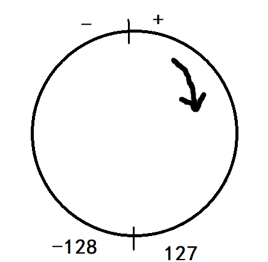

浮点转成整数，直接取消小数点,可能造成数据损失精度。
`int`强制转成`short`,砍掉2个字节,可能造成数据丢失。
特点:大的值给小的变量,需要强制转换,但是转换后的结果JVM不会保证还是正确的,因为这是程序员自己的个人行为.
##### <2>.引用数据类型强转
例如
```java
//编译通过,运行后也不报错
//因为引用o本来指向的就是Student对象
Object o = new Student();
Student s = (Student)o;

//编译通过,运行后报错
//因为o本来指向的时候Teacher对象
//而Teacher类型对象和Student类型没有任何关系
Object o = new Teacher();
Student s = (Student)o;
```
#### (3).`ASCII`编码表
```java
package com.lele.test;

public class Test {
	public static void main(String[] args) {

		// 字符类型变量
		char c = 'a';
		int i = 1;
		// 字符类型和int类型计算
		System.out.println(c + i);// 输出结果是98
	}
}
```
在计算机的内部都是二进制的0、1数据，为了让计算机可以直接识别人类的文字，就产生出了编码表的概念。
编码表 ：就是将人类的文字和一个十进制数进行对应起来组成一张表格。

| 字符 | 数值 |
| :--: | :--: |
|  0   |  48  |
|  9   |  57  |
|  A   |  65  |
|  Z   |  90  |
|  a   |  97  |
|  z   | 122  |
在`char`类型和`int`类型计算的过程中，`char`类型的字符先查询编码表，得到97，再和1求和，结果为98。`char`类型提升为了`int`类型。`char`类型内存2个字节，`int`类型内存4个字节。
### 2.运算符
#### (1)算数运算符

| 运算符 |          表示含义          |
| :----: | :------------------------: |
|  `+`   |  加法运算和字符串连接运算  |
|  `-`   |            减法            |
|  `*`   |            乘法            |
|  `/`   |            除法            |
|  `%`   | 取模运算，两个数字相除取余 |
|  `++`  |          自增运算          |
|  `--`  |          自减运算          |
以上运算，整数做运算，永远得到的是整数
##### <1>`+`运算
数据类型值相加或字符串连接
数据类型值相加
```java
int    a=1+2;   //a值为3;
double b=1+2;   //b值为3.0;
double b=1+2.0; //c值为3.0;
```
字符串连接
`"a"+"b" = "ab";`
```java
System.out.println(1+2+"a");  //输出3a
System.out.println(1+2.0+"a");//输出3.0a
System.out.println(1+2.0+"a"+true);//输出3.0atrue
System.out.println("a"+1+2); //输出a12
System.out.println(1+"a"+2); //输出1a2
```
##### <2>`/`和`%`运算
**`/`运算**
如果运算符两边都是整数，`/`是取整运算，得到的也是整数;
如果运算符有一边是小数，`/`得到的也是小数。
**`%`运算**
如果运算符两边都是整数，`%`是取模运算，得到的也是整数;
如果运算符有一边是小数，`%`是正常除法，得到的也是小数。
##### <3>`++/--`运算
做独立运算时，直接加一或者减一
例如:`++i,i++,--i,i--`
```java
package com.lele.test;

public class Test {
	public static void main(String[] args) {
		//前自增
		//使用之前先把自身的值加一，再参与后面的运算
		int a = 1;
		int b = ++a;
		System.out.println(a);// 计算结果是2
		System.out.println(b);// 计算结果是2
		//后自增
		//先参与运算，结束后，再把自己的值加一
		int c = 0;
		int d = c++;
		System.out.println(c);// 计算结果是1
		System.out.println(d);// 计算结果是0
		//前自减
		//使用之前先把自身的值减一，再参与后面的运算
		int i = 2;
		int j = --i;
		System.out.println(i);// 计算结果是1
		System.out.println(j);// 计算结果是1
		//后自减
		//先参与运算，结束后，再把自己的值减一
		int k = 2;
		int m = k--;
		System.out.println(k);// 计算结果是1
		System.out.println(m);// 计算结果是2


	}
}
```
#### (2)赋值运算符

| 运算符 | 表示含义 |
| :----: | :------: |
|  `=`   | 赋值等于 |
|  `+=`  |  加等于  |
|  `-=`  |  减等于  |
|  `*=`  |  乘等于  |
|  `/=`  |  除等于  |
|  `%=`  |  取模等  |

赋值运算符，就是将符号右边的值，赋给左边的变量。

```java
package com.lele.test;

public class Test {
	public static void main(String[] args) {
		int i = 5;
		i += 5;
		// 计算方式 i=i+5 变量i先加5，再赋值变量i
		System.out.println(i); // 输出结果是10

	}
}
```
#### (3)比较运算符

|    运算符    |                           表达含义                           |
| :----------: | :----------------------------------------------------------: |
|     `==`     |          比较符号两边数据是否相等,相等结果是`true`           |
|     `<`      | 比较符号左边的数据是否小于右边的数据,如果小于，结果是`true`  |
|     `>`      |  比较符号左边的数据是否大于右边的数据，如果大于结果是`true`  |
|     `<=`     | 比较符号左边的数据是否小于或者等于右边的数据，如果大于结果是`false` |
|     `>=`     | 比较符号左边的数据是否大于或者等于右边的数据，如果小于结果是`false` |
|     `!=`     |     不等于符号 ，如果符号两边的数据不相等，结果是`true`      |
| `instanceof` |     判断一个引用类型变量所指向的对象是不是属于某个类型。     |

比较运算符，是两个数据之间进行比较的运算，运算结果都是布尔值`true`或者`false`
除`instanceof`外，以上操作符只适用于整数类型和浮点数类型；

```java
package com.lele.test;

public class Test {
	public static void main(String[] args) {
		System.out.println(1 == 1);// true
		System.out.println(1 < 2);// true
		System.out.println(3 > 4);// false
		System.out.println(3 <= 4);// true
		System.out.println(3 >= 4);// false
		System.out.println(3 != 4);// true

	}
}
```
`instanceof`最终判断的是s所指向对象的类型是不是属于某类型,而不是判断变量s的类型是不是属于某个类型.
```java
Student s = new Student();
System.out.println(s instanceof Object);//true
System.out.println(s instanceof Student);//true
//编译报错,因为Student类型和String没有任何子父类关系
System.out.println(s instanceof String);
```
`Object o = new Student();`
变量o的类型是`Object`,但是o指向的对象类是`Studnet`.可以这样写的原因是因为`Object`是`Studnet`的父类.这是java的高级特性"多态"的一种表现方式。
#### (4)位运算符
| 运算符 |                  表达含义                  |
| :----: | :----------------------------------------: |
|  `&`   |               与运算,全1为1                |
|  `|`   |               或运算,有1则1                |
|  `^`   |         异或运算,相同为0，不同为1          |
|  `~`   |           按位取反运算,正好相反            |
|  `>>`  |  算术右移位运算，也称做带符号右移位运算。  |
|  `<<`  |  算术左移位运算，也称为带符号左移位运算。  |
| `>>>`  | 逻辑右移位运算，也称为不带符号右移位运算。 |
注:java没有无符号左移位运算!!!

**`&` 与运算**
`1&1->1, 1&0->0, 0&1->0, 0&0->0;`

**`|` 或运算**
`1|1->1, 1|0->1, 0|1->1, 0|0->0;`

**`^` 异或运算**
`1^1->0, 0^0->0，1^0->1, 0^1->1;`
相同为0 不同为1
运算特点:`a^0=a; a^a=0;`

**`~` 取反运算**
`~1->0, ~0->1;`

**`>>`右移运算**
正数取反加1得到其对应的负数,负数取反加1得到其对应的正数
总结右移计算法则
正数右移计算:写成二进制形式---->右移对应位数---->4位前面补0--->转为10进制得到结果
负数右移计算:把题目负数对应的正数写成二进制形式--->取反二进制--->再加1得到当前负数的二进制形式--->右移对应位数--->4位前面补1--->再次取反二进制--->加1--->转为十进制--->取负数，就是对应结果
```java
int a1 = 12 >> 1;  //6;

0000 1100    //把12写成二进制形式
-----------
0000 110    >>1  //右移1位
-----------
0000 0110    //补位  因为是正数所以补0  结果为6

int a2 = 128 >> 2;   //32;
int a3 = 129 >> 2;   //32;

计算:int a5 = -12 >> 1;   //-6;
0000 1100    //把12写成二进制形式
---------
1111 0011    //取反
---------
1111 0100    +1  //这个就是-12的二进制形式
----------
1111 010    >>1   //右移1位

1111 1010    //补位 因为是负数所以补1  这个负数就是最终结果
---------
0000 0101    //再次取反
---------
0000 0110    +1 //结果为6 所以上面的最终结果是 -6


计算:int a6 = -12 >> 2;//-3;
0000 1100     //把12写成二进制形式
---------
1111 0011     //取反
---------
1111 0100     +1  //这个就是-12的二进制形式
----------
  1111 01     >>2
----------
1111 1101     //补位 因为是负数所以补1  这个负数就是最终结果
---------
0000 0010     //取反
---------
0000 0011     +1 //结果为3 所以上面的最终结果是 -3
```
**`<<`左移运算**
总结左移计算法则
正数:舍弃对应二进制数的开头一位，在二进制数的末尾添加一个0;
负数:舍弃对应二进制数的开头两位，在二进制数的末尾添加两个0;
```java
int a1 = 12  << 1;//24;
int a2 = -12 << 2;//-48;
int a3 = 128 << 2;//512;
int a4 = 129 << 2;//516;
```
**`>>>` 无符号右移**
总结无符号右移计算法则:
正数:舍弃二进制数的最后一位，在二进制数的开头添加一个0;
负数:舍弃二进制数的最后两位，在二进制数的开头添加两个0;
```java
int a1 = 12 >>> 1;//6;
int a2 = -12 >>> 2;//1073741821;
```
#### (5)逻辑运算符
|   运算符   |                           表达含义                           |
| :--------: | :----------------------------------------------------------: |
| `&&`短路与 | 两边都是`true`,结果才是`true`.左边为`false`，右边直接跳过，不执行表达式 |
| `||`短路或 | 一边为`true`,结果就为`true`,左边为`true`，右边直接跳过，不执行表达式 |
|  `!`取反   |           `true`取反为`false`,`false`取反为`true`            |

短路操作符，如果能根据操作左边的布尔表达式就能推算出整个表达式的布尔值，将不执行操作符右边的布尔表达式；

短路与`&&`左边的布尔表达式的值为false, 整个表达式值肯定为false, 此时会忽略执行右边的布尔表达式。

短路或`||`左边的布尔表达式的值为true, 整个表达式值肯定为true, 此时会忽略执行右边的布尔表达式。
#### (6)三目运算符
运算符格式:`数据类型 变量名 = 布尔类型表达式？结果1：结果2`
**计算法则**
布尔类型表达式结果是true，三元运算符整体结果为结果1.
布尔类型表达式结果是false，三元运算符整体结果为结果2.
例如:
`100 > 30 ? m : n` 翻译为:100大于30吗？大于就是m,小于就是n.
## (六).流程控制语句
### 1.流程控制语句`if`
满足`if`语句的条件，语句中的代码才会被执行
不管是`if`、`else if`还是`else`,只要其后面执行的代码"只有一句",那么就可以把大括号去掉,执行效果也是一样的。
例如:
```java
public void test(int x) {
	if (x > 10)
		System.out.println("参数大于10");
	else if (x > 5)
		System.out.println("参数大于5");
	else if (x > 0)
		System.out.println("参数大于0");
	else
		System.out.println("参数小于等于0");
}
```
#### (1)`if`语句
`if`语句是判断语句
格式:
```java
if(关系表达式){
	语句体
}
```
**执行流程**
首先判断关系表达式为true还是false
true就执行语句体，false就跳过不执行
#### (2)`if-else`语句
格式:
```java
if(关系表达式){
	语句体1
}else{
	语句体2
}
```
**执行流程**
首先判断关系表达式看其结果是true还是false
如果是true就执行语句体1,如果是false就执行语句体2
#### (3)`if-else if-else`语句
格式
```java
if(关系表达式1){
	语句体1
}else if(关系表达式1){
	语句体2
}
	...
}else if(关系表达式n){
	语句体n
}else{
	语句体n+1
}
```
**执行流程**
首先判断关系表达式1看其结果是true还是false
如果是true就执行语句体1
如果是false就继续判断关系表达式2看其结果是true还是false
如果是true就执行语句体2
如果是false就继续判断关系表达式…看其结果是true还是false
...
如果没有任何关系表达式为true，就执行语句体n+1。
#### (4)`if`语句举例
```java
package com.lele.test;

public class someWays {
	/*
	 * 写一个方法实现分时问侯, 如是8点至12点，返回"上午好",
	*12点至14点 返回"中午好",14点至18点，返回"下午好", 其它时间返回"晚上好"。
	 * 注：方法中使用return可以把数据返回给方法的调用者
	 */
	public String sayHello(int hour) {
		String msg;
		if (hour >= 8 && hour < 12)
			msg = "上午好";
		else if (hour >= 12 && hour < 14)
			msg = "中午好";
		else if (hour >= 14 && hour < 18)
			msg = "下午好";
		else
			msg = "晚上好";

		return msg;
	}

	/*
	 * 写一个方法判断某一年是否为闰年
	 * 标准:能被4整除,但不能被100整除;或者能被400整除
	 */
	public boolean isLeapYear(int year) {
		// 返回true表示是闰年,false表示不是闰年
		if ((year % 4 == 0 && year % 100 != 0) || (year % 400 == 0))
			return true;
		else
			return false;
	}

}
```
`if`语句是可以和三目运算符互换使用的。
```java
package com.lele.test;

public class someWays {

	public void max(int a, int b) {
		// 定义变量，保存a和b的较大值
		int max;
		if (a > b)
			max = a;
		else
			max = b;

		//上述几行可以用三目运算符来代替，效果一样
		max = a > b ? a : b;

	}

}
```
### 2.流程控制语句`switch`
`switch`是选择语句
使用`switch`语句完成的功能,使用`if`语句同样也能完成。但是使用`if`语句完成的功能,使用`switch`语句却不一定能完成。不过在某些特定的情况下,`switch`还是有着自己的独特之处。
**语法格式**
```java
public void select() {
	switch (表达式) {
        case 常量值1:
            语句体1;
            break;
        case 常量值2:
            语句体2;
            break;
        ...
        default:
            语句体 n+1;
            break;
	}
}
```
**执行流程**
首先计算出表达式的值,其次，和`case`依次比较，一旦有对应的值，就会执行相应的语句，在执行的过程中，遇到`break`就会结束。
最后，如果所有的case都和表达式的值不匹配，就会执行default语句体部分，然后程序结束掉。
注:`switch`只能接收`byte, short, char`或者`int`类型的变量,如果是JKD1.7那么也可以接收`String`类型的变量
**`case`的穿透性**
在`switch`语句中，如果`case`的后面不写`break`，将出现穿透现象，也就是不会在判断下一个`case`的值，直接向后运行，直到遇到`break`，或者整体`switch`结束。
举例
```java
package com.lele.test;

public class someWays {

	public static void select(int i) {
		switch (i) {
		case 0:
			System.out.println("执行case0");
			break;
		case 5:
			System.out.println("执行case5");
		case 10:
			System.out.println("执行case10");
		default:
			System.out.println("执行default");
		}

	}

	public static void main(String[] args) {
		//调用静态方法，并传入5
		select(5);
	}
	//执行case5后，由于没有break语句，程序会一直向后走，不会再判断case，直接运行完整体switch。

	/*
	 * 执行结果:
	 * 执行case5
	 * 执行case10
	 * 执行default
	 */
}
```
### 3.循环`for`
`for`循环语句一般用在循环次数事先可确定的情况下
语法格式
```java
for(初始化表达式①; 布尔表达式②; 步进表达式④){
	循环体③        
}
```
**执行流程**
执行顺序：①②③④>②③④>②③④…②不满足为止。
①负责完成循环变量初始化
②负责判断是否满足循环条件，不满足则跳出循环
③具体执行的语句
④循环后，循环条件所涉及变量的变化情况
举例
```java
package com.lele.test;

public class someWays {

	/*
	 * 使用循环，计算1-100之间的偶数和
	 */
	public static void Loop(int i) {
		// 用来接收累加的和
		int sum = 0;
		// 从0开始递增，到和i相等时结束，每次加一
		for (int j = 0; j <= i; j++) {
			// 判断偶数，与2取模。余数为0就是偶数
			if (j % 2 == 0)
				// 把每次的数字加起来
				sum += j;
		}
		// 把得到的结果打印出来
		System.out.println(sum);

	}

	public static void main(String[] args) {
		// 调用静态方法，并传入100
		Loop(100);
	}
	//结果:2550
}
```
### 4.循环`while`
如果不知道循环次数，就使用`while`循环
语法格式
```java
初始化表达式①
while(布尔表达式②){
	循环体③
	步进表达式④
}
```
**执行流程**
执行顺序：①②③④>②③④>②③④…②不满足为止。
①负责完成循环变量初始化。
②负责判断是否满足循环条件，不满足则跳出循环。
③具体执行的语句。
④循环后，循环变量的变化情况。
举例
```java
package com.lele.test;

public class someWays {

	/*
	 * 使用while循环，计算1-100之间的偶数和
	 */
	public static void Loop(int i) {
		// 用来接收累加的和
		int sum = 0;
		// 从0开始递增，到和i相等时结束，每次加一
		int j = 0;
		while (j <= i) {
			sum += j;
			j++;
		}
		// 把得到的结果打印出来
		System.out.println(sum);

	}

	public static void main(String[] args) {
		// 调用静态方法，并传入100
		Loop(100);
	}
	// 结果:5050
}
```
### 5.循环`do...while`
和while非常类似，只不过先执行循环体，然后再判断循环条件.即使条件不满足，也会先执行一次循环体
语法格式:
```java
初始化表达式①
do{
	循环体③
	步进表达式④
}while(布尔表达式②);
```
**执行流程**
执行顺序：①③④>②③④>②③④…②不满足为止。
①负责完成循环变量初始化。
②负责判断是否满足循环条件，不满足则跳出循环。
③具体执行的语句
④循环后，循环变量的变化情况
`do...while`循环的特点：
无条件执行一次循环体，即使我们将循环条件直接写成false，也依然会循环一次。这样的
循环具有一定的风险性，因此初学者不建议使用`do...while`循环。
```java
package com.lele.test;

public class someWays {

	/*
	 * 使用do...while循环，计算1-100之间的偶数和
	 */
	public static void Loop(int i) {
		// 用来接收累加的和
		int sum = 0;
		// 从0开始递增，到和i相等时结束，每次加一
		int j = 0;
		do {
			sum+=j;
			j++;
		} while (j<=i);
		// 把得到的结果打印出来
		System.out.println(sum);

	}

	public static void main(String[] args) {
		// 调用静态方法，并传入100
		Loop(100);
	}
	// 结果:5050
}
```
### 6.循环嵌套
所谓嵌套循环:是指一个循环的循环体是另一个循环。比如for循环里面还有一个for循环，就是嵌套循环。`总共的循环次数=外循环次数*内循环次数`
#### (1)语法格式
```java
for(初始化表达式①; 循环条件②; 步进表达式⑦) {
	for(初始化表达式③; 循环条件④; 步进表达式⑥) {
		执行语句⑤;   
	}
}
```
#### (2)嵌套循环执行流程
执行顺序：①②③④⑤⑥>④⑤⑥>⑦②③④⑤⑥>④⑤⑥
外循环一次，内循环多次。
比如跳绳：一共跳5组，每组跳10个。5组就是外循环，10个就是内循环。
```java
package com.lele.test;

public class someWays {

	/*
	 * 用*打印下面的图形
	 注:print()是不换行打印,println()是换行打印
	     *
	 	 *  *
	 	 *  *  *
	 	 *  *  *  *
	 	 *  *  *  *  *
	 	 *  *  *  *  *  *
	 	 *  *  *  *  *  *  *
	 */
	public static void Loop(int n) {
		//外层循环控制行数
		for(int i=1;i<=n;i++) {
			//内层循环控制每行打印几个*
			for(int j=1;j<=i;j++) {
				//不换行打印*
				System.out.print(" * ");
			}
			//每次打印完一行，换行！
			System.out.println();
		}

	}

	public static void main(String[] args) {
		// 调用静态方法，并传入需要打印*的行数
		Loop(7);
	}

}
```
类似的练习还有乘法口诀表，三角阵，矩阵等
#### (3)`label`标签
`label`标签可以在嵌套循环的时候，指定`break`和`continue`要跳出的循环是具体的哪一层。否则，默认跳出的就是当前`break`和`continue`代码所处位置的循环。
举例
```java
package com.lele.test;

public class someWays {

	/*
	 * 从1到9循环，打印下面的数字三角阵
			1
			22
			333
			4444
			55555
			666666
			7777777
			88888888
			999999999
			在i=3时跳出外层循环
	 */
	public static void Loop(int n) {

		// 从1开始循环打印，直到n停止
		//外层循环标签loop1
		loop1: for (int i = 1; i <= n; i++) {
			//内层循环标签loop2
			loop2: for (int j = 1; j <= i; j++) {
				//使用标签跳出外层循环
				if (i == 3)
					break loop1;
				//每次打印i的值
				System.out.print(i);
			}
			//打印一个换行
			System.out.println();

		}

	}

	public static void main(String[] args) {
		// 调用静态方法，并传入需要打印的次数
		Loop(9);
	}

	/*
	 * 打印结果:
		1
		22
	 */

}
```
### 7.跳出语句
`break`、`continue`和`return`
#### (1)`break`
作用:终止`switch`语句或者循环
举例
```java
package com.lele.test;

public class someWays {

	/*
	 * 从1到n循环，遇到4，就跳出
	 */
	public static void Loop(int n) {

		//从1开始循环打印，直到n停止
		for(int i = 1;i<=n;i++) {
			//打印到4，跳出循环
			if(i==4)
				break;
			//打印i的值
			System.out.println(i);
		}

	}

	public static void main(String[] args) {
		// 调用静态方法，并传入需要打印的次数
		Loop(10);
	}

	/*
	 * 打印结果:
	 * 1
	 * 2
	 * 3
	 */

}
```
#### (2)`continue`
作用:结束本次循环，继续下一次循环
举例
```java
package com.lele.test;

public class someWays {

	/*
	 * 从1到n循环，只打印奇数
	 */
	public static void Loop(int n) {

		// 从1开始循环打印，直到n停止
		for (int i = 1; i <= n; i++) {
			// 如果是偶数，就跳出循环
			if (i % 2 == 0)
				continue;
			// 打印i的值
			System.out.println(i);
		}

	}

	public static void main(String[] args) {
		// 调用静态方法，并传入需要打印的次数
		Loop(10);
	}

	/*
	 * 打印结果:
	 *  1
	 *  3
	 *  5
	 *  7
	 *  9
	 */

}
```
#### (3)`return`返回
作用:用来返回值。并不是专门作用于循环的，结束的是一个方法体。不管处于多少层循环中，遇到`return`,直接结束方法，循环更不在话下！`return;`可以不跟返回值，直接跟个`;`使用
`return`如果写在某一块代码的中间，后面的代码会全部报错，因为程序执行到`return`已经结束了，后面的代码根本执行不到，一般的编辑器会直接报错！
```java
package com.lele.test;

public class someWays {

	/*
	 * 从1到n循环，遇到2就结束整个方法
	 */
	public static void Loop(int n) {

		// 从1开始循环打印，直到n停止
		for (int i = 1; i <= n; i++) {
			// 如果是偶数，就结束方法
			if (i % 2 == 0)
				return;
			// 打印i的值
			System.out.println(i);
		}

	}

	public static void main(String[] args) {
		// 调用静态方法，并传入需要打印的次数
		Loop(10);
	}

	/*
	 * 打印结果:
	 *  1
	 */

}
```
## (七).数组
### 1.数组的定义和访问
数组是一组数据的集合，数组中的每个数据被称为元素。
在java中,数组也是对象。数组中的元素可以是任意类型(基本类型和引用类型),但同一个数组里只能存放类型相同的元素。

数组类型的变量、类类型的变量、接口类型的变量都属于引用类型的变量,这些变量都是可以指向其相应的对象的,那么数组类型的变量指向的就是数组对象。

之前我们接触到的第一个数组类型变量,应该就是main方法的参数
```java
public static void main(String[] args){

}
```
其中`String[]`就是一个数组类型,`args`就是这个数组类型的变量,它所指向的数组对象中只能存放`String`类型的数据。
注:`main`方法是由`JVM`负责调用,那么`args`所指向的数组对象也是由`JVM`负责创建并传过来.
#### (1)数组定义
数组有定长特性,长度一旦指定,不可更改。
8种基本数据类型和3种引用类型,都可以声明出数组类型,使用什么类型的数组，数组中就只能存放什么类型的数据
定义格式:
`数组存储的数据类型[] 数组名 = new 数组存储的数据类型[长度];`
`数据类型[] 数组名 = new 数据类型[]{元素1,元素2,元素3...};`
`数据类型[] 数组名 = {元素1,元素2,元素3...};`
数组类型的变量将来是要指向对象的。
举例:
```java
int[] arr = new int[3];
int[] arr = new int[]{1,2,3,4,5};
int[] arr = {1,2,3,4,5};
```
#### (2)数组的访问
每一个存储到数组的元素，都会自动的拥有一个编号，从0开始，这个自动编号称为数组的索引(通常也说下标)，通过数组的索引，可以访问到数组中的元素.
格式:`数组名[索引]`
##### <1>数组的长度属性
获取方法:`数组名.length`
数组的最大索引值为`数组名.length-1`,最小索引为0，不能是负数
每个数组都具有长度,而且是固定的,Java中赋予了数组的一个属性，可以获取到数组的长度,属性`length`的执行结果是数组的长度，`int`类型结果。
##### <2>索引访问数组中的元素
`数组名[索引]=数值` 为数组中的元素赋值
`变量=数组名[索引]` 获取出数组中的元素
```java
package com.lele.test;

public class Arrays {

	public static void way() {
		// new一个数组对象
		int[] arr = new int[5];

		// 获取数组的长度
		int length = arr.length;
		System.out.println("length = " + length);

		// 给数组元素赋值
		arr[0] = 2;
		arr[1] = 90;
		arr[2] = 54;

		// 根据索引访问数组元素
		int i = arr[1];
		System.out.println(i);
		// 直接获取索引为0位置的元素
		System.out.println(arr[0]);

	}

	public static void main(String[] args) {
		// 调用静态方法
		way();

	}

	/*
	 * 打印结果:
	 * length = 5
	 * 90
	 * 2
	 */

}
```
##### <3>数组元素的默认值
数组对象中的默认值和其要保存的数据类型有关
当我们创建一个数组对象`int[3] arr = new int[3];`时，数组4个元素已经有了默认值了
整型数组的默认值是	    0
浮点型数组的默认值是	0.0
布尔类型数组的默认值是	false
字符类型数组的默认值是	0
引用类型数组的默认值是	null
### 2.数组内存原理图
#### (1)JVM虚拟机的内存划分
|  区域名称  |                          作用                           |
| :--------: | :-----------------------------------------------------: |
|   寄存器   |                  给CPU使用，跟开发无关                  |
| 本地方法栈 |       JVM在使用操作系统功能的时候使用，跟开发无关       |
|   方法区   |                 存储可以运行的class文件                 |
|   堆内存   |         存储对象或者数组,new出来的，都存在这里          |
|   方法栈   | 方法运行时使用的内存,比如main方法运行，进入方法栈中执行 |
#### (2)数组在内存中的存储
数组对象也是java中的一种对象,但是和之前使用类创建出的对象还是一定区别的。
数组对象也存放在内存中的堆区,并且数组对象在堆区中是一块连续的内存空间,这其中的每一小块空间都可以存放我们要保存的一个数据(元素)。那么数组的长度指的其实也就是这个东西。
注:数组对象其实就是堆区中的一块连续的内存空间
```java
public static void main(String[] args) {
	int[] arr =  new int[3];
	System.out.println(arr);
}
//运行结果:[I@15db9742
```
`arr`保存的是数组的地址，如果加上索引，就能拿到数组的元素
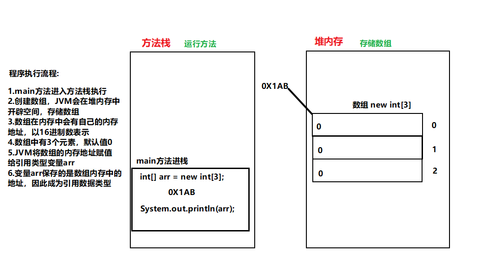

### 3.数组常见操作
#### (1)数组中出现的异常
##### <1>数组下标越界异常
`ArrayIndexOutOfBoundsException`
数组下标范围`[0,Arrayname.length-1]`,当超出这个范围，小于0或者大于`length-1`时都会报错
```java
package com.lele.test;

public class Arrays {

	public static void way() {
		// new一个数组对象
		int[] arr = new int[3];

		// 给数组元素赋值
		arr[0] = 2;
		arr[1] = 90;
		arr[2] = 54;

		// 根据索引访问数组元素
		int i = arr[3];  //越界异常
		int i = arr[-1]; //越界异常
	}

	public static void main(String[] args) {
		// 调用静态方法
		way();
	}
}
```
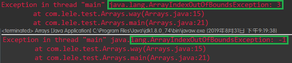

##### <2>空指针异常
`NullPointerException`
如果数组尚未初始化，或者赋`null`给数组，再根据索引取元素，就会报空指针异常。
```java
package com.lele.test;

public class Arrays {

	public static void way() {
		// new一个数组对象
		int[] arr = new int[3];

		// 给数组元素赋值
		arr[0] = 2;
		arr[1] = 90;
		arr[2] = 54;

		// 根据索引访问数组元素
		arr = null;   //把null给了数组
		int i = arr[0];  //空指针异常

        //未初始化数组，直接使用
        int[] a = null;    //未初始化
        int len = a.length;//对象调用length,空指针异常
	}

	public static void main(String[] args) {
		// 调用静态方法
		way();
	}
}
```
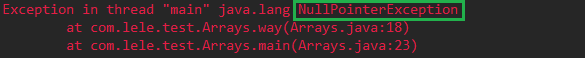

#### (2)数组的遍历
##### <1>循环遍历
使用循环，通过数组索引，遍历出数组元素，任意循环都可以，一般使用for循环
举例
```java
package com.lele.test;

public class Arrays {

	public static void way() {
		// new一个数组对象
		int[] arr = new int[3];

		// 给数组元素赋值
		arr[0] = 2;
		arr[1] = 90;
		arr[2] = 54;

		//for循环遍历数组
		for (int i = 0; i <= arr.length - 1; i++) {
			//根据索引取出数组元素，\t制表符
			System.out.print(arr[i] + "\t");
		}
	}

	public static void main(String[] args) {
		// 调用静态方法
		way();
	}
}
```
##### <2>使用`Arrays.toString()`方法
该方法在`java.util.Arrays;`包内,需要`import`导包,方法:`Arrays.toString()`
举例
```java
package com.lele.test;

public class Arrays {

	public static void way() {
		// new一个数组对象
		int[] arr = new int[3];

		// 给数组元素赋值
		arr[0] = 2;
		arr[1] = 90;
		arr[2] = 54;

		//使用Arrays.toString()方法
		System.out.println(java.util.Arrays.toString(arr));
	}

	public static void main(String[] args) {
		// 调用静态方法
		way();
	}
}
```
#### (3)数组排序
##### <1>`sort()`方法排序
`sort()`方法在`java.util.Arrays;`包下
举例
```java
package com.lele.test;

//导入包
import java.util.Arrays;

public class sort {

	public static void way() {
		// new一个数组对象
		int[] arr = { 190, 2, 45, 6867, 2478, 12, 32, 11, 78, 3 };

		// 使用Arrays.toString()方法遍历数组
		System.out.println("before sort : "+Arrays.toString(arr));

		//使用Arrays.sort()方法，对数组排序
		Arrays.sort(arr);

		System.out.println("after  sort : "+Arrays.toString(arr));

	}

	public static void main(String[] args) {
		// 调用静态方法
		way();
	}

	/*
		before sort : [190, 2, 45, 6867, 2478, 12, 32, 11, 78, 3]
		after  sort : [2, 3, 11, 12, 32, 45, 78, 190, 2478, 6867]
	 */
}
```
##### <2>冒泡、插入、选择排序法
排序法动态演示网址:http://www.webhek.com/post/comparison-sort.html
```java
package com.lele.sort;

import java.util.Arrays;

public class ThreeSort {

	// 选择排序法
	public void selectSort(int[] arr) {
		for (int i = 0; i < arr.length - 1; i++) {
			// 确定最小元素的下标
			int min = i;
			for (int j = i + 1; j < arr.length; j++) {
				// 找最小元素的下标
				// 从小到大排列，用大于，从大到小用小于
				if (arr[min] > arr[j])
					// 将最小元素的下标传给index
					min = j;
			}
			// 最小元素的下标和i不相等，就把位置交换，保证最小元素的下标一直是min
			if (min != i) {
				int temp = arr[i];
				arr[i] = arr[min];
				arr[min] = temp;
			}
		}
		System.out.println("排序后的数组为：" + Arrays.toString(arr));
	}

	// 冒泡法排序
	// 每一趟都要从头开始检查
	public void BubbleSort(int[] arr) {
		for (int i = 0; i < arr.length - 1; i++) {

			for (int j = 0; j < arr.length - 1; j++) {

				/**
				 * 前面的元素大于后面的元素，就交换位置。
				 * 交换位置的步骤：先把前面的(大的元素)给temp,把后面的（小的元素）放到前面，再把temp放到后面
				 * 从小到大排序用大于，从大到小排序用小于
				 */
				if (arr[j] > arr[j + 1]) {
					int temp = arr[j];
					arr[j] = arr[j + 1];
					arr[j + 1] = temp;
				}

			}
		}
		System.out.println("排序后的数组为：" + Arrays.toString(arr));
	}

	// 插入排序法
	public void insertSort(int[] arr) {
		for (int i = 1; i < arr.length; i++) {

			// 把第一个元素暂存，当做要往前插入的元素

			int temp = arr[i];
			// 保存起要插入元素的下标
			int insert = i;
			// 插入的元素总是在被插入元素的后面
			for (int j = i - 1; j >= 0; j--) {
				/**
				 * 插入元素与被插入前的元素作比较 小于是从小到大排列，大于是从大到小排列
				 */
				if (temp < arr[j]) {
					// 如果插入的元素小，就把插入位置的元素往后放，同时插入元素的下标减一
					arr[j + 1] = arr[j];

					insert--;
				}
			}

			// 把之前其余元素移动后，的空位补上
			arr[insert] = temp;

		}
		System.out.println("排序后的数组为：" + Arrays.toString(arr));
	}

	public static void main(String[] args) {
		int[] arr = { 15, 5, 1, 4, 7, 3, 9, 133, 32, 54 };

		System.out.println("排序前的数组为：" + Arrays.toString(arr));

		ThreeSort sort = new ThreeSort();
		//选择排序法
//		sort.selectSort(arr);

		System.out.println("--------------------");

		//冒泡排序法
//		sort.BubbleSort(arr);

		System.out.println("--------------------");

		//插入排序法
		sort.insertSort(arr);
	}
}
```
##### <3>元素位置交换
###### 1>使用第三方变量交换
```java
package com.lele.test;

public class Exchange {

	public static void way() {
		//需要交换的两个数
		int a = 1;
		int b = 2;

		//暂存中间变量
		int temp;

		System.out.println(a + " : " + b);

		temp = a;
		a = b;
		b = temp;
		System.out.println(a + " : " + b);

	}

	public static void main(String[] args) {
		// 调用静态方法
		way();
	}

}
```
###### 2>使用运算符交换(不借助任何其他变量)
```java
package com.lele.test;

public class Exchange {

	public static void way(int i, int j) {
		// 交换之前的两个数
		System.out.println("Exchange before : " + i + " , " + j);

		// 使用异或方式交换
		i = i ^ j;
		j = i ^ j;
		i = i ^ j;
		System.out.println("Exchange way1 : " + i + " , " + j);

		// 使用加减，先加后减
		i = i + j;
		j = i - j;
		i = i - j;
		System.out.println("Exchange way2 : " + i + " , " + j);

		// 使用加减，先减后加
		i = i - j;
		j = i + j;
		i = j - i;
		System.out.println("Exchange way3 : " + i + " , " + j);

		// 使用乘除，先乘后除
		i = i * j;
		j = i / j;
		i = i / j;
		System.out.println("Exchange way4 : " + i + " , " + j);

		// 使用乘除，先除后乘,必须i>j
		//可能会出现除数为0的情况，所以先判断谁大，这种情况，有时会出错，因为/是取整
		if (i > j) {
			i = i / j;
			j = i * j;
			i = j / i;
		} else {
			j = j / i;
			i = j * i;
			j = i / j;
		}
		System.out.println("Exchange way5 : " + i + " , " + j);
	}

	public static void main(String[] args) {
		// 调用静态方法,传入需要交换的两个数
		way(15,46);
	}

}
```
#### (4)数组对象的拷贝
数组长度一旦确定，不能更改，只能拷贝！
##### <1>`System.arraycopy()`方法
`System.arraycopy()`方法,可以拷贝数组，位于`java.lang;`
`System.arraycopy(src, srcPos, dest, destPos, length);`方法,解释为:从arr数组里索引为srcPos的元素开始，复制到数组dest里索引为destPos位置，复制length个元素.
```java
package com.lele.test;
//导入包
import java.util.Arrays;

public class Exchange {

	public static void way() {
		int[] arr = { 1, 2, 3, 4, 5 };
		//复制之前打印
		System.out.println("copy before : " + Arrays.toString(arr));
		//复制数组
		System.arraycopy(arr, 3, arr, 2, 2);
		//复制之后打印
		System.out.println("copy after  : " + Arrays.toString(arr));

	}

	public static void main(String[] args) {
		// 调用静态方法
		way();
	}

	/*
		copy before : [1, 2, 3, 4, 5]
		copy after  : [1, 2, 4, 5, 5]
	 */
}
```
##### <2>`Arrays.copyOf()`方法
位于`java.util.Arrays;`包下的`Arrays.copyOf()`方法，可以复制或者截取数组。
`Arrays.copyOf(original, newLength)`解释为:把original数组截取/复制newLength长度，返回一个新的数组。具体是复制还是截取，由newLength决定，小于原数组的长度，就是截取，大于原数组的长度，就是复制。
举例
```java
package com.lele.test;
//导入包
import java.util.Arrays;

public class Exchange {

	public static void way() {
		int[] arr = { 1, 2, 3, 4, 5 };
		//复制之前打印
		System.out.println("copy before : " + Arrays.toString(arr));
		//复制数组
		int[] b = Arrays.copyOf(arr, 8);
		//复制之后打印
		System.out.println("copy after  : " + Arrays.toString(b));

		//截取数组
		arr = Arrays.copyOf(arr, 3);
		//截取之后打印
		System.out.println("interception after : " + Arrays.toString(arr));

	}

	public static void main(String[] args) {
		// 调用静态方法
		way();
	}

	/*
		copy before : [1, 2, 3, 4, 5]
		copy after  : [1, 2, 3, 4, 5, 0, 0, 0]
		interception after : [1, 2, 3]
	 */
}
```
##### 3>`copyOfRange`方法
将数组中指定范围的元素复制到新数组并返回
用法:`Arrays.copyOfRange(original, from, to)` 复制数组`original`从`from`开始，到`to`结束，包括`from`，不包括`to`.
举例
```java
package com.lele.test;

import java.util.Arrays;

public class ways {

	public static void way(int[] arr) {
		//原数组打印
		System.out.println("copy before : "+Arrays.toString(arr));

		// 复制数组arr，从6开始，到6结束，返回数组b
		int[] b = Arrays.copyOfRange(arr, 3, 6);

		// 打印复制的数组
		System.out.println("copy after  : "+Arrays.toString(b));
	}

	public static void main(String[] args) {
		// 声明一个数组对象
		int[] arr = { 3, 1, 2, 0, 9, 6, 7 };
		// 调用静态方法,传入一个数组
		way(arr);
	}

	/*
		copy before : [3, 1, 2, 0, 9, 6, 7]
		copy after  : [0, 9, 6]
	 */
}
```
#### (5)数组使用的其它例子
##### <1>求平均值
数据的总数就是数组的长度,`arr.length`拿到
```java
package com.lele.test;

public class Example {

	// 求平均值的方法
	public static double getAvg(int[] a) {
		// 存放数据总和
		double sum = 0;

		// 遍历数组中的每个元素
		for (int i = 0; i < a.length; i++) {
			// 把每个元素累加起来
			sum += a[i];
		}
		// 返回平均值
		return sum / a.length;
	}

	public static void main(String[] args) {
		// 声明一个数组对象
		int[] arr = { 3, 1, 2, 0, 9, 6, 7 };
		// 调用静态方法,传入一个数组,并接收返回到的平均值
		double avg = getAvg(arr);

		// 把平均值打印出来
		System.out.println(avg);
	}

	/*结果:
	 * 4.0
	 */

}
```
##### <2>求最大值
```java
package com.lele.test;

public class Example {

	// 求最大值的方法
	public static int getMax(int[] a) {
		// 假设第一个元素最大，最大值存放在max中
		int max = a[0];
		// 遍历数组，把每一个元素都拿出来
		for (int i = 1; i < a.length; i++) {
			// 每个元素作比较，保证最大的一直是max
			if (a[i] > max) {
				max = a[i];
			}
		}
		// 返回最大值
		return max;
	}

	public static void main(String[] args) {
		// 声明一个数组对象
		int[] arr = { 3, 1, 2, 0, 9, 6, 7 };
		// 调用静态方法,传入一个数组,并接收返回到的最大值
		int max = getMax(arr);
		// 把最大值打印出来
		System.out.println(max);
	}

	/*
	 * 结果:
	 	9
	 */

}
```
##### <3>从众多手机号码中抽取一个获奖手机号码
```java
package com.lele.test;

public class Example {

	/*
	 * Math.random()是获取随机数的方法，获取到的随机数是[0,1)之间的double类型的数据
	 *
	 * 这种方法是随机了数组的索引，根据索引拿到数组的元素
	 */

	// 求中奖号码的方法
	public static String getTel(String[] str) {
		// 使用随机数，生成数组的索引，强转为int类型，并保存在index中
		int index = (int) (Math.random() * str.length);
		// 返回索引是index的数组元素
		return str[index];
	}

	public static void main(String[] args) {
		// 声明一个数组对象,并填写进去需要抽取的电话号码
		String[] arr = { "13516991877", "18965442356", "15689784565", "12346557988", "18956773214" };
		// 调用静态方法,传入一个电话号码数组,并接收抽中的电话号码
		String tel = getTel(arr);
		// 把中奖号码打印出来
		System.out.println("中奖号码为 : " + tel);
	}
}
```
##### <4>产生四位长度的验证码
验证码内容为大小写字母或数字组成
```java
package com.lele.test;

public class Example {

	/*
	 * 验证码是由大小写字母，数字组成的4个字符
	 *
	 * Math.random()是获取随机数的方法，获取到的随机数是[0,1)之间的double类型的数据
	 *
	 * 这种方法是随机了数组的索引，根据索引拿到数组的元素
	 */

	// 获取随机验证码的方法
	public static String getValidateCode() {
		// 定义一个由大小写字母，数字组成的字符串
		String s = "abcdefghijklmnopqrstuvwxyzABCDEFGHIJKLMNOPQRSTUVWXYZ0123456789";
		// 把字符串转成char类型的数组
		char[] c = s.toCharArray();
		// 获取到0到c.length的随机数，作为数组的索引，4位验证码，得到4个索引
		int index1 = (int) (Math.random() * c.length);
		int index2 = (int) (Math.random() * c.length);
		int index3 = (int) (Math.random() * c.length);
		int index4 = (int) (Math.random() * c.length);

		// 根据索引拿到数组元素，转成字符串返回
		return "" + c[index1] + c[index2] + c[index3] + c[index4];
	}

	public static void main(String[] args) {
		// 调用静态方法,接收获取到的验证码
		String code = getValidateCode();
		// 把验证码打印出来
		System.out.println("验证码   " + code);
	}
}
```
### 4.`Arrays`数组工具类
由于数组对象本身并没有什么方法可以供我们调用,但`API`中提供了一个工具类`Arrays`供我们使用,从而可以对数据对象进行一些基本的操作.
#### <1>`Arrays`类的导入
`Arrays`类位于`java.util;`包下，要使用`Arrays`类里的方法，就必须要导入包
导包方法:`import java.util.Arrays;`
如果只使用一次，也可以`java.util.Arrays.方法`直接使用
举例
```java
package com.lele.test;

//导包Arrays类
import java.util.Arrays;

public class Exchange {

	public static void way() {
		int[] arr = { 1, 2, 3, 4, 5 };
        //已经导包直接使用
		// 复制之前打印
		System.out.println("copy before : " + Arrays.toString(arr));

		// 截取数组
		arr = Arrays.copyOf(arr, 3);
		// 截取之后打印
        //不导包使用，但是很繁琐
		System.out.println("interception after : " + java.util.Arrays.toString(arr));
	}

	public static void main(String[] args) {
		// 调用静态方法
		way();
	}

	/*
	 * copy before : [1, 2, 3, 4, 5]
	 * interception after : [1, 2, 3]
	 */
}
```
#### <2>`Arrays`类中常用的方法
`Arrays`类中的方法都是`static`修饰的静态方法,在使用的时候可以直接使用`类名.方法`进行调用,而"不需要"使用对象来调用(使用对象调用就比较麻烦，也可以使用对象来调用，对于静态方法一般不这么使用)
##### 1>`toString()`方法
该类中重写了`toString()`方法，可以把数组转换为字符串形式并返回,可以遍历数组中的元素，前面遍历数组已经提到，用法简单，不再做介绍
##### 2>`binarySearch`方法
在数组中查找指定元素并返回其索引(下标).
本方法使用二分搜索法来搜索指定的数组，以获得指定的值。所以必须在进行此调用之前对数组进行排序(通过`sort`方法等)。如果没有对数组进行排序，则结果是不确定的。如果数组包含多个带有指定值的元素，则无法保证找到的是哪一个
用法:`Arrays.binarySearch(a, key)` 从a数组中查找元素key，返回元素的索引，返回值类型是`int`
```java
package com.lele.test;

import java.util.Arrays;

public class ways {

	public static void way(int[] arr) {
		//排序之前打印
		System.out.println("sort before : "+Arrays.toString(arr));

		//对数组排序
		Arrays.sort(arr);

		//排序之后打印
		System.out.println("sort after  : "+Arrays.toString(arr));

		// 查找元素6，并返回索引index
		int index = Arrays.binarySearch(arr, 6);

		// 查找完打印索引值
		System.out.println("key : " + index);
	}

	public static void main(String[] args) {
		// 声明一个数组对象
		int[] arr = { 3, 1, 2, 0, 9, 6, 7 };
		// 调用静态方法,传入一个数组
		way(arr);
	}

	/*
		sort before : [3, 1, 2, 0, 9, 6, 7]
		sort after  : [0, 1, 2, 3, 6, 7, 9]
		key : 4
	 */
}
```
##### 3>`copyOf`方法
复制或者截取数组，前面已经讲到
##### 4>`copyOfRange`方法
将数组中指定范围的元素复制到新数组并返回，前面已经讲到
##### 5>`equals()`方法
比较俩个数组元素是否相等，必须元素一样，顺序一样，才是相等的.
用法:`Arrays.equals(a, a2)`,比较数组a和a2是否相等，相等返回true，不想等返回false.
举例
```java
package com.lele.test;

import java.util.Arrays;

public class ways {

	public static void way(int[] arr) {
		//arr数组打印
		System.out.println("arr : "+Arrays.toString(arr));

		// 新数组b，打乱原数组arr中的元素顺序
		int[] b = {1, 2, 0, 3, 7, 6, 9};

		//新数组c，跟arr元素顺序完全一样
		int[] c = { 3, 1, 2, 0, 9, 6, 7 };


		// 判断arr和b是否相等
		System.out.println(Arrays.equals(arr, b));

		// 判断arr和c是否相等
		System.out.println(Arrays.equals(arr, c));

		//==比较
		System.out.println(arr==c);
		//==比较的是两个引用所指向对象的内存地址
	}

	public static void main(String[] args) {
		// 声明一个数组对象
		int[] arr = { 3, 1, 2, 0, 9, 6, 7 };
		// 调用静态方法,传入一个数组
		way(arr);
	}

	/*
		arr : [3, 1, 2, 0, 9, 6, 7]
		false
		true
		false
	 */
}
```
##### 6>`fill()`方法
用指定元素填充数组对象
用法:`Arrays.fill(a, val);`用`val`填充数组`a`,`m`每个元素都是`val`
举例
```java
package com.lele.test;

import java.util.Arrays;

public class ways {

	public static void way(int[] arr) {
		// arr数组打印
		System.out.println("fill before : " + Arrays.toString(arr));

		//用999填充数组arr
		Arrays.fill(arr, 999);

		//打印填充后的arr数组
		System.out.println("fill before : " + Arrays.toString(arr));

	}

	public static void main(String[] args) {
		// 声明一个数组对象
		int[] arr = { 3, 1, 2, 0, 9, 6, 7 };
		// 调用静态方法,传入一个数组
		way(arr);
	}

	/*
		fill before : [3, 1, 2, 0, 9, 6, 7]
		fill before : [999, 999, 999, 999, 999, 999, 999]
	 */
}
```
##### 7>`sort()`方法
把数据中的元素进行排序.前面已经讲过
##### 8>`asList()`方法
数组转换为`List`集合,讲到集合后会提到.
### 5.二维数组
既然任何类型都可以声明为数组,那么给一维数组再加一个[]就得到了二维数组,类似的二维数组再加一个[]就得到三维数组。
#### (1)声明并创建二维数组
堆区有一块连续的内存空间,里面有3个元素位置，每个元素位置中都存放了一个一维数组，每个一维数组中都有4个元素位置，这个4个元素位置上的值都默认是0
`int[][] a = new int[3][4];`

堆区有一块连续的内存空间,里面有3个元素位置,每个元素位置上都只有默认值null,将来这3个位置上都是要存放一维数组的
`int[][] a = new int[3][];`

#### (2)给二维数组赋值
全部指定索引再赋值
```java
int[][] a = new int[3][4];
a[0][0] = 10;
a[0][1] = 10;
a[0][2] = 10;
a[0][3] = 10;

a[1][0] = 20;
a[1][1] = 20;
a[1][2] = 20;
a[1][3] = 20;

a[2][0] = 30;
a[2][1] = 30;
a[2][2] = 30;
a[2][3] = 30;
```
指定一维的索引，第二维不确定
```java
int[][] a = new int[3][];
a[0] = new int[1];
a[1] = new int[2];
a[2] = new int[3];

a[0][0] = 10;

a[1][0] = 20;
a[1][1] = 20;

a[2][0] = 30;
a[2][1] = 30;
a[2][2] = 30;
```
直接声明并初始化
```java
int[][] a = {
	{1},
	{1,2},
	{1,2,3}
};
```
new数组对象并初始化
```java
int[][] a4 = new int[][]{
		{1},{1,2},{1,2,3}
};
```
#### (3)二维数组遍历
使用for循环嵌套，完成二维数组的遍历
```java
package com.lele.test;

public class Example {

	public static void main(String[] args) {

		// 定义一个二维数组
		String[][] str = {
				{ "test" },
				{ "hello1", "hello2" },
				{ "world!", "world2", "world3" }
		};

		// 外层循环控制二维数组外层索引
		for(int i = 0;i<str.length;i++) {
			// 内层循环控制二位数组内层索引
			for(int j =0;j<str[i].length;j++) {
				//内外层相结合遍历每一位的元素
				System.out.println(str[i][j]);
			}
		}
	}

	/*
		test
		hello1
		hello2
		world!
		world2
		world3
	 */
}
```
### 6.可变参数
这个特性只有jdk1.5以上版本才可以使用
一般情况下，当我们定义了一个有参方法，例如

```java
public void way(int i){
	...
}
```
这里只能传入一个int类型的值作为参数，如果想要传入多个不同的参数，就要写很多的形参，可变参数解决了这个问题.
可变参数举例
只要传入的参数，满足形参的类型就可以
```java
package com.lele.test;

public class VariableParameter {

	// 一个含有可变参数的方法
	public static void varChange(int... i) {
		// This is a way.
	}

	public static void main(String[] args) {
		// new一个数组
		int[] arr = { 1, 2, 38, 9 };
		// 调用方法，传入参数，因为是静态方法，可以直接调用
		varChange(arr);
		varChange(1);
		varChange();
		varChange(1, 2, 90);

	}
}
```
可变参数的前面是可以加其他的参数的，但是可变参数的后面不可以再加其他的参数
举例
```java
package com.lele.test;

public class VariableParameter {

	// 一个含有可变参数的方法
	public static void varChange(String str, int... i) {
		// This is a way.
	}

	public static void main(String[] args) {
		// new一个数组
		int[] arr = { 1, 2, 38, 9 };
		// 新建一个String类型的变量
		String str = "";
		// 调用方法，传入参数，因为是静态方法，可以直接调用
		varChange(str, arr);
		varChange(str, 1);
		varChange(str);
		varChange(str, 1, 2, 90);

	}
}
```
在方法内部，可变参数的使用跟数组是一样的，在使用的时候当成数组就可以了
```java
package com.lele.test;

public class VariableParameter {

	// 一个含有可变参数的方法
	public static void varChange(int... i) {
		//打印可变参数的长度
		System.out.println("length = " + i.length);
		//循环遍历传入的参数
		for (int j = 0; j < i.length; j++) {
			//打印传入的参数
			System.out.println(i[j]);
		}
	}

	public static void main(String[] args) {
		// new一个数组
		int[] arr = { 1, 2, 38, 9 };
		// 调用方法，传入参数，因为是静态方法，可以直接调用
		varChange(arr);
		System.out.println("----------分隔每次调用--------------");
		varChange(1);
		System.out.println("----------分隔每次调用--------------");
		varChange();
		System.out.println("----------分隔每次调用--------------");
		varChange(1, 2, 90);

	}

	/*
		length = 4
		1
		2
		38
		9
		----------分隔每次调用--------------
		length = 1
		1
		----------分隔每次调用--------------
		length = 0
		----------分隔每次调用--------------
		length = 3
		1
		2
		90
	 */
}
```
### 7.格式化输出
只有在1.5以上的版本中才可以使用
`%`表示进行格式化输出，`%`后面的内容表示输出的格式
格式化输出语句只能是`System.out.printf(format,args);`,只能是用`printf()`输出，不能用`println`或者`print`,解释为，把args按照format格式输出.
#### (1)`%f`格式化输出浮点数
小数补0对齐,可设置长度和小数位数
```java
package com.lele.test;

public class FormattedOutput {

	// 一个可以格式化输出的方法
	public static void formattedOutput(double d, int i) {
		System.out.printf("%f", d);
		System.out.println();

		//输出7个长度，保留2位小数
		System.out.printf("%7.2f", d);
		System.out.println();
	}

	public static void main(String[] args) {
		// 定义两个数，一个double类型，一个int类型
		double d = 345.7954;
		int i = 4567;
		// 调用静态方法，并传入两个参数
		formattedOutput(d, i);
	}

	/*
	 * 结果:
		345.795400
		 345.80
	 */
}
```
#### (2)`+`表示输出的数带正负号
输出的正负号是原来数的正负号，不是加的字符串的正负号
```java
package com.lele.test;

public class FormattedOutput {

	// 一个可以格式化输出的方法
	public static void formattedOutput(double m, double n, int i) {
		//显示正负号输出
		System.out.printf("%+f", m);
		System.out.println();
		System.out.printf("%+f", n);
		System.out.println();

		// 输出7个长度，保留2位小数,同时显示正负号
		System.out.printf("%+7.2f", m);
		System.out.println();
		System.out.printf("%+9.4f", n);
		System.out.println();
	}

	public static void main(String[] args) {
		// 定义三个数，两个double类型，一个int类型
		double d = 345.7954;
		double d1 = -31.154;
		int i = 4567;
		// 调用静态方法，并传入两个参数
		formattedOutput(d, d1, i);
	}

	/*
	 * 结果:
		+345.795400
		-31.154000
		+345.80
		 -31.1540
	 */
}
```
#### (3)`-`表示输出的数左对齐
数据默认右对齐
`+-`表示输出的数带正负号且左对齐。
```java
package com.lele.test;

public class FormattedOutput {

	// 一个可以格式化输出的方法
	public static void formattedOutput(double m, double n, int i) {

		// 输出7个长度，保留2位小数,同时左对齐输出
		System.out.printf("%-7.2f", m);
		System.out.println();
		System.out.printf("%-9.4f", n);
		System.out.println();

		//输出正负号且左对齐输出
		System.out.printf("%+-7.2f", m);
		System.out.println();
	}

	public static void main(String[] args) {
		// 定义三个数，两个double类型，一个int类型
		double d = 345.7954;
		double d1 = -31.154;
		int i = 4567;
		// 调用静态方法，并传入两个参数
		formattedOutput(d, d1, i);
	}

	/*
	 * 结果:
		345.80
		-31.1540
		+345.80
	 */
}
```
#### (4)`d`表示输出十进制整数
```java
package com.lele.test;

public class FormattedOutput {

	// 一个可以格式化输出的方法
	public static void formattedOutput(double m, double n, int i) {

		//输出十进制整数
		System.out.printf("%d",i);
	}

	public static void main(String[] args) {
		// 定义三个数，两个double类型，一个int类型
		double d = 345.7954;
		double d1 = -31.154;
		int i = 4567;
		// 调用静态方法，并传入两个参数
		formattedOutput(d, d1, i);
	}

	/*
	 * 结果:
		4567
	 */
}
```
#### (5)`o`表示输出八进制整数
```java
package com.lele.test;

public class FormattedOutput {

	// 一个可以格式化输出的方法
	public static void formattedOutput(double m, double n, int i) {

		//输出十进制整数
		System.out.printf("%d",i);
		System.out.println();

		//输出八进制整数
		System.out.printf("%o",i);
		System.out.println();

	}

	public static void main(String[] args) {
		// 定义三个数，两个double类型，一个int类型
		double d = 345.7954;
		double d1 = -31.154;
		int i = 4567;
		// 调用静态方法，并传入两个参数
		formattedOutput(d, d1, i);
	}

	/*
	 * 结果:
		4567
		10727
	 */
}
```
#### (6)`x`表示输出十六进制整数
```java
package com.lele.test;

public class FormattedOutput {

	// 一个可以格式化输出的方法
	public static void formattedOutput(double m, double n, int i) {

		//输出十进制整数
		System.out.printf("%d",i);
		System.out.println();

		//输出八进制整数
		System.out.printf("%o",i);
		System.out.println();

		//输出十六进制整数
		System.out.printf("%x",i);
		System.out.println();
	}

	public static void main(String[] args) {
		// 定义三个数，两个double类型，一个int类型
		double d = 345.7954;
		double d1 = -31.154;
		int i = 4567;
		// 调用静态方法，并传入两个参数
		formattedOutput(d, d1, i);
	}

	/*
	 * 结果:
		4567
		10727
		11d7
	 */
}
```
#### (7)`#x`表示输出带有十六进制标志的整数
```java
package com.lele.test;

public class FormattedOutput {

	// 一个可以格式化输出的方法
	public static void formattedOutput(double m, double n, int i) {

		//输出十进制整数
		System.out.printf("%d",i);
		System.out.println();

		//输出八进制整数
		System.out.printf("%o",i);
		System.out.println();

		//输出十六进制整数
		System.out.printf("%x",i);
		System.out.println();

		//输出带有十六进制标志整数
		System.out.printf("%#x",i);
		System.out.println();

	}

	public static void main(String[] args) {
		// 定义三个数，两个double类型，一个int类型
		double d = 345.7954;
		double d1 = -31.154;
		int i = 4567;
		// 调用静态方法，并传入两个参数
		formattedOutput(d, d1, i);
	}

	/*
	 * 结果:
		4567
		10727
		11d7
		0x11d7
	 */
}
```
## (八).类与对象、封装、构造方法
面向对象的三大特性:封装、继承、多态
### 1.类和对象
Java的编程语言是面向对象的，采用这种语言进行编程称为面向对象编程(Object-Oriented Programming, OOP)。也叫`OOP`特性.
类是一种抽象的数据类型,它是对某一类事物整体描述/定义,但是并不能代表某一个具体的事物.
对象是抽象概念的具体实例.
对象和引用的关系:引用"指向"对象
使用类类型、数组类型、接口类型声明出的变量,都可以指向对象,这种变量就是引用类型变量,简称引用。

在程序中,创建出对象后,直接使用并不方便,所以一般会用一个引用类型的变量去接收这个对象,这个就是所说的引用指向对象.

总结:对象和引用的关系,就如电视机和遥控器,风筝和线的关系一样。
### 2.方法
方法一定是定义在类中的,属于类的成员。
#### (1)方法的定义和调用
##### <1>方法的定义
举例
```java
package com.lele.test;

public class Ways {

	// 无参无返回值法
	public void read() {

	}

	// 有参有返回值方法
	public int getAvg(int[] arr) {
		int sum = 0;
		for (int i = 0; i < arr.length; i++) {
			sum += arr[i];
		}
		return sum / arr.length;
	}

	public static void main(String[] args) {

	}

}
```
##### <2>方法的调用
在类中定义了方法,这个方法中的代码并不会执行,当这个方法被调用的时候,方法中的代码才会被一行一行顺序执行。
###### 1>非静态方法
没有使用`static`修饰符修饰的方法,就是非静态方法.
调用非静态方法`一定`要使用对象。因为非静态方法是属于对象的。(非静态属性也是一样的)
```java
package com.lele.test;

public class Ways {

	// 无参无返回值法
	public void read() {

	}

	// 有参有返回值方法
	public int getAvg(int[] arr) {
		int sum = 0;
		for (int i = 0; i < arr.length; i++) {
			sum += arr[i];
		}
		return sum / arr.length;
	}

	public static void main(String[] args) {
		// 创建类的对象
		Ways w = new Ways();
		// 对象调用方法
		w.read();

		int[] arr = { 1, 2, 3, 4, 5, 6, 7 };
		// 调用方法并接收返回值
		int avg = w.getAvg(arr);

	}

}
```
###### 2>静态方法
使用`static`修饰符修饰的方法,就是静态方法.
调用静态方法,`可以`使用对象调用,也`可以`使用类来调用,但是推荐使用类进行调用,因为静态方法是属于类的。(静态属性也一样)
```java
package com.lele.test;

public class Ways {

	// 无参无返回值法
	public void read() {

	}

	// 有参有返回值的静态方法
	public static int getAvg(int[] arr) {
		int sum = 0;
		for (int i = 0; i < arr.length; i++) {
			sum += arr[i];
		}
		return sum / arr.length;
	}

	public static void main(String[] args) {
		// 创建类的对象
		Ways w = new Ways();
		// 对象调用方法
		w.read();

		// 调用静态方法
		int[] arr = { 1, 2, 3, 4, 5, 6, 7 };
		// 同一个类中,直接写方法名
		int avg = getAvg(arr);

		// 不同类中，类名.方法调用
		int avg2 = Ways.getAvg(arr);

	}

}
```
###### 3>类中方法间的调用
非静态方法之间可以直接调用
静态方法之间可以直接调用
非静态方法直接调用静态方法
静态一定不能调用非静态
举例:
```java
package com.lele.test;

public class Ways {

	// 无参无返回值的静态方法
	public void read() {
		// 直接调用非静态方法
		write();
	}

	// 无参无返回值的静态方法
	public void write() {
		// 非静态方法直接调用静态方法
		num();

	}

	// 无返回值的静态方法
	public static void num() {

	}

	// 有参有返回值的静态方法
	public static int getAvg(int[] arr) {
		// 直接调用静态方法
		num();

		return 0;
	}

}
```
#### (2)值传递和引用传递
传给方法的参数叫实参，方法声明的参数，叫形参.
举例
```java
package com.lele.test;

public class Ways {

	// 无返回值的静态方法
	public static void num() {
		int[] b = { 2, 1, 5, 67, 56 };
		getAvg(b);

	}

	// 有参有返回值的静态方法
	public static int getAvg(int[] arr) {
		// 直接调用静态方法
		num();

		return 0;
	}

}
```
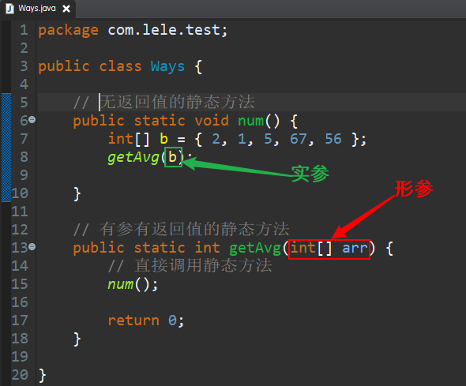
##### <1>值传递
如果参数的类型是基本数据类型,那么就是值传递。值传递是实参把自己变量本身存的简单数值赋值给形参.
```java
package com.lele.test;

public class Ways {

	// 无返回值的静态方法
	public static void addNum(int a) {

		a = 10;
	}

	public static void main(String[] args) {
		// 定义变量a
		int a = 1;
		// 调用方法之前打印
		System.out.println(a);
		// 把a的值传过去
		addNum(a);
		// 调用方法之后打印
		System.out.println(a);

	}

	/*
		结果:
		1
		1
		原来变量的值并不会变，传递过去的只是这个数字1，并不是变量a，只是形参和实参名字相等了而已
	 */

}
```
##### <2>引用传递
如果参数的类型是引用数据类型,那么就是引用传递。引用传递是实参把自己变量本身存的对象内存地址值赋值给形参.因为引用类型传递的是地址值，方法内通过形参改变了引用指向的对象，原来的实参也会改变，他们指向的是同一个对象
```java
package com.lele.test;

import java.util.Arrays;

public class Ways {

	// 无返回值的静态方法
	public static void exchange(int[] a) {
		a[4] = 4;
	}

	public static void main(String[] args) {
		// 定义数组变量a
		int[] arr = new int[5];
		//给索引为0的元素赋值
		arr[0] = 55;
		// 调用方法之前打印
		System.out.println(Arrays.toString(arr));
		// 把数组传过去
		exchange(arr);
		// 调用方法之后打印
		System.out.println(Arrays.toString(arr));

	}

	/*
		结果:
			[55, 0, 0, 0, 0]
			[55, 0, 0, 0, 4]
	 */

}
```
### 3.封装
将属性隐藏起来，若需要访问某个属性，提供公共方法对其访问。
封装原则:
1)隐藏代码的实现细节
2)统一用户的调用接口
3)提高系统的可维护性
#### (1)数据隐藏
在定义一个对象的特性的时候，有必要决定这些特性的可见性，即哪些特性对外部是可见的，哪些特性用于表示内部状态。
通常，应禁止直接访问一个对象中数据的实际表示，而应通过操作接口来访问，这称为信息隐藏。
关键字`private`,使用格式:`private 数据类型 变量名;`
`private`是权限修饰符，代表最小权限,被修饰的变量，只有在本类中才能访问，如果需要在外部访问，必须提供`get/set`方法,通过set方法赋值，get方法取值
举例:
```java
package com.lele.test;

public class Datahiding {
	// 两个属性，采用private修饰，隐藏数据
	private String name;
	private int age;

	// 提供get/set方法，方便外部访问
	public String getName() {
		return name;
	}

	public void setName(String name) {
		this.name = name;
	}

	public int getAge() {
		return age;
	}

	public void setAge(int age) {
		this.age = age;
	}

	public static void main(String[] args) {
		// 创建对象
		Datahiding data = new Datahiding();
		// 使用set方法给属性赋值
		data.setName("lele");
		data.setAge(22);
		// 使用get方法拿到属性的值
		String name = data.getName();
		int age = data.getAge();

	}
}
```
#### (2)`this`关键字
`this`代表所在类的当前对象的引用（地址值），即对象自己的引用。
方法被哪个对象调用，方法中的`this`就代表那个对象。即谁在调用，`this`就代表谁。
##### <1>区别成员变量和局部变量
在set方法中，this代表的就是当前类对象，`this.name`表示类中属性`name`
```java
public void setName(String name) {
		//形参name赋值给属性name
		this.name = name;
}
```
##### <2>调用类中的其他方法
方法间的调用都是直接调用，省略了关键字`this`，代表的是当前类对象，他们是同一个对象调用的。
```java
package com.lele.test;

public class Datahiding {
	// 两个属性，采用private修饰，隐藏数据
	private String name;
	private int age;

	// 提供get/set方法，方便外部访问

	//省略其他get/set方法
	public int getAge() {
		return age;
	}

	public void print() {
		//this调用方法
		this.getAge();
	}

}
```
##### <3>调用类中的其他构造器
`this`的这种用法,只能在构造器中使用.普通的方法种是不能用的.并且这局调用的代码只能出现在构造器中的第一句.
```java
package com.lele.test;

public class Datahiding {
	// 两个属性，采用private修饰，隐藏数据
	private String name;
	private int age;

	// 无参构造器
	public Datahiding() {
		// 调用有参构造器
		this("lele", 22); // 这句代码必须是第一句
		System.out.println("hello");
	}

	// 有参构造器
	public Datahiding(String name, int age) {
		this.name = name;
		this.age = age;
	}

	// 提供get/set方法，方便外部访问

	// 省略其他get/set方法
}
```
#### (3)构造方法
也叫构造器,类中的构造器也称为构造方法,是在进行创建对象的时候必须要调用的。并且构造器有以下俩个特点:
1)必须和类的名字相同
2)必须没有返回类型,也不能写void
定义格式:
```java
public [classname]([arguments]){
	//方法体
}
```
构造器的作用:
1)使用`new`创建对象的时候必须使用类的构造器
2)构造器中的代码执行后,可以给对象中的属性初始化赋值
构造器是可以重载的，既可以定义无参，也可以定义有参，无论你与否自定义构造方法，所有的类都有构造方法，因为Java自动提供了一个无参数构造方法，一旦自己定义了构造方法，Java自动提供的默认无参数构造方法就会失效。
#### (4)封装类
封装格式:
```java
package

import package;

public class classname{
	//隐藏属性
	private dataType var;

	//无参构造
	public classname(){}

	//有参构造
	public classname(dataType var){
		this.var = var;
	}

	//set方法
	public void setVar(dataType var){
		this.var = var;
	}

	//get方法
	public Type getVar(){
		return var;
	}

	//必要时，重写toString()方法
	@Override
	public String toString() {
		return "classname [var=" + var +  "]";
	}
}
```
举例:(一个标准的数据封装实例)
一个实体学生类，封装学生的姓名，年龄，班级和成绩，并用测试类测试。
```java
Student.java

package com.lele.test;

public class Student {
	// 私有属性
	private String name;
	private int age;
	private String clssname;
	private int score;

	// 无参构造
	public Student() {
	}

	// 有参构造
	public Student(String name, int age, String clssname, int score) {
		this.name = name;
		this.age = age;
		this.clssname = clssname;
		this.score = score;
	}

	// get/set方法
	public String getName() {
		return name;
	}

	public void setName(String name) {
		this.name = name;
	}

	public int getAge() {
		return age;
	}

	public void setAge(int age) {
		this.age = age;
	}

	public String getClssname() {
		return clssname;
	}

	public void setClssname(String clssname) {
		this.clssname = clssname;
	}

	public int getScore() {
		return score;
	}

	public void setScore(int score) {
		this.score = score;
	}

	// 重写toString()
	@Override
	public String toString() {
		return "Student [name=" + name + ", age=" + age + ", clssname=" + clssname + ", score=" + score + "]";
	}

}
```
测试类
```java
Test.java

package com.lele.test;

public class Test {
	public static void main(String[] args) {
		// 使用无参构造访问
		Student student1 = new Student();
		student1.setName("tom");
		student1.setAge(18);
		student1.setClssname("五班");
		student1.setScore(88);

		System.out.println(student1);

		// 使用有参构造访问
		Student student2 = new Student("jerry", 19, "五班", 99);
		System.out.println(student2);

		// 这里直接打印对象，打印出的不是内存地址，是因为重写了toString()方法
	}
	/*
	 * 打印结果:
		Student [name=tom, age=18, clssname=五班, score=88]
		Student [name=jerry, age=19, clssname=五班, score=99]
	 */
}
```
### 4.继承
继承是类和类之间的一种关系,被继承的类叫父类(基类),继承类叫子类(派生类),继承使用关键词`extends`表示
类和类之间的关系是单继承，一个子类只能“直接”继承一个父类，但是一个父类可以被多个子类继承.(好似你只能有一个爹，但是你可以有多个子女)
父类中的属性和方法可以被子类继承，父类的属性和方法，子类能不能直接使用，要看父类采用的是什么修饰符修饰的(你爸公开你就可以使用，你爸不同意，就无法使用).
父类中的构造器并不能被子类继承，但是子类构造器中隐式调用父类无参构造器，使用`super`关键字.
`Object`类是任意类的父类(相当于人类的祖宗),所以`Object`类中的方法，子类都可以使用.
举例:

```java
Person.java

package com.lele.test;

public class Person {
	// 私有属性
	private String name;
	private int age;
	private double height;
	private double weight;

	public Person() {
	}

	public Person(String name, int age, double height, double weight) {
		this.name = name;
		this.age = age;
		this.height = height;
		this.weight = weight;
	}

	// 一个方法
	public void cal(double height, double weight) {

	}

}

Student.java

package com.lele.test;

//student类继承Person类
public class Student extends Person {

	// 重写cal方法
	@Override
	public void cal(double height, double weight) {

	}

}
```
#### (1)方法重写
子类中出现与父类一模一样的方法时（返回值类型，方法名和参数列表都相同），会出现覆盖效果，也称为重写或者复写。声明不变，重新实现。
方法重写只存在于子类和父类(包括直接父类和间接父类)之间。静态方法、私有方法不能被子类重写
方法重写规则
1>方法名,参数列表必须相同
2>访问控制修饰符可以被扩大,但是不能被缩小
`public protected default private`
3>抛出异常类型的范围可以被缩小,但是不能被扩大
`ClassNotFoundException ---> Exception`
4>返回类型可以相同,也可以不同,如果不同的话,子类重写后的方法返回类型必须是父类方法返回类型的子类型,基本数据类型必须相同
注:一般情况下,重写的方法会和父类中的方法的声明完全保持一致,只有方法的实现不同。(也就是大括号中代码不一样)
重写的方法会有`@Override`注解，用来告诉编辑器，这是重写的方法
举例
```java
package com.lele.test;

public class Student {
	// 私有属性
	private String name;
	private int age;
	private String clssname;
	private int score;

	// 省略构造器

	// 省略get/set方法

	// 重写toString()
	@Override
	public String toString() {
		return "Student [name=" + name + ", age=" + age + ", clssname=" + clssname + ", score=" + score + "]";
	}

	// 重写hashCode()方法
	@Override
	public int hashCode() {
		final int prime = 31;
		int result = 1;
		result = prime * result + age;
		result = prime * result + ((clssname == null) ? 0 : clssname.hashCode());
		result = prime * result + ((name == null) ? 0 : name.hashCode());
		result = prime * result + score;
		return result;
	}

	// 重写equals()方法
	@Override
	public boolean equals(Object obj) {
		if (this == obj)
			return true;
		if (obj == null)
			return false;
		if (getClass() != obj.getClass())
			return false;
		Student other = (Student) obj;
		if (age != other.age)
			return false;
		if (clssname == null) {
			if (other.clssname != null)
				return false;
		} else if (!clssname.equals(other.clssname))
			return false;
		if (name == null) {
			if (other.name != null)
				return false;
		} else if (!name.equals(other.name))
			return false;
		if (score != other.score)
			return false;
		return true;
	}

}
```
#### (2)`super`关键字
子类继承父类之后,在子类中可以使用`this`来表示访问或调用子类中的属性或方法,使用`super`就表示访问或调用父类中的属性和方法
##### <1>访问父类中的属性
`super.name`
##### 2>调用父类中的方法
`super.方法名`
##### 3>调用父类中的构造器
`super()`
子类的构造器会隐式调用父类的无参构造器
不管是显式还是隐式的调用父类的构造器,`super()`语句一定要出现在子类构造器中第一行代码。`this()`也必须出现在构造器的第一行代码，所以`this`和super不能同时使用.
### 5.多态
#### (1)方法重载
类中有多个方法,有着相同的方法名,但是方法的参数各不相同,这种情况被称为方法的重载。
方法的重载可以提供方法调用的灵活性。
方法重载必须满足以下条件:
1)方法名相同
2)参数列表不同(参数的类型、个数、顺序的不同)
3)与修饰符和返回类型无关
`System.out.println();`就是典型的方法重载
重载的方法会有`@overload`注解，告诉编辑器，这是重载的方法
#### (2)多态
允许不同类的对象对同一消息做出响应。即同一消息可以根据发送对象的不同而采用多种不同的行为方式。大的引用，指向小的对象。
相同类型的不同对象,调用相同的方法,执行结果是不同的
1)一个对象的实际类型是确定的
例如: `new Student();` `new Person();`等
2)可以指向对象的引用的类型有很多
一个对象的实现类型虽然是确定的,但是这个对象所属的类型可能有很多种。
例如: `Student`继承了`Person`类
`Student s1 = new Student();`
`Person s2  = new Student();`
`Object s3  = new Student();`
因为`Person`和`Object`都是`Student`的父类型
注:一个对象的实际类型是确定,但是可以指向这个对象的引用的类型,却是可以是这对象实际类型的任意父类型。
3)一个父类引用可以指向它的任何一个子类对象
例如:
```java
Object o = new AnyClass();
Person p = null;
p = new Student();
p = new Teacher();
p = new Person();
```
4)多态中的方法调用
注:子类继承父类,调用a方法,如果a方法在子类中没有重写,那么就是调用的是子类继承父类的a方法,如果重写了,那么调用的就是重写之后的方法。
5)重写、重载和多态的关系
重载是编译时多态
调用重载的方法,在编译期间就要确定调用的方法是谁,如果不能确定则编译报错
重写是运行时多态
调用重写的方法,在运行期间才能确定这个方法到底是哪个对象中的。这个取决于调用方法的引用,在运行期间所指向的对象是谁,这个引用指向哪个对象那么调用的就是哪个对象中的方法。(java中的方法调用,是运行时动态和对象绑定的)
# 三、java高级语言特性
## (九).编程环境搭建
这一部分是java学习的转折点，到了这一部分，明显难度会有所提升，如果单纯的使用vim、sublime Text、notepad++这些工具编程，效率完全不够，加上代码的逻辑性提升，写的代码越来越多，这时就需要一款功能齐全的java项目开发工具辅助我们编程，这里以工具spring-tool-suite为例，后面简称STS，开发工具很多，功能大同小异，不做阐述。
### 1.安装并了解STS
eclipse ---- 免费
javase版    java项目
javaee版    java项目  web项目(javaee)
Spring相关框架
Spring官网 - STS(javaee版eclipse+Spring插件)
eclipse/STS  安装JDK1.8
STS实际上就是安装了Spring插件的eclipse.
安装STS之前必须先安装JDK，并配置环境变量，前面已经讲过。
官网下载STS安装包，解压缩到电脑指定位置双击`sts-bundle\sts-3.9.8.RELEASE\`下的`STS.exe`,安装完成.
### 2.配置STS的工作空间路径
首次运行STS会要求选择工作路径，这里我推荐大家使用非C盘以外的其他盘根目录，新建WorkSpace文件夹，作为工作路径，例如:`D:\WorkSpace\`,当然也可以使用其他路径，但是尽量避免出现中文字符，例如我的工作空间`D:\Documents\00_appWorkSpaces\workspace-sts-3.9.8.RELEASE`
### 3.配置STS
#### (1)设置JDK
注意是设置jdk的路径，不是jre的路径，我这里是Jdk1.8
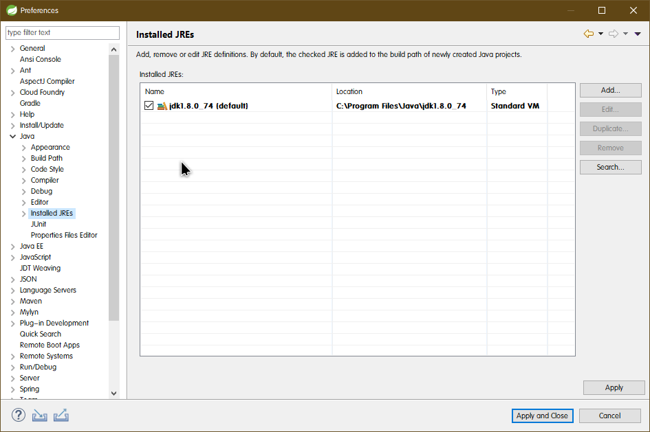
#### (2)设置compiler(编译等级)
注意需要和配置的jdk版本保持一致
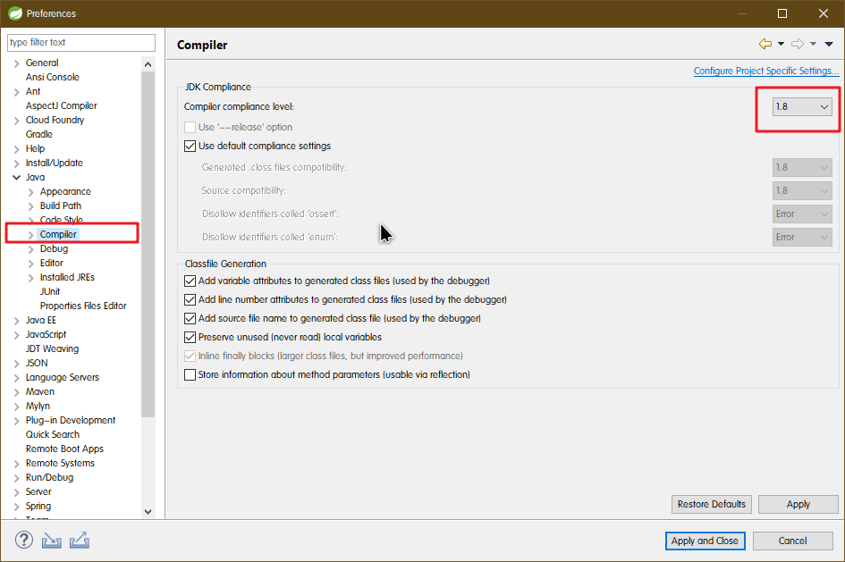
##### <3>设置工作空间的编码
`workspace`编码为`UTF-8`
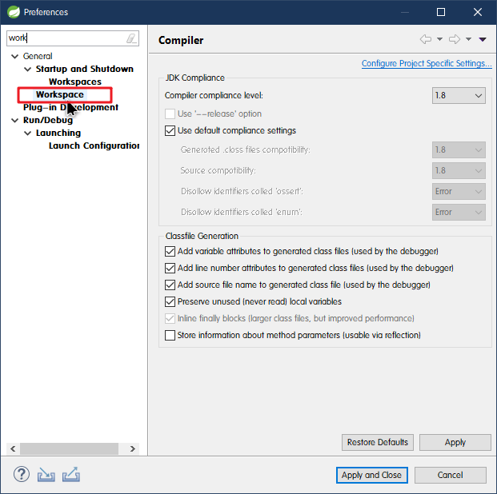
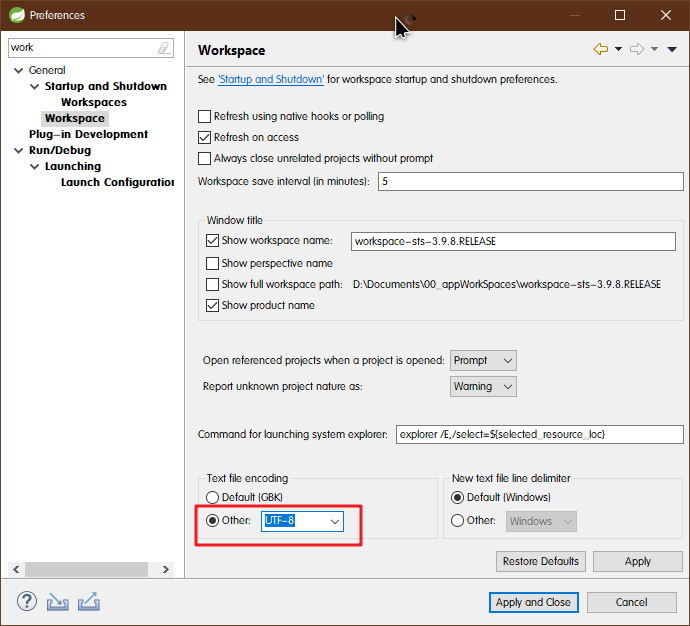
##### <4>设置字体大小等
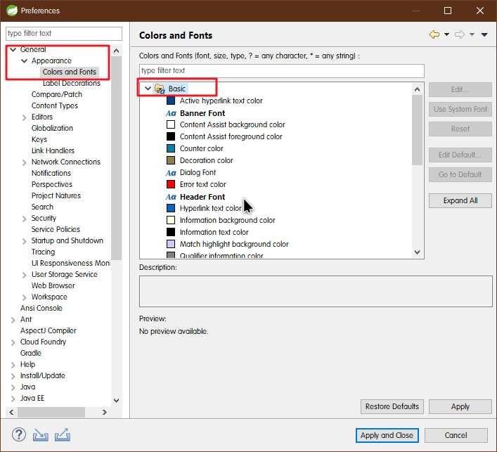
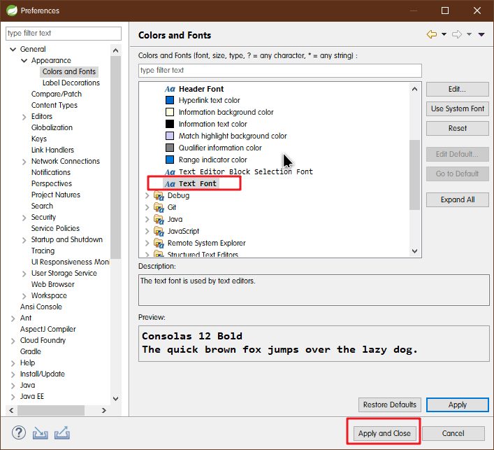
##### <5>修改背景色
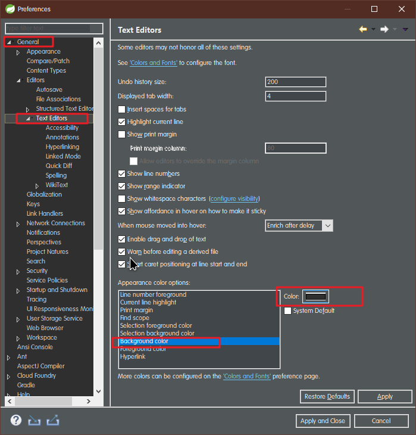
##### <6>修改自动提示
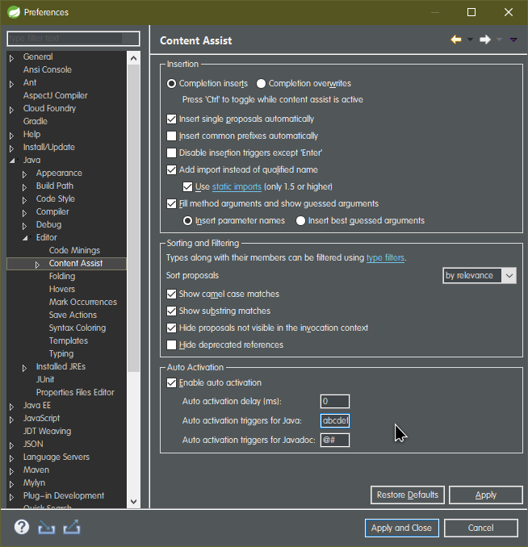
##### <7>修改主题
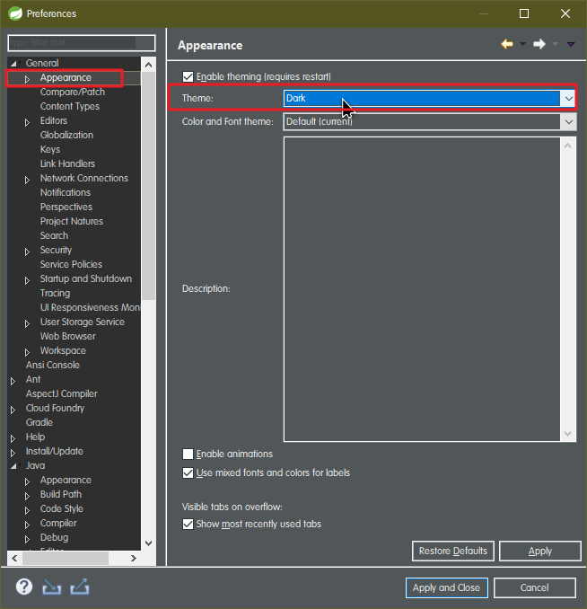
#### (2)STS操作快捷键
Ctrl+N  新建 ，搜索 package  class
双击最大化，还原选项卡或者快捷键Ctrl+M
alt + /  自动提示
Ctrl + z撤销
Ctrl + Y 还原
keys   修改快捷键
Ctrl + /  单行注释
Ctrl + shift + /  多行注释
Ctrl + shift + \ 取消多行注释
Alt + ↑或↓  移动当前选中代码到某一位置
Ctrl + Shift + o  自动import导包
Ctrl + M  当前窗口最大化/还原
Alt + ← / →  左右连续切换选项卡
Ctrl + Shift + T   搜索指定类型
Ctrl + D 删除选中行
Ctrl + Shift + 回车    快速建新空行并定位光标
## 2.`static`修饰符
### (1)`static`变量
在类中,使用`static`修饰的成员变量,就是静态变量,反之为非静态变量。

#### <1>静态变量和非静态变量的区别
静态变量是属于类的,"可以"使用类名来访问,非静态变量是属于对象的,"必须"使用对象来访问.
例如:

```java
//例如：
public class Student{

    private static int age;
    private double score;

    public static void main(String[] args) {

        Student s = new Student();

        //推荐使用类名访问静态成员
        System.out.println(Student.age);

        System.out.println(s.age);
        System.out.println(s.score);
    }
}
```

静态变量对于类而言在内存中只有一个,能被类的所有实例所共享。实例变量对于类的每个实例都有一份,它们之间互不影响.

```java
//例如：
public class Student{
    private static int count;
    private int num;

    public Student() {
        count++;
        num++;
    }

    public static void main(String[] args) {

        Student s1 = new Student();
        Student s2 = new Student();
        Student s3 = new Student();
        Student s4 = new Student();

        //因为还是在类中,所以可以直接访问私有属性
        System.out.println(s1.num);
        System.out.println(s2.num);
        System.out.println(s3.num);
        System.out.println(s4.num);

        System.out.println(Student.count);
        System.out.println(s1.count);
        System.out.println(s2.count);
        System.out.println(s3.count);
        System.out.println(s4.count);

    }
}
```

静态变量在加载类的过程中分配内存，实例变量在创建对象时分配内存，所以静态变量可以使用类名来直接访问,而不需要使用对象来访问.

##### <2>作用范围：
###### 	1>内部类
只能修饰内部类

###### 	2>属性
​		静态变量，被当前类的所有对象共享，跟随类加载，可以通过类名直接调用

###### 	3>方法
​		静态方法，跟随类加载，不能被重写，可以通过类名直接调用

##### <3>non-static
​		非静态属性，非静态方法

​		1>属于示例（对象），需要使用对象名来访问

​		2>对应这个类的每一个示例，都有自己单独的属性，和其他实例互不影响

##### <4>初始化时间：

​	1>静态属性，方法，在类加载到内存之后，就会立马进行初始化，初始化结束之后，就可以使用了，所以静态属性，方法，是可以直接使用类名来访问的，而不是创建对象来访问
​	2>非静态属性、方法，在new对象成功之后，就会立马进行初始化，初始化完成之后，就可以使用了，所以非静态的属性、方法，是一定需要先创建对象，让使用对象来访问的
​	3>静态属性、方法初始化时间比较早，加载之后就可以直接使用。（利用类名）
​	4>非静态属性、方法初始化时间比较晚，创建对象之后才可以使用（利用对象名）
​	5>静态方法不能被重写!

#### (2)`static`方法

​	在类中,使用`static`修饰的成员方法,就是静态方法,反之为非静态方法。

##### <1>静态方法和非静态方法的区别

​	1>静态方法数属于类的,"可以"使用类名来调用,非静态方法是属于对象的,"必须"使用对象来调用.

​	2>静态方法"不可以"直接访问类中的非静态变量和非静态方法,但是"可以"直接访问类中的静态变量和静态方法

​	注意:`this`和`super`在类中属于非静态的变量.(静态方法中不能使用)

```java
//例如：
public class Student{
	private static int count;
	private int num;
	public void run(){}
	public static void go(){}


	public static void test(){
		//编译通过
		System.out.println(count);
		go();

		//编译报错
		System.out.println(num);
		run();
	}
}
```

非静态方法"可以"直接访问类中的非静态变量和非静态方法,也"可以"直接访问类中的静态变量和静态方法

```java
//例如
public class Student{
	private static int count;
	private int num;
	public void run(){}
	public static void go(){}

	public void test(){
		//编译通过
		System.out.println(count);
		go();

		//编译通过
		System.out.println(num);
		run();
	}
}
```

父类的静态方法可以被子类继承,但是不能被子类重写

```java
//例如
public class Person {

	public static void method() {}

}

//编译报错
public class Student extends Person {

	public void method(){}

}

//例如:
public class Person {
	public static void test() {

		System.out.println("Person");
	}

}

//编译通过,但不是重写
public class Student extends Person {
	public static void test(){

	System.out.println("Student");

	}

}

main{
Perosn p = new Student();
p.test();//输出Person
p = new Person();
p.test();//输出Perosn
}

//和非静态方法重写后的效果不一样
```

父类的非静态方法不能被子类重写为静态方法

```java
//例如
public class Person {
	public void test() {
		System.out.println("Person");

	}

}

//编译报错
public class Student extends Person {
	public static void test(){
		System.out.println("Student");

	}

}
```

#### (3)静态代码块和匿名代码块
##### 	<1>实例
​		类中可以编写代码块和静态代码块

```java
//例如：
public class Person {
	{

        //代码块(匿名代码块)

	}

	static{
        //静态代码块
	}
}
```

##### <2>匿名代码块和静态代码块的执行

​	1>因为没有名字,在程序并不能主动调用这些代码块。
​	2>匿名代码块是在创建对象的时候自动执行的,并且在构造器执行之前。同时匿名代码块在每次创建对象的时候都会自动执行.
​	3>静态代码块是在类加载完成之后就自动执行,并且只执行一次!
​	注:每个类在第一次被使用的时候就会被加载,并且一般只会加载一次

```java
//例如:
public class Person {
	{
		System.out.println("匿名代码块");
	}
    static{
        System.out.println("静态代码块");
    }

    public Person(){
        System.out.println("构造器");
    }
}

main{
    Student s1 = new Student();
    Student s2 = new Student();
    Student s3 = new Student();
}

/*输出结果:
静态代码块
匿名代码块
构造器
匿名代码块
构造器
匿名代码块
构造器
*/
```

##### <3>作用
​	1>匿名代码块的作用是给对象的成员变量初始化赋值,但是因为构造器也能完成这项工作,所以匿名代码块使用的并不多。
​	2>静态代码块的作用是给类中的静态成员变量初始化赋值。

> 构造器：对类中非静态属性做初始化


例如:
```java
public class Person {
	public static String name;
	static{
		name = "tom";
	}
	public Person(){
		name = "zs";
	}
}

main{
	System.out.println(Person.name);//tom
}
//注:在构造器中给静态变量赋值,并不能保证能赋值成功,因为构造器是在创建对象的时候才指向,但是静态变量可以不创建对象而直接使用类名来访问.
```

##### <4>创建和初始化对象的过程

> 1. `java com.lele.test.class`
> 2. 在代码中，第一次使用到这个类，这个代码会进行类加载
> 在JVM运行期间，一个类只会被加载一次，静态代码块也只会被调用一次。
> 确定类的唯一性：类加载器+包名+类名

​	`Student s = new Student();`

###### 	1>Student类之前没有进行类加载

​		①类加载,同时默认初始化类中静态的属性
​		②执行静态代码块
​		③分配内存空间,同时初始化非静态的属性(赋默认值,0/false/null)
​		④调用Student的父类构造器
​		⑤对Student中的属性进行显示赋值(如果有的话)
​		⑥执行匿名代码块
​		⑦执行构造器
​		⑧返回内存地址

注:子类中非静态属性的显示赋值是在父类构造器执行完之后,和子类中的匿名代码块执行之前的时候

例如:
```java
public class Person{
	private String name = "zs";

	public Person() {
		System.out.println("Person构造器");
		print();
	}

	public void print(){
		System.out.println("Person  print方法: name = "+name);
	}

}

public class Student extends Person{
	private String name = "tom";

	{
		System.out.println("Student匿名代码块");
	}

	static{
		System.out.println("Student静态代码块");
	}

    public Student(){
		System.out.println("Student构造器");
	}

    public void print(){
		System.out.println("student print方法: name = "+name);
	}

    public static void main(String[] args) {
		new Student();
	}
}

/*输出结果:
Student静态代码块
Person构造器
student print方法: name = null
Student匿名代码块
Student构造器
*/
```

​	`Student s = new Student();`

###### 	2>Student类之前已经进行了类加载

​		①分配内存空间,同时初始化非静态的属性(赋默认值,0/false/null)
​		②调用Student的父类构造器
​		③对Student中的属性进行显示赋值(如果有的话)
​		④执行匿名代码块
​		⑤执行构造器
​		⑥返回内存地址

## 3.静态导入`import`
静态导入是JDK5.0引入的新特性。
例如:

```java
import static java.lang.Math.random;   //静态导入随机数
import static java.lang.Math.PI;       //静态导入圆周率


public class Test {
	public static void main(String[] args) {
	//之前是需要Math.random()调用的，导入之后，直接写random()
		System.out.println(random());
		System.out.println(PI);
	}
}
```
## 4.`final`修饰符
### (1)属性
关键词

### (2)作用范围
#### <1>修饰类

用`final`修饰的类不能被继承,没有子类。

例如:
我们是无法写一个类去继承`String`类,然后对`String`类型扩展的,因为API中已经把`String`类定义为`final`的了.
我们也可以定义`final`修饰的类:

```java
public final class Action{

}

//编译报错,`final`修饰的类不能被继承
public class Go extends Action{

}
```

#### <2>修饰方法

用`final`修饰的方法可以被继承,但是不能被子类重写。

例如:每个类都是`Object`类的子类,继承了`Object`中的众多方法,在子类中可以重写`toString`方法、`equals`方法等,但是不能重写`getClass`方法`wait`方法等,因为这些方法都是使用`fianl`修饰的。

我们也可以定义`final`修饰的方法:
```java
public class Person{
	public final void print(){}
}

//编译报错,用`final`修饰的方法可以被继承,但是不能被子类重写。
public class Student extends Person{
	public void print(){

	}
}
```

##### <3>修饰变量

用`final`修饰的变量表示常量,因为只能被赋一次值.

###### 1>修饰局部变量

例如:

```java
public class Person{
	public void print(final int a){
		//编译报错,不能再次赋值,传参的时候已经赋过了
		a = 1;
	}
}

public class Person{
	public void print(){
		final int a;
		a = 1;
		//编译报错,不能再次赋值
		a = 2;
	}
}
```
###### 2>修饰成员变量

①非静态成员变量

```java
public class Person{
	private final int a;
}
```
只有一次机会,可以给此变量a赋值的位置:声明的同时赋值、匿名代码块中赋值、构造器中赋值(此时,类中出现的所有构造器都要写)

②静态成员变量

```java
public class Person{
	private static final int a;
}
```
只有一次机会,可以给此变量a赋值的位置:声明的同时赋值、静态代码块中赋值

###### 3>修饰引用变量

```java
main{
	final Student s = new Student();
	//编译通过
	s.setName("tom");
	s.setName("zs");

	//编译报错,不能修改引用s指向的内存地址
	s = new Student();
}
```

## 5.`abstract`修饰符

abstract修饰符可以用来修饰方法也可以修饰类,如果修饰方法,那么该方法就是抽象方法;如果修饰类,那么该类就是抽象类。

### (1)属性

关键字

### (2)作用范围

#### <1>抽象类

​	抽象类，使用`abstract`修饰的类，就是抽象类,不能实例

​	子类隐式调用父类构造器。

###### 抽象类和普通类

​	①抽象类需要使用需要使用`abstract`修饰，但是普通类不需要
​	②抽象类可以编写抽象方法，但是普通类中不能有抽象方法
​	③抽象类不能使用`new`直接创建对象，但是普通类可以使用`new`直接创建对象

让子类去继承抽象类，然后实现抽象类中的抽象方法，如果少一个抽象方法没有实现，那么这个子类就必须也声明成抽象类。

#### <2>抽象方法

​	抽象方法，只有方法的声明，没有方法的实现，需要使用关键字`abstract`修饰

###### 抽象方法和普通方法

​	①抽象方法没有方法的实现，但是普通方法有实现
​	②抽象方法需要使用abstract修饰，但是普通方法不需要
​	③抽象方法不能是static，普通方法可以

类和类之间的继承，单继承

#### (3)语法

```java
public abstract class Action{
	public abstract void doSomething();
}
```
`public void doSomething(){...}`
对于这个普通方法来讲:
"public void doSomething()"这部分是方法的声明
"{...}"这部分是方法的实现,如果大括号中什么都没写,就叫方法的空实现

声明类的同时,加上`abstract`修饰符就是抽象类
声明方法的时候,加上`abstract`修饰符,并且去掉方法的{},同时结尾加上分号,该方法就是抽象方法。

#### (4)抽象类和抽象方法的关系

​		抽象类中可以没有抽象方法,但是有抽象方法的类一定要声明为抽象类。

#### (5)特点及作用

抽象类,不能使用new关键在来创建对象,它是用来让子类继承的。
抽象方法,只有方法的声明,没有方法的实现,它是用来让子类实现的。

注:子类继承抽象类后,需要实现抽象类中没有实现的抽象方法,否则这个子类也要声明为抽象类。
例如:

```java
public abstract class Action{
	public abstract void doSomething();
}

main{
	//编译报错,抽象类不能new对象
	Action a = new Action();
}

//子类继承抽象类
public class Eat extends Action{
	//实现父类中没有实现的抽象方法
	public void doSomething(){
		//code
	}
}

main{
	Action a = new Eat();
	a.doSomething();
}
```

注:子类继承抽象类,那么就必须要实现抽象类没有实现的抽象方法,否则该子类也要声明为抽象类。

思考1:抽象类不能new对象,那么抽象类中有没有构造器?

抽象类和抽象方法意义(为什么要编写抽象类、抽象方法)
有抽象方法的抽象类
无抽象方法的抽象类

## 6.`Interface`接口

### (1)概念

把抽象类继续抽象，抽象到极致，最后都变成了接口

类中所有的方法都是抽象方法，所有的属性都是公共的静态常量。jdk1.9新增私有非抽象方法

> jdk1.8新增default方法，

### (2)属性
引用数据类型

接口中有: 静态常量(`public static final`),抽象方法
没有：非静态属性，静态属性、非静态方法、静态方法、匿名代码块、静态代码块、构造器、程序入口等。

注意：是指默认情况下。JDK1.8新特性中对接口的这些特点进行了修改。

### (3)接口和抽象类区别
抽象类也是类,除了可以写抽象方法以及不能直接`new`对象之外,其他的和普通类没有什么不一样的。

接口已经是另一种类型了,和类是有本质的区别的,所以不能用类的标准去衡量接口。

声明类的关键字是`class`,声明接口的关键字是`interface`。

抽象类是用来被继承的,java中的类是单继承。
类A继承了抽象类B,那么类A的对象就属于B类型了,可以使用多态
一个父类的引用,可以指向这个父类的任意子类对象
注:继承的关键字是extends

接口是用来被类实现的,java中的接口可以被多实现。
类A实现接口B、C、D、E..,那么类A的对象就属于B、C、D、E等类型了,可以使用多态
一个接口的引用,可以指向这个接口的任意实现类对象
注:实现的关键字是`implements`

#### (4)接口中的方法都是抽象方法
接口中可以不写任何方法,但如果写方法了,该方法必须是抽象方法
例如:
```java
public interface Action{
	public abstract void run();

	//默认就是public abstract修饰的
	void test();

	public void go();
}
```
#### (5)接口中的变量都是静态常量
`public static final`修饰
接口中可以不写任何属性,但如果写属性了,该属性必须是`public static final`修饰的静态常量。
注:可以直接使用接口名访问其属性。因为是`public static`修饰的
例如:
	注:声明的同时就必须赋值.(因为接口中不能编写静态代码块)

```java
public interface Action{
	public static final String NAME = "tom";
	//默认就是public static final修饰的
	int AGE = 20;
}
main{
	System.out.println(Action.NAME);
	System.out.println(Action.AGE);
}
```

#### (6)一个类可以实现多个接口
例如:
```java
public class Student implements A,B,C,D{
	//Student需要实现接口A B C D中所有的抽象方法
	//否则Student类就要声明为抽象类,因为有抽象方法没实现
}
main{
	A s1 = new Student();
	B s2 = new Student();
	C s3 = new Student();
	D s4 = new Student();
}
```
注:
	s1只能调用接口A中声明的方法以及`Object`中的方法
	s2只能调用接口B中声明的方法以及`Object`中的方法
	s3只能调用接口C中声明的方法以及`Object`中的方法
	s4只能调用接口D中声明的方法以及`Object`中的方法

注:必要时可以类型强制转换

例如:
```java
//接口A 中有test()
//接口B 中有run()

A s1 = new Student();
s1.test();

B s2 = new Student();
s2.run();

if(s1 instanceof B){
	((B)s1).run();
}
```


#### (7)一个接口可以继承多个父接口
```java
public interface A{
	public void testA();
}

public interface B{
	public void testB();
}

//接口C把接口A B中的方法都继承过来了
public interface C extends A,B{
	public void testC();
}

//Student相当于实现了A B C三个接口,需要实现所有的抽象方法
//Student的对象也就同时属于A类型 B类型 C类型
public class Student implements C{
	public viod testA(){}
	public viod testB(){}
	public viod testC(){}
}

main{
	C o = new Student();
	.out.println(o instanceof A);//true
	System.out.println(o instanceof B);//true
	System.out.println(o instanceof C);//true
	System.out.println(o instanceof Student);//true
	System.out.println(o instanceof Object);//true
	System.out.println(o instanceof Teacher);//false

	//编译报错
	System.out.println(o instanceof String);
```
注:
	`System.out.println(o instanceof X);`
如果o是一个接口类型声明的变量,那么只要X不是一个`final`修饰的类,该代码就能通过编译,至于其结果是不是true,就要看变量o指向的对象的实际类型,是不是X的子类或者实现类了。

注:一个引用所指向的对象,是有可能实现任何一个接口的。(java中的多实现)

思考:接口的意义(为什么要编写接口)


## 7.访问控制

`public`(公共的)      所有地方

`protected`(受保护的)   子类中、同包中

`default`(默认的)   包访问权限，同包类中
`default`不能修饰变量

`private`(私有的)   当前类中

`public` `protected` `default` `private`是java中的访问控制修饰符.
注:这里的default的意思是什么都不写
例如:

```java
public String name;
protected String name;
//default就表示这种情况
String name;
private String name;
```

### (1)修饰类
#### <1>普通类
只能使用`public`和`default`来修饰源文件中编写的java类
`public`表示其他任何地方都有权限访问这个类
`default`表示只有和当前类在同一个包的类才有权限访问
例如: Test.java中有俩个类
```java
public class Test{
	private class A{}
	class B{}
	protected class C{}
	public class D{}
}

class Action{}

//编译报错
protected class Action2{}
private class Action3{}
```
##### <2>内部类
四个修饰符可以修饰特定的内部类
例如:
```java
//四个内部类
public class Test{
	private class A{}
	class B{}
	protected class C{}
	public class D{}
}
```

#### (2)修饰属性和方法
四个修饰都可以修饰类中的属性和方法,那么就以修饰属性为例来说明.(效果和修饰方法是一样的)
```java
public class Person{
	public	  String pubStr = "pubStr";
	protected String proStr = "proStr";
	String defStr = "defStr";
	private   String priStr = "priStr";
}
```

#### (3)访问控制符的可见性

|           | 类中 | 同包类中 | 子类中 | 不同包类中 |
| :------: | :--: | :--: | :--: | :--: |
|  public   |  √   |  √   |  √   |  √   |
| protected |  √   |  √   |  √   |      |
|  default  |  √   |  √   |      |      |
|  private  |  √   |      |      |      |

注:这里的子类中默认指的是不同包下面的子类

## 8.内部类

内部类不是在一个java源文件中编写平行的两个类,而是在一个类的内部再定义另外一个类。
我们可以把外边的类称为外部类,在其内部编写的类称为内部类。
内部类分为四种,成员内部类、静态内部类、局部内部类、匿名内部类

```java
class 外部类{
    class 内部类{
        //
    }
}
```

<1>在外部类中创建

除了静态内部类，其他内部类都不能写静态成员

### (1)成员内部类(实例内部类、非静态内部类)
成员内部类很像类中的成员变量

创建内部类对象，使用this，this代表外部类

注:成员内部类中不能写静态属性和方法

```java
public class 外部类{
    private String name;
    private static int age;

    public class 内部类{
        //
        public void test(String name){
            name;
            this.name;
            内部类.this.name;
            外部类.this.name;
            外部类.静态属性;
        }
    }
}
```

### (2)静态内部类
只有静态内部类中才可以写静态属性
注:静态内部类中可以写静态属性和方法

```java
public class 外部类{
    private String name;
    private static int age;
    public static class 静态内部类{
        private String name;
        private static int age;
        public void test(String name){
            name;  //访问test方法的name
            this.name；   //访问内部类的name
            外部类.age;   //外部类的静态属性
        }
    }
}
```

#### (3)局部内部类
局部内部类是在一个方法内部声明的一个类
局部内部类中可以访问外部类的成员变量及方法
局部内部类中如果要访问该内部类所在方法中的局部变量,那么这个局部变量就必须是`final`修饰的
```java
public class LocalOutterClass{

	private String name;
	private static int age;
	public void say(){}
	public static void go(){}

	public void test(final int j){
		final int i = 10;

		class LocalInnerClass{
			private String name;
			private int age;

			public void say(){
				System.out.println(name);
				System.out.println(this.name);
				System.out.println(LocalInnerClass.this.name);

				System.out.println(LocalOutterClass.this.name);
				System.out.println(LocalOutterClass.age);

				LocalOutterClass.this.say();
				LocalOutterClass.go();

				System.out.println(i);
				System.out.println(j);
			}

		}

		LocalInnerClass lic = new LocalInnerClass();
		lic.say();
	}
}
```
#### (4)匿名内部类
匿名内部类是最常用的一种内部类
		<1>匿名内部类需要依托于其他类或者接口来创建
			如果依托的是类,那么创建出来的匿名内部类就默认是这个类的子类
			如果依托的是接口,那么创建出来的匿名内部类就默认是这个接口的实现类。
		<2>匿名内部类的声明必须是在使用new关键字的时候
			匿名内部类的声明及创建对象必须一气呵成,并且之后能反复使用,因为没有名字。

匿名内部类有构造器

```java
//A是一个类(普通类、抽象类都可以)
//依托于A类创建一个匿名内部类对象
main{
	A a = new A(){

	//实现A中的抽象方法
	//或者重写A中的普通方法

	};
}
```
注:这个大括号里面其实就是这个内部类的代码,只不过是声明该内部类的同时就是要new创建了其对象,并且不能反复使用,因为没有名字。

例如:
```java
//B是一个接口
//依托于B接口创建一个匿名内部类对象
B b = new B(){
	//实现B中的抽象方法
};
```

匿名内部类除了依托的类或接口之外,不能指定继承或者实现其他类或接口,同时也不能被其他类所继承,因为没有名字。

匿名内部类中,我们不能写出其构造器,因为没有名字，但是jvm会自动生成其构造器。

匿名内部类中,除了重写上面的方法外,一般不会再写其他独有的方法,因为从外部不能直接调用到。(间接是可以调用到的)
```java
public interface Work{
	void doWork();
}
public class AnonymousOutterClass{
	private String name;
	private static int age;
	public void say(){}
	public static void go(){}

	public void test(){
		final int i = 90;

		Work w = new Work(){
			public void doWork(){

				System.out.println(AnonymousOutterClass.this.name);
				System.out.println(AnonymousOutterClass.age);
				AnonymousOutterClass.this.say();
				AnonymousOutterClass.go();

				System.out.println(i);
			}
		};
		w.doWork();
	}
}
```

思考:内部类的意义.(为什么要写内部类)


## 9.`Wrapper`包装类

在java中,有八种基本的数据类,这八种类型所表示的数据只是一些简单的数值(8/16/32/64位的数字),它们都不是对象,所以在API中又针对这八种类型提供了对应的类类型,也就是包装类型,它们分别是:

| 数据类型 | 包装类型  |
| :------: | :-------: |
|  short   |   Short   |
|   byte   |   Byte    |
|   int    |  Integer  |
|   long   |   Long    |
|  float   |   Float   |
|  double  |  Double   |
|   char   | Character |
| boolenan |  Boolean  |

这些对应的包装类型都是`java.lang`下的类，在代码中可以直接使用而不需要导入.

每种包装类中都定义属性和方法供其对象使用
这是从基本类型变为包装类型最明显的区别,现在指向的是对象了,可以访问对象中的属性和调用对象中的方法了,之前的基本数据类型只是一个简单的数值,没有任何属性和方法。
例如:
```java
//使用变量i不能访问任何属性和访问
//因为变量i没有指向对象,也不能指向对象
int i = 1;

//查看API可知Integer类中的构造器如何使用
//使用变量i可以访问Integer类中定义的属性和方法
//因为变量i指向的是对象,这是一个引用类型的变量
Integer i = new Integer(1);
//或者
Integer i = new Integer("1");
```
注:包装类中的属性和方法大都是静态的,可以使用类名直接访问。(也有非静态的方法,就需要使用对象调用了)
例如:
```java
main{
	System.out.println(Integer.MAX_VALUE);
	System.out.println(Integer.MIN_VALUE);
	System.out.println(Integer.toBinaryString(100));
```
JDK1.5增加了自动拆箱装箱的功能(低版本JDK中编译报错)
注:针对八种基本类型及其包装类型,这里以int和Integer为例
```java
//自动装箱,把字面值1包装成Integer类型对象
Integer i1 = 1;

//自动拆箱,把Integer对象转变为一个简单的int类型值
int i2 = new Integer(1);

//编译通过
Integer a = 1;

//编译报错
//1可以自动装箱为Integer类型对象
//但是Integer和Long没有任何关系
Long b = 1;

//因为int是32位 long是64位
int --可以自动转换为--> long

//因为Integer和Long没有子父类关系
Integer --不能转换为--> Long
```

```java
//包装int

int a = 1;
//int值 ---->   对象
Integer i = new Integer(a);
//对象 ----> int值
int b = i.intValue();

//把字符串转成int值
//"1" ---->  对象1
Integer a = new Integer("1");
//对象1------>int1
int i = a.intValue();

//"1"------>int 1
int b = Integer.parseInt("1");

//把任何数字转成字符串
String str = 1+"";

//把一个数进制转换
int a = Integer.parseInt("100100",2);
int a = Integer.parseInt("需要转换的数",进制);
//36
```

## 10.==和equals()

这两个都是对两个变量做比较的。

### (1)==比较

#### <1>比较两个数值

```java
int a = 1;
int b = 2;

System.out.println(a==b);
```

#### <2>比较引用类型

引用类型变量指向的是对象,所以既可以使用==进行比较,也可以使用equals进行比较

java中的基本的操作符“= =”,是不能重写的,俩个引用使用= =进行比较,那么比较的是引用所指向的内存地址值是否相同。

```java
Student s1 = new Student();
Student s2 = new Student();
System.out.println(s1==s2);
```

### (2)equals比较

equals是Object中的方法,每个对象都可以调用和其他对象比较是否相等,默认比较的是俩个引用所指向的对象内存地址值(和==号的作用一样),但是也可以在类中对equals方法进行重写,按照自己的逻辑来比较俩个对象。

默认比较引用类型是比较内存地址值(底层调用==)

```java
//equals()使用方法
s1.equals(s2);
```

equals()继承Object，不能比较基本数据类型，任何类都可以重写此方法

注意：

<1>s1和s2是不是指向同一个对象，如果指向同一个对象，true

<2>s2是不是null，如果是null，则false

<3>s1对象的实际类型和s2对象的实际类型是否相等，如果不相等，那么两个对象也不相等，false

<4>自定义比较，什么情况下s1和s2相等，我们自己定义条件去比较

只有字符串的equals()方法，比较的是每一个字符，==比较的是内存地址

## 11.`toString()`方法和`hashCode`方法

`toString`和`hashCode`都是`Object`类中的方法,所以每个对象都可以直接调用。
### (1)`toString`方法
`toString`方法,返回该对象的字符串表示。
其形式为:
类的全限定名@hashCode方法返回值的十六进制形式
即:
`o.getClass().getName() + "@" + Integer.toHexString(o.hashCode())`

### (2)`hashCode`方法
`hashCode`方法,根据对象的特点，计算出一个数字，返回的这个数字就是该对象的哈希码值,`Object`中的实现,一般是通过将该对象的内存地址转换成一个整数。每个对象都可以调用`hashCode`方法，获取自己的哈希值。

例如:
```java
public class Student{

}
main{
	Student s = new Student();
	String str1 = s.toString();
	String str2 = s.getClass().getName() + "@" + Integer.toHexString(s.hashCode());
	System.out.println(str1);
	System.out.println(str2);

//输出结果:
com.lele.ch06.Student@6084fa6a
com.lele.ch06.Student@6084fa6a

```
注:我们可以把最后的那个六十进制数字认为是这个对象的内存地址,但是其实并不是真的地址值,而是这个对象的哈希码值,这个哈希码值默认又是通过对象地址值转换过来的一个数字。(如果我们重写了hashCode方法,那这个返回的哈希码值就真的和对象内存地址没有一点关系了)
例如:
```java
Student s = new Student();
//打印引用时,默认调用其所指向对象的toString方法
System.out.println(s);
System.out.println(s.toString());

注:有些时候还是会有一点区别
Student s = null;
//打印null
System.out.println(s);
//运行报错,空指针异常
System.out.println(s.toString());
```


注意：

<1>相同对象的哈希值，一定也相同

<2>哈希值不同的，两个对象一定不同

<3>哈希值相同的两个对象，有可能相同，也可能不同。

java中，默认的`hashCode`方法(Object中的)，会保证不同的对象，都会有着不同的哈希值

## 12.`getClass()`方法

获取所指向对象的实际类型。

```java
public void test(Object obj){
    Class c = obj.getClass();
}
```


# 十五、集合
## (一)、集合简介
### 1.集合
Java集合可用于存储数量不等的对象，并可以实现常用的数据结构（如栈、队列等待），还可以用于保存具有映射关系的关联数组。Java集合就一种容器，可以把多个对象放进容器中，Java集合可以记住容器中的对象的数据类型，从而可以使代码更加简洁和健壮。所有集合类都位于`java.util`包中
### 2.集合和数组的区别
(1)集合
* 可存放不同类型的对象(必须是对象)
* 集合的长度可以自动增加
* 集合对象中有众多方法可以直接调用进行元素(数据)操作
* `java.util`包中的辅助工具类`Colletions`,也能对集合中的元素进行操作
(2)数组
* 数组只能存放同一类型数据,但是可以存放基本类型数据
* 数组的长度一旦确定,就不能再改变
* 数组对象中没有方法可以对数据进行操作
* `java.util`包中的辅助工具类`Arrays`,是用来对数组中的元素进行操作的。

## (二)、`Iterable`接口
### 1.`Iterable`接口
`public interface Iterable<T>`
位于`java.lang`包下，所有集合的顶级接口，实现此接口，集合可以通过迭代器遍历自身元素
#### (2)方法
`Iterator<T> iterator()`返回一个元素类型为`T`类型的迭代器
`default void forEach(Consumer<? super T> action)`对集合内部元素进行遍历，并对元素进行指定的操作
`default Spliterator<T> spliterator()`返回一个可分割迭代器(并行遍历元素)

#### (3)`Iterator`迭代器
`boolean hasNext()`判断迭代器中是否还有下一个元素
`E next()`返回迭代器中的下一个元素
`default void remove()`移除由最后一个`next()`方法返回的元素

### 2.`Collection<E>`接口
位于`java.util;`包下，继承`Iterable<E>`接口

* 接口中的方法
	* int size();返回集合中的元素数
    * boolean isEmpty();判断集合是不是为空
    * boolean contains(Object o);是否包含某个元素
    * Iterator<E> iterator();返回一个迭代器对象
	* Object[] toArray();将元素转换成数组
	* <T> T[] toArray(T[] a);
	* boolean add(E e);添加一个元素到集合的末尾
	* boolean remove(Object o);移除元素
	* boolean containsAll(Collection<?> c);
	* boolean containsAll(Collection<?> c);
	* boolean removeAll(Collection<?> c);
	* default boolean removeIf(Predicate<? super E> filter)
	* boolean retainAll(Collection<?> c);
	* void clear();
	* boolean equals(Object o);
	* int hashCode();


### 2.`Collection<E>`接口


Collections类
public class Collections
	* public static <T extends Comparable<? super T>> void sort(List<T> list)


常见的集合
`Map`接口和`Collection`接口是所有集合框架的父接口
`Collection`接口的子接口包括`Set`接口和`List`接口
`Map`接口的实现类主要有`HashMap`、`TreeMap`、`HashTable`、`ConcurrentHashMap`和`Properties`
`Set`接口的主要实现类有`HashSet`、`TreeSet`、`LinkedHashSet`等
`List`接口的主要实现类有`ArrayList`、`LinkedList`、`Stack`以及`Vector`等

`HashMap`和`HashTable`的区别
`HashMap`没有同步，线程不安全，`HashTable`使用了`synchronized`关键字，是线程安全的
`HashMap`的K,V都可以为`null`,`HashTable`的K,V都不允许为null
`HashMap`继承自`AbstractMap`类，而`HashTable`继承自`Dictionary`类


`HashMap`的put方法的实现


`ArrayList`和`Vector`的区别
都实现了List的接口，都是有序的集合


## 13.集合Collection


### (1)`Iterable`接口

实现这个接口的对象,可以使用"foreach"语句对其进行循环遍历.
并且该接口中提供了一个方法可以返回一个迭代器对象,迭代器对象在这里的作用就是循环遍历集合中的每一个元素。`public Iterator iterator();`

### (2)`Collection`接口

`Collection`接口继承了`Iterable`接口。

`Collection`类型集合体系结构中的根接口,JDK中不提供此接口的任何直接实现,而是提供更具体的子接口(`List`和`Set`)。
`Collection`接口中提供了很多集合中通用的方法。

```java
//例如:
add		//方法
remove	//方法
clear	//方法
size	//方法
....

//注:JDK5以上的自动装箱拆箱
```

#### (3)`Collection`类型集合的遍历

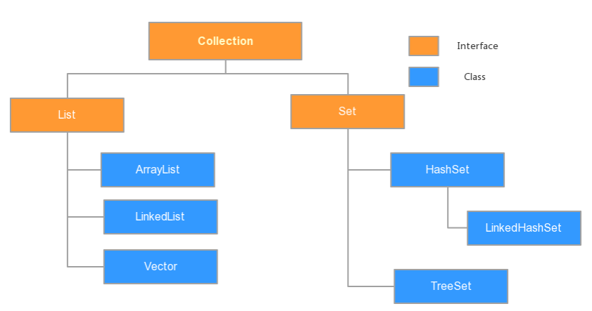

##### <1>通用方式

使用集合中提供的迭代器
```java
Collection c = new ..;//(new List或new Set类型都可以)
//调用add方法存数据
c.add(1);

Collection c = new ..; //(new List或new Set类型都可以)
//调用add方法存数据

Iterator iterator = c.iterator();  //调用迭代器
while(iterator.hasNext()){
    Object obj = iterator.next();  //将循环遍历的元素存到obj
	System.out.println(obj);
}
```

##### <2>List集合的特有方式

get方法通过下标访问元素

注:Set集合不能这样使用!
```java
List list = new ArrayList();
//调用add方法存数据
list.add(1);

for(int i=0;i<list.size();i++){

    System.out.println(list.get(i));//跟数组一样，通过循环遍历下标，取出每一个元素并打印

}
```


##### <3>foreach循环

for循环增强版

注:JDK5.0版本及以上可用

```java
Collection c = new ..;//(new List或new Set类型都可以)
//调用add方法存数据
c.add();

//自动遍历集合c中的元素,并且每次使用变量o来接收
for(Object o:c){

    System.out.println(o);

}

//注:foreach循环也可以遍历数组
set.forEach(obj->System.out.println(obj));
```

#### (4)`List`接口和`Set`接口

`List`和`Set`都是`Collection`接口的子接口,但它们各自的特点不同。

##### <1>`List`类型集合特点

集合中的元素有序且可重复

##### <2>`Set`类型集合特点

集合中的元素不可重复,有没有序要看Set接口具体的实现类是谁。

注:有序指的是元素放到集合中的顺序和循环遍历出来的顺序一致

##### <3>`List`接口常见的实现类
有序可重复
`ArrayList`、`LinkedList`、`Vector`等

1>`ArrayList`是实现了基于动态数组的数据结构，`LinkedList`基于链表的数据结构
2>对于数据的随机访问,`ArrayList`效率优于`LinkedList`,因为`LinkedList`要移动指针
3>对于新增和删除操作`add`和`remove`,`LinedList`比较占优势，因为`ArrayList`要移动数据
4>`Vector`是线程安全的集合,但是速度慢,实现了可拓展的对象数组
5>查看API可知,`List`接口中是这些集合中共有的方法,而且每个集合类中又有一些自己独有的方法。

ArrayList基础操作
```java
public boolean add(E e)：将指定的元素添加到此集合的尾部。
public E remove(int index) ：移除此集合中指定位置上的元素。返回被删除的元素。
public E get(int index) ：返回此集合中指定位置上的元素。返回获取的元素。
public int size() ：返回此集合中的元素数。遍历集合时，可以控制索引范围，防止越界。
```


##### <4>`Set`接口常见的实现类有
无序不可重复
`HashSet`、`LinkedHashSet`  `SortedSet`

##### <5>`HashSet`集合中元素的特点

无序不可重复

##### <6>LinkedHashSet集合中元素的特点

有序不可重复

思考:set集合中元素的不可重复是怎么实现的?


#### (5)`SortedSet`接口和`TreeSet`类

`SortedSet`接口是`Set`接口的子接口,除了拥有`Set`集合的一些基本特点之外,还提供了排序的功能。

`TreeSet`类就是`SortedSet`接口的实现类

#### (6)`TreeSet`类的排序功能

注:`TreeSet`排序永远都是从小到大排,但是谁大谁小是我们的方法说了算的,即，我们可以自定义方法中的最大元素和最小元素。

##### <1>自然排序

核心:让元素自身具备比较性,需要实现`Comparable`接口,重写其`compareTo`方法,比较出大小后即可进行排序

`java.lang.Comparable`接口

```java
//例如:
public class Student implements Comparable{
    //实现Comparable接口
	private long id;
	public long getId() {
		return id;
	}

	public void setId(long id) {
		this.id = id;
	}

	public int compareTo(Object o) {
		Student s = (Student)o;
	    //写自己的排序方法
		if(this.id<s.id){
			return -1;
		}
		else if(this.id>s.id){
			return 1;
		}
		return 0;
	}
}
/**
 *	注:
 *	s1.compareTo(s2);
 *	返回正数说明s1大
 *	返回负数说明s1小
 *	返回0说明s1和s2相等
**/
```

##### <2>比较器排序(定制排序、客户化排序)

核心:使用比较器进行元素之间的比较,比较出大小后即可进行排序。

`java.util.Comparator`接口

```java
//例如:
main{
	Set set = new TreeSet(new Comparator() {
		@Override
		public int compare(Object o1, Object o2) {
			Student s1 = (Student) o1;
			Student s2 = (Student) o2;
			return (int)(s1.getId()-s2.getId());
		}
	});
}


//注:比较器排序的优先级比自然排序的高,所以优先调用比较器排序方法
```

思考:在`TreeSet`中整数默认是从小到大排序,字符是默认是按`a-z`的顺序,那么怎么能让它们的顺序是倒过来的?
在前面整体添加一个负号即可


#### (7)Collection类型集合与数组之间的转换

`Collection`接口中定义了两个方法,可以将当前集合转换为数组:
`Object[]` `toArray()` 返回包含集合中所有元素的数组
```java
//例如:
Collection c = new ...;//(new List或者new Set的实现类都可以)
Object[] array = c.toArray();
System.out.println(Arrays.toString(array));

<T> T[] toArray(T[] a) //可指定返回数组的类型

//例如:
Collection c = new ...;(new List或者new Set的实现类都可以)

String[] str = new String[set.size()];
//元素自动存放到数组str中了
set.toArray(str);
System.out.println(Arrays.toString(str));
```

`java.util.Arrays`中定义了一个方法,可以将数组转换为`List`类型集合

```java
public static <T> List<T> asList(T... a)

//例如：
Integer[] a = new Integer[4];
a[0] = 12;
a[1] = 13;
a[2] = 14;
a[3] = 15;
List list = Arrays.asList(a);
for(Object o:list){
	System.out.println(o);
}

/*输出结果:
12
13
14
15
*/

//例如：
int[] a = new int[4];
a[0] = 12;
a[1] = 13;
a[2] = 14;
a[3] = 15;
List list = Arrays.asList(a);
for(Object o:list){
	System.out.println(o);
}

/*输出结果:
[I@3cf5b814
*/

//注意基本类型数组和引用类型数组在这里的区别
```

#### (8)`Collection`类型集合的工具类:`Collections`

注意Collection和Collections的区别:一个是接口一个是类

`java.util.Collections`类是一个工具类,类中提供了很多的静态方法对`Collection`类型的集合进行操作

##### <1>`fill`方法

使用指定元素替换指定列表中的所有元素。

```java

//例如:
List list = new ArrayList();
list.add(1);
list.add(2);
list.add(3);
Collections.fill(list, 20);
for(Object o:list){
	System.out.println(o);
}
```

##### <2>`max`方法

根据元素的自然顺序，返回给定集合的最大元素

```java

//例如:
List list = new ArrayList();
list.add(1);
list.add(9);
list.add(3);
System.out.println(Collections.max(list));

//`min`方法,根据元素的自然顺序，返回给定集合的最小元素
```

##### <3>`reverse`方法

反转集合中的元素

```java
//例如:
List list = new ArrayList();
list.add(1);
list.add(9);
list.add(3);
Collections.reverse(list);
for(Object o:list){
	System.out.println(o);
}
```

##### <4>`sort`方法

根据元素的自然顺序,对指定列表按升序进行排序

```java
//例如:
List list = new ArrayList();
list.add(1);
list.add(9);
list.add(3);
Collections.sort(list);
for(Object o:list){
	System.out.println(o);
}
```

##### <5>`shuffle`方法

使用默认随机源对指定列表进行置换

```java
//例如:
List list = new ArrayList();
list.add(1);
list.add(9);
list.add(3);
Collections.shuffle(list);
for(Object o:list){
	System.out.println(o);
}
```
##### <6>其他方法

还有一系列的方法,可以把集合转为相应的线程安全的集合对象
`synchronizedList`
`synchronizedSet`
`synchronizedMap`

#### (9)`Map`接口

`Map`类型的集合与`Collection`类型的集合不同,`Map`类型的集合存储数据的时候,要使用`Key-Value`的形式(键值对),且`Key`值不能重复,否则会覆盖原来的键值对

##### <1>`Map`接口中的一些方法

`put`方法:将指定的值与此映射中的指定键关联
​	`get`方法:返回指定键所映射的值;如果此映射不包含该键的映射关系,则返回`null`。
​	`clear`方法:从此映射中移除所有映射关系（可选操作）。
​	`containsKey`方法:如果此映射包含指定键的映射关系，则返回`true`。
​	`containsValue`方法:如果此映射将一个或多个键映射到指定值，则返回`true`。
​	`isEmpty`方法:如果此映射未包含键-值映射关系，则返回`true`。
​	`size`方法:返回此映射中的键-值映射关系数。
​	`remove`方法:如果存在一个键的映射关系，则将其从此映射中移除（可选操作）。

##### <2>`Map`接口的常用实现类

###### `HashMap`类和`Hashtable`类

1>`HashMap`是线程不安全的,`Hashtable`是线程安全的
2>`HashMap`允许`key`值或者`value`值为`null`,但是`Hashtable`中的`key`值或者`value`值都不允许为`null`,否则报错.
注:`map`中的`key`和`value`都必须是`Object`


##### <3>`Map`类型集合的遍历

###### 	1>使用`keySet`方法
可以返回该`Map`集合中的所有`key`值的`set`类型集合
例如:

```java
Map map = new HashMap();
//调用put方法存值


for(Object key:map.keySet()){
	System.out.println(key+" : "+map.get(key));
}
```

###### 2>使用`values`方法

可以返回该`Map`集合中所有`value`值的`Collection`类型集合
例如:

```java
Map map = new HashMap();
//调用put方法存值

for(Object value:map.values()){
	System.out.println(value);
}
```

###### 3>使用`entrySet`方法

可以返回该`Map`集合中,包含所有`Entry`类型对象的`Set`集合

`Set<Map.Entry<K,V>> entrySet();`
注:`Entry`是声明`Map`接口中的内部接口(看API或源码可知),一个`Entry`类型对象就表示`Map`中的一组键值对(K-V)
例如:

```java
Map map = new HashMap();
//调用put方法存值

Set entrySet = map.entrySet();
for(Object obj:entrySet){
	Entry entry = (Entry)obj;
	System.out.println(entry.getKey());
	System.out.println(entry.getValue());
}

//注意这里导入`Entry`接口的形式。
```

#### (10)`SortedMap`接口和`TreeMap`类

`SortedMap`接口是`Map`的子接口,其进一步提供对于键的排序功能。
`TreeMap`类就是`SortedMap`接口的实现类。

`TreeMap`可以对`key`值进行自然排序或者比较器排序,其用法和`TreeSet`是一致的。

## 14.`foreach`循环
增强for循环
```java
for(Object obj : coll){
	//遍历集合
}


for(Object obj : arr){
	//遍历数组
}
```

## 15.`Generics`泛型
### (1)定义
泛型是JDK 1.5的一项新特性,它的本质是参数化类型(Parameterized Type),也就是说所操作的数据类型被指定为一个参数,在用到的时候在指定具体的类型。
这种参数类型可以用在类、接口和方法的创建中,分别称为泛型类、泛型接口和泛型方法。
泛型的类型将来传入是只能是引用类型的,不能是基本类型的。
例如:

```java
//编译通过
List<String>
List<Action>
List<Integer>
List<Integer[]>
List<int[]>

//编译报错
List<int>
//注意：泛型的类型将来传入是只能是引用类型的,不能是基本类型的。
```
任何泛型，如果不传参，默认类型是Object，不使用泛型，编辑器会报出安全警告！

`[变量名].toUpperCase();  //将String类型转成大写`

泛型只是在编辑期间起作用的,在运行时会把泛型信息擦除的。
只是在编译期间启动类型安全检查的作用,运行时不起作用。
例如:`List<String> list = new ArrayList<String>()`;

虽然指定了泛型为String,但是在运行时候依然是可以向该list中存放其他类型数据的。(比如使用反射的方法)
```java
//类中写了如下俩个方法编译会报错,因为编译后这俩个是相同的俩个方法
public void test(List<String> list){
}

public void test(List<Long> list){
}
```

#### (2)泛型的分类
##### <1>泛型类
一个泛型类就是具有一个或多个类型变量(把类型参数化)的类。
定义一个泛型类十分简单,只需要在类名后面加上<>,再在里面加上类型参数.
注:类型变量使用大写形式,且比较短,这是很常见的。在JDK中,使用变量E表示集合的元素类型,K和V分别表示关键字与值的类型。(需要时还可以用其他的字母,也可以是一个或多个字母)


例如:
```java
//这里的T是根据将来用户使用Point类的时候所传的类型来定
//Point<Double> p = new Point<Double>();
public class Point<T> {  //public class Point<T,S>{}  可以定义变量为不同的泛型
	private T x;
	private T y;
	public T getX() {
		return x;
	}
    public void setX(T x) {
        this.x = x;
    }
    public T getY() {
        return y;
    }
    public void setY(T y) {
        this.y = y;
    }
}

//使用方法
Point<Integer> p1 = new Point<Integer>(1,2);
Point<Double> p1 = new Point<Double>(2D,7D);
```

##### <2>泛型接口
一个泛型接口就是具有一个或多个类型变量的接口。
例如:
```java
public interface Action<T,U>{
	void doSomeThing(T t,U u);
}

public class ActionTest implements Action<String,Date>{
	public void doSomeThing(String str,Date date) {
		System.out.println(str);
		System.out.println(date);
	}
}
```

##### <3>泛型方法
在方法上直接声明泛型,该方法就是泛型方法
例如:

```java
public class Test{
	public <T> void run1(T t){

	}
//Test t = new Test();
//t.run1(x);   泛型根据x的类型自动改变
	public <T> T run2(T t){
		return t;
	}

	public <T,S> void run3(T t,S s){

	}
}
```

#### (3)通配符`?`
泛型增加了java中类型的复杂性,例如`List<String>`、`List<Integer>`、`List<Object>`等这些都是不同的类型。
泛型中，声明和接收的数据类型必须保持一致，也不能是子父类关系，否则报错！

```java
//编译报错
//虽然 List list = new ArrayList(); 是正确的
//虽然 Object是String的父类型
//但是下面代码编译时报错的,因为使用了泛型
List<Object> list = new ArrayList<String>();
```

泛型中,"?"是通配符,它可以表示所有泛型的父类型:
`List<?> list = new ArrayList<任意>();`

例如:
```java
//这时list可以指向任何泛型的List类型集合对象
public void test(List<?> list){
	//编译报错,因为我们并不知道"?"到底代表什么类型
	list.add(1);

	//编译通过
	for(Object o:list){
		System.out.println(o);
	}
}
```
注:通配符"?",只能用在泛型变量声明的时候。

#### (4)泛型中的`extends`和`super`关键字
在泛型中可以使用`extends`和`super`关键字来表示将来用户所传的泛型参数的上限和下限。

泛型的上限：
格式：  `类型名称 <? extends 类 > 对象名称`
意义：  只能接收该类型及其子类
泛型的下限：
格式：  `类型名称 <? super 类 > 对象名称`
意义：  只能接收该类型及其父类型
比如：现已知Object类，String 类，Number类，Integer类，其中Number是Integer的父类

##### <1>`extends`关键字的使用:
例如:
```java
//在声明泛型类时使用extends
public class Point<T extends Number> {
	private T x;
	private T y;
}

public class Point<T extends Number,S> {
	private T x;
	private S y;
}
//在声明泛型接口时使用extends
public interface Action<T extends Person> {
	public void doSomeThing(T t);
}

//例如:在声明泛型方法时使用extends
public <T extends Action> void run(T t){

}
```
例如:在声明泛型类型变量时使用`extends`
```java
List<? extends Number> list = new ArrayList<Integer>();
List<? extends Number> list = new ArrayList<Long>();
List<? extends Number> list = new ArrayList<Double>();
//编译报错
List<? extends Number> list = new ArrayList<String>();

例如:
public void test(List<? extends Number> list){

}
```

##### <2>super关键字的使用:
例如:
```java
//编译报错
//声明泛型类或泛型接口时不能使用super
public class Point<T super Number> {

}
public interface Action<T super Number> {

}

//编译报错
//声明泛型方法时不能使用super
public <T super Action> void run2(T t){

}
```

例如:在声明泛型类型变量时使用`super`
```java
//编译通过
List<? super Number> list1 = new ArrayList<Object>();
List<? super Student> list2 = new ArrayList<Object>();
List<? super Student> list3 = new ArrayList<Person>();

//编译通过
public void test(List<? super Number> list){

}

//编译通过
public void test(List<? super Student> list){

}
```

#### (5)泛型中的`&`
使用&可以给泛型加多个限定

例如:
```java
public class A{

}
public inerface B{

}

//不管该限定是类还是接口,统一都使用关键字extends
//可以使用&符号给出多个限定
//如果限定既有接口也有类,那么类必须只有一个,并且放在首位置
public class Point<T extends A&B> {

}

class Sub extends A implements B{}

main{
	//编译报错
	Point<A> p = new Point<A>();
	Point<B> p = new Point<B>();

	//编译通过
	Point<Sub> p = new Point<Sub>();
}
```

#### (6)观察API中`Map`接口及其方法的声明
```java
public interface Map<K,V>{
	public V get(Object key);
	public Set<Map.Entry<K,V>> entrySet();
	public Set<K> keySet();
	public void putAll(Map<? extends K,? extends V> m);
	...
}
```

## 16.`enum`枚举类型

枚举是一种把对象的个数和名字提前确定下来，并且不再改变的特殊类。

JDK1.5增加了枚举类型,可以使用`enum`来定义，在类中，列举出，将来有且只有那些对象，就是枚举。
例如:
```java
public enum Gender{
	MALE,FEMALE;
}
```
其中每一个枚举元素都是该枚举类型的一个实例,并且默认是用`public static final`修饰的

### (1)枚举类型和类的关系
把Gender.class反编译后显示如下:
```java
public final class com.lele.test.Gender extends java.lang.Enum<com.lele.test.Gender> {
	public static final com.lele.test.Gender MALE;
	public static final com.lele.test.Gender FEMALE;
	private static final com.lele.test.Gender[] ENUM$VALUES;
	static {};
	private com.lele.test.Gender(java.lang.String, int);
	public static com.lele.test.Gender[] values();
	public static com.lele.test.Gender valueOf(java.lang.String);
}
```
说明枚举类型本质还是一个类,而且默认就是`fianl`修饰以及默认继承父类java.lang.Enum。

同时构造器是自动生成的且是私有的,表示不可再创建对象。(使用反射也不行)
```java
private Gender(String name,int ordinal)
	name   : 枚举对象的名字
	ordinal: 枚举元素的编号,默认从0开始
```
我们在枚举中所写的`MALE`和`FEMALE`其实就是`Gender`类型的俩个固定的对象。(public static final)

注意：`enum`是java中的一个关键字,`Enum`是java中的一个类

### (2)获取枚举对象
#### <1>获得枚举对象的三种方式
枚举对象在我们使用之前就已经全部创建好了,并且不会增加或减少,和声明的时候保持一致。
例如:

```java
	Gender g1 = Gender.FEMALE;
	Gender g2 = Gender.MALE;

	Gender g3 = Gender.valueOf("FEMALE");
	Gender g4 = Gender.valueOf("MALE");

	System.out.println(g1 == g3);//true
	System.out.println(g2 == g4);//true

	Gender g5 = Enum.valueOf(Gender.class, "FEMALE");
	Gender g6 = Enum.valueOf(Gender.class, "MALE");
	System.out.println(g1 == g5);//true
	System.out.println(g2 == g6);//true
```
##### <2>获得一个枚举类型的所有对象
```java
Gender[] values = Gender.values();
for(Gender g:values){
	System.out.println(g);
}

//枚举的父类型中，重写了toString方法
//java.lang.Enum抽象类，所有枚举类型的父类型
```

#### (3)枚举类型的方法
枚举对象默认只能调用到父类`Enum`中的方法以及`Object`中的方法

如果想调用自己的方法,也可以在枚举类型中定义出属于自己的方法.
注:枚举也是类,只是一种特殊的类,所以在枚举类型中可以定义很多东西,像之前在类中写代码是一样的
例如:
```java
public enum Gender {
	MALE,FEMALE;

	public void say(String name){
		System.out.println("hello "+name+","+this);
	}
	public static void main(String[] args) {
		Gender g1 = Gender.FEMALE;
		Gender g2 = Gender.MALE;

		g1.say("tom");
		g2.say("tom");
	}
}
```
也可以是定义静态方法
例如:
```java
public enum Gender {
	MALE,FEMALE;

	public void say(String name){
		System.out.println("hello "+name+","+this);
	}
	public static void run(){
		System.out.println("running..");
	}
	public static void main(String[] args) {
		Gender.run();
	}
}
```
#### (4)枚举类型的属性
枚举类型中可以定义属于自己的属性
例如:
```java
public enum Gender {
	MALE,FEMALE;

	private String name;

	public String getName() {
		return name;
	}
	public void setName(String name) {
		this.name = name;
	}
	//重写toString方法
	public String toString() {
		return this.getName();
	}
	public static void main(String[] args) {
		Gender g = Gender.FEMALE;
		g.setName("女");
		System.out.println(g);
	}
}
```
#### (5)枚举类型的构造器
在枚举类型中定义其构造器,但是必须是私有的,默认也是私有的
##### <1>定义构造器
例如:
```java
public enum Gender {
	//默认调用无参构造器
	MALE,FEMALE;


	private String name;

	//有参构造器
	private Gender(String name){
		this.name = name;
	}
	//无参构造器
	Gender(){

	}

	//重写toString方法
	public String toString() {
		return this.name;
	}
}
```
##### <2>构造器的调用
在声明枚举对象的时候,其实就是在调用构造器,默认是隐式调用其无参构造器,也可以显式调用有参构造器
例如:
```java
public enum Gender {
	MALE("男"),FEMALE("女");  //有参构造器

	private String name;
	private Gender(String name){
		this.name = name;
	}
	Gender(){
		this("");
	}
	public String toString() {
		return this.name;
	}
	public static void main(String[] args) {
		Gender g = Gender.FEMALE;
		System.out.println(g);
	}
}
```

#### (6)枚举类型的抽象方法
枚举类型中可以编写抽象方法,但是这时候其每个对象都必须去实现这个抽象方法,否则编译报错。
形式上很像匿名内部类对象
例如:
```java
public enum Gender {
	MALE(){
		public void run() {
			System.out.println("MALE run");
		}
	},FEMALE(){
		public void run() {
			System.out.println("FEMALE run");
		}
	};

	public abstract void run();
}
```
#### (7)枚举类型可以实现接口
枚举类型不能指定继承其他父类,但是可以实现其他接口

例如:枚举类型中把该接口中的所有方法实现了
```java
public interface Action{
	void doSomeThing();
}

public enum Gender implements Action{
	MALE,FEMALE;

	public void doSomeThing() {
		System.out.println("Gender go..");
	}
}
```
例如:或者在每个对象中分别实现接口中所有方法也可以
```java
public interface Action{
	void doSomeThing();
}
public enum Gender implements Action{
	MALE(){
		public void doSomeThing() {
			System.out.println("MALE go...");
		}
	},FEMALE(){
		public void doSomeThing() {
			System.out.println("FEMALE go...");
		}
	};
}
```

## (五).`Reflection`反射
### 1.反射概述
* 反射是一种机制，利用该机制可以在程序运行过程中对类进行解剖并操作类中的方法，属性，构造方法等成员。
	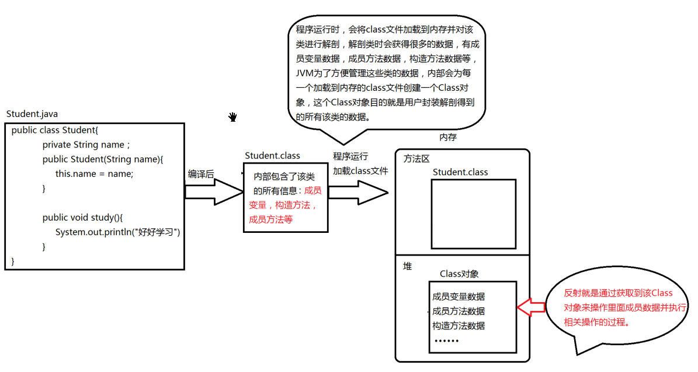

> 我们在使用集成开发工具写代码，也无时无刻的使用着反射机制，一个常用反射机制的地方就是当我们通过对象调用方法或访问属性时，开发工具都会以列表的形式显示出该对象所有的方法或属性，以供方便我们选择使用，如下图：这些开发工具之所有能够把该对象的方法和属性展示出来就使用利用了反射机制对该对象所有类进行了解剖，获取到了类中的所有方法和属性信息，这是反射在IDE中的一个使用场景。
	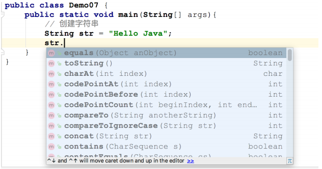

	在"运行时",通过反射机制可以动态获得和该类型相关的各种信息,以及一系列相关操作的运行机制。

* 反射机制是在运行状态中,对于任意一个类,都能够知道这个类的所有属性和方法,对于任意一个对象,都能够调用它的任意一个方法和属性,包括：八种基本类型和三种引用类型
* `Class`类是反射的入口，使用反射机制，就必须先要获取到该类的字节码文件对象，即`Class`类型对象。
	* Java中使用`Class`类表示某个`*.class`文件.
	* 任何一个`*.class`文件都是`Class`这个类的一个实例对象.

### 2.获得`Class`类对象
* `Class`是对java中所有类型的抽象。即一个`Class`类型对象可以表示出java中任意一种类型。
* 每种类型在加载到内存后,内存中都会生产一个与之对应的Class类型对象(有且只有一个),用来表示该类型。
* 每个类型都有且只有一个Class类型对象与之对应,通过这个Class类型对象就可以获得到该类型中的各种信息。
* `Class`类位于`java.lang;`包下

### (1).获得`Class`对象的三种方式
#### <1>.通过`类名.class`获取
#### <2>.通过`getClass()`方法获取
该方法位于
#### <3>.通过`Class.forName()`获取


### 3.获取Class类对象的信息
### 4.获得Class类对象的构造器(Constructor)信息
### 5.获得Class类对象的方法(Method)信息
### 6.获得Class类对象的属性(Field)信息


#### (1)`Class`类型
`java.lang.Class`类,反射机制的入口
`Class`是对java中所有类型的抽象。即一个Class类型对象可以表示出java中任意一种类型。

每种类型在加载到内存后,内存中都会生产一个与之对应的Class类型对象(有且只有一个),用来表示该类型。

每个类型都有且只有一个Class类型对象与之对应,通过这个Class类型对象就可以获得到该类型中的各种信息。

```java
.isPrimitive() //判断是否是基本类型
.isInterface() //判断是不是接口
.isArray()  //判断是不是数组
.getName()  //类型的名字
.getComponentType()  //数组用什么类型组成的
a.isAssignableFrom(b)  //a和b的子父类关系
superclass             //表示其父类型的Class对象
String getSimpleName(); //获得简单类名，只是类名，没有包 
String getName(); //获取完整类名，包含包名+类名    
T newInstance();//创建此 Class 对象所表示的类的一个新实例。要求：类必须有public的无参数构造方法
/**---------------------------------------------------------------*/
Constructor getConstructor(Class... parameterTypes) 
//根据参数类型获取构造方法对象，只能获得public修饰的构造方法。
//如果不存在对应的构造方法，则会抛出 java.lang.NoSuchMethodException 异常。     
  
Constructor getDeclaredConstructor(Class... parameterTypes)
//根据参数类型获取构造方法对象，包括private修饰的构造方法。   
//如果不存在对应的构造方法，则会抛出 java.lang.NoSuchMethodException 异常。   
 
Constructor[] getConstructors() 
// 获取所有的public修饰的构造方法  
 
Constructor[] getDeclaredConstructors()
//获取所有构造方法，包括privat修饰的  

T newInstance(Object... initargs) 	//根据指定参数创建对象。   
void setAccessible(true)		//暴力反射，设置权限后，可以直接访问私有类型的构造方法。
/******************************************************************************************/
//Class类中与Method相关方法
 
1. Method getMethod("方法名", 方法的参数类型... 类型)  
根据方法名和参数类型获得一个方法对象，只能是获取public修饰的     
    
2. Method getDeclaredMethod("方法名", 方法的参数类型... 类型)
   根据方法名和参数类型获得一个方法对象，包括private修饰的   
    
3. Method[] getMethods() (了解)
   获取所有的public修饰的成员方法，包括父类中。   
 
4. Method[] getDeclaredMethods() (了解)
   获取当前类中所有的方法，包含私有的，不包括父类中。   
  
//Method类中常用方法

1.  Object invoke(Object obj, Object... args) 
   根据参数args调用对象obj的该成员方法       
   如果obj=null，则表示该方法是静态方法   
  
2.  void setAccessible(boolean flag) 
   暴力反射，设置为可以直接调用私有修饰的成员方法
  
Class类中与Field相关方法
 
1. Field getDeclaredField(String name) 
   根据属性名获得属性对象，包括private修饰的
 
2. Field getField(String name) 
   根据属性名获得属性对象，只能获取public修饰的
   
3. Field[] getFields()    
    获取所有的public修饰的属性对象，返回数组。
    
4. Field[] getDeclaredFields()    
   获取所有的属性对象，包括private修饰的，返回数组。   
  
Field类中常用方法
void set(Object obj, Object value) 
void setInt(Object obj, int i)  
void setLong(Object obj, long l)
void setBoolean(Object obj, boolean z) 
void setDouble(Object obj, double d) 
 
Object get(Object obj)  
int getInt(Object obj)   
long getLong(Object obj) 
boolean getBoolean(Object ob)
double getDouble(Object obj) 
 
void setAccessible(true);暴力反射，设置为可以直接访问私
Class getType(); 获取属性的类型，返回Class对象。

//setXxx方法都是给对象obj的属性设置使用，针对不同的类型选取不同的方法。
//getXxx方法是获取对象obj对应的属性值的，针对不同的类型选取不同的方法。
```

##### <1>表示基本类型

```java
Class c = int.class;
System.out.println(c.isPrimitive());//true
System.out.println(c.getName());//int

//注:其他基本类型的情况类似
```

##### <2>表示类类型
注:`s.getClass()`方法返回的是变量s所指向对象的实现类型的Class对象。
```java
Student s = new Student();
Class c1 = s.getClass();
Class c2 = Student.class;
System.out.println(c1 == c2);//true


//p指向的对象实际类型是Student
Person p = new Student();
Class c1 = p.getClass();//c1表示Student类型
Class c2 = Person.class;//c2表示Person类型
System.out.println(c1 == c2);//false
```
##### <3>表示接口类型
```java
Action a = new Student();
Class c1 = a.getClass();//c1表示Student类型
Class c2 = Action.class;//c2表示Action类型
System.out.println(c1 == c2);//false

System.out.println(c2.isInterface());//true
```

##### <4>表示数组类型
```java
int[] a = new int[4];
Class c1 = a.getClass();
Class c2 = int[].class;
System.out.println(c1 == c2);//true
System.out.println(c1.isArray());//true

Class c3 = c1.getComponentType();//c3表示该数组是使用什么类型声明出来的
System.out.println(c3.getName());//int

Student[] a = new Student[4];
Class c1 = a.getClass();
Class c2 = Student[].class;
System.out.println(c1 == c2);//true
System.out.println(c1.isArray());//true

Class c3 = c1.getComponentType();//c3表示该数组是使用什么类型声明出来的
System.out.println(c3.getName());//com.briup.test.Student
```

#### (2)获得一个类类型的Class对象的三种方式
最常见的是类类型的Class对象
##### <1>使用对象调用getClass方法获得
getClass是Object中的final修饰的方法,每个对象都可以调用而且不能重写
```java
Student s = new Student();
Class c = s.getClass();
```
##### <2>使用类名获得
`Class c = Student.class;`

##### <3>使用Class类中的forName方法获得
```java
//这种方法很灵活,只需一个String类型参数即可
//而String类型的数据改变起来很容易
//注意该方法是会抛出异常的
Class c = Class.forName("com.lele.test.Student");
```
注:以上三种方法获得的同一个对象(==比较),因为每个类型内存都有且只有一个Class类型对象

#### (3)反射机制中的常见类的含义

java.lang包下:
Class  类		对java中所有类型抽象而得来的
Package类		对java中所有包抽象而得来的

java.lang.reflect包下:
Modifier	类	对java中所有修饰符抽象而得来的
Field		类	对java中所有属性抽象而得来的
Method		类	对java中所有方法抽象而得来的
Constructor 类	对java中所有构造器抽象而得来的
Array		类	提供了对数组对象的动态访问
ParameterizedType接口  在反射中表示参数化类型

例如:`List<String> Point<Long,Long>`等这种带泛型的类型

```java
//创建任意类的对象

t.test("[packagename].[classname]");

public Object test(String className){

    Class c = Class.forName(className);
    Object obj = c.newInstance();
    return obj;

}
```


#### (4)使用Class类型对象获得类中的信息
##### <1>获得该类所处的包的信息
```java
Student s = new Student();
Class<?> c = s.getClass();
System.out.println(c.getPackage().getName());
```

##### <2>获得该类的修饰符信息
```java
//每个修饰符对应一个int值
//如果有多个修饰符则int值相加
Student s = new Student();
Class c = s.getClass();
System.out.println(c.getModifiers());

System.out.println(Modifier.PUBLIC);
System.out.println(Modifier.FINAL);
```
##### <3>获得该类的名字
```java
Student s = new Student();
Class c = s.getClass();
System.out.println(c.getName());
```
##### <4>获得该类的父类的Class对象
```java
Student s = new Student();
Class c = s.getClass();
//superclass表示其父类型的Class对象
Class superclass = c.getSuperclass();
System.out.println(superclass.getName());


//例如:
Class c = Object.class;
Class superclass = c.getSuperclass();
System.out.println(superclass.getName());
//运行报错,因为Object没有父类

//例如:
//判断c1是不是c2的子类型
//判断c3是不是c2的子类型
Class c1 = Student.class;
Class c2 = Person.class;
Class c3 = String.class
System.out.println(c2.isAssignableFrom(c1));//true
System.out.println(c2.isAssignableFrom(c3));//false
```

##### <5>获得该类所实现的接口类型的Class对象
```java
Student s = new Student();
Class c = s.getClass();
Class[] interfaces = c.getInterfaces();
for(Class clazz:interfaces){
	System.out.println(clazz.getName());
}
```
例如:
```java
//判断c1是不是c2的实现类
//判断c3是不是c2的实现类
Class c1 = Student.class;
Class c2 = Action.class;
Class c3 = String.class
System.out.println(c2.isAssignableFrom(c1));//true
System.out.println(c2.isAssignableFrom(c3));//false
```

##### <6>获得该类中所有的属性
```java
Student s = new Student();
Class c = s.getClass();
Field[] declaredFields = c.getDeclaredFields();

for(Field f:declaredFields){
	System.out.println(f.getModifiers());
	System.out.println(f.getType().getName());
	System.out.println(f.getName());
}
```
注:
`getDeclaredFields()`方法返回类中声明的属性,包括私有的
`getFields()`方法只返回类中public修饰的属性,包括继承的


例如:
```java
//获得某个指定的属性(也包括私有属性)
Student s = new Student();
Class c = s.getClass();
Field f = c.getDeclaredField("score");
System.out.println(f.getModifiers());
System.out.println(f.getType().getName());
System.out.println(f.getName());
```
##### <7>获得该类中所有的方法
```java
Student s = new Student();
Class c = s.getClass();
Method[] declaredMethods = c.getDeclaredMethods();
for(Method m:declaredMethods){
	System.out.println(m.getModifiers());
	System.out.println(m.getReturnType().getName());
	System.out.println(m.getName());
	System.out.println(Arrays.toString(m.getParameterTypes()));
	System.out.println(Arrays.toString(m.getExceptionTypes()));
}
```
注:
```java
getDeclaredMethods()  //方法返回类中声明的方法,包括私有的
getMethods()          //方法只返回类中public修饰的方法,包括继承的
```

例如:
```java
//获得某个指定的方法(也包括私有方法)
Student s = new Student();
Class c = s.getClass();
Method m = c.getDeclaredMethod("print");
System.out.println(m.getModifiers());
System.out.println(m.getReturnType().getName());
System.out.println(m.getName());
System.out.println(Arrays.toString(m.getParameterTypes()));
System.out.println(Arrays.toString(m.getExceptionTypes()));
```

##### <8>获得该类中所有的构造器
```java
Student s = new Student();
Class c = s.getClass();
Constructor[] declaredConstructors = c.getDeclaredConstructors();
for(Constructor con:declaredConstructors){
	System.out.println(con.getModifiers());
	System.out.println(con.getName());
	System.out.println(Arrays.toString(con.getParameterTypes()));
	System.out.println(Arrays.toString(con.getExceptionTypes()));
}
```

注:
`getDeclaredConstructors()`方法返回类中所有构造器
`getConstructors()`方法只返回类中public修饰的构造器
例如:
```java
//获得某个指定的构造器(也包括私有构造器)
Student s = new Student();
Class c = s.getClass();
Constructor con = c.getDeclaredConstructor(double.class);
System.out.println(con.getModifiers());
System.out.println(con.getName());

System.out.println(Arrays.toString(con.getParameterTypes()));
System.out.println(Arrays.toString(con.getExceptionTypes()));
```

##### <9>获得父类型中的泛型的真实类型
因为泛型类的泛型参数在编译期会被擦除,所以我们不能再运行期间直接拿到该泛型的实际类型,但是可以通过子类的Class对象来获取父类的泛型类型。

例如: 不通过子类不能获得泛型实际类型
```java
public class GenericTest<T,S>{
	public T name;
	public S say(T t,S s){
		return s;
	}
}

main{
	GenericTest<String,Integer> t = new GenericTest<String,Integer>();
	Class c = t.getClass();
	Field field = c.getDeclaredField("name");
	System.out.println(field.getType());
	System.out.println(field.getGenericType());

	//输出结果:
	class java.lang.Object
	T

	System.out.println("-------------------------");
	Method method = c.getMethod("say", Object.class,Object.class);
	System.out.println(method.getReturnType());
	System.out.println(method.getGenericReturnType());
	//输出结果:
	class java.lang.Object
	S

	System.out.println("-------------------------");
	System.out.println(Arrays.toString(method.getParameterTypes()));
	System.out.println(Arrays.toString(method.getGenericParameterTypes()));
	//输出结果:
	[class java.lang.Object, class java.lang.Object]
	[T, S]
}
```

例如: 通过子类可以获得父类中泛型的实际类型
```java
public class GenericTest<T,S>{
	public T name;
	public S say(T t,S s){
		return s;
	}
}

public class Sub entends GenericTest<String,Integer>{}

main{
	Class c = Sub.class;

	//获得父类类型,包含泛型参数信息
	Type superType = c.getGenericSuperclass();

	//判断父类类型是不是属于ParameterizedType类型
	//ParameterizedType表示带泛型的类型
	if(superType instanceof ParameterizedType){
		//强转,并调用方法获得泛型参数的实例类型
		ParameterizedType pt = (ParameterizedType)superType;

		//获得真实参数类型
		Type[] actualTypeArguments = pt.getActualTypeArguments();

		//循环遍历,并强转为Class类型,因为Type接口中没有任何方法
		for(Type t:actualTypeArguments){
			Class clazz = (Class)t;
			System.out.println(clazz.getName());
		}
	}
}
```


例如: 通过子类可以获得实现接口中泛型的实际类型
```java
Class c = Sub.class;
Type[] types = c.getGenericInterfaces();
for(Type t:types){
	if(t instanceof ParameterizedType){
		ParameterizedType pt = (ParameterizedType)t;

		Type[] actualTypeArguments = pt.getActualTypeArguments();

		for(Type type:actualTypeArguments){
			Class clazz = (Class)type;
			System.out.println(clazz.getName());
		}

	}
}
```


10.获得类中的注解
使用反射也可以获得类中的注解


#### (4)反射中的常用操作
```java
public class Student{
	private long id;
	private String name;

	private static int age;

	get/set

	public static void say(){
		System.out.println("say..");
	}

}
```
##### <1>使用反射的方式调用构造器创建类的对象
默认方式:必须调用无参构造器
```java
Class c = Student.class;
Student s = (Student)c.newInstance();
```
通用方式:获得构造器对象,并调用该构造器

注:getConstructor方法和newInstance方法的参数都是可变参数
例如:获得无参构造器并调用创建对象
```java
Class c = Student.class;
Constructor constructor = c.getConstructor();
Student o = (Student)constructor.newInstance();
System.out.println(o);
```
例如:获得有参构造器并调用创建对象
```java
Class c = Student.class;
Constructor constructor = c.getConstructor(long.class,String.class);
Student o = (Student)constructor.newInstance(1L,"tom");
System.out.println(o);
```

##### <2>使用反射的方式访问对象中的属性
例如:
```java
Student s = new Student();
Class c = s.getClass();
Field[] declaredFields = c.getDeclaredFields();
for(Field f:declaredFields){

	//设置私有属性可以被访问
	f.setAccessible(true);

	//判断属性是否为static,静态属性的访问不需要对象
	if(Modifier.isStatic(f.getModifiers())){
		System.out.println(f.getName() +" = "+f.get(null));
	}else{
		System.out.println(f.getName() +" = "+f.get(s));
	}
}
```
注:Field类中的get方法可以获得属性值,set方法可以给属性设置值。


##### <3>使用反射的方式调用对象中的方法
例如:
```java
Student s = new Student();
Class c = s.getClass();

Method m1 = c.getMethod("setName",String.class);
//m1表示Student中的setName方法
//调用对象s中的m1方法,并且传参"tom"
//s.setName("tom");
m1.invoke(s, "tom");

Method m2 = c.getMethod("getName");
String name = (String)m2.invoke(s);
System.out.println("name = "+name);

//调用静态方法 不需要对象
Method m3 = c.getMethod("say");
m3.invoke(null);
```

##### <4>使用反射的方式动态操作数组
注:
```java
Object[] o1 = new int[1];//编译报错
long[] 	 o2 = new int[1];//编译报错
int[]	 o3 = new int[1];//编译通过

Object o1 = new 任意引用类型[1];//编译通过
```
基本类型的数组，没有多态；引用类型的数组，有多态

例如:

```java
//要求:传任意类型"数组",把数组长度扩大1倍并返回
//注意这里不能收Object[],
//因为Object[] o = new Integer[4];编译通过
//但是Object[] o = new int[4];	  编译报错
//那么使用Object类中就可以接收任意类型的数组了
public static Object arrayCopy(Object obj){
	//代码
}

//实现:
public static Object arrayCopy(Object obj){
	Class c = obj.getClass();
	Object newArray = null;
	if(c.isArray()){
		int len = Array.getLength(obj);
		Class<?> type = c.getComponentType();
		newArray = Array.newInstance(type, len*2);
		for(int i=0;i<len;i++){
			Object value = Array.get(obj, i);
			Array.set(newArray, i, value);
		}
	}
	return newArray;
}
```

## 18.`Exceptions`异常
程序在执行过程中，出现的非正常的情况，最终会导致JVM的非正常停止。
在Java等面向对象的编程语言中，异常本身是一个类，产生异常就是创建异常对象并抛出了一个异常对象。Java处理异常的方式是中断处理。

> 异常指的并不是语法错误,语法错了,编译不通过,不会产生字节码文件,根本不能运行.
### (1)异常体系
异常机制其实是帮助我们找到程序中的问题，异常的根类是`java.lang.Throwable`，其下有两个子类:`java.lang.Error`与`java.lang.Exception`，平常所说的异常指`java.lang.Exception`
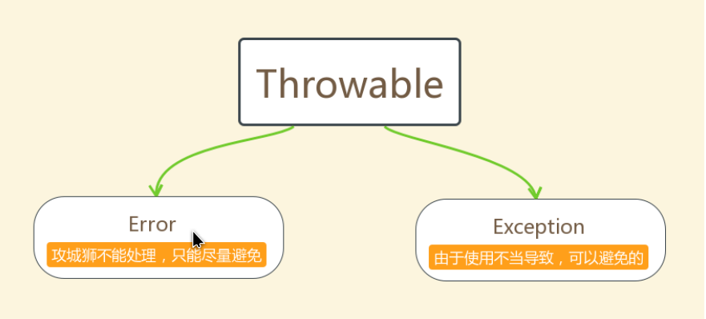
##### <1>`Throwable`体系：
`Error`:严重错误Error，无法通过处理的错误，只能事先避免，好比绝症。
`Exception`:表示异常，异常产生后程序员可以通过代码的方式纠正，使程序继续运行，是必须要处理的。好比感冒、阑尾炎。

##### <2>`Throwable`中的常用方法：
`public void printStackTrace()`:打印异常的详细信息。包含了异常的类型,异常的原因,还包括异常出现的位置,在开发和调试阶段
`public String getMessage()`:获取发生异常的原因。提示给用户的时候,就提示错误原因。
`public String toString()`:获取异常的类型和异常描述信息(不用)。

#### (2)异常分类
我们平常说的异常就是指`Exception`,因为这类异常一旦出现，我们就要对代码进行更正，修复程序.

##### <1>异常(Exception)的分类
根据在编译时期还是运行时期去检查异常
编译时期异常:checked异常。在编译时期,就会检查,如果没有处理异常,则编译失败。(如日期格式化异常)
运行时期异常:runtime异常。在运行时期,检查异常.在编译时期,运行异常不会编译器检测(不报错)。(如数学异常)

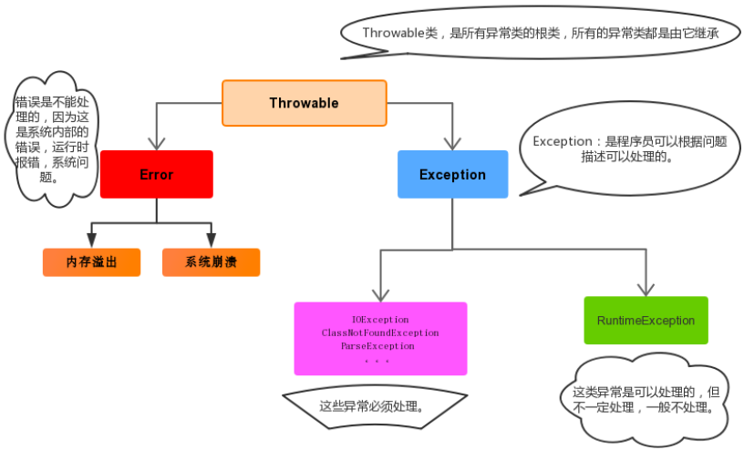

1>`RuntimeException`
`Exception`的一个特殊的子类
2>`RuntimeException`类型及其子类型都是属于运行时异常
3>其他类型的异常只要不是继承了`RuntimeException`类的,都属于编译异常
4>编译异常又称checked异常,运行时异常又称`unchecked`异常
因为编译器在编译期间如果遇到了checked异常,那么是一定会提示我们,让我们去处理的。但是如果遇到了unchecked异常,编译器是不做任何事情的。

##### <2>常见的运行时异常:unchecked
`java.lang.ArithmeticException`               算术异常
`java.lang.NullPointerException`              空指针引用
`java.lang.ArrayIndexoutofBoundsException`    数组越界
`java.lang.ClassCastException`                强制类型转换异常
`java.lang.NumberFormatException`             数据格式异常
`java.lang.NegativeArraySizeException`        数组长度为负数异常


##### <3>常见的编译异常:checked
编译器提示你需要处理的都为编译异常
`java.lang.ClassNotFoundException`
`java.lang.DataFormatException`
`java.lang.NoSuchMethodException`
`java.io.IOException`
`java.sql.SQLException`
#### (3)异常的处理
Java异常处理的五个关键字：`try`、`catch`、`finally`、`throw`、`throws`
##### <1>抛出异常`throw`
如果程序中的某行代码的执行抛出了异常,并且这个异常一种都没有被try-catch处理,那么这个异常最终会抛给JVM,JVM输出异常信息后就自动停止了
使用格式： 
`throw new 异常类名(参数);`
例如：

```java
throw new NullPointerException("要访问的arr数组不存在");
 
throw new ArrayIndexOutOfBoundsException("该索引在数组中不存在，已超出范围");

public static void main(String[] args) throws ClassNotFoundException {
	System.out.println("hello");
	Class.forName("test..");
	System.out.println("world");
	//....其他代码
}

//最终的结果是代码在调用forName方法抛出异常后,JVM处理后就停止了.并没有往下继续执行代码
```
> 注意：如果产生了问题，我们就会throw将问题描述类即异常进行抛出，也就是将问题返回给该方法的调用
> 者。
> 那么对于调用者来说，该怎么处理呢？一种是进行捕获处理，另一种就是继续讲问题声明出去，使用throws
> 声明处理。

##### <2>声明异常`throws`
声明异常：将问题标识出来，报告给调用者。如果方法内通过throw抛出了编译时异常，而没有捕获处理,那么必须通过throws进行声明，让调用者去处理。
关键字throws运用于方法声明之上,用于表示当前方法不处理异常,而是提醒该方法的调用者来处理异常(抛出异常).
声明异常格式：

`修饰符 返回值类型 方法名(参数) throws 异常类名1,异常类名2…{   }`  

throws用于进行异常类的声明，若该方法可能有多种异常情况产生，那么在throws后面可以写多个异常类，用逗号隔开。

##### <3>捕获异常`try…catch`
如果异常出现的话,会立刻终止程序,所以我们得处理异常:

###### 1>该方法不处理,而是声明抛出,由该方法的调用者来处理(throws)。

###### 2>在方法中使用try-catch的语句块来处理异常。

try-catch的方式就是捕获异常。
捕获异常：Java中对异常有针对性的语句进行捕获，可以对出现的异常进行指定方式的处理。
捕获异常语法如下：

```java
try{
     //编写可能会出现异常的代码
}catch(异常类型  e){
     //处理异常的代码
     //记录日志/打印异常信息/继续抛出异常
}
```
try：该代码块中编写可能产生异常的代码。
catch：用来进行某种异常的捕获，实现对捕获到的异常进行处理。
注意:try和catch都不能单独使用,必须连用。

###### 3>如何获取异常信息：

Throwable类中定义了一些查看方法:
`public String getMessage()`:获取异常的描述信息,原因(提示给用户的时候,就提示错误原因。
`public String toString()`:获取异常的类型和异常描述信息(不用)。
`public void printStackTrace()`:打印异常的跟踪栈信息并输出到控制台。

包含了异常的类型,异常的原因,还包括异常出现的位置,在开发和调试阶段,都得使用printStackTrace。
在开发中呢也可以在catch将编译期异常转换成运行期异常处理。

###### 4>catch代码块中三种处理方式
①记录日志
②打印异常信息
③继续抛出异常
###### 5>多个异常如何捕获处理
①多个异常分别处理。
②多个异常一次捕获，多次处理。
③多个异常一次捕获一次处理。
一般我们是使用一次捕获多次处理方式，格式如下：
```java
try{
     编写可能会出现异常的代码
}catch(异常类型A  e){  当try中出现A类型异常,就用该catch来捕获.
     处理异常的代码
     //记录日志/打印异常信息/继续抛出异常
}catch(异常类型B  e){  当try中出现B类型异常,就用该catch来捕获.
     处理异常的代码
     //记录日志/打印异常信息/继续抛出异常
}
```

注意:这种异常处理方式，要求多个catch中的异常不能相同，并且若catch中的多个异常之间有子父类异常的关系，那么子类异常要求在上面的catch处理，父类异常在下面的catch处理。

#### (4)`finally`代码块
`finally`：有一些特定的代码无论异常是否发生，都需要执行。另外，因为异常会引发程序跳转，导致有些语句执行不到。而finally就是解决这个问题的，在finally代码块中存放的代码都是一定会被执行的。
什么时候的代码必须最终执行？
当我们在try语句块中打开了一些物理资源(磁盘文件/网络连接/数据库连接等),我们都得在使用完之后,最终关闭打开的资源。
finally的语法:
`try{}...catch(){}....finally{}:自身需要处理异常,最终还得关闭资源。`

> 注意:finally不能单独使用。

比如在我们之后学习的IO流中，当打开了一个关联文件的资源，最后程序不管结果如何，都需要把这个资源关闭掉。
finally代码参考如下：

```java
public class TryCatchDemo4 {
    public static void main(String[] args) {
        try {
            read("a.txt");
        } catch (FileNotFoundException e) {
            //抓取到的是编译期异常  抛出去的是运行期 
            throw new RuntimeException(e);
        } finally {
            System.out.println("不管程序怎样，这里都将会被执行。");
        }
        System.out.println("over");
    }
    /*
     *
     * 我们 当前的这个方法中 有异常  有编译期异常
     */
    public static void read(String path) throws FileNotFoundException {
        if (!path.equals("a.txt")) {//如果不是 a.txt这个文件 
            // 我假设  如果不是 a.txt 认为 该文件不存在 是一个错误 也就是异常  throw
            throw new FileNotFoundException("文件不存在");
        }
    }
}
```

> 当只有在try或者catch中调用退出JVM的相关方法,此时finally才不会执行,否则finally永远会执行。

#### (5)自定义异常

异常类如何定义:
1. 自定义一个编译期异常: 自定义类,并继承于java.lang.Exception。
2. 自定义一个运行时期的异常类:自定义类,并继承于java.lang.RuntimeException。

在需要的情况下,可以通过扩展Exception类或RuntimeException类来创建自定义的异常(一般是扩展Exception类)。异常类包含了和异常相关的信息,这有助于负责捕获异常的catch代码块，正确地分析并处理异常

例如:我们任务在系统中用户要登录的账号和密码不匹配就是一种异常情况,但是JDK中并没有定义这种异常,所以我们可以进行自定义。
例如: 只需继承Exception即可.一般还会加入和父类中匹配的构造器
```java
public class UserPasswordException extends Exception{

	public UserPasswordException() {
		super();
	}

	public UserPasswordException(String message, Throwable cause, boolean enableSuppression,boolean writableStackTrace) {
		super(message, cause, enableSuppression,writableStackTrace);
	}

	public UserPasswordException(String message, Throwable cause) {
		super(message, cause);
	}

	public UserPasswordException(String message) {
		super(message);
	}

	public UserPasswordException(Throwable cause) {
		super(cause);
	}

}
```
例如:
注:异常是可以在代码中主动抛出的
```java
public void login(String password)throws UserPasswordException{

	if("123".equals(password)){
		throw new UserPasswordException("密码错误");
	}

}

//将来login方法的调用者负责处理这个异常
```
19.断言
语法：`assert [code]:"提示语";`
在JDK1.4中，Java语言引入一个新的关键字：`assert`该关键字有两种形式：
`assert  条件`  以及	`assert  条件:值或表达式`

这两种形式都会对条件进行评估，如果结果为false则抛出AssertionError。
在第二种形式中，值或表达式的值会传入AssertionError的
构造器并转成一个消息字符串,成为要显示的错误信息

例如:
要断言x不是负数，只需要使用如下简单的语句：
`assert x >= 0;`
或者你可以将x的值传递给AssertionError对象，从而可以在报错时候显示：
`assert x >= 0 : x;` 或者 `assert x >= 0 : "x的值不符合条件:x="+x;`

## 20.`GUI`图形化界面
### (1)`GUI`概述`AWT`和`Swing`
图形用户界面`(Graphics User Interface, GUI)`是用户与程序交互的窗口,它比基于命令行的界面更直观并且更友好。
`GUI`的基本类库位于`java.awt`包中, 这个包也被称为抽象窗口工具集`(Abstract Window Toolkit, AWT)`。`AWT`按照面向对象的思想来创建`GUI`,它提供了容器类、组件类和布局管理器类。

随着`Java`的发展,`AWT`中的大部分组件已经渐渐被淘汰,它已经不能适应发展的需要,不能满足开发功能强大的用户界面的需要。这时`Swing`出现了,它是建立在`AWT`之上的组件集(对`AWT`组件的扩展),在不同的平台上都能保持组件的界面样式,因此得到了非常广泛的应用。`javax.swing`

注:`AWT`和`Swing`之间的最大的区别在于`Swing`组件的实现与本地实现无关,所以能保证`Swing`组件在不同的平台上都能显示出原有的样式,并且`Swing`组件比`AWT`组件具有更多的功能。
`AWT`组件都在`java.awt`包下面,`Swing`组件都在`javax.swing`包下面
例如`AWT`和`Swing`中都有按钮,
`java.awt.Button`
`javax.swing.JButton`

`AWT`和`Swing`中都有复选框,
`java.awt.Checkbox`
`javax.swing.JCheckBox`

`AWT`和`Swing`中都有对话框,
`java.awt.Dialog`
`javax.swing.JDialog`

`AWT`和`Swing`中都有菜单组件,
`java.awt.Menu`
`javax.swing.JMenu`
`...`

注1:它们之间的名字的特点
注2:`javax.swing`中绝大大多数的组件都是继承了`java.awt`中`Component`

#### (2)组件、容器、布局管理器的介绍
这三种东西是`GUI`界面中最重要的组成部分。

##### <1>组件
`java.awt.Component`类是所有组件的父类(这是个抽象类)。同时在该类中也定义了所有组件都应该具备的公共方法。

`Component`类型对象是一个具有图形表示能力的对象,可在屏幕上显示,并可与用户进行交互。例如图形用户界面中的按钮、复选框和滚动条等都是它的实例。

注:该类实现的接口没有写出来
`public abstract class Component{}`

下面常用的类都是`Component`的"直接"子类:
`java.awt.Button`
`Button`类用于创建`GUI`中的按钮
java.awt.Canvas`
`Canvas`类表示屏幕上一个空白矩形区域,应用程序可以在该区域内绘图,或者可以从该区域捕获用户的输入事件。
`java.awt.Checkbox`
`Checkbox`类用于创建`GUI`中的复选框
`java.awt.Choice`
`Choice`类表示一个弹出式选择菜单,当前的选择显示为菜单的标题。
`java.awt.Container`
`Container`类是所有容器类的父类.(容器本身也是一种组件)
`java.awt.Label`
`Label`类型对象是一个可在容器中放置文本的组件。一个标签只显示一行只读文本。文本可由应用程序更改,但是用户不能直接对其进行编辑
`java.awt.List`
`List`组件为用户提供了一个可滚动的文本项列表。可设置此`list`,使其允许用户进行单项或多项选择
`java.awt.Scrollbar`
`Scrollbar`类可用于创建一个滚动条
`java.awt.TextComponent`
`TextComponent`类是所有允许编辑文本的组件的父类。

##### <2>容器
`java.awt.Container`类是所有容器的父类。
容器也是一种特殊的组件,它是一个可包含其他组件的组件,所以`Container`类继承了`Component`类
`public class Container extends Component{}`

下面常用的类都是`Container的`"直接"子类:
`javax.swing.JComponent`
`JComponent`类是除顶层容器外所有`Swing`组件的基类
`java.awt.Panel`
`Panel`是最简单的容器类,应用程序可以将其他组件放在面板提供的空间内,这些组件包括其他面板
`java.awt.Window`
`Window`对象是一个没有边界和菜单栏的顶层窗口
`java.awt.ScrollPane`
用于实现单个组件的水平或垂直滚动的容器类

##### <3>布局管理器
`Java`中的图形界面在布局管理上采用容器和布局管理相分离的方案,也就是说容器只是把组件放进来,但它不管怎样放置。至于如何放置需要用到布局管理器。
`java.awt.LayoutManager`接口是所有布局管理需要实现的接口

`Java`中常用布局管理器有:
`BorderLayout`		边界布局管理器
`FlowLayout`	  	流式布局管理器
`GridLayout`		网格布局管理器
`CardLayout`		卡片布局管理器

注:很多容器都是有默认的布局管理器的,同时也允许用户修改
注:也可以不使用任何布局管理器,自己使用坐标控制组件在容器中的位置

#### (3)组件、容器、布局管理器的使用
##### <1>常用的容器类`Frame`和`Panel`
`java.awt.Frame`类:
`public class Frame extends Window{}`
`java.awt.Frame`是带有标题和边框的顶层窗口,它是`java.awt.Window`类的直接子类
例如:`FrameTest.java`

```java
Frame frame = new Frame();
frame.setTitle("我的容器");
frame.setSize(500,500);
frame.setLocation(700, 300);
frame.setBackground(Color.lightGray);
frame.setResizable(true);
frame.setVisible(true);
```
注:`frame`要显示出来,最后一定要设置它的的可见性为`true`

思考:怎么能让窗口每次位于屏幕的正中间
`Toolkit toolkit = Toolkit.getDefaultToolkit();`
`int width = (int) toolkit.getScreenSize().getWidth();`
`int height = (int) toolkit.getScreenSize().getHeight();`

`java.awt.Panel`类:
`public class Panel extends Container{}`

`Panel`是最简单的容器类,也称为面板,应用程序可以将其他组件放在面板提供的空间内,这些组件包括其他面板(嵌套)。
注:`Panel`面板不能单独显示,必须把它放到`Frame`中

例如:`PanelTest.java`
注:运行后显示不了,设置`Panel`的大小位置以及可见性也没用
```java
Panel panel = new Panel();
panel.setSize(400, 400);
panel.setLocation(700, 300);
panel.setBackground(Color.blue);
panel.setVisible(true);
```
例如:修改后,加入`frame`则可以显示
```java
Frame frame = new Frame();
Panel panel = new Panel();
panel.setBackground(Color.blue);

frame.setSize(400, 400);
frame.setLocation(700, 300);
frame.add(panel);
frame.setVisible(true);
```
##### <2>常用的容器类`JFrame,JPanel`
`javax.swing.JFrame`类:
`public class JFrame extends Frame{}`

例如:`JFrameTest.java`
```java
JFrame jFrame = new JFrame();
jFrame.setTitle("我的容器");
jFrame.setSize(500,500);
jFrame.setLocation(700, 300);
jFrame.setBackground(Color.lightGray);
jFrame.setResizable(true);
jFrame.setVisible(true);
```
`javax.swing.JPanel`类:
`public class JPanel extends JComponent`
`JPanel`是一般轻量级容器,作用及用法和`java.awt.Panel`类似,它也是不能单独显示的。

##### <3>常用的组件类`Swing`
主要以`Swing`的为主,除非`Swing`中没有该组件
###### 1>`javax.swing.JButton`按钮
例如:`JButtonTest.java`
```java
JFrame jFrame = new JFrame();
JPanel panel = new JPanel();

JButton btn = new JButton("登录");

jFrame.setSize(400, 400);
jFrame.setLocation(700, 300);
jFrame.setDefaultCloseOperation(JFrame.EXIT_ON_CLOSE);

panel.add(btn);
jFrame.add(panel);

jFrame.setVisible(true);
```
###### 2>`javax.swing.JCheckBox`复选框
例如:`JCheckBoxTest.java`
```java
JFrame jFrame = new JFrame();
JPanel panel = new JPanel();

JCheckBox jck1 = new JCheckBox("篮球");
JCheckBox jck2 = new JCheckBox("足球");

jFrame.setSize(400, 400);
jFrame.setLocation(700, 300);
jFrame.setDefaultCloseOperation(JFrame.EXIT_ON_CLOSE);

panel.add(jck1);
panel.add(jck2);
jFrame.add(panel);

jFrame.setVisible(true);
```
###### 3>`ButtonGroup按钮组`和`JRadioButton单选框`
`javax.swing.ButtonGroup`  按钮组
`javax.swing.JRadioButton` 单选框

例如:`JRadioButtonTest.java`
```java
JFrame jFrame = new JFrame();
JPanel panel = new JPanel();
//需要把俩个单选按钮放到ButtonGroup中,表示为一组
ButtonGroup bg = new ButtonGroup();
JRadioButton rbtn1 = new JRadioButton("男");
JRadioButton rbtn2 = new JRadioButton("女",true);

jFrame.setSize(400, 400);
jFrame.setLocation(700, 300);
jFrame.setDefaultCloseOperation(JFrame.EXIT_ON_CLOSE);

bg.add(rbtn1);
bg.add(rbtn2);
panel.add(rbtn1);
panel.add(rbtn2);
jFrame.add(panel);

jFrame.setVisible(true);
```
####### 4>`java.awt.Choice` 下拉菜单
例如:`ChoiceTest.java`
```java
JFrame jFrame = new JFrame();
JPanel panel = new JPanel();
Choice ColorChooser = new Choice();
ColorChooser.add("Green");
ColorChooser.add("Red");
ColorChooser.add("Blue");

jFrame.setSize(400, 400);
jFrame.setLocation(700, 300);
jFrame.setDefaultCloseOperation(JFrame.EXIT_ON_CLOSE);

panel.add(ColorChooser);
jFrame.add(panel);

jFrame.setVisible(true);
```
`javax.swing.JComboBox`	下拉菜单
例如:`JComboBoxTest.java`
```java
JFrame jFrame = new JFrame();
JPanel panel = new JPanel();
JComboBox<String> box = new JComboBox<>();
box.addItem("test1");
box.addItem("test2");
box.addItem("test3");

jFrame.setSize(400, 400);
jFrame.setLocation(700, 300);
jFrame.setDefaultCloseOperation(JFrame.EXIT_ON_CLOSE);

panel.add(box);
jFrame.add(panel);

jFrame.setVisible(true);
```
###### 5>`ImageIcon图片/图标`和`JLabel标签`
`javax.swing.ImageIcon`	图片/图标
`javax.swing.JLabel`		标签(可放置文本和图片)
```
例如:`JLabelTest.java`
​```java
JFrame jFrame = new JFrame();
JPanel panel = new JPanel();
JLabel label1 = new JLabel("大家好");
JLabel label2 = new JLabel();
label2.setIcon(new ImageIcon("src/com/lele/test/1.png"));

jFrame.setSize(400, 400);
jFrame.setLocation(700, 300);
jFrame.setDefaultCloseOperation(JFrame.EXIT_ON_CLOSE);

panel.add(label1);
panel.add(label2);
jFrame.add(panel);

jFrame.setVisible(true);
```
注:按钮上也能类似的设置图片

###### 6>`javax.swing.JList`数据列表
显示数据列表并且允许用户选择一个或多个项的组件(按住ctrl键多选)
例如:`JListTest.java`
```java
JFrame jFrame = new JFrame();
JPanel panel = new JPanel();
String[] data = {"one", "two", "three", "four"};
JList<String> myList = new JList<String>(data);

jFrame.setSize(400, 400);
jFrame.setLocation(700, 300);
jFrame.setDefaultCloseOperation(JFrame.EXIT_ON_CLOSE);

panel.add(myList);
jFrame.add(panel);

jFrame.setVisible(true);
```
###### 7>`javax.swing.JScrollBar`滚动条
例如:`JScrollBarTest.java`
```java
JFrame jFrame = new JFrame();
JPanel panel = new JPanel();
//垂直 VERTICAL, 水平 HORIZONTAL
JScrollBar bar = new JScrollBar(JScrollBar.HORIZONTAL);
//需要这样设置滚动条的宽和高
bar.setPreferredSize(new Dimension(200, 20));
bar.setMinimum(0);
bar.setMaximum(100);
bar.setValue(80);

jFrame.setSize(400, 400);
jFrame.setLocation(700, 300);
jFrame.setDefaultCloseOperation(JFrame.EXIT_ON_CLOSE);

panel.add(bar);
jFrame.add(panel);

jFrame.setVisible(true);
```
###### 8>`JTextArea文本域`和`JScrollPane滚动面板`
`javax.swing.JTextArea`   文本域
`javax.swing.JScrollPane` 滚动面板(一般和文本域一起使用)
例如:`JScrollPaneTest.java`
```java
JFrame jFrame = new JFrame();
JPanel panel = new JPanel();
//需要给panel换一个布局管理器
panel.setLayout(new BorderLayout());
JTextArea area = new JTextArea();
area.setSize(100, 100);
JScrollPane scrollPane = new JScrollPane(area);

jFrame.setSize(400, 400);
jFrame.setLocation(700, 300);
jFrame.setDefaultCloseOperation(JFrame.EXIT_ON_CLOSE);

panel.add(scrollPane);
jFrame.add(panel);

jFrame.setVisible(true);
```
###### 9>`JTextField文本框`和`JPasswordField密码框`
`javax.swing.JTextField`		文本框
`javax.swing.JPasswordField`	密码框
例如:`JTextFieldTest.java`
```java
JFrame jFrame = new JFrame();
JPanel panel = new JPanel();
JTextField field = new JTextField(10);
JPasswordField passwordField = new JPasswordField(10);

jFrame.setSize(400, 400);
jFrame.setLocation(700, 300);
jFrame.setDefaultCloseOperation(JFrame.EXIT_ON_CLOSE);

panel.add(field);
panel.add(passwordField);
jFrame.add(panel);

jFrame.setVisible(true);
```
###### 10>`JMenu菜单`
`javax.swing.JMenuBar`	菜单栏
`javax.swing.JMenu`		菜单
`javax.swing.JMenuItem`	菜单项
例如:`JMenuBarTest.java`
```java
//创建frame和panel
JFrame frame = new JFrame("JMenuBar");
JPanel panel = new JPanel();

//创建菜单栏工具条
JMenuBar bar = new JMenuBar();

//创建俩个菜单
JMenu sMenu, gMenu;
sMenu = new JMenu("系统");
gMenu = new JMenu("工具");

//创建菜单中的选项,并添加到系统菜单(sMenu)中
JMenuItem sItem, cItem, tItem;
sItem = new JMenuItem("开始导航");
cItem = new JMenuItem("刷新系统");
tItem = new JMenuItem("退出系统");
sMenu.add(sItem);
sMenu.addSeparator();
sMenu.add(cItem);
sMenu.addSeparator();
sMenu.add(tItem);

//创建菜单中的选项,并添加到工具菜单(gMenu)中
JMenuItem xyItem, ycItem;
xyItem = new JMenuItem("显示菜单");
ycItem = new JMenuItem("隐藏菜单");
gMenu.add(xyItem);
gMenu.addSeparator();
gMenu.add(ycItem);


//把系统菜单(sMenu)和工具菜单(gMenu)添加到菜单栏工具条中
bar.add(sMenu);
bar.add(gMenu);

//把菜单栏工具条添加到面板中
panel.add(bar);

//把面板添加到frame中
frame.add(panel);

//设置frame的相关属性
frame.setBounds(700, 500, 500, 500);
frame.setDefaultCloseOperation(JFrame.EXIT_ON_CLOSE);
frame.setResizable(false);

frame.setVisible(true);
```
###### 11>`JDialog对话框`
`javax.swing.JDialog`		对话框
例如:`JDialogTest.java`
```java
JFrame jFrame = new JFrame();
JPanel panel = new JPanel();
JButton okBut = new JButton("确定");
//参数1 对话框属于哪个窗口
//参数2 对话框标题
//参数3 弹框对话框后,是否阻止用户进行其他组件的操作
JDialog dialog = new JDialog(jFrame, "提示信息", true);
dialog.setBounds(730, 325, 350, 150);
dialog.setLayout(new FlowLayout());
dialog.add(okBut);

jFrame.setSize(400, 400);
jFrame.setLocation(700, 300);
jFrame.setDefaultCloseOperation(JFrame.EXIT_ON_CLOSE);

jFrame.add(panel);

jFrame.setVisible(true);
dialog.setVisible(true);
```
注:之后可以通过鼠标点击控制对话框的出现和消失
###### 12>`javax.swing.JProgressBar`	进度条
例如:`JProgressBarTest.java`
```java
JFrame jFrame = new JFrame();
JPanel panel = new JPanel();
JProgressBar bar = new JProgressBar();
//最小值为0
bar.setMinimum(0);
//最大值为100
bar.setMaximum(100);
//设置进度条中的值初始为0
bar.setValue(0);
//显示当前进度条的状态
bar.setStringPainted(true);

jFrame.setSize(400, 400);
jFrame.setLocation(700, 300);
jFrame.setDefaultCloseOperation(JFrame.EXIT_ON_CLOSE);

panel.add(bar);
jFrame.add(panel);

jFrame.setVisible(true);
```

###### 13>`java.awt.Canvas`画布
注:必须为`Canvas`创建子类并重写`paint`方法
例如:`CanvasTest.java`
```java
JFrame jFrame = new JFrame();
final JPanel panel = new JPanel();
Canvas canvas = new Canvas(){
	@Override
	public void paint(Graphics g) {
		g.drawLine(0, 0, panel.getWidth(), panel.getHeight());
	}
};

jFrame.setSize(400, 400);
jFrame.setLocation(700, 300);
jFrame.setDefaultCloseOperation(JFrame.EXIT_ON_CLOSE);

panel.setLayout(new BorderLayout());
panel.add(canvas);
jFrame.add(panel);

jFrame.setVisible(true);
```
注:尝试在画布对象创建完后,添加如下代码观察效果
```java
canvas.addMouseMotionListener(new MouseAdapter() {
	public void mouseDragged(MouseEvent e) {
		int x = e.getX();
		int y = e.getY();
		Graphics g = canvas.getGraphics();
		g.setColor(Color.RED);
		g.fillOval(x, y, 10, 10);
	}
});
```
注:`addMouseMotionListener`和`addMouseListener`所支持的事件是有区别的

##### <4>常用的布局管理器的使用
注: `JFrame`的布局管理器默认是`BorderLayout`
`JPanel`的布局管理器默认是`FlowLayout`
###### 1>`BorderLayout`边界布局管理器
例如:`BorderLayoutTest.java`
```java
JFrame jFrame = new JFrame();
JPanel panel = new JPanel();

panel.setLayout(new BorderLayout());
JButton north,south,west,east,center;
north = new JButton("north");
south = new JButton("south");
west = new JButton("west");
east = new JButton("east");
center = new JButton("center");

//把按钮添加到panel中,并指明添加到的位置
panel.add(north,BorderLayout.NORTH);
panel.add(south,BorderLayout.SOUTH);
panel.add(west,BorderLayout.WEST);
panel.add(east,BorderLayout.EAST);

//panel.add(center)这样写和下面的效果是一样的
//如果你不指定放到BorderLayout那个位置的时候
//他会默认的把组件放到中间那个位置
panel.add(center,BorderLayout.CENTER);

jFrame.setSize(400, 400);
jFrame.setLocation(700, 300);
jFrame.setDefaultCloseOperation(JFrame.EXIT_ON_CLOSE);

jFrame.add(panel);

jFrame.setVisible(true);
```
###### 2>`FlowLayout`流式布局管理器
例如:FlowLayoutTest.java
```java
JFrame jFrame = new JFrame();
JPanel panel = new JPanel();

panel.setLayout(new FlowLayout());

JButton[] buts = new JButton[50];
for(int i=1;i<=buts.length;i++){
	if(i<10){
		buts[i-1] = new JButton("0"+i);
	}else if (i<=50) {
		buts[i-1] = new JButton(""+i);
	}
	panel.add(buts[i-1]);
}

jFrame.setSize(400, 400);
jFrame.setLocation(700, 300);
jFrame.setDefaultCloseOperation(JFrame.EXIT_ON_CLOSE);

jFrame.add(panel);

jFrame.setVisible(true);
```
###### 3>`GridLayout`网格布局管理器
例如:`GridLayoutTest.java`
```java
JFrame jFrame = new JFrame();
JPanel panel = new JPanel();

panel.setLayout(new GridLayout(3,3));

JButton[] buts = new JButton[9];
//设置container的布局管理器为GridLayout
//GridLayout(3,3)表示布局为3行3列

//循环创建按钮并放到panel中
for(int i=0;i<buts.length;i++){
	buts[i] = new JButton((i+1)+"");
	panel.add(buts[i]);
}

jFrame.setSize(400, 400);
jFrame.setLocation(700, 300);
jFrame.setDefaultCloseOperation(JFrame.EXIT_ON_CLOSE);

jFrame.add(panel);

jFrame.setVisible(true);
```
###### 4>`CardLayout`卡片布局管理器
例如:`CardLayoutTest.java`
```java
JFrame jFrame = new JFrame();
final JPanel panel = new JPanel();

panel.setLayout(new CardLayout());

JPanel[] jPanels = new JPanel[4];
//创建四个JPanel放到数组中并设置背景颜色
jPanels[0] = new JPanel();
jPanels[0].setBackground(Color.red);

jPanels[1] = new JPanel();
jPanels[1].setBackground(Color.blue);

jPanels[2] = new JPanel();
jPanels[2].setBackground(Color.cyan);

jPanels[3] = new JPanel();
jPanels[3].setBackground(Color.green);

//向CardLayout布局管理器中放置组件的时候一定要给组件起一个名字
panel.add("a",jPanels[0]);
panel.add("b",jPanels[1]);
panel.add("c",jPanels[2]);
panel.add("d",jPanels[3]);

jFrame.setSize(400, 400);
jFrame.setLocation(700, 300);
jFrame.setDefaultCloseOperation(JFrame.EXIT_ON_CLOSE);
jFrame.add(panel);
jFrame.setVisible(true);
```
注:现在所看到的结果是四个颜色不同的JPanel叠在一起的效果,看到是最上面一个`JPanel`

可以在上面例子中加入以下代码,看效果如何.
```java
panel.addMouseListener(new MouseAdapter() {
	public void mouseClicked(MouseEvent e) {
		//获得panel容器上面的布局管理器
		//并转为CardLayout类型的对象
		CardLayout cl = (CardLayout) panel.getLayout();
		//显示CardLayout管理器中的下一个组件
		//这个参数表示:在哪一个容器中设置的这个CardLayout管理器
		cl.next(panel);
		//cl.show(panel, "d");
	}
});
```
注:`JPanel`和`JPanel`之间可以嵌套,每个`JPanel`又可以设置为不同的布局管理器,这样就可以得到大都数想要的组件布局情况了
###### 5>自定义组件位置
有些时候也可以不使用任何布局管理器,用户通过坐标自己设置组件位置。

例如:`MyLayoutTest.java`
```java
JFrame jFrame = new JFrame();
JPanel panel = new JPanel();

//把布局管理器设置为null
//表示不使用任何管理器
panel.setLayout(null);
JButton btn = new JButton("登录");
//设置组件的大小和位置
btn.setSize(100,30);
btn.setLocation(80,60);

panel.add(btn);

jFrame.setSize(400, 400);
jFrame.setLocation(700, 300);
jFrame.setDefaultCloseOperation(JFrame.EXIT_ON_CLOSE);
jFrame.add(panel);
jFrame.setVisible(true);
```
#### (4)编写一个GUI程序的基本方式
##### <1>第一种情况
```java
Test1.java
//不继承JFrame也不实现ActionListener
public class JFrameTest{
	//声明容器和要用的组件
	private JFrame frame;
	private JButton button;
	public JFrameTest(){
		//初始化主容器
		frame = new JFrame();
		frame.setTitle("我的组件");
		frame.setSize(500, 500);
		frame.setLocation(700, 300);
		frame.setDefaultCloseOperation(JFrame.EXIT_ON_CLOSE);
		initComponent();
		frame.setVisible(true);
	}

	//初始化组件
	private void initComponent(){
		//创建组件对象
		button = new JButton("登录");

		//把组件添加到容器中
		frame.add(button);

		//给组件添加事件监听器
		button.addActionListener(new ActionListener(){
			@Override
			public void actionPerformed(ActionEvent e) {
				System.out.println("OK");
			}
		});
	}

	public static void main(String[] args){
		new JFrameTest();
	}

}
```
##### <2>第二种情况
```java
Test2.java
//继承JFrame
public class JFrameTest extends JFrame{
	//声明容器和要用的组件
	private JButton button;
	public JFrameTest(){
		//初始化主容器
		this.setTitle("我的组件");
		this.setSize(500, 500);
		this.setLocation(700, 300);
		this.setDefaultCloseOperation(JFrame.EXIT_ON_CLOSE);
		initComponent();
		this.setVisible(true);
	}

	//初始化组件
	private void initComponent(){
		button = new JButton("登录");
		this.add(button);

		button.addActionListener(new ActionListener(){
			@Override
			public void actionPerformed(ActionEvent e) {
				System.out.println("OK");
			}
		});
	}

	public static void main(String[] args){
		new JFrameTest();
	}

}
```
##### <3>第三种情况
```java
Test3.java
//继承JFrame同时实现ActionListener接口
public class JFrameTest extends JFrame implements ActionListener{
	//声明容器和要用的组件
	private JButton button;
	public JFrameTest(){
		//初始化主容器
		this.setTitle("我的组件");
		this.setSize(500, 500);
		this.setLocation(700, 300);
		this.setDefaultCloseOperation(JFrame.EXIT_ON_CLOSE);
		initComponent();
		this.setVisible(true);
	}

	//初始化组件
	private void initComponent(){
		button = new JButton("登录");
		this.add(button);
		//给组件添加事件监听器
		button.addActionListener(this);
	}

	@Override
	public void actionPerformed(ActionEvent e) {
		System.out.println("OK");
	}

	public static void main(String[] args){
		new JFrameTest();
	}

}
```
#### (5)一个GUI的例子
```java
MyFirstGUI.java

public class MyFirstGUI extends JFrame{
	private static final long serialVersionUID = 1L;
	private JButton button;
	private JPanel jPanel;
	private JLabel addLabel,eqsLabel;
	private JTextField f1,f2,f3;

	public MyFirstGUI() {
		setTitle("MY-GUI");
		//设置位置和宽高
		setBounds(40, 40, 400, 400);
		setDefaultCloseOperation(JFrame.EXIT_ON_CLOSE);
		initComponent();
		setVisible(true);
	}

	private void initComponent(){

		//初始化组件
		jPanel = new JPanel();

		button = new JButton("add");
		addLabel = new JLabel("+");
		eqsLabel = new JLabel("=");
		//创建文本输入框对象,并设置长度为5
		f1 = new JTextField(5);
		f2 = new JTextField(5);
		f3 = new JTextField(5);

		//设置容器的布局管理器并添加组件
		jPanel.setLayout(new FlowLayout());

		jPanel.add(f1);
		jPanel.add(addLabel);
		jPanel.add(f2);
		jPanel.add(eqsLabel);
		jPanel.add(f3);
		jPanel.add(button);

		this.add(jPanel);

		//给指定的组件添加事件监听
		button.addActionListener(new ActionListener(){
			//当鼠标点击这个指定按钮的时候程序就会调用这个方法
			@Override
			public void actionPerformed(ActionEvent e) {
				//拿到第一个输入框中的数组(String转换为Double)
				double a = Double.parseDouble(f1.getText());

				//拿到第二个输入框中的数组(String转换为Double)
				double b = Double.parseDouble(f2.getText());

				//相加得到结果
				double c = a+b;
				//把结果放到第三个输入框中
				f3.setText(c+"");
			}
		});
	}

	public static void main(String[] args) {
		new MyFirstGUI();
	}
}
```

#### (6)了解JFC
`JFC(Java Foundation Classes)`是一个图形框架,主要是由`AWT、Swing`以及`Java2D`三者所构成,若将这些一同搭配运用,则用Java程式语言撰写开发成的使用者界面,无论移转、转移到`Microsoft WindowsWindows、Mac OS X`或`Linux`等各种不同的作业平台上,都能保有一致性的图像呈现。

## 21.`GUI`事件
#### (1)`AWT`事件模型概述
使用`AWT`或者`Swing`中的容器、组件和布局管理器就可以构建出图形界面,但是这时候该界面还并不能和用户进行交换,因为图形界面中的组件还没有添加事件监听器,所以还不能对用户在界面中的操作进行处理。

在Java事件模型中,必须存在`事件对象、事件源、事件监听器`三部分。事件对象是表示发生了什么事件,事件源表示是谁产生的这个事件对象,事件处理器接收到事件对象后,可以对这个事件进行处理。
事件模型中的三要素:`事件对象、事件源、事件监听器`
注:不光是GUI中,在java的其他地方也会使用到事件模型。

在Java中一个事件监听器就是指事件发生时被通知的对象。它有两个要求：首先,为了可以接收到特殊类型事件的通知,它必须在事件源中已经注册；其次,它必须实现接收和处理事件的方法。

例如:
```java
//btn就是事件源
JButton btn = new JButton("测试");
//给事件源btn注册事件监听器
//这里使用了匿名内部类对象作为监听器
btn.addActionListener(new ActionListener() {
	//监听器中实现接收和处理事件的方法
	//ActionEvent类型的引用e指向的就是按钮上所产生的事件对象
	@Override
	public void actionPerformed(ActionEvent e) {
		System.out.println("hello");
	}
});

XxxxListener 监听器接口
事件源.addXxxxListener(new XxxxListener(){
	//实现接口中的抽象方法
});
```

在事件源上注册好监听器之后,只要是在该事件源上产生了特定的事件对象,事件监听器就会自动被触发,并执行相应的方法处理。
例如:在上面的例子基础上
当我们使用鼠标点击`btn`这个按钮之后,产生了一个鼠标点击的事件对象(引用e会指向这个事件对象),然后注册的事件监听器会自动触发(这里的匿名内部类对象就是注册的监听器),并调用指定方法`actionPerformed`,对产生的事件进行处理。

#### (2)事件源、事件对象、事件监听器
##### <1>事件源
`AWT`和`Swing`中的几乎所有的组件都可以作为事件源,注意容器也是一种组件。
例如:窗口、面板、按钮、输入框、下拉类别的菜单、单选复选框、标签、滚动条、进度条等等

例如:`AWT`和`Swing`中的组件都是`java.awt.Component`类的子类型,`Component`类中定义了很多所有组件都可以调用的方法,这些方法中有很多是这种形式的:`addXxxxListener`
这些方法就是给组件中注册事件监听器的方法,只是【不同类型的事件】需要使用【不同类型的监听器】来监听,所以不同的addXxxxListener方法就表示给组件添加相应的事件监听器。(Xxxx代表事件的类型)

##### <2>事件对象及其对应的处理接口(也就是事件监听器)
注:事件处理器都被定义为了接口,思考为什么都定义为接口
`java.util.EventObject`类
`java.awt.Event`类

##### <3>`java.util.EventObject`类
`public class EventObject extends Object{}`

该类是java中所有事件对象的父类型。
该类中有一个非常重要的方法:`getSource`
`public Object getSource(){...}`
该方法返还的对象是产生当前事件的事件源
例如:当前使用鼠标点击按钮`btn`的时候,会产生一个事件对象e,这个对象e就表示鼠标点击的事件,同时e也是`EventObject`类型的对象,调用`getSource`方法可以得到产生事件的事件源,也就是我们点击的那个按钮`btn`.

##### <4>`java.awt.Event`类
`public class Event extends Object{..}`
在`Java1.1`和以后的版本中该类已被废弃,由`AWTEvent`类及其子类所取代.

###### 1>`java.awt.AWTEvent`类
`public abstract class AWTEvent extends EventObject{...}`
该类是所有`AWT`事件的父类型,此类及其子类取代了原来的 `java.awt.Event`类

###### 2>`java.awt.event.ActionEvent`类
`public class ActionEvent extends AWTEvent{...}`
动作事件类,单击按钮、选择菜单项或在文本框中按回车时可产生此事件对象。

可以处理该类型事件的监听器接口:`ActionListener`
注:`ActionListener`是一个很通用的接口,可以处理很多种组件上面产生的事件.
例如:`ActionEventTest.java`
```java
JFrame jFrame = new JFrame();
JPanel panel = new JPanel();

JButton btn = new JButton("测试");
btn.addActionListener(new ActionListener() {
	public void actionPerformed(ActionEvent e) {
		System.out.println("hello");
	}
});

panel.add(btn);

jFrame.setSize(400, 400);
jFrame.setLocation(700, 300);
jFrame.setDefaultCloseOperation(JFrame.EXIT_ON_CLOSE);
jFrame.add(panel);
jFrame.setVisible(true);
```
###### 3>`java.awt.event.AdjustmentEvent`类
`public class AdjustmentEvent extends AWTEvent{..}`

调整事件类,当改变滚动条滑块位置时可产生此事件对象。

该类代表由`Adjustable`类型对象所发出的调整事件。主要针对的是滚动条,`Scrollbar`和`JScrollbar`都是`Adjustable`接口的实现类。

可以处理该类型事件的监听器接口:`AdjustmentListener`
例如: `AdjustmentEventTest.java`
```java
JFrame jFrame = new JFrame();
JPanel panel = new JPanel();

JScrollBar bar = new JScrollBar(JScrollBar.HORIZONTAL, 0, 0, 0, 100);
bar.setPreferredSize(new Dimension(100, 20));
bar.addAdjustmentListener(new AdjustmentListener() {
	@Override
	public void adjustmentValueChanged(AdjustmentEvent e) {
		System.out.println(e.getValue());
	}
});

panel.add(bar);

jFrame.setSize(400, 400);
jFrame.setLocation(700, 300);
jFrame.setDefaultCloseOperation(JFrame.EXIT_ON_CLOSE);
jFrame.add(panel);
jFrame.setVisible(true);
```

###### 4>`java.awt.event.ComponentEvent`类
`public class ComponentEvent extends AWTEvent{...}`
组件事件类,表示组件被移动、大小被更改或可见性被更改的事件,同时它也是其他组件事件的父类:
`java.awt.event.ContainerEvent`
`java.awt.event.FocusEvent`
`java.awt.event.WindowEvent`
`..`
这些都是它的的子类

可以处理该类型事件的监听器接口:`ComponentListener`
该接口中有四个抽象方法:
`componentMoved`组件移动时被调用
`componentResized`组件缩放时被调用
`componentShown`组件显示时被调用
`componentHidden`组件隐藏时被调用

例如:调用`jFrame.setVisible(false);`

例如:`ComponentEventTest.java`
```java
JFrame jFrame = new JFrame();
JPanel panel = new JPanel();

jFrame.addComponentListener(new ComponentListener() {
    public void componentShown(ComponentEvent e) {
        System.out.println("shown");
    }
    public void componentHidden(ComponentEvent e) {
        System.out.println("Hidden");
    }
    public void componentResized(ComponentEvent e) {
        System.out.println("Resized");
    }
    public void componentMoved(ComponentEvent e) {
        System.out.println("Moved");
    }
});

jFrame.setSize(400, 400);
jFrame.setLocation(700, 300);
jFrame.setDefaultCloseOperation(JFrame.EXIT_ON_CLOSE);
jFrame.add(panel);
jFrame.setVisible(true);
```

###### <5>`java.awt.event.ContainerEvent`类
`public class ContainerEvent extends ComponentEvent{..}`
容器事件类,容器中因为添加或移除组件而更改的事件。
可以处理该类型事件的监听器接口:`ContainerListener`
接口中有俩个方法:
`componentAdded`添加组件时被调用
`componentRemoved`移除组件时被调用

例如:`ContainerEventTest.java`
```java
JFrame jFrame = new JFrame();
final JPanel panel = new JPanel();

JButton btn = new JButton("点击");
final JButton test = new JButton("测试");

btn.addActionListener(new ActionListener() {
	public void actionPerformed(ActionEvent e) {
	panel.add(test);
	//在运行中动态添加组件
	//需要调用容器的validate和repaint
	//或者是调用容器的revalidate方法
	//否则动态添加的组件不显示
	//panel.validate();
	//panel.repaint();
	panel.revalidate();
	}
});

panel.addContainerListener(new ContainerListener() {

	@Override
	public void componentRemoved(ContainerEvent e) {
		System.out.println("removed");
	}

	@Override
	public void componentAdded(ContainerEvent e) {
		System.out.println("Added");
	}
});

panel.add(btn);

jFrame.setSize(400, 400);
jFrame.setLocation(700, 300);
jFrame.setDefaultCloseOperation(JFrame.EXIT_ON_CLOSE);
jFrame.add(panel);
jFrame.setVisible(true);
```
###### <6>`java.awt.event.WindowEvent`类
`public class WindowEvent extends ComponentEvent{..}`
窗口事件类,窗口打开、关闭等操作是会创建该事件对象。

可以处理该类型事件的监听器接口:`WindowListener`
该接口中有七个方法:
`windowOpened`         窗口打开后被调用
`windowClosed`         窗口关闭后被调用
`windowClosing`        窗口关闭时被调用
`windowActivated`      窗口激活时被调用
`windowDeactivated`    窗口失去焦点时被调用
`windowIconified`      窗口最小化时被调用
`windowDeiconified`    最小化窗口还原时被调用

例如:`WindowEventTest.java`
```java
JFrame jFrame = new JFrame();
JPanel panel = new JPanel();

jFrame.addWindowListener(new WindowListener() {
	public void windowOpened(WindowEvent e) {}
	public void windowIconified(WindowEvent e) {
		System.out.println("最小化窗口");
	}
	public void windowDeiconified(WindowEvent e) {
		System.out.println("最小化窗口被还原");
	}
	public void windowDeactivated(WindowEvent e) {}
		public void windowClosing(WindowEvent e) {}
		public void windowClosed(WindowEvent e) {}
		public void windowActivated(WindowEvent e) {}
	});

	jFrame.setSize(400, 400);
	jFrame.setLocation(700, 300);
	jFrame.setDefaultCloseOperation(JFrame.EXIT_ON_CLOSE);
	jFrame.add(panel);
	jFrame.setVisible(true);
```
###### <7>`java.awt.event.FocusEvent`类
`public class FocusEvent extends ComponentEvent{...}`
焦点事件类,当组件获得或者失去焦点的时候回产生该类型的事件对象。

可以处理该类型事件的监听器接口:`FocusListener`
该接口中有俩个方法:
`focusGained` 组件获得焦点时被调用
`focusLost`   组件失去焦点时被调用
例如:`FocusEventTest.java`
```java
JFrame jFrame = new JFrame();
JPanel panel = new JPanel();

JTextField field = new JTextField(10);
JButton btn = new JButton("test");

field.addFocusListener(new FocusListener() {
	public void focusLost(FocusEvent e) {
		System.out.println("失去焦点");
	}
	public void focusGained(FocusEvent e) {
		System.out.println("获得焦点");
	}
});

panel.add(field);
panel.add(btn);

jFrame.setSize(400, 400);
jFrame.setLocation(700, 300);
jFrame.setDefaultCloseOperation(JFrame.EXIT_ON_CLOSE);
jFrame.add(panel);
jFrame.setVisible(true);
```
###### <8>`java.awt.event.ItemEvent`类
`public class ItemEvent extends AWTEvent{..}`
选择事件类,选择复选框、选项框、单击列表框等时会产该事件对象。
可以处理该类型事件的监听器接口:`ItemListener`
例如:`ItemEventTest.java`
```java
JFrame jFrame = new JFrame();
JPanel panel = new JPanel();

JCheckBox jck = new JCheckBox("自动登录");
jck.addItemListener(new ItemListener() {
	@Override
	public void itemStateChanged(ItemEvent e) {
		System.out.println(e.getStateChange());
	}
});
panel.add(jck);

jFrame.setSize(400, 400);
jFrame.setLocation(700, 300);
jFrame.setDefaultCloseOperation(JFrame.EXIT_ON_CLOSE);
jFrame.add(panel);
jFrame.setVisible(true);
```

注:
`item`的状态发生改变时触发该事件,`item`在这里的状态有两个,`Selected`和 `deSelected`（即选中和未被选中）,所以,当改变"下拉列表"中被选中的项的时候,其实是触发了两次事件,第一次是上次被选中的项的 `State`由 `Selected`变为`deSelected`,即取消选择, 第二次是本次被选中的项的`State`由`deSelected`变为`Selected`,即新选中,所以,这时候的`ItemStateChanged`事件中的代码要被执行两次了。
这种情况做一个判断即可
```java
if(e.getStateChange() == ItemEvent.SELECTED){
　	//要执行的代码
　}
```
###### <9>`java.awt.event.TextEvent`类
`public class TextEvent extends AWTEvent{..}`
文本内容类,组件中的文本已改变时会产生该事件对象。

可以处理该类型事件的监听器接口:`TextListener`
例如:`TextEventTest.java`
```java
JFrame jFrame = new JFrame();
JPanel panel = new JPanel();

TextField field = new TextField(10);
field.setText("hello");
field.addTextListener(new TextListener() {
	@Override
	public void textValueChanged(TextEvent e) {
		System.out.println("改变了");
	}
});

panel.add(field);
jFrame.setSize(400, 400);
jFrame.setLocation(700, 300);
jFrame.setDefaultCloseOperation(JFrame.EXIT_ON_CLOSE);
jFrame.add(panel);
jFrame.setVisible(true);
```
注:如果是`JTextField`,那么需要这样监听内容的改变:
```java
JTextField field = new JTextField(10);
field.getDocument().addDocumentListener(new DocumentListener() {
	public void removeUpdate(DocumentEvent e) {

	}
	public void insertUpdate(DocumentEvent e) {

	}
	public void changedUpdate(DocumentEvent e) {

	}
});
```
###### <10>`java.awt.event.KeyEvent`类
`public class KeyEvent extends InputEvent{..}`
键盘事件类,键盘输入的时候回产生此事件对象。
注:`InputEvent`是`ComponentEvent`的子类,`ComponentEvent`类在上面已经介绍过了。
`public abstract class InputEvent extends ComponentEvent {}`

可以处理该类型事件的监听器接口:`KeyListener`
该接口中有三个方法:
`keyPressed`   键按下时被调用
`keyReleased`  键释放时被调用
`keyTyped`     键入某个键时被调用(F1等功能按键时不会触发)

注:`KeyEvent`类中定义了很多静态常量,几乎把键盘上所以的按键都表示出来了。
例如:`KeyEvent.VK_ENTER`表示回车键,`VK`指的是`Virtual-Key`(虚拟键码`VK`值)
例如:`KeyEventTest.java`
```java
JFrame jFrame = new JFrame();
JPanel panel = new JPanel();

JTextField field = new JTextField(10);

field.addKeyListener(new KeyListener() {

	@Override
	public void keyTyped(KeyEvent e) {
		System.out.println("keyTyped " + e.getKeyCode() + " " + e.getKeyChar());
}

	@Override
	public void keyReleased(KeyEvent e) {
		System.out.println("keyReleased "+e.getKeyCode());
	}

	@Override
	public void keyPressed(KeyEvent e) {
		System.out.println("keyPressed "+e.getKeyCode());
	}
});

panel.add(field);

jFrame.setSize(400, 400);
jFrame.setLocation(700, 300);
jFrame.setDefaultCloseOperation(JFrame.EXIT_ON_CLOSE);
jFrame.add(panel);
jFrame.setVisible(true);
```
###### <11>`java.awt.event.MouseEvent`类
`public class MouseEvent extends InputEvent{..}`
鼠标事件类,当鼠标在组件中发生鼠标动作的时候会产生此事件对象。
有三个接口可以处理该类型事件:
`MouseListener`       接口
`MouseMotionListener` 接口
`MouseWheelListener`  接口

`MouseListener`接口中有五个方法:
`mouseClicked`   鼠标单击时被调用
`mouseEntered`   鼠标进入时被调用
`mouseExited`    鼠标离开时被调用
`mousePressed`   鼠标键按下时被调用
`mouseReleased`  鼠标键释放时被调用

`MouseMotionListener`接口中有俩个方法:
`mouseMoved`     鼠标移动时被调用
`mouseDragged`   鼠标拖拽时被调用

`MouseWheelListener`接口中有一个方法:
`mouseWheelMoved`鼠标滚轮滚动时被调用

例如:`MouseEventTest.java`
```java
JFrame jFrame = new JFrame();
JPanel panel = new JPanel();

panel.addMouseListener(new MouseListener() {
	public void mouseReleased(MouseEvent e) {
		System.out.println("mouseReleased");
	}
	public void mousePressed(MouseEvent e) {
		System.out.println("mousePressed");
	}
	public void mouseExited(MouseEvent e) {
		System.out.println("mouseExited");
	}
	public void mouseEntered(MouseEvent e) {
		System.out.println("mouseEntered");
	}
	public void mouseClicked(MouseEvent e) {
		System.out.println("mouseClicked");
	}
});

	panel.addMouseMotionListener(new MouseMotionListener() {
		public void mouseMoved(MouseEvent e) {
		System.out.println("mouseMoved");
	}
	public void mouseDragged(MouseEvent e) {
		System.out.println("mouseDragged");
	}
});

	panel.addMouseWheelListener(new MouseWheelListener() {
		public void mouseWheelMoved(MouseWheelEvent e) {
			System.out.println("mouseWheelMoved");
		}
	});

jFrame.setSize(400, 400);
jFrame.setLocation(700, 300);
jFrame.setDefaultCloseOperation(JFrame.EXIT_ON_CLOSE);
jFrame.add(panel);
jFrame.setVisible(true);
```
#### (3)适配器
很多监听器接口中都定义了很多个方法,每个方法负责处理一种产生事件的情况,我们编写实现类的时候就需要实现监听器接口中的所有方法,但是很多时候我们其实只需要调用接口中的一个方法,但是由于语法要求我们还是必须把接口中的所有抽象全都实现了。
例如: 点击按钮输出`hello world`
```java
JButton btn = new JButton("test");
btn.addMouseListener(new MouseListener() {
	public void mouseClicked(MouseEvent e) {
		System.out.println("hello world");
	}
	public void mouseReleased(MouseEvent e) {}
	public void mousePressed(MouseEvent e) {}
	public void mouseExited(MouseEvent e) {}
	public void mouseEntered(MouseEvent e) {}
});
```
使用了`MouseListener`接口的匿名内部类对象,并且五个方法全都实现了,但是其实我们只需要调用`mouseClicked`方法.
为了处理这个代码中出现的情况,又引入了接口的适配器类：`XxxxAdapter`

`MouseAdapter`实现了`MouseListener`, `MouseWheelListener`, `MouseMotionListener`三个接口,并且把接口中抽象方法全都进行了空实现,将来我们只需要创建`MouseAdapter`类的匿名内部类然后重写我们想调用的方法即可
例如: 点击按钮输出`hello world`
```java
JButton btn = new JButton("test");
btn.addMouseListener(new MouseAdapter() {
	public void mouseClicked(MouseEvent e) {
		System.out.println("hello world");
	}
});
```

除了`MouseAdapter`实现`MouseListener`, `MouseWheelListener`, `MouseMotionListener`三个接口,是一个适配器类之外,还有其他的一些适配器类:
`WindowAdapter`         适配器类实现了`WindowListener`, `WindowStateListener`, `WindowFocusListener`三个接口
`ComponentAdapter`      适配器类实现了`ComponentListener`      接口
`ContainerAdapter`      适配器类实现了`ContainerListener`      接口
`FocusAdapter`          适配器类实现了`FocusListener`          接口
`KeyAdapter`            适配器类实现了`KeyListener`            接口
`MouseMotionAdapter`    适配器类实现了`MouseMotionListener`    接口
`HierarchyBoundsAdapter`适配器类实现了`HierarchyBoundsListener`接口
#### (4)定时器`Timer`
`javax.swing.Timer`类,可以定时触发事件,调用监听器的指定方法
例如:`TimerTest1.java`  `TimerTest2.java`
```java
JFrame jFrame = new JFrame();
JPanel panel = new JPanel();

JPanel north = new JPanel();
JButton startBtn = new JButton("开始");
JButton endBtn = new JButton("停止");

final Canvas canvas = new Canvas();

final Timer timer = new Timer(500,new ActionListener() {
	private int count;
	@Override
	public void actionPerformed(ActionEvent e) {
		if(count*10>=canvas.getWidth()){
			return ;
		}
		Graphics g = canvas.getGraphics();
		g.drawLine(count*10, 0, count*10, canvas.getWidth());
		count++;
	}
});

startBtn.addActionListener(new ActionListener() {
	@Override
	public void actionPerformed(ActionEvent e) {
		timer.start();
	}
});
endBtn.addActionListener(new ActionListener() {
	@Override
	public void actionPerformed(ActionEvent e) {
		timer.stop();
	}
});

north.add(startBtn);
north.add(endBtn);

panel.setLayout(new BorderLayout());
panel.add(canvas);

jFrame.add(north,BorderLayout.NORTH);
jFrame.add(panel);

jFrame.setSize(400, 400);
jFrame.setLocation(700, 300);
jFrame.setDefaultCloseOperation(JFrame.EXIT_ON_CLOSE);
jFrame.setVisible(true);
```
#### (5)让当前类实现监听器接口
当前对象`this`就成为了监听器对象
例如:
```java
public class Test extends JFrame implements ActionListener{
	private static final long serialVersionUID = 1L;

	private JPanel jPanel;
	private JButton btn;

	public Test() {
		setBounds(700, 500, 500, 500);
		setDefaultCloseOperation(JFrame.EXIT_ON_CLOSE);
		setResizable(false);
		initComponet();
		setVisible(true);
	}

	private void initComponet(){
		//初始化组件
		jPanel = new JPanel();
		btn = new JButton("测试");

		//设置布局管理器并添加组件
		jPanel.add(btn);
		add(jPanel);

		//给组件添加事件监听器
		btn.addActionListener(this);
	}
	public void actionPerformed(ActionEvent e) {
		System.out.println("hello world");
	}

	public static void main(String[] args) {
		new Test();
	}
}
```
## 22.`thread`线程
#### (1)进程和线程
##### <1>定义
进程:具有一定独立功能的程序关于某个数据集合上的一次运行活动,进程是系统进行资源分配和调度的一个独立单位.

线程:进程的一个实体,是CPU调度和分派的基本单位,它是比进程更小的能独立运行的基本单位.线程自己基本上不拥有系统资源,只拥有一点在运行中必不可少的资源(如程序计数器,一组寄存器和栈),但是它可与同属一个进程的其他的线程共享进程所拥有的全部资源.

进程是一组计算机资源(软件和硬件资源)的集合。

##### <2>关系
一个线程可以创建和撤销另一个线程,同一个进程中的多个线程之间可以并发执行.
相对进程而言,线程是一个更加接近于执行体的概念,它可以与同进程中的其他线程共享数据,并且线程拥有自己的栈空间.
一个程序至少有一个进程,一个进程至少有一个线程,同时线程不能脱离进程而单独存在
##### <3>区别
进程和线程的主要区别在于它们是操作系统不同的资源管理方式。进程有独立的地址空间,一个进程崩溃后,一般是不会对其它进程产生影响;而线程只是一个进程中的不同执行路径,线程有自己的堆栈和局部变量,但线程没有单独的地址空间.
##### <4>操作系统中的进程和线程
在操作系统中,以多进程形式,允许多个任务同时运行(其实是进程之间切换运行的);以多线程形式,允许单个任务分成不同的部分运行(每个部分的代码由一个线程来负责执行)。

注:可以看出来一个应用程序的代码,主要是由线程负责在内存中执行,同时这些代码可以分为不同的部分交给多个线程分别执行,在线程执行代码过程中,如果需要用到计算的机资源,那么就可以从线程所属的进程中获取,而进程则是操作系统进行资源分配和调度的独立单位。

一个应用程序在运行时，需要用到计算机中的各种资源，计算机分配资源给对应程序的进程。
线程作用：执行代码
一个操作系统中，可以同时存在多个进程，一般情况下，一个进程对应一个应用程序。
计算机在同一时刻，只能做一件事情。

进程查看方法：
任务管理器--->详细信息
Ubuntu：`ps -ef | grep "关键字"`

思考:为什么运行我们运行的java程序的时候要先启动JVM虚拟机?

#### (2)线程
##### <1>`Thread`类
`java.lang.Thread`类
`public class Thread extends Object implements Runnable{..}`
`Thread`是java中的线程类,是对java中线程的抽象,`Thread`类型的对象就可以表示java中的一个线程

注:一个线程对象的作用就是可以单独运行我们所交给它的任务(代码)
注:`Thread`类及其子类的对象都可以表示一个线程对象

##### <2>线程的分类
###### 1>守护线程
是指程序运行的时候在后台提供一种通用服务的线程,比如垃圾回收线程就是一个很称职的守护者,并且这种线程并不属于程序中不可或缺的部分。因此,当所有的非守护线程结束时,程序也就终止了,同时会杀死进程中的所有守护线程。反过来说,只要任何非守护线程还在运行,程序就不会终止。
###### 2>用户线程
和守护线程两者几乎没有区别,唯一的不同之处就在于虚拟机的退出: 如果用户线程已经全部处于死亡状态,虚拟机也就退出了,这时也不用管守护线程是否还存在了
注:java中创建出来的线程默认是用户线程,但是在启动线程前可以通过特定方法(`setDaemon`)把该线程转为守护线程
##### <3>`main`线程
是一个名字叫"main"的线程。
当我们运行一个java程序的时候,其实就是让JVM创建一个名字叫"main"的线程,然后让这个线程去执行我们所编写的类中main方法的代码。我们可以把这个线程称之为main线程或主线程,因为这个线程是第一个执行我们编写代码的线程,但是这时候并不是只有这一个线程在JVM中,可以通过jconsole观察到当前的所有线程
注:`jconsole`是JDK自带的监测java程序运行的工具
##### <4>多线程程序
多线程：多个线程交叉在一起，顺序执行自己负责的代码
我们之前所编写的代码绝大多数都是`main`线程执行的(单线程),但也有一些是多线程的程序。

由于java中允许在一个线程中创建并启动另一个线程,所以我们可以很容易的编程出一个多线程程序来。

思考:为什么要编写多线程程序,单线程程序不好么?

##### <5>多线程程序的执行
为了提高程序执行效率,很多应用中都会采用多线程模式,这样可以将任务分解以及并行执行,从而提高程序的运行效率。但这都是代码级别的表现,而硬件上需要使用CPU的时间片模式来提供支持。程序的任何指令的执行都要竞争CPU这个最宝贵的资源,不论程序分成了多少个线程去执行各自的任务,这些线程都必须通过一定的方式来获取时间片,从而得到CPU的使用权进行代码的执行。

注:时间片就是CPU分配程序的使用时间,每个线程获得一个时间片后,在此段时间内是可以使用CPU进行运算的,但时间用完后就要交出CPU的使用权.

注:不同操作系统中,或者同类操作系统的不同算法中,时间片的大小是不一样的,但是不论哪种情况,对象我们来讲,这个时间片都是一个极短的一段时间.

让线程获得时间片的算法有多种,但是现在一般都是"抢占式",就是默认情况下,多个线程具有同等几率抢占到CPU的下一个时间片,最终谁能抢到那么这个时间片就算是谁的,使用完之后再退出来重新再争夺一下CPU的时间片

#### (3)`Thread`类和`Runnable`接口
##### <1>`Thread`类中的`run`方法
线程对象中的`run`方法,就是线程独立运行之后,必须要执行的方法,如果我们有什么代码要交给一个线程独立运行,那么就需要把这些代码放到run中(继承`Thread`重写`run`方法).
##### <2>`Thread`类中的`start`方法
在代码中,我们并不能直接调用一个线程对象的`run`方法,而且需要调用线程对象的`start`方法来启动这个线程,然后这个线程会自动的调用`run`方法的,如果直接调用了`run`方法,那就不是多线程代码了
##### <3>`Thread`类和`Runnable`接口的关系
`Runnable`接口中只有一个方法:
```java
public interface Runnable{
	public void run();
}
```
`Thread`类是`Runnable`接口的实现类,大致代码如下:
```java
public class Thread implements Runnable{
	private Runnable target;
	public Thread(){}
	public Thread(Runnable target) {
		this.target = target;
	}
	public void run(){
		if (target != null) {
			target.run();
		}
	}
}
```
##### <4>创建和启动线程
第一种方式:创建`Thread`的子类对象,子类中重写run方法
例如:
```java
//如果需要,可以考虑使用匿名内部类
Thread t = new Thread(){
	public void run(){
		//代码...
	}
};
//启动线程
t.start();
```
第二种方式:创建`Thread`类对象,在构造器中传`Runnable`接口的实现类,实现类中重写run方法
例如:
```java
//如果需要,可以考虑使用匿名内部类
Thread t = new Thread(new Runnable(){
	public void run(){
		//代码...
	}
});
//启动线程
t.start();
```
注:观察直接调用线程对象的run方法和start方法后有什么不同?
`t.run`运行的是单纯的`run`方法，并没有开启新线程
`t.start`开启新线程，并自动执行`run`方法
#### (4)线程对象的状态
在java中使用枚举类型`Thread.State`可以表示出一个线程对象当前的状态,调用线程对象的`getState()`方法可以获得线程的当前状态
`java.lang.Thread.State`枚举类型
```java
public class Thread implements Runnable{
	public enum State {
		NEW,RUNNABLE,BLOCKED,WAITING,TIMED_WAITING,TERMINATED;
	}
}
```
##### <1>`Thread.State`枚举类型
###### 1>`NEW`
新建一个进程，但是尚未运行/启动
A thread that has not yet started is in this state.
一般是还没调用`start`方法,或者刚刚调用了`start`方法,`start`方法不一定"立即"改变线程状态,中间可能需要一些步骤才完成一个线程的启动。
###### 2>`RUNNABLE`
可运行状态: 包括正在运行或准备运行
A thread executing in the Java virtual machine is in this state.
`start`方法调用结束,线程由`NEW`变成`RUNNABLE`.
线程存活着,并尝试抢占CPU资源,或者已经抢占到CPU资源正在运行的状态都显示为`RUNNABLE`
###### 3>`BLOCKED`
等待获取锁时进入的状态
A thread that is blocked waiting for a monitor lock is in this state.
线程A和线程B都要执行方法test,而且方法test被加了锁,线程A先拿到了锁去执行test方法,线程B这时候需要等待线程A把锁释放。这时候线程B就是处理`BLOCKED`
###### 4>`WAITING`
通过`wait`方法进入"无限期"的等待

A thread that is waiting indefinitely for another thread to perform a particular action is in this state.
线程A和线程B都要执行方法test,而且方法test被加了锁,线程A先拿到了锁去执行test方法,线程B这时候需要等待线程A把锁释放(线程B处于`BLOCKED`状态),如果这时候线程A调用了wait方法,那么线程A就会马上交出CPU的使用权以及刚才拿到的锁,从而进入到`WAITING`状态,而线程B发现锁已经被释放了,线程B就从`BLOCKED`状态进入到了`RUNNABLE`,如果线程B拿到了锁之后在运行期间,调用了`notify`或者`notifyAll`方法,这时候线程A就会从`WAITING`状态进入到`BLOCKED`状态,从而等待锁的是释放.

###### 5>`TIMED_WAITING`
通过`sleep`或`wait`等方法进入的"有限期"等待的状态

A thread that is waiting for another thread to perform an action for up to a specified waiting time is in this state.
线程对象的sleep或wait等方法都可以传一个时间参数,表示就算没有其他线程调用特定方法来改变自己状态的时候,也可以通过这个时间参数让自己自动改变状态(因为时间到了)。

###### 6>`TERMINATED`
线程终止状态

A thread that has exited is in this state.
线程结束了,就处于这种状态,也就是`run`方法运行结束了。

##### <2>通常对线程对象状态的描述
为了便于理解和记忆,通过会对`Thread.State`中定义的状态进行整理归类,最终可得到书中所描述的线程状态图。
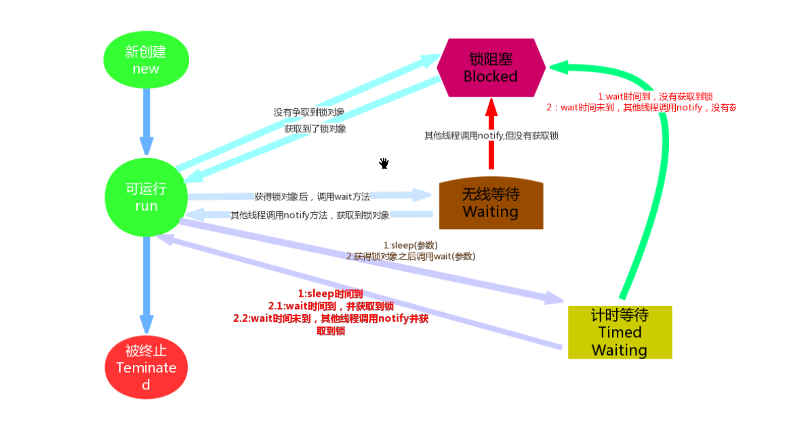

图中将线程状态分为:
初始化状态、就绪状态、运行状态、死亡状态、阻塞状态(阻塞在等待池、阻塞在锁池、其他情况阻塞)

#### (5)`ThreadGroup`线程组
Java中使用`ThreadGroup`来表示线程组,它可以对一批线程进行分类管理,对线程组的控管理,即同时控制线程组里面的这一批线程

用户创建的所有线程都属于指定线程组,如果没有显示指定属于哪个线程组,那么该线程就属于默认线程组(即名字叫"main"的线程组)
默认情况下,子线程和父线程处于同一个线程组

只有在创建线程时才能指定其所在的线程组,线程运行中途不能改变它所属的线程组,也就是说线程一旦指定所在的线程组,就直到该线程结束

##### <1>创建线程组
`java.lang.ThreadGroup`类

创建线程组的时候需要指定一个线程组的名字,或者创建线程组的时候指定名字和它的父线程组。
创建线程组的时候需要指定线程组名字和它的父线程组,如果不指定其父线程组,那么默认是父线程组是当前线程组。(类中提供俩种构造器)
`public ThreadGroup(String name);`
`public ThreadGroup(ThreadGroup parent, String name);`

例如:
```java
//获得当前线程的所属的线程组
ThreadGroup currentGroup = Thread.currentThread().getThreadGroup();

//默认其父线程组是currentGroup
ThreadGroup tg1 = new ThreadGroup("线程组1");

//指定其父线程组tg1
ThreadGroup tg2 = new ThreadGroup(tg1,"线程组1");
```
##### <2>线程和线程组
例如:
```java
//不指定则属于默认线程组
Thread t1 = new Thread("t1线程");

//也可以指定线程组
ThreadGroup tg = new ThreadGroup("我的线程组");
Thread t1 = new Thread(tg,"t1线程");
```
#### (6)`Thread`类中常用方法
注:Thread类中有一些方法已经被标注为过时,不推荐使用.
官网中还给出了弃用哪些方法的原因:
[官网]: http://docs.oracle.com/javase/1.5.0/docs/guide/misc/threadPrimitiveDeprecation.html
##### <1>静态方法
###### 1>返回当前线程的线程组中活动线程的数目
`public static int activeCount()`

###### 2>返回对当前正在执行的线程对象的引用
`public static Thread currentThread()`

###### 3>将当前线程的线程组及其子组中的每一个活动线程复制到指定的数组中
`public static int enumerate(Thread[] tarray)`

###### 4>让当前线程在指定的毫秒数内休眠
`public static void sleep(long millis)`

###### 5>暂停当前运行的线程,让给其他线程使用CPU执行
`public static void yield()`

###### 6>判断当前线程先是否拿着指定的锁
`public static boolean holdsLock(Object obj)`

##### <2>非静态方法
###### 1>线程要执行的代码在此方法中
`public void run()`

注:我们并不能直接调用run方法,而且启动线程后让线程自动调用run方法

###### 2>线程启动时必须调用的方法
`public void start()`

###### 3>返回该线程的标识符
`public long getId()`
线程ID是一个正的long数,在创建该线程时生成。线程ID是唯一的,线程终止时,该线程ID可以被重新使用

###### 4>设置该线程的名称
`public void setName(String name)`

###### 5>返回该线程的名称
`public String getName()`

###### 6>设置线程的优先级
`public int setPriority()`

###### 7>返回线程的优先级
`public int getPriority()`

###### 8>返回该线程的状态
`public Thread.State getState()`

###### 9>返回该线程所属的线程组
`public ThreadGroup getThreadGroup()`

###### 10>测试线程是否处于活动状态
`public boolean isAlive()`

###### 11>将该线程标记为守护线程或用户线程
`public void setDaemon(boolean on)`
默认false表示用户线程

###### 12>测试该线程是否为守护线程
`public boolean isDaemon()`

###### 13>当前线程等待某个线程执行结束
`public void join()`

###### 14>给定一个等待的限定时间
`public void join(long millis)`

##### <3>容易混淆的方法
###### 1>中断线程
`public void interrupt()`

###### 2>测试线程是否已经中断
`public boolean isInterrupted()`

###### 3>测试当前线程是否已经中断
`public static boolean interrupted()`

如果线程a对象是处于阻塞状态的话,在线程b中调用`a.interrupt()`是会打断线程a的阻塞状态的(后抛出打断异常)

但是如果线程a对象是处于就绪等状态,在线程b中调用`a.interrupt()`只是会改变对象a内部的一个`boolean`类型标识,用来表示线程b想打断线程a

`isInterrupted`和`interrupted`的返回值就是这个`boolean`类型的值
区别在于静态方法`interrupted`在返回`boolean`值后,会把这个打断的标示符给清理掉,而非静态方法`isInterrupted`不会清理

也可以在自己的线程中调用自己的`interrupted`方法，效果和在其他线程中调用一样的，但是意义不同。
```java
//观察Thread类中的部分源码
public class Thread implements Runnable{
	public void interrupt() {
		if (this != Thread.currentThread()) checkAccess();

		synchronized (blockerLock) {
			Interruptible b = blocker;
			//判断当前线程是否是阻塞状态
			if (b != null) {
				// Just to set the interrupt flag
				interrupt0();
				b.interrupt(this);
				return;
			}
		}
		//如果不是阻塞状态就只set一下打断的flag
		interrupt0();
	}
	private native void interrupt0();

	public boolean isInterrupted() {
		return this.isInterrupted(false);
	}

	public static boolean interrupted() {
		return currentThread().isInterrupted(true);
	}
	private native boolean isInterrupted(boolean ClearInterrupted);
}
```
#### (7)数据共享
局部变量`一定不是`多个线程共享的数据
静态变量`一定是`多个线程共享的数据
实例变量`可能是，也可能不是`多个线程共享的数据，取决于编写代码的结构

思考:共享数据在多线程环境中会有什么问题?
多个线程并发访问这段代码，代码中的共享数据，会出现很多难以预料的情况
#### (8)非线程安全和线程安全
在多个线程并发访问的环境中对共享数据进行操作的代码或方法中会出现其结果不确定的情况,那么这段代码或者方法就是非线程安全的。
产生这种情况的原因大多是因为一个线程在执行这段代码或方法的时间内,另一个线程也是有可能执行这段代码或方法的(抢夺时间片),从而造成了这段代码或者方法中对共享数据操作的结果

如果一段代码在多个线程并发访问的时候是 非线程安全的,那么就可以采用把这段代码进行线程同步的方式进行处理,最终把这段代码变为线程安全的

线程同步其实就是本来多个线程并发访问这段代码的,同步后就变成了一个线程一个线程的按顺序线程访问这段代码,这样以来一个线程在执行这段代码期间,就不用担心其他线程会来打扰自己在这段代码中对共享数据的操作了。

注:线程同步是牺牲了效率换来了安全

#### (9)`synchronized`
java采用给代码加锁的形式，实现这块代码的线程同步效果。
使用`synchronized`关键字来实现线程同步的效果。
`synchronized`关键字可以用来修饰方法,也可以直接作用到某段代码上
例如,修饰方法（对方法加锁）:
修饰非静态方法和修饰静态方法
修饰静态方法，对方法中的代码全部加锁，固定的对象来充当这把锁，默认是this
修饰非静态方法，对方法中的代码全部加锁，固定的对象充当这把锁，默认使用当前类的class对象
```java
public class Test{
	private int x;
	public synchronized void test(){
		String name = Thread.currentThread().getName();
		for(int i=0;i<100;i++){
			x++;
		}
		System.out.println(name+": x="+x);
	}
}
```
例如,修饰代码块（对代码块加锁）:
可以给指定的哪几行代码加锁，可以指定哪个对象来充当这把锁。
```java
public class Test{
	private int x;
	public void test(){
		String name = Thread.currentThread().getName();
		synchronized(this){
			for(int i=0;i<100;i++){
					x++;
			}
		}
		System.out.println(name+": x="+x);
	}
}
```
`synchronized`关键字是加锁的意思,用它来修饰方法就表示给该方法加了锁,从而达到线程同步的效果;用它来修饰代码块就表示给该代码块加了锁,从而达到线程同步的效果。
注:java中任何对象都可以当做锁,能否拿到锁就决定了一个线程是否能进入到被锁的代码块中去执行代码

同一把锁可以同时加在不同的方法上或者代码上。

任意对象都可以当做这把锁，但是能不能锁得住这个加锁的代码块，看的是这几个线程在访问的时候，争夺的是不是同一把锁。

#### (10)线程通信
在`Object`中,三个`wait`方法(重载),`notify()`以及`notifyAll()`方法都是和线程通信有关的方法

注:这几个方法只能是在`synchronized`关键字使用时,被用来充当锁的对象才能调用,并且只能再加锁的范围内调用,否则其他情况调用会抛出异常。
##### <1>`wait()`方法
当一个线程拿到锁,进入到被锁的代码中执行代码时候,突然调用了锁的wait方法,那么这个线程这时候就交出CPU使用权,并且把锁方法交出,然后由运行状态进入到等待池中,进行"无限期"的等待,直到有其他线程对象调用了特定的打断/唤醒方法后,这个线程才能从等待池中出来。
注:如果使用有参数的wait方法,那就是"有限期"的等待
例如:
```java
//默认使用this充当这把锁
public synchronized void test(){
	int a = 1;
	if(a>0){
		try {
			//只能使用锁调用wait方法
			this.wait();
		} catch (InterruptedException e) {
			e.printStackTrace();
		}
	}
}
```
##### <2>`notify()`方法
当一个线程在被锁的状态中使用锁调用了`notify()`方法,那么可以随机唤醒在等待池等待这把锁的一个线程(如果有多个随机都等这同一把锁的话),这个被唤醒的线程就会从等待池进入到锁池中,如果之后某个时刻这个线程发现等待的池已经被其他线程释放了,那么它就会从锁池进入到就绪状态,准备争夺CPU的使用权并且争取这把锁。
例如:
```java
//默认使用this充当这把锁
public synchronized void test(){
	int a = 1;
	if(a>0){
		try {
			//只能使用锁调用notify方法
			this.notify();
		} catch (InterruptedException e) {
			e.printStackTrace();
		}
	}
}
```
##### <3>`notifyAll()`方法
与`notify`类似,不同之处在于,`notifyAll()`方法会叫醒等待池中等待`同一把锁`的所有线程对象。
例如:
```java
//默认使用this充当这把锁
public synchronized void test(){
	int a = 1;
	if(a>0){
		try {
			//只能使用锁调用notifyAll方法
			this.notifyAll();
		} catch (InterruptedException e) {
			e.printStackTrace();
		}
	}
}
```
核心：是不是争夺的同一个锁对象
#### (11)死锁
在程序中是不允许出现死锁情况,一旦发生那么只能手动停止JVM的运行,然后查找并修改产生死锁的问题代码。

简单的描述死锁就是:俩个线程t1和t2,t1拿着t2需要等待的锁不释放,而t2又拿着t1需要等待的锁不释放。

注:可以通过jconsole查看到线程死锁的情况
例如:
```java
public class ThreadDeadLock extends Thread{
	private Object obj1;
	private Object obj2;

	public ThreadDeadLock(Object obj1,Object obj2) {
		this.obj1 = obj1;
		this.obj2 = obj2;
	}

	public void run() {
		String name = Thread.currentThread().getName();
		if("Thread-0".equals(name)){
			while(true){
				synchronized (obj1) {
					synchronized (obj2) {
						System.out.println(name+" 运行了..");
					}
				}
			}
		}
		else{
			while(true){
				synchronized (obj2) {
					synchronized (obj1) {
						System.out.println(name+" 运行了..");
					}
				}
			}
		}
	}

	public static void main(String[] args) {
		Object obj1 = new Object();
		Object obj2 = new Object();
		Thread t1 = new ThreadDeadLock(obj1,obj2);
		Thread t2 = new ThreadDeadLock(obj1,obj2);
		t1.start();
		t2.start();
	}
}
```

## 二十三.`File`类和递归
### 2.递归

# 二十四.`IO`控制流
## (一).`IO`流概述
**流**是个抽象的概念,是对输入输出设备的抽象,Java程序中,对于数据的`输入/输出`操作都是以**流**的方式进行。设备可以是文件,网络,内存等
流具有方向性,至于是输入流还是输出流则是一个相对的概念,一般以程序为参考,如果数据的流向是程序至设备,我们成为输出流,如果数据的流向是设备至程序称为输入流。
数据以二进制的形式在程序与设备之间流动传输,就想水在管道里流动一样,所以就把这种数据传输的方式称之为输入流输出流
## (二).`IO`流的种类
java中常用的`IO`流都在`java.io;`包下，一般情况下，使用时，都是成对使用的，既有输入，又有输出.
`IO`流的根源是四个基本的`抽象`父类，其他的流都是直接或者间接的继承(extends)于这个父类.
字节输入流:`InputStream`
字节输出流:`OutputStream`
字符输入流:`Reader`
字符输出流:`Writer`
#### (1).按照流的方向分
从外部引入程序内部，就是输入流
从程序内部写出去，就是输出流
#### (2).按照处理数据的单位分
处理文件的基本单位是字节，处理文本的基本单位是字符，所以分为字节流和字符流
字节流处理的最小单位是一个字节`1byte = 8bit`
字符流处理的最小单位是一个字符`1char = 2byte = 16bit`
#### (3).按照功能分
可以直接从一个数据源头进行读写操作的流叫节点流
对节点流进行封装，封装后可以增加节点流的功能，这类流叫做处理流，又称功能流，包装流
#### (4).其他分类
节点流和处理流还有众多子类，比如:对象流、缓冲流，压缩流、文件流等
## (三).`File`类
包`java.io.File;`,`File`类型的对象表示一个文件，或者一个目录
#### (1).常用方法
`public File(String pathname);` 通过路径名创建一个文件对象(这个文件是否存在，都不影响File对象的创建)
`String getAbsolutePath();`     返回此`File`的绝对路径名字符串
`String getPath();`             将此`File`转换为路径名字符串
`String getName();`             返回由此`File`表示的文件或目录的名称
`File getParentFile();`         返回此`File`表示的文件或目录的父目录的`File`对象
`String getParent();`           返回此`File`表示的文件或目录的父目录的路径名称字符串
`long length();`                返回由此`File`表示的文件的长度
`boolean exists();`             此`File`表示的文件或目录是否实际存在
`boolean isDirectory();`        此`File`表示的是否为目录
`boolean isFile();`             此`File`表示的是否为文件
`boolean canRead();`            此`File`表示的文件是否可读
`boolean canWrite();`           此`File`表示的文件是否可写
`boolean canExecute();`         此`File`表示的文件是否可执行
`boolean createNewFile();`      当且仅当具有该名称的文件尚不存在时，创建一个新的空文件。
`boolean delete();`             删除由此`File`表示的文件或目录(目录必须为空，才能删除)。
`boolean mkdir();`              创建由此`File`表示的目录。
`boolean mkdirs();`             创建由此`File`表示的目录，包括任何必需但不存在的父目录。
#### (2).目录遍历
`String[] list();`       返回一个`String`数组，表示该`File`目录中的所有子文件或目录。该数组可以为`null`
`File[] listFiles();`    返回一个`File`数组，表示该`File`目录中的所有的子文件或目录。数组为空会抛出空指针异常.
#### (3).`File`类使用举例
```java
package com.lele.test;

import java.io.File;
import java.io.FilenameFilter;
import java.io.IOException;

public class FileTest {

	public static void main(String[] args) {
		// 文件路径
		String filePath = "src/com/lele/test/test.txt";
		// 创建File对象
		File file = new File(filePath);

		System.out.println("绝对路径:" + file.getAbsolutePath());
		System.out.println("路径:" + file.getPath());
		System.out.println("文件名:" + file.getName());

		// 父目录文件对象
		File parentFile = file.getParentFile();
		System.out.println("父目录文件对象:" + parentFile);

		System.out.println("父目录：" + file.getParent());

		long length = file.length();
		System.out.println("文件长度：" + length);

		// 判断文件是不是存在
		if (file.exists()) {
			System.out.println("file文件存在！");
		} else {
			System.out.println("file文件不存在！");
			System.out.println("file是不是目录：" + file.isDirectory());
			System.out.println("file是不是文件：" + file.isFile());

			System.out.println("文件是不是可读：" + file.canRead());
			System.out.println("文件是不是可写：" + file.canWrite());
			System.out.println("文件是不是可执行：" + file.canExecute());

			try {
				// 创建文件
				boolean createNewFile = new File("src/com/lele/test/new.txt").createNewFile();
				System.out.println("新文件是否创建？" + createNewFile);

				// 删除文件
				boolean delete = file.delete();
				System.out.println("删除文件是否成功？" + delete);

				// 创建目录
				boolean mkdir = new File("src/com/lele/test/mkdir").mkdir();
				System.out.println("目录创建是否成功?" + mkdir);

				// 创建多级目录
				boolean mkdirs = new File("src/com/lele/test/mkdirs/b/vd/f/g/g/t/d").mkdirs();
				System.out.println("多级目录创建是否成功" + mkdirs);

				// 目录遍历
				File p = new File("src/com/lele/test/");

				// String 类型的数组
				String[] list = p.list();
				for (String s : list) {
					System.out.println(s);
				}

				System.out.println("----------------------------");
				// File类型的数组
				File[] files = p.listFiles();
				for (File f : files) {
					System.out.println(f);
				}

				System.out.println("-----------------------------");
				// 筛选目录
				String[] listScr = p.list(new FilenameFilter() {

					@Override
					public boolean accept(File dir, String name) {
						/*
						 * 返回true，所有文件都要，不筛选
						 */

						// 指定要筛选的后缀名
						return name.endsWith("java");
					}
				});
				// 遍历筛选出来的文件
				for (String s : listScr) {
					System.out.println(s);
				}

			} catch (IOException e) {
				e.printStackTrace();
			}

		}

	}

}
/*
首次运行代码执行结果
绝对路径:D:\Documents\00_appWorkSpaces\workspace-sts-3.9.8.RELEASE\JD1909\src\com\lele\test\test.txt
路径:src\com\lele\test\test.txt
文件名:test.txt
父目录文件对象:src\com\lele\test
父目录：src\com\lele\test
文件长度：0
file文件不存在！
file是不是目录：false
file是不是文件：false
文件是不是可读：false
文件是不是可写：false
文件是不是可执行：false
新文件是否创建？true
删除文件是否成功？false
目录创建是否成功?true
多级目录创建是否成功true
FileTest.java
mkdir
mkdirs
new.txt
Person.java
----------------------------
src\com\lele\test\FileTest.java
src\com\lele\test\mkdir
src\com\lele\test\mkdirs
src\com\lele\test\new.txt
src\com\lele\test\Person.java
-----------------------------
FileTest.java
Person.java
 */
```
## (四).字节流
一切文件数据(文本、图片、视频等)在存储时，都是以二进制数字的形式保存，都一个一个的字节，那么传输时一
样如此。所以，字节流可以传输任意文件数据。在操作流的时候，我们要时刻明确，无论使用什么样的流对象，底
层传输的始终为二进制数据。
### 1.`InputStream`和`OutputStream`字节输入输出流
`InputStream`和`OutputStream`是最基本的字节输入输出流，其余字节输入输出流都是其子类型，一般情况下都是成对使用，`Input`负责读取，`Output`负责写入
#### (1)`InputStream`的常用方法
`int read();`                            从输入流中读取数据的下一个字节，如果到达流的末尾，则返回`-1`.
`int read(byte[] buf);`                  把读到的字节数据存放到字节数组`buf`中，并返回本次读到了多少个字节
`int read(byte[] buf,int off,int len);`  把读到的字节数据存放到字节数组`buf`中，同时指定开始存的位置，以及最大字节数，并返回本次读到了多少个字节
`int available();`                       返回此输入流下一个调用的方法可以不受阻塞地从此输入流读取(或跳过)的估计字节数
`long skip(long n);`                     跳过此输入流中数据的`n`个字节
`void mark(int readlimit);`              在该输入流中标记`readlimit`位置
`void reset();`                          将此流重新定位到最后一次对此输入流调用`mark`方法时的位置
`boolean markSupported();`               判断该输入流是否支持`mark`和`reset`方法
`void close();`                          关闭此输入流，并释放与该流关联的所有系统资源
#### (2)`OutputStream`的常用方法
`void write(int b);`                     将指定的字节写出此输出流
`void write(byte[] buf);`                将字节数组`buf`中的所有字节用此输出流写出，每次写出`buf.length`个字节的数据
`void write(byte[] buf,int off,int len);`将字节数组`buf`中的字节用此输出流写出,同时指定开始位置及最大字节数
`void flush();`                          刷新此输出流,并强制写出所有缓冲的输出字节
`void close();`                          关闭此输出流并释放与此流有关的所有系统资源
### 2.`System.in`和`System.out`标准输入输出
`System`类的部分源码
```java
// System类
public final class System{
	//标准输入流
	public final static InputStream in = null;
	//标准输出流。
	public final static PrintStream out = null;
	//标准错误输出流
	public final static PrintStream err = null;

	// 标准流的实现
	public static void setIn(InputStream in){..}
	public static void setOut(PrintStream out){..}
	public static void setErr(PrintStream err){..}
}
```
`System.out.println(System.in.getClass());`  标准输入流会默认从控制台读取数据
`System.out.println(System.out.getClass());` 标准输出流会默认把数据输出到控制台
`System.err.println(System.err.getClass());` 标准错误输出流默认把数据输出到控制台，只是开发平台工具会把输出格式渲染成红色
上面三条输出结果为:
```java
class java.io.BufferedInputStream
class java.io.PrintStream
class java.io.PrintStream  //红色
```
### 3.`ByteArrayInputStream`和`ByteArrayOutputStream`字节数组输入输出流
`ByteArrayInputStream`继承`InputStream`,可以从数组中读取字节数据，重写了`InputStream`中的方法
`ByteArrayOutputStream`继承`OutputStream`,可以把字节数据写出到字节数组里，重写了`OutputStream`中的方法
### 4.`FileInputStream`和`FileOutputStream`文件字节输入输出流
#### (1)`FileInputStream`文件字节输入流
包名`java.io.FileInputStream`,以字节的形式读取文件
##### <1>构造方法
`FileInputStream(File file)`        通过文件系统中的`File`对象，创建与实际文件的字节输入连接
`FileInputStream(String filePath)`  通过字符串形式的路径名，创建与实际文件的字节输入连接
如果创建了一个流对象，就必须传入一个文件的路径，如果在该路径下找不到该文件，就会抛出`FileNotFoundException`(文件找不到)。
##### <2>调用方法
`int read();`                             每次读取一个字节的数据，把返回的字节数据提升为`int`类型，读到文件末尾就返回`-1`.
`int read(byte[] buf);`                   每次读取`buf.length`长度个字节到`buf`数组中，返回读取到的有效字节个数，读到文件末尾时，返回`-1`.
`int read(byte buf[], int off, int len);` 每次读取`buf.length`个字节，从`off`(偏移`off`长度个字节)开始读，读取`len`个字节，读到的数据保存在`buf`数组中，返回`int`类型的有效字节数`len`或者(buf, off, len).简单有效理解从`buf`数组里从`off`索引位置替换`len`个长度的数据,替换后的数据为`len`
`long skip(long n);`                      跳过`n`个字节.
`int available();`                        返回不受阻塞的一次读取了多少字节数据
`close();`                                关闭流，释放资源
##### <3>举例
```java
package com.lele.test;

import java.io.File;
import java.io.FileInputStream;
import java.io.IOException;
import java.util.Arrays;

@SuppressWarnings("all")
public class IOTest {

	// 静态方法，传入文件路径，读取字节
	public static void inputDemo1(String filename) throws IOException {
		FileInputStream inread = null;
		// 通过File对象创建输入流
		File file = new File(filename);
		FileInputStream in = new FileInputStream(file);

		// 通过String类型的路径名创建流
		String filePath = filename;
		inread = new FileInputStream(filePath);

		// 读取一个字节
		int read = inread.read();
		// 转成字符输出
		System.out.println("读取一个字节:" + (char) read);

		/*
		 * 循环读取数据，读到-1就停止，每次读一个字节
		 */
		// 接收读到的数据
		int data = -1;
		// 循环读取，没读完，就继续读。
		while ((data = in.read()) != -1) {
			// 读到的数据,转成字符输出
			System.out.print("循环读取:" + (char) data);
		}

		// 关闭流
		if (inread != null)
			inread.close();
		in.close();

	}

	// 静态方法，传入文件路径，读取字节
	public static void inputDemo2(String filename) throws IOException {
		FileInputStream inread = null;
		// 通过File对象创建输入流
		File file = new File(filename);
		FileInputStream in = new FileInputStream(file);

		// 通过String类型的路径名创建流
		String filePath = filename;
		inread = new FileInputStream(filePath);

		// 读取的数据放到字节数组里,每次读取buf.length个长度
		byte[] buf = new byte[2];
		// 读取到的有效字节数，返回-1表示读完
		int len = inread.read(buf);
		// 转成字符串输出
		System.out.println(new String(buf) + " len=" + len);

		byte[] b = new byte[3];
		// 三参方法，从1个字节后开始读，读2个字节
		len = inread.read(b, 1, 2);
		// 读到的数据转成字符串输出
		System.out.println(new String(b));
		// 遍历读到的数组
		System.out.println(Arrays.toString(b));
		// 读取长度
		System.out.println(len);

		System.out.println("---------------");
		/*
		 * 循环读取数据，读到-1就停止，每次读3个字节
		 */
		byte[] s = new byte[3];
		while ((len = (in.read(s))) != -1) {
			// 转成字符串输出
			System.out.println(new String(s));
			// 打印每次读到的有效字节
			System.out.println(len);
		}

		// 上面读到的数据有问题，读到的剩余字节并不能覆盖数组中的所有数据，所以需要根据读到的有效字节数打印读到的数据
		System.out.println("--------------");
		// 数据已经读完，重新用流读取
		in = new FileInputStream(file);
		while ((len = (in.read(s))) != -1) {
			// 偏移量为0，每次只打印读到的有效字节数
			System.out.print(new String(s, 0, len));
		}

		// 接收读到的数据
		// 循环读取，没读完，就继续读。

		// 关闭流
		if (inread != null)
			inread.close();
		in.close();

	}

	// 静态方法，传入文件路径，读取字节
	public static void inputDemo3(String filename) throws IOException {
		FileInputStream inread = null;
		// 通过File对象创建输入流
		File file = new File(filename);
		FileInputStream in = new FileInputStream(file);

		// 通过String类型的路径名创建流
		String filePath = filename;
		inread = new FileInputStream(filePath);

		// 跳过3个字节
		inread.skip(3);

		// 读取一个字节
		int read = inread.read();
		// 转成字符输出
		System.out.println((char) read);

		// 关闭流
		if (inread != null)
			inread.close();
		in.close();

	}

	public static void main(String[] args) {
		// 处理方法抛出的异常
		try {
			// 文件路径
			String filename = "src/com/lele/test/test.txt";
			// 调用静态方法，传入文件路径
			inputDemo1(filename);

			System.out.println("\r\n----------调用方法分隔------------");

			// 调用静态方法，传入文件路径
			inputDemo2(filename);

			System.out.println("\r\n----------调用方法分隔------------");

			// 调用静态方法，传入文件路径
			inputDemo3(filename);
		} catch (IOException e) {
			e.printStackTrace();
		}

	}

}
/*
读取一个字节:a
循环读取:a循环读取:b循环读取:c循环读取:d循环读取:e
----------调用方法分隔------------
ab len=2
[空格]cd
[0, 99, 100]
2
---------------
abc
3
dec
2
--------------
abcde
----------调用方法分隔------------
d
 */
```
#### (2)`FileOutputStream`文件字节输出流
包名`java.io.FileOutputStream`以字节的形式，将数据写出到文件
##### <1>构造方法
`FileOutputStream(File file);`    通过`File`对象创建输出流，将数据写出到`File`对象创建的文件中
`FileOutputStream(String name);`  通过文件路径创建输出流，将数据写出到此路径下的文件中
`FileOutputStream(File file, boolean append);`通过`File`对象创建输出流，将数据写出到`File`对象创建的文件中,并指定是否追加,`true`追加，`false`覆盖
`FileOutputStream(String name, boolean append);`通过文件路径创建输出流，将数据写出到此路径下的文件中,并指定是否追加,`true`追加，`false`覆盖
创建流对象时，必须传入一个文件路径。该路径下，如果没有这个文件，会创建该文件。如果有这个文件，会清空这个文件的数据.
##### <2>调用方法
`write(int b);`每次写出一个字节的数据，`int`类型有4个字节，但是只会写出去一个字节
`write(byte[] buf);` 每次写出一个字节数组的数据，写出长度为`buf.length`.
`write(byte[] buf, int off, int len);` 每次写出`buf`数组中从`off`索引开始的数据，写出`len`个长度

> **回车换行符**
> 回车符`\r` 回到一行的开头(return)
> 换行符`\n` 下一行(newline)
> Windows系统里,每行结尾是回车+换行,即`\r\n`
> Unix/Linux系统里,每行结尾只有换行,即`\n`
> Mac系统里,每行结尾是回车,即`\r`.从Mac OS X开始与Linux统一。

### 4.字符流
### 5.缓冲流
### 6.转换流
### 7.序列化
### 8.随机访问流


##### <5>
`ByteArrayInputStream`可以从数组中读取字节
`ByteArrayOutputStream`可以把字节写到对象中的缓冲区里面,其实就是一个字节数组

##### <6>`FileInputStream`和`FileOutputStream`
`FileInputStream`可以读取文件中的字节
`FileOutputStream`可以向文件中写进去字节

##### <7>`PipedInputStream`和`PipedOutputStream`
`PipedInputStream`管道字节输入流
`PipedOutputStream`管道字节输出流

注:使用时需要把俩个管道进行对接

##### <8>`ObjectInputStream`和`ObjectOutputStream`
在序列化中要使用的对象输入流和对象输出流,之后再来使用测试


#### (4)字节流中的常用处理流
也可以称为功能流或者包装流,因为它是对节点流进行包装的一种流,包装后可以增加节点流的功能。但是处理流本身并不能直接读写数据

`BufferedInputStream和BufferedOutputStream`
可以给字节流中的节点流提供代码缓冲区的输入/输出流
`DataInputStream和DataOutputStream`
可以给字节流中的节点流提供输入/输出java中不同类型的数据
`PrintStream`
`PrintStream`为其他输出流添加了功能，使它们能够方便地打印各种数据值表示形式

#### (5)字符流
##### <1>`Reader`
```java
public int read(){..}
public int read(char[] cbuf){..}
public abstract int read(char[] cbuf, int off,int len){..}

//指定缓冲区
//@since 1.5
public int read(CharBuffer target){..}

abstract public void close();
public long skip(long n){..}

public boolean markSupported(){..}
public void mark(int readAheadLimit){..}
public void reset(){..}

//Tells whether this stream is ready to be read
public boolean ready(){..}
```
##### <2>`Writer`
```java
public void write(int c){..}
public void write(char cbuf[]){..}
abstract public void write(char cbuf[], int off, int len);
public void write(String str){..}
public void write(String str, int off, int len){..}

//刷新流
abstract public void flush();
关闭写入流
abstract public void close();

//@since 1.5
//和out.write(c)的效果一样
public Writer append(char c){..}
public Writer append(CharSequence csq){..}
public Writer append(CharSequence csq, int start, int end){..}
```
##### <3>`CharArrayReader`和`CharArrayWriter`
`CharArrayReader`可以读取字符数组中的内容
`CharArrayWriter`可以向字符数组中写内容

##### <4>`FileReader`和`FileWriter`
`FileReader`读取文件内容的便捷类,`InputStreamReader`的子类
`FileWriter`写入文件内容的便捷类,`OutputStreamWriter`的子类

##### <5>`PipedReader`和`PipedReader`
`PipedReader`管道字符输入流
`PipedReader`管道字符输出流

##### <6>`BufferedReader`和`BufferedWriter`
这个俩个流属于处理流,它们本身并不能读取数据,它们的作用是包装在其他节点流上面,为其提供额外的功能

##### <7>`PrintWriter`
一般会把`BufferedReader`和`PrintWriter`配合在一起使用,因为`BufferedReader`可以一次读一行字符串,而`PrintWriter`可以一次写一行字符串(自动换行)。


#### (6)转换流
`InputStreamReader`和`OutputStreamWriter`是一对名字中既有`Stream`,又有`Reader`或`Writer`的流,因为它们是转换流,负责把一个字节流转换为字符流。所以它们是字节流和字符串之间的桥梁.
注:在把字节流转换为字符流的过程中,还可以指定字符编码,避免乱码的出现。

#### (7)对象流
##### <1>序列化和反序列化
Java中的序列化是指把Java对象转换为字节序列的过程
`对象---序列化--->01010101`
Java中的反序列化是指把字节序列恢复为Java对象的过程
`01010101---反序列化--->对象`

思考:为什么需要序列化和反序列化?


##### <2>如何实现序列化和反序列化
使用对象流即可实现对象的序列化和反序列化
`ObjectOutputStream`类中的方法可以完成对象的序列化:
`public final void writeObject(Object obj){..}`

`ObjectInputStream`类中的方法可以完成对象的反序列化:
`public final Object readObject(){..}`

注:这俩个对象流都属于字节流

##### <3>序列化的要求
只有实现了`java.io.Serializable`接口的类的对象才可以被序列化,否则序列化时会报错

思考:测试序列化版本号的作用是什么?

##### <4>`transient`关键字
在对象序列化的时候,被`transient`修饰的属性的值,在序列化过程中是会被忽略掉的。

#### (8)随机访问流
`java.io.RandomAccessFile`类
`public class RandomAccessFile extends Object{..}`
这是个特殊的流,它不属于之前那些流的体系。

这个流的既可以用来读文件,也可以用来给文件中写内容,并且该类中的方法可以用来定位文件中的位置:
`public native void seek(long pos);`

构造器中需要设置该流的操作模式:
```java
//对文件只读
RandomAccessFile r = new RandomAccessFile(filePath,"r");
//对文件即可读又可写
//但是一旦确定了读或者写,那么就不能在变
RandomAccessFile rw = new RandomAccessFile(filePath,"rw");
```

## 24.网络编程
网络编程三要素：协议、IP、端口号;
#### (1)网络编程概述
计算机网络,是指将地理位置不同的具有独立功能的多台计算机及其外部设备,通过通信线路连接起来,在操作系统、网络管理软件及网络通信协议的管理和协调下,实现资源共享和信息传递的计算机系统。这个网络中包含的设备有:计算机、路由器、交换机等等

网络编程的实质就是已经建立好的计算机网络的基础之上,通过使用程序控制的特定方式,让两个(或多个)设备(例如计算机)之间进行数据传输

java中的网络编程并不要求我们之前对计算机网络的知识有很深入的研究,只需对网络的概念有基本的认识,并了解IP地址、端口号、URL等内容,这样就能够学习并使用JDK中提供的网络编程的API

java中和网络编写相关的API都在`java.net`包下面

#### (2)OSI七层模型和TCP/IP四层模型
java主要做应用层。
##### <1>`OSI`七层模型
开放系统互连参考模型 (Open System Interconnect 简称OSI)是国际标准化组织(ISO)和国际电报电话咨询委员会(CCITT)联合制定的开放系统互连参考模型,为开放式互连信息系统提供了一种功能结构的框架。
它从低到高共七层分别是：物理层、数据链路层、网络层、传输层、会话层、表示层和应用层。

ISO制定的OSI参考模型的过于庞大和复杂。为此,由技术人员自己开发的TCP/IP协议栈获得了更为广泛的应用。

##### <2>`TCP/IP`四层模型
TCP/IP协议栈是美国国防部高级研究计划局计算机网(Advanced Research Projects Agency Network,ARPANET)和其后继因特网使用的参考模型。ARPANET是由美国国防部(U.S．Department of Defense,DoD)赞助的研究网络。最初,它只连接了美国境内的四所大学。随后的几年中,它通过租用的电话线连接了数百所大学和政府部门。最终ARPANET发展成为全球规模最大的互连网络(也就是现在的因特网)。最初的ARPANET于1990年永久性地关闭。　

`TCP/IP`参考模型分为四层：应用层、传输层、网络层和网络接口层.

注:TCP/IP参考模型也可以分为五层,就是再把网络接口层分为数据链路层和物理层。
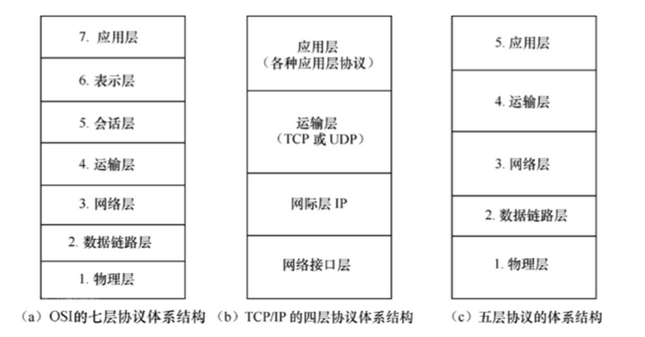
#### (3)网络通信协议
##### <1>网络通信协议
通信协议是对计算机之间数据共享需要遵守的规则，只有遵守这些规则，计算机之间才能进行通信。这就好比在道路中行驶的汽车一定要遵守交通规则一样，协议中对数据的传输格式、传输速率、传输步骤等做了统一规定，通信双方必须同时遵守，最终完成数据交换。
##### <2>`TCP`和`UDP`协议
###### 1>`TCP`协议
`TCP/IP`协议:传输控制协议/因特网互联协议(Transmission Control Protocol/Internet Protocol)，是Internet最基本、最广泛的协议。它定义了计算机如何连入因特网，以及数据如何在它们之间传输的标准。它的内部包含一系列的用于处理数据通信的协议，并采用了4层的分层模型，每一层都呼叫它的下一层所提供的协议来完成自己的需求。
`java.net`包中提供了两种常见的网络协议的支持。

传输控制协议(Transmission Control Protocol)。`TCP`协议是一个面向连接的、可靠的协议。`TCP`协议是面向连接的通信协议，即传输数据之前,在发送端和接收端建立逻辑连接，然后再传输数据，它提供了两台计算机之间可靠无差错的数据传输。

它将一台主机发出的字节流无差错地发往互联网上的其他主机。在发送端,它负责把上层传送下来的字节流分成报文段并传递给下层。在接收端,它负责把收到的报文进行重组后递交给上层。TCP协议还要处理端到端的流量控制,以避免缓慢接收的接收方没有足够的缓冲区接收发送方发送的大量数据。

特点:传输效率低,可靠性强,用于传输可靠性要求高,数据量大的数据.例如:文件传输
> 三次握手：`TCP`协议中，在发送数据的准备阶段，客户端与服务器之间的三次交互，以保证连接的可靠。
> 第一次握手，客户端向服务器端发出连接请求，等待服务器确认。
> 第二次握手，服务器端向客户端回送一个响应，通知客户端收到了连接请求。
> 第三次握手，客户端再次向服务器端发送确认信息，确认连接。整个交互过程如下图所示。
> 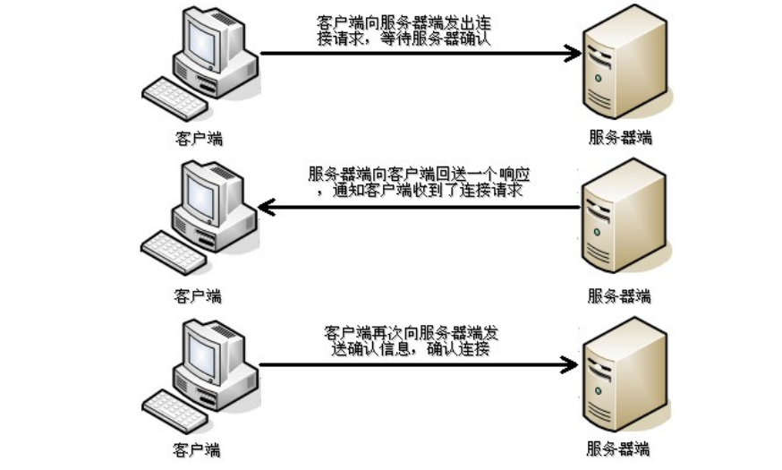
> 完成三次握手，连接建立后，客户端和服务器就可以开始进行数据传输了。由于这种面向连接的特性，`TCP`协议可以保证传输数据的安全，所以应用十分广泛，例如下载文件、浏览网页等。

###### 2>`UDP`协议
用户数据报协议(User Datagram Protocol)。UDP协议是一个不可靠的、面向无连接的协议。主要适用于不需要对报文进行排序和流量控制的场合。传输数据时，不需要建立连接，不管对方端服务是否启动，直接将数据、数据源和目的地都封装在数据包中，直接发送。每个数据包的大小限制在64k以内。它是不可靠协议，因为无连接，所以传输速度快，但是容易丢失数据。日常应用中,例如视频会议、QQ聊天等。
特点:与`TCP`特性恰恰相反,用于传输可靠性要求不高的数据.例如:视频聊天

##### <3>HTTP和TCP/IP以及DNS

`TPC/IP`协议是传输层协议,主要解决数据如何在网络中传输,而`HTTP`是应用层协议,主要解决如何包装数据。所以,`HTTP`协议是建立在`TCP/IP`之上的一个协议。

`DNS`(Domain names System)是处于应用层的"服务",提供域名到IP地址之间的解析服务。可以让我们访问网络中的一台主机的时候不需要使用IP地址而是使用便于我们记忆的域名。
互联网之间是通过IP地址通信的,但是IP地址并不符合认得记忆习惯,人喜欢记忆有意义的字词。所以DNS服务就为了解决这个问题的,可以让我们使用域名来访问网络中的一台主机。

`DNS`:域名解析器
`DNS`作用:将网址解析成`IP`

##### <4>其他协议
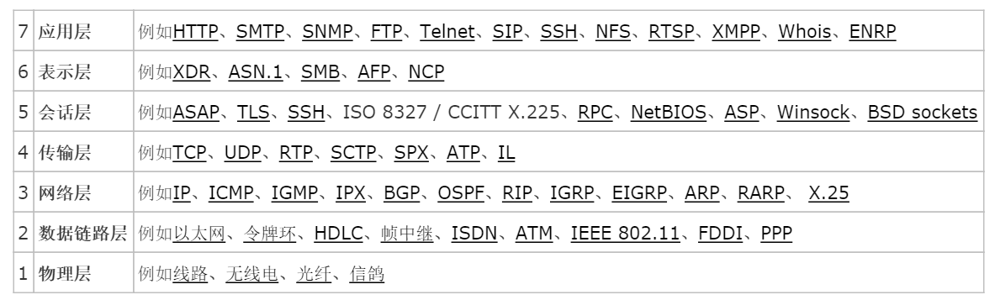
#### (4)软件架构
分为`C/S`架构和`B/S`架构
##### <1>`C/S`架构
全称为`Client/Server`结构，是指客户端和服务器结构。常见程序有QQ、迅雷等软件。
客户端包含一个或多个在用户的电脑上运行的程序,而服务器端可以使用`Socket`来实现,服务器端的程序通过`Socket`与客户端的程序通信。
C/S 架构也可以看做是胖客户端架构,因为客户端需要实现很多的业务逻辑和界面展示功能。这种架构中,作为客户端的部分需要承受很大的压力,因为显示逻辑和事务处理都包含在其中。
优点：
1>C/S架构的界面和操作可以很丰富。
2>安全性能可以很容易保证。
3>响应速度较快。

缺点：
1>适用面窄,通常用于局域网中。
2>用户群固定,由于程序需要安装才可使用,因此不适合面向一些不可知的用户。
3>维护成本高,软件进行一次升级,则所有客户端的程序都需要改变。
##### <2>`B/S`架构
全称为`Browser/Server`结构，是指浏览器和服务器结构。常见浏览器有谷歌、火狐等。
Browser指的是Web浏览器,极少数业务逻辑在前端实现,主要业务功能都在服务器端实现。B/S架构的系统无须特别安装,只有Web浏览器即可。(通常是要基于`HTTP`协议进行信息交互)
`B/S`架构中,显示逻辑交给了Web浏览器,业务逻辑处理在放在了服务器端,这样就避免了庞大的胖客户端,减少了客户端的压力。因为客户端包含的逻辑很少,因此也被成为瘦客户端。
优点：
1>客户端无需安装,有Web浏览器即可。
2>`B/S`架构可以直接放在广域网上,通过一定的权限控制实现多客户访问的目的,交互性较强。
3>`B/S`架构无需升级多个客户端,升级服务器即可。

缺点：
1>在跨浏览器上,`B/S`架构不尽如人意。
2>显示效果要达到`C/S`程序的程度需要花费不少精力。
3>在速度和安全性上需要花费巨大的设计成本。
4>客户端服务器端的交互一般是请求-响应模式,通常需要刷新页面
#### (5)网络编程三要素
##### <1>三要素:协议、`IP`、端口号
##### <2>协议
协议(protocol)，网络协议的简称，网络协议是通信计算机双方必须共同遵从的一组约定。如怎么样建立连接、怎么样互相识别等。只有遵守这个约定，计算机之间才能相互通信交流。
它的三要素是：语法、语义、时序。
网络协议，也可简称协议，通常由三要素组成：
1>语法：即数据与控制信息的结构或格式；
2>语义：即需要发出何种控制信息，完成何种动作以及做出何种响应；
3>时序（同步），即事件实现顺序的详细说明。
常见的协议:`http,https,ftp,file`
##### <3>`IP`
`IP`地址：指互联网协议地址（Internet Protocol Address），俗称`IP`。`IP`地址用来给一个网络中的计算机设备做唯一的编号。假如我们把“个人电脑”比作“一台电话”的话，那么“IP地址”就相当于“电话号码”。

`IP`地址分类
`IPv4`：是一个32位的二进制数，通常被分为4个字节，表示成a.b.c.d 的形式，例如192.168.65.100 。其中a、b、c、d都是0~255之间的十进制整数，那么最多可以表示42亿个。
`IPv6`：由于互联网的蓬勃发展，IP地址的需求量愈来愈大，但是网络地址资源有限，使得IP的分配越发紧张。有资料显示，全球IPv4地址在2011年2月分配完毕。为了扩大地址空间，拟通过IPv6重新定义地址空间，采用128位地址长度，每16个字节一组，分成8组十六进制数，表示成ABCD:EF01:2345:6789:ABCD:EF01:2345:6789，号称可以为全世界的每一粒沙子编上一个网
址，这样就解决了网络地址资源数量不够的问题。
##### <4>端口号
网络的通信，本质上是两个进程（应用程序）的通信。每台计算机都有很多的进程，那么在网络通信时，如何区分这些进程呢？
如果说IP地址可以唯一标识网络中的设备，那么端口号就可以唯一标识设备中的进程（应用程序）了。
端口号：用两个字节表示的整数，它的取值范围是0~65535。其中，0~1023之间的端口号用于一些知名的网络服务和应用，普通的应用程序需要使用1024以上的端口号。如果端口号被另外一个服务或应用所占用，会导致当前程序启动失败。
利用协议+IP地址+端口号 三元组合，就可以标识网络中的进程了，那么进程间的通信就可以利用这个标识与其它进程进行交互。
##### <5>常用操作
###### 1>查看本机IP地址
Windows:`ipconfig`
Linux:`ifconfig`
###### 2>查看网络是否连通
`ping [ip/域名]`
`ping 127.0.0.1`
特殊ip地址:127.0.0.1、localhost;本地回环地址，代表本机
###### 3>端口号占用
windows:使用管理员权限打开cmd命令提示符
```shell
//查看该端口对应进程的PID
user>netstat -aon|findstr [port]
TCP    0.0.0.0:[port]     0.0.0.0:0       LISTENING     [PID]
//使用命令结束该进程
user>taskkill /pid [PID]
//强制终止该进程
user>taskkill /F /pid [PID]
成功: 已终止 PID 为 [PID] 的进程。
```
ubuntu:打开终端
```sh
netstat -anp | grep :[port]
结果找到进程的PID [PID]
然后杀死这个进程
kill -9 [PID]
```


#### (6)基于`TCP`协议的网络编程
`java`的网络编程也可以称为套接字编程或者`socket`编程
##### <1>服务器
`java.net.ServerSocket`类
`ServerSocket`可以实现服务器端套接字。
```java
//此实例为基于TCP协议的多线程并发服务器
package com.lele.day22;

import java.io.BufferedReader;
import java.io.IOException;
import java.io.InputStreamReader;
import java.io.OutputStreamWriter;
import java.io.PrintWriter;
import java.net.ServerSocket;
import java.net.Socket;

public class ServerTest4 {
	// 浏览器连接:http://127.0.0.1:2019 Telnet:127.0.0.1 2019
	//浏览器连接服务器地址格式:http://[ip]:[port]
	//telnet连接格式:telnet:[ip] [port]
	//任何底层是TCP/IP协议封装的程序都可以连接

	public static void main(String[] args) {
		//指定服务器的端口号
		int port = 2019;
		// 服务器端
		ServerSocket server = null;

		// Sock表示网络通信端，表示连接到服务器的客户端
		Socket client = null;

        //new 一个线程组
		ThreadGroup myGroup = new ThreadGroup("线程组");

		try {
			//服务器使用ServerSocket
			server = new ServerSocket(port);

			// accept()方法会阻塞，等待客户端的连接
			// 方法的返回值，表示连接过来的客户端
			System.out.println("服务器端已经启动，监听端口" + port + "，正在等待客户端的连接...");
            //服务器实际上是一个死循环，持续等待客户端过来连接
			while (true) {
                //调用accept方法,表示有客户端连接
				client = server.accept();
				System.out.println("接收到客户端的连接" + client);
                //每连接一个客户端，给服务器起一个进程
				Thread t = new Handler4(client, myGroup);
				t.start();
			}
		} catch (IOException e) {
			// TODO Auto-generated catch block
			e.printStackTrace();
		} finally {
			try {
                //最后要把服务器的socket关闭
				if (server != null)
					server.close();
			} catch (Exception e2) {
				e2.printStackTrace();
			}
		}
	}
}

class Handler4 extends Thread {
	private Socket client; //连接过来的客户端
	private BufferedReader in;
	private PrintWriter out;

	public Handler4(Socket client, ThreadGroup group) {
		// 拿到IP地址和线程组
		super(group, client.getInetAddress().getHostAddress());
		this.client = client;
	}

    //重写线程run方法
	@Override
	public void run() {
		try {
            //client.getInputStream()从客户端获取输入流的方法，可以读取客户端发送的字节流
            // 字节转字符，字符转一行

            //InputStream is = client.getInputStream();
			//字节转字符
			//InputStreamReader isr = new InputStreamReader(is);
			//字符转一行
			//BufferedReader br = new BufferedReader(isr);
            //下面的一行代码，由上面三行去掉变量得来
			in = new BufferedReader(new InputStreamReader(client.getInputStream(), "GBK"));

            //client.getOutputStream()给客户端发送字节流的方法
			out = new PrintWriter(new OutputStreamWriter(client.getOutputStream(), "GBK"));

			this.send("请输入你的昵称：\t");

			String name = in.readLine();
			String msg = null;
            //持续读客户端发送的消息
			while ((msg = in.readLine()) != null) {
				//输入bye，三个字母，跳出循环，断开和这个客户端的连接
                if ("bye".equals(msg)) {
					this.sendToAll(name + "走了...");
					break;
				}

				this.sendToAll(name + ":" + msg);

			}
            //最后要关闭流，从小到大关
			if (in != null)
				in.close();
			if (out != null)
				out.close();
			if (client != null)
				client.close();
		} catch (Exception e) {
			// TODO: handle exception
		}

	}
//向客户端写输出的方法
	public void send(String msg) {
		out.println(msg);
		out.flush();
	}

	public void sendToAll(String msg) {
		ThreadGroup group = Thread.currentThread().getThreadGroup();
        //判断还活着的进程数
		Thread[] list = new Thread[group.activeCount()];
		int count = group.enumerate(list);
		if (count > 0) {
			for (Thread t : list) {
				((Handler4) t).send(msg);
			}
		}

	}

}
```
##### <2>客户端
`java.net.Socket`类
`socket`也称为套接字,可以用来表示两台机器间通信的端点,可以用`socket`对客户端进行实现
```java
//此客户端跟上面的服务器不配套！
package homework.day22;

import java.io.BufferedOutputStream;
import java.io.BufferedReader;
import java.io.File;
import java.io.FileInputStream;
import java.io.IOException;
import java.io.InputStream;
import java.io.InputStreamReader;
import java.net.Socket;

//此注解是屏蔽编辑器的黄色下划线警告
@SuppressWarnings("all")
public class Client {

	public void startClient() {
		// IP地址
        //这里的ip地址要写服务器所在电脑的ip地址
        //用于测试所用的ip地址为：127.0.0.1或者localhost
		String host = "127.0.0.1";
		// 端口号
        //端口号必须跟服务器保持一致，一般是0-65535，但是1000以下大部分被占用
		int port = 2019;
		try {
            //客户端new Socket套接字，跟服务器建立连接
			Socket socket = new Socket(host, port);
			// 文件路径
            //这里是相对路径，也可以是绝对路径
			File file = new File("src/homework/day22/img/img.jpg");

			// 读取计算机本地图片数据，图片只能使用字节读取
			InputStream in = new FileInputStream(file);

			// socket.getOutputStream()方法，给服务器写数据
			BufferedOutputStream netOut = new BufferedOutputStream(socket.getOutputStream());

			// socket.getInputStream()读服务器发过来的数据
			BufferedReader netIn = new BufferedReader(new InputStreamReader(socket.getInputStream()));

			// 判断文件是否存在？
			if (file.exists()) {
				System.out.println("文件是否存在？  " + file.exists());
				// 判断是不是java文件，并且小于2MB，2*1024*1024
                //file.getName().endsWith(".jpg")判断文件后缀名
				if (file.getName().endsWith(".jpg") && file.length() < 2 * 1024 * 1024) {
					System.out.println("文件符合要求");
					// 满足所有要求，可以上传
                    //每次写一个byte数组，2048大小
					byte[] buf = new byte[2048];
                    //返回-1表示读完，没返回，就持续的读
					while (in.read(buf) != -1) {
						System.out.println("正在发送图片...");
                        //把读到的字节给服务器写过去
						netOut.write(buf);
                        //写完刷新文件
						netOut.flush();
					}

				} else
					System.out.println("图片格式和大小不符合要求");

			} else
				System.out.println("图片不存在");

			System.out.println("图片发送完成");
			// 关闭socket
            //写完之后，关闭套接字Socket的输出流，告诉服务器，发完了
			socket.shutdownOutput();
			// 读服务器发过来的数据，一次读一行
			String recData = netIn.readLine();
			//System.err输出错误信息，在这里为了标识区分，err输出流输出的文字被编辑器渲染成了红色
            System.err.println("收到反馈：" + recData);

            //关闭各个流，以及socket
			in.close();
			netOut.close();
			netIn.close();
			socket.close();

		} catch (IOException e) {
			e.printStackTrace();
		}
	}

	public static void main(String[] args) {
		//上述代码在方法中实现，调用要new对象，对象调用方法
        new Client().startClient();
	}
}
```
#### (7)基于`UDP`协议的网络编程
(主要使用TCP编程，这部分了解)
`java.net.DatagramSocket`类
`UDP`协议编程中的套接字,可以用来实现客户端也可以实现服务器端
`java.net.DatagramPacket`类
此类表示UDP协议通信中所传输的数据报包

注:无论客户端还是服务器都会使用这个俩个类
##### <1>服务器
```java
public class UDPServerTest {
	private DatagramSocket socket;
	private DatagramPacket packet;
	private byte[] buf;

	public UDPServerTest(int port) {
		try {
			socket = new DatagramSocket(port);
			buf = new byte[512];
			packet = new DatagramPacket(buf, buf.length);
		} catch (SocketException e) {
			e.printStackTrace();
		}
	}

	public void start(){
		try {
			//使用packet接收数据
			socket.receive(packet);
			//也可以使用字节流从buf中读出数据
			System.out.println("服务器接收的数据为:"+new String(buf,0,packet.getLength()));
		} catch (IOException e) {
			e.printStackTrace();
		}finally {
			if(socket!=null)socket.close();
		}
	}
	public static void main(String[] args) {
		UDPServerTest t = new UDPServerTest(9999);
		t.start();
	}
}
```
##### <2>客户端
```java
public class UDPClientTest {
	private DatagramSocket socket;
	private DatagramPacket packet;

	public UDPClientTest() {
		try {
			socket = new DatagramSocket();
		} catch (SocketException e) {
			e.printStackTrace();
		}
	}

	public void send(String ip,int port){
		try {
			byte[] buf = "hello world 中国".getBytes();
			//打好数据报包,并指定要发生到的ip和端口
			packet = new DatagramPacket(buf,buf.length,InetAddress.getByName(ip), port);
			//发送数据
			socket.send(packet);
			System.out.println("客户端发送数据完毕");
		} catch (IOException e) {
			e.printStackTrace();
		}finally {
			if(socket!=null)socket.close();
		}
	}

	public static void main(String[] args) {
		UDPClientTest t = new UDPClientTest();
		String ip = "127.0.0.1";
		int port = 9999;
		t.send(ip, port);
	}
}
```
#### (8)`URI`和`URL`
`URI`是uniform resource identifier,统一资源标识符,用来唯一的标识一个资源。
`URL`是uniform resource locator,统一资源定位器,它是一种具体的URI,即URL可以用来标识一个资源,而且还指明了如何locate这个资源。
`URI`是以一种抽象的,高层次概念定义统一资源标识,而URL则是具体的一种资源标识的方式。
在Java的`URI`中,一个`URI`实例可以代表绝对的,也可以是相对的,只要它符合URI的语法规则。而URL类则不仅符合语义,还包含了定位该资源的信息,因此它不能是相对的,`schema`(访问协议)必须被指定。
```java
//举例:
ftp://ftp.is.co.za/rfc/rfc1808.txt
http://www.ietf.org/rfc/rfc2396.txt
mailto:John.Doe@example.com
telnet://192.0.2.16:80/
是`URI`也是`URL`


tel:+1-816-555-1212
urn:oasis:names:specification:docbook:dtd:xml:4.1.2
/user/1
只是URI
```
模拟浏览器向这个URL发送请求之后,接收到响应的内容态多,其结果保存到了文件里(url-response.txt)

注意:在eclipse中调整console中输出的最大行数,鼠标在控制台中右键,然后选择Preferences,然后把Limit console output的选择中的勾去掉即可
例如:
```java
public static void main(String[] args) {
	try {
    	URL url = new URL("https://www.baidu.com/?name=tom#N1");

    	//获取此URL的授权部分
    	System.out.println ("Authority = "+ url.getAuthority());
    	//获取与此 URL关联协议的默认端口号
    	System.out.println ("Default port = " +url.getDefaultPort ());
    	//获取此 URL的主机名
    	System.out.println ("Host = " +url.getHost ());
    	//获取此 URL 的路径部分
    	System.out.println ("Path = " +url.getPath ());
    	//获取此 URL 的端口号,如果未设置端口号,则返回 -1
    	System.out.println ("Port = " +url.getPort ());
    	//获取此 URL 的协议名称
    	System.out.println ("Protocol = " +url.getProtocol ());
    	//获取此 URL 的查询部分
    	System.out.println ("Query = " +url.getQuery ());
    	//获取此 URL的锚点
    	System.out.println ("Ref = " +url.getRef ());
    	//获取此 URL的 userInfo部分,如果没有用户信息,则返回 null
    	System.out.println ("User Info = " +url.getUserInfo ());

//--------------------模拟浏览器向此URL发生请求-------------------

    	HttpURLConnection httpConn =  (HttpURLConnection)url.openConnection();
    	httpConn.setRequestMethod("GET");
        httpConn.setRequestProperty("User-Agent", "Mozilla/5.0 (Windows NT 10.0; WOW64; rv:52.0) Gecko/20100101 Firefox/52.0");
    	InputStream is = httpConn.getInputStream();
		Reader in = new InputStreamReader(is);
		int data = -1;
		while ((data = in.read ()) != -1) {
			System.out.print((char)data);
		}
	} catch (IOException e) {
		e.printStackTrace();
	}finally {
		//close
	}
}

输出结果:
Authority = www.baidu.com
Default port = 443
Host = www.baidu.com
Path = /
Port = -1
Protocol = https
Query = name=tom
Ref = N1
User Info = null
```
## 25.`jdk`新特性
#### (1)接口的默认方法
Java 8允许我们给接口添加一个非抽象的方法实现,只需要使用`default`关键字即可,这个又叫做扩展方法
```java
//Formula表示一个设计 计算公式 的接口
public interface Formula {
	//计算
	public double calculate(int a);

	//开方
	default double sqrt(int a){
		return Math.sqrt(a);
	}
}

main{
    Formula f = new Formula() {
        @Override
        public double calculate(int a) {
            return a+1;
        }
    };
    System.out.println(f.calculate(4));
    System.out.println(f.sqrt(8));
}
```
注意:现在接口还可以存在静态方法,可以使用 接口名.静态方法名 的形式直接调用
#### (2)`Lambda`表达式
##### <1>认识`Lambda`表达式
例如:
```java
public class LambdaTest1 {

	public static void main(String[] args) {

		//假如一个list机会中的元素要排序
		List<String> list = Arrays.asList("hello","tom","apple","bbc");
		//之前的排序我们可以这样写
		Collections.sort(list, new Comparator<String>(){
			@Override
			public int compare(String o1, String o2) {
				return -o1.compareTo(o2);
			}
		});

		//使用Lambda表达式
		Collections.sort(list,(String s1,String s2)->{
			return s1.compareTo(s2);
		});

		//可以简写为
		//1.大括号里面就一句代码
		//2.编译器可以自动推导出参数类型
		Collections.sort(list,(s1,s2)->s1.compareTo(s2));

		System.out.println(list);

	}
}
```
##### <2>`Functional`接口
"函数式接口"是指仅仅只包含一个抽象方法的接口,每一个函数式接口类型的lambda表达式都会自动被匹配到这个抽象方法。因为 默认方法 不算抽象方法,所以你也可以给你的函数式接口添加默认方法。
我们可以将lambda表达式当作任意只包含一个抽象方法的接口类型,为了确保你的接口确实是达到这个要求的,可以接口上添加 @FunctionalInterface 注解,编译器如果发现你标注了这个注解的接口有多于一个抽象方法的时候会报错的。
例如:
```java
//这个注解不加也可以,加上只是为了让编译器检查
@FunctionalInterface
interface Action{
	public void run();

	default void doSomething(){
		System.out.println("doSomething..");
	}
}
//这个注解不加也可以,加上只是为了让编译器检查
@FunctionalInterface
interface Work<T,V>{
	public V doWork(T t);
}

public class LambdaTest2 {

	public static void test(Action a){
		a.run();
		a.doSomething();
	}

	public static void run(Work<String,Integer> a){
		int i = a.doWork("hello");
		System.out.println(i);
	}

	public static void main(String[] args) {

		//原来的内部类实现方式
		test(new Action(){
			@Override
			public void run() {
				System.out.println("run..");
			}
		});

		//lambda表达式方法
		test(()->System.out.println("run"));


		//也可以先创建对象
		Action a = ()->System.out.println("run...");
		System.out.println(a.getClass());
		test(a);

		//接口中有泛型也可以,只关注方法的参数和返回值
		Work<String,Integer> w = (v)->v.length();
		run(w);

		run((v)->v.length());

		//如果参数只有一个,那么还可以这样简写: 去掉小括号
		//注意代码就一句,作为返回值的话不用写return
		run(v->v.length());

		//有多句代码,就需要写{}了,并且需要写return
		run(v->{
			System.out.println("doWork..");
			return v.length();
		});

		//观察下面代码是什么意思
		run(v->1);
	}
}
```

注意:`lambda`表达式无法表示接口中默认方法的重写,`lambda`表达式只能去匹配对应接口中的唯一抽象方法。相当于`lambda`表达式只是对抽象方法的实现。

##### <3>方法与构造函数引用
Java 8 允许你使用`::`关键字来传递方法(静态方法和非静态方法)
例如:
```java
public class LambdaTest3 {

	public static void main(String[] args) {

		//正常是这样使用的
		Action3 a1 = v->"接收的数字为:"+v;
		System.out.println(a1.run(5));

		//使用Lambda引用Integer类中的静态方法
		Action3 a2 = Integer::toBinaryString;
		System.out.println(a2.run(10));

		//使用Lambda引用LambdaTest3类的对象中的非静态方法
		LambdaTest3 t = new LambdaTest3();
		Action3 a3 = t::test;
		System.out.println(a3.run(20));
	}

	public String test(int i){
		return "i="+i;
	}

}
	@FunctionalInterface
	interface Action3{
		public String run(int i);
	}
```
注:相当于使用lambda表达式引用另一个类中方法的实现来作为Action3接口中run方法的实现,前提是俩个方法的参数列表和返回类型必须一致

能引用Integer类中的静态方法toBinaryString的原因是:Action3接口中只有一个方法且方法的参数类型和返回值类型与Integer类中的静态方法toBinaryString的参数类型、返回类型是一致的.那么能引用非静态方法的原因也是这样

下面是一个接口中带泛型的时候例子: 可以使用`类名::非静态方法`的形式引用方法
注意：没有泛型的时候都也使用
```java
public class LambdaTest3Pro {

	public static void main(String[] args) {

		Model m = new Model();

		//这些写法都可以
		//相当于变量v是run方法中接收的形参,然后使用v调用它的方法,v的类型是Model,因为这里使用了泛型
		Action3Pro<Model> a1 = v->v.test1();
		Action3Pro<Model> a1 = v->v.test2("hello");
		Action3Pro<Model> a1 = v->v.test3();
		a1.run(m);

		//在这种情况下,还可以使用Model引用它的内部的方法
		//但是必须满足以下要求:
		//1.run方法参数类型【必须】Model
		//2.引用的方法【必须】是无参的
		//将来run方法中就自动会调用所传的对象m这个被引用的方法
		Action3Pro<Model> a2 = Model::test1;
		a2.run(m);
		或者
		Action3Pro<Model> a2 = Model::test3;
		a2.run(m);

		//编译报错,因为test2不是无参的
		Action3Pro<Model> a2 = Model::test2;
		a2.run(m);

	}
}

interface Action3Pro<T>{
	public void run(T t);
}

class Model{

	public void test1(){
		System.out.println("test1");
	}
	public void test2(String s){
		System.out.println("test2");
	}
	public int test3(){
		System.out.println("test3");
		return 1;
	}
}
```

Java 8 允许你使用`::`关键字来引用构造函数
```java
public class LambdaTest4 {

	public static void main(String[] args) {

		//Lambda表达式引用构造函数
		//根据构造器的参数来自动匹配使用哪一个构造器
		//这里执行create方法的时候会自动调用Action4类中的有参构造器
		Action4Creater a = Action4::new;
		Action4 a4 = a.create("zhangsan");
		a4.say();
	}
}

class Action4{
	private String name;
	public Action4() {

	}
	public Action4(String name) {
		this.name = name;
	}
	public void say(){
		System.out.println("name = "+name);
	}
}

interface Action4Creater{
	public Action4 create(String name);
}
```


##### <4>lambda表达式中的变量访问

```java
public class LambdaTest5 {
	private static int j;
	private int k;
	public static void main(String[] args) {
		LambdaTest5 t = new LambdaTest5();
		t.test();
	}

	public void test(){
		int num = 10;
		j = 20;
		k = 30;

		//lambda表达式中可以访问成员变量也可以方法局部变量
		Action5 a5 = (i)->System.out.println("操作后:i="+(i+num+j+k));
		a5.run(1);

		//但是这个被访问的变量默认变为final修饰的 不可再改变 否则编译不通过
		//num = 60;
		j = 50;
		k = 70;
	}
}

interface Action5{
	public void run(int i);
}
```

##### <5>`java.util.function.Predicate<T>`接口

`Predicate`接口是用来支持java函数式编程新增的一个接口,使用这个接口和lambda表达式就可以用更少的代码给API中的方法添加更多的动态行为。

```java
public class PredicateTest {
	public static void main(String[] args) {
		List<String> list = Arrays.asList("Java", "html5","JavaScript", "C++", "hibernate", "PHP");

		//全都显示
		filter(list, name->true);
		//全都不显示
		filter(list, name->false);

		//开头是J的语言
		filter(list,name->name.startsWith("J"));
		//5结尾的
		filter(list,name->name.endsWith("5"));

		//显示名字长度大于4
		filter(list,name->name.length()>4);

		System.out.println("-----------------------");
		//名字以J开头并且长度大于4的
		Predicate<String> c1 = name->name.startsWith("J");
		Predicate<String> c2 = name->name.length()>4;
		filter(list,c1.and(c2));

		//名字不是以J开头
		Predicate<String> c3 = (name)->name.startsWith("J");
		filter(list,c3.negate());

		//名字以J开头或者长度小于4的
		Predicate<String> c4 = name->name.startsWith("J");
		Predicate<String> c5 = name->name.length()<4;
		filter(list,c4.or(c5));

		//也可以直接使用Predicate接口中的静态方法
		//名字为Java的
		filter(list,Predicate.isEqual("Java"));

		//判断俩个字符串是否相等
		boolean test = Predicate.isEqual("hello").test("world");
		System.out.println(test);
	}
	public static void filter(List<String> list, Predicate<String> condition) {
		for(String name: list) {
			if(condition.test(name)) {
				System.out.println(name + " ");
			}
		}
	}

}
```

##### <6>`java.util.function.Function<T, R>` 接口

Function接口有一个参数并且返回一个结果,并附带了一些可以和其他函数组合的默认方法
compose方法表示在某个方法之前执行
andThen方法表示在某个方法之后执行
注意:compose和andThen方法调用之后都会把对象自己本身返回,这可以方便链式编程

```java
		public interface Function<T, R> {

			R apply(T t);

			default <V> Function<V, R> compose(Function<? super V, ? extends T> before) {
				Objects.requireNonNull(before);
				return (V v) -> apply(before.apply(v));
			}

			default <V> Function<T, V> andThen(Function<? super R, ? extends V> after) {
				Objects.requireNonNull(after);
				return (T t) -> after.apply(apply(t));
			}

			//注意: t->t是(t)->t的简写
			//t->t是作为方法identity的返回值的,也就是Function类型对象
			//类似于这样的写法:Function<Object, Object> f = t->t;
			//那么f.apply("test") 返回字符串"test"
			//传入什么则返回什么
			static <T> Function<T, T> identity() {
				return t -> t;
			}
		}
```
例如:
```java
public class FunctionTest {
	//静态内部类
	private static class Student{
		private String name;
		public Student(String name){
		this.name = name;
	}
	public String getName() {
		return name;
	}

}
	public static void main(String[] args) {
		/*用户注册输入一个名字tom*/
		String name = "tom";
		/*使用用户的输入的名字创建一个对象*/
		Function<String, Student> f1 =(s)->new Student(s);
		//注意上面的代码也可以写出这样,引用类中的构造器
		//Function<String, Student> f1 =Student::new;
		Student stu1 = f1.apply(name);
		System.out.println(stu1.getName());

		/*需求改变,使用name创建Student对象之前需要给name加一个前缀*/
		Function<String,String> before = (s)->"briup_"+s;
		//表示f1调用之前先执行before对象的方法,把before对象的方法返回结果作为f1对象方法的参数
		Student stu2 = f1.compose(before).apply(name);
		System.out.println(stu2.getName());

		/*获得创建好的对象中的名字的长度*/
		Function<Student,Integer> after = (stu)->stu.getName().length();
		//before先调用方法,结果作为参数传给f1来调用方法,f1调用完方法后的结果再作为参数传给after,结果就是我们接收的数据
		int len = f1.compose(before).andThen(after).apply(name);
		System.out.println(len);

	}
}
```

##### <7>`java.util.function.Supplier<T>`接口

Supplier接口返回一个任意范型的值,和Function接口不同的是该接口没有任何参数

```java
public interface Supplier<T> {
	T get();
}
```
例如:
```java
public class SupplierTest {
	public static void main(String[] args) {
		//生成一个八位的随机字符串
		Supplier<String> f = ()->{
			String base = "abcdefghijklmnopqrstuvwxyz0123456789";
			Random random = new Random();
			StringBuffer sb = new StringBuffer();
			for (int i = 0; i < 8; i++) {
				//生成[0,base.length)之间的随机数
				int number = random.nextInt(base.length());
				sb.append(base.charAt(number));
			}
			return sb.toString();
		};

		System.out.println(f.get());
	}
}
```

##### <8>`java.util.function.Consumer<T>`接口

Consumer接口接收一个任意范型的值,和Function接口不同的是该接口没有任何值

```java
public interface Consumer<T> {
	void accept(T t);
	default Consumer<T> andThen(Consumer<? super T> after) {
		Objects.requireNonNull(after);
		return (T t) -> { accept(t); after.accept(t); };
	}
}
```
例如:
```java
public class ConsumerTest {
	//静态内部类
	private static class Student{
		private String name;
		public String getName() {
			return name;
		}
		public void setName(String name) {
			this.name = name;
		}
	}

	public static void main(String[] args) {
		Student s = new Student();
		s.setName("tom");

		Consumer<Student> first = stu->{
			System.out.println("我要第一个执行,把name值给改了");
			stu.setName("zhangsan");
		};
		Consumer<Student> then = stu->{
			System.out.println("我紧跟着执行,输出的name值为:"+stu.getName());
		};
		first.andThen(then).accept(s);

	}
}
```
总结:
`Function<T, R>  接口   R apply(T t);`       有参数有返回值
`Supplier<T>     接口   T get();`		       没参数有返回值
`Consumer<T>     接口   void accept(T t);`   有参数没返回值

另外需要注意的接口: 其用法和上面介绍的接口使用方式类同
`BinaryOperator<T>接口    T apply(T t, T t)  `将两个T作为输入,返回一个T作为输出
注:一般用于同一类型的数据的合并
BiFunction<T, U, R>接口  R apply(T t, U u)  将一个T和一个U输入,返回一个R作为输出
注:俩种不同类型的数据,操作后得到第三种类型的数据

注:BinaryOperator接口继承了BiFunction接口
`public interface BinaryOperator<T> extends BiFunction<T,T,T>`

`BiConsumer<T, U>接口  void accept(T t, U u)` 将俩个参数传入,没有返回值
注:可以根据具体的功能需求,来自定义出自己的函数式接口


##### <9>`java.util.Optional<T>`类

Optional 不是接口而是一个类,这是个用来防止NullPointerException异常的辅助类型
Optional 被定义为一个简单的容器,其值可能是null或者不是null。在Java8之前一般某个函数应该返回非空对象但是偶尔却可能返回了null,而在Java8中,不推荐你返回null而是返回Optional。
这是一个可以为null的容器对象。如果值存在则isPresent()方法会返回true,调用get()方法会返回该对象。

```java
public class OptionalTest {

	public static void main(String[] args) {

		/*of方法 给非null的值创建一个Optional对象*/
		//需要注意的是,创建对象时传入的参数不能为null。
		//如果传入参数为null,则抛出NullPointerException 。
		Optional<String> op1 = Optional.of("hello");

		/*ofNullable方法 为指定的值创建一个Optional,如果指定的值为null,则返回一个空的Optional。*/
		//ofNullable与of方法相似,唯一的区别是可以接受参数为null的情况
		Optional<String> op2 = Optional.ofNullable(null);

		/*isPresent方法 如果值存在返回true,否则返回false。*/
		/*get方法 如果Optional有值则将其返回,否则抛出NoSuchElementException。*/
		if(op1.isPresent()){
			System.out.println(op1.get());
		}
		if(op2.isPresent()){
			System.out.println(op2.get());
		}

		/*ifPresent方法 如果Optional实例有值则为其调用consumer接口中的方法,否则不做处理*/
		//consumer接口中的方法只有参数没有返回值
		//public void accept(T t);

		op1.ifPresent(str->System.out.println(str));
		op2.ifPresent(str->System.out.println(str));//这个不执行 因为op2里面的值是null


		/*orElse方法 如果有值则将其返回,否则返回指定的其它值。*/
		System.out.println(op1.orElse("如果op1中的值为null则返回这句话"));
		System.out.println(op2.orElse("如果op2中的值为null则返回这句话"));


		/*orElseGet方法 orElseGet与orElse方法类似,区别在于得到的默认值的方式不同。orElse方法将传入的字符串作为默认值,orElseGet方法可以接受Supplier接口的实现用来生成默认值。*/
		//Supplier接口中的方法没有参数但是有返回值
		//public T get();
		System.out.println(op1.orElseGet(()->"自己定义的返回值"));
		System.out.println(op2.orElseGet(()->"自己定义的返回值"));


		/*orElseThrow方法 如果有值则将其返回,否则抛出supplier接口创建的异常。*/
		//在orElseThrow中我们可以传入一个lambda表达式或方法,如果值不存在来抛出异常。
		//orElseThrow方法的声明如下 所有只能返回一个Throwable类型对象
		//public <X extends Throwable> T orElseThrow(Supplier<? extends X> exceptionSupplier) throws X

		try {
			System.out.println(op1.orElseThrow(Exception::new));
			//System.out.println(op2.orElseThrow(NullPointerException::new));这个会抛出异常
		} catch (Exception e) {
			e.printStackTrace();
		}


		/*map方法 如果有值,则调用mapper的函数处理并得到返回值*/
		//返回值并且依然Optional包裹起来,其泛型和你返回值的类型一致
		//public<U> Optional<U> map(Function<? super T, ? extends U> mapper)

		Optional<Integer> map1 = op1.map(str->1);
		System.out.println(map1.orElse(0));
		Optional<Double> map2 = op2.map(str->1.2);
		System.out.println(map2.orElse(0D));

		/*flatMap方法 如果有值,则调用mapper的函数返回Optional类型返回值,否则返回空Optional。*/
		//flatMap与map方法类似,区别在于flatMap中的mapper返回值必须是Optional。
		//调用结束时,flatMap不会对结果用Optional封装
		//需要我们自己把返回值封装为Optional
		//public<U> Optional<U> flatMap(Function<? super T,
		Optional<U>> mapper);

		Optional<String> flatMap = op1.flatMap(str->Optional.of(str+"_briup"));
		System.out.println(flatMap.get());
		//编译出错,因为lambda表示的函数的返回类型不对
		//op1.flatMap(str->"");


		/*filter方法 如果有值并且满足断言条件返回包含该值的Optional,否则返回空Optional。*/
		//public Optional<T> filter(Predicate<? super T> predicate);

		op1 = op1.filter(str->str.length()<10);
		System.out.println(op1.orElse("值为null"));
		op1 = op1.filter(str->str.length()>10);
		System.out.println(op1.orElse("值为null"));
	}
}
```

## (二十七).java常用`API`
### 1`Object`类
`java.lang.Object`类是Java语言中的根类，即所有类的父类。它中描述的所有方法子类都可以使用。在对象实例化的时候，最终找的父类就是Object。
如果一个类没有特别指定父类，那么默认则继承自Object类。言外之意:所有未继承的类，都继承自`Object`类

#### (1)`toString`方法
`public String toString()`:返回该对象的字符串表示。
`toString()`方法返回该对象的字符串表示，其实该字符串内容就是对象的`类型+@+内存地址值`。
由于`toString()`方法返回的结果是内存地址，而在开发中，经常需要按照对象的属性得到相应的字符串表现形式，因此也需要重写它。
覆盖重写`toString()`
如果不希望使用`toString()`方法打印出地址值，就要重写`toString()`方法。
例如:

```java
package com.lele.test;

public class Test {
	private String name;
	private int age;

	//此处省略构造器和get/set方法

	@Override
	public String toString() {
		return "Test [name=" + name + ", age=" + age + "]";
	}

}
```
一般的java代码编辑器都是可以直接生成`toString()`方法的。
当我们直接使用`System.out.println();`输出对象名的时候，如果输出的不是内存地址(此时调用的是默认的`toString()`方法)，实际上是调用了该对象重写的toString()方法。

#### (2)`hashCode()`方法


#### (3)`equals()`方法
`public boolean equals(Object obj)`:比较其他某个对象是否与此对象“相等”。
调用成员方法`equals()`并指定参数为另一个对象，则可以判断这两个对象是否是相同的。这里的“相同”有默认和自定义两种方式。
##### <1>默认地址比较
如果没有覆盖重写`equals()`方法，那么`Object`类中默认进行`==`运算符的对象地址比较，只要不是同一个对象，结果必然为`false`。
##### <2>跟据内容自定义比较
如果希望进行对象的内容比较，即所有或指定的部分成员变量相同就判定两个对象相同，则可以覆盖重写`equals()`方法。
```java
package com.lele.test;

import java.util.Objects;

public class Test {
	private String name;
	private int age;

	// 此处省略构造器和get/set方法

	@Override
	public String toString() {
		return "Test [name=" + name + ", age=" + age + "]";

	}

	@Override
	public boolean equals(Object o) {
		//  如果对象地址一样，则认为相同
		if (this == o)
			return true;
		// 如果参数为空，或者类型信息不一样，则认为不同
		if (o == null || getClass() != o.getClass())
			return false;
		// 转换为当前类型
		Test test = (Test) o;
		//  要求基本类型相等，并且将引用类型交给java.util.Objects类的equals静态方法取用结果
		return age == test.age && Objects.equals(name, test.name);
	}
}
```


通过类加载读取文件
`[classname].class.getClassLoder().getResourceAsStream("filePath")`
这里的`filePath`只能是单纯的文件路径，不能包含src,类加载器默认从`classPath`下加载


String[] split(String regex) 用regex分隔字符串，返回一个String类型的数组，特殊符号分隔，需要用`[]`,例如`[.]`,`[|]`
String substring(int beginIndex, int endIndex) 截取从begin开始到end结束的字符，并返回一个字符串
int parseInt(String s, int radix)，字符串转int，并且转换进制


