Servlet从入门到放弃
-----------
作者:乐乐

## 一、`Servlet`概述
### (一).概述
* `JAVAEE`是一个平台、一套技术体系
* `tomcat`服务器可以支持`ssrvelet`和`jsp`的运行，因为` tomcat`中内置了`web`容器

* 注意：在2017年9月oracle宣布将JavaEE所有权转交给Eclipse Foundation， 2018年03月，开源组织Eclipse基金会宣布将JavaEE(Enterprise Edition)被更名为JakartaEE(雅加达)-->[JakartaEE官网](https://jakarta.ee/)

### (一).`Servlet`是什么
* `Java Servlet`是运行在Web服务器或应用服务器上的程序，它是作为来自 Web 浏览器或其他HTTP客户端的请求和HTTP服务器上的数据库或应用程序之间的中间层。
* 通过`Servlet`,您可以收集来自网页表单的用户输入，呈现来自数据库或者其他源的记录，还可以动态创建网页。
* `Servlet`本身就是一种java类,这种java类可以提供web形式的访问(Java EE 规范)
* `Java Servlet`通常情况下与使用CGI(Common Gateway Interface，公共网关接口)实现的程序可以达到异曲同工的效果。但是相比于CGI，`Servlet` 有以下几点优势：
	* 性能明显更好。
	* `Servlet`在 Web 服务器的地址空间内执行。这样它就没有必要再创建一个单独的进程来处理每个客户端请求。
	* `Servlet`是独立于平台的，因为它们是用Java编写的。
	* 服务器上的Java安全管理器执行了一系列限制，以保护服务器计算机上的资源。因此，Servlet 是可信的。
	* `Java`类库的全部功能对Servlet来说都是可用的。它可以通过`sockets`和RMI机制与applets、数据库或其他软件进行交互。

## 二、`Servlet`环境设置
### (一).`tomcat`软件
#### 1.软件概述
* `tomcat`一个常用的web容器,支持javaee规范中的`servlet`和`jsp`的运行,同时也具备`web`服务器的功能(支持http协议的访问)
* `tomcat`运行需要依赖本地安装的JDK,必须安装JDK,并且配置`JAVA_HOME`环境变量

#### 2.`tomcat`服务器中的目录结构
* `bin\`存放运行tomcat需要的命令文件(包含Unix和Windows)
	* Windows:
		* 启动:startup.bat
		* 关闭:shutdown.bat
	* Unix:(需要注意文件的权限)
		* 启动:startup.sh
		* 关闭:shutdown.sh
* `conf\`存放tomcat相关的配置文件
	* server.xml里可以配置tomcat服务器的端口号
* `lib\`存放项目运行时需要的jar包
	* 这个目录的jar包是公共的jar包,tomcat服务器可以同时部署多个web项目,多个项目可以共享这些jar包

* `logs\`存放tomcat运行时的日志文件
	* tomcat把会运行时的重要信息记录下来
	* 比如在tomcat中部署的web项目发生了严重错误

* `temp\`存放tomcat运行时产生的临时文件
	* tomcat在运行期间,有时会产生一些临时文件,这些文件默认放到这里目录下

* `webapps\`存放web项目的位置
	* 把web项目部署到tomcat服务器中,其实就是把项目放到这个目录下面

* `work\`和jsp页面相关的目录

### (二).设置JAVA开发工具包
配置JDK开发环境，尤其是`JAVA_HOME`环境变量.
### (三).设置Web服务器`tomcat`
* 从[tomcat官网](http://tomcat.apache.org/)上下载需要版本的`tomcat`。
* 下载完成后,解压缩到一个非中文路径下

#### 1.修改tomcat端口号
* `tomcat`服务器运行的时候,需要占用一些端口号,默认监听`http`协议的端口为**`8080`**,一般情况下会发生冲突，需要修改
  有时直接设置为80，浏览器输入地址后不用跟端口号就能访问，当然也可以改成其他的。
* 修改方法
	* 依次找到`tomcat安装目录/conf/server.xml`文件
  	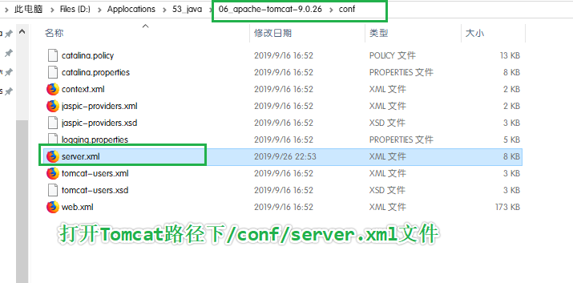
	* 使用代码编辑器打开`server.xml`文件,将HTTP协议的`8080`端口改为其他
	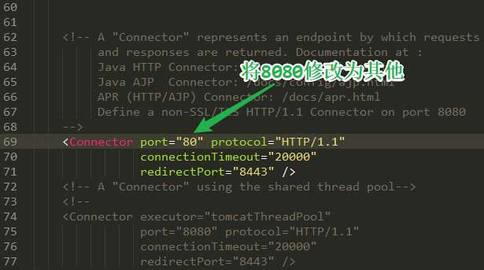

#### 2.`tomcat`的启动和关闭
* 启动和关闭
	进入`tomcat`安装的`bin/`目录下，双击startup.bat启动,`shutdown.bat`关闭
	启动cmd，在bin/目录下运行startup,启动tomcat，运行shutdown关闭tomcat.
	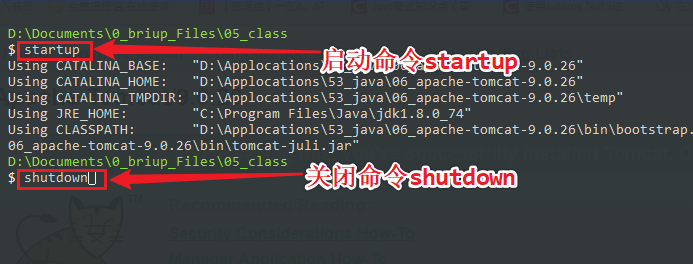

* 验证是否启动成功
	查看是否配置成功，启动tomcat后，在浏览器地址栏输入`127.0.0.1:设置的tomcat端口号`或者`localhost:设置的tomcat端口号`，可以打开如下页面，说明启动成功
	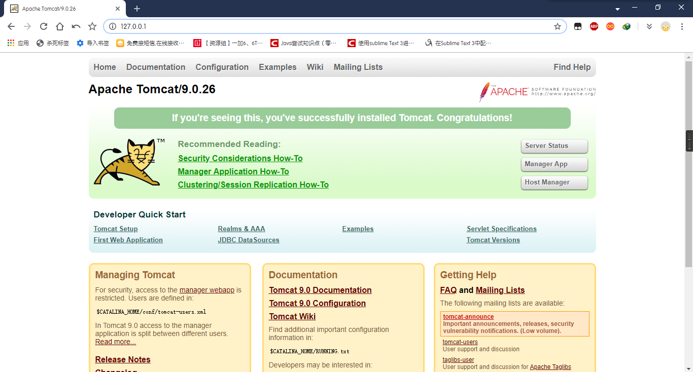

#### 3.配置tomcat环境变量
* 编译Servlet项目的java代码时，每次都需要指定`servlet-api.jar`的CLASSPATH，我们可以创建环境变量一次解决

##### (1).创建`CATALINA_HOME`环境变量
`CATALINA_HOME`指定tomcat的存放目录
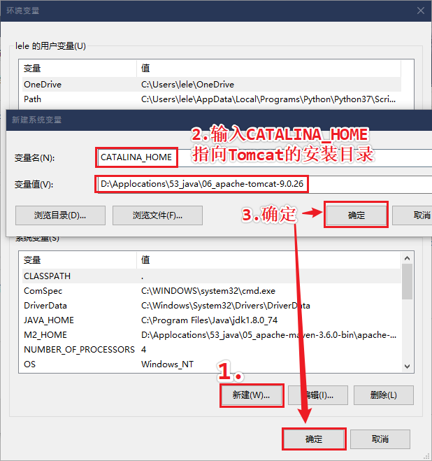
##### (2).创建`bin/`目录到`Path`中
每次启动关闭tomcat都要去安装目录双击，将`lib/`目录配置到系统`Path`中，直接在cmd命令行运行`startup`即可启动，运行`shutdown`即可关闭(系统的关机命令也叫`shutdown`,可能会冲突，关闭时运行`shutdown.bat`)
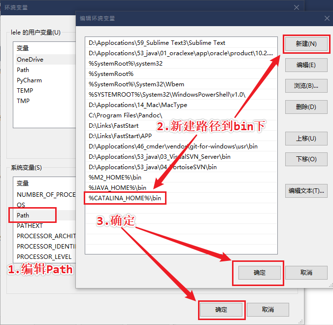
##### (3).将`servlet-api.jar`指定到`CLASSPATH`中
由于 `Servlet`不是 Java 平台标准版的组成部分，所以必须为编译器指定`Servlet` 类的路径。

修改添加`CLASSPATH`路径，在原有值后加`;`加上`%CATALINA_HOME%\lib\servlet-api.jar`,点击确定
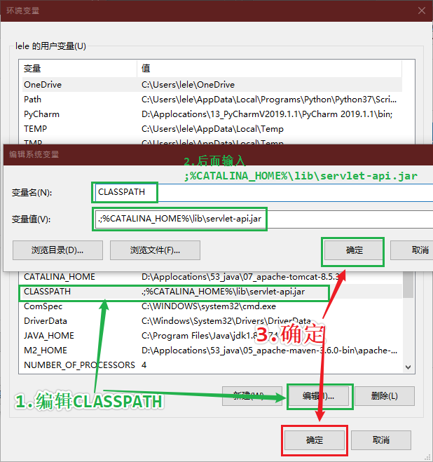

## 三、Web项目的结构
```
					 |--classes
					 |
		|--WEB-INF --|--lib
		| 			 |
		|			 |--web.xml(重要)
		|
		|
项目名-----index.xml(非必须)
		|
		|
		|
		|--静态资源文件(html.css,js,图片等，可以新建文件夹，也可以直接放进去)
```
* Web项目的目录结构是固定的
* Web项目的项目名字就是项目的文件夹名字
* 项目文件夹下除了`WEB-INF`文件夹,其余文件和文件夹都可以随意创建，可以存放web项目的html页面，css样式，js脚本，图片，音视频等web资源，这些资源就是通过浏览器访问的web资源
* `WEB-INF`文件夹下的文件和文件夹是固定，且对外访问关闭
* `classes`文件夹，存放java代码编译好的`class`文件
* `lib`文件夹,本项目所需的三方jar包,本目录下的jar包仅供本项目使用
* `web.xml`文件,web项目的配置文件，每个项目都要有自己的配置文件，tomcat服务器在启动后会自动读取解析这个配置文件
* `web.xml`文件有固定的模板，位于`conf/`目录下

## 四、手动构建web项目
web项目有固定的目录结构，将来部署web项目是在开发工具上部署的，但是要熟练掌握web项目的手动创建流程
### (一).手动创建Web项目的完整流程
#### 1.创建web项目的目录结构
新建一个web项目，叫web-test,能够通过浏览器访问如下资源
  * `http://localhost:10086/web-test/index.html`打开HTML页面
  * `http://localhost:10086/web-test/hello`网页显示`hello World`
  * `http://localhost:10086/web-test/image`网页显示一张图片
项目目录结构如下
```
		 			   	 |--classes --带包名的class文件
		 			   	 |
		 	|--WEB-INF --|--lib
		 	|		   	 |
		 	|		   	 |--web.xml
		 	|
web-test ------index.xml
		 	|
		 	|
		 	|
		 	|--images--图片
```

#### 2.编写HTML文件放在项目里
一个静态的HTML文件
#### 3.编写HelloServlet.java
java源代码如下
```java
package com.briup.test;

import javax.servlet.*;
import java.io.*;

public class HelloServlet implements Servlet{

	public void init(ServletConfig config) throws ServletException{

	}

	public ServletConfig getServletConfig(){
		return null;
	}

	public void service(ServletRequest req, ServletResponse res)
            throws ServletException, IOException{
		System.out.println("service() is called...");

		PrintWriter out = res.getWriter();
		out.print("Hello World!");
		out.flush();

		out.close();

	}

	public String getServletInfo(){
		return null;
	}

	public void destroy(){

	}

}
```
#### 4.编写Image.java
java源代码如下
```java
package com.lele.image;

import java.io.IOException;
import java.io.PrintWriter;

import javax.servlet.Servlet;
import javax.servlet.ServletConfig;
import javax.servlet.ServletException;
import javax.servlet.ServletRequest;
import javax.servlet.ServletResponse;

public class Image implements Servlet {

	@Override
	public void init(ServletConfig config) throws ServletException {

	}

	@Override
	public ServletConfig getServletConfig() {
		return null;
	}

	@Override
	public void service(ServletRequest req, ServletResponse res) throws ServletException, IOException {

		System.out.println("service beginning..");

		String file = "images/test.jpg";

		PrintWriter pw = res.getWriter();

		String html = "<html></html>";

		pw.write(html);
		pw.flush();

		pw.close();
	}

	@Override
	public String getServletInfo() {
		return null;
	}

	@Override
	public void destroy() {

	}
}
```
#### 5.编译java文件
因为用到了Servlet类，所以需要给定`CLASSPATH`的路径,指定`servlet-api.jar`的位置
* 编译方式一
```sh
# 设置临时的CLASSPATH路径
set CLASSPATH=.;D:\Applocations\53_java\07_apache-tomcat-8.5.38\lib\servlet-api.jar
# 编译java代码
javac -d . HelloServlet.java
javac -d . Image.java
```
* 编译方式二
```sh
# 每次给JVM传参，指定servlet-api.jar的位置
javac -d . -cp D:\Applocations\53_java\07_apache-tomcat-8.5.38\lib\servlet-api.jar HelloServlet.java

javac -d . -cp D:\Applocations\53_java\07_apache-tomcat-8.5.38\lib\servlet-api.jar Image.java
```
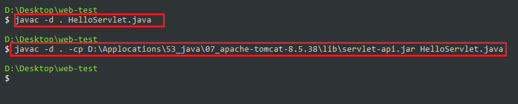

#### 6.将带包名的class文件放在`classes`下
把编译好的class文件，连同包名，复制到classes文件夹里面#
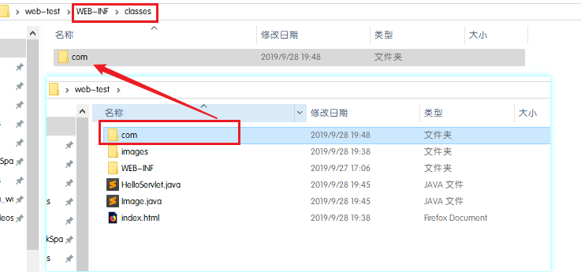

#### 7.修改`web.xml`
在配置文件中将域名URI和文件做映射
将`/index.html`、`/hello`和`/image`分别做映射
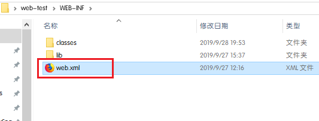
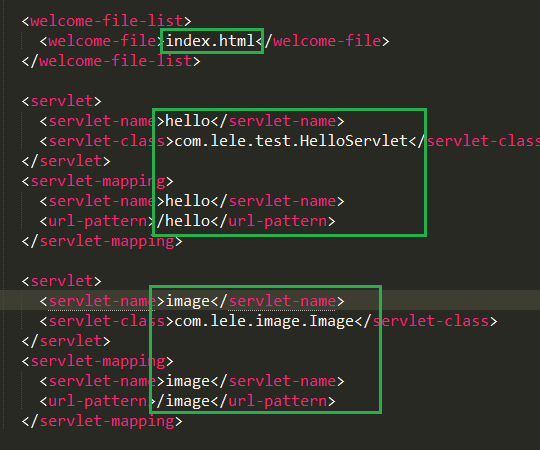

#### 8.部署项目
将项目复制到webapps下
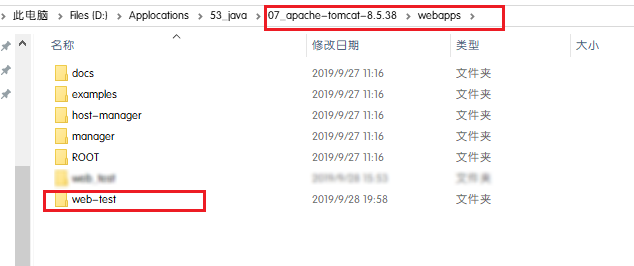

#### 9.启动tomcat服务器
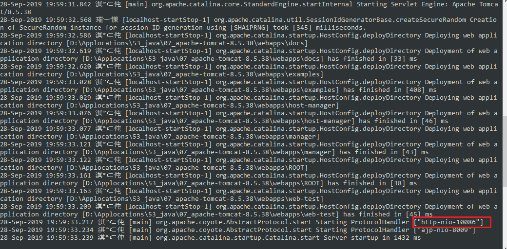

#### 10.浏览器访问
此时可以通过URL地址，可以访问到web项目的资源
* `http://localhost:10086/web-test/index.html`打开HTML页面
	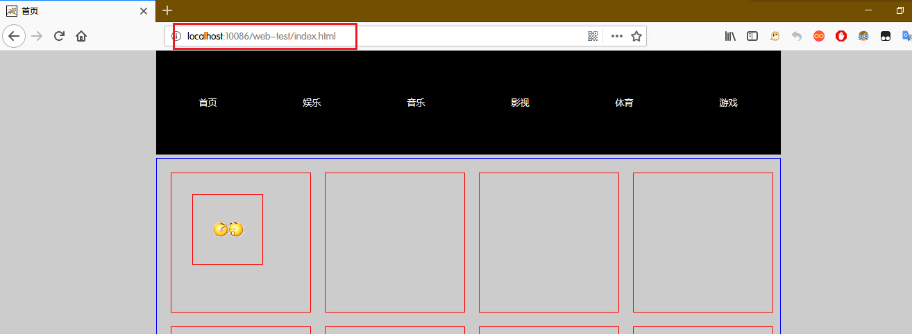
* `http://localhost:10086/web-test/hello`网页显示hello World
	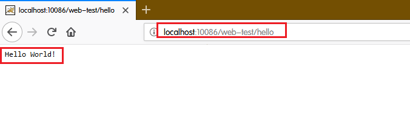
* `http://localhost:10086/web-test/image`网页显示一张图片
	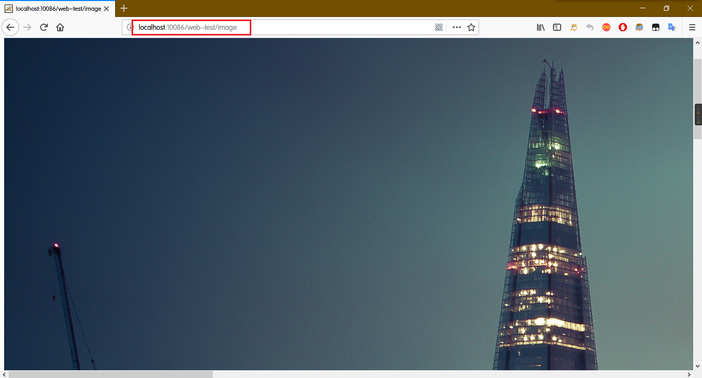

### (二).创建servlet项目的注意事项
#### 1.路径问题
html和java代码文件中的相对路径都是从项目文件夹开始的，跟`WEB-INF`是平级的
#### 2.java文件
Servlet项目中存在的是java编译后的class文件，不存在java源代码
## 五、Eclipse配置tomcat

1.配置Eclipse中的tomcat服务器
依次点击Window--->Preferences

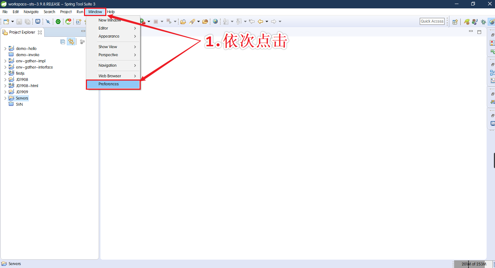

2.找到Server--->RuntimeEnvironments,点击Add添加

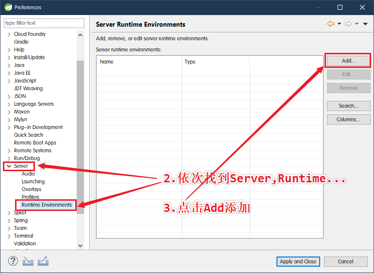

3.找到Apache--->Apache tomcat v8.5,点击Next

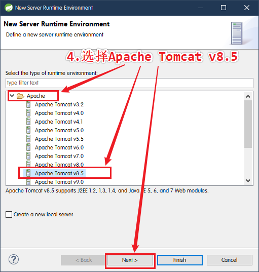

4.点击Browse选择tomcat目录文件夹,看到bin即可，然后配置JDK，点击完成

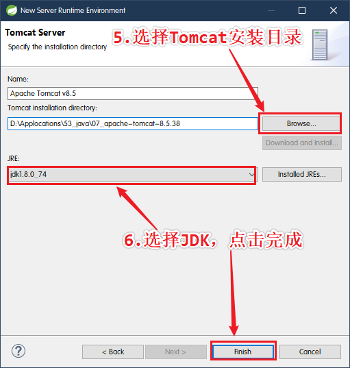

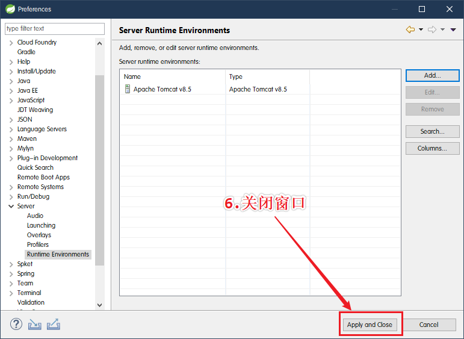

5.也可以在Window--->Show View下打开,Servers窗口，在这里安装配置tomcat

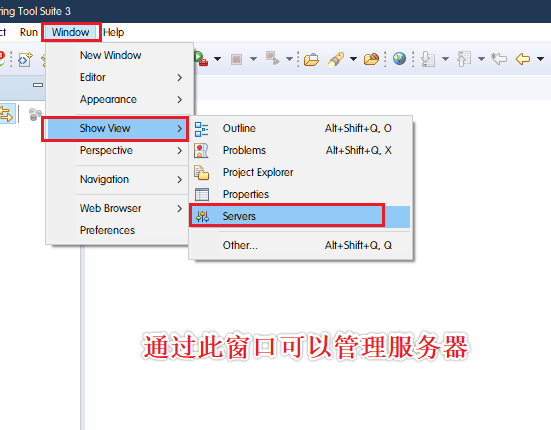

6.在Servers窗口双击tomcat服务

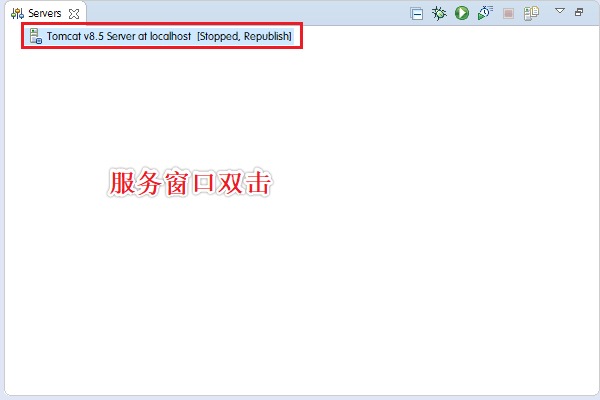

修改Server Locations为本地安装的tomcat，修改Deplay path(部署路径)为webapps，也可以修改端口号，修改完成后，Ctrl+S保存，关闭窗口.

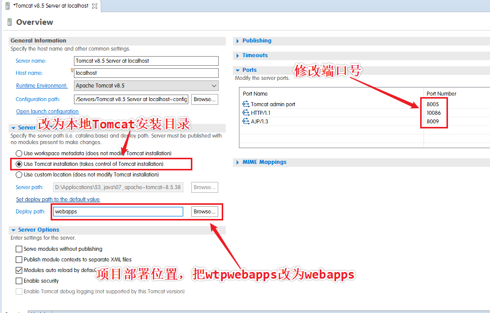
## 六、编写`Servlet`的三种方式
### (一).实现`Servlet`接口
* 这种方法，需要重写五个方法，实际上只有tomcat调用的`service()`方法需要实现，其他都是空实现
* 例如
```java
package com.lele.classes.day01;

import java.io.IOException;

import javax.servlet.Servlet;
import javax.servlet.ServletConfig;
import javax.servlet.ServletException;
import javax.servlet.ServletRequest;
import javax.servlet.ServletResponse;

// 实现Servlet接口
public class ServletTest implements Servlet {

	@Override
	public void init(ServletConfig config) throws ServletException {

	}

	@Override
	public ServletConfig getServletConfig() {

		return null;
	}

	// tomcat服务器调用的方法
	@Override
	public void service(ServletRequest req, ServletResponse res) throws ServletException, IOException {

		res.getWriter().println("hello servlet!");
	}

	@Override
	public String getServletInfo() {

		return null;
	}

	@Override
	public void destroy() {

	}

}
```

### (二).继承`GenericServlet`类
* 抽象类`GenericServlet`里面有一个抽象方法`service()`,这个方法是`Servlet`接口中的方法,所以`GenericServlet`只实现了`Servlet`接口中的四个抽象方法,还剩下这个`service()`方法没有实现.同时,`GenericServlet`类中不但实现了`Servlet`接口中的`init()`方法,而且还重载了一个无参的`init()`方法
**tomcat调用这个有参的`init()`方法,有参方法又调用了无参的方法，最终调用的使我们重写的`init()`方法**
源代码中俩个`init()`方法的实现:
```java
//tomcat服务器默认调用的是这个init方法
@Override
public void init(ServletConfig config) throws ServletException {
	this.config = config;
	this.init();
}

//用户需要重写的是这个init()方法
public void init() throws ServletException{
	// NOOP by default
}
```
举例
```java
package com.lele.classes.day01;

import java.io.IOException;

import javax.servlet.GenericServlet;
import javax.servlet.ServletException;
import javax.servlet.ServletRequest;
import javax.servlet.ServletResponse;
import javax.servlet.annotation.WebServlet;

public class test2servlet extends GenericServlet{

	private static final long serialVersionUID = 1L;

	@Override
	public void service(ServletRequest req, ServletResponse res) throws ServletException, IOException {

		res.getWriter().println("Hello test2");
	}


}
```

### (三).继承`HttpServlet`类
`HttpServlet`是一个抽象类,但是没有任何抽象方法,`HttpServlet`类中自定义了很多`doXxxx`方法,每一种方法都对应了浏览器发送请求的方法,一般常用的浏览器发请求方式为`get`和`post`,这俩种方式分别对应了这个类中的`doGet()`方法和`doPost()`方法。
* tomcat先调用`Servlet`类中的方法，再调用`HttpServlet`类的`service()`方法，然后根据请求方式调用我们重写的`doGet()`方法或者`doPost()`方法
* `HttpServlet`类中,有两个`service()`方法,一个是`Servlet`类中的方法，一个是`HttpServlet`重载的方法.执行顺序是先执行`Servlet`类中的方法，再执行`HttpServlet`中重载的方法。
例如
```java
package com.lele.classes.day01;

import java.io.IOException;

import javax.servlet.ServletException;
import javax.servlet.http.HttpServlet;
import javax.servlet.http.HttpServletRequest;
import javax.servlet.http.HttpServletResponse;

public class ServletTest4 extends HttpServlet {

	private static final long serialVersionUID = 1L;

	// get请求方式
	@Override
	protected void doGet(HttpServletRequest req, HttpServletResponse resp) throws ServletException, IOException {

		resp.getWriter().println("doGet Hello Servlet3!");

	}

	// post请求方式
	@Override
	protected void doPost(HttpServletRequest req, HttpServletResponse resp) throws ServletException, IOException {

		resp.getWriter().println("doPost Hello Servlet3!");

	}

}
```

## 七、Eclipse创建web项目
* eclipse中的普通项目
	* java项目
	* web项目
* eclipse的maven项目
	* java项目

	* web项目

### eclipse中创建一个web的maven项目
#### 1.简单maven项目配置成web项目
(1).创建简单的maven项目
**创建maven项目需要联网**
<1>创建一个简单的Maven项目

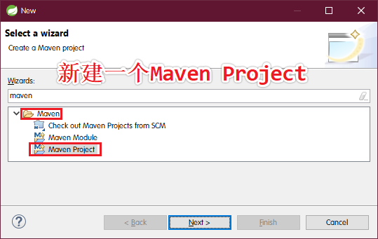

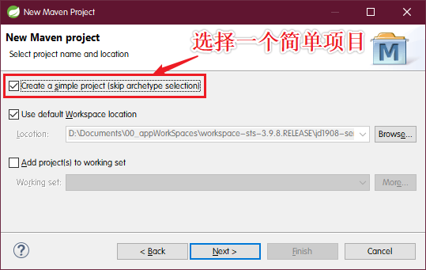

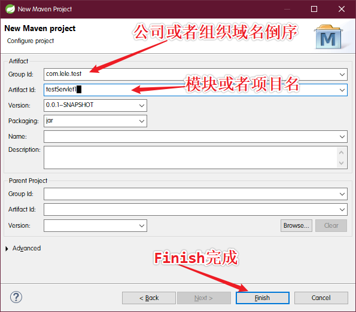

<2>修改打包方式
在`pom.xml`文件中加上如下代码:`<packaging>war</packaging>`
加上之后，保存后，快捷键ALT+F5更新项目，更新完成后，项目会报错


<3>添加web项目结构
这时`src/main/`目录下会出现一个`webapp`的文件夹，在此文件夹下新建文件夹`WEB-INF`,同时在`WEB-INF`文件夹下粘贴从tomcat模板下复制的`web.xml`文件，然后更新项目.

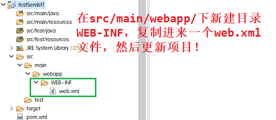

<4>将`J2SE`项目修改成`JavaSE`项目

* 在`pom.xml`文件中，粘贴如下代码，将编译项目的JDK版本改成**1.8**

```xml
<!-- 设置编译JDK为1.8版本，设置后就会变成了 javaSE-1.8 -->
<properties>
	<maven.compiler.source>1.8</maven.compiler.source>
	<maven.compiler.target>1.8</maven.compiler.target>
</properties>
```
* 修改完成后，保存xml文件，然后快捷键ALT+F5更新项目

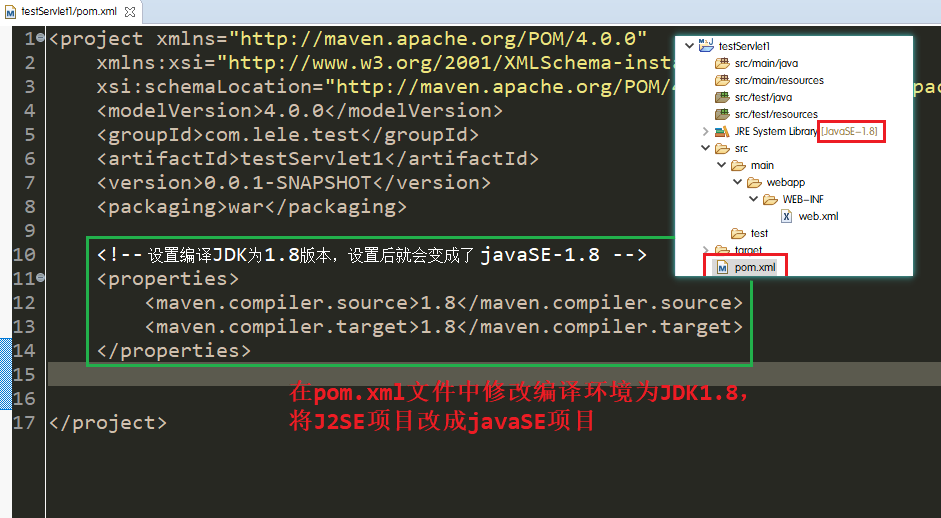

<5>引入web运行环境

* 找到项目名，鼠标右键，选择`Build Path`,然后选择`Add Libraries`,选择`Server Runtime`,下一步选择`Apache Tomcat V8.5`,点击完成
  ​
  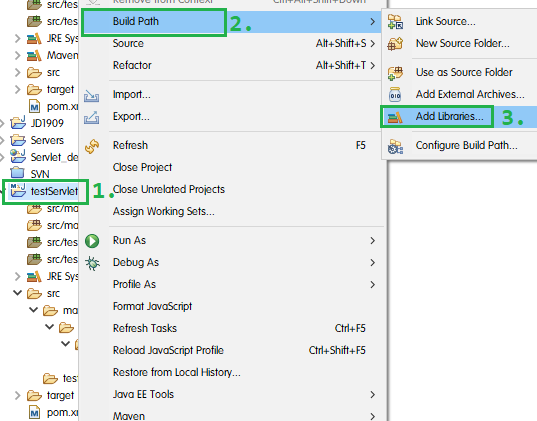

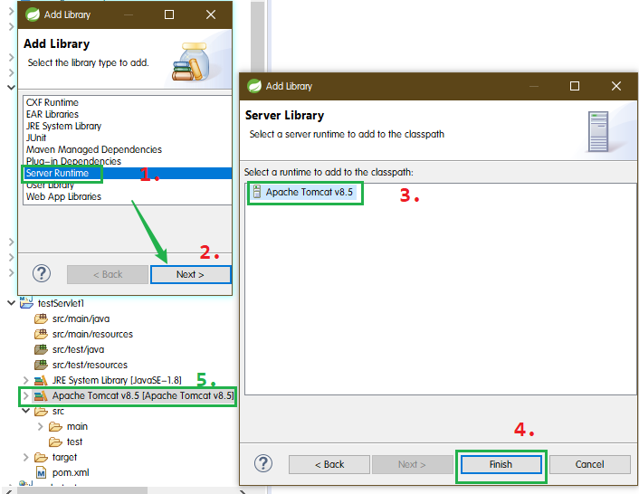

* 打开`pom.xml`文件，在xml文件中粘贴如下代码，配置依赖，主要是tomcat中的`servlet-api.jar`

```xml
<dependencies>
	<dependency>
		<groupId>javax.servlet</groupId>
		<artifactId>javax.servlet-api</artifactId>
		<version>3.1.0</version>
		<scope>provided</scope>
	</dependency>
</dependencies>
```
* 配置完成后，保存xml文件，快捷键Alt+F5更新项目，项目创建完成

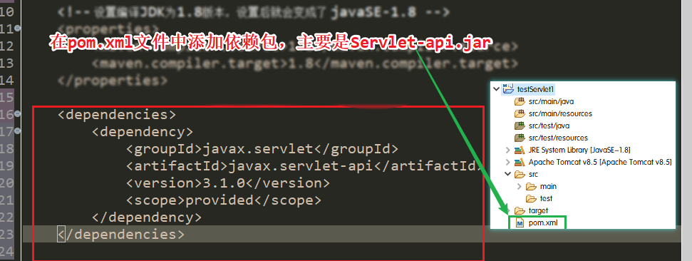

#### 2.使用maven骨架创建web项目
使用eclipse自带的maven骨架，创建web项目，再配置成需要的web版本
(1)创建一个Maven项目
**Maven项目创建需要联网**

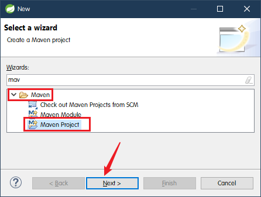

* 需要用到Maven骨架，不能创建简单项目，直接下一步

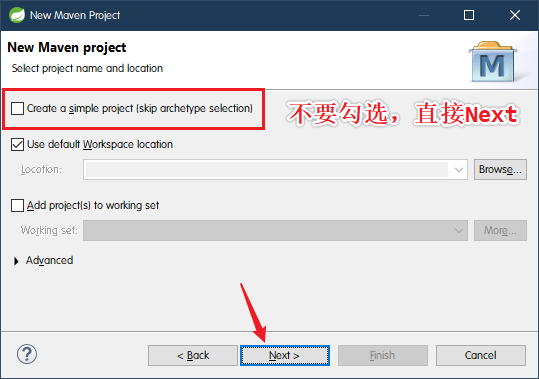

* 选择Maven项目webapp 1.0骨架

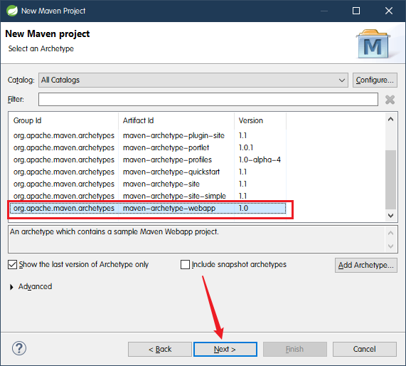

* 按照要求填写项目名称等

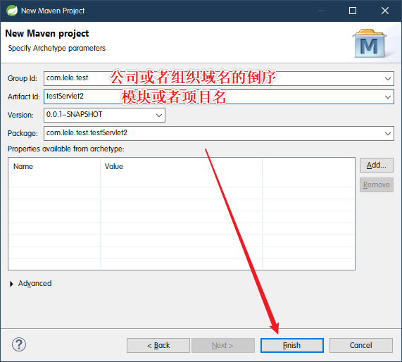

(2)显示出`src/main/resources`和`src/test/java`文件夹
项目名称右键,选择`Properties`找到`Java Build Path`选项，如图选中任意选项，点击`Down`,点击`Apply`,再点击`Top`，再点击`Apply and Close`,文件夹就显示出来了

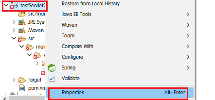

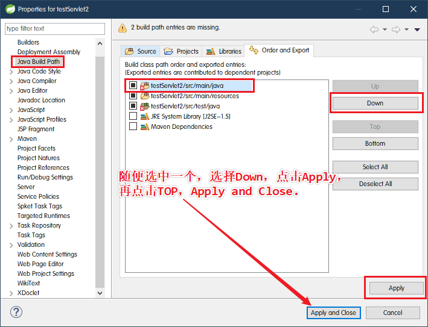

(3)将`J2SE`项目修改成`JavaSE`项目
将下面的代码粘贴到`pom.xml`文件中，保存，更新项目
```xml
<!-- 设置编译JDK为1.8版本，设置后就会变成了 javaSE-1.8 -->
<properties>
	<maven.compiler.source>1.8</maven.compiler.source>
	<maven.compiler.target>1.8</maven.compiler.target>
</properties>
```

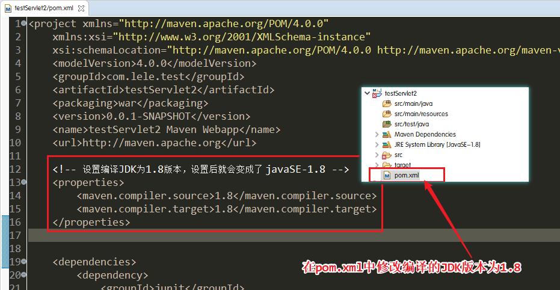

(4)将`Servlet`版本配置成`3.1`
* 这里默认的`Servlet`版本配置是`2.3`，需要配置成`3.1`，如图所示，打开`Navigator`面板

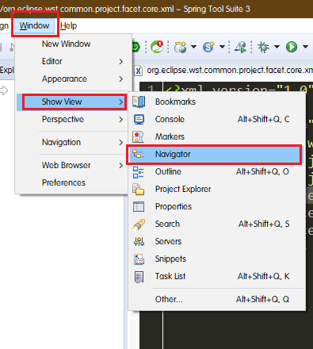

* 切换到`Navigator`视图，找到`.settings`文件夹，如图所示，打开这个配置文件

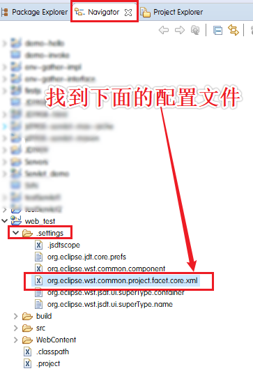

* 将xml文件里面的2.3改成3.1即可

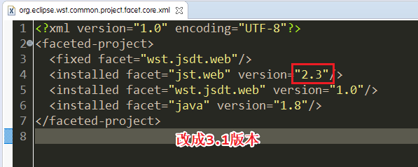

* 返回原来的视图，找到web.xml文件，修改Servlet版本为3.1
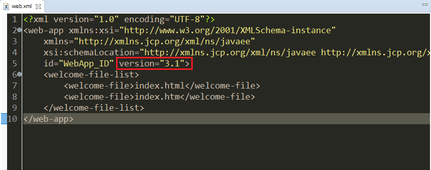

(5)将报错的文件删除

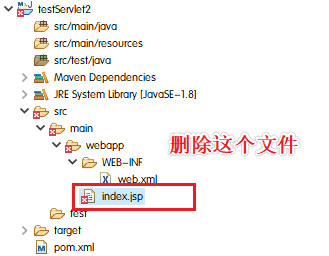
## 八、`Servlet`接口和`ServletConfig`接口中的方法

### (一).`Servlet`接口中的方法
这个接口中共有五个方法
###### 1.`public void init(ServletConfig config) throws ServletException;`
初始化`Servlet`对象时被调用
###### 2.`public ServletConfig getServletConfig();`
返回`ServletConfig`对象的方法
###### 3.`public void service(ServletRequest req, ServletResponse res) throws ServletException, IOException;`
访问`Servlet`对象的时候被调用
###### 4.`public String getServletInfo();`
返回`Servlet`相关信息，比如作者、版本、版权等,父类`GenericServlet`中默认返回一个空字符串`""`，此方法可以被重写
###### 5.`public void destroy();`
销毁`Servlet`对象时被调用
##### (二).`ServletConfig`接口中的方法
`ServletConfig`接口的实现类对象,表示一个`servlet`在`web.xml`文件中的配置信息,这个接口中共有四个方法
###### 1.`public String getServletName();`
返回`Servlet`在web.xml文件中所配置的名字,也就是`<servlet-name>`这个标签中的值，返回值是`String`字符串
###### 2.`public ServletContext getServletContext();`
获得`ServletContext`对象
###### 3.`public String getInitParameter(String name);`
获得`web.xml`中所配置的`name`对应的参数值,在web.xml中可以通过`<init-param>`标签给`Servlet`传参
###### 4.`public Enumeration<String> getInitParameterNames();`
获得给当前`Servlet`传的所有参数的名字
## 九、`Servlet`生命周期
* `Servlet`是单例,在web项目运行期间,一个Servlet只会创建一个对象
web项目本身就需要在多线程的环境中运行,tomcat服务器会提供这样的多线程环境,当浏览器发送一个请求,tomcat接收到这个请求之后会开启一个线程去处理这个请求
在这种环境下,由于servlet是单例,所以在servlet中声明的成员变量,就会有线程安全的问题。
**我们应该尽量少的在servlet中定义成员变量**
* 默认情况下,`Servlet`对象是在用户一次访问它的时候,由tomcat服务器来创建的(可以通过配置进行改变)。
* `Servlet`对象创建成功之后,tomcat服务器还会调用`Servlet`里面的`init(ServletConfig config)`,这个有参的`init()`方法会调用无参的`init()`方法,程序员就可以重写这个无参的`init()`方法,对创建好的`Servlet`对象进行初始化操作.
* 如果用户要访问这个`Servlet`对象,那么tomcat服务器会调用这个`Servlet`对象中的`service()`方法,只不过`service()`方法中又进行了方法的层层调用,最后调用到了我们重写的`doGet()`或者是`doPost()`方法
* 当`Servlet`对象被销毁的时候,tomcat服务器会调用`Servlet`里面的`destory()`方法,程序员就可以重写这个方法,表示当对象销毁的时候需要做哪些额外的处理
* `Servlet`对象被销毁的时间
	* 服务器**正常**关闭的时候
	* 服务器重新加载web项目的时候(reloading)

## 十、`web.xml`文件和注解
### (一).`web.xml`文件
`web.xml`是web项目的核心。tomcat启动后会优先去web.xml文件中加载配置文件
web.xml模板
```xml
<?xml version="1.0" encoding="UTF-8"?>

<web-app xmlns="http://xmlns.jcp.org/xml/ns/javaee" xmlns:xsi="http://www.w3.org/2001/XMLSchema-instance" xsi:schemaLocation="http://xmlns.jcp.org/xml/ns/javaee http://xmlns.jcp.org/xml/ns/javaee/web-app_4_0.xsd" version="4.0">

    <welcome-file-list>
        <welcome-file>index.html</welcome-file>
        <welcome-file>index.htm</welcome-file>
        <welcome-file>index.jsp</welcome-file>
    </welcome-file-list>

</web-app>
```
#### 1.配置web项目首页
* 默认的web项目首页配置
```xml
<welcome-file-list>
	<welcome-file>index.html</welcome-file>
	<welcome-file>index.htm</welcome-file>
	<welcome-file>index.jsp</welcome-file>
</welcome-file-list>
```
一般情况下修改成项目主页
```xml
<welcome-file-list>
	<welcome-file>index.html</welcome-file>
</welcome-file-list>
```

#### 2.项目资源映射
```xml
<servlet>
	<servlet-name>资源名</servlet-name>
	<servlet-class>JAVA类的全限定名</servlet-class>
</servlet>
<servlet-mapping>
	<servlet-name>资源名</servlet-name>
	<url-pattern>URI地址</url-pattern>
</servlet-mapping>
```
* 资源名可以随便写,要保证该项目中唯一，并且与对应的URI的资源名一致
* JAVA类必须写全限定名，tomcat需要根据全限定名，用反射创建对象
* URI资源名必须和类的资源名保持一致
* URI地址以`/`开头，可以有多级,名称任意
* servlet访问类的步骤:URI地址-->资源名-->类

#### 3.设置`Servlet`启动优先级
```xml
<servlet>
      ...
      <load-on-startup>优先级的值</load-on-startup>
</servlet>
```
* `load-on-startup`元素,标记容器是否在启动的时候就加载这个`Servlet`(实例化并调用其`init()`方法)。
* 它的值必须是一个整数，表示`Servlet`应该被载入的顺序
* 当值为`0`或者大于`0`时，表示容器在应用启动时就加载并初始化这个`Servlet`；
* 当值小于`0`或者没有指定时，则表示容器在该`Servlet`被选择时才会去加载。
* 正数的值越小，该`Servlet`的优先级越高，应用启动时就越先加载。
* 当值相同时，容器就会自己选择顺序来加载。

#### 4.给`Servlet`传递初始化参数
```xml
<servlet>
	...
	<init-param>
		<param-name>参数名</param-name>
		<param-value>参数值</param-value>
	</init-param>
	<init-param>
		<param-name>参数名</param-name>
		<param-value>参数值</param-value>
	</init-param>
	<load-on-startup>1</load-on-startup>
</servlet>
```
在`Servlet`类中，可以通过java代码拿到这个值
### (二).注解
`web.xml`可以配置的属性，使用`@WebServlet()`注解都可以配置，相对使用注解更方便
所有的注解属性
```java
@WebServlet(
	name = "",
	value = { "/test3", "/path" },
	urlPatterns = { "", "" },
	loadOnStartup = 1,
	initParams = {
		@WebInitParam(name = "", value = "", 	description = "第一个参数"),
		@WebInitParam(name = "", value = "", description = "第二个参数")
	},
	asyncSupported = false,
	smallIcon = "",
	largeIcon = "",
	description = "",
	displayName = ""
)
```
#### 1.`name`
`String`类型，指定`Servlet`的name属性，等价于`<servlet-name>`标签。如果没有显式指定，则该`Servlet`的取值即为类的全限定名。
#### 2.`value`和`urlPatterns`
* `String[]`类型,指定一组匹配此`Servlet`的URI地址(一个`Servlet`可以有多个路径)。等价于`<url-pattern>`标签。两个属性不能同时出现,作用完全相同
* 注解不指定时，默认表示该值`@WebServlet("/parm")`

#### 3.`loadOnStartup`
`int`类型,指定`Servlet`的加载顺序，等价于`<load-on-startup>`标签。
#### 4.`initParams`
* `WebInitParam[]`类型,指定一组`Servlet`初始化参数，等价于`<init-param>`标签。
* 使用示例如下
	* `name`参数名
	* `value`参数值
	* `description`描述信息(可选)
```java
initParams = {
	@WebInitParam(name = "", value = "", 	description = "第一个参数"),
	@WebInitParam(name = "", value = "", description = "第二个参数")
}
```

#### 5.`asyncSupported`
`boolean`类型,声明`Servlet`是否支持异步操作模式，等价于`<async-supported>`标签,默认为`false`。
#### 6.`smallIcon`
`String`类型,指定Servlet类的小图标，等价于`<small-icon>`标签
#### 7.`largeIcon`
`String`类型,指定Servlet类的大图标，等价于`<large-icon>`标签
#### 8.`description`
`String`类型,该`Servlet`的描述信息，等价于`<description>`标签。
#### 9.`displayName`
`String`类型,该`Servlet`的显示名，通常配合工具使用，等价于`<display-name>`标签。

## 十一、`Servlet`的访问
### (一).配置映射
一个`Servlet`想被访问，需要有映射，配置映射的方法
	* 在web.xml文件中配置`<url-pattern>`标签
	* 使用注解`@webServlet("/path")`
### (二).`Servlet`的访问
`get`方式访问的时候，最终调用了`Servlet`中的`doGet()`方法
`post`方式访问的时候，最终调用了`Servlet`中的`doPost()`方法
#### 1.浏览器地址栏直接输入`Servlet`映射的路径
#### 2.HTML页面中，使用超链接来访问
#### 3.HTML页面中，使用表单发送请求访问
这种方式默认使用get方式，但是可以指定访问方式
#### 4.使用javascript或者在ajax中发请求访问servlet
可以进行设置使用get方式还是post方式进行访问servlet
#### 5.使用标签语言访问
### (三).访问`Servlet`的`URL`地址
访问`Servlet`的完整地址格式
`http://IP:Port/项目名称/资源映射URI`
例如`http://localhost:10086/Servlet_demo/servlet`

* 通过修改配置文件，可以省略项目名称不写
访问`Servlet`的地址变成了`http://IP:Port/资源映射URI`
例如`http://localhost:10086/servlet`
	* 找到eclipse的Servers修改里面的server.xml文件(不是tomcat目录/conf/server.xml文件)
	* 修改需要修改的项目的`Context`标签，将`path`改成`/`
	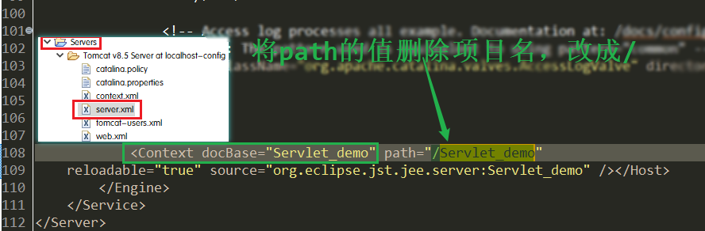

* 通过修改端口号为80，可以省略端口号不写
访问`Servlet`的地址为`http://IP/资源映射URI`
例如`http://localhost/servlet`
	* 浏览器默认端口号为80，将端口号改成80，就可以省去不写
	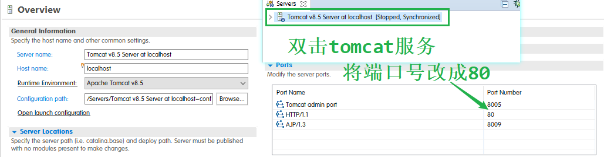

* 通过修改hosts文件里的IP映射，可以替换IP地址
  访问`Servlet`的地址为`http://域名/资源映射URI`
  例如`http://www.leleplus.com/servlet`
	* 打开目录C:\Windows\System32\drivers\etc\，找到hosts文件
	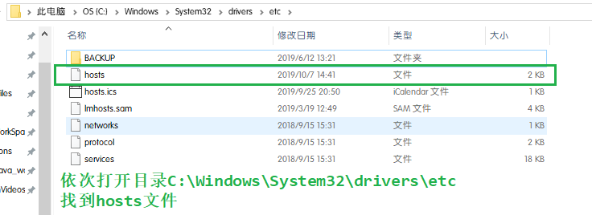
	* 在地址栏输入cmd，回车
	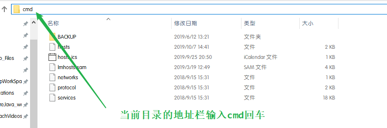
	* cmd框里输入`notepad hosts`回车，使用电脑自带记事本编辑hosts文件
	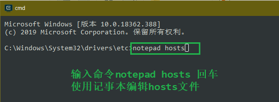
	* 在hosts文件末尾加上`127.0.0.1 想要代替IP的名称`或者`localhost 想要代替IP的名称`保存文件，关闭
	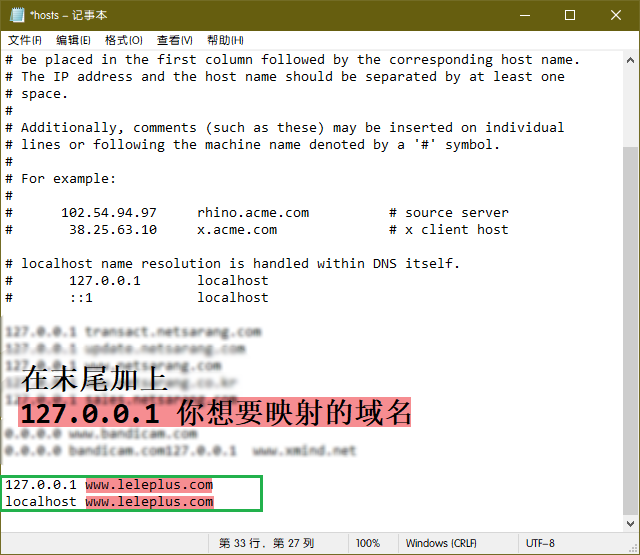

* 到目前为止，访问`Servlet`的地址变成了`http://域名/资源映射URI`，实际上浏览器会自动补全`http://`，访问`Servlet`只需要输入`域名/资源映射URI`就可以了

### (四).`Servlet`的访问方式
#### 1.`http`协议规范下的请求格式
第1部分: 请求行
第2部分: 请求头部/消息报头
第3部分: \r\n
第4部分: 请求正文

请求格式实例


#### 2.`http`协议规范下的请求方式
`http`协议规范了8种请求方式，但是一般只用4种`get`(查) `post`(改) `put`(增) `delete`(删)

* `GET`   	 发送请求来获得服务器上的资源，请求体中不会包含请求数据，请求数据放在协议头中。另外get支持快取、缓存、可保留书签等。幂等.
* `POST`  	 和`get`一样很常见，向服务器提交资源让服务器处理，比如提交表单、上传文件等，可能导致建立新的资源或者对原有资源的修改。提交的资源放在请求体中。不支持快取。非幂等.
* `HEAD`  	 本质和`get`一样，但是响应中没有呈现数据，而是http的头信息，主要用来检查资源或超链接的有效性或是否可以可达、检查网页是否被串改或更新，获取头信息等，特别适用在有限的速度和带宽下。
* `PUT`   	 和`post`类似，html表单不支持，发送资源与服务器，并存储在服务器指定位置，要求客户端事先知道该位置；比如`post`是在一个集合上（/province），而put是具体某一个资源上（/province/123）。所以`put`是安全的，无论请求多少次，都是在123上更改，而post可能请求几次创建了几次资源。幂等
* `DELETE`	 请求服务器删除某资源。和`put`都具有破坏性，可能被防火墙拦截。如果是`https`协议，则无需担心。幂等
* `CONNECT`  `HTTP/1.1`协议中预留给能够将连接改为管道方式的代理服务器。就是把服务器作为跳板，去访问其他网页然后把数据返回回来，连接成功后，就可以正常的`get`、`post`了。
* `OPTIONS`	 获取`http`服务器支持的`http`请求方法，允许客户端查看服务器的性能，比如ajax跨域时的预检等
* `TRACE` 	 回显服务器收到的请求，主要用于测试或诊断。一般禁用，防止被恶意攻击或盗取信息。

#### 3.`GET`和`POST`方式
##### (1).`GET`方式访问
###### <1>.访问方法
* 浏览器地址栏直接输入地址访问
* 超链接访问
	`访问图片`
* 外部js文件的引入
* 外部css文件的引入
* 表单提交数据`method="get"`
* 在javascript代码中访问
* 在ajax中访问
* 使用jsp相关标签访问

###### <2>.传参
get方式传参数 参数在**URI**后面
```http
GET /hello.html?name=tom HTTP1.1
key: value
key: value
key: value
.....
\r\n
```
##### (2).`POST`方式访问
###### <1>.访问方法
* 表单提交数据`method="post"`
* ajax中设置本次请求为post方式

###### <2>.传参
post方式传参 参数在请求正文中
```http
POST /hello.html HTTP1.1
key: value
key: value
key: value
.....
\r\n
name=tom
```
##### (3).`GET`和`POST`的传参的安全性
`GET`方式的参数由于是在地址栏中显示的,所以安全性低一些,`POST`传参的时候参数在请求正文中,相对会安全一些。但是真正重要的数据在传的过程中还会更换协议`http-->https`,比如在网上支付的过程中
##### (4).`GET`和`POST`在传参过程中参数长度的限制
* `GET`方式传参,参数长度是要看浏览器对地址栏中字符长度的限制,也就是要看浏览器对url地址的长度限制,我们只是把参数放到url后面了。url?参数=值
* `POST`方式参数,参数长度是要看服务器一次性最多能够接受并且处理多少数据

## 十二、`Servlet`接收参数
不管是`GET`方式还是`POST`方式传参，对于`Servlet`接收参数来说，方式是一样的
### (一).`Servlet`接收参数的方法
* `String getParameter(String name);` 通过参数名接收单一参数值，返回值是`String`类型(一个参数名对应一个参数值)

* `String[] getParameterValues(String name);`通过参数名接收一个参数的多个值(例如多选框)，返回类型是`String[]`类型

* `Enumeration<String> getParameterNames();`获得本次传参的所有参数名称，返回类型是`Enumeration`
	* `boolean hasMoreElements();`判断是否还有下一个参数
	* `String nextElement();`返回下一个参数名称，返回类型保持一致
	* 遍历所有的参数名称
		```java
		Enumeration<String> names = req.getParameterNames();
		while(names.hasMoreElements()) {
			String nextName = names.nextElement();
			System.out.println(nextName);
		}
		```

* `Map<String, String[]> getParameterMap();`获得本次传参所有的参数名称的参数值，返回类型是map集合，map集合的键是`String`类型，值是`String[]`类型
	* 遍历出所有的参数名称和参数值
		```java
		Map<String, String[]> parameterMap = req.getParameterMap();
		for (String key : parameterMap.keySet()) {
			System.out.print(key+" : ");
			String[] value = parameterMap.get(key);
			System.out.println(Arrays.toString(value));
		}
		```

### (二).`Servlet`接收参数举例
例如通过URL地址传参
URL地址`http://localhost/parm?name=lele&like=aa&like=bb&age=23`
```java
package com.lele.classes.day02;

import java.io.IOException;
import java.util.Arrays;
import java.util.Enumeration;
import java.util.Map;

import javax.servlet.ServletException;
import javax.servlet.annotation.WebServlet;
import javax.servlet.http.HttpServlet;
import javax.servlet.http.HttpServletRequest;
import javax.servlet.http.HttpServletResponse;

@WebServlet("/parm")
public class ParmServlet extends HttpServlet {

	private static final long serialVersionUID = 1L;

	@Override
	protected void doGet(HttpServletRequest req, HttpServletResponse resp) throws ServletException, IOException {

		// 接收单一的参数值
		String name = req.getParameter("name");
		System.out.println(name);

		/*
		结果:
			lele
		 */

		// 一个参数名对应多个参数值(例如多选框)
		String[] like = req.getParameterValues("like");
		System.out.println(Arrays.toString(like));

		/*
		结果:
			[aa, bb]
		 */

		// 获得本次传参所有的参数名
		Enumeration<String> names = req.getParameterNames();
		while (names.hasMoreElements()) {
			String nextName = names.nextElement();
			System.out.println(nextName);
		}

		/*
		结果:
			name
			like
			age
		 */

		// 获得本次传参所有的参数名和参数值
		Map<String, String[]> parameterMap = req.getParameterMap();
		for (String key : parameterMap.keySet()) {
			System.out.print(key + " : ");
			String[] value = parameterMap.get(key);
			System.out.println(Arrays.toString(value));
		}

		/*
		结果:
		name : [lele]
		like : [aa, bb]
		age  : [23]
		 */

	}

	// doPost()方法调用doGet()方法，接收参数的方法相同
	@Override
	protected void doPost(HttpServletRequest req, HttpServletResponse resp) throws ServletException, IOException {

		doGet(req, resp);
	}

}
```
## 十三、`Servlet`前后台乱码问题
### (一).`GET`方式传参，中文乱码
解决方法:在Servers中打开server.xml文件，新增属性`URIEncoding="编码格式"`
例如`URIEncoding="UTF-8"`
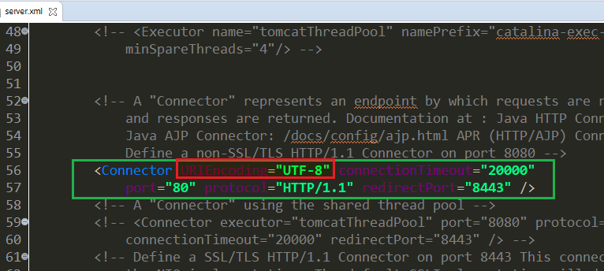

### (二).`POST`方式传参，中文乱码
在使用`request`获取参数之前,先把`request`中的编码进行设置
* `void setCharacterEncoding(String env)
            throws java.io.UnsupportedEncodingException;`设置编码格式的方法，可能会抛出不支持编码格式的异常
* 例如
	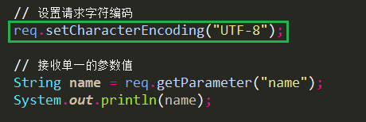

### (三).`Servlet`用IO流写数据到浏览器，浏览器显示中文乱码
如果响应头部信息中没有设置编码,那么浏览器会默认使用简体中文(GBK)来解析响应中的内容
所以在使用io流之前,需要设置一下`response`中的编码,同时还要告诉浏览器本次响应内容的编码是什么

* `void setCharacterEncoding(String charset);`设置`response`中的编码的方法
* `void setContentType(String type);`设置响应给浏览器的内容类型

* 例如
	* 设置响应字符编码
		`response.setCharacterEncoding("UTF-8");`
	* 设置响应头部,告诉浏览器响应内容和编码为utf-8
		`response.setContentType("text/html;charset=utf-8");`

	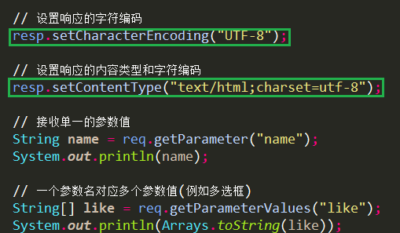

## 十四、`Servlet`服务器内部跳转和客户端重定向
### (一).服务器内部跳转
#### 1.内部跳转的特点
* 内部跳转处理的是浏览器的请求，需要使用`request`对象来完成
* 服务器内部跳转的实质把请求(request)和响应(response)转发到一下资源中,在整个跳转期间所有涉及到的资源使用的都是同一个`request`和`response`。(我们可以利用这个特点将来在多个资源之间进行数据的传递)
* 服务器内部跳转,客户端并不会知道，所以浏览器地址栏中的地址不变
* 因为是服务器处理请求，path地址需要加`/`,这个地址可以是页面也可以是servlet

#### 2.内部跳转的方法
* 相关方法
	* `RequestDispatcher getRequestDispatcher(String path);`得到指向path的跳转对象
	* `void forward(ServletRequest request, ServletResponse response) throws ServletException, IOException;`转发请求和响应对象给跳转的path
        * 先处理逻辑业务，再跳转到页面
* 内部跳转样例
```java
@Override
protected void doGet(HttpServletRequest req, HttpServletResponse resp) throws ServletException, IOException {

	// 设置编码
	req.setCharacterEncoding("UTF-8");
	resp.setCharacterEncoding("UTF-8");

	resp.setContentType("text/html;charset=utf-8");

	// 设置跳转的path
	String path = "/index.html";
	// String path = "/servlet";

	// 获得跳转对象
	RequestDispatcher dispatcher = req.getRequestDispatcher(path);
	// 跳转的同时把请求和响应转发
	dispatcher.forward(req, resp);

	// 简写为
	req.getRequestDispatcher("/index.html").forward(req, resp);
	// req.getRequestDispatcher("/servlet").forward(req, resp);

}
```

### (二).客户端重定向
#### 1.客户端重定向的特点
* 客户端重定向，是给浏览器发送一个重定向的响应，需要使用`response`对象来完成
* 重定向的本质是把资源路径通过响应返回给浏览器(通过响应头信息),让浏览器向这个新地址发送一个新请求
* 每一个客户端重定向,浏览器都会发出新请求,也就意味着在服务器内部会产生新的`request`对象和`response`对象，如果`request`中有数据,重定向后在新的资源中是拿不到这个数据的(重定向会发一个全新的请求,但是数据在上一个老的请求中)
* 客户端重定向,是浏览器拿到服务器响应发的地址再去跳转，**会**改变浏览器地址栏中的地址
* 设置location地址时，因为是客户端处理请求，不需要加`/`,这个location地址可以是页面，也可以是servlet，如果加了`/`,前面就得跟上项目名，项目名也可以是获取到拼接的.

#### 2.客户端重定向的方法
* 相关方法
	`void sendRedirect(String location) throws IOException;`给客户端发送跳转到location的响应
* 客户端重定向样例
```java
@Override
	protected void doGet(HttpServletRequest req, HttpServletResponse resp) throws ServletException, IOException {

		// 设置编码
		req.setCharacterEncoding("UTF-8");
		resp.setCharacterEncoding("UTF-8");

		resp.setContentType("text/html;charset=utf-8");

		// 设置重定向的location
		// 重定向到页面
		String location = "index.html";
		// 重定向到servlet
		// String location = "servlet";

		// 给客户端发送重定向的响应
		resp.sendRedirect(location);

		// 简写为
		resp.sendRedirect("index.html");
		resp.sendRedirect("servlet");

	}
```


## 十五、web项目中的路径
### (一).路径中的根`/`
一个路径地址，例如`/a/b/c/d`,除了a前面的根`/`,其余的`/`都是路径分隔符
#### 1.客户端浏览器解析`/`
客户端认为根`/`就是地址中端口号后面的`/`(http://ip:port/)
	* 例如
	HTML页面中的标签
	`<a href="/hello.html">点击</a>`
	跳转之后，浏览器地址改成`http://ip:port/hello.html`
#### 2.服务器解析`/`
### (二).XXXXXXX


req.getScheme();
		req.getServerName();
		req.getServerPort();
		req.getContextPath();


项目中的所有资源都在contextPath下

cookie


## ------------------------------
## 十六、三种会话对象
### (一).`HttpServletRequest`对象
### (二).`HttpSession`对象
### (三).`ServletContext`对象
## 十七、会话追踪技术
### (一).会话追踪技术
#### 1.session
#### 2.Cookie
### (二).URL重写

## 十八、Filter过滤器
### (一).Filter过滤器的作用
### (二).Filter过滤器的编写
### (三).Filter过滤器的配置
#### 1.xml文件中配置
#### 2.注解配置
### (四).Filter过滤器的执行顺序

## 十九、Listener监听器
### (一).监听器的作用
### (二).监听器的分类
### (三).监听器的配置
## 二十、安全访问
## 二十一、上传和下载
## 二十二、三层架构

