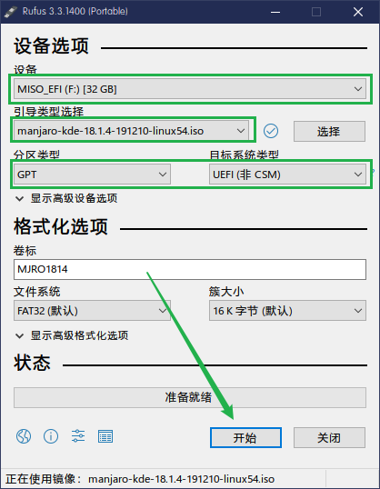
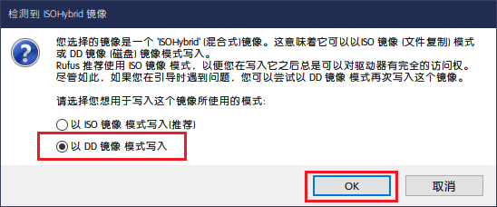
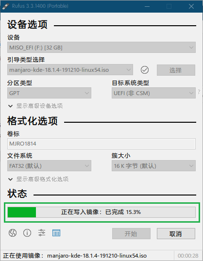
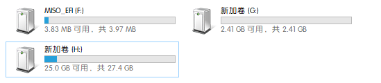

ManJaro操作系统使用


[manjaro官网](https://manjaro.org/)

[manjaro-gnome下载](https://manjaro.org/download/official/gnome/)

制作USB启动盘
下载[rufus工具](https://rufus.ie/)

* 打开rufus工具










一般情况下，refus会创建三个分区，引导分区，镜像存放分区，还有一个是其他分区，可能未初始化  需要自己手动初始化，并将镜像复制到USB盘中




然后重新启动电脑，插入U盘，从USB启动电脑


* 安装配置
一定注意，将时区改成自动时区，否则，一直报错！
链接WiFi

* 更新镜像排名，更改源为Sync值最小的
sudo pacman-mirrors -i -c China -m rank

更新数据源
sudo pacman -Syy

添加清华源
`sudo gedit /etc/pacman.conf`

末尾添加
```conf
[archlinuxcn]
SigLevel = Optional TrustedOnly
Server = https://mirrors.ustc.edu.cn/archlinuxcn/$arch
```
`sudo pacman -S archlinuxcn-keyring` #-S表示安装某一软件
无效使用`sudo pacman -Sy archlinuxcn-keyring`

将本地软件与远程仓库同步
`sudo pacman -Syy`

更新系统的一切软件包
`sudo pacman -Syyu`

更新单个软件
`sudo pacman -S <name>`

卸载不需要的软件

安装搜狗输入法
```bash
# 默认全部安装
sudo pacman -S fcitx-im
sudo pacman -S fcitx-configtool
sudo pacman -S fcitx-sogoupinyin
```

`sudo gedit ~/.xprofile`
```
export GTK_IM_MODULE=fcitx
export QT_IM_MODULE=fcitx
export XMODIFIERS="@im=fcitx"
```


安装Google浏览器
`sudo pacman -S google-chrome`

安装微信
`sudo pacman -S electronic-wechat`

安装TIM
`sudo pacman -S deepin.com.qq.office`

安装QQ
`sudo pacman -S deepin.com.qq.im`

安装Teamviewer
`sudo pacman -S teamviewer`