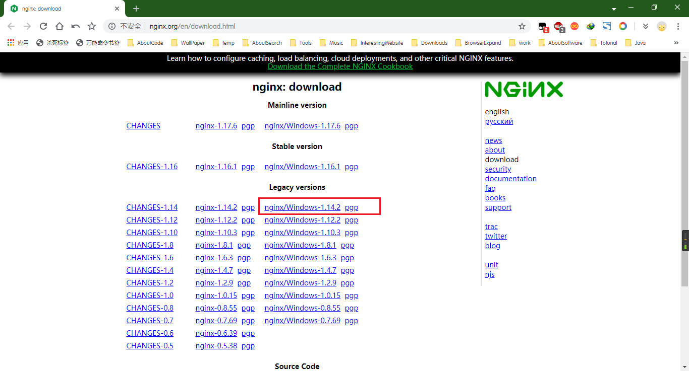
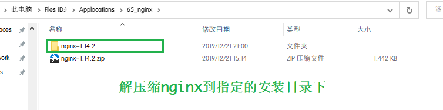
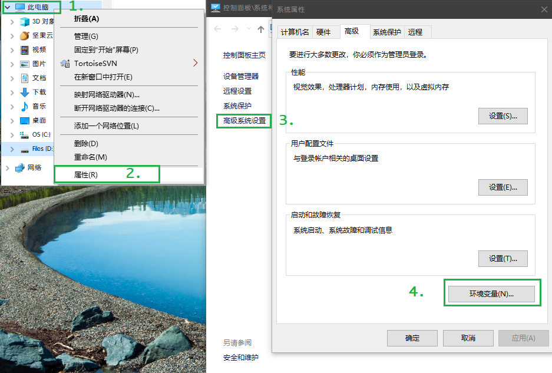
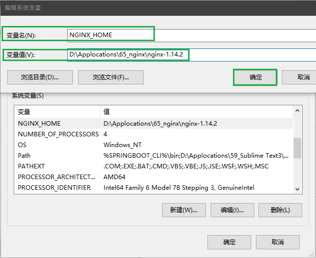
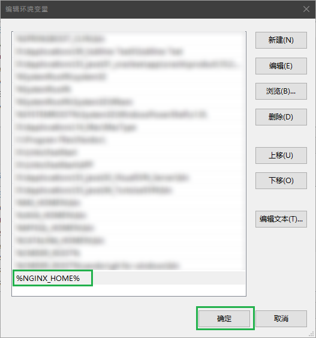

# Nginx的安装和使用

作者:乐乐


# 一、Nginx的下载和安装

## (一)、Nginx的下载

[Nginx官网](http://nginx.org/en/download.html)



## (二)、Nginx的安装
### 1.解压缩
将nginx解压缩到指定的安装目录

### 2.配置环境变量
以此打开'此电脑'-->'属性'-->'高级系统设置'-->'环境变量'


* 配置nginx家目录
在系统的环境变量下配置以下的内容
```
变量名:NGINX_HOME
变量值:D:\Applocations\65_nginx\nginx-1.14.2(能看到nginx.exe的目录)
```



* 配置Path变量
将nginx的家目录配置到path变量下
```
%NGINX_HOME%
```



* 解决nginx全局环境变量不能指定nginx.conf的问题，新建bat文件，配置到环境变量
```bat
@echo off
if "%1"=="help" (goto help) else (if "%1"=="-h" goto help)
if "%1"=="version" (goto version) else (if "%1"=="-v" goto version)
if "%1"=="start" goto start
if "%1"=="stop" goto stop
if "%1"=="reload" goto reload
if "%1"=="quit" goto quit
if "%1"=="find" goto find
goto error

:help
nginx -v
echo Usage: nginxd [-h,help] [-v,version] [start] [stop] [stop -a] [reload] [quit] [find]
echo=
echo Options:
echo   help,-h         : this help
echo   version,-v      : show current nginx version
echo   start           : start nginx master process
echo   stop            : stop the newest nginx master process
echo   stop -a         : stop all nginx master processes
echo   reload          : reload configuration
echo   quit            : safety exit nginx
echo   find            : show the nginx master process list
echo=
exit /B

:version
nginx -v
exit /B

:start
start nginx -p D:\Applocations\65_nginx\nginx-1.14.2
exit /B

:stop
if "%2"=="-a" (taskkill /F /IM nginx.exe)else (if "%2"=="" (nginx -s stop -p D:\Applocations\65_nginx\nginx-1.14.2) else goto error)
exit /B

:quit
nginx -s quit -p D:\Applocations\65_nginx\nginx-1.14.2
exit /B

:reload
nginx -s reload -p D:\Applocations\65_nginx\nginx-1.14.2
exit /B

:find
tasklist /fi "imagename eq nginx.exe"
exit /B

:error
echo nginxd: invalid option: "%1 %2"
echo=
exit /B
```


# 二、Nginx的启动和退出
在nginx的安装目录下运行
```bash
# 启动nginx
start nginx
# 重启nginx
nginx -s reload
# 安全关闭nginx
nginx -s quit
# 强制关闭nginx
nginx -s stop
```


