Git使用教程
-------------------
乐乐

# 一、Git概述
## (一)、Git简介
Git是由Linus用C语言开发的分布式版本控制系统，是目前世界上最先进的分布式版本控制系统
## (二)、集中式和分布式版本控制系统的区别
* 集中式版本控制系统
	只有本地服务器和中央服务器，必须联网才能工作，一旦中央服务器崩了，文件彻底没了
* 分布式版本控制系统
	没有中央服务器，每个人的电脑都是一个完整的版本库，同伴之间可以将文件推给对方，但是一般情况下有一个公共的版本库，用来互相之间交换文件，分布式管理，不联网也可以使用，可以现在自己电脑的版本库里进行版本控制，最后完成后推送到中央的版本库

# 二、安装Git
Git可以安装在Linux、Unix、Mac和Windows上
## (一)、在Linux上安装Git
### 1.Debian / Ubuntu
* Debian / Ubuntu发行版的最新稳定版本
`$ sudo apt-get install git`
* 对于Ubuntu，最新的稳定上游Git版本
`# add-apt-repository ppa:git-core/ppa`
`# apt update; apt install git`
* 旧版的Debian / Ubuntu
`$ sudo apt-get install git-core`

### 2.Fedora
`# yum install git (直到Fedora 21为止)`
`# dnf install git (Fedora 22及更高版本)`

### 3.Gentoo
`# emerge --ask --verbose dev-vcs/git`

### 4.Arch Linux
`# pacman -S git`
### 5.openSUSE
`# zypper install git`
### 6.Mageia
`# urpmi git`
### 7.Nix / NixOS
`# nix-env -i git`
### 8.FreeBSD
`# pkg install git`
### 9.Solaris 9/10/11(OpenCSW)
`# pkgutil -i git`
### 10.Solaris 11 Express
`# pkg install developer/versioning/git`
### 11.OpenBSD的
`# pkg_add git`
### 12.Alpine
`$ apk add git`
Red Hat Enterprise Linux, Oracle Linux, CentOS, Scientific Linux等。
RHEL和衍生工具通常提供较老版本的git。可以[下载压缩包](https://mirrors.edge.kernel.org/pub/software/scm/git/)并从源代码进行构建，或者使用第三方存储库(例如[IUS社区项目](https://ius.io/))来获取git的最新版本。

### 13.Slitaz
`$ tazpkg get-install git`

## (二)、在Mac OS上安装Git
直接从AppStore安装`Xcode`，`Xcode`集成了`Git`，不过默认没有安装，你需要运行`Xcode`，选择菜单`Xcode`->`Preferences`，在弹出窗口中找到`Downloads`，选择`Command Line Tools`，点`Install`就可以完成安装了。

## (三)、在Windows上安装Git
### 1.安装Git软件
在官网或者其他网站下载git安装包，然后默认安装即可
[点击直接下载](https://github.com/git-for-windows/git/releases/download/v2.24.0.windows.2/Git-2.24.0.2-64-bit.exe")
[查看所有的releases版本](https://github.com/git-for-windows/git/releases)
### 2.安装带Git插件的软件
例如:`cmder`或者`idea`等

## (四)、查看Git的版本
通过命令可以查看Git的版本，以及是否安装成功
`git --version`

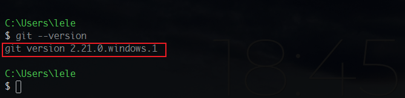

# 三、创建版本库
## (一)、谁在使用Git
Git是分布式版本控制系统，所以，每个机器都必须自报家门
```sh
$ git config --global user.name "Your Name"
$ git config --global user.email "email@example.com"
```
`--global`参数表示你这台机器上所有的Git仓库都会使用这个配置，当然也可以对某个仓库指定不同的用户名和Email地址。
> 修改全局的用户名和密码，或者是`vi ~/.gitconfig`

```sh
# 修改当前project的用户名和密码
$ git config user.name "Your Name"
$ git config user.email "email@example.com"
```

## (二)、创建版本库
### 1.在合适的位置创建一个空目录
```sh
# 创建一个需要Git管理的目录
$ mkdir learn_Git
# 进入到Git管理的目录中
$ cd learn_Git/
```
注:初始化git没必要非是一个空目录，有文件的目录并不适合初学者学习git
### 2.初始化Git
使用这个命令可以将该目录变成Git可以管理的目录
```sh
$ git init
Initialized empty Git repository in D:/Documents/00_appWorkSpaces/Git_workspace/learn_Git/.git/
```
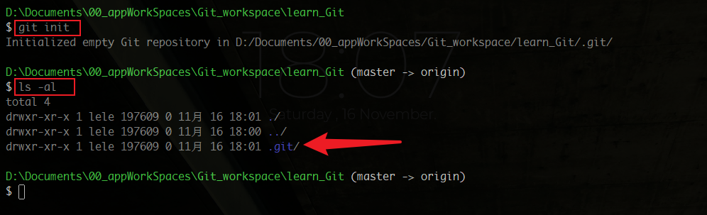

此时，文件夹下会多出一个隐藏的`.git/`目录，用来跟踪管理版本的
注:
	* 如果是Windows系统，要注意在路径中不要出现中文字符，否则会发生不可预料的bug
	* 理论上所有的版本控制软件只能对文本文件做控制，告诉你改动了什么位置，对于二进制文件，版本控制软件是没法管理的，只能记录文件的大小

### 3.添加文件到仓库
git能管理的文件只能在当前目录，或者子目录，在初始化之外的目录，git是无法管理的，而且git不管理空文件夹
* 创建文件
简单创建个文件和文件夹
```sh
$ mkdir learning
$ vi readme.txt  ---->添加 git is a version control system.
$ vi learning/study.txt  ---->添加 I studying git ...
```

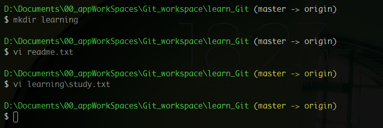

* 添加文件到仓库中
该命令可以执行多次，添加多个文件
```sh
$ git add <file>  # 添加某个文件到仓库中
$ git add *       # 添加当前目录的所有文件到仓库中
```
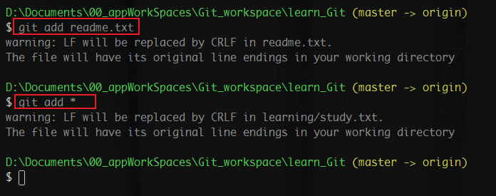

注:正常情况下，执行上面的命令后是没有任何的提示的，因为我在Windows下操作，会出现换行符的问题(后面解决这个问题)

* 将添加的文件从仓库中移除
```sh
$ git rm --cached <file>  # 从仓库中移除文件
$ git rm --cached *       # 从仓库中移除所有文件
```

### 4.提交文件到仓库
```sh
$ git commit -m "message" # 提交到版本库
$ git commit --no-verify -m "message" # 提交时跳过代码检测规范
```
`-m`参数表示添加描述信息，也就是本次提交的说明，强烈建议每次提交都增加说明
该命令执行后，会提示当前提交的信息
`file changed`提示更改的文件数
`insertions`提示插入了几行内容
`deletion`提示删除了几行内容

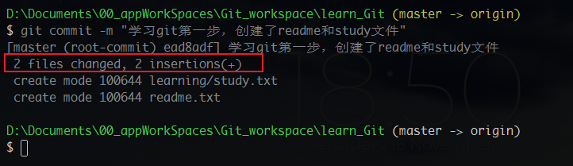

# 四、时光机穿梭
## (一)、查看当前状态
继续修改文件
* 查看状态
```sh
$ git status  		# 掌握当前工作区的状态，不能看具体修改的内容
$ git diff <file> 	# 查看某个文件具体变更的内容
$ git diff *   		# 查看所有文件的变更内容(文件过多不建议使用)
```

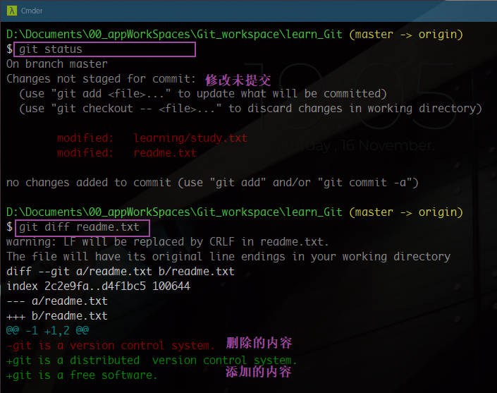

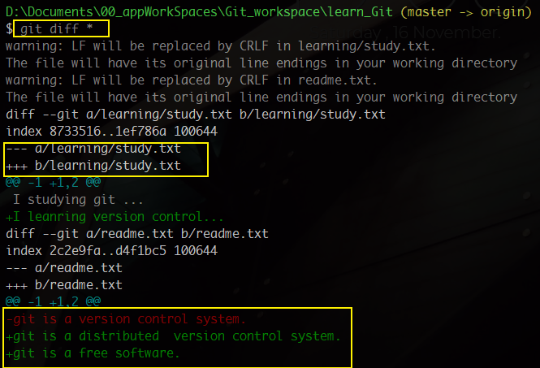

* 添加到仓库前后查看状态

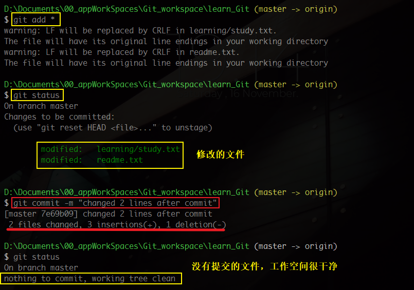

## (二)、版本回退
继续修改文件，然后提交

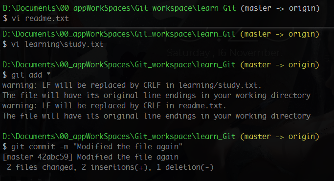

在实际的工作中，我们就是这样不停的修改，然后再次提交，每一次提交都是我们对于这个文件的备份，也叫快照，在git上，这个快照就叫`commit`，假如现在我要回忆一下，我总共修改了几次，修改了哪些内容，很简单，还能记得清楚，然而在实际的开发中，文本内容太多，我们根本记不住，这个时候，就体现出了git的作用，只需要一个命令，就能回忆起所有做过的修改

* 查看提交日志
```sh
$ git log # 查看最近到最远的提交记录
$ git log --pretty=oneline  # 只查看commit id和描述信息
```

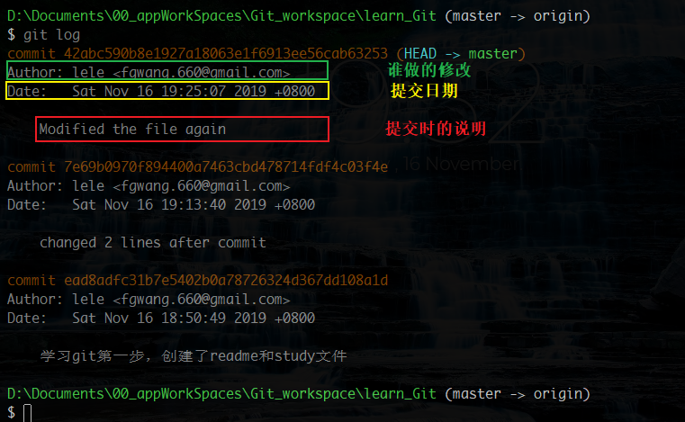

信息太多的话，会看的眼花缭乱，加上`--pretty=oneline`参数可以查看简略信息

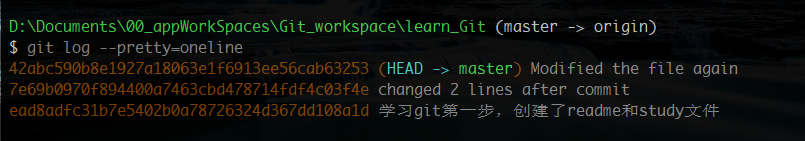

> 你看到的一大串数字，是`commit id`（版本号），和SVN不一样，Git的`commit id`不是1，2，3……递增的数字，而是一个SHA1计算出来的一个非常大的数字，用十六进制表示，而且你看到的`commit id`和我的肯定不一样.为什么`commit id`需要用这么一大串数字表示呢？因为Git是分布式的版本控制系统，多人在同一个版本库里工作，如果大家都用1，2，3……作为版本号，那肯定就冲突了。

* 版本回退
首先，Git必须知道当前版本是哪个版本，在Git中，用`HEAD`表示当前版本,上一个版本就是`HEAD^`，上上一个版本就是`HEAD^^`，当然往上100个版本写100个^比较容易数不过来，所以写成`HEAD~100`。
版本回退
```sh
$ git reset --hard HEAD^      # 从当前版本回退到上一个版本
$ git reset --hard HEAD^^     # 从当前版本回退到上上个版本
$ git reset --hard HEAD~100   # 从当前版本回退到上一百个版本
$ git reset --hard HEAD~      # 从当前版本回退到上一个版本
$ git reset --hard HEAD~1     # 从当前版本回退到上一个版本
$ git reset --hard <commitid>   # 使用commitid回到任意版本(版本号写几位就可以了)
```
* 错误处理
	在Windows的cmd控制台下，默认换行符是`^`，所以git命令会报错，`^`被当做换行符忽略了
	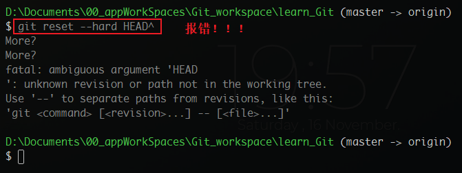
	解决方式:
	使用下面的命令代替
		* `git reset --hard "HEAD^"`
		* `$ git reset --hard HEAD~`
		* `$ git reset --hard HEAD~1`

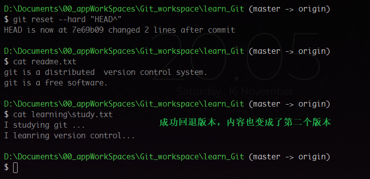

* 查看日志

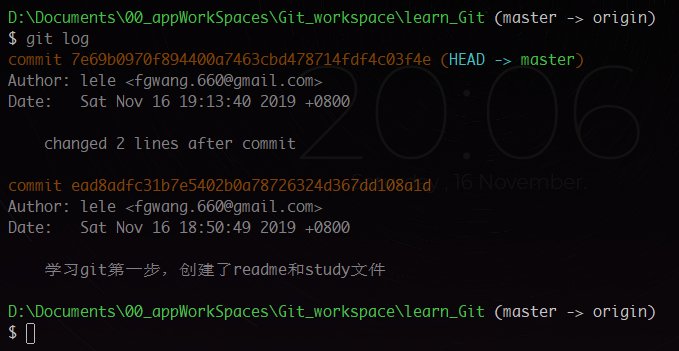
发现最新版本的`commit id`不见了，回不去了吗？并不是，如果终端没关，可以翻到上面，看到那个id，再退后去，git当然也提供了命令

* 查看所有的操作记录
`$ git reflog`

这时就可以使用`commitid`回到最新版本了

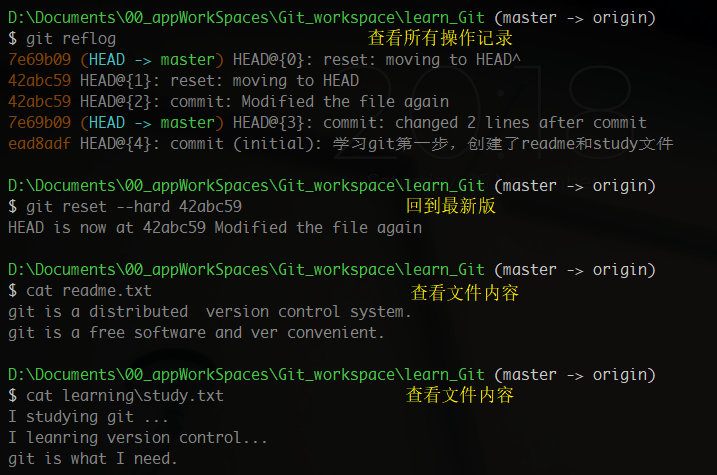

## (三)、工作区和暂存区
### 1.工作区
我们当前操作的目录,输入命令显示的路径就是工作区
```sh
$ pwd		# 查看当前的路径
D:\Documents\00_appWorkSpaces\Git_workspace\learn_Git 	# 工作区路径
```
### 2.版本库
工作区有一个隐藏目录`.git/`，这个目录其实就是Git的版本库。
Git的版本库里存了很多东西，其中最重要的就是`index`文件(或者叫`stage`),这个就是暂存区，还有Git为我们自动创建的第一个分支`master`，以及指向`master`的一个指针叫`HEAD`。

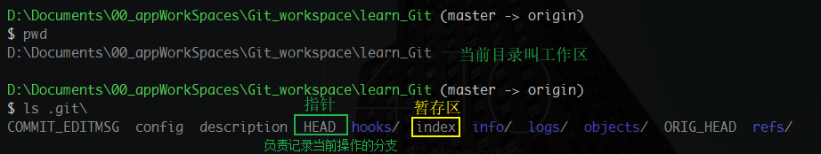

当我们使用了`git add`命令后，实际上是把文件添加到了暂存区，所以可以使用该命令添加很多文件，执行很多次
使用命令`git commit`时，就是把文件从暂存区提交到了分支，一旦使用了该命令，，而又没有对工作区文件做任何的修改，此时查看工作区状态时，会提示工作区非常干净，没有需要提交的文件

## (四)、管理修改
git管理的是文件，并不是修改，使用`git commit`命令时，只会提交你已经`git add`的修改，并不会提交你修改了，但还没有`git add`的修改

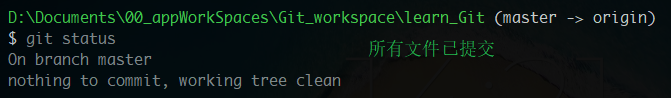

* 例如
	修改文件
	添加修改`$ git add a.txt`
	修改文件
	提交到版本库`$ git commit -m "提交a文件"`
	查看状态`$ git status`

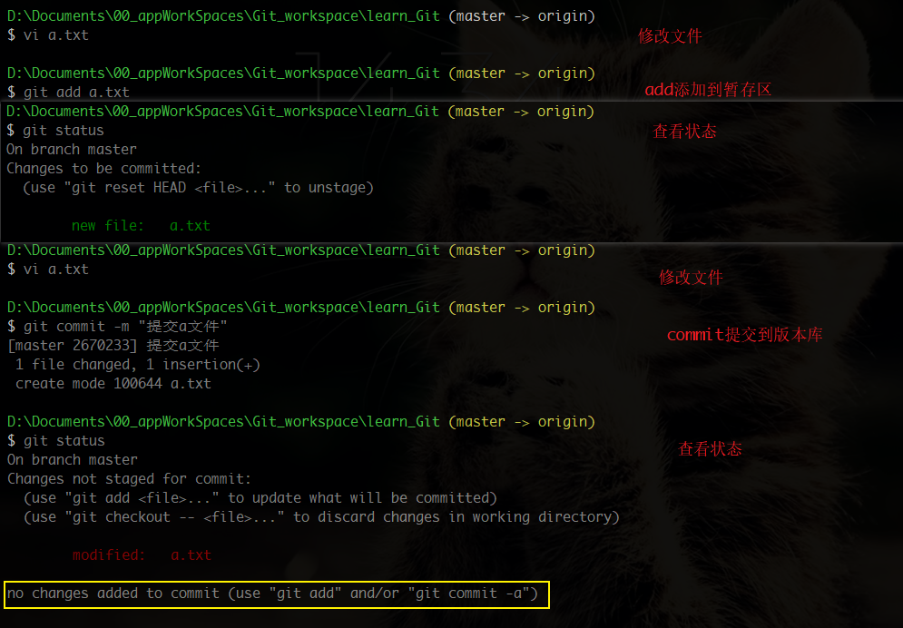

	**第二次的修改没有被提交**

* 查看工作区和版本库里面最新版本的区别
```sh
# 不区分大小写
$ git diff HEAD -- <file> 	# 查看版本库文件和工作区文件的区别
$ git diff head -- <file> 	# 查看版本库文件和工作区文件的区别
$ git diff head -- *      	# 查看版本库和工作区所有文件的不同
```

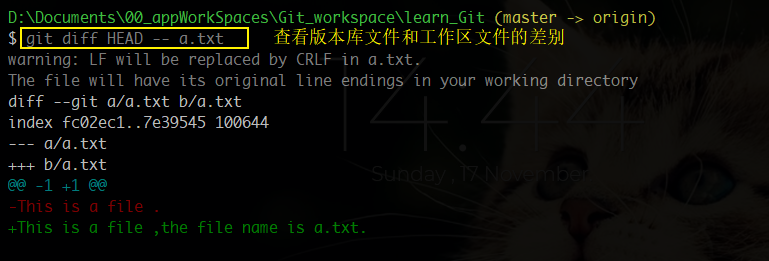

所以在提交到版本库之前，要保证你所有的修改已经被`git add`到了暂存区

## (五)、撤销修改

* 例如
	继续修改文件
	修改成后，想要退回到和版本库一模一样的状态
	查看当前状态`git status`

* 还没有`git add`本次修改,撤销本次修改
```sh
$ git checkout -- <file>
# 如果修改了还没有add，就恢复到和版本库一样的状态
# 如果add之后又修改了文件，就恢复到add之后的状态
```

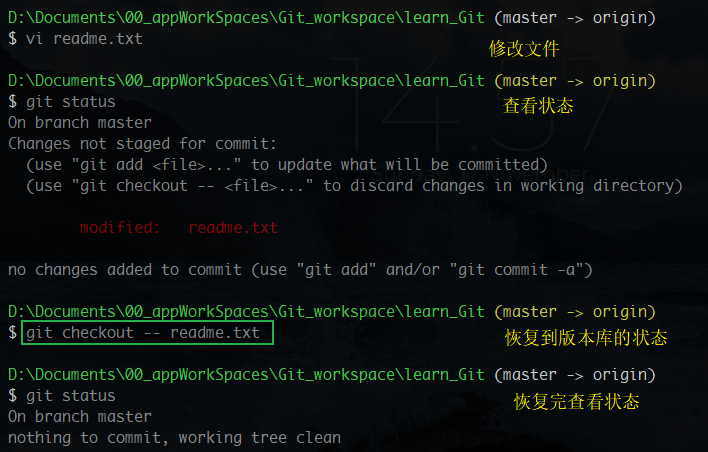

* 例如
	继续修改文件
	修改完`git add`到暂存区
	此时回退修改
	查看此时状态`$ git status`
	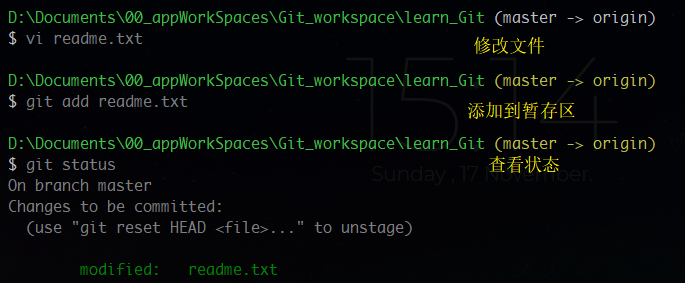

* 已经`git add`本次修改，撤销本次修改
```sh
$ git reset HEAD <file>  # 撤销添加到暂存区的修改，撤回到工作区
$ git checkout -- <file> # 废弃工作区的修改，撤销回版本库
```

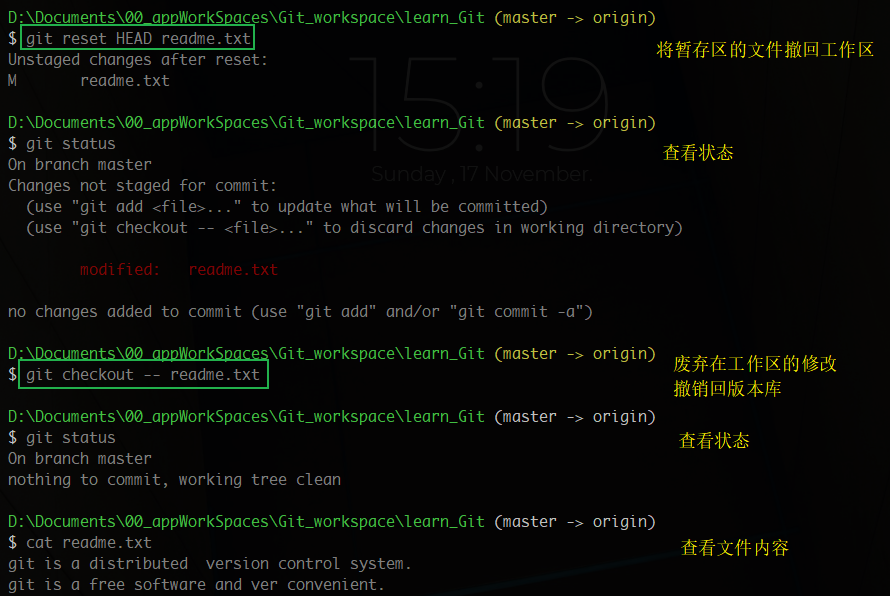

## (六)、删除文件
一般情况下，我们通常会直接在文件资源管理器，或者使用`rm`命令删除文件
`$ rm a.txt`
此时，git是知道我们删除了文件的
`$ git status`

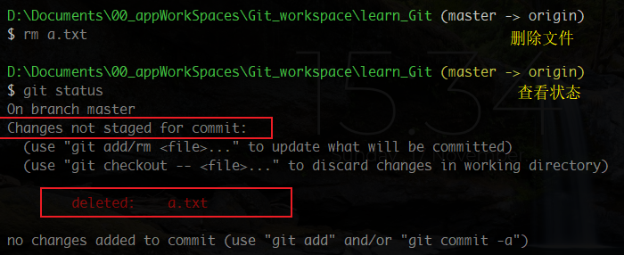

* 这个时候如果删错了，不要紧，版本库里还有一份，是可以直接恢复的
```sh
$ git checkout -- a.txt 	# 从版本库回退文件到本地
# 实际上这个命令的作用就是用版本库的文件替换本地工作区的文件
```
注:**从来没有被添加到版本库，就删除的文件，是不能够恢复的**

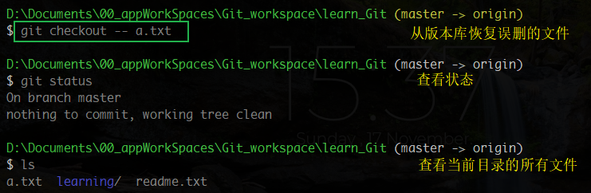

* 确实想要删除文件，并且版本库里的也不要了
```sh
$ git rm <file>     # 从版本库中删除文件，同时删除本地的文件
$ git add <file>    # 此时这两个命令是一样的效果，都是把删除文件的修改添加了
$ git commit -m ""  # 删除后提交
```

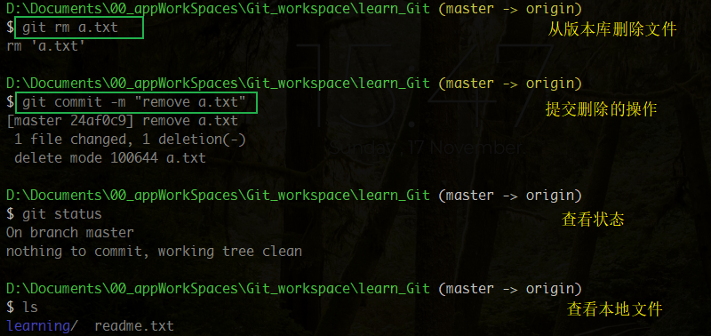

# 五、远程仓库
## (一)、关联远程仓库
### 1.注册账户
在github官网注册一个账户，并登录
[github官网](https://github.com/)
### 2.创建SSH Key
创建SSH Key之前，先要确定自己有没有创建过，创建SSH Key之后，会默认在用户主目录下生成一个`.ssh/`文件夹
Windows用户可以去`C:\Users\你的登录用户名\`下看看有没有这个文件夹(隐藏的)
* 没有，直接使用下面的命令生成
* 有，进入到`.ssh/`下，查看有没有`id_rsa`和`id_rsa.pub`这两个文件
	* 没有,就打开git bash,用命令创建
	* 有，跳过创建的步骤

	  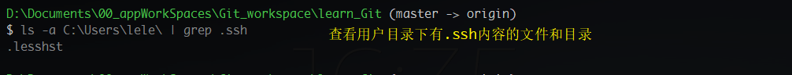

注:可以在终端中使用命令过滤查看(linux命令，Windows下cmder终端可以使用)`ls -a C:\Users\lele\ | grep .ssh`

* 创建SSH Key
确认没有生成这个文件夹后，使用下面的命令创建
```sh
ssh-keygen -t rsa -C "注册github的邮箱"  # 创建SSH Key，注意替换为自己的邮件地址
```
全部使用默认值即可，一路回车，不用输入密码

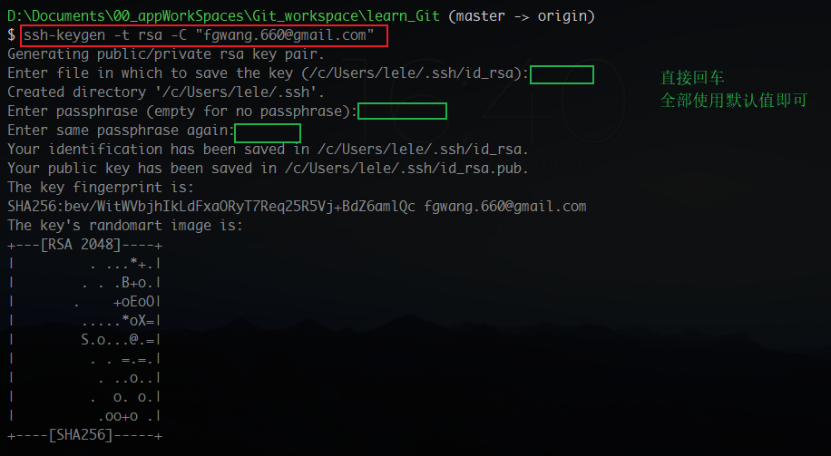

如图所示，创建成功
此时，去用户主目录下找到`.ssh/`文件夹，里面有`id_rsa`和`id_rsa.pub`两个文件，这两个就是SSH Key的秘钥对
* `id_rsa`是私钥，不能泄露

* `id_rsa.pub`是公钥，可以公开

  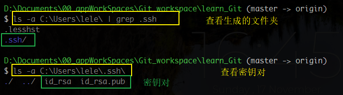

### 3.绑定github账户
登录github账户后，依次如图操作
或者直接打开下面的地址[绑定SSH Key](https://github.com/settings/ssh/new)

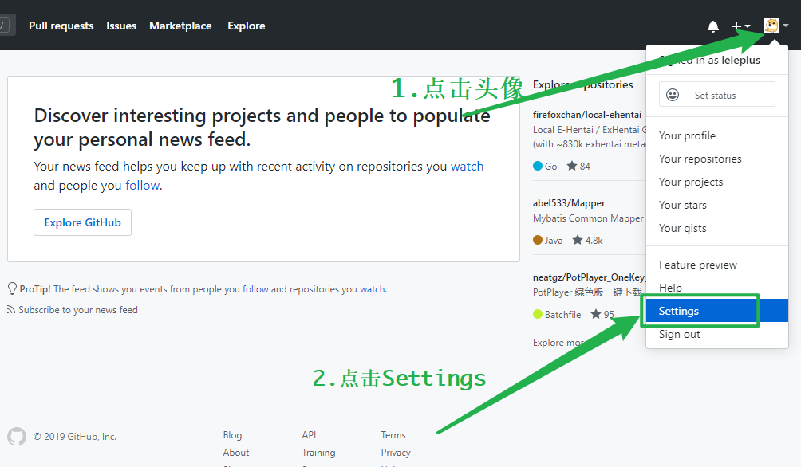

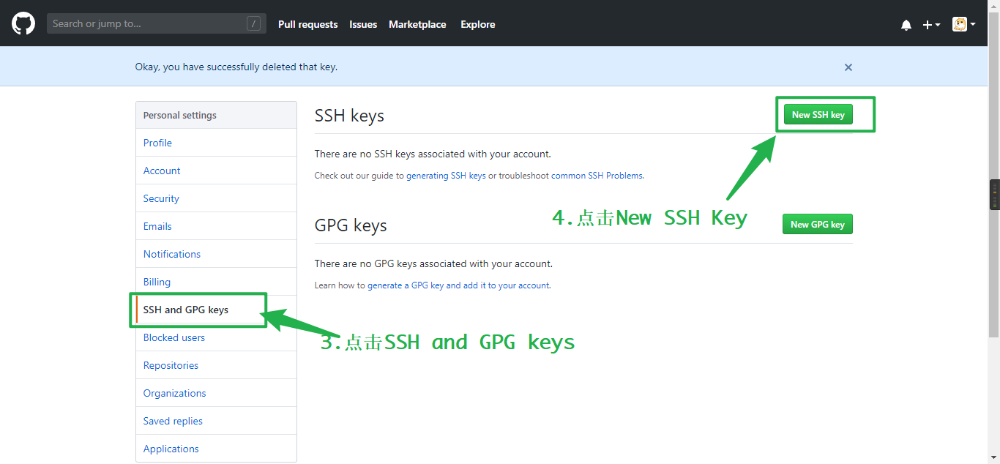

使用命令或者notepad++等工具打开`id_rsa.pub`文件，复制里面的内容，粘贴到图中的位置
可能需要输入密码验证

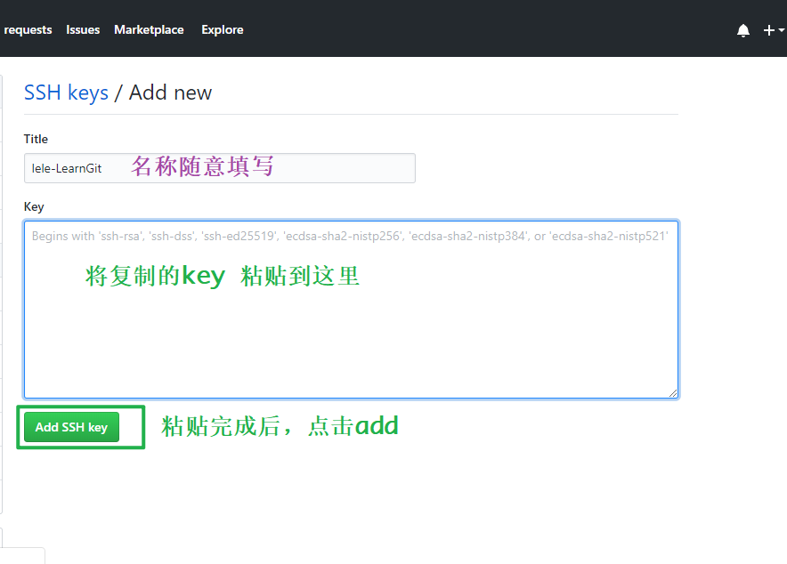

* 验证是否成功
在git bash中输入以下命令
```sh
$ ssh -T git@github.com
```
如图所示，验证成功
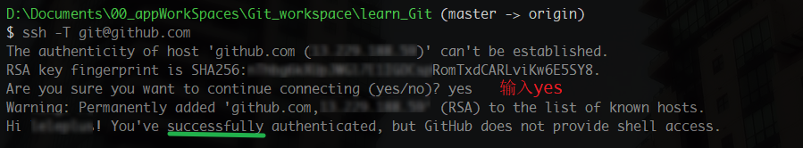

## (二)、添加远程库
### 1.创建远程仓库
如图中所示操作
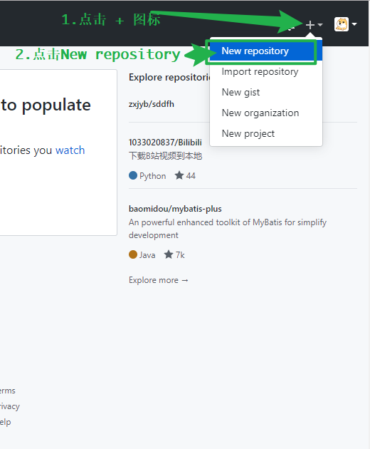

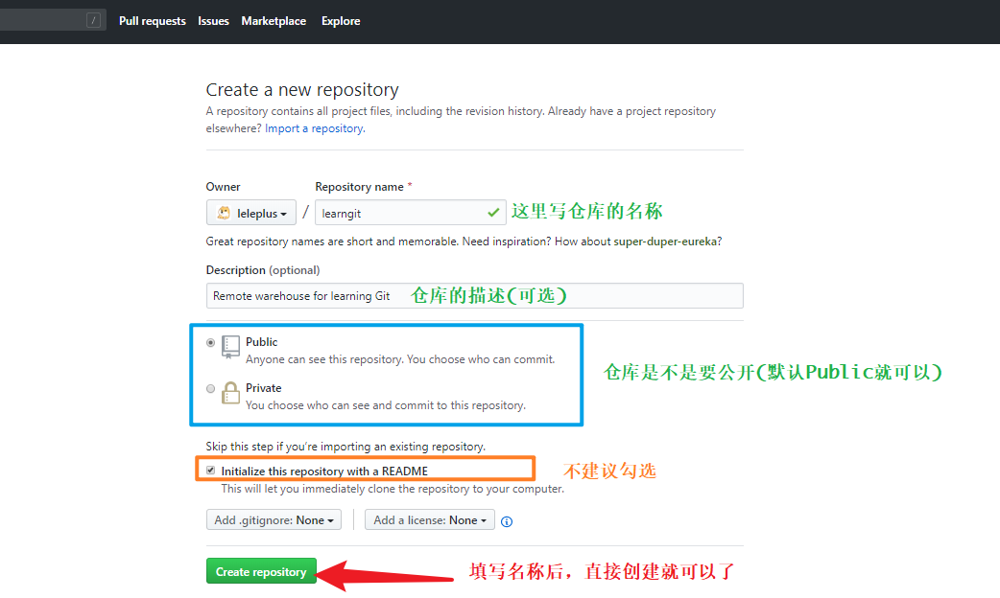

### 2.关联远程库
一定要在当前远程库的目录下运行这个命令
远程库地址
	* SSH key :git@github.com:leleplus/learngit.git
	* web URL :https://github.com/leleplus/learngit.git

	  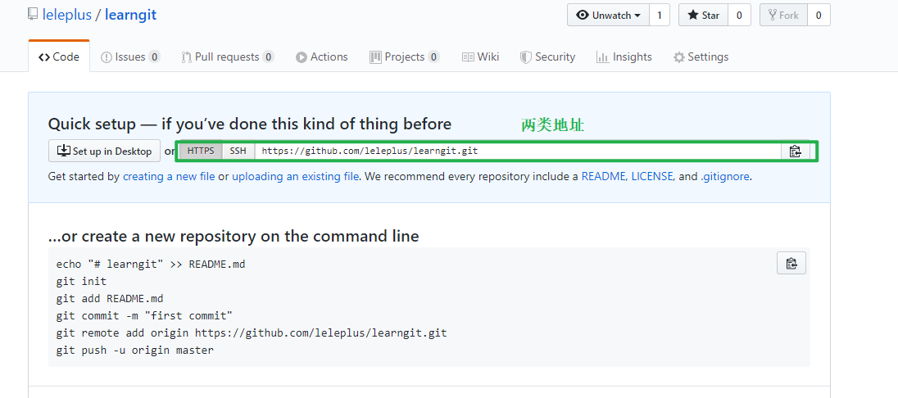

这两个地址任意一个就可以

```sh
$ git remote add origin <https/ssh 远程库地址>  # 关联远程库
```
关联之后，远程库的名字就是`origin`，这是Git默认的叫法，也可以改成别的，但是`origin`这个名字一看就知道是远程库。
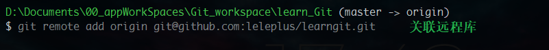

### 3.推送到远程库
```sh
$ git push -u origin master  # 第一次推送的命令
$ git push origin master     # 后续推送的命令
```

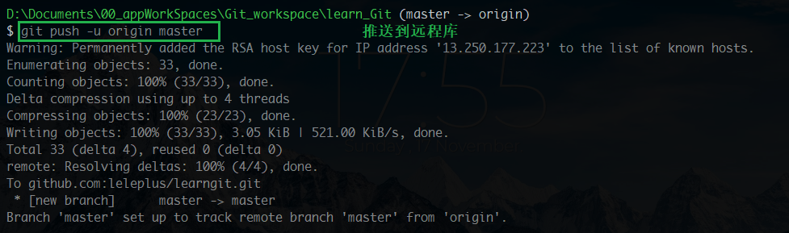

把本地库的内容推送到远程，用`git push`命令，实际上是把当前分支`master`推送到远程。
由于远程库是空的，我们第一次推送`master`分支时，加上了`-u`参数，Git不但会把本地的`master`分支内容推送的远程新的`master`分支，还会把本地的`master`分支和远程的`master`分支关联起来，在以后的推送或者拉取时就可以简化命令。

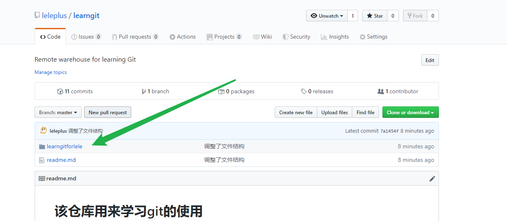

> 关于SSH警告
当你第一次使用Git的`clone`或者`push`命令连接`gitHub`时，有一个警告
>```sh
The authenticity of host 'github.com (xx.xx.xx.xx)' can't be established.
RSA key fingerprint is xx.xx.xx.xx.xx.
Are you sure you want to continue connecting (yes/no)?
>```
>这是因为Git使用SSH连接，而SSH连接在第一次验证gitHub服务器的Key时，需要你确认gitHub的Key的指纹信息是否真的来自gitHub的服务器，输入`yes`回车即可。
>Git会输出一个警告，告诉你已经把gitHub的Key添加到本机的一个信任列表里了
>```sh
>Warning: Permanently added 'github.com' (RSA) to the list of known hosts.
>```
>这个警告只会出现一次，后面的操作就不会有任何警告了。

## (三)、从远程库克隆
从远程库克隆，可以是从别人的仓库克隆文件，也可以是从自己的仓库克隆文件
一般情况下的开发，都是先创建仓库，然后从仓库克隆
再创建一个仓库，我们勾选`Initialize this repository with a README`，这样gitHub会自动为我们创建一个`README.md`文件。创建完毕后，可以看到`README.md`文件
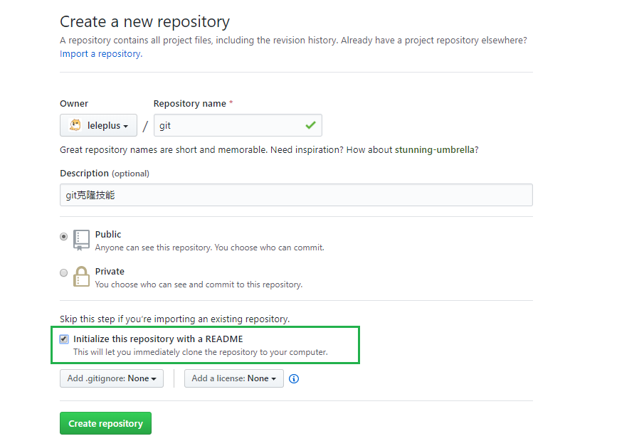

* 克隆仓库
```sh
$ git clone <地址> # 从远程仓库克隆
```
克隆地址
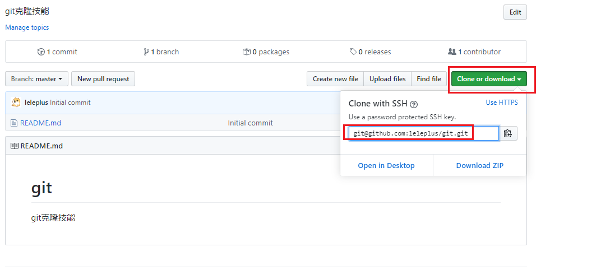

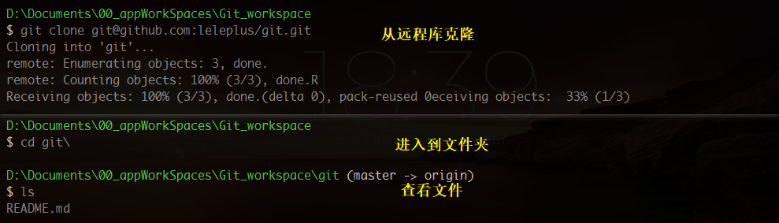

# 六、分支管理
你可以想象这么一个场景，老板创建了一个项目，项目里面有很多的模块，你负责模块A，你的某一个同时负责模块B，你们各司其职，当你们都写完自己的模块之后，再把A和B合并起来，这个A和B实际上就是两个分支，你们起始的文件都是相同的
## (一)、创建与合并分支
在之前的提交中，都只有一个分支,`master`(主分支)，`HEAD`指向的就是当前分支

* 创建分支
```sh
$ git checkout -b <branch>    # 创建并切换到创建的分支
$ git branch <branch>         # 创建分支
$ git checkout <branch>       # 切换分支
$ git branch                  # 查看当前分支
$ git merge <branch>          # 合并某分支到当前分支
$ git branch -d <branch>      # 删除某个分支
```

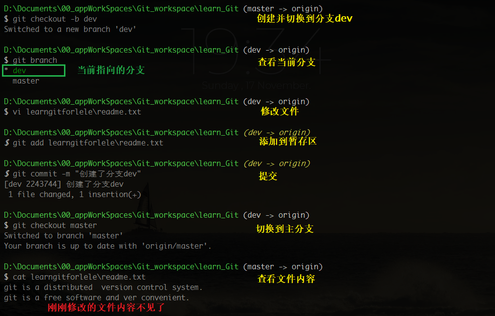

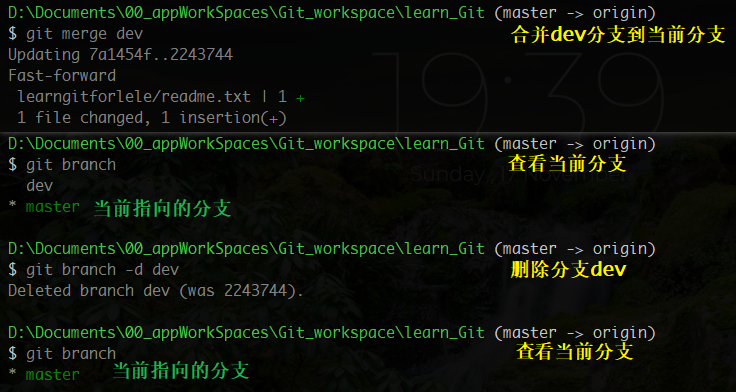

## (二)、解决冲突
当两个分支都修改了同一个文件，在执行快速合并的时候，就会出现冲突的现象

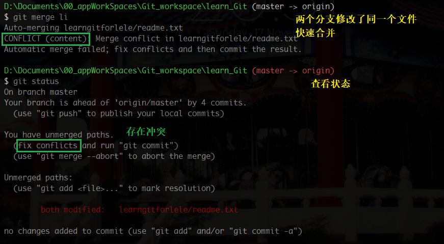

使用`cat`、`more`等任意查看命令查看文件内容，就能看到冲突的内容，git使用`<<<<<`和`>>>>>`标记不同分支的内容，使用`=======`来分隔不同分支的修改

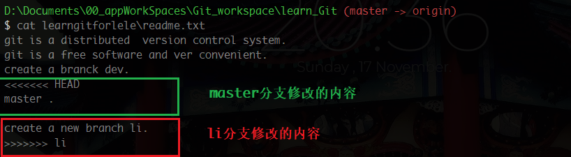

手动解决冲突后，再提交

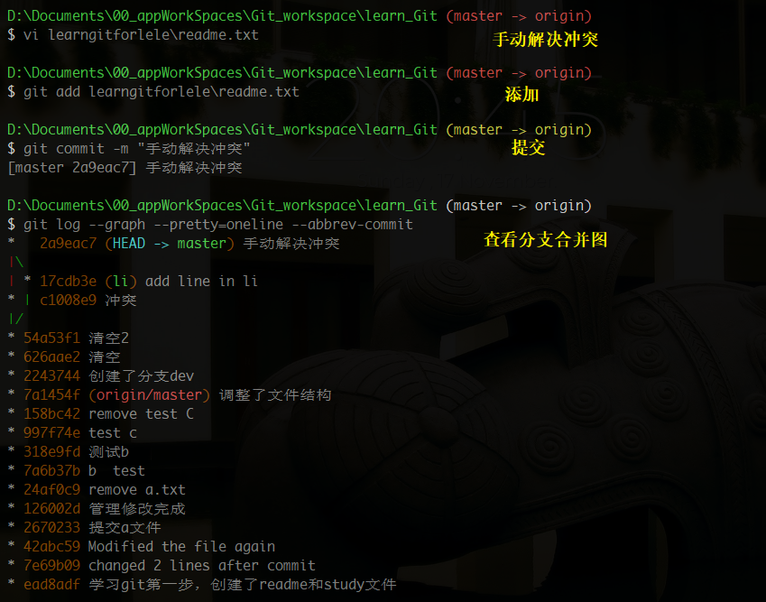

* 查看分支合并图
```sh
$ git log --graph --pretty=oneline --abbrev-commit  # 查看分支合并图(简略)
$ git log --graph   # 查看分支合并图
```

## (三)、分支管理
默认情况下的分支合并，使用命令`git merge`,git采用的是`Fast forward`模式，但这种模式下，删除分支后，会丢掉分支信息,使用命令`git log`看不到分支的合并信息。
强制禁用`Fast forward`模式,合并时需要加`--no-ff`参数,表示禁用`Fast forward`
```sh
$ git merge --no-ff -m "merge with no-ff" <branch> # 禁用`Fast forward`的合并同时添加描述(-m参数的作用)
```

忽略文件
http://www.gitignore.io

$ git config --global core.autocrlf false //禁用自动转换换行符

# 将远程仓库的内容合并到本地仓库
$ git pull  origin master

# 远程仓库和本地仓库完全独立
$ git pull origin master --allow-unrelated-histories

git 克隆代码时，网络特别慢，经常断连，提示`the remote end hung up unexpectedly`
增加最低速度时间
```bash
git config --global http.lowSpeedLimit 0
git config --global http.lowSpeedTime 999999
```
httpBuffer加大

git config --global http.postBuffer 524288000

压缩配置

git config --global core.compression -1

linux
```bash
export GIT_TRACE_PACKET=1
export GIT_TRACE=1
export GIT_CURL_VERBOSE=1
```
windows
```bash
set GIT_TRACE_PACKET=1
set GIT_TRACE=1
set GIT_CURL_VERBOSE=1
```

git 删除已经`git add`的文件 `git rm --cached *`
`git rm --f <file>`不仅会将文件从本地删除，还会将文件从暂存区删除

`git add`换行符问题
`git config --global core.autocrlf false` 提交和拉取代码时，均不转换换行符