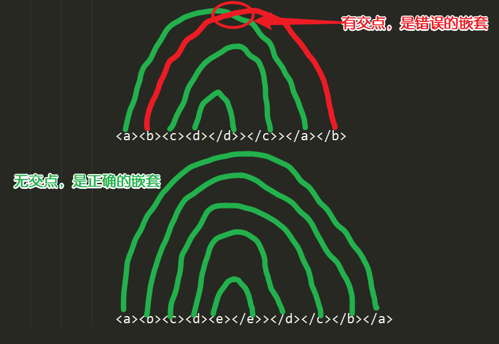

# XML笔记
------
作者:乐乐

## (一).`XML`概述
###  1.`XML`历史
1993年 `HTML`  超文本标记语言(HyperText Markup Language)
随着万维网的推广,出现了HTML语言,用于万维网上的页面展示数据,普通浏览器可以打开
1998年 `XML`   可扩展的标记语言(Extensible Markup Language)
`HTML`有不少的缺陷,`HTML`语言的标记不能自定义,`HTML`语言的标记本身不能用来描述数据,`HTML`语言的标记没有国际化(不同浏览器显示同一页面的效果可能不一样)
W3C组织在1998年推出了可扩展标记语言`XML`
`XML`语言的本身是用来替代`HTML`语言的,但是俩种语言还有一定差异的,所以中间出现了一种过渡的语言:`XHTML`
但实际上`XML`语言已经很难替代`HTML`语言了,因为`HTML`语言的使用在整个万维网上使用太广泛了。
###  2.`XML`概述
#### (1).为什么学习`XML`
<1>数据传输需要一定的格式
1>数据的可读性
2>将来的扩展
3>将来的维护
`XML`现在已经是业内传输数据的标准,它和语言无关
<2>配置文件,之前使用的`.properties`资源文件中描述的信息不丰富
<3>保存数据,充当小型的数据库
保存数据一般是使用数据库保存,或者使用一般的文件保存,这个时候也可以选择`XML`文件,因为`XML`可以描述复杂的数据关系。从普通文件中读取数据的速度肯定是比从数据库中读取数据的速度快,只不过这样不是很安全而已

#### (2).什么是`XML`
<1>`XML`指可扩展标记语言(EXtensible Markup Language). 
<2>`XML`是一种标记语言，很类似`HTML`. 
<3>`XML`的设计宗旨是有结构的保存数据，而非显示数据.
<4>`XML`保存数据，侧重的是数据的内容和组织结构.
<5>`XML`标签没有被预定义。需要自行定义标签.
<6>`XML`被设计为具有自我描述性.
<7>`XML`实现了国际化 internationalization(统一的表现形式)  `i18n` 
总结:有结构的保存数据-->很好的描述数据
#### (3).`XML`功能:
<1>保存数据
<2>描述数据
<3>传递数据
## (二).`xml`的语法
### 1.声明
`XML`文件的后缀为`.xml`
`XML`文本要求文件有一个头部声明: 用来告诉解析器一些相关信息
声明格式:`<?xml version="1.0" encoding="UTF-8"?>`
表明当前文件是`xml`文件,`XML`版本为`1.0`,文件内容使用的字符编码为`UTF-8`.
注意:要小心在系统中这个`xml`文件保存时候的编码,是否和文件内容中设置的编码一致
ANSI (American National Standards Institute)美国国家标准协会
ANSI编码 是这个协会组织制定的一种字符编码
ANSI编码在不同国家表示是不用的,中文操作系统中的ANSI编码是`GB2312`
### 2.元素
`xml`文件中的标记也可以叫标签、元素、节点。
#### (1).根元素`root`
每个`XML`文档必须有且只有一个根元素:`root`,格式:`<root></root>`
根元素是一个完全包括文档中其他所有元素的元素。
根元素的起始标记要放在所有其他元素的起始标记之前。
根元素的结束标记要放在所有其他元素的结束标记之后。
#### (2).元素的使用规则
`XML`元素指`XML`文件中出现的标签，一个标签分为`开始标签`和`结束标签`，一个标签有如下几种书写形式，例如:
包含标签体:`<a>www.baidu.com</a>`
不含标签体的：`<a></a>`, 可以简写为(空标签)：`<a/>`
#### (3).元素的嵌套规则
一个标签中也可以嵌套若干子标签。但所有标签必须合理的嵌套，绝对不允许交叉嵌套 ，例如：
错误的嵌套:`<a>你好!<b>程序员</a></b>` 
正确的嵌套:`<a>你好!<b>程序员</b></a>`
一般情况下，解析出来的标签都是一行，如何判断标签是否嵌套正确？
从一侧把对应标签的开始和结束连线，看是否有交点


#### (4).空格和换行
对于`XML`标签中出现的所有空格和换行，`XML`解析程序都会当作标签内容进行处理。例如：下面两段内容的意义是不一样的。
`<name>tom</name>`
```xml
<name>
	tom
</name>
```
由于在`XML`中，空格和换行都作为原始内容被处理，所以，在编写`XML`文件时，要特别注意。但是在一些封装好的解析方式中,是可以忽略掉这些空格和换行的.(例如在一些第三方提供的`jar`包中)
#### (5).标签命名规则
(1)以字母或下划线开头，
(2)由数字、字母、连接符号`-`、下划线`_`，点`.`组成，支持中文
(3)大小写敏感
(4)标签名不能包含空格 
(5)不能使用`W3C`的保留字
### 3.属性
```xml
<student id="100">
	<name>TOM</name>
</student>
<student id="101"/>
```
#### (1).属性值用双引号`""`或单引号`''`分隔,属性一定要有属性值
#### (2).一个元素可以有多个属性，它的基本格式为：
```xml
<元素名 属性名1="属性值" 属性名2=“属性值”>
</元素名>
```
#### (3).特定的属性名称在同一个元素标记中只能出现一次
#### (4).属性值不能包括`<`   ` >`  `&`
### 4.实体`entity`
`xml`文件中有些特殊的字符是不能直接表示出来的,例如:`>`,`<`,`''`,`""`. 
使用实体的格式: `&实体名字;`
#### (1).预定义字符实体
由`XML`规范预先定义好了,如下:
| 预定义实体 | 表示含义 |
| :--------: | :------: |
|   `&lt;`   |   `<`    |
|   `&gt;`   |   `>`    |
|  `&amp;`   |   `&`    |
|  `&quot;`  |   `"`    |
|  `&apos;`  |   `'`    |
#### (2).自定义实体 `ENTITY entity`
格式：
```xml
<!DOCTYPE 根元素名称[
	<!ENTITY 自定义实体名 "自定义实体内容">
]>
```
eg:
```xml
<!DOCTYPE 根元素[
	<!ENTITY company "杰普软件科技有限公司">
]>
<!--其中：company为实体名称
"杰普软件科技有限公司"是实体内容
实体的使用：-->
&company;
```
### 5.注释
```xml
<!-- 这是一个注释 -->
```
1.注释内容中不要出现`- -`；
2.不要把注释放在标记中间；`<Name <!--the name--> > TOM </Name>`
3.注释不能嵌套；
4.可以在除标记以外的任何地方放注释
### 6.解析`PCDATA`,非解析`CDATA`内容
#### (1)解析`PCDATA`
`PCDATA` (Parsed Character Data) 会被`xml`文档解析器解析的，但是有些特殊字符需要借助实体才可以被解析器解析。`XML`文件中的正常内容基本都是`PCDATA`
#### (2)非解析`CDATA`
`CDATA` (Character Data) 不会被`xml`文档解析器解析的，按字符串原样输出。有些内容不想让解析,按照内容原样输出就可以了,这种情况可以使用`CDATA`
格式：`<![CDATA[需要原样输出的字符串]]>`
### 7.处理指令`PI`
处理指令，简称`PI` （processing instruction）。处理指令用来指挥解析引擎如何解析`XML`文档内容。
例如，在`XML`文档中可以使用`xml-stylesheet`指令，通知`XML`解析引擎，使用`*.css`文件显示`xml`文档内容。
`<?xml-stylesheet type="text/css" href="css文件路径"?>`
处理指令必须以 `<? `作为开头，以` ?>` 作为结尾，`XML`文件的头部声明语句就是最常见的一种处理指令。 
`XML`文件中可以有多个处理指令
例如:`class.xml`文件:
```xml
<?xml version="1.0" encoding="UTF-8"?>
<?xml-stylesheet href="class.css" type="text/css"?>
<class>
	<student id="001">
		<name>张三</name>
		<age>20</age>
	</student>
	<student id="002">
		<name>李四</name>
		<age>20</age>
	</student>
</class>
```
`class.css`文件:
```css
name{
	font-size:30px;
	font-weight:bold;
	color:red;
}
age{
	font-size:30px;
	font-weight:bold;
	color:green;
}
```
符合语法规则的`xml`就是一个良构的`xml`
## (三).`xml`的命名空间
`XML`命名空间提供避免同一个项目中，多个`xml`文件中元素命名冲突的方法。
在`XML`中，元素名称是由开发者定义的，当有俩个相同的元素名，但是他们的含义是不同的时候，就会发生命名冲突。
```xml
<s:student></s:student>
<h:student></h:student>
```
这里的两个student标签是不同的两个student标签
通过使用前缀，我们创建了两种不同类型的` <student>` 元素。
命名空间使用注意
1)定义命名空间前缀，并应用在元素上，那么该元素下所有的子元素和属性都在该命名空间
```xml
<h:student xmlns:h="http://lele.com/h">
</h:student>
```
2)可以用xmlns定义默认命名空间，默认命名空间只作用于元素，不作用于属性
3)在根标签中可以定义命名空间前缀
多个命名空间前缀不能重名
多个命名空间前缀可以指向同一URI
```xml
<root xmlns:h="http://lele.com/h"
	xmlns:s="http://lele.com/s" >
    <h:student></h:student>
    <s:student></s:student>
</root>
```
4)判断元素、属性是否相同，除了要看命名空间前缀和元素名/属性名外，还要看命名空间前缀所指向的URI是否相同
## (四).`xml`的约束
在`XML`技术里，可以编写一个文档来约束一个`XML`文档的书写规范，这称之为`XML`约束。
### 1.需要`XML`约束的原因
`xml`由于是可扩展的标记语言,所以在`xml`文件中的编写太过于自由,这样在很多种情况下并不合适。
### 2.常用的约束技术
#### (1).`XML DTD`
`DTD`文件的后缀名为` .dtd`
定义：描述元素、属性和其他杂项在xml文档中的使用规则的说明
##### <1>`DTD`的目的
验证该xml文档是否是有效的xml文档
如果一个良构的xml文档满足了DTD的声明就是一个有效的xml文档。
注意：良构不一定有效，但是有效一定良构
##### <2>`DTD`文件独立的语法规范
1>定义一个xml文档的结构和顺序
2>用来限定验证xml文档的内容
3>强制xml文档的内容是一个合法的文档
4>可以包含在xml文档内部或者在一个独立的文件
5.DTD不描述允许出现在元素内部的数据
6>DTD不是基于xml的
7>可以被xml schame 覆盖
##### <3>`DTD`的分类
###### 1>内部的DTD
DTD和xml文档在同一个文件中
###### 2>外部的DTD
DTD和xml文档不在同一个文件中
引用外部`dtd`的时候又分为两种:
`SYSTEM`表示引用的dtd文件在本地 
格式:`<!DOCTYPE 根元素 SYSTEM "dtd路径">`
`PUBLIC`表示引用的`dtd`文件是一个公共的文件
格式:注意里面是可以加回车换行的
`<!DOCTYPE 根元素 PUBLIC "公有id" "路径">`
###### 3>混合的DTD
既有外部DTD，又有内部DTD
##### <4>`DTD`对xml约束的规则
###### 1>约束元素(标签)
约束的范围:标签出现的个数、顺序，哪些标签可以出现
格式：`<!ELEMENT  元素名 (内容模式)>`
内容模式
①`(#PCDATA)`：可以包含任何字符数据，但是不能在其中包含任何子元素
②`EMPTY`：元素不能包含子元素和文本（空元素）
③`ANY`：元素内容为任意的(主要是使用在元素内容不确定的情况下)
④修饰符：`()`,`|`,`+`,`*`,`?`,`,` 默认修饰符
`()` 来给元素分用组 
`|`  在列出的元素中选择一个 
`+` 该元素最少出现一次，可以出现多次 (1或n次)
`*`  该元素允许出现零次到任意多次（0到n次）
`?`  该元素可以出现，但只能出现一次 (0到1次)
`,`  对象必须按`,`分隔的顺序出现
注意：浏览器是非验证的解析器，不会验证xml的有效性
###### 2>约束属性
约束范围:什么属性可以出现是不是必须出现、属性的值可能是什么格式
格式
```xml
<!ATTLIST 标签名称
	属性名称    属性值类型    属性特点
	属性名称    属性值类型    属性特点
>
```
属性值类型
①`CDATA`：属性值可以是任何字符（包括数字和中文）
②`ID`：属性值必须唯一,属性值必须满足`xml`命名规则
③`IDREF/IDREFS`
`IDREF`属性的值指向文档中其它地方声明的ID类型的值。
`IDREFS`同`IDREF`，但是可以具有由空格分开的多个引用。
④`enumerated`：(`枚举值1|枚举值2|枚举值3...`),属性值必须在枚举值中
属性特点
①`#REQUIRED`：元素的所有实例都必须有该属性
②`#IMPLIED` ：属性可以不出现
③ `default-value`：属性可以不出现，并且当它不出现的时候是有默认值的，而该属性的默认值就是`atttibute-value`
④`#FIXED` ：属性可以不出现，但是如果出现的话必须是指定的属性值
###### 3>能否文本
就是一套关于元素、属性以及其他杂项在xml文档中使用规则的声明。
#### (2).`XML Schema`
`Schema`文件的后缀名为`.xsd`
`Schema`文件符合`xml`语法规范
注意：`DTD`文件和`Schema`文件的作用是一样的，都是对指定的`xml`文件中的元素及属性进行约束的，但是俩种文件中使用的语法不同
良构的`xml`要满足两个条件:有效的`xml`文件并且是有约束的`xml`.
`XML Schema`中提供了一些内置数据类型，而且还允许用户自己定义Simple Type(简单类型),Complex Type(复杂类型)
##### <1>XML Schema语法
`SimpleType`：定义一个对文本 的约束： 可以约束文本的取值范围，和只能取什么值。
语法：
```xml
<simpleType name="num">
	<restriction base="int"><!-- 基本类型为int   -->
		<minInclusive value="1"></minInclusive>
		<maxInclusive value="10"></maxInclusive>
	</restriction>
</simpleType>
```
文本/属性值:只能取值 1-10
使用 :  `<element name="b" type="tns:num"></element>`
表示该标签的文本域值 只能是1-10之间
```xml
<simpleType name="gender">
	<restriction base="string"><!-- 基本类型为string   -->
		<enumeration value="男"></enumeration>
		<enumeration value="女"></enumeration>
	</restriction>
</simpleType>
```
文本/属性值:只能取值 男 或 女
使用 :`<attribute name="name" type="tns:gender"></attribute>`
表示该属性只能取值男或女
##### <2>XML Schema约束
###### 1>对标签限定

```xml
<element name="标签名" type="string" minOccurs="1" maxOccurs="1">
</element>
```
`minOccus`:限定元素最少出现次数
`maxOccus`:限定元素最多出现次数

###### 2>对属性限定

```xml
<attribute name="attName" type="string" use="" default="" fixed="">
</attribute>
```
name 属性名
type 属性值类型
use取值:
①optional:表示属性可有可无
②required:表示属性必须要有
③prohibited:禁止的

## (五).`xml`的解析
### 1.XML解析
分为`dom`解析和`sax`解析
`dom`：(Document Object Model, 即文档对象模型) 是 W3C 组织推荐的处理 XML 的一种方式。
`sax`： (Simple API for XML) 不是官方标准，但它是 XML 社区事实上的标准(相当于是一个民间标准)，
几乎所有的 XML 解析器都支持它。
`dom`和`sax`都是一种模型/标准/理论,是需要其他人使用具体的代码去实现的
xml解析器就是用来对`dom`或者`sax`解析标准的具体实现
### 2.XML解析器
JAXP介绍(Java API for XMLProcessing)
JAXP 是J2SE的一部分，它由`javax.xml`、`org.w3c.dom`、`org.xml.sax` 包及其子包组成.
在`javax.xml.parsers` 包中，定义了几个工厂类，程序员调用这些工厂类，可以得到对`xml`文档进行解析的`DOM`或`SAX`的解析器对象。
### 3.`dom`解析
在使用`DOM`解析`XML`文档时，需要读取整个`XML`文档，在内存中构建代表整个`DOM`树的`Doucment`对象，从而再对`XML`文档进行操作。此种情况下，如果`XML`文档特别大，就会消耗计算机的大量内存，严重情况下可能还会导致内存溢出。
#### (1).获得JAXP中的DOM解析器
1>调用`DocumentBuilderFactory.newInstance()`方法得到创建`DOM`解析器的工厂。
2>调用工厂对象的`newDocumentBuilder`方法得到`DOM`解析器对象。
3>调用 DOM 解析器对象的`parse()`方法解析`XML`文档，得到代表整个文档的`Document`对象，就可以利用`DOM`特性对整个`XML`文档进行操作了。
#### (2)`dom`解析`xml`
例如:
```java
//获得生产DocumentBuilder对象的工厂实例
DocumentBuilderFactory factory = DocumentBuilderFactory.newInstance();
//通过工厂获得一个DocumentBuilder对象
DocumentBuilder builder = factory.newDocumentBuilder();
/*可选设置
如果xml中声明了对DTD的引用,用以下方式可以忽略掉DTD,否则会自动根据地址查找DTD
例如DTD中指定元素中有默认属性，即使这个时候xml中的元素里面没有写这个属性，解析的时候查找到DTD之后也会解析出默认属性
其实就是给builder设置一个自定义的实体解析器(匿名内部类)
*/
builder.setEntityResolver(new EntityResolver() {
	@Override
	public InputSource resolveEntity(String publicId, String systemId) throws SAXException, IOException {
		byte[] data = "<?xml version=\"1.0\" encoding=\"UTF-8\"?>".getBytes();
		return new InputSource(new ByteArrayInputStream(data));
	}
});
	
//注意以上代码也可以使用lambda表达式代替匿名内部类
documentBuilder.setEntityResolver((publicId, systemId) ->{
    byte[] data = "<?xml version=\"1.0\" encoding=\"UTF-8\"?>".getBytes();
    return new InputSource(new ByteArrayInputStream(data));
});
//获得Document对象,可以表示一个xml文档
Document document = builder.parse(fileName);
//获得根元素
//注意Document和Element都是Node的子接口
Element root = document.getDocumentElement();
//获得根元素下面的所有子元素
//注意回车换行也算是一个节点(文本节点)
//xml文件中主要是文本节点和元素节点
//我们要解析的值就在这些节点中
//这一步之后就是循环解析节点中的数据
NodeList rootChildNodes = root.getChildNodes();
for(int i=0;i<rootChildNodes.getLength();i++){
	Node node = childNodes.item(i);
	if(node.getNodeType() == Node.ELEMENT_NODE) {
		System.out.println("元素节点");
	}else if(node.getNodeType() == Node.TEXT_NODE) {
		System.out.println("文本节点");
	}
}
```
一个完整的无`dtd`的`xml`文件的解析步骤
```java
package XML.com.homework.day02.dom;

import javax.xml.parsers.DocumentBuilder;
import javax.xml.parsers.DocumentBuilderFactory;

import org.w3c.dom.Document;
import org.w3c.dom.Element;
import org.w3c.dom.NamedNodeMap;
import org.w3c.dom.Node;
import org.w3c.dom.NodeList;

public class DomTest {

	// 定义一个dom解析的方法，并传入xml文件的路径
	public void dom(String filePath) {

		// 创建DocumentBuilderFactory类的实例对象
		DocumentBuilderFactory builderFactory = DocumentBuilderFactory.newInstance();

		try {

			// 通过工厂创建出DocumentBuilder对象
			DocumentBuilder documentBuilder = builderFactory.newDocumentBuilder();

			// 通过DocumentBuilder对象，解析xml文件，并且获得document
			// document就是dom中的文档对象，用来表示被解析的xml文件
			Document document = documentBuilder.parse(filePath);

			// 获得根元素
			Element root = document.getDocumentElement();

			// 获得所有根元素的子节点(儿子节点)
			NodeList stut = root.getChildNodes();

			// 遍历儿子节点的内容
			for (int i = 0; i < stut.getLength(); i++) {

				// 拿到儿子节点的内容
				Node stuInfo = stut.item(i);
				// 获取当前元素节点中的属性

				// 判断儿子节点的儿子节点是元素还是文本
				switch (stuInfo.getNodeType()) {
				// 文本节点
				case Node.TEXT_NODE:
					break;
				// 元素节点
				case Node.ELEMENT_NODE:

					// 获取属性值sid
					NamedNodeMap attributes = stuInfo.getAttributes();

					Node sid = attributes.getNamedItem("sid");
					System.out.println(sid.getNodeName() + "=" + sid.getNodeValue());

					// 拿到stu的儿子节点
					NodeList stuInfoNext = stuInfo.getChildNodes();

					// 遍历stu的儿子节点
					for (int j = 0; j < stuInfoNext.getLength(); j++) {

						// 遍历stu的所有儿子内容（节点）
						Node stuNextInfo = stuInfoNext.item(j);

						// 确认拿到元素节点
						if (stuNextInfo.getNodeType() == Node.ELEMENT_NODE) {
							// 拿到元素和元素值

							// 不是address节点，就把节点名和值打印出来
							if (!"address".equals(stuNextInfo.getNodeName()))
								System.out.println(stuNextInfo.getNodeName() + " : " + stuNextInfo.getTextContent());
							else {

								// 这里一定是address节点
								NodeList address = stuNextInfo.getChildNodes();
								// 遍历address节点
								for (int k = 0; k < address.getLength(); k++) {
									Node addressInfo = address.item(k);

									// 如果是下一个节点

									if (addressInfo.getNodeType() == Node.ELEMENT_NODE) {
										// 把具体的地址节点打印出来

										System.out.println(addressInfo.getTextContent());

									}
								}
							}

						}
					}

					break;

				default:
					throw new RuntimeException("解析到意外的节点类型:" + stuInfo);
				}

			}

		} catch (Exception e) {
			// TODO Auto-generated catch block
			e.printStackTrace();
		}

	}

	public static void main(String[] args) {
		// 定义一个xml文件路径字符串
		String filePath = "src/XML/com/homework/day02/dom/student.xml";
		// 对象调用方法，传入路径
		new DomTest().dom(filePath);

	}

}
```
#### (3)`dom`创建`xml`
创建或更新`document`对象后，还可以将`document`对象转换为`xml`文件
例如：创建新文档
```java
DocumentBuilderFactory factory = DocumentBuilderFactory.newInstance();
DocumentBuilder documentBuilder = factory.newDocumentBuilder();
Document document = documentBuilder.newDocument();
Element root = document.createElement("student");
document.appendChild(root);
```
例如：将`document`写出去转为`xml`
```java
//得到TransformerFactory工厂实例
TransformerFactory tff = TransformerFactory.newInstance();
//通过工厂得到一个转换器
Transformer tf = tff.newTransformer();
//设置编码
transformer.setOutputProperty(OutputKeys.ENCODING, "UTF-8");
//设置xml是否是独立的xml文件，yes表示xml是独立的，不关联DTD，no表示不独立，关联外部一个DTD
transformer.setOutputProperty(OutputKeys.INDENT, "yes");

//把一个document转换成对应的xml文件
tf.transform(new DOMSource(document), new StreamResult(fileName));
```
### 4.`dom4j`解析
`dom4j`介绍网址:https://dom4j.github.io/
`Dom4j`是一个简单、灵活的开放源代码的库。`Dom4j`是由早期开发JDOM的人分离出来而后独立开发的。与JDOM不同的是，dom4j使用接口和抽象基类，虽然Dom4j的API相对要复杂一些，但它提供了比JDOM更好的灵活性。
`Dom4j`是一个非常优秀的Java XML API，具有性能优异、功能强大和极易使用的特点。现在很多软件采用的Dom4j，例如Hibernate，包括sun公司自己的JAXP也用了Dom4j。

使用`Dom4j`开发，需下载`dom4j`相应的jar文件。
`DOM4j`中，获得`Document`对象的方式有三种：
1>读取XML文件,获得`document`对象            
```java
SAXReader reader = new SAXReader();             
Document document = reader.read(new File(“src/input.xml"));
```
2>解析XML形式的文本,得到document对象.
```java
String text = "<members></members>";             
Document document = DocumentHelper.parseText(text);
```
3>主动创建document对象.
```java
Document document = DocumentHelper.createDocument();            
//创建根节点
Element root = document.addElement("members");
```

一个完整的`Dom4j`解析代码
```java
package XML.com.homework.day02.dom4j;

import java.util.ArrayList;
import java.util.Arrays;
import java.util.List;

import org.dom4j.Attribute;
import org.dom4j.Document;
import org.dom4j.DocumentException;
import org.dom4j.Element;
import org.dom4j.io.SAXReader;

@SuppressWarnings("all")
public class Dom4j {
	// 两个静态共享实例对象
	private static Student student = null;
	private static Address newAddress = null;

	// 接收一个xml地址，并返回list集合
	public List<Student> dom4jParse(String filePath) {
		// 创建一个list集合，存放Student对象
		List<Student> list = new ArrayList<>();
		// 新建SAXReader的对象
		SAXReader r = new SAXReader();
		// 读XML文件，创建出document对象
		try {
			// 读xml文件，创建出一个document对象
			Document doc = r.read(filePath);

			// 拿到根节点
			Element root = doc.getRootElement();

			// 拿到所有的stu标签
			List<Element> stuAll = root.elements("stu");

			// 遍历所有的stu标签
			for (Element stuInfo : stuAll) {
				// 拿到sid元素
				String sid = stuInfo.attribute("sid").getValue();
				// 拿到first_name元素
				String first_name = stuInfo.element("first_name").getTextTrim();
				// 拿到last_name元素
				String last_name = stuInfo.element("last_name").getTextTrim();
				// 拿到age元素
				String age = stuInfo.element("age").getTextTrim();
				// 拿到gender元素
				String gender = stuInfo.element("gender").getTextTrim();

				// 拿到address元素
				List<Element> address = stuInfo.elements("address");
				// 遍历address标签
				for (Element addressInfo : address) {
					// 分别拿到三个元素
					String city = addressInfo.element("city").getTextTrim();
					String street = addressInfo.element("street").getTextTrim();
					String zip = addressInfo.element("zip").getTextTrim();

					// 把address地址信息放到address对象里
					newAddress = new Address(city, street, zip);
				}
				// 把student字段放到student对象里
				student = new Student(sid, first_name, last_name, Integer.parseInt(age), gender, newAddress);

				// 把对象放到集合里
				list.add(student);
			}

		} catch (DocumentException e) {
			e.printStackTrace();
		}
		// 返回一个集合
		return list;

	}

	public static void main(String[] args) throws DocumentException {

		// 创建一个类，用来调用方法
		Dom4j dom4j = new Dom4j();

		// 定义一个字符创变量，接收xml文件地址
		String filePath = "src/XML/com/homework/day02/dom4j/student.xml";

		// 对象调用方法，传入文件地址,并接收返回的对象集合
		List<Student> list = dom4j.dom4jParse(filePath);

		// 将返回的对象集合遍历并打印出来
		for (Student student : list) {
			// 把对象打印出来
			System.out.println(student);
		}

	}

}
```
### 5.`SAX`解析
`SAX`解析允许在读取文档的时候，即对文档进行处理，而不必等到整个文档装载完才会文档进行操作。
`sax`解析器在发现`xml`文档中的内容时就会调用你重写之后的方法. 如何处理这些内容，由程序员自己决定。
在基于`sax`的程序中,有五个最常用sax事件
注意：继承`DefaultHandler`类，重写以下方法即可。
`startDocument()` ---> 解析器发现了文档的开始标签
`endDocument()`   ---> 解析器发现了文档结束标签
`startElement()`  ---> 解析器发现了一个起始标签
`character()`     ---> 解析器发现了标签里面的文本值
`endElement()`    ---> 解析器发现了一个结束标签
`SAX`采用事件处理的方式解析XML文件，利用 SAX 解析 XML 文档，涉及两个部分：解析器和事件处理器：
解析器可以使用JAXP的API创建，创建出SAX解析器后，就可以指定解析器去解析某个XML文档。

解析器采用SAX方式在解析某个XML文档时，它只要解析到XML文档的一个组成部分，都会去调用事件处理器的一个方法，
解析器在调用事件处理器的方法时，会把当前解析到的xml文件内容作为方法的参数传递给事件处理器。
事件处理器由程序员编写，程序员通过事件处理器中方法的参数，就可以很轻松地得到sax解析器解析到的数据，
从而可以决定如何对数据进行处理。

`SAX`解析的步骤

```java
//使用SAXParserFactory创建SAX解析工厂
SAXParserFactory spf = SAXParserFactory.newInstance();
//通过SAX解析工厂得到解析器对象	
SAXParser sp = spf.newSAXParser();
//将解析对象和事件处理器对象关联
sp.parse("src/class.xml", new DefaultHandler(){
	//调用五个方法
});
```
一个完整的`SAX`解析实例
```java
package XML.com.homework.day02.sax;

import java.io.IOException;

import javax.xml.parsers.ParserConfigurationException;
import javax.xml.parsers.SAXParser;
import javax.xml.parsers.SAXParserFactory;

import org.xml.sax.Attributes;
import org.xml.sax.SAXException;
import org.xml.sax.helpers.DefaultHandler;

public class Sax {

	// 创建一个sax方法，传入xml文件路径
	public void sacParse(String filePath) {

		// 获取SAXParserFactory的工厂类对象
		SAXParserFactory saxParserFactory = SAXParserFactory.newInstance();

		try {
			// 使用工厂类对象，创建出SAX解析器
			SAXParser saxParser = saxParserFactory.newSAXParser();

			// 解析XMl文件，重写DefaultHandler类中的方法，进行事件处理
			saxParser.parse(filePath, new DefaultHandler() {

				// 当解析器开始解析文档时，调用该方法
				@Override
				public void startDocument() throws SAXException {
					System.out.println("开始解析XML文档");
				}

				// 解析器解析完时，调用该方法
				@Override
				public void endDocument() throws SAXException {
					System.out.println("结束解析XML文档");
				}

				// 解析到开始标签时调用该方法
				// qName标签名 attributes属性
				@Override
				public void startElement(String uri, String localName, String qName, Attributes attributes)
						throws SAXException {
					if (attributes.getLength() > 0) {
						for (int i = 0; i < attributes.getLength(); i++) {
							System.out.println("-------------------");
							// 打印出元素的属性名和属性值
							System.out.println(attributes.getQName(i) + "=" + attributes.getValue(i));
						}
					}

				}

				// 解析到结束标签的时候调用该方法
				@Override
				public void endElement(String uri, String localName, String qName) throws SAXException {
				}

				// 解析到文本值，调用该方法
				@Override
				public void characters(char[] ch, int start, int length) throws SAXException {
					String str = new String(ch, start, length);
					//去除文本值的空格和空行
					if (!"".equals(str.trim())) {
						//把文本值打印出来
						System.out.println(str);
					}
				}
			});

		} catch (Exception e) {
			e.printStackTrace();
		}

	}

	public static void main(String[] args) throws ParserConfigurationException, SAXException, IOException {
		//xml文件路径的字符串
		String filePath = "src/XML/com/homework/day02/sax/student.xml";

		//对象调用方法，把文件路径传过去
		new Sax().sacParse(filePath);

	}
}
```


